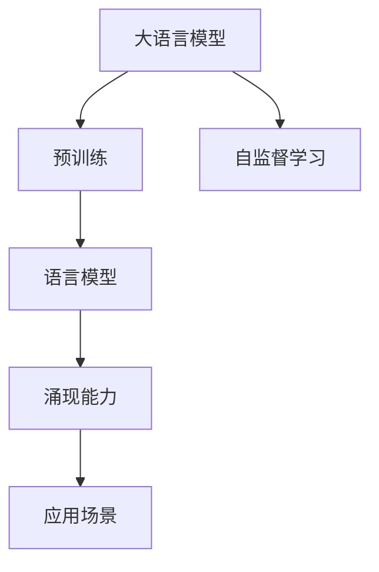

                 

# 涌现能力: 语言理解与生成

## 1. 背景介绍

### 1.1 问题由来
语言是人类文明进步的重要标志之一，它不仅仅是一种沟通工具，更是人类智慧的体现。近年来，随着人工智能技术的飞速发展，尤其是深度学习和大语言模型的涌现，我们对于语言的理解和生成能力得到了显著提升。大语言模型，如GPT系列、BERT等，通过大规模语料库的预训练，已经能够在各种语言理解和生成任务上达到甚至超过人类专家的水平。

这一进步不仅为自然语言处理(Natural Language Processing, NLP)领域带来了革命性的变化，也为我们探索人工智能的涌现能力提供了新的视角。涌现能力，即在特定条件下，简单组件通过相互交互形成的复杂现象，是大规模复杂系统的重要特征。在语言理解与生成领域，涌现能力体现在语言模型能够理解并生成符合语法规则和语义连贯性的自然语言。

### 1.2 问题核心关键点
大语言模型的涌现能力来源于其丰富的语言知识库和自监督预训练方法。语言模型的涌现能力，不仅仅体现在其精确的语法理解和语义表达上，更在于其对上下文信息的把握和推理能力，以及跨领域知识的应用和迁移能力。因此，理解大语言模型的涌现能力，对于提升其语言理解和生成性能，以及扩展其在更多领域的应用，具有重要意义。

本文将从语言模型的核心概念、涌现能力的原理与实现、具体应用场景等方面，系统性地探讨大语言模型的涌现能力。通过对这些关键点的深入分析，我们希望能够为未来的语言理解和生成技术的进一步发展提供有益的参考。

## 2. 核心概念与联系

### 2.1 核心概念概述

为更好地理解大语言模型的涌现能力，我们首先需要介绍几个核心概念：

- **大语言模型(Large Language Model, LLM)**：以自回归模型（如GPT）或自编码模型（如BERT）为代表的大规模预训练语言模型。通过在大规模无标签文本语料上进行预训练，学习通用的语言表示，具备强大的语言理解和生成能力。
- **预训练(Pre-training)**：指在大规模无标签文本语料上，通过自监督学习任务训练通用语言模型的过程。常见的预训练任务包括言语建模、遮挡语言模型等。
- **自监督学习(Self-supervised Learning)**：指在没有明确标签的数据上，通过设计一些自监督任务，让模型自主学习语言知识，提高模型的泛化能力。
- **语言模型(Language Model)**：用于预测一段文本中下一个词汇的模型，可以用于计算文本的概率，从而用于文本生成、语言推理等任务。
- **涌现能力(Emergent Ability)**：指在简单组件的相互作用下，系统能够表现出的复杂现象。在大语言模型中，涌现能力体现在其对复杂语言现象的识别和生成上。

这些核心概念之间的逻辑关系可以通过以下Mermaid流程图来展示：



这个流程图展示了大语言模型的核心概念及其之间的关系：

1. 大语言模型通过预训练获得基础能力。
2. 自监督学习在大规模无标签数据上训练，使得模型能够自主学习语言知识。
3. 语言模型用于计算文本的概率，并可以用于文本生成、语言推理等任务。
4. 涌现能力在大语言模型中体现为对复杂语言现象的识别和生成。

这些概念共同构成了大语言模型的涌现能力的框架，使其能够在各种场景下表现出色。

## 3. 核心算法原理 & 具体操作步骤
### 3.1 算法原理概述

大语言模型的涌现能力，主要来源于其丰富的语言知识库和自监督预训练方法。语言模型的涌现能力，不仅仅体现在其精确的语法理解和语义表达上，更在于其对上下文信息的把握和推理能力，以及跨领域知识的应用和迁移能力。

### 3.2 算法步骤详解

大语言模型涌现能力的实现，主要包括以下几个关键步骤：

**Step 1: 准备预训练模型和数据集**
- 选择合适的预训练语言模型 $M_{\theta}$ 作为初始化参数，如 GPT、BERT 等。
- 准备大规模无标签文本数据集 $D$，如 Wikipedia、新闻语料库等。

**Step 2: 设计自监督学习任务**
- 设计一些自监督学习任务，如掩码语言模型(Masked Language Modeling, MLM)、下一句预测任务(Next Sentence Prediction, NSP)等，使得模型能够在无标签数据上自主学习语言知识。
- 在大规模无标签数据集 $D$ 上训练模型 $M_{\theta}$，更新其参数，使其能够在语言知识库上取得较好的性能。

**Step 3: 设计任务适配层**
- 根据具体任务类型，设计合适的任务适配层，如分类器、生成器等。
- 将预训练模型 $M_{\theta}$ 的顶层作为任务适配层的输入，通过添加特定的输出层和损失函数，使其能够适应特定任务。

**Step 4: 执行监督学习**
- 准备下游任务的标注数据集 $D_{task}$，划分为训练集、验证集和测试集。
- 在预训练模型 $M_{\theta}$ 的顶层添加任务适配层，在标注数据集 $D_{task}$ 上进行有监督的微调，最小化损失函数 $\mathcal{L}$，使得模型在特定任务上表现更好。

**Step 5: 测试和评估**
- 在测试集上评估微调后的模型 $M_{\hat{\theta}}$ 的性能，对比微调前后的精度提升。
- 使用微调后的模型进行语言理解和生成任务，评估其涌现能力。

以上是实现大语言模型涌现能力的主要步骤。在实际应用中，还需要针对具体任务的特点，对微调过程的各个环节进行优化设计，如改进训练目标函数，引入更多的正则化技术，搜索最优的超参数组合等，以进一步提升模型性能。

### 3.3 算法优缺点

大语言模型涌现能力的实现方法具有以下优点：

1. **高效性**：大语言模型能够快速在无标签数据上进行预训练，学习通用的语言知识，之后通过少量标注数据进行微调，能够显著提升模型在特定任务上的表现。
2. **泛化能力强**：通过自监督学习任务在大规模无标签数据上训练，模型能够学习到通用的语言特征，具备较好的泛化能力。
3. **适应性广**：大语言模型能够应用于各种自然语言处理任务，如语言推理、文本生成、问答系统等，适应性强。
4. **可扩展性好**：随着预训练数据规模的增大，模型的涌现能力可以进一步提升。

同时，该方法也存在一定的局限性：

1. **对标注数据的依赖**：微调过程仍然需要标注数据，标注成本较高。
2. **模型复杂度高**：大语言模型参数量巨大，训练和推理过程中需要较高的计算资源。
3. **可解释性差**：大语言模型通常被视为黑盒系统，难以解释其内部的推理过程。
4. **伦理和安全问题**：大语言模型可能学习到有害信息，需要额外的监督和伦理保障。

尽管存在这些局限性，但就目前而言，基于自监督预训练和监督微调的涌现能力实现方法仍然是大语言模型应用的主流范式。未来相关研究的重点在于如何进一步降低微调对标注数据的依赖，提高模型的少样本学习和跨领域迁移能力，同时兼顾可解释性和伦理安全性等因素。

### 3.4 算法应用领域

基于大语言模型涌现能力的实现方法，已经在自然语言处理(NLP)领域得到了广泛的应用，覆盖了几乎所有常见任务，例如：

- **文本分类**：如情感分析、主题分类、意图识别等。通过微调使模型学习文本-标签映射。
- **命名实体识别**：识别文本中的人名、地名、机构名等特定实体。通过微调使模型掌握实体边界和类型。
- **关系抽取**：从文本中抽取实体之间的语义关系。通过微调使模型学习实体-关系三元组。
- **问答系统**：对自然语言问题给出答案。将问题-答案对作为微调数据，训练模型学习匹配答案。
- **机器翻译**：将源语言文本翻译成目标语言。通过微调使模型学习语言-语言映射。
- **文本摘要**：将长文本压缩成简短摘要。将文章-摘要对作为微调数据，使模型学习抓取要点。
- **对话系统**：使机器能够与人自然对话。将多轮对话历史作为上下文，微调模型进行回复生成。

除了上述这些经典任务外，大语言模型涌现能力的应用还在不断扩展，如可控文本生成、常识推理、代码生成、数据增强等，为NLP技术带来了全新的突破。

## 4. 数学模型和公式 & 详细讲解  
### 4.1 数学模型构建

本节将使用数学语言对大语言模型涌现能力的实现进行更加严格的刻画。

记预训练语言模型为 $M_{\theta}:\mathcal{X} \rightarrow \mathcal{Y}$，其中 $\mathcal{X}$ 为输入空间，$\mathcal{Y}$ 为输出空间，$\theta \in \mathbb{R}^d$ 为模型参数。假设无标签数据集为 $D=\{(x_i)\}_{i=1}^N, x_i \in \mathcal{X}$。

定义自监督学习任务为 $T_{\text{unsupervised}}$，则自监督学习过程的目标是最小化经验风险：

$$
\mathcal{L}_{\text{unsupervised}}(\theta) = \frac{1}{N}\sum_{i=1}^N \ell(M_{\theta}(x_i),x_i)
$$

其中 $\ell$ 为自监督任务的损失函数，用于衡量模型输出与真实输入之间的差异。常见的自监督任务包括掩码语言模型和下一句预测任务，其损失函数分别为：

$$
\ell_{\text{MLM}}(M_{\theta}(x), x) = -\sum_{i=1}^{|\text{vocab}|} y_i \log P_{M_{\theta}}(x_i | x)
$$

$$
\ell_{\text{NSP}}(M_{\theta}(x), x) = -\log P_{M_{\theta}}(x_{i+1} | x_i, x)
$$

其中 $y_i$ 为掩码位置，$P_{M_{\theta}}$ 为模型在位置 $i$ 的概率分布。

### 4.2 公式推导过程

以下我们以掩码语言模型为例，推导自监督学习的数学过程。

假设模型 $M_{\theta}$ 在输入 $x$ 上的输出为 $\hat{x}=M_{\theta}(x) \in [0,1]$，表示模型预测的概率分布。无标签数据集 $D$ 的掩码位置为 $y_i$，则掩码语言模型的损失函数为：

$$
\ell_{\text{MLM}}(M_{\theta}(x), x) = -\sum_{i=1}^{|\text{vocab}|} y_i \log P_{M_{\theta}}(x_i | x)
$$

将其代入经验风险公式，得：

$$
\mathcal{L}_{\text{unsupervised}}(\theta) = -\frac{1}{N}\sum_{i=1}^N \sum_{j=1}^{|\text{vocab}|} y_i \log P_{M_{\theta}}(x_i | x)
$$

根据链式法则，损失函数对参数 $\theta_k$ 的梯度为：

$$
\frac{\partial \mathcal{L}_{\text{unsupervised}}(\theta)}{\partial \theta_k} = -\frac{1}{N}\sum_{i=1}^N \sum_{j=1}^{|\text{vocab}|} \frac{y_i}{P_{M_{\theta}}(x_i | x)} \frac{\partial P_{M_{\theta}}(x_i | x)}{\partial \theta_k}
$$

其中 $\frac{\partial P_{M_{\theta}}(x_i | x)}{\partial \theta_k}$ 可进一步递归展开，利用自动微分技术完成计算。

在得到损失函数的梯度后，即可带入参数更新公式，完成模型的迭代优化。重复上述过程直至收敛，最终得到适应无标签数据集 $D$ 的预训练模型参数 $\theta^*$。

## 5. 项目实践：代码实例和详细解释说明
### 5.1 开发环境搭建

在进行微调实践前，我们需要准备好开发环境。以下是使用Python进行PyTorch开发的环境配置流程：

1. 安装Anaconda：从官网下载并安装Anaconda，用于创建独立的Python环境。

2. 创建并激活虚拟环境：
```bash
conda create -n pytorch-env python=3.8 
conda activate pytorch-env
```

3. 安装PyTorch：根据CUDA版本，从官网获取对应的安装命令。例如：
```bash
conda install pytorch torchvision torchaudio cudatoolkit=11.1 -c pytorch -c conda-forge
```

4. 安装Transformers库：
```bash
pip install transformers
```

5. 安装各类工具包：
```bash
pip install numpy pandas scikit-learn matplotlib tqdm jupyter notebook ipython
```

完成上述步骤后，即可在`pytorch-env`环境中开始微调实践。

### 5.2 源代码详细实现

下面我们以文本分类任务为例，给出使用Transformers库对BERT模型进行微调的PyTorch代码实现。

首先，定义文本分类任务的数据处理函数：

```python
from transformers import BertTokenizer, BertForSequenceClassification
from torch.utils.data import Dataset, DataLoader
import torch

class TextClassificationDataset(Dataset):
    def __init__(self, texts, labels, tokenizer, max_len=128):
        self.texts = texts
        self.labels = labels
        self.tokenizer = tokenizer
        self.max_len = max_len
        
    def __len__(self):
        return len(self.texts)
    
    def __getitem__(self, item):
        text = self.texts[item]
        label = self.labels[item]
        
        encoding = self.tokenizer(text, return_tensors='pt', max_length=self.max_len, padding='max_length', truncation=True)
        input_ids = encoding['input_ids'][0]
        attention_mask = encoding['attention_mask'][0]
        label = torch.tensor(label, dtype=torch.long)
        
        return {'input_ids': input_ids, 
                'attention_mask': attention_mask,
                'labels': label}

# 加载预训练的BERT模型和分词器
model = BertForSequenceClassification.from_pretrained('bert-base-cased', num_labels=2)
tokenizer = BertTokenizer.from_pretrained('bert-base-cased')

# 准备数据集
train_dataset = TextClassificationDataset(train_texts, train_labels, tokenizer)
dev_dataset = TextClassificationDataset(dev_texts, dev_labels, tokenizer)
test_dataset = TextClassificationDataset(test_texts, test_labels, tokenizer)

# 设置优化器
optimizer = torch.optim.Adam(model.parameters(), lr=2e-5)

# 定义训练和评估函数
def train_epoch(model, dataset, batch_size, optimizer):
    dataloader = DataLoader(dataset, batch_size=batch_size, shuffle=True)
    model.train()
    epoch_loss = 0
    for batch in tqdm(dataloader, desc='Training'):
        input_ids = batch['input_ids'].to(device)
        attention_mask = batch['attention_mask'].to(device)
        labels = batch['labels'].to(device)
        model.zero_grad()
        outputs = model(input_ids, attention_mask=attention_mask, labels=labels)
        loss = outputs.loss
        epoch_loss += loss.item()
        loss.backward()
        optimizer.step()
    return epoch_loss / len(dataloader)

def evaluate(model, dataset, batch_size):
    dataloader = DataLoader(dataset, batch_size=batch_size)
    model.eval()
    preds, labels = [], []
    with torch.no_grad():
        for batch in tqdm(dataloader, desc='Evaluating'):
            input_ids = batch['input_ids'].to(device)
            attention_mask = batch['attention_mask'].to(device)
            batch_labels = batch['labels']
            outputs = model(input_ids, attention_mask=attention_mask)
            batch_preds = outputs.logits.argmax(dim=1).to('cpu').tolist()
            batch_labels = batch_labels.to('cpu').tolist()
            for pred, label in zip(batch_preds, batch_labels):
                preds.append(pred.item())
                labels.append(label.item())
                
    print(classification_report(labels, preds))

# 训练和评估
epochs = 5
batch_size = 16

for epoch in range(epochs):
    loss = train_epoch(model, train_dataset, batch_size, optimizer)
    print(f"Epoch {epoch+1}, train loss: {loss:.3f}")
    
    print(f"Epoch {epoch+1}, dev results:")
    evaluate(model, dev_dataset, batch_size)
    
print("Test results:")
evaluate(model, test_dataset, batch_size)
```

以上就是使用PyTorch对BERT进行文本分类任务微调的完整代码实现。可以看到，得益于Transformers库的强大封装，我们可以用相对简洁的代码完成BERT模型的加载和微调。

### 5.3 代码解读与分析

让我们再详细解读一下关键代码的实现细节：

**TextClassificationDataset类**：
- `__init__`方法：初始化文本、标签、分词器等关键组件。
- `__len__`方法：返回数据集的样本数量。
- `__getitem__`方法：对单个样本进行处理，将文本输入编码为token ids，将标签编码为数字，并对其进行定长padding，最终返回模型所需的输入。

**model参数和optimizer**：
- 使用预训练的BERT模型和Adam优化器进行微调，设置合适的学习率。

**训练和评估函数**：
- 使用PyTorch的DataLoader对数据集进行批次化加载，供模型训练和推理使用。
- 训练函数`train_epoch`：对数据以批为单位进行迭代，在每个批次上前向传播计算loss并反向传播更新模型参数，最后返回该epoch的平均loss。
- 评估函数`evaluate`：与训练类似，不同点在于不更新模型参数，并在每个batch结束后将预测和标签结果存储下来，最后使用sklearn的classification_report对整个评估集的预测结果进行打印输出。

**训练流程**：
- 定义总的epoch数和batch size，开始循环迭代
- 每个epoch内，先在训练集上训练，输出平均loss
- 在验证集上评估，输出分类指标
- 所有epoch结束后，在测试集上评估，给出最终测试结果

可以看到，PyTorch配合Transformers库使得BERT微调的代码实现变得简洁高效。开发者可以将更多精力放在数据处理、模型改进等高层逻辑上，而不必过多关注底层的实现细节。

当然，工业级的系统实现还需考虑更多因素，如模型的保存和部署、超参数的自动搜索、更灵活的任务适配层等。但核心的微调范式基本与此类似。

## 6. 实际应用场景
### 6.1 智能客服系统

基于大语言模型涌现能力的对话技术，可以广泛应用于智能客服系统的构建。传统客服往往需要配备大量人力，高峰期响应缓慢，且一致性和专业性难以保证。而使用涌现能力的对话模型，可以7x24小时不间断服务，快速响应客户咨询，用自然流畅的语言解答各类常见问题。

在技术实现上，可以收集企业内部的历史客服对话记录，将问题和最佳答复构建成监督数据，在此基础上对预训练对话模型进行微调。微调后的对话模型能够自动理解用户意图，匹配最合适的答案模板进行回复。对于客户提出的新问题，还可以接入检索系统实时搜索相关内容，动态组织生成回答。如此构建的智能客服系统，能大幅提升客户咨询体验和问题解决效率。

### 6.2 金融舆情监测

金融机构需要实时监测市场舆论动向，以便及时应对负面信息传播，规避金融风险。传统的人工监测方式成本高、效率低，难以应对网络时代海量信息爆发的挑战。基于涌现能力的文本分类和情感分析技术，为金融舆情监测提供了新的解决方案。

具体而言，可以收集金融领域相关的新闻、报道、评论等文本数据，并对其进行主题标注和情感标注。在此基础上对预训练语言模型进行微调，使其能够自动判断文本属于何种主题，情感倾向是正面、中性还是负面。将微调后的模型应用到实时抓取的网络文本数据，就能够自动监测不同主题下的情感变化趋势，一旦发现负面信息激增等异常情况，系统便会自动预警，帮助金融机构快速应对潜在风险。

### 6.3 个性化推荐系统

当前的推荐系统往往只依赖用户的历史行为数据进行物品推荐，无法深入理解用户的真实兴趣偏好。基于涌现能力的个性化推荐系统可以更好地挖掘用户行为背后的语义信息，从而提供更精准、多样的推荐内容。

在实践中，可以收集用户浏览、点击、评论、分享等行为数据，提取和用户交互的物品标题、描述、标签等文本内容。将文本内容作为模型输入，用户的后续行为（如是否点击、购买等）作为监督信号，在此基础上微调预训练语言模型。微调后的模型能够从文本内容中准确把握用户的兴趣点。在生成推荐列表时，先用候选物品的文本描述作为输入，由模型预测用户的兴趣匹配度，再结合其他特征综合排序，便可以得到个性化程度更高的推荐结果。

### 6.4 未来应用展望

随着大语言模型涌现能力的发展，基于涌现能力的语言理解和生成技术将进一步拓展其应用范围，为更多领域带来变革性影响。

在智慧医疗领域，基于涌现能力的医疗问答、病历分析、药物研发等应用将提升医疗服务的智能化水平，辅助医生诊疗，加速新药开发进程。

在智能教育领域，涌现能力可应用于作业批改、学情分析、知识推荐等方面，因材施教，促进教育公平，提高教学质量。

在智慧城市治理中，涌现能力可用于城市事件监测、舆情分析、应急指挥等环节，提高城市管理的自动化和智能化水平，构建更安全、高效的未来城市。

此外，在企业生产、社会治理、文娱传媒等众多领域，基于涌现能力的智能应用也将不断涌现，为经济社会发展注入新的动力。相信随着技术的日益成熟，涌现能力必将引领NLP技术的进一步发展，深刻影响人类的生产生活方式。

## 7. 工具和资源推荐
### 7.1 学习资源推荐

为了帮助开发者系统掌握大语言模型涌现能力的理论基础和实践技巧，这里推荐一些优质的学习资源：

1. 《Transformer从原理到实践》系列博文：由大模型技术专家撰写，深入浅出地介绍了Transformer原理、BERT模型、涌现能力等前沿话题。

2. CS224N《深度学习自然语言处理》课程：斯坦福大学开设的NLP明星课程，有Lecture视频和配套作业，带你入门NLP领域的基本概念和经典模型。

3. 《Natural Language Processing with Transformers》书籍：Transformers库的作者所著，全面介绍了如何使用Transformers库进行NLP任务开发，包括涌现能力在内的诸多范式。

4. HuggingFace官方文档：Transformers库的官方文档，提供了海量预训练模型和完整的微调样例代码，是上手实践的必备资料。

5. CLUE开源项目：中文语言理解测评基准，涵盖大量不同类型的中文NLP数据集，并提供了基于涌现能力的baseline模型，助力中文NLP技术发展。

通过对这些资源的学习实践，相信你一定能够快速掌握大语言模型涌现能力的精髓，并用于解决实际的NLP问题。
###  7.2 开发工具推荐

高效的开发离不开优秀的工具支持。以下是几款用于大语言模型涌现能力开发的常用工具：

1. PyTorch：基于Python的开源深度学习框架，灵活动态的计算图，适合快速迭代研究。大部分预训练语言模型都有PyTorch版本的实现。

2. TensorFlow：由Google主导开发的开源深度学习框架，生产部署方便，适合大规模工程应用。同样有丰富的预训练语言模型资源。

3. Transformers库：HuggingFace开发的NLP工具库，集成了众多SOTA语言模型，支持PyTorch和TensorFlow，是进行涌现能力开发的利器。

4. Weights & Biases：模型训练的实验跟踪工具，可以记录和可视化模型训练过程中的各项指标，方便对比和调优。与主流深度学习框架无缝集成。

5. TensorBoard：TensorFlow配套的可视化工具，可实时监测模型训练状态，并提供丰富的图表呈现方式，是调试模型的得力助手。

6. Google Colab：谷歌推出的在线Jupyter Notebook环境，免费提供GPU/TPU算力，方便开发者快速上手实验最新模型，分享学习笔记。

合理利用这些工具，可以显著提升大语言模型涌现能力任务的开发效率，加快创新迭代的步伐。

### 7.3 相关论文推荐

大语言模型涌现能力的发展源于学界的持续研究。以下是几篇奠基性的相关论文，推荐阅读：

1. Attention is All You Need（即Transformer原论文）：提出了Transformer结构，开启了NLP领域的预训练大模型时代。

2. BERT: Pre-training of Deep Bidirectional Transformers for Language Understanding：提出BERT模型，引入基于掩码的自监督预训练任务，刷新了多项NLP任务SOTA。

3. Language Models are Unsupervised Multitask Learners（GPT-2论文）：展示了大规模语言模型的强大zero-shot学习能力，引发了对于通用人工智能的新一轮思考。

4. Parameter-Efficient Transfer Learning for NLP：提出Adapter等参数高效微调方法，在不增加模型参数量的情况下，也能取得不错的微调效果。

5. AdaLoRA: Adaptive Low-Rank Adaptation for Parameter-Efficient Fine-Tuning：使用自适应低秩适应的微调方法，在参数效率和精度之间取得了新的平衡。

6. Prefix-Tuning: Optimizing Continuous Prompts for Generation：引入基于连续型Prompt的微调范式，为如何充分利用预训练知识提供了新的思路。

这些论文代表了大语言模型涌现能力的发展脉络。通过学习这些前沿成果，可以帮助研究者把握学科前进方向，激发更多的创新灵感。

## 8. 总结：未来发展趋势与挑战

### 8.1 总结

本文对基于涌现能力的大语言模型语言理解和生成方法进行了全面系统的介绍。首先阐述了大语言模型涌现能力的背景和意义，明确了涌现能力在提升模型语言理解与生成性能，以及扩展其在更多领域的应用中的重要性。其次，从原理到实践，详细讲解了涌现能力的数学原理和关键步骤，给出了涌现能力任务开发的完整代码实例。同时，本文还广泛探讨了涌现能力在智能客服、金融舆情、个性化推荐等多个行业领域的应用前景，展示了涌现能力范式的巨大潜力。此外，本文精选了涌现能力技术的各类学习资源，力求为读者提供全方位的技术指引。

通过本文的系统梳理，可以看到，基于涌现能力的大语言模型语言理解和生成技术正在成为NLP领域的重要范式，极大地拓展了预训练语言模型的应用边界，催生了更多的落地场景。得益于大规模语料的预训练，涌现能力模型以更低的时间和标注成本，在小样本条件下也能取得不俗的效果，有力推动了NLP技术的产业化进程。未来，伴随预训练语言模型和涌现能力方法的持续演进，相信NLP技术将在更广阔的应用领域大放异彩，深刻影响人类的生产生活方式。

### 8.2 未来发展趋势

展望未来，大语言模型涌现能力将呈现以下几个发展趋势：

1. **模型规模持续增大**：随着算力成本的下降和数据规模的扩张，预训练语言模型的参数量还将持续增长。超大规模语言模型蕴含的丰富语言知识，有望支撑更加复杂多变的下游任务涌现能力。

2. **涌现能力日趋多样**：除了传统的全参数微调外，未来会涌现更多涌现能力方法，如Prefix-Tuning、LoRA等，在节省计算资源的同时也能保证涌现能力精度。

3. **持续学习成为常态**：随着数据分布的不断变化，涌现能力模型也需要持续学习新知识以保持性能。如何在不遗忘原有知识的同时，高效吸收新样本信息，将成为重要的研究课题。

4. **标注样本需求降低**：受启发于提示学习(Prompt-based Learning)的思路，未来的涌现能力方法将更好地利用大模型的语言理解能力，通过更加巧妙的任务描述，在更少的标注样本上也能实现理想的涌现能力效果。

5. **多模态涌现能力崛起**：当前的涌现能力主要聚焦于纯文本数据，未来会进一步拓展到图像、视频、语音等多模态数据涌现能力。多模态信息的融合，将显著提升语言模型对现实世界的理解和建模能力。

6. **模型通用性增强**：经过海量数据的预训练和多领域任务的涌现能力微调，未来的语言模型将具备更强大的常识推理和跨领域迁移能力，逐步迈向通用人工智能(AGI)的目标。

以上趋势凸显了大语言模型涌现能力的广阔前景。这些方向的探索发展，必将进一步提升NLP系统的性能和应用范围，为人类认知智能的进化带来深远影响。

### 8.3 面临的挑战

尽管大语言模型涌现能力技术已经取得了瞩目成就，但在迈向更加智能化、普适化应用的过程中，它仍面临着诸多挑战：

1. **标注成本瓶颈**：尽管涌现能力能够大幅减少标注样本的需求，但对于长尾应用场景，难以获得充足的高质量标注数据，成为制约涌现能力性能的瓶颈。如何进一步降低涌现能力对标注样本的依赖，将是一大难题。

2. **模型鲁棒性不足**：当前涌现能力模型面对域外数据时，泛化性能往往大打折扣。对于测试样本的微小扰动，涌现能力模型的预测也容易发生波动。如何提高涌现能力模型的鲁棒性，避免灾难性遗忘，还需要更多理论和实践的积累。

3. **推理效率有待提高**：大规模语言模型虽然精度高，但在实际部署时往往面临推理速度慢、内存占用大等效率问题。如何在保证性能的同时，简化模型结构，提升推理速度，优化资源占用，将是重要的优化方向。

4. **可解释性亟需加强**：当前涌现能力模型通常被视为黑盒系统，难以解释其内部的推理过程。对于医疗、金融等高风险应用，算法的可解释性和可审计性尤为重要。如何赋予涌现能力模型更强的可解释性，将是亟待攻克的难题。

5. **安全性有待保障**：预训练语言模型难免会学习到有害信息，通过涌现能力传递到下游任务，产生误导性、歧视性的输出，给实际应用带来安全隐患。如何从数据和算法层面消除模型偏见，避免恶意用途，确保输出的安全性，也将是重要的研究课题。

6. **知识整合能力不足**：现有的涌现能力模型往往局限于任务内数据，难以灵活吸收和运用更广泛的先验知识。如何让涌现能力过程更好地与外部知识库、规则库等专家知识结合，形成更加全面、准确的信息整合能力，还有很大的想象空间。

正视涌现能力面临的这些挑战，积极应对并寻求突破，将是大语言模型涌现能力走向成熟的必由之路。相信随着学界和产业界的共同努力，这些挑战终将一一被克服，涌现能力模型必将在构建人机协同的智能时代中扮演越来越重要的角色。

### 8.4 未来突破

面对涌现能力面临的种种挑战，未来的研究需要在以下几个方面寻求新的突破：

1. **探索无监督和半监督涌现能力方法**：摆脱对大规模标注数据的依赖，利用自监督学习、主动学习等无监督和半监督范式，最大限度利用非结构化数据，实现更加灵活高效的涌现能力。

2. **研究参数高效和计算高效的涌现能力范式**：开发更加参数高效的涌现能力方法，在固定大部分预训练参数的同时，只更新极少量的任务相关参数。同时优化涌现能力模型的计算图，减少前向传播和反向传播的资源消耗，实现更加轻量级、实时性的部署。

3. **融合因果和对比学习范式**：通过引入因果推断和对比学习思想，增强涌现能力模型建立稳定因果关系的能力，学习更加普适、鲁棒的语言表征，从而提升模型泛化性和抗干扰能力。

4. **引入更多先验知识**：将符号化的先验知识，如知识图谱、逻辑规则等，与神经网络模型进行巧妙融合，引导涌现能力过程学习更准确、合理的语言模型。同时加强不同模态数据的整合，实现视觉、语音等多模态信息与文本信息的协同建模。

5. **结合因果分析和博弈论工具**：将因果分析方法引入涌现能力模型，识别出模型决策的关键特征，增强输出解释的因果性和逻辑性。借助博弈论工具刻画人机交互过程，主动探索并规避模型的脆弱点，提高系统稳定性。

6. **纳入伦理道德约束**：在涌现能力训练目标中引入伦理导向的评估指标，过滤和惩罚有偏见、有害的输出倾向。同时加强人工干预和审核，建立模型行为的监管机制，确保输出符合人类价值观和伦理道德。

这些研究方向的探索，必将引领涌现能力技术迈向更高的台阶，为构建安全、可靠、可解释、可控的智能系统铺平道路。面向未来，涌现能力技术还需要与其他人工智能技术进行更深入的融合，如知识表示、因果推理、强化学习等，多路径协同发力，共同推动自然语言理解和智能交互系统的进步。只有勇于创新、敢于突破，才能不断拓展语言模型的边界，让智能技术更好地造福人类社会。

## 9. 附录：常见问题与解答

**Q1：涌现能力是否适用于所有NLP任务？**

A: 涌现能力在大多数NLP任务上都能取得不错的效果，特别是对于数据量较小的任务。但对于一些特定领域的任务，如医学、法律等，仅仅依靠通用语料预训练的模型可能难以很好地适应。此时需要在特定领域语料上进一步预训练，再进行涌现能力微调，才能获得理想效果。此外，对于一些需要时效性、个性化很强的任务，如对话、推荐等，涌现能力方法也需要针对性的改进优化。

**Q2：如何选择合适的学习率？**

A: 涌现能力的学习率一般要比预训练时小1-2个数量级，如果使用过大的学习率，容易破坏预训练权重，导致过拟合。一般建议从1e-5开始调参，逐步减小学习率，直至收敛。也可以使用warmup策略，在开始阶段使用较小的学习率，再逐渐过渡到预设值。需要注意的是，不同的优化器(如AdamW、Adafactor等)以及不同的学习率调度策略，可能需要设置不同的学习率阈值。

**Q3：采用大模型涌现能力时会面临哪些资源瓶颈？**

A: 目前主流的预训练大模型动辄以亿计的参数规模，对算力、内存、存储都提出了很高的要求。GPU/TPU等高性能设备是必不可少的，但即便如此，超大批次的训练和推理也可能遇到显存不足的问题。因此需要采用一些资源优化技术，如梯度积累、混合精度训练、模型并行等，来突破硬件瓶颈。同时，模型的存储和读取也可能占用大量时间和空间，需要采用模型压缩、稀疏化存储等方法进行优化。

**Q4：如何缓解涌现能力过程中的过拟合问题？**

A: 过拟合是涌现能力面临的主要挑战，尤其是在标注数据不足的情况下。常见的缓解策略包括：
1. 数据增强：通过回译、近义替换等方式扩充训练集
2. 正则化：使用L2正则、Dropout、Early Stopping等避免过拟合
3. 对抗训练：引入对抗样本，提高模型鲁棒性
4. 参数高效涌现能力：只调整少量参数(如Adapter、Prefix等)，减小过拟合风险
5. 多模型集成：训练多个涌现能力模型，取平均输出，抑制过拟合

这些策略往往需要根据具体任务和数据特点进行灵活组合。只有在数据、模型、训练、推理等各环节进行全面优化，才能最大限度地发挥涌现能力的威力。

**Q5：涌现能力在落地部署时需要注意哪些问题？**

A: 将涌现能力模型转化为实际应用，还需要考虑以下因素：
1. 模型裁剪：去除不必要的层和参数，减小模型尺寸，加快推理速度
2. 量化加速：将浮点模型转为定点模型，压缩存储空间，提高计算效率
3. 服务化封装：将模型封装为标准化服务接口，便于集成调用
4. 弹性伸缩：根据请求流量动态调整资源配置，平衡服务质量和成本
5. 监控告警：实时采集系统指标，设置异常告警阈值，确保服务稳定性
6. 安全防护：采用访问鉴权、数据脱敏等措施，保障数据和模型安全

涌现能力模型为NLP应用开启了广阔的想象空间，但如何将强大的性能转化为稳定、高效、安全的业务价值，还需要工程实践的不断打磨。唯有从数据、算法、工程、业务等多个维度协同发力，才能真正实现人工智能技术在垂直行业的规模化落地。总之，涌现能力需要开发者根据具体任务，不断迭代和优化模型、数据和算法，方能得到理想的效果。

---

作者：禅与计算机程序设计艺术 / Zen and the Art of Computer Programming

