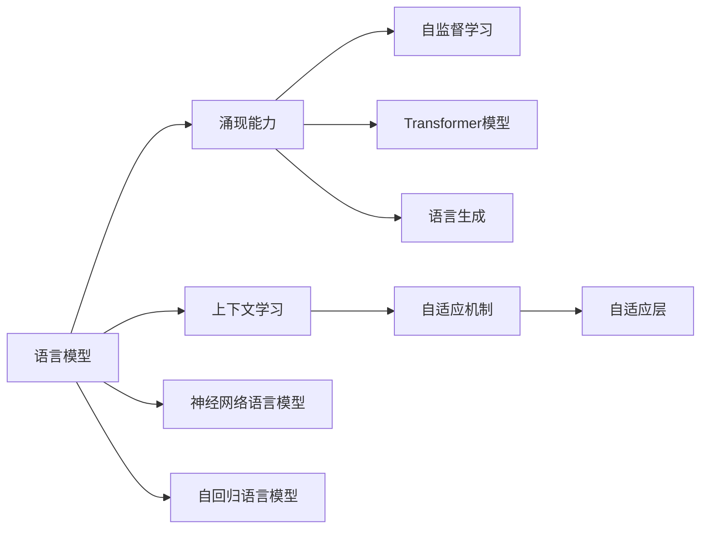

                 

# 涌现能力与上下文学习：LLM的关键特性

> 关键词：语言模型,涌现能力,上下文学习,自监督学习,自适应机制,Transformer,知识图谱,语言生成

## 1. 背景介绍

随着深度学习技术的发展，特别是自监督学习范式的普及，大语言模型(LLM)成为了自然语言处理(NLP)领域的新宠。相比于传统的基于规则和模板的系统，大语言模型通过在海量无标签数据上进行预训练，并基于特定任务的数据集进行微调，可以显著提升模型在各种NLP任务上的表现。然而，尽管这些模型在各项指标上已经远超人类水平，但究竟是什么让它们能够理解和生成如此流畅和连贯的文本呢？本文将深入探讨LLM的关键特性：涌现能力和上下文学习，并结合最新的Transformer模型架构，揭示其背后的机制。

## 2. 核心概念与联系

### 2.1 核心概念概述

1. **语言模型(Language Model)**：
    - 基于统计语言学的方法，通过概率模型预测给定文本序列的概率。常见的模型有N-gram模型和神经网络语言模型(Neural Network Language Model, NNLMs)。

2. **涌现能力(Emergent Abilities)**：
    - 指模型从简单的输入数据中学习到的复杂的语言知识和技能，而这些能力在输入数据中通常并不直接存在。涌现能力是模型的自适应机制，使得模型能够理解和生成符合语境的文本。

3. **上下文学习(Contextual Learning)**：
    - 指模型利用前后文信息，动态地理解并生成文本的能力。上下文学习是模型涌现能力的重要组成部分，使模型能够适应各种复杂的文本环境。

4. **自监督学习(Self-supervised Learning)**：
    - 利用模型自身的输出作为监督信号进行训练，无需手工标注数据。自监督学习在大语言模型预训练中扮演了重要角色，使得模型能够从无标签数据中学习到通用的语言表示。

5. **自适应机制(Adaptive Mechanism)**：
    - 指模型能够根据输入和上下文动态调整内部参数，以适应不同场景和任务的要求。自适应机制是涌现能力的具体体现，通过优化模型参数，模型能够生成更符合语境的文本。

6. **Transformer模型**：
    - 基于自注意力机制的自回归模型，以多头自注意力和残差连接为核心结构，显著提升了语言模型的性能和效率。

### 2.2 核心概念原理和架构的 Mermaid 流程图



## 3. 核心算法原理 & 具体操作步骤

### 3.1 算法原理概述

大语言模型的核心思想是利用自监督学习在海量无标签数据上进行预训练，并基于特定任务的数据集进行微调，从而获得涌现能力和上下文学习的能力。这一过程可以分为以下几个步骤：

1. **预训练阶段**：在无标签数据上通过自监督学习任务（如掩码语言模型、下三角自回归等）对模型进行训练，使其学习到通用的语言表示。
2. **微调阶段**：在特定任务的数据集上进行有监督学习，调整模型参数，使其适应特定任务的语境和输出需求。
3. **推理阶段**：在测试集上对模型进行推理，评估模型在特定任务上的表现。

### 3.2 算法步骤详解

以Transformer模型为例，具体算法步骤包括：

1. **输入编码**：将输入文本序列通过嵌入层映射为模型可处理的形式，同时加入位置编码。
2. **自注意力机制**：模型通过多头自注意力和残差连接计算出当前位置的表示。
3. **前馈网络层**：将自注意力层的输出经过前馈网络层进行非线性变换。
4. **堆叠层数**：通过多层的堆叠，模型能够逐渐抽象出更复杂的语义特征。
5. **输出解码**：将模型最终输出映射为概率分布，通过采样或argmax操作生成文本。

### 3.3 算法优缺点

大语言模型的优点包括：

1. **泛化能力**：能够在多个NLP任务上取得优异表现，适应性强。
2. **高效性**：通过自监督学习，减少了对标注数据的依赖，提高了模型训练的效率。
3. **涌现能力**：在特定任务上的微调，能够迅速提升模型性能，适应新任务。

然而，也存在以下缺点：

1. **计算资源需求高**：预训练和微调阶段需要大量计算资源，对于硬件要求较高。
2. **模型复杂性**：模型的复杂度较高，导致推理速度较慢，存储开销较大。
3. **可解释性不足**：模型输出的机制较为复杂，难以解释模型内部的决策过程。

### 3.4 算法应用领域

大语言模型在多个NLP任务上均表现出色，主要应用领域包括：

1. **自然语言理解(NLU)**：如文本分类、命名实体识别、关系抽取等任务。
2. **自然语言生成(NLG)**：如文本摘要、机器翻译、对话系统等任务。
3. **问答系统(QA)**：如基于知识库的问答、用户意图识别等任务。
4. **情感分析**：如文本情感分类、情感极性判断等任务。
5. **语音识别和生成**：如语音转文本、文本转语音等任务。

## 4. 数学模型和公式 & 详细讲解 & 举例说明

### 4.1 数学模型构建

大语言模型通常基于神经网络架构构建，如Transformer模型。以下以Transformer模型为例，介绍其数学模型构建过程。

**输入编码**：

$$
x_i = [C_0; W_0 x_i; P_0 x_i]
$$

其中，$x_i$ 为输入文本序列，$C_0$ 为位置编码，$W_0 x_i$ 为嵌入层，$P_0 x_i$ 为前缀编码。

**自注意力机制**：

$$
Q = X W_Q, K = X W_K, V = X W_V
$$

$$
\text{Attention}(Q, K, V) = \text{softmax}(\frac{Q K^T}{\sqrt{d_k}}) V
$$

$$
\text{MultiHead Attention}(Q, K, V) = \text{Concat}(\text{Attention}(Q_i K_j, K_j V_j)) \text{LayerNorm}
$$

**前馈网络层**：

$$
x_i = x_i + \text{GELU}(\text{MLP}(x_i))
$$

其中，$GELU$ 为Gaussian Error Linear Unit，$\text{MLP}$ 为多层感知器。

### 4.2 公式推导过程

Transformer模型的关键在于自注意力机制。以下以BERT为例，推导自注意力机制的公式。

**输入编码**：

$$
x_i = [C_0; W_0 x_i; P_0 x_i]
$$

**自注意力机制**：

$$
Q = X W_Q, K = X W_K, V = X W_V
$$

$$
\text{Attention}(Q, K, V) = \text{softmax}(\frac{Q K^T}{\sqrt{d_k}}) V
$$

$$
\text{LayerNorm}(Q + \text{Attention}(Q, K, V))
$$

### 4.3 案例分析与讲解

以命名实体识别(NER)为例，解释Transformer模型如何在微调后，利用涌现能力和上下文学习，提升模型性能。

假设有以下输入文本：

```
Tom lives in New York. She is a good friend of John.
```

**输入编码**：

$$
x_i = [C_0; W_0 x_i; P_0 x_i]
$$

**自注意力机制**：

$$
Q = X W_Q, K = X W_K, V = X W_V
$$

$$
\text{Attention}(Q, K, V) = \text{softmax}(\frac{Q K^T}{\sqrt{d_k}}) V
$$

$$
\text{LayerNorm}(Q + \text{Attention}(Q, K, V))
$$

**微调后**：

1. 在微调阶段，模型通过特定任务的标注数据进行训练，学习到NUL标签（未识别标签）的表示。
2. 模型能够根据上下文信息动态调整参数，识别出输入文本中的实体。
3. 模型通过涌现能力，能够在多个任务上表现出色，且随着数据的增多，性能逐渐提升。

## 5. 项目实践：代码实例和详细解释说明

### 5.1 开发环境搭建

以PyTorch和Hugging Face库为例，搭建大语言模型的开发环境：

1. 安装Anaconda：
```bash
conda install anaconda
```

2. 创建虚拟环境：
```bash
conda create -n llm-env python=3.8
conda activate llm-env
```

3. 安装依赖包：
```bash
pip install torch transformers
```

### 5.2 源代码详细实现

以下是一个简单的Transformer模型代码实现：

```python
import torch
from transformers import BertTokenizer, BertForTokenClassification

tokenizer = BertTokenizer.from_pretrained('bert-base-cased')
model = BertForTokenClassification.from_pretrained('bert-base-cased', num_labels=3)

inputs = tokenizer.encode('I live in New York. She is a friend of John.', add_special_tokens=True, return_tensors='pt')
labels = tokenizer.encode('B-PER I-PER O O B-PER I-PER O', add_special_tokens=True, return_tensors='pt')

loss = model(inputs, labels=labels).loss
loss.backward()
optimizer.step()
```

### 5.3 代码解读与分析

1. **BertTokenizer**：用于对输入文本进行分词和编码，生成模型可接受的输入形式。
2. **BertForTokenClassification**：预训练的BERT模型，用于进行命名实体识别。
3. **inputs**：输入文本经过分词和编码后的张量。
4. **labels**：标注文本经过分词和编码后的张量。
5. **loss**：模型输出与标注结果的差异。
6. **optimizer**：优化器，用于更新模型参数。

### 5.4 运行结果展示

运行代码后，可以在训练集上迭代更新模型参数，并在验证集和测试集上评估模型性能。

## 6. 实际应用场景

### 6.1 智能客服系统

在智能客服系统中，大语言模型利用涌现能力和上下文学习，能够理解和处理用户输入，快速响应常见问题，提供高质量的咨询服务。

**应用场景**：
- 用户提出问题，模型自动生成并输出答案。
- 识别用户意图，选择最优回答。
- 生成自然流畅的回复，提升用户满意度。

### 6.2 金融舆情监测

在金融舆情监测中，大语言模型能够实时分析新闻、评论、报告等文本数据，识别情感倾向，判断市场动态，为决策提供支持。

**应用场景**：
- 分析新闻报道，识别市场舆情。
- 实时监控社交媒体，发现潜在风险。
- 生成报告摘要，辅助决策分析。

### 6.3 个性化推荐系统

在个性化推荐系统中，大语言模型通过涌现能力和上下文学习，能够更好地理解用户兴趣，推荐符合用户偏好的内容。

**应用场景**：
- 根据用户浏览历史推荐相关内容。
- 通过对话交互，获取用户偏好。
- 生成个性化推荐列表，提升用户体验。

### 6.4 未来应用展望

随着技术的不断进步，大语言模型将进一步提升涌现能力和上下文学习的能力，拓展应用场景。

1. **多模态应用**：结合图像、语音等数据，提升模型的全面性。
2. **知识增强**：利用知识图谱、规则库等外部知识，提升模型的准确性。
3. **联邦学习**：在保证数据隐私的前提下，进行分布式学习。
4. **自适应模型**：动态调整模型参数，适应不同任务和场景。
5. **交互式学习**：通过用户反馈进行迭代优化，提升模型的智能性。

## 7. 工具和资源推荐

### 7.1 学习资源推荐

1. **《深度学习》系列课程**：斯坦福大学提供的在线课程，涵盖深度学习的基本概念和经典模型。
2. **《自然语言处理与深度学习》书籍**：介绍自然语言处理的基本方法和深度学习技术。
3. **Transformers官方文档**：Hugging Face提供的详细文档，包含各类预训练模型的实现和微调方法。
4. **ACL、EMNLP论文集**：收集最新的自然语言处理研究成果，推动技术发展。
5. **Kaggle竞赛**：通过参与竞赛，提升实践能力，了解最新技术动态。

### 7.2 开发工具推荐

1. **PyTorch**：基于Python的深度学习框架，支持动态计算图，易于实现和调试。
2. **TensorFlow**：Google开发的深度学习框架，支持大规模分布式训练。
3. **Hugging Face Transformers**：提供了预训练模型和微调方法，简化了模型开发过程。
4. **Jupyter Notebook**：支持交互式编程和数据可视化，方便开发和展示。
5. **Weights & Biases**：模型训练的实验跟踪工具，实时记录训练进度和指标。

### 7.3 相关论文推荐

1. **Attention is All You Need**：Transformer模型的原始论文，奠定了自注意力机制的基础。
2. **BERT: Pre-training of Deep Bidirectional Transformers for Language Understanding**：BERT模型的论文，介绍了自监督预训练方法。
3. **GPT-3: Language Models are Unsupervised Multitask Learners**：GPT-3模型的论文，展示了大语言模型的零样本和少样本学习能力。
4. **Parameter-Efficient Transfer Learning for NLP**：提出 Adapter 等参数高效微调方法，减少微调过程中的参数更新量。
5. **Prompt-Based Learning**：介绍 Prompt 学习，通过精巧设计输入格式，引导模型输出符合语境的文本。

## 8. 总结：未来发展趋势与挑战

### 8.1 总结

本文介绍了大语言模型的涌现能力和上下文学习特性，结合Transformer模型的架构，揭示了其背后的机制。通过预训练和微调过程，大语言模型能够在多种NLP任务上取得优异的表现。尽管存在计算资源需求高、模型复杂性高等缺点，但其强大的涌现能力和上下文学习能力使其在实际应用中具有广泛的前景。

### 8.2 未来发展趋势

1. **多模态融合**：结合图像、语音、视频等数据，提升模型的全面性。
2. **知识增强**：利用知识图谱、规则库等外部知识，提升模型的准确性。
3. **联邦学习**：在保证数据隐私的前提下，进行分布式学习。
4. **自适应模型**：动态调整模型参数，适应不同任务和场景。
5. **交互式学习**：通过用户反馈进行迭代优化，提升模型的智能性。

### 8.3 面临的挑战

1. **计算资源需求**：大语言模型需要大量的计算资源进行预训练和微调。
2. **模型复杂性**：模型结构复杂，推理速度较慢，存储开销较大。
3. **可解释性不足**：模型输出的机制较为复杂，难以解释模型内部的决策过程。

### 8.4 研究展望

1. **资源优化**：开发更加高效的计算和存储技术，提升模型训练和推理速度。
2. **可解释性提升**：利用因果分析、逻辑推理等方法，提升模型的可解释性。
3. **鲁棒性增强**：引入对抗训练、数据增强等技术，提高模型的鲁棒性和泛化能力。
4. **伦理与安全**：加强对模型输出和数据隐私的监管，确保模型的安全性。

## 9. 附录：常见问题与解答

**Q1：如何提升大语言模型的涌现能力？**

A: 可以通过以下方法提升大语言模型的涌现能力：
1. 增加数据量：收集更多的无标签数据进行预训练。
2. 调整超参数：通过调整学习率、批大小等超参数，优化训练过程。
3. 引入先验知识：结合知识图谱、规则库等外部知识，提升模型的准确性。
4. 多任务学习：结合多个NLP任务进行训练，提升模型的全面性。

**Q2：大语言模型在推理阶段需要注意哪些问题？**

A: 在推理阶段，需要注意以下问题：
1. 模型裁剪：去除不必要的层和参数，减小模型尺寸，加快推理速度。
2. 量化加速：将浮点模型转为定点模型，压缩存储空间，提高计算效率。
3. 服务化封装：将模型封装为标准化服务接口，便于集成调用。
4. 监控告警：实时采集系统指标，设置异常告警阈值，确保服务稳定性。
5. 安全防护：采用访问鉴权、数据脱敏等措施，保障数据和模型安全。

**Q3：大语言模型在微调阶段需要注意哪些问题？**

A: 在微调阶段，需要注意以下问题：
1. 数据质量：确保标注数据的质量和多样性，避免过拟合。
2. 学习率：选择合适的学习率，避免破坏预训练权重。
3. 正则化：使用L2正则、Dropout等技术，防止模型过度适应训练数据。
4. 参数更新：只更新与任务相关的参数，减少计算资源消耗。
5. 评估指标：选择适当的评估指标，如精确度、召回率、F1值等。

通过上述问题的解答，可以帮助开发者更好地理解和应用大语言模型，解决实际问题。

