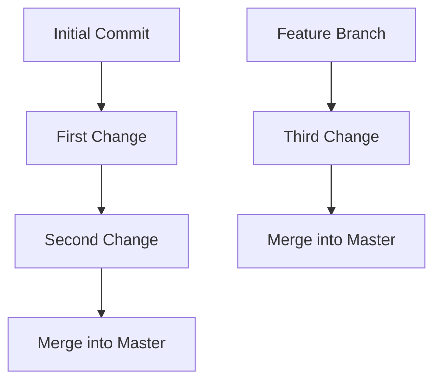
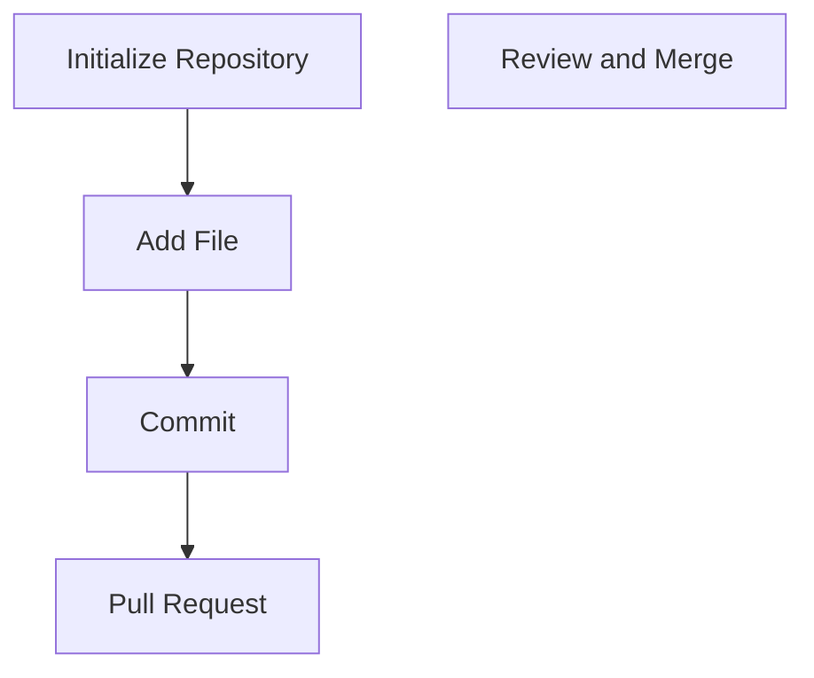

                 

### 文章标题

**利用开源社区加速技术创新**

开源社区在当今技术领域中扮演着越来越重要的角色。作为一个开放的平台，它允许开发者和研究人员自由地共享和协作，从而加速技术的创新和发展。本文旨在探讨开源社区如何促进技术创新，并介绍一些关键的概念、工具和资源，帮助读者更好地利用开源社区的力量。

## 关键词
- 开源社区
- 技术创新
- 协作开发
- 开源工具
- 开源项目
- 社区贡献

## 摘要
本文首先介绍了开源社区的概念和重要性，接着讨论了如何利用开源社区加速技术创新，包括分享代码、共享知识、合作开发等手段。随后，文章介绍了开源社区中的一些关键工具和资源，如版本控制系统、代码托管平台、协作工具等。最后，文章总结了开源社区的未来发展趋势和挑战，并提出了个人贡献的建议。

### 1. 背景介绍（Background Introduction）

开源社区的概念最早可以追溯到20世纪90年代，由自由软件运动倡导者Richard Stallman提出。自由软件运动旨在促进软件的自由传播和使用，强调用户对软件的修改和再分发权利。这一理念后来演变为开源软件运动，即允许用户自由地使用、研究、修改和分发软件，同时保留源代码。

开源社区之所以能够成为技术创新的重要推动力量，主要有以下几个原因：

1. **共享与协作**：开源社区鼓励开发者和研究者共享代码和知识，从而加速技术的传播和改进。
2. **透明度和可验证性**：开源项目通常具有透明的开发流程和代码库，这使得其他开发者可以验证和审查代码，提高项目的可信度和安全性。
3. **社区支持**：开源社区往往有一个活跃的社区，成员之间相互支持，共同解决技术问题，推动项目的发展。
4. **多样性**：开源社区吸引了来自不同背景和地域的开发者，这为技术创新提供了多样化的视角和思路。

### 2. 核心概念与联系（Core Concepts and Connections）

为了更好地理解开源社区如何促进技术创新，我们需要了解一些核心概念和联系。

#### 2.1 开源社区与协作开发

协作开发是开源社区的核心特点之一。通过协作开发，多个开发者可以共同为一个项目工作，从而加速项目的进展。协作开发通常涉及以下几个环节：

1. **代码贡献**：开发者可以提交自己的代码更改到项目的代码库中，其他开发者可以审查并合并这些更改。
2. **代码审查**：代码审查是确保代码质量的重要环节，它可以帮助发现潜在的错误和改进建议。
3. **bug修复**：开源项目经常面临bug报告和修复的需求，社区成员通常会积极响应，共同解决问题。
4. **文档和维护**：除了代码，开源项目还需要良好的文档和持续维护，以保持项目的可持续性。

#### 2.2 开源社区与知识共享

知识共享是开源社区的另一个重要方面。通过共享知识，开发者可以学习新的技术、方法和最佳实践，从而提高自己的技能水平。知识共享可以通过以下几种方式实现：

1. **文档和教程**：开源项目通常会提供详细的文档和教程，帮助新成员了解项目的工作原理和如何参与开发。
2. **社区论坛和邮件列表**：社区论坛和邮件列表为开发者提供了一个交流的平台，他们可以在这些平台上提问、分享经验和讨论技术问题。
3. **博客和社交媒体**：许多开发者会通过博客和社交媒体分享他们的经验和见解，这有助于扩大知识传播的范围。

#### 2.3 开源社区与开源工具

开源社区不仅促进了知识的共享和协作开发，还产生了一系列强大的开源工具。这些工具在开源社区内部被广泛使用，同时也被其他领域的技术人员所采用。以下是一些常用的开源工具：

1. **版本控制系统**：如Git，用于管理代码版本和控制代码变更。
2. **代码托管平台**：如GitHub和GitLab，提供了代码托管、协作和管理的功能。
3. **自动化构建和测试工具**：如Jenkins和Travis CI，用于自动化代码构建和测试，提高开发效率。
4. **持续集成/持续部署（CI/CD）工具**：如Docker和Kubernetes，用于实现自动化部署和管理容器化应用。

### 3. 核心算法原理 & 具体操作步骤（Core Algorithm Principles and Specific Operational Steps）

开源社区的核心算法原理是基于分布式合作和开放共享。具体操作步骤如下：

1. **代码贡献**：开发者首先需要在开源社区找到一个感兴趣的项目，并阅读项目的贡献指南。然后，他们可以在本地安装项目依赖，并开始编写和测试自己的代码。
2. **代码提交**：编写完代码后，开发者需要将其提交到项目的代码库中。通常，他们会创建一个新的分支，并在分支中进行更改。完成后，开发者可以发起一个合并请求（Pull Request），等待其他开发者的审查和反馈。
3. **代码审查**：其他开发者会审查提交的代码，并提出改进建议。开发者需要根据反馈进行必要的修改，并重新提交代码。
4. **合并和发布**：一旦代码审查通过，项目维护者会将代码合并到主分支，并发布新的版本。新版本将在社区中传播，其他开发者可以升级到最新版本以使用新功能或修复的bug。

### 4. 数学模型和公式 & 详细讲解 & 举例说明（Detailed Explanation and Examples of Mathematical Models and Formulas）

开源社区中的一些关键工具和资源可以通过数学模型和公式来解释。以下是一些例子：

#### 4.1 版本控制系统（Version Control System）

版本控制系统是一种用于管理代码更改的工具，其核心数学模型是基于分支和合并操作。以下是一个简单的例子：



在这个例子中，`A`表示初始提交，`B`和`C`表示连续的代码更改，而`D`表示将这些更改合并到主分支。同样，`E`是一个特征分支，用于实现新的功能，并在`F`处进行更改，最后在`G`处合并到主分支。

#### 4.2 代码托管平台（Code Hosting Platform）

代码托管平台如GitHub和GitLab使用Git作为其版本控制系统。Git的核心算法是基于分布式存储和分布式合作。以下是一个简单的Git操作示例：



在这个例子中，`A`表示初始化仓库，`B`和`C`表示添加文件和提交更改，而`D`表示发起合并请求。一旦审查通过，维护者可以在`E`处合并代码。

### 5. 项目实践：代码实例和详细解释说明（Project Practice: Code Examples and Detailed Explanations）

以下是一个简单的开源项目实践示例，该项目是一个简单的Web服务，用于处理用户请求并返回响应。

#### 5.1 开发环境搭建

首先，我们需要搭建开发环境。以下是所需步骤：

1. 安装Node.js：从[Node.js官网](https://nodejs.org/)下载并安装Node.js。
2. 安装npm：Node.js自带npm（Node Package Manager），用于安装和管理项目依赖。
3. 初始化项目：在项目目录下运行`npm init`命令，按照提示创建一个`package.json`文件。

#### 5.2 源代码详细实现

以下是项目的源代码实现：

```javascript
// index.js
const http = require('http');

const server = http.createServer((req, res) => {
  res.writeHead(200, {'Content-Type': 'text/plain'});
  res.end('Hello, World!');
});

server.listen(3000, () => {
  console.log('Server running at http://localhost:3000/');
});
```

这段代码使用Node.js的`http`模块创建了一个简单的Web服务器。当请求到达时，服务器将返回一个包含“Hello, World!”的响应。

#### 5.3 代码解读与分析

1. `const http = require('http');`：这行代码使用`require`函数导入Node.js的`http`模块，该模块提供了创建Web服务器的功能。
2. `const server = http.createServer((req, res) => { ... });`：这行代码创建了一个HTTP服务器实例。`createServer`函数接受一个回调函数，该函数在接收到请求时被调用。
3. `res.writeHead(200, {'Content-Type': 'text/plain'});`：这行代码设置HTTP响应的状态码（200表示成功）和内容类型（text/plain表示文本）。
4. `res.end('Hello, World!');`：这行代码发送响应体，即“Hello, World!”文本。
5. `server.listen(3000, () => { ... });`：这行代码启动服务器，并监听3000端口。回调函数在服务器启动时被调用。

#### 5.4 运行结果展示

在命令行中运行以下命令启动服务器：

```bash
node index.js
```

然后，在浏览器中访问`http://localhost:3000/`，你应该会看到“Hello, World!”的响应。

### 6. 实际应用场景（Practical Application Scenarios）

开源社区在许多实际应用场景中都发挥着重要作用。以下是一些例子：

1. **软件开发**：开源社区为软件开发提供了一个共享和协作的平台，开发者可以共同开发大型软件项目，如操作系统、数据库和Web框架。
2. **科学研究和工程**：许多科学研究和工程项目依赖于开源社区的支持，研究人员可以共享数据和分析代码，从而加速研究成果的传播和应用。
3. **教育和培训**：开源社区为教育和培训提供了丰富的资源，学生和教师可以访问和学习开源项目的代码和文档，提高自己的技术能力。
4. **开源硬件**：开源社区在开源硬件领域也取得了显著进展，例如Arduino和Raspberry Pi等开源硬件平台，为创客和开发者提供了丰富的硬件资源和社区支持。

### 7. 工具和资源推荐（Tools and Resources Recommendations）

为了更好地利用开源社区的力量，以下是几个推荐的工具和资源：

#### 7.1 学习资源推荐

- **书籍**：
  - 《开源之道》（Open Sources）：这本书详细介绍了开源软件运动的历史和理念。
  - 《Git权威指南》：这是一本关于Git版本控制系统的权威指南。
- **论文**：
  - 《开源软件项目的成功因素》（Success Factors in Open Source Software Projects）：这篇文章分析了开源项目成功的因素。
  - 《开源软件中的社区构建》（Community Building in Open Source Software）：这篇文章探讨了如何在开源项目中构建社区。
- **博客和网站**：
  - [GitHub博客](https://github.blog/)：GitHub的官方博客，提供了关于开源社区的最新动态和最佳实践。
  - [开源中国](https://www.oschina.net/)：中国最大的开源社区和软件开发者交流平台。

#### 7.2 开发工具框架推荐

- **版本控制系统**：
  - Git：最流行的版本控制系统，适用于大多数项目。
  - GitHub Actions：GitHub提供的自动化工作流程工具，用于自动化构建、测试和部署。
- **代码托管平台**：
  - GitHub：全球最大的代码托管平台，提供了丰富的社区资源和协作工具。
  - GitLab：自托管代码托管平台，适用于私有项目和企业级使用。
- **协作工具**：
  - Slack：用于团队沟通和协作的即时消息工具。
  - Trello：用于项目管理和任务追踪的工具。

#### 7.3 相关论文著作推荐

- **论文**：
  - 《开源软件项目的特性与成功因素研究》（Characteristics and Success Factors of Open Source Software Projects）：这篇论文分析了开源项目成功的关键因素。
  - 《开源社区的社交网络分析》（Social Network Analysis of Open Source Communities）：这篇论文使用了社交网络分析方法研究开源社区的特性。
- **著作**：
  - 《开源软件开发实践》（Practices of Open Source Software Development）：这本书详细介绍了开源软件开发的方法和实践。
  - 《开源软件项目管理》（Open Source Software Project Management）：这本书提供了开源项目管理的方法和技巧。

### 8. 总结：未来发展趋势与挑战（Summary: Future Development Trends and Challenges）

开源社区在技术领域的地位日益上升，未来它将继续成为技术创新的重要推动力量。以下是一些未来发展趋势和挑战：

#### 8.1 发展趋势

1. **开源生态系统的成熟**：随着开源社区的不断发展，我们将看到更多的开源工具和框架涌现，这些工具和框架将进一步提高开发效率和协作能力。
2. **开源与商业的结合**：越来越多的企业将开源作为其商业模式的一部分，通过开源项目吸引开发者和用户，进而实现商业价值。
3. **开源国际合作**：开源社区的国际合作将进一步加强，跨国项目和协作将更加普遍。

#### 8.2 挑战

1. **开源项目治理**：随着开源项目数量的增加，如何有效地管理这些项目成为一个挑战。项目治理和代码质量保证需要得到更多的关注。
2. **知识产权问题**：开源项目中的知识产权问题，如版权和专利，需要得到更好的管理和保护，以确保社区的健康发展。
3. **安全和隐私**：开源项目的安全性是一个重要议题，需要确保开源软件在安全性方面得到充分的保护，同时保护用户的隐私。

### 9. 附录：常见问题与解答（Appendix: Frequently Asked Questions and Answers）

#### 9.1 什么是开源社区？

开源社区是一个由开发者和用户组成的网络，他们共同合作，共享和改进开源软件项目。

#### 9.2 如何参与开源社区？

参与开源社区通常有以下几种方式：
1. 贡献代码：阅读项目的贡献指南，提交代码更改。
2. 编写文档：为项目编写或改进文档。
3. 报告bug：发现bug时，向项目报告。
4. 参与讨论：在社区论坛或邮件列表中参与讨论。

#### 9.3 开源社区有什么优势？

开源社区的优势包括：
1. 共享和协作：鼓励共享代码和知识，提高开发效率。
2. 透明度和可验证性：项目具有透明的开发流程和代码库，提高项目的可信度。
3. 社区支持：活跃的社区成员可以共同解决技术问题。
4. 多样性：吸引来自不同背景的开发者，提供多样化的视角和思路。

### 10. 扩展阅读 & 参考资料（Extended Reading & Reference Materials）

- **书籍**：
  - 《开源社区的精髓》：详细介绍了开源社区的运作原理和实践。
  - 《开源软件项目管理》：提供了开源项目管理的全面指南。
- **论文**：
  - 《开源社区的特性与成功因素研究》：分析了开源项目的成功因素。
  - 《开源社区的社交网络分析》：研究了开源社区的社交结构。
- **网站**：
  - [GitHub](https://github.com/)：全球最大的代码托管平台，提供了丰富的开源项目。
  - [开源中国](https://www.oschina.net/)：中国最大的开源社区和软件开发者交流平台。
- **博客**：
  - [GitHub官方博客](https://github.blog/)：提供了关于开源社区的最新动态和最佳实践。
  - [Open Source Initiative](https://opensource.org/)：开源软件倡议组织的官方网站，提供了关于开源软件的详细介绍。

### 作者署名

作者：禅与计算机程序设计艺术 / Zen and the Art of Computer Programming

