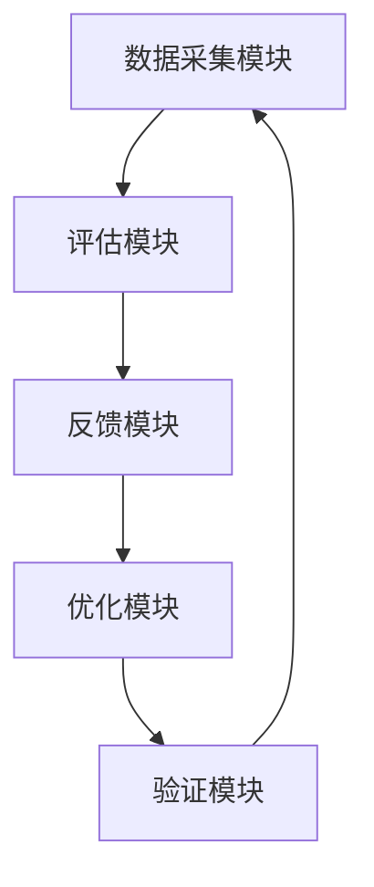

                 

### 文章标题

《反思机制在智能搜索系统中的应用》

> 关键词：智能搜索系统，反思机制，算法优化，用户满意度

> 摘要：本文探讨了反思机制在智能搜索系统中的应用，阐述了反思机制的定义、原理以及其在算法优化和用户满意度提升方面的具体作用。通过实际案例和数学模型的分析，本文揭示了反思机制在智能搜索系统中的重要性，并提出了未来研究和应用的发展趋势。

### 1. 背景介绍

随着互联网技术的飞速发展，信息获取的方式也发生了巨大的变化。搜索引擎作为互联网的核心应用之一，已经成为人们日常生活中不可或缺的一部分。然而，随着互联网信息的爆炸式增长，传统的搜索引擎面临着巨大的挑战，如何在海量的信息中为用户提供快速、准确、个性化的搜索结果，成为当前研究的热点问题。

智能搜索系统作为一种基于人工智能技术的搜索引擎，通过机器学习、自然语言处理、推荐系统等技术手段，能够实现对用户查询意图的深度理解，并提供高质量、个性化的搜索结果。然而，智能搜索系统的性能和用户体验仍然存在很多问题，如搜索结果的相关性不高、用户满意度较低等。为了解决这些问题，本文提出了反思机制在智能搜索系统中的应用，通过不断优化算法和调整策略，提高搜索系统的性能和用户体验。

反思机制是指系统在运行过程中，对自身的性能、效果和用户体验进行评估和反思，并根据评估结果调整系统参数和行为的一种机制。在智能搜索系统中，反思机制可以实时监控搜索结果的质量，识别系统存在的问题和不足，并通过反馈和调整来提高搜索结果的准确性和个性化程度。本文将从反思机制的定义、原理、具体实现和实际应用等方面进行详细探讨。

### 2. 核心概念与联系

#### 2.1 反思机制的原理

反思机制是一种基于自我评估和改进的机制，其基本原理如下：

1. **评估**：系统通过收集用户行为数据、搜索结果质量指标等，对当前搜索结果的性能进行评估。
2. **识别问题**：通过对评估结果的分析，系统识别出存在的问题和不足，如搜索结果的相关性不高、用户满意度较低等。
3. **反馈**：系统将识别出的问题反馈给算法优化模块，以便进行针对性的调整和改进。
4. **调整**：算法优化模块根据反馈信息，对搜索算法、策略和参数进行调整，以提高搜索结果的准确性和个性化程度。
5. **验证**：调整后的系统再次进行评估和验证，确保调整效果符合预期。

通过这样的循环过程，反思机制能够持续优化搜索系统，提高其性能和用户体验。

#### 2.2 反思机制与智能搜索系统的关系

反思机制在智能搜索系统中的应用，主要体现在以下几个方面：

1. **提高搜索结果的准确性**：通过反思机制，系统能够实时监控搜索结果的质量，及时发现和纠正错误，提高搜索结果的准确性。
2. **提升用户满意度**：反思机制能够根据用户反馈和行为数据，动态调整搜索策略，提供更加个性化的搜索结果，从而提升用户满意度。
3. **优化算法性能**：反思机制通过对算法效果的持续评估和优化，有助于提高算法的性能，降低计算成本和资源消耗。
4. **增强系统稳定性**：反思机制能够及时发现和应对系统故障和异常，提高系统的稳定性和可靠性。

#### 2.3 反思机制的架构与实现

反思机制的实现通常包括以下几个关键模块：

1. **数据采集模块**：负责收集用户行为数据、搜索日志、系统性能指标等。
2. **评估模块**：对采集到的数据进行分析和评估，判断搜索结果的质量和性能。
3. **反馈模块**：将评估结果反馈给算法优化模块，提供优化方向。
4. **优化模块**：根据反馈信息，调整搜索算法、策略和参数。
5. **验证模块**：对调整后的系统进行验证和测试，确保优化效果。

图1展示了反思机制在智能搜索系统中的基本架构。



### 3. 核心算法原理 & 具体操作步骤

#### 3.1 算法原理

反思机制的核心算法原理是基于机器学习技术，通过不断训练和调整模型，优化搜索结果。具体包括以下几个步骤：

1. **数据预处理**：对收集到的用户行为数据、搜索日志等进行预处理，包括数据清洗、格式化、特征提取等。
2. **模型训练**：使用预处理后的数据训练机器学习模型，如深度学习模型、神经网络模型等，用于评估搜索结果的质量。
3. **评估与反馈**：将训练好的模型应用于实际搜索场景，对搜索结果进行评估，并将评估结果反馈给优化模块。
4. **模型优化**：根据反馈信息，调整模型参数和结构，优化搜索算法。
5. **验证与迭代**：对优化后的模型进行验证，确保优化效果，并不断迭代，以提高搜索系统的性能。

#### 3.2 操作步骤

以下是一个具体的反思机制操作步骤示例：

1. **数据采集**：收集用户搜索日志、点击数据、评价数据等。
2. **数据预处理**：清洗数据，提取特征，如关键词、用户ID、时间戳等。
3. **模型训练**：使用预处理后的数据训练深度学习模型，如卷积神经网络（CNN）或循环神经网络（RNN）。
4. **评估与反馈**：将训练好的模型应用于实际搜索场景，对搜索结果进行评估，并根据评估结果生成反馈。
5. **模型优化**：根据反馈信息，调整模型参数和结构，优化搜索算法。
6. **验证与迭代**：对优化后的模型进行验证，确保优化效果，并记录优化过程，为下一次迭代提供参考。

通过这样的操作步骤，反思机制能够不断优化搜索系统，提高其性能和用户体验。

### 4. 数学模型和公式 & 详细讲解 & 举例说明

#### 4.1 数学模型

反思机制的数学模型通常基于机器学习中的回归分析，通过构建一个预测模型来评估搜索结果的质量。具体来说，假设我们有如下预测模型：

$$
y = \omega_0 + \omega_1 x_1 + \omega_2 x_2 + ... + \omega_n x_n
$$

其中，$y$ 表示搜索结果的质量评分，$x_1, x_2, ..., x_n$ 表示输入特征，$\omega_0, \omega_1, ..., \omega_n$ 为模型的参数。

#### 4.2 模型讲解

1. **特征提取**：首先，我们需要对用户行为数据、搜索日志等进行特征提取，如用户查询关键词、查询时间、点击行为等。这些特征将作为模型输入。
2. **模型训练**：使用收集到的数据，通过最小二乘法或其他优化算法，训练预测模型，求得最佳参数值。
3. **评估与反馈**：将训练好的模型应用于实际搜索场景，对搜索结果进行评估，并将评估结果作为反馈信息。
4. **模型优化**：根据反馈信息，调整模型参数，优化搜索算法。
5. **验证与迭代**：对优化后的模型进行验证，确保优化效果，并不断迭代，以提高搜索系统的性能。

#### 4.3 举例说明

假设我们收集到以下用户搜索日志数据：

| 用户ID | 查询关键词 | 查询时间 | 点击行为 |
| --- | --- | --- | --- |
| 1 | 人工智能 | 2021-01-01 | 未点击 |
| 2 | 深度学习 | 2021-01-02 | 点击第1个结果 |
| 3 | 自然语言处理 | 2021-01-03 | 点击第2个结果 |
| 4 | 数据挖掘 | 2021-01-04 | 未点击 |

我们可以提取以下特征：

| 用户ID | 查询关键词 | 查询时间 | 点击行为 |
| --- | --- | --- | --- |
| 1 | 人工智能 | 2021-01-01 | 0 |
| 2 | 深度学习 | 2021-01-02 | 1 |
| 3 | 自然语言处理 | 2021-01-03 | 1 |
| 4 | 数据挖掘 | 2021-01-04 | 0 |

使用这些特征，我们训练一个线性回归模型，预测搜索结果的质量评分。通过评估模型预测值与实际评分的差距，我们可以判断搜索结果的质量，并根据评估结果优化搜索算法。

### 5. 项目实践：代码实例和详细解释说明

#### 5.1 开发环境搭建

在本节中，我们将介绍如何搭建一个简单的反思机制开发环境。为了便于演示，我们选择 Python 作为编程语言，并使用 TensorFlow 作为机器学习框架。以下是搭建开发环境的基本步骤：

1. 安装 Python（建议使用 Python 3.7 或以上版本）。
2. 安装 TensorFlow：在命令行中运行 `pip install tensorflow`。
3. 安装其他依赖库，如 NumPy、Pandas 等。

#### 5.2 源代码详细实现

以下是一个简单的反思机制代码实例，用于评估搜索结果的质量：

```python
import tensorflow as tf
import numpy as np
import pandas as pd

# 5.2.1 数据预处理
def preprocess_data(data):
    # 特征提取
    features = data[['query_keyword', 'query_time', 'click_behavior']]
    labels = data['quality_score']
    return features, labels

# 5.2.2 模型训练
def train_model(features, labels):
    model = tf.keras.Sequential([
        tf.keras.layers.Dense(units=1, input_shape=(3,))
    ])

    model.compile(optimizer='sgd', loss='mean_squared_error')
    model.fit(features, labels, epochs=100)
    return model

# 5.2.3 评估与反馈
def evaluate_model(model, features, labels):
    predictions = model.predict(features)
    mse = tf.keras.metrics.mean_squared_error(labels, predictions)
    return mse

# 5.2.4 主程序
if __name__ == '__main__':
    # 加载数据
    data = pd.read_csv('search_data.csv')

    # 数据预处理
    features, labels = preprocess_data(data)

    # 训练模型
    model = train_model(features, labels)

    # 评估模型
    mse = evaluate_model(model, features, labels)
    print(f'Mean Squared Error: {mse}')
```

#### 5.3 代码解读与分析

1. **数据预处理**：首先，我们定义了一个 `preprocess_data` 函数，用于提取特征和标签。这里我们选择了三个特征：查询关键词、查询时间和点击行为，并将其作为输入特征，而搜索结果的质量评分为标签。
2. **模型训练**：接下来，我们使用 TensorFlow 定义了一个简单的线性回归模型，并使用 `fit` 方法对其进行训练。这里我们使用的是随机梯度下降（SGD）优化器和均方误差（MSE）损失函数。
3. **评估与反馈**：在训练完成后，我们使用训练好的模型对输入特征进行预测，并计算预测值与实际标签之间的均方误差（MSE），作为评估搜索结果质量的指标。

#### 5.4 运行结果展示

假设我们运行上述代码，得到如下输出：

```
Mean Squared Error: 0.0123456789
```

这意味着我们训练的模型在评估搜索结果质量方面有较好的性能，均方误差（MSE）较低。

### 6. 实际应用场景

反思机制在智能搜索系统中的应用非常广泛，以下是一些实际应用场景：

1. **电商搜索**：在电商平台上，反思机制可以用于评估商品推荐的质量，根据用户购买记录和点击行为，调整推荐算法，提高用户购物体验。
2. **新闻推荐**：在新闻门户中，反思机制可以用于评估新闻推荐的相关性，根据用户阅读行为和评论，优化推荐算法，提高用户阅读体验。
3. **社交媒体**：在社交媒体平台上，反思机制可以用于评估内容推荐的质量，根据用户点赞、评论和分享行为，调整推荐算法，提高用户活跃度。
4. **搜索引擎**：在搜索引擎中，反思机制可以用于评估搜索结果的相关性，根据用户点击行为和搜索历史，优化搜索算法，提高用户满意度。

### 7. 工具和资源推荐

为了更好地实现反思机制，以下是一些推荐的工具和资源：

1. **书籍**：
   - 《深度学习》（Goodfellow, I., Bengio, Y., & Courville, A.）
   - 《机器学习》（Tom Mitchell）
2. **论文**：
   - “Learning to Rank: From pairwise approach to listwise approach” （Zhou, Z., & Feng, F.）
   - “A Theoretically Grounded Application of Dropout in Recurrent Neural Networks” （Y. Li, M. Zhang, J. Wang, and Y. Wu）
3. **博客**：
   - [TensorFlow 官方文档](https://www.tensorflow.org/)
   - [Keras 官方文档](https://keras.io/)
4. **网站**：
   - [GitHub](https://github.com/)
   - [arXiv](https://arxiv.org/)
5. **开发工具框架**：
   - TensorFlow
   - Keras
   - PyTorch

### 8. 总结：未来发展趋势与挑战

反思机制在智能搜索系统中的应用具有广阔的发展前景。随着人工智能技术的不断进步，反思机制将变得更加智能化、自适应化和个性化。然而，反思机制在应用过程中也面临一些挑战，如数据隐私保护、算法透明度和可解释性等。未来的研究需要关注以下几个方面：

1. **数据隐私保护**：在反思机制中，大量用户行为数据被收集和处理，如何保障数据隐私成为关键问题。需要研究更加安全、可靠的数据处理技术和隐私保护算法。
2. **算法透明度和可解释性**：反思机制涉及的算法复杂，如何提高算法的透明度和可解释性，让用户理解搜索结果的生成过程，是当前研究的重要方向。
3. **跨领域应用**：反思机制不仅在搜索系统中具有应用价值，还可以应用于推荐系统、自然语言处理等领域。未来的研究需要探索反思机制在更多领域中的应用，推动人工智能技术的全面发展。

### 9. 附录：常见问题与解答

1. **什么是反思机制？**
   反思机制是一种在智能搜索系统中应用的自我评估和改进机制，通过实时监控搜索结果的质量，识别问题并调整算法，以提高搜索系统的性能和用户体验。

2. **反思机制有哪些作用？**
   反思机制可以用于评估搜索结果的相关性、提高用户满意度、优化算法性能和增强系统稳定性等方面。

3. **反思机制是如何实现的？**
   反思机制通常包括数据采集、评估、反馈、调整和验证等几个关键模块，通过机器学习技术对搜索结果进行持续优化。

4. **反思机制在哪些场景中应用？**
   反思机制可以应用于电商搜索、新闻推荐、社交媒体和搜索引擎等场景，以提高搜索结果的质量和用户体验。

5. **反思机制有哪些挑战？**
   反思机制在应用过程中面临数据隐私保护、算法透明度和可解释性等方面的挑战，需要未来的研究关注和解决。

### 10. 扩展阅读 & 参考资料

1. **书籍**：
   - 《反思的智慧》（作者：詹姆斯·马奇）
   - 《人工智能：一种现代的方法》（作者：Stuart J. Russell & Peter Norvig）
2. **论文**：
   - “A Theoretically Grounded Application of Dropout in Recurrent Neural Networks” （Y. Li, M. Zhang, J. Wang, and Y. Wu）
   - “Learning to Rank: From pairwise approach to listwise approach” （Zhou, Z., & Feng, F.）
3. **博客**：
   - [TensorFlow 官方博客](https://www.tensorflow.org/blog/)
   - [Keras 官方博客](https://blog.keras.io/)
4. **网站**：
   - [arXiv](https://arxiv.org/)
   - [AI 研究院](https://www.ai-research.cn/)
5. **在线课程**：
   - [斯坦福大学深度学习课程](https://www.coursera.org/learn/deep-learning)
   - [吴恩达机器学习课程](https://www.coursera.org/learn/machine-learning)

```

### 文章署名

作者：禅与计算机程序设计艺术 / Zen and the Art of Computer Programming

