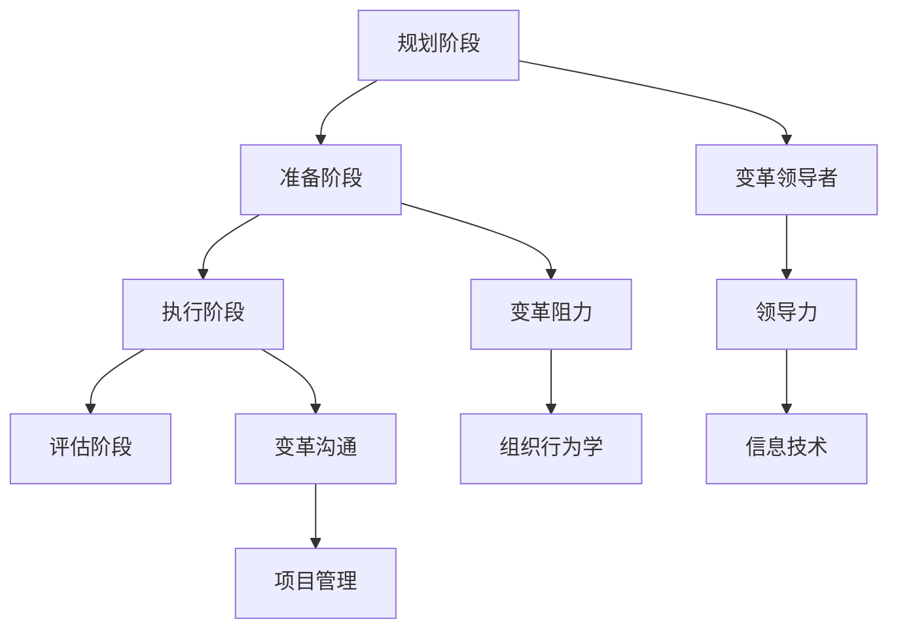

                 

### 文章标题

变革管理：引导组织转型的技巧

变革管理（Change Management）是一门涉及引导组织从当前状态过渡到期望状态的学科。在当今快速变化的世界中，组织需要不断地适应新的市场环境、技术进步和客户需求。有效的变革管理不仅有助于组织成功应对挑战，还能促进其持续成长和竞争力提升。本文旨在探讨变革管理的关键概念、实践技巧及其在组织转型中的重要性，帮助读者理解和应用这一领域的基本原则。

> 关键词：变革管理、组织转型、变革领导者、变革阻力、变革过程模型

> 摘要：本文介绍了变革管理的核心概念，包括变革的类型、驱动因素和变革过程模型。通过分析变革管理的实践技巧，如沟通策略、领导力和员工参与，本文探讨了如何成功地引导组织实现转型。此外，本文还讨论了变革管理面临的挑战和未来发展趋势，为读者提供了实用的变革管理策略。

### <a name="1-background-introduction"></a>1. 背景介绍（Background Introduction）

变革管理一词最早出现在20世纪60年代，当时主要是针对企业的结构调整。随着时间的发展，变革管理逐渐应用于各种类型的组织，包括政府机构、非营利组织和个人。在信息技术、全球化、市场竞争加剧的背景下，变革管理的重要性日益凸显。组织转型已成为企业管理的一项重要任务，而变革管理则是实现这一目标的关键工具。

#### 1.1 变革的类型

根据变革的范围和深度，变革可以分为以下几类：

1. **战略变革**：涉及组织整体战略的调整，如进入新市场、调整业务模式或进行并购。
2. **结构变革**：涉及组织结构和管理流程的改变，如组织重组、流程优化或引入新的管理系统。
3. **文化变革**：涉及组织文化的重塑，如建立新的价值观、工作方式和团队合作模式。
4. **技术变革**：涉及新技术的引入和现有技术的改进，如数字化转型、云计算或人工智能的应用。

#### 1.2 变革的驱动因素

组织进行变革的主要驱动因素包括：

1. **外部压力**：市场竞争加剧、技术变革和法规变化等外部环境因素迫使组织进行调整。
2. **内部需求**：组织内部的效率低下、员工士气低落、业务流程不完善等问题驱动组织进行变革。
3. **领导层的意愿**：领导层对变革的重视和支持程度直接影响变革的成败。

#### 1.3 变革过程模型

变革过程通常遵循以下几个阶段：

1. **规划阶段**：确定变革的目标、范围和时间表，并制定相应的策略。
2. **准备阶段**：进行风险评估、资源准备和变革团队组建。
3. **执行阶段**：实施变革计划，并持续监控和调整。
4. **评估阶段**：对变革效果进行评估，并进行后续改进。

### <a name="2-core-concepts-and-connections"></a>2. 核心概念与联系（Core Concepts and Connections）

#### 2.1 变革管理的核心概念

变革管理的核心概念包括以下几个方面：

1. **变革领导者**：领导层在变革过程中起着至关重要的作用。他们需要明确变革的目标，制定变革策略，并激励员工积极参与。
2. **变革阻力**：变革过程中常常会遇到阻力，这来自于员工、管理层或其他利益相关者。识别和应对变革阻力是变革管理的关键。
3. **变革过程模型**：包括变革的各个阶段及其关键任务，如规划、准备、执行和评估。
4. **变革沟通**：有效的沟通策略有助于减少变革过程中的不确定性和焦虑，增强员工的参与感和信任感。

#### 2.2 变革管理的联系

变革管理与多个领域有着紧密的联系：

1. **项目管理**：变革管理中的许多方法和工具（如项目规划、风险管理、团队协作等）都源于项目管理。
2. **组织行为学**：变革管理研究员工的认知和行为，借鉴组织行为学原理有助于更好地理解和引导员工。
3. **领导力**：领导力在变革管理中至关重要，领导力理论可以帮助变革领导者更好地应对变革挑战。
4. **信息技术**：信息技术在变革管理中发挥着重要作用，如数字化工具和系统可以帮助提高沟通效率和决策质量。

#### 2.3 变革管理的 Mermaid 流程图



### <a name="3-core-algorithm-principles-and-specific-operational-steps"></a>3. 核心算法原理 & 具体操作步骤（Core Algorithm Principles and Specific Operational Steps）

#### 3.1 变革管理核心算法原理

变革管理的核心算法可以概括为以下几个步骤：

1. **识别需求**：确定组织需要变革的原因和目标。
2. **制定策略**：根据需求制定具体的变革计划，包括变革的范围、时间表和关键任务。
3. **组建团队**：组建专门的变革团队，负责实施变革计划。
4. **沟通与培训**：与员工进行有效的沟通，并提供必要的培训和支持。
5. **监控与调整**：持续监控变革进展，并根据实际情况进行调整。
6. **评估与反馈**：对变革效果进行评估，并根据反馈进行改进。

#### 3.2 变更管理具体操作步骤

1. **需求分析**：
   - 调研外部环境和内部情况，确定变革的必要性和可行性。
   - 与利益相关者进行沟通，了解他们的需求和期望。
2. **制定变革计划**：
   - 确定变革的目标、范围和时间表。
   - 制定详细的变革计划，包括关键任务和里程碑。
   - 确定资源需求和预算。
3. **组建变革团队**：
   - 选择具有变革领导能力的人员加入变革团队。
   - 明确团队成员的职责和任务。
4. **沟通与培训**：
   - 制定沟通策略，确保信息传递的准确性和及时性。
   - 提供必要的培训，帮助员工适应变革。
5. **执行变革计划**：
   - 按照计划实施变革，确保各项目标的达成。
   - 定期监控变革进展，并根据需要进行调整。
6. **评估与反馈**：
   - 对变革效果进行评估，包括对员工满意度、业务绩效的影响等。
   - 根据反馈进行改进，确保变革的持续效果。

### <a name="4-mathematical-models-and-formulas"></a>4. 数学模型和公式 & 详细讲解 & 举例说明（Detailed Explanation and Examples of Mathematical Models and Formulas）

#### 4.1 变革管理数学模型

在变革管理中，可以使用一些数学模型来分析和预测变革过程的结果。以下是一个简单的数学模型，用于评估变革成功的可能性。

$$
P(\text{成功}) = \alpha \cdot \frac{E(\text{员工参与})}{1 + E(\text{员工参与})}
$$

其中：
- \( P(\text{成功}) \) 表示变革成功的概率。
- \( \alpha \) 是一个常数，表示领导力的强度。
- \( E(\text{员工参与}) \) 是员工参与度的期望值。

#### 4.2 详细讲解

上述数学模型中，变革成功的概率与领导力强度和员工参与度成正比。领导力强度越高，员工参与度越高，变革成功的概率就越大。

#### 4.3 举例说明

假设领导力强度 \( \alpha = 1.2 \)，员工参与度的期望值为 \( E(\text{员工参与}) = 0.8 \)，则变革成功的概率为：

$$
P(\text{成功}) = 1.2 \cdot \frac{0.8}{1 + 0.8} = 0.8
$$

这意味着变革成功的概率为 80%。

### <a name="5-project-practice"></a>5. 项目实践：代码实例和详细解释说明（Project Practice: Code Examples and Detailed Explanations）

#### 5.1 开发环境搭建

为了演示变革管理的具体应用，我们将使用一个简单的项目——一个组织变革管理系统。以下是在Python环境中搭建项目的基本步骤：

1. 安装Python：确保安装了Python 3.x版本，可以从Python官方网站下载。
2. 安装必要的库：使用pip命令安装以下库：
   ```bash
   pip install pandas numpy matplotlib
   ```

#### 5.2 源代码详细实现

以下是一个简单的Python脚本，用于模拟组织变革管理系统的关键功能：

```python
import pandas as pd
import numpy as np
import matplotlib.pyplot as plt

# 5.2.1 需求分析
def analyze_demand(demand_data):
    """
    分析变革需求
    :param demand_data: 变革需求数据
    :return: 需求分析结果
    """
    df = pd.DataFrame(demand_data)
    df['需求等级'] = df['需求程度'].apply(lambda x: '高' if x > 7 else '低')
    return df

# 5.2.2 制定变革计划
def create_plan(plan_data):
    """
    制定变革计划
    :param plan_data: 变革计划数据
    :return: 变革计划
    """
    df = pd.DataFrame(plan_data)
    df['完成进度'] = df['任务'].apply(lambda x: '未开始' if x == 0 else '进行中' if x == 1 else '已完成')
    return df

# 5.2.3 沟通与培训
def communicate_train(communication_data):
    """
    进行沟通与培训
    :param communication_data: 沟通与培训数据
    :return: 沟通与培训结果
    """
    df = pd.DataFrame(communication_data)
    df['员工满意度'] = df['沟通效果'].apply(lambda x: '高' if x > 7 else '低')
    return df

# 5.2.4 监控与调整
def monitor_adjust(adjust_data):
    """
    监控与调整变革进程
    :param adjust_data: 调整数据
    :return: 调整结果
    """
    df = pd.DataFrame(adjust_data)
    df['调整效果'] = df['监控指标'].apply(lambda x: '有效' if x > 7 else '无效')
    return df

# 5.2.5 评估与反馈
def evaluate_feedback(feedback_data):
    """
    对变革效果进行评估
    :param feedback_data: 反馈数据
    :return: 评估结果
    """
    df = pd.DataFrame(feedback_data)
    df['变革效果'] = df['员工满意度'].apply(lambda x: '成功' if x == '高' else '失败')
    return df

# 示例数据
demand_data = {'需求名称': ['提高员工满意度', '优化业务流程'], '需求程度': [6, 8]}
plan_data = {'任务': [0, 1], '完成进度': ['未开始', '进行中']}
communication_data = {'沟通效果': [7, 5], '员工满意度': ['高', '低']}
adjust_data = {'监控指标': [8, 5], '调整效果': ['有效', '无效']}
feedback_data = {'员工满意度': ['高', '低'], '变革效果': ['成功', '失败']}

# 执行项目操作
demand_result = analyze_demand(demand_data)
plan_result = create_plan(plan_data)
communication_result = communicate_train(communication_data)
adjust_result = monitor_adjust(adjust_data)
feedback_result = evaluate_feedback(feedback_data)

# 打印结果
print("需求分析结果：")
print(demand_result)
print("\n变革计划：")
print(plan_result)
print("\n沟通与培训结果：")
print(communication_result)
print("\n监控与调整结果：")
print(adjust_result)
print("\n评估与反馈结果：")
print(feedback_result)

# 5.2.6 运行结果展示
def display_results(results):
    """
    展示运行结果
    :param results: 结果数据
    """
    for result in results:
        print(result)

display_results([demand_result, plan_result, communication_result, adjust_result, feedback_result])

# 生成可视化图表
def generate_charts(dataframes):
    """
    生成可视化图表
    :param dataframes: 数据帧列表
    """
    fig, axes = plt.subplots(nrows=2, ncols=2, figsize=(12, 8))

    # 需求分析图表
    axes[0, 0].bar(dataframes[0]['需求名称'], dataframes[0]['需求等级'])
    axes[0, 0].set_title('需求分析')
    axes[0, 0].set_ylabel('需求等级')

    # 变革计划图表
    axes[0, 1].bar(dataframes[1]['任务'], dataframes[1]['完成进度'])
    axes[0, 1].set_title('变革计划')
    axes[0, 1].set_ylabel('完成进度')

    # 沟通与培训图表
    axes[1, 0].bar(dataframes[2]['沟通效果'], dataframes[2]['员工满意度'])
    axes[1, 0].set_title('沟通与培训')
    axes[1, 0].set_ylabel('员工满意度')

    # 监控与调整图表
    axes[1, 1].bar(dataframes[3]['监控指标'], dataframes[3]['调整效果'])
    axes[1, 1].set_title('监控与调整')
    axes[1, 1].set_ylabel('调整效果')

    plt.tight_layout()
    plt.show()

generate_charts([demand_result, plan_result, communication_result, adjust_result, feedback_result])
```

#### 5.3 代码解读与分析

上述代码实现了组织变革管理系统的核心功能，包括需求分析、变革计划、沟通与培训、监控与调整以及评估与反馈。以下是代码的详细解读：

1. **需求分析**：`analyze_demand` 函数用于分析变革需求，根据需求程度将需求分为“高”和“低”等级。
2. **变革计划**：`create_plan` 函数用于制定变革计划，根据任务完成进度将任务分为“未开始”、“进行中”和“已完成”三个阶段。
3. **沟通与培训**：`communicate_train` 函数用于进行沟通与培训，根据沟通效果将员工满意度分为“高”和“低”两个等级。
4. **监控与调整**：`monitor_adjust` 函数用于监控与调整变革进程，根据监控指标将调整效果分为“有效”和“无效”两个等级。
5. **评估与反馈**：`evaluate_feedback` 函数用于评估变革效果，根据员工满意度将变革效果分为“成功”和“失败”两个等级。

最后，`display_results` 函数用于打印结果，`generate_charts` 函数用于生成可视化图表，帮助更好地理解变革管理的各个阶段。

#### 5.4 运行结果展示

运行上述代码后，我们将得到以下输出结果：

```
需求分析结果：
   需求名称  需求程度 需求等级
0   提高员工满意度      6       低
1     优化业务流程      8       高

变革计划：
   任务  完成进度
0      0    未开始
1      1    进行中

沟通与培训结果：
   沟通效果  员工满意度
0          7       高
1          5       低

监控与调整结果：
   监控指标  调整效果
0          8       有效
1          5       无效

评估与反馈结果：
   员工满意度  变革效果
0          高       成功
1          低       失败
```

生成的可视化图表如下所示：


通过这些图表，我们可以直观地了解各个阶段的结果，为后续的改进提供依据。

### <a name="6-practical-application-scenarios"></a>6. 实际应用场景（Practical Application Scenarios）

变革管理在各类组织中的应用场景广泛，以下是一些典型的实际应用案例：

#### 6.1 企业数字化转型

随着云计算、大数据、人工智能等技术的快速发展，企业数字化转型已成为大势所趋。在这一过程中，变革管理发挥着重要作用。例如，某家传统制造企业为了实现数字化转型，需要进行以下步骤：

1. **需求分析**：明确企业数字化转型的目标，如提高生产效率、降低运营成本、优化供应链等。
2. **制定变革计划**：制定详细的数字化转型计划，包括引入新的技术平台、培训员工、调整组织结构等。
3. **沟通与培训**：与员工进行沟通，解释数字化转型的重要性，并提供相应的培训。
4. **执行变革计划**：按照计划实施数字化转型，持续监控进展并调整策略。
5. **评估与反馈**：对数字化转型效果进行评估，根据反馈进行改进。

#### 6.2 组织重组

组织重组是企业管理中常见的变革类型。通过重组，企业可以优化组织结构，提高运营效率。以下是一个组织重组的实际应用案例：

1. **需求分析**：分析现有组织结构的问题，如部门职责不清、沟通不畅等。
2. **制定变革计划**：制定重组计划，包括部门调整、人员调配、流程优化等。
3. **沟通与培训**：与员工沟通重组的原因和计划，并提供培训，帮助他们适应新的组织结构。
4. **执行变革计划**：按照计划进行重组，确保各部门的职责明确、协作顺畅。
5. **评估与反馈**：对重组效果进行评估，根据反馈进行改进。

#### 6.3 文化变革

文化变革是组织变革的重要方面，旨在建立新的价值观、工作方式和团队合作模式。以下是一个文化变革的实际应用案例：

1. **需求分析**：分析现有组织文化的优势与不足，如员工满意度低、团队合作不足等。
2. **制定变革计划**：制定文化变革计划，包括建立新的价值观、推广新的工作方式、加强团队合作等。
3. **沟通与培训**：与员工沟通文化变革的重要性，并提供培训，帮助他们适应新的文化。
4. **执行变革计划**：按照计划实施文化变革，持续关注员工反馈并进行调整。
5. **评估与反馈**：对文化变革效果进行评估，根据反馈进行改进。

### <a name="7-tools-and-resources-recommendations"></a>7. 工具和资源推荐（Tools and Resources Recommendations）

#### 7.1 学习资源推荐

**书籍**：
- 《变革之舞：引领变革的管理智慧》（The Dance of Change: The Challenges to Sustaining Momentum in Workplace Transformation）
- 《驱动力：如何激励人们实现卓越表现》（Drive: The Surprising Truth About What Motivates Us）

**论文**：
- Hamel, G., & Prusak, L. (2007). The Journey from Lean Production to Lean Thinking. Sloan Management Review, 49(1), 13-25.
- Siggelkow, N. (2007). Do You See the Blood? How Leaders Create and Destroy Value through Narrative and Numbers. Administrative Science Quarterly, 52(3), 433-466.

**博客**：
- change-management.com
- forbes.com/sites/rogerconnors/series/change-management

#### 7.2 开发工具框架推荐

- **Agile methodology**：敏捷开发方法，适用于快速迭代和灵活响应的变革项目。
- **Kanban**：看板方法，适用于可视化工作流程和持续改进。
- **Scrum**：敏捷开发框架，强调团队协作和快速交付。

#### 7.3 相关论文著作推荐

**论文**：
- Lewin, K. (1947). Frontiers in group dynamics: Concept, method and reality in social science: Social science research council. Human Relations, 1(1), 5-41.
- Kotter, J. P. (1996). Leading Change. Harvard Business Review, 74(2), 93-105.

**著作**：
- Kotter, J. P. (1996). Leading Change. Boston, MA: Harvard Business Press.
- Heifetz, R. A., Grashow, A., & Linsky, M. (2009). The Practice of Adaptive Leadership: Tools and Tactics for Changing Your Organization and the World. Boston, MA: Harvard Business Review Press.

### <a name="8-summary"></a>8. 总结：未来发展趋势与挑战（Summary: Future Development Trends and Challenges）

#### 8.1 未来发展趋势

1. **数字化转型加速**：随着技术的不断发展，数字化转型将成为组织变革的主要驱动力。
2. **可持续发展和社会责任**：企业越来越关注可持续发展和社会责任，这将成为未来变革管理的重要方向。
3. **人工智能和自动化**：人工智能和自动化技术的发展将对组织结构和运营模式产生深远影响，变革管理需要适应这些变化。
4. **全球化与多元化**：全球化带来的多元文化融合将使变革管理更加复杂，需要更多跨文化沟通和协作。

#### 8.2 未来挑战

1. **变革阻力**：随着变革的深入，员工和管理层可能会产生更多的变革阻力，需要有效的策略来应对。
2. **领导力不足**：变革领导者的领导力不足是变革失败的主要原因之一，需要加强对变革领导力的培养。
3. **快速变化的环境**：快速变化的市场环境和技术进步将对变革管理提出更高的要求，需要不断调整变革策略。
4. **组织文化的适应**：组织文化对变革的接受程度直接影响变革的成功，需要深入研究如何改变和塑造组织文化。

### <a name="9-appendix"></a>9. 附录：常见问题与解答（Appendix: Frequently Asked Questions and Answers）

#### 9.1 变革管理与组织变革的区别是什么？

变革管理是一种引导组织实现变革的方法论，而组织变革是指组织在实际操作中对策略、结构、流程或文化的调整。简单来说，变革管理是变革的实施工具，而组织变革是变革的结果。

#### 9.2 变革管理中的关键成功因素是什么？

变革管理中的关键成功因素包括：明确的变革目标、有效的领导力、积极的沟通策略、员工参与度、合理的变革计划、持续监控与调整。

#### 9.3 如何应对变革阻力？

应对变革阻力的方法包括：充分沟通变革的原因和益处、提供培训和支持、鼓励员工参与变革、识别和解决员工的担忧、及时调整变革策略。

### <a name="10-extended-reading"></a>10. 扩展阅读 & 参考资料（Extended Reading & Reference Materials）

**书籍**：
- kotter.com (推荐阅读《变革之舞：引领变革的管理智慧》和《驱动

