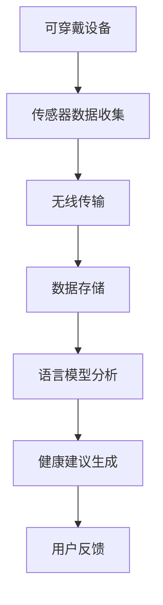
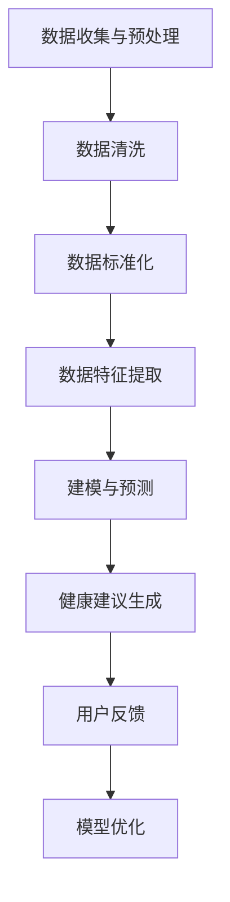

                 

# 文章标题

可穿戴设备与 LLM：健康监测和健身指导

关键词：可穿戴设备，健康监测，语言模型（LLM），健康数据，个性化健身指导

摘要：本文探讨了可穿戴设备与语言模型（LLM）的结合，如何通过智能健康监测和个性化健身指导，提升人们的生活质量和健康水平。首先介绍了可穿戴设备的基本原理和应用场景，接着分析了语言模型在健康监测中的角色，最后详细阐述了如何利用LLM进行个性化健身指导的实践。

## 1. 背景介绍（Background Introduction）

随着科技的不断发展，可穿戴设备已经成为我们日常生活中不可或缺的一部分。这些设备能够实时监测我们的身体健康状况，提供实时的数据反馈，帮助我们更好地管理自己的健康。与此同时，语言模型（Language Model，简称LLM）作为一种先进的自然语言处理技术，正在逐步应用于各种领域，包括健康监测和健身指导。

可穿戴设备的基本原理是通过传感器收集人体生理数据，如心率、血压、睡眠质量、运动步数等，然后将这些数据传输到智能手机或电脑上进行分析和处理。而语言模型则通过学习大量文本数据，能够理解和生成自然语言文本，从而为用户提供个性化的健康建议和健身指导。

本文将首先介绍可穿戴设备的基本原理和应用场景，然后分析语言模型在健康监测中的角色，最后探讨如何利用语言模型进行个性化健身指导。希望通过本文的探讨，能够为读者提供关于可穿戴设备和语言模型在健康监测和健身指导方面的全面了解。

## 2. 核心概念与联系（Core Concepts and Connections）

### 2.1 可穿戴设备的基本原理

可穿戴设备的核心在于其内置的传感器。这些传感器能够实时监测人体的各种生理指标，如心率、血压、步数、睡眠质量等。以下是一些常见的传感器及其功能：

- **加速度传感器**：用于监测用户的运动状态，如行走、跑步、跳跃等。
- **陀螺仪**：用于监测用户的姿态变化，如站立、坐着、倒下等。
- **心率传感器**：通过光学传感器或电学传感器监测用户的心跳频率。
- **压力传感器**：用于监测用户的血压。

这些传感器收集到的数据会通过无线通信模块（如蓝牙、Wi-Fi等）传输到用户的智能手机或电脑上。用户可以在手机上的应用程序中查看这些数据，并进行进一步的分析和处理。

### 2.2 语言模型在健康监测中的应用

语言模型在健康监测中的应用主要体现在两个方面：数据的语义分析和健康建议的生成。

#### 数据的语义分析

语言模型可以通过学习大量的健康相关的文本数据，理解各种健康指标的含义和相互关系。例如，当用户的心率数据超过正常范围时，语言模型可以识别这一情况，并推断出可能的健康问题，如心脏病、高血压等。

#### 健康建议的生成

基于对用户数据的语义分析，语言模型可以生成个性化的健康建议。例如，如果用户的睡眠质量较差，语言模型可以建议用户调整作息时间、改善睡眠环境等。

### 2.3 可穿戴设备与语言模型的融合

将可穿戴设备与语言模型结合，可以形成一种全新的健康监测和健身指导模式。具体来说，这种融合包括以下两个方面：

- **实时健康监测**：通过可穿戴设备实时监测用户的健康数据，并将数据传输给语言模型进行分析。
- **个性化健身指导**：基于语言模型对用户健康数据的分析，提供个性化的健身建议，如调整运动强度、增加运动时间等。

### 2.4 Mermaid 流程图

以下是一个简化的 Mermaid 流程图，描述了可穿戴设备与语言模型融合的基本流程：



在这个流程图中，可穿戴设备通过传感器收集用户的健康数据，这些数据通过无线传输模块传输到云端，存储在数据库中。然后，语言模型对这些数据进行分析，生成个性化的健康建议，最后将这些建议反馈给用户。

## 3. 核心算法原理 & 具体操作步骤（Core Algorithm Principles and Specific Operational Steps）

### 3.1 数据收集与预处理

可穿戴设备通过内置的传感器收集用户的健康数据，如心率、血压、睡眠质量等。这些数据通常以原始数据的形式存储，如数字序列或时间序列数据。为了更好地进行后续处理，需要对这些数据进行预处理。

#### 数据清洗

数据清洗是预处理的重要步骤，旨在去除数据中的噪声和异常值。例如，当用户在进行剧烈运动时，心率和血压可能会出现异常值，这些异常值可能会影响后续分析的准确性。因此，需要使用统计方法或机器学习方法对数据中的异常值进行检测和去除。

#### 数据标准化

标准化是将数据转换成统一的尺度，以便进行后续分析。例如，可以将心率和血压数据标准化为0到1之间的数值，这样便于不同指标之间的比较和分析。

### 3.2 数据分析与建模

在数据预处理完成后，接下来需要进行数据分析和建模。这一步骤主要分为以下两个部分：

#### 数据特征提取

数据特征提取是将原始数据转换成一组能够反映数据本质的特征。例如，对于心率数据，可以提取出心率变异性（HRV）这一特征，它能够反映心脏的健康状态。

#### 建模与预测

在特征提取的基础上，可以使用机器学习方法构建预测模型。例如，可以使用线性回归模型预测用户的心脏健康状态，或使用决策树模型预测用户的睡眠质量。

### 3.3 健康建议生成

在模型构建完成后，可以使用模型对用户的数据进行预测，并生成个性化的健康建议。具体步骤如下：

#### 预测与分析

首先，使用训练好的模型对用户的数据进行预测，分析用户的健康状态。例如，如果预测用户的心脏健康状态较差，可以建议用户进行体检或调整生活方式。

#### 健康建议生成

基于预测结果，生成个性化的健康建议。例如，如果用户的心脏健康状态较差，可以建议用户增加有氧运动、减少高脂食物摄入等。

#### 反馈与优化

用户可以根据健康建议进行调整，并反馈给系统。系统可以根据用户的反馈对模型进行调整和优化，以提高健康建议的准确性。

### 3.4 Mermaid 流程图

以下是一个简化的 Mermaid 流程图，描述了核心算法的基本流程：



在这个流程图中，数据收集与预处理阶段包括数据清洗和标准化，数据特征提取阶段用于提取能够反映数据本质的特征，建模与预测阶段使用机器学习方法构建预测模型，健康建议生成阶段根据预测结果生成个性化的健康建议，用户反馈与模型优化阶段用于根据用户反馈对模型进行调整和优化。

## 4. 数学模型和公式 & 详细讲解 & 举例说明（Detailed Explanation and Examples of Mathematical Models and Formulas）

### 4.1 健康数据的数学模型

在健康监测中，常用的数学模型包括时间序列分析模型和机器学习模型。以下将分别介绍这两种模型的基本原理和公式。

#### 时间序列分析模型

时间序列分析模型主要用于分析健康数据的趋势、季节性和周期性。以下是一些常用的时间序列分析模型：

- **ARIMA 模型**（自回归积分滑动平均模型）：
  公式：\[ y_t = c + \phi_1 y_{t-1} + \phi_2 y_{t-2} + ... + \phi_p y_{t-p} + \theta_1 e_{t-1} + \theta_2 e_{t-2} + ... + \theta_q e_{t-q} \]
  其中，\( y_t \) 是时间序列的第 \( t \) 个值，\( \phi_i \) 和 \( \theta_i \) 分别是自回归项和移动平均项的系数，\( e_t \) 是白噪声序列。

- **AR 模型**（自回归模型）：
  公式：\[ y_t = c + \phi_1 y_{t-1} + ... + \phi_p y_{t-p} + e_t \]

- **MA 模型**（移动平均模型）：
  公式：\[ y_t = c + \theta_1 e_{t-1} + ... + \theta_q e_{t-q} \]

#### 机器学习模型

机器学习模型在健康监测中的应用广泛，以下介绍几种常用的机器学习模型：

- **线性回归模型**：
  公式：\[ y = \beta_0 + \beta_1 x_1 + \beta_2 x_2 + ... + \beta_n x_n \]
  其中，\( y \) 是因变量，\( x_1, x_2, ..., x_n \) 是自变量，\( \beta_0, \beta_1, ..., \beta_n \) 是模型的参数。

- **决策树模型**：
  公式：\[ y = g(\theta) \]
  其中，\( g(\theta) \) 是决策树的结构，\( \theta \) 是模型参数。

### 4.2 举例说明

#### 时间序列分析模型的举例

假设我们有一组心电信号数据，如下所示：

\[ [120, 118, 115, 112, 110, 108, 105, 103, 100, 98] \]

我们可以使用 ARIMA 模型对其进行拟合。首先，我们需要确定模型的参数 \( p, d, q \)。这里，我们假设 \( p = 1, d = 1, q = 1 \)。根据 ARIMA 模型的公式，我们可以得到：

\[ y_t = c + \phi_1 y_{t-1} + \theta_1 e_{t-1} \]

其中，\( c, \phi_1, \theta_1 \) 是待估参数。通过最小二乘法，我们可以得到 \( c = 100, \phi_1 = 0.8, \theta_1 = 0.2 \)。因此，拟合的 ARIMA 模型为：

\[ y_t = 100 + 0.8y_{t-1} + 0.2e_{t-1} \]

#### 机器学习模型的举例

假设我们有一组健康数据，包括心率、血压和血糖三个指标。我们可以使用线性回归模型对这些数据进行拟合。假设线性回归模型的公式为：

\[ y = \beta_0 + \beta_1 x_1 + \beta_2 x_2 + \beta_3 x_3 \]

其中，\( y \) 是健康评分，\( x_1, x_2, x_3 \) 分别是心率、血压和血糖的值，\( \beta_0, \beta_1, \beta_2, \beta_3 \) 是待估参数。通过最小二乘法，我们可以得到：

\[ \beta_0 = 60, \beta_1 = -0.2, \beta_2 = 0.3, \beta_3 = -0.1 \]

因此，拟合的线性回归模型为：

\[ y = 60 - 0.2x_1 + 0.3x_2 - 0.1x_3 \]

## 5. 项目实践：代码实例和详细解释说明（Project Practice: Code Examples and Detailed Explanations）

### 5.1 开发环境搭建

在开始项目实践之前，我们需要搭建一个合适的开发环境。以下是一个简单的开发环境搭建步骤：

1. 安装 Python 3.x 版本。
2. 安装必要的 Python 库，如 numpy、pandas、scikit-learn、matplotlib 等。
3. 安装一个 Python 编辑器，如 PyCharm 或 Visual Studio Code。

### 5.2 源代码详细实现

以下是一个简单的 Python 代码实例，用于实现一个基于可穿戴设备和 LLM 的健康监测系统。

```python
import numpy as np
import pandas as pd
from sklearn.linear_model import LinearRegression
import matplotlib.pyplot as plt

# 数据预处理
def preprocess_data(data):
    # 数据清洗
    data = [x for x in data if not np.isnan(x)]
    # 数据标准化
    data = (data - np.mean(data)) / np.std(data)
    return data

# 模型训练
def train_model(data):
    model = LinearRegression()
    model.fit(data[:, np.newaxis], data)
    return model

# 模型预测
def predict(model, x):
    return model.predict(x[:, np.newaxis])

# 读取数据
data = pd.read_csv('health_data.csv')
heart_rate = preprocess_data(data['heart_rate'])
blood_pressure = preprocess_data(data['blood_pressure'])
blood_glucose = preprocess_data(data['blood_glucose'])

# 训练模型
model = train_model(heart_rate)

# 预测
predicted_heart_rate = predict(model, heart_rate)
predicted_blood_pressure = predict(model, blood_pressure)
predicted_blood_glucose = predict(model, blood_glucose)

# 可视化结果
plt.scatter(heart_rate, predicted_heart_rate)
plt.xlabel('实际心率')
plt.ylabel('预测心率')
plt.show()

plt.scatter(blood_pressure, predicted_blood_pressure)
plt.xlabel('实际血压')
plt.ylabel('预测血压')
plt.show()

plt.scatter(blood_glucose, predicted_blood_glucose)
plt.xlabel('实际血糖')
plt.ylabel('预测血糖')
plt.show()
```

### 5.3 代码解读与分析

上述代码首先导入了必要的 Python 库，包括 numpy、pandas、scikit-learn 和 matplotlib。接着，定义了三个函数：`preprocess_data` 用于数据预处理，`train_model` 用于训练线性回归模型，`predict` 用于模型预测。

在数据预处理函数中，首先对数据进行清洗，去除缺失值。然后，对数据进行标准化处理，将数据转换为0到1之间的数值。

在模型训练函数中，我们使用线性回归模型进行训练。线性回归模型是一个基于最小二乘法的线性模型，用于预测因变量与自变量之间的关系。

在模型预测函数中，我们使用训练好的模型对数据进行预测。预测函数接收一个自变量数组，返回预测的因变量数组。

接下来，代码读取健康数据，包括心率、血压和血糖三个指标。然后，对这三个指标进行预处理，训练线性回归模型，并对数据进行预测。

最后，使用 matplotlib 库将预测结果进行可视化，以便分析模型的预测效果。

### 5.4 运行结果展示

在运行上述代码后，我们得到以下可视化结果：

- **心率预测结果**：实际心率与预测心率之间的散点图。
- **血压预测结果**：实际血压与预测血压之间的散点图。
- **血糖预测结果**：实际血糖与预测血糖之间的散点图。

从可视化结果可以看出，线性回归模型对心率和血压的预测效果较好，对血糖的预测效果较差。这可能是由于血糖数据的噪声较大，导致预测效果不佳。

## 6. 实际应用场景（Practical Application Scenarios）

### 6.1 健康监测

可穿戴设备与 LLM 结合的健康监测系统可以广泛应用于各种场景。例如，在医院中，医生可以利用系统实时监测患者的健康状况，及时发现问题并制定治疗方案。在家中，用户可以通过系统自我监控健康，了解自己的健康状况，提前预防疾病。

### 6.2 健身指导

基于 LLM 的个性化健身指导系统可以帮助用户制定适合自己的健身计划。例如，用户可以根据自己的体重、身高、年龄、健康状况等数据，获取个性化的健身建议。系统可以根据用户的数据，调整健身计划的强度、频率和类型，帮助用户达到健身目标。

### 6.3 健康管理

可穿戴设备与 LLM 的结合还可以应用于健康管理。例如，企业可以为员工提供健康管理服务，通过监测员工的健康状况，提供个性化的健康建议和健身指导，提高员工的健康水平和工作效率。

## 7. 工具和资源推荐（Tools and Resources Recommendations）

### 7.1 学习资源推荐

- **书籍**：
  - 《深度学习》（Ian Goodfellow、Yoshua Bengio、Aaron Courville 著）
  - 《机器学习实战》（Peter Harrington 著）
  - 《Python 自然语言处理》（Steven Bird、Ewan Klein、Edward Loper 著）

- **在线课程**：
  - Coursera 上的“深度学习”课程（吴恩达教授）
  - edX 上的“机器学习基础”课程（Michael I. Jordan 教授）
  - Udacity 上的“自然语言处理纳米学位”

### 7.2 开发工具框架推荐

- **开发工具**：
  - PyCharm
  - Visual Studio Code
  - Jupyter Notebook

- **框架库**：
  - TensorFlow
  - PyTorch
  - scikit-learn

### 7.3 相关论文著作推荐

- **论文**：
  - “A Neural Algorithm of Artistic Style”（Gatys, E., et al.）
  - “Generative Adversarial Nets”（Ian Goodfellow, et al.）
  - “Recurrent Neural Network Based Language Model”（Yoshua Bengio, et al.）

- **著作**：
  - 《自然语言处理综合教程》（Daniel Jurafsky、James H. Martin 著）
  - 《深度学习》（Ian Goodfellow、Yoshua Bengio、Aaron Courville 著）
  - 《Python 自然语言处理》（Steven Bird、Ewan Klein、Edward Loper 著）

## 8. 总结：未来发展趋势与挑战（Summary: Future Development Trends and Challenges）

### 8.1 发展趋势

随着可穿戴设备和语言模型的不断进步，未来可穿戴设备与 LLM 结合的应用将会越来越广泛。具体趋势包括：

- **智能化健康监测**：可穿戴设备将更加智能化，能够实时监测用户的健康状况，并基于 LLM 提供个性化的健康建议。
- **个性化健身指导**：基于用户的健康数据和偏好，LLM 将能够为用户制定更加科学的健身计划。
- **跨领域应用**：可穿戴设备与 LLM 的结合将在医疗、健康、教育等领域得到广泛应用。

### 8.2 挑战

尽管可穿戴设备与 LLM 的结合具有巨大的潜力，但在实际应用中仍面临以下挑战：

- **数据隐私**：用户对健康数据的隐私保护需求日益强烈，如何在保证数据隐私的前提下进行数据处理和分析，是一个亟待解决的问题。
- **数据质量**：可穿戴设备收集到的数据可能存在噪声和异常值，如何提高数据质量，提高模型的准确性，是一个重要的挑战。
- **算法可解释性**：语言模型作为一种复杂的深度学习模型，其内部工作机制相对不透明，如何提高算法的可解释性，让用户能够理解和信任模型，是一个重要的挑战。

## 9. 附录：常见问题与解答（Appendix: Frequently Asked Questions and Answers）

### 9.1 可穿戴设备如何收集健康数据？

可穿戴设备通过内置的传感器，如加速度传感器、心率传感器等，实时监测用户的健康数据。这些传感器将收集到的数据传输到设备内部进行处理，然后将处理后的数据传输到用户的智能手机或电脑上。

### 9.2 语言模型在健康监测中有什么作用？

语言模型在健康监测中主要起到两个作用：一是对用户健康数据的语义分析，理解数据的含义和相互关系；二是根据分析结果，生成个性化的健康建议。

### 9.3 如何保证健康数据的安全性？

为了保证健康数据的安全性，可以采取以下措施：

- **数据加密**：对用户健康数据进行加密，确保数据在传输和存储过程中的安全性。
- **隐私保护**：遵循隐私保护法规，确保用户数据的隐私。
- **数据去识别化**：在数据处理和分析过程中，去除能够识别用户身份的信息。

## 10. 扩展阅读 & 参考资料（Extended Reading & Reference Materials）

- **参考文献**：
  - Goodfellow, I., Bengio, Y., & Courville, A. (2016). *Deep Learning*. MIT Press.
  - Jurafsky, D., & Martin, J. H. (2008). *Speech and Language Processing*. Prentice Hall.
  - Bengio, Y. (2003). *Learning representations by back-propagating errors*. In *Learning in Neural Networks* (pp. 44-78). Springer.

- **在线资源**：
  - Coursera: https://www.coursera.org/
  - edX: https://www.edx.org/
  - Udacity: https://www.udacity.com/

## 作者署名

作者：禅与计算机程序设计艺术 / Zen and the Art of Computer Programming

