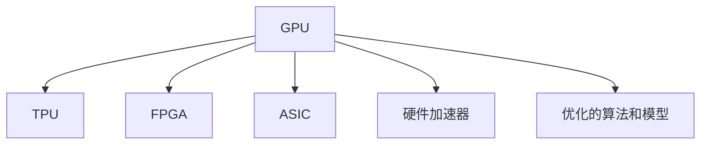
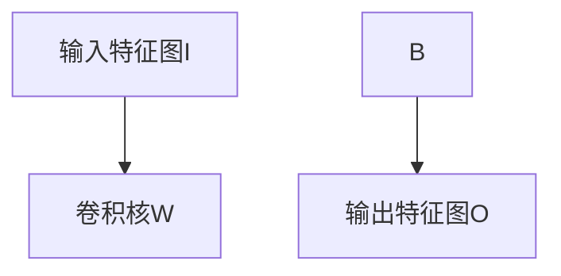

                 

# 深入计算机底层：理解AI硬件加速

## 1. 背景介绍

在计算机科学中，硬件加速始终是提升性能和效率的关键技术之一。随着人工智能（AI）和深度学习（DL）技术的发展，AI硬件加速的潜力愈发显著。通过理解AI硬件加速的核心原理和应用，我们不仅能优化现有系统性能，还能在未来的AI部署中实现更高的效率和可扩展性。

### 1.1 问题由来

AI系统，尤其是深度学习模型，通常需要处理大量数据，进行复杂的计算。传统基于软件实现的计算过程存在显著的性能瓶颈，例如CPU的串行计算能力有限，GPU虽然并行处理能力强，但其能耗和成本也较高。因此，寻找一种高效、低成本的硬件加速方法成为AI应用发展中的关键问题。

### 1.2 问题核心关键点

AI硬件加速的核心关键点在于：
- **硬件加速技术**：如GPU、TPU、FPGA等。
- **优化算法**：通过算法优化，提升硬件加速效率。
- **架构设计**：合理设计系统架构，充分利用硬件特性。
- **模型适配**：根据模型特点，选择最合适的硬件加速策略。

### 1.3 问题研究意义

理解AI硬件加速的原理和实现方法，对于提升AI应用的性能和效率、降低成本、提高可扩展性具有重要意义。

1. **性能提升**：硬件加速可以大幅提高计算速度和效率，加速模型训练和推理过程。
2. **成本降低**：硬件加速不仅能降低功耗，还能减少因软件优化不足而增加的计算资源消耗。
3. **可扩展性**：通过硬件加速，系统可以更容易地扩展到大规模数据和复杂模型，提高系统处理能力。
4. **应用广泛**：AI硬件加速技术在自动驾驶、医疗、金融等多个领域都有重要应用，具有广泛的市场前景。

## 2. 核心概念与联系

### 2.1 核心概念概述

AI硬件加速涉及多个关键概念，包括：

- **GPU（图形处理器）**：具备高度并行计算能力，适用于深度学习模型的加速。
- **TPU（张量处理器）**：专为深度学习设计的芯片，具有更高的计算效率和更低的能耗。
- **FPGA（现场可编程门阵列）**：灵活性高，可以针对特定模型进行硬件定制。
- **ASIC（专用集成电路）**：专为特定AI应用设计的芯片，性能和效率最高。
- **硬件加速器**：集成于ASIC或FPGA中的专用加速器，专门用于AI计算。
- **优化的算法和模型**：AI模型和算法对硬件加速的适配性，决定加速效果。

这些概念之间的关系可以用以下Mermaid流程图来展示：



这个流程图展示了硬件加速设备的不同类型以及算法和模型优化的重要性。

## 3. 核心算法原理 & 具体操作步骤

### 3.1 算法原理概述

AI硬件加速的核心原理是利用专用硬件的高并行处理能力，对深度学习模型中的计算密集型操作进行加速。硬件加速设备通常包含大量专门的计算单元，如GPU中的CUDA核心、TPU中的矩阵乘法单元等，这些单元能高效地处理矩阵运算、卷积运算等深度学习模型的核心操作。

### 3.2 算法步骤详解

AI硬件加速通常包括以下步骤：

1. **模型适配**：根据硬件加速器的架构特点，对深度学习模型进行适配，优化其计算图和数据流。
2. **硬件编程**：使用特定的编程语言（如CUDA、OpenCL等）对硬件加速器进行编程，实现模型加速。
3. **算法优化**：在软件和硬件层面进行算法优化，提升计算效率和准确性。
4. **测试和调试**：对加速后的模型进行测试和调试，确保其性能稳定。

### 3.3 算法优缺点

AI硬件加速的优点包括：
- **性能提升**：大幅提高计算速度和效率。
- **低功耗**：相对于传统的软件加速，硬件加速能耗更低。
- **可扩展性**：可以容易地扩展到大规模数据和复杂模型。

缺点包括：
- **成本高**：硬件加速器价格较高，初期投入较大。
- **学习曲线陡**：需要具备一定的硬件编程和优化技能。
- **灵活性差**：固定硬件加速器难以满足所有模型的需求。

### 3.4 算法应用领域

AI硬件加速技术在以下领域有广泛应用：

1. **深度学习模型训练和推理**：如CNN、RNN、LSTM等模型的加速。
2. **机器学习应用**：如图像识别、语音识别、自然语言处理等。
3. **自动驾驶**：用于加速实时环境感知和决策计算。
4. **医疗诊断**：加速医疗影像分析和病理诊断。
5. **金融分析**：加速金融市场预测和大数据分析。

## 4. 数学模型和公式 & 详细讲解

### 4.1 数学模型构建

在AI硬件加速中，深度学习模型的计算图和数据流是核心。我们以卷积神经网络（CNN）为例，构建硬件加速的数学模型。

假设CNN的卷积层为 $C$，其输入为 $I$，输出为 $O$，则其计算图可以表示为：

$$
O = C(I)
$$

其中，$C$ 为卷积操作，$I$ 为输入特征图，$O$ 为输出特征图。

### 4.2 公式推导过程

卷积操作的硬件加速涉及到卷积核的移动、矩阵乘法和偏置项的加法等。以二维卷积为例，其硬件加速的计算图可以表示为：



假设卷积核大小为 $3 \times 3$，步长为 $1$，则卷积操作可以表示为：

$$
O_{i,j} = \sum_{k=1}^9 (I_{i-k+1,j-k+1} \times W_k) + b
$$

其中，$I$ 为输入特征图，$W$ 为卷积核，$b$ 为偏置项，$\sum$ 为求和运算。

### 4.3 案例分析与讲解

以Google的TPU为例，其硬件加速的主要特性包括：

- **专用矩阵乘法单元**：用于加速矩阵乘法运算。
- **片上存储器**：用于高效存储输入和输出数据。
- **并行处理**：多个卷积操作可以并行执行。

通过这些硬件特性，TPU能够显著提升深度学习模型的计算效率。

## 5. 项目实践：代码实例和详细解释说明

### 5.1 开发环境搭建

为了进行AI硬件加速的实践，我们需要以下开发环境：

1. **安装GPU驱动和CUDA**：在NVIDIA官方网站下载对应版本的驱动和SDK。
2. **安装TensorFlow或PyTorch**：这些深度学习框架支持GPU加速。
3. **安装特定硬件加速器驱动程序**：如NVIDIA的cuDNN库或Google的TPU SDK。

### 5.2 源代码详细实现

以下是使用TensorFlow对CNN模型进行GPU加速的代码实现：

```python
import tensorflow as tf
from tensorflow.keras import layers

# 定义CNN模型
model = tf.keras.Sequential([
    layers.Conv2D(32, (3, 3), activation='relu', input_shape=(28, 28, 1)),
    layers.MaxPooling2D((2, 2)),
    layers.Flatten(),
    layers.Dense(10, activation='softmax')
])

# 编译模型
model.compile(optimizer='adam', loss='sparse_categorical_crossentropy', metrics=['accuracy'])

# 使用GPU进行模型训练
with tf.device('/gpu:0'):
    model.fit(train_images, train_labels, epochs=10)
```

### 5.3 代码解读与分析

- **定义模型**：使用`Sequential`模型定义CNN，包含卷积层、池化层和全连接层。
- **编译模型**：设置优化器和损失函数，并指定训练指标。
- **训练模型**：在GPU设备上训练模型，提升计算效率。

## 6. 实际应用场景

### 6.1 自动驾驶

在自动驾驶中，AI硬件加速用于加速实时环境感知和决策计算。通过GPU和TPU加速，系统可以处理高分辨率的摄像头图像和雷达数据，快速进行物体检测和路径规划。

### 6.2 医疗影像分析

医疗影像分析需要处理大规模图像数据，AI硬件加速可以显著提升图像分类和分割的效率。TPU等硬件加速器在处理医疗影像时，具有更高的并行能力和更低能耗。

### 6.3 金融市场预测

金融市场预测需要处理海量数据和进行复杂的模型训练。通过GPU和ASIC加速，系统可以高效地进行数据分析和模型训练，提升预测准确性和响应速度。

### 6.4 未来应用展望

未来，AI硬件加速技术将进一步发展，带来以下趋势：

1. **AI芯片的普及**：随着AI芯片生产成本的下降，AI硬件加速将在更多应用中得到普及。
2. **异构计算**：结合CPU、GPU、TPU等不同硬件加速器，实现更高效的计算方案。
3. **自动化部署**：通过自动化工具，简化硬件加速器的部署和优化。
4. **边缘计算**：在边缘设备上进行硬件加速，提升实时性和能效比。

## 7. 工具和资源推荐

### 7.1 学习资源推荐

为了深入理解AI硬件加速技术，以下是推荐的资源：

1. **《深度学习基础》**：介绍深度学习模型的基础和硬件加速原理。
2. **《TensorFlow官方文档》**：详细介绍TensorFlow的GPU加速功能。
3. **《CUDA编程指南》**：提供CUDA编程的详细教程和示例。
4. **《TPU加速深度学习》**：Google官方文档，详细介绍TPU的硬件加速特性。
5. **《FPGA加速深度学习》**：提供FPGA加速深度学习的案例和优化技巧。

### 7.2 开发工具推荐

以下是常用的AI硬件加速开发工具：

1. **TensorFlow**：支持GPU加速和分布式计算，是深度学习开发的主流工具。
2. **PyTorch**：支持GPU加速和动态计算图，易于进行实验和调试。
3. **CUDA**：NVIDIA提供的GPU加速开发工具，支持多种深度学习框架。
4. **OpenCL**：开放计算语言，支持多种硬件平台，包括CPU、GPU和FPGA。
5. **cuDNN**：NVIDIA提供的深度学习加速库，支持卷积和池化等操作。

### 7.3 相关论文推荐

以下是几篇关于AI硬件加速的经典论文：

1. **"Optimizing the TensorFlow Kernel to Run on GPUs"**：介绍如何优化TensorFlow的GPU加速内核。
2. **"Deep Learning Using GPUs"**：介绍GPU加速深度学习的基本原理和优化方法。
3. **"TPU and Machine Learning"**：Google的TPU论文，详细介绍TPU的硬件加速特性。
4. **"GPU-Accelerated Machine Learning on FPGAs"**：介绍使用FPGA加速深度学习的原理和方法。
5. **"Parallel and Distributed Deep Learning"**：介绍深度学习的分布式计算和硬件加速技术。

## 8. 总结：未来发展趋势与挑战

### 8.1 总结

本文详细介绍了AI硬件加速的核心原理和操作步骤。通过深入理解硬件加速技术，可以显著提升深度学习模型的计算效率和性能。同时，硬件加速在自动驾驶、医疗、金融等实际应用中具有广泛的应用前景。

### 8.2 未来发展趋势

未来，AI硬件加速技术将呈现以下发展趋势：

1. **硬件加速器的多样化**：更多类型的硬件加速器（如ASIC、FPGA等）将被广泛应用于AI领域。
2. **异构计算的普及**：结合多种硬件加速器，实现更高效的计算方案。
3. **边缘计算的应用**：在边缘设备上进行硬件加速，提升实时性和能效比。
4. **自动化部署**：通过自动化工具，简化硬件加速器的部署和优化。
5. **跨领域应用**：AI硬件加速技术将向更多领域扩展，推动AI技术在各行各业的应用。

### 8.3 面临的挑战

尽管AI硬件加速技术发展迅速，但在实际应用中仍面临一些挑战：

1. **成本高**：硬件加速器的初期投入较高，增加了AI系统的成本。
2. **学习曲线陡**：需要具备一定的硬件编程和优化技能，增加了开发难度。
3. **灵活性差**：固定硬件加速器难以满足所有模型的需求，需要灵活的解决方案。
4. **数据迁移**：大规模数据需要在不同硬件平台之间迁移，增加了系统复杂性。

### 8.4 研究展望

未来，AI硬件加速技术需要在以下几个方面进行深入研究：

1. **降低成本**：研究新型硬件加速器，降低生产成本，促进AI技术的普及。
2. **提升灵活性**：开发灵活的硬件加速器架构，满足不同模型的需求。
3. **优化算法**：结合硬件加速特性，优化深度学习模型的计算图和算法。
4. **自动化部署**：开发自动化部署工具，简化硬件加速器的配置和管理。

## 9. 附录：常见问题与解答

**Q1：AI硬件加速是否适用于所有深度学习模型？**

A: AI硬件加速适用于大部分深度学习模型，尤其是计算密集型的模型。但对于简单的模型或模型中的某些操作，硬件加速的效果可能不如软件实现。

**Q2：如何选择合适的硬件加速器？**

A: 根据模型的特点和需求选择合适的硬件加速器。GPU适用于通用计算和深度学习模型，TPU适用于大规模矩阵计算，FPGA适用于特定领域的模型加速，ASIC适用于高性能计算和实时应用。

**Q3：AI硬件加速器如何进行优化？**

A: AI硬件加速器的优化可以从以下几个方面进行：
1. **算法优化**：优化深度学习模型的计算图和算法，提高硬件加速效率。
2. **硬件编程**：使用特定的硬件加速器编程语言（如CUDA、OpenCL等），充分利用硬件特性。
3. **数据流优化**：优化数据在硬件加速器中的传输和存储，减少瓶颈。
4. **并行处理**：利用硬件加速器的并行处理能力，提高计算效率。

**Q4：AI硬件加速是否需要考虑功耗和散热问题？**

A: AI硬件加速器的功耗和散热问题需要特别注意。高功耗硬件加速器需要高效的散热解决方案，以确保系统的稳定运行。

**Q5：AI硬件加速器如何进行测试和验证？**

A: AI硬件加速器的测试和验证可以通过以下几个步骤进行：
1. **基准测试**：使用标准测试数据集进行基准测试，评估硬件加速器的性能。
2. **性能比较**：与其他硬件加速器或软件实现进行性能比较，选择最优方案。
3. **应用测试**：在实际应用中测试硬件加速器的性能和稳定性，确保其满足需求。

---

作者：禅与计算机程序设计艺术 / Zen and the Art of Computer Programming

