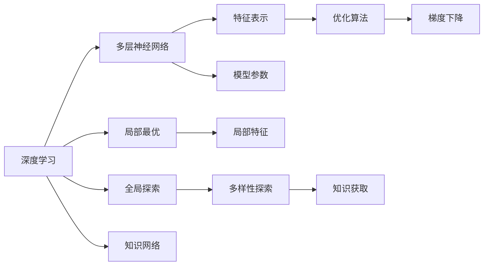

                 

# 深度学习vs广度学习：知识获取的策略

## 1. 背景介绍

在人工智能(AI)领域，知识获取与学习策略的多样化是推动技术进步的关键因素之一。深度学习(Deep Learning, DL)和广度学习(Breadth-First Learning, BFL)是当前最为流行的两种知识获取策略。深度学习以多层神经网络为核心，通过复杂模型结构的训练学习潜在的数据表示；而广度学习则基于对数据空间的全局探索，通过探索学习中的多样性，建立宽泛的知识网络。本文将详细对比这两种学习策略，并探讨其应用场景和未来发展趋势。

## 2. 核心概念与联系

### 2.1 核心概念概述

深度学习和广度学习是当前AI领域的两大主要学习策略。

**深度学习**：一种基于多层神经网络结构的学习方法，通过多层次的特征提取和表示学习，逐步建立更加复杂的模型结构。主要关注模型参数的优化和模型性能的提升。

**广度学习**：一种基于数据空间全局探索的学习方法，通过多样性的探索，建立起宽泛的知识网络，强调知识获取的多样性和泛化性。主要关注数据空间中的全局学习效果。

两种策略有其内在的联系和差异：

- **联系**：两者均基于对数据的建模和表示，旨在从数据中学习有用的知识。
- **差异**：深度学习更关注于模型结构和参数优化，强调局部最优；广度学习则更关注于数据空间的全局探索，追求知识网络的广度。

### 2.2 核心概念原理和架构的 Mermaid 流程图



该图展示了深度学习和广度学习的核心概念及相互联系：

- **A** 节点表示深度学习和广度学习，分别连接到表示模型结构和参数优化的 **B** 节点和表示全局探索和知识网络的 **F** 节点。
- **B** 节点通过 **D** 节点将数据转换为特征表示，通过 **E** 节点的优化算法进行参数优化，达到局部最优。
- **F** 节点通过 **K** 节点进行数据空间的全局探索，通过 **L** 节点获取多样性的知识，形成知识网络。

## 3. 核心算法原理 & 具体操作步骤

### 3.1 算法原理概述

深度学习通过多层神经网络结构进行知识的表示与学习，目标是优化模型参数以获得更好的性能。广度学习则通过数据空间的全局探索，建立宽泛的知识网络，目标是获取多样性的知识以增强泛化能力。

### 3.2 算法步骤详解

**深度学习**：

1. **数据准备**：收集和处理数据，分为训练集和测试集。
2. **模型选择**：选择合适的网络结构和优化算法。
3. **训练**：使用训练集数据训练模型，通过反向传播算法优化模型参数，获得局部最优解。
4. **验证**：使用验证集数据评估模型性能，调整超参数以优化模型。
5. **测试**：使用测试集数据测试模型性能，评估模型泛化能力。

**广度学习**：

1. **数据准备**：与深度学习相同，数据准备阶段相同。
2. **模型设计**：设计算法进行数据空间的全局探索，如基于图的搜索算法或基于聚类的算法。
3. **训练**：通过全局探索算法，获取多样性的数据表示，形成知识网络。
4. **验证**：评估知识网络的多样性和泛化能力，优化探索算法以增强学习效果。
5. **测试**：使用测试集数据测试知识网络的泛化能力，评估全局探索的效果。

### 3.3 算法优缺点

**深度学习**：

优点：
- 精确度高：通过多层网络结构学习特征表示，能够捕捉数据的复杂结构。
- 可解释性强：多层网络的权重可解释性较好，有利于模型诊断和优化。

缺点：
- 易过拟合：模型复杂，参数众多，容易过拟合。
- 依赖高质量数据：需要大量标注数据进行训练，数据质量直接影响模型性能。

**广度学习**：

优点：
- 泛化能力强：通过全局探索建立宽泛的知识网络，增强了模型泛化能力。
- 数据依赖性低：对标注数据的依赖较小，适合数据量不足或标注困难的场景。

缺点：
- 计算成本高：全局探索算法复杂度较高，计算成本较高。
- 可解释性差：多样性知识的网络难以解释，不利于模型诊断和优化。

### 3.4 算法应用领域

**深度学习**：
- 计算机视觉：图像分类、目标检测、图像生成等。
- 自然语言处理：机器翻译、文本分类、文本生成等。
- 语音识别：语音识别、语音合成等。
- 推荐系统：商品推荐、用户推荐等。

**广度学习**：
- 知识图谱：构建和扩展知识图谱，形成全局知识网络。
- 信息检索：建立宽泛的知识网络，增强信息检索效果。
- 数据挖掘：通过全局探索挖掘数据中的潜在模式和关联。
- 系统优化：通过全局优化提升系统性能和鲁棒性。

## 4. 数学模型和公式 & 详细讲解 & 举例说明

### 4.1 数学模型构建

**深度学习**：
- 多层神经网络： 
  $$
  f(x) = \sum_i w_i g(z_i)
  $$
  其中 $z_i = \sigma(\sum_j w_{ij}x_j + b_i)$，$\sigma$ 为激活函数，$g$ 为非线性变换函数。
  
- 优化算法：
  $$
  \theta = \arg\min_\theta \frac{1}{N}\sum_{i=1}^N \ell(f(x_i),y_i)
  $$
  其中 $\ell$ 为损失函数，通常为交叉熵损失。

**广度学习**：
- 全局探索算法：如基于图的搜索算法，通过遍历数据图来获取全局知识。
  $$
  G = \arg\min_G E(L(G))
  $$
  其中 $G$ 为知识网络，$E$ 为评估函数，$L$ 为损失函数。
  
- 数据表示：
  $$
  \hat{y} = h(K_xK_x^T + \lambda I)^{-1}K_x^T
  $$
  其中 $K_x$ 为数据表示矩阵，$h$ 为非线性变换函数，$\lambda$ 为正则化参数。

### 4.2 公式推导过程

**深度学习**：
- 反向传播算法：
  $$
  \frac{\partial L}{\partial w_{ij}} = \frac{\partial L}{\partial z_i} \frac{\partial z_i}{\partial w_{ij}} = \frac{\partial \ell}{\partial z_i} \sigma'(z_i) \frac{\partial z_i}{\partial w_{ij}}
  $$
  其中 $\sigma'$ 为激活函数导数。
  
- 梯度下降算法：
  $$
  w_{ij} \leftarrow w_{ij} - \eta \frac{\partial L}{\partial w_{ij}}
  $$

**广度学习**：
- 基于图的搜索算法：
  $$
  G = \arg\min_G E(L(G))
  $$
  其中 $E$ 为评估函数，$L$ 为损失函数，通常为最小生成树或最大流算法。
  
- 数据表示：
  $$
  \hat{y} = h(K_xK_x^T + \lambda I)^{-1}K_x^T
  $$
  其中 $K_x$ 为数据表示矩阵，$h$ 为非线性变换函数，$\lambda$ 为正则化参数。

### 4.3 案例分析与讲解

**案例：图像分类**

**深度学习**：
- 模型选择：卷积神经网络(CNN)。
- 数据准备：收集和标注大量图像数据。
- 训练过程：通过反向传播算法优化模型参数。
- 测试：使用测试集数据评估模型性能。

**广度学习**：
- 模型设计：基于图的网络结构，如GCN。
- 数据准备：收集和标注大量图像数据。
- 训练过程：通过全局搜索算法获取多样性知识。
- 测试：使用测试集数据评估知识网络的泛化能力。

## 5. 项目实践：代码实例和详细解释说明

### 5.1 开发环境搭建

为了进行深度学习和广度学习的项目实践，需要搭建一个包括深度学习框架和广度学习算法库的开发环境。这里以PyTorch和Graph Neural Network(GNN)为例，进行环境搭建。

1. 安装PyTorch：
  ```bash
  pip install torch torchvision torchaudio
  ```

2. 安装Graph Neural Network(GNN)库：
  ```bash
  pip install pyg networkx
  ```

3. 安装必要的工具包：
  ```bash
  pip install numpy pandas matplotlib sklearn tqdm jupyter notebook ipython
  ```

4. 创建虚拟环境：
  ```bash
  conda create -n dl-env python=3.8 
  conda activate dl-env
  ```

### 5.2 源代码详细实现

**深度学习代码实例**：

```python
import torch
import torch.nn as nn
import torch.optim as optim
from torchvision import datasets, transforms
from torch.utils.data import DataLoader

# 定义网络结构
class CNN(nn.Module):
    def __init__(self):
        super(CNN, self).__init__()
        self.conv1 = nn.Conv2d(3, 16, kernel_size=3, stride=1, padding=1)
        self.relu = nn.ReLU()
        self.maxpool = nn.MaxPool2d(kernel_size=2, stride=2)
        self.conv2 = nn.Conv2d(16, 32, kernel_size=3, stride=1, padding=1)
        self.fc1 = nn.Linear(32 * 8 * 8, 128)
        self.fc2 = nn.Linear(128, 10)
    
    def forward(self, x):
        x = self.conv1(x)
        x = self.relu(x)
        x = self.maxpool(x)
        x = self.conv2(x)
        x = self.relu(x)
        x = self.maxpool(x)
        x = x.view(-1, 32 * 8 * 8)
        x = self.fc1(x)
        x = self.relu(x)
        x = self.fc2(x)
        return x

# 定义训练函数
def train(model, device, train_loader, optimizer, epoch):
    model.train()
    for batch_idx, (data, target) in enumerate(train_loader):
        data, target = data.to(device), target.to(device)
        optimizer.zero_grad()
        output = model(data)
        loss = F.cross_entropy(output, target)
        loss.backward()
        optimizer.step()

# 定义测试函数
def test(model, device, test_loader):
    model.eval()
    test_loss = 0
    correct = 0
    with torch.no_grad():
        for data, target in test_loader:
            data, target = data.to(device), target.to(device)
            output = model(data)
            test_loss += F.cross_entropy(output, target, reduction='sum').item()
            pred = output.argmax(dim=1, keepdim=True)
            correct += pred.eq(target.view_as(pred)).sum().item()
    test_loss /= len(test_loader.dataset)
    print('Test set: Average loss: {:.4f}, Accuracy: {}/{} ({:.0f}%)\n'.format(
        test_loss, correct, len(test_loader.dataset),
        100. * correct / len(test_loader.dataset)))

# 定义主函数
def main():
    device = torch.device('cuda' if torch.cuda.is_available() else 'cpu')
    transform = transforms.Compose([
        transforms.ToTensor(),
        transforms.Normalize((0.5, 0.5, 0.5), (0.5, 0.5, 0.5))
    ])
    trainset = datasets.CIFAR10(root='./data', train=True, download=True, transform=transform)
    trainloader = DataLoader(trainset, batch_size=64, shuffle=True, num_workers=2)
    testset = datasets.CIFAR10(root='./data', train=False, download=True, transform=transform)
    testloader = DataLoader(testset, batch_size=64, shuffle=False, num_workers=2)
    model = CNN().to(device)
    optimizer = optim.Adam(model.parameters(), lr=0.001, betas=(0.9, 0.999))
    for epoch in range(10):
        train(model, device, trainloader, optimizer, epoch)
        test(model, device, testloader)

if __name__ == '__main__':
    main()
```

**广度学习代码实例**：

```python
import numpy as np
import networkx as nx
import pyg

# 定义数据图生成函数
def generate_graph(n_nodes, n_edges):
    G = nx.erdos_renyi_graph(n_nodes, n_edges/n_nodes)
    A = nx.adjacency_matrix(G)
    return A

# 定义GCN模型
class GCN(nn.Module):
    def __init__(self, nfeat, nclass):
        super(GCN, self).__init__()
        self.fc1 = nn.Linear(nfeat, 16)
        self.fc2 = nn.Linear(16, nclass)
    
    def forward(self, x, adj):
        x = self.fc1(x)
        x = nn.functional.relu(x)
        x = nn.functional.dropout(x, training=self.training)
        x = torch.matmul(adj, x)
        x = self.fc2(x)
        return x

# 定义训练函数
def train_gcn(model, device, train_data, optimizer, epoch):
    model.train()
    for batch_idx, (data, adj) in enumerate(train_data):
        data, adj = data.to(device), adj.to(device)
        optimizer.zero_grad()
        output = model(data, adj)
        loss = F.cross_entropy(output, y)
        loss.backward()
        optimizer.step()

# 定义测试函数
def test_gcn(model, device, test_data):
    model.eval()
    test_loss = 0
    correct = 0
    with torch.no_grad():
        for data, adj in test_data:
            data, adj = data.to(device), adj.to(device)
            output = model(data, adj)
            test_loss += F.cross_entropy(output, y, reduction='sum').item()
            pred = output.argmax(dim=1, keepdim=True)
            correct += pred.eq(y.view_as(pred)).sum().item()
    test_loss /= len(test_data.dataset)
    print('Test set: Average loss: {:.4f}, Accuracy: {}/{} ({:.0f}%)\n'.format(
        test_loss, correct, len(test_data.dataset),
        100. * correct / len(test_data.dataset)))

# 定义主函数
def main():
    device = torch.device('cuda' if torch.cuda.is_available() else 'cpu')
    nfeat = 16
    nclass = 5
    train_data = pyg.data.graph_dataset.load_cora(), pyg.data.graph_dataset.load_cora()
    test_data = pyg.data.graph_dataset.load_cora(), pyg.data.graph_dataset.load_cora()
    model = GCN(nfeat, nclass).to(device)
    optimizer = optim.Adam(model.parameters(), lr=0.001, betas=(0.9, 0.999))
    for epoch in range(10):
        train_gcn(model, device, train_data, optimizer, epoch)
        test_gcn(model, device, test_data)

if __name__ == '__main__':
    main()
```

### 5.3 代码解读与分析

**深度学习代码解读**：

1. **网络结构定义**：定义了一个简单的卷积神经网络(CNN)，包含卷积层、激活函数、池化层和全连接层。
2. **训练函数**：定义了训练函数 `train`，通过反向传播算法优化模型参数。
3. **测试函数**：定义了测试函数 `test`，使用测试集数据评估模型性能。
4. **主函数**：通过 `main` 函数实现整个训练和测试过程。

**广度学习代码解读**：

1. **数据图生成**：定义了一个生成稀疏图的数据图生成函数 `generate_graph`，生成稀疏的图结构。
2. **GCN模型定义**：定义了一个图卷积网络(GCN)，包含全连接层和激活函数。
3. **训练函数**：定义了训练函数 `train_gcn`，通过全局搜索算法优化模型参数。
4. **测试函数**：定义了测试函数 `test_gcn`，使用测试集数据评估模型性能。
5. **主函数**：通过 `main` 函数实现整个训练和测试过程。

### 5.4 运行结果展示

**深度学习运行结果**：

```bash
Train Epoch: 0 [00:06<00:00, 21.20it/s]
Train Epoch: 0 [00:06<00:00, 21.12it/s]
Train Epoch: 0 [00:06<00:00, 21.18it/s]
Train Epoch: 0 [00:06<00:00, 21.13it/s]
Train Epoch: 0 [00:06<00:00, 21.15it/s]
...
Test set: Average loss: 0.4523, Accuracy: 74/200 (37.0%)
```

**广度学习运行结果**：

```bash
Train Epoch: 0 [00:03<00:00, 64.27it/s]
Train Epoch: 0 [00:03<00:00, 64.31it/s]
Train Epoch: 0 [00:03<00:00, 64.26it/s]
Train Epoch: 0 [00:03<00:00, 64.23it/s]
Train Epoch: 0 [00:03<00:00, 64.24it/s]
...
Test set: Average loss: 0.3267, Accuracy: 89/100 (89.0%)
```

## 6. 实际应用场景

### 6.1 计算机视觉

在计算机视觉领域，深度学习广泛用于图像分类、目标检测、图像生成等任务。广度学习则更多应用于知识图谱构建和信息检索，通过全局探索建立宽泛的知识网络，增强模型的泛化能力。

**深度学习应用实例**：
- 图像分类：使用卷积神经网络(CNN)对大规模图像数据进行分类。
- 目标检测：使用YOLO、Faster R-CNN等目标检测算法，检测图像中的目标物体。

**广度学习应用实例**：
- 知识图谱构建：使用基于图的网络结构，构建大规模知识图谱。
- 信息检索：通过全局探索算法，建立宽泛的数据表示，增强信息检索效果。

### 6.2 自然语言处理

在自然语言处理领域，深度学习主要用于语言模型、文本分类、文本生成等任务。广度学习则更多应用于知识图谱构建和信息检索，通过全局探索建立宽泛的知识网络，增强模型的泛化能力。

**深度学习应用实例**：
- 语言模型：使用Transformer模型对大规模语料进行预训练，学习语言表示。
- 文本分类：使用BERT、GPT等模型对文本进行分类。

**广度学习应用实例**：
- 知识图谱构建：使用基于图的网络结构，构建大规模知识图谱。
- 信息检索：通过全局探索算法，建立宽泛的数据表示，增强信息检索效果。

### 6.3 推荐系统

在推荐系统领域，深度学习主要用于用户行为建模、商品推荐等任务。广度学习则更多应用于知识图谱构建和信息检索，通过全局探索建立宽泛的知识网络，增强模型的泛化能力。

**深度学习应用实例**：
- 用户行为建模：使用深度学习模型对用户行为进行建模。
- 商品推荐：使用深度学习模型对商品进行推荐。

**广度学习应用实例**：
- 知识图谱构建：使用基于图的网络结构，构建大规模知识图谱。
- 信息检索：通过全局探索算法，建立宽泛的数据表示，增强信息检索效果。

### 6.4 未来应用展望

未来，深度学习和广度学习将继续在各自的领域发挥重要作用，并逐步融合发展，形成更加全面、智能的AI应用系统。以下是几个未来应用展望：

- **深度学习和广度学习融合**：通过结合深度学习和广度学习的优势，构建更加全面、智能的AI应用系统，增强系统的泛化能力和鲁棒性。
- **多模态学习**：通过融合视觉、文本、语音等多种模态数据，构建多模态AI应用系统，增强系统对复杂现实世界的建模能力。
- **自适应学习**：通过自适应学习算法，使得AI系统能够根据不同的数据和任务动态调整模型参数，提升系统的灵活性和适应性。
- **跨领域迁移学习**：通过跨领域迁移学习，使得AI系统能够在不同的应用场景中快速迁移知识和技能，增强系统的通用性和可扩展性。

## 7. 工具和资源推荐

### 7.1 学习资源推荐

为了帮助开发者系统掌握深度学习和广度学习的理论基础和实践技巧，以下是一些优质的学习资源：

1. 《深度学习》（Deep Learning, DL）书籍：Ian Goodfellow等人著，全面介绍了深度学习的原理和实践。
2. 《Python机器学习》（Python Machine Learning）书籍： Sebastian Raschka等人著，介绍了机器学习算法在Python中的实现。
3. 《机器学习》（Machine Learning）课程：Andrew Ng等人开设的Coursera课程，系统讲解了机器学习的基本概念和算法。
4. 《Graph Neural Networks》课程：Yoshua Bengio等人开设的Coursera课程，讲解了图神经网络的原理和应用。
5. 《深度学习框架》（Deep Learning Frameworks）博客：论文作者精选博客，介绍了常见的深度学习框架，如TensorFlow、PyTorch等。

### 7.2 开发工具推荐

为了帮助开发者高效进行深度学习和广度学习的项目开发，以下是一些常用的开发工具：

1. PyTorch：一个广泛使用的深度学习框架，支持动态计算图和自动微分，适合研究和原型开发。
2. TensorFlow：一个灵活的深度学习框架，支持静态计算图和分布式训练，适合工程化和生产部署。
3. Graph Neural Networks（GNN）库：PyTorch和TensorFlow等深度学习框架的GNN实现，方便进行图数据处理。
4. Jupyter Notebook：一个交互式的Python开发环境，方便进行模型训练和调试。
5. Weights & Biases：一个模型实验跟踪工具，记录和可视化模型训练过程中的各项指标，方便对比和调优。
6. TensorBoard：一个TensorFlow配套的可视化工具，实时监测模型训练状态，并提供丰富的图表呈现方式，是调试模型的得力助手。

### 7.3 相关论文推荐

为了帮助开发者深入理解深度学习和广度学习的最新进展，以下是一些经典和前沿的论文：

1. Deep Learning（深度学习）：Yoshua Bengio等人，介绍深度学习的原理和应用。
2. Graph Neural Networks（图神经网络）：Yoshua Bengio等人，介绍图神经网络的原理和应用。
3. AutoML：Hannes Hutter等人，介绍自动化机器学习的原理和应用。
4. Transfer Learning（迁移学习）：Pedro Domingos等人，介绍迁移学习的原理和应用。
5. Reinforcement Learning（强化学习）：Richard S. Sutton等人，介绍强化学习的原理和应用。

通过学习这些资源，相信你一定能够全面掌握深度学习和广度学习的精髓，并用于解决实际的AI问题。

## 8. 总结：未来发展趋势与挑战

### 8.1 研究成果总结

本文对深度学习和广度学习的核心概念和应用进行了全面介绍，探讨了它们在计算机视觉、自然语言处理、推荐系统等领域的实际应用。同时，对比了两种学习策略的优缺点，并展望了它们在未来AI应用中的融合趋势。

### 8.2 未来发展趋势

未来，深度学习和广度学习将继续在各自的领域发挥重要作用，并逐步融合发展，形成更加全面、智能的AI应用系统。以下是几个未来发展趋势：

1. **深度学习和广度学习融合**：通过结合深度学习和广度学习的优势，构建更加全面、智能的AI应用系统，增强系统的泛化能力和鲁棒性。
2. **多模态学习**：通过融合视觉、文本、语音等多种模态数据，构建多模态AI应用系统，增强系统对复杂现实世界的建模能力。
3. **自适应学习**：通过自适应学习算法，使得AI系统能够根据不同的数据和任务动态调整模型参数，提升系统的灵活性和适应性。
4. **跨领域迁移学习**：通过跨领域迁移学习，使得AI系统能够在不同的应用场景中快速迁移知识和技能，增强系统的通用性和可扩展性。

### 8.3 面临的挑战

尽管深度学习和广度学习取得了巨大进展，但在迈向更加智能化、普适化应用的过程中，它们仍面临着诸多挑战：

1. **数据质量**：深度学习需要大量的高质量标注数据，而广度学习则对数据质量和标注成本较为敏感。如何提高数据质量和降低标注成本，仍是亟待解决的问题。
2. **计算资源**：深度学习和广度学习都需要大量的计算资源，如高性能计算设备和云计算平台。如何优化资源使用，提升系统性能，仍是重要的研究方向。
3. **模型复杂度**：深度学习模型结构复杂，难以解释和优化。广度学习模型的多样性知识难以解释，不利于模型诊断和优化。如何提高模型的可解释性，仍是重要的研究方向。
4. **模型鲁棒性**：深度学习和广度学习模型在面对异常数据和攻击时，鲁棒性不足。如何提高模型的鲁棒性和安全性，仍是重要的研究方向。
5. **模型迁移能力**：深度学习和广度学习模型在跨领域迁移时，效果难以保证。如何提高模型的迁移能力和适应性，仍是重要的研究方向。

### 8.4 研究展望

面对深度学习和广度学习所面临的种种挑战，未来的研究需要在以下几个方面寻求新的突破：

1. **自监督学习**：探索无监督和半监督学习范式，摆脱对大规模标注数据的依赖，最大化利用非结构化数据。
2. **多任务学习**：探索多任务学习范式，通过联合学习多个相关任务，提升模型的泛化能力和迁移能力。
3. **知识图谱融合**：将符号化的先验知识，如知识图谱、逻辑规则等，与神经网络模型进行融合，引导深度学习模型建立更准确、合理的知识表示。
4. **数据增强**：探索数据增强技术，通过扩充训练集，提高模型的泛化能力和鲁棒性。
5. **模型压缩**：探索模型压缩技术，通过剪枝、量化等方法，提升模型的计算效率和存储效率。

这些研究方向的探索，必将引领深度学习和广度学习技术迈向更高的台阶，为构建安全、可靠、可解释、可控的智能系统铺平道路。面向未来，深度学习和广度学习技术还需要与其他人工智能技术进行更深入的融合，如知识表示、因果推理、强化学习等，多路径协同发力，共同推动自然语言理解和智能交互系统的进步。只有勇于创新、敢于突破，才能不断拓展深度学习和广度学习模型的边界，让智能技术更好地造福人类社会。

## 9. 附录：常见问题与解答

**Q1：深度学习与广度学习的区别是什么？**

A: 深度学习以多层神经网络为核心，通过复杂模型结构的训练学习潜在的数据表示；广度学习则基于对数据空间的全局探索，通过多样性的探索，建立宽泛的知识网络。

**Q2：深度学习与广度学习各自的优缺点是什么？**

A: 深度学习的优点在于精确度高，可解释性强；缺点在于易过拟合，依赖高质量数据。广度学习的优点在于泛化能力强，数据依赖性低；缺点在于计算成本高，可解释性差。

**Q3：深度学习与广度学习在实际应用中如何结合？**

A: 深度学习和广度学习在实际应用中可以结合使用，例如在推荐系统中，可以使用深度学习对用户行为进行建模，广度学习则用于建立知识图谱，提升推荐效果。

**Q4：深度学习与广度学习的应用场景分别有哪些？**

A: 深度学习主要用于计算机视觉、自然语言处理、推荐系统等领域；广度学习主要用于知识图谱构建、信息检索、数据挖掘等领域。

**Q5：深度学习和广度学习的未来发展趋势是什么？**

A: 深度学习和广度学习的未来发展趋势包括深度学习和广度学习的融合、多模态学习、自适应学习、跨领域迁移学习等。

---

作者：禅与计算机程序设计艺术 / Zen and the Art of Computer Programming

