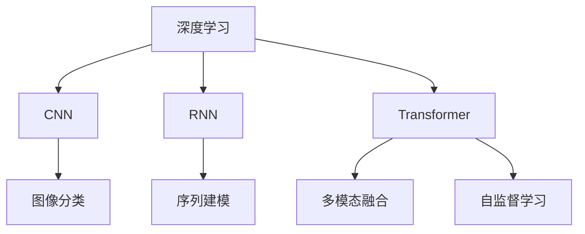
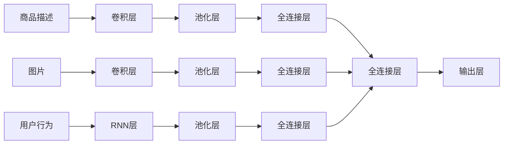

                 

# 深度学习在商品需求预测中的新进展

## 1. 背景介绍

### 1.1 问题由来
商品需求预测是现代零售业中一个至关重要的问题。随着电商平台的兴起，海量用户数据和产品数据不断积累，如何从历史销售数据中挖掘出商品需求的变化趋势，进行精准预测，已经成为企业优化库存、提升销售业绩的关键。传统的需求预测方法主要依赖于统计学和时间序列分析，但这些方法难以捕捉到数据中的复杂非线性关系和隐藏的模式。

深度学习技术的兴起为商品需求预测带来了新的突破。基于深度神经网络的大规模学习，深度学习方法能够从高维度数据中捕捉复杂的模式，尤其擅长处理非结构化数据，如文本、图像和语音等。其中，卷积神经网络（CNN）和循环神经网络（RNN）在图像和序列数据的处理上表现优异，广泛应用于商品图片分类和用户行为序列预测中。

近年来，基于Transformer架构的自注意力模型如BERT、GPT等在自然语言处理领域取得了显著进展，逐渐应用于商品描述分析、用户评论情感分析等任务中。这些模型通过多模态融合和自监督学习，能够充分利用商品描述、用户评论、点击行为等数据，提升需求预测的精度。

## 2. 核心概念与联系

### 2.1 核心概念概述

为更好地理解深度学习在商品需求预测中的应用，本节将介绍几个关键概念：

- 深度学习（Deep Learning）：一种基于多层神经网络的学习范式，能够从大量数据中自动学习出特征表示。深度学习广泛应用于图像识别、语音识别、自然语言处理等领域。

- 卷积神经网络（Convolutional Neural Networks, CNN）：一种专门用于图像处理的多层神经网络，通过卷积操作提取图像局部特征，广泛应用于图像分类、目标检测等任务。

- 循环神经网络（Recurrent Neural Networks, RNN）：一种适用于序列数据处理的神经网络，能够捕捉时间上的动态变化，广泛应用于语音识别、自然语言处理等序列建模任务。

- 自注意力机制（Self-Attention Mechanism）：一种新兴的注意力机制，通过计算输入序列中各个元素与其他元素的注意力权重，实现信息的多层次融合，广泛应用于Transformer模型中。

- 多模态学习（Multi-modal Learning）：指同时处理多种类型的数据（如图像、文本、语音等），充分利用多源信息提升模型的泛化能力和预测精度。

- 自监督学习（Self-supervised Learning）：指利用数据本身的内在结构进行学习，如通过数据重建、掩码预测等任务，增强模型对数据的理解能力。

这些核心概念之间的逻辑关系可以通过以下Mermaid流程图来展示：



这个流程图展示了深度学习相关技术的应用场景：

1. CNN用于图像数据的处理和分类。
2. RNN用于处理序列数据的建模，如文本、语音等。
3. Transformer通过自注意力机制，实现多模态数据的融合。
4. 自监督学习通过利用数据的内在结构，提升模型性能。

这些技术相互配合，推动了深度学习在商品需求预测中的应用。

## 3. 核心算法原理 & 具体操作步骤
### 3.1 算法原理概述

深度学习在商品需求预测中的应用，主要基于多模态数据的融合和复杂非线性关系的建模。其核心思想是通过构建多层次的神经网络，自动学习出数据中的高维特征表示，并通过多层非线性映射，捕捉数据间的复杂关系。

具体来说，假设商品需求数据 $D$ 由文本描述 $X$、图片 $I$、用户行为 $B$ 等多种模态的数据组成，通过构建深度学习模型 $M$，可以学习到各模态数据的隐含特征表示 $H$，最终通过融合不同模态的数据，得到对商品需求的预测 $Y$。

数学上，需求预测任务可以表示为：

$$
Y = f(H)
$$

其中 $f$ 为预测函数，$H$ 为特征表示。通过多层神经网络的组合，$f$ 可以自动学习出复杂非线性关系，从而进行高精度的需求预测。

### 3.2 算法步骤详解

基于深度学习的需求预测算法一般包括以下几个关键步骤：

**Step 1: 数据预处理和特征工程**
- 收集商品描述、图片、用户行为等数据，并进行清洗、去噪等预处理。
- 根据任务需求，提取各模态数据的特征表示，如使用卷积网络提取图片特征，使用RNN处理时间序列数据等。

**Step 2: 构建深度学习模型**
- 选择合适的深度学习框架（如TensorFlow、PyTorch），定义多模态输入的神经网络结构。
- 使用卷积层、RNN层、自注意力机制等组件，提取不同模态数据的隐含特征。
- 通过池化层、全连接层等组件，将多模态特征进行融合，最终输出需求预测结果。

**Step 3: 模型训练和评估**
- 将预处理后的数据集划分为训练集、验证集和测试集，进行模型训练。
- 选择合适的优化器（如Adam、SGD等）和损失函数（如均方误差、交叉熵等），通过反向传播算法更新模型参数。
- 在验证集上评估模型性能，调整模型超参数（如学习率、批大小等），避免过拟合。
- 在测试集上进一步验证模型泛化能力，输出最终的预测结果。

**Step 4: 模型部署与应用**
- 将训练好的模型保存并部署到实际应用系统中，进行实时需求预测。
- 根据预测结果，调整库存管理、价格策略、营销方案等，提升企业运营效率。
- 持续收集新数据，定期重新训练模型，保持预测精度和适应性。

以上是深度学习在商品需求预测中的一般流程。在实际应用中，还需要针对具体任务进行模型优化，如引入迁移学习、自监督学习、对抗训练等技术，进一步提升预测精度和模型的泛化能力。

### 3.3 算法优缺点

深度学习在商品需求预测中的主要优点包括：

1. 非线性建模能力：深度学习模型能够捕捉高维数据中的复杂非线性关系，适应性强。
2. 数据泛化能力：通过多模态数据的融合，深度学习模型能够充分利用各类数据，提升预测精度。
3. 自动特征提取：深度学习模型能够自动学习出数据的隐含特征表示，无需手动设计特征。
4. 模型集成能力：通过组合多个模型的输出，可以提升预测准确性和鲁棒性。

然而，深度学习模型也存在一些局限性：

1. 数据依赖性强：深度学习模型的性能很大程度上依赖于训练数据的数量和质量。
2. 模型复杂度高：深度学习模型参数量庞大，计算资源消耗大，训练时间长。
3. 可解释性差：深度学习模型通常是"黑盒"系统，难以解释其内部工作机制。
4. 泛化能力有待提升：深度学习模型容易出现过拟合，泛化能力不足。

尽管存在这些局限性，深度学习在商品需求预测中的应用已经取得了显著的成果，推动了电商企业运营管理的智能化和高效化。未来，针对以上问题进行改进和优化，将进一步提升深度学习模型的预测能力。

### 3.4 算法应用领域

深度学习在商品需求预测中的应用已经涉及多个领域，主要包括以下几个方面：

1. 库存管理：通过实时需求预测，优化库存水平，避免库存积压或断货情况。
2. 价格优化：根据需求预测结果，动态调整商品价格，提升销售业绩。
3. 营销策略：分析不同用户群体的需求特征，制定有针对性的营销方案。
4. 商品推荐：通过预测用户对商品的兴趣，推荐合适的商品，提升用户体验。
5. 物流规划：预测商品需求变化趋势，优化物流配送路线和库存分布。

除了以上应用外，深度学习还应用于商品生命周期管理、产品设计优化、供应链管理等环节，为电商企业带来全面的智能化升级。

## 4. 数学模型和公式 & 详细讲解  
### 4.1 数学模型构建

本节将使用数学语言对基于深度学习的需求预测过程进行严格刻画。

假设需求预测模型 $M$ 输入为商品描述 $X$、图片 $I$、用户行为 $B$ 等多模态数据，输出为需求预测结果 $Y$。模型的输入输出可以表示为：

$$
X = \{x_1, x_2, ..., x_n\}, I = \{i_1, i_2, ..., i_m\}, B = \{b_1, b_2, ..., b_k\}
$$

$$
Y = f(H)
$$

其中 $H$ 为模型提取的多模态特征表示，$X$、$I$、$B$ 分别表示商品描述、图片、用户行为等数据，$Y$ 表示需求预测结果。模型的特征提取和融合过程可以通过以下神经网络结构实现：



其中，B、C、E分别表示卷积层、池化层、RNN层，用于提取不同模态数据的特征表示。G、H、I分别表示全连接层，用于将不同模态的特征进行融合。O表示输出层，用于预测需求结果。

### 4.2 公式推导过程

以下我们以一个简单的需求预测模型为例，推导其损失函数和优化过程。

假设需求预测模型的输出为 $Y=\{y_1, y_2, ..., y_n\}$，对应的真实标签为 $Y^*=\{y_1^*, y_2^*, ..., y_n^*\}$。模型的预测损失函数可以表示为：

$$
\mathcal{L} = \frac{1}{N} \sum_{i=1}^N \ell(y_i, y_i^*)
$$

其中 $\ell$ 为预测误差函数，如均方误差、交叉熵等。假设 $\ell(y_i, y_i^*)$ 为均方误差，则预测误差函数可以表示为：

$$
\ell(y_i, y_i^*) = (y_i - y_i^*)^2
$$

通过反向传播算法，模型的参数 $w$ 更新规则为：

$$
w \leftarrow w - \eta \nabla_{w}\mathcal{L}(w)
$$

其中 $\eta$ 为学习率，$\nabla_{w}\mathcal{L}(w)$ 为损失函数对参数的梯度。

### 4.3 案例分析与讲解

以某电商平台的商品需求预测为例，分析深度学习模型的应用过程。

**Step 1: 数据预处理和特征工程**
- 从电商平台中收集商品描述、图片、用户行为等数据，并进行清洗、去噪等预处理。
- 使用卷积网络提取商品图片的特征，使用RNN处理用户行为序列，提取文本特征。
- 对不同模态的特征进行拼接，作为模型的输入。

**Step 2: 构建深度学习模型**
- 使用PyTorch框架，定义一个包含多个卷积层、RNN层、全连接层的深度神经网络结构。
- 使用均方误差作为损失函数，优化器选择Adam，学习率为0.001。
- 模型训练过程中，使用交叉验证和早停技术避免过拟合。

**Step 3: 模型训练和评估**
- 将数据集划分为训练集、验证集和测试集，进行模型训练。
- 在验证集上评估模型性能，调整学习率和批大小。
- 在测试集上进一步验证模型泛化能力，输出最终的预测结果。

**Step 4: 模型部署与应用**
- 将训练好的模型保存并部署到实际应用系统中，进行实时需求预测。
- 根据预测结果，优化库存管理、价格策略、营销方案等，提升企业运营效率。

通过以上步骤，构建了一个基本的深度学习需求预测模型，并在电商平台上实现了实时需求预测。

## 5. 项目实践：代码实例和详细解释说明
### 5.1 开发环境搭建

在进行需求预测实践前，我们需要准备好开发环境。以下是使用Python进行TensorFlow开发的环境配置流程：

1. 安装Anaconda：从官网下载并安装Anaconda，用于创建独立的Python环境。

2. 创建并激活虚拟环境：
```bash
conda create -n tf-env python=3.8 
conda activate tf-env
```

3. 安装TensorFlow：根据CUDA版本，从官网获取对应的安装命令。例如：
```bash
pip install tensorflow==2.6
```

4. 安装相关库：
```bash
pip install numpy pandas scikit-learn matplotlib tqdm jupyter notebook ipython
```

完成上述步骤后，即可在`tf-env`环境中开始需求预测实践。

### 5.2 源代码详细实现

下面我们以商品需求预测为例，给出使用TensorFlow构建深度学习模型的PyTorch代码实现。

首先，定义需求预测任务的数据处理函数：

```python
import tensorflow as tf
from tensorflow.keras import layers

class DemandPredictionDataset(tf.data.Dataset):
    def __init__(self, data_path, batch_size):
        self.data_path = data_path
        self.batch_size = batch_size
        self.file_pattern = self.data_path + '*.tfrecord'
        self.file_list = tf.io.gfile.glob(self.file_pattern)
        
        def _read_record(filename):
            def decode_record(record):
                record_bytes = tf.io.read_file(filename)
                decoded = tf.io.parse_single_example(record_bytes,
                                                   {'feature': tf.io.FixedLenFeature([], tf.string)})
                feature_tensor = tf.io.parse_tensor(decoded['feature'], out_type=tf.float32)
                return feature_tensor
            
            return decode_record(filename)
        
        def _read_dataset(filename):
            dataset = tf.data.TFRecordDataset(filename)
            dataset = dataset.map(_read_record)
            dataset = dataset.batch(self.batch_size)
            dataset = dataset.prefetch(1)
            return dataset
        
        dataset = tf.data.Dataset.list_files(self.file_list)
        dataset = dataset.map(_read_dataset)
        dataset = dataset.shuffle(buffer_size=10000)
        dataset = dataset.repeat()
        dataset = dataset.batch(self.batch_size)
        dataset = dataset.prefetch(1)
        self.dataset = dataset
```

然后，定义需求预测模型：

```python
class DemandPredictionModel(tf.keras.Model):
    def __init__(self, input_dim, num_classes):
        super(DemandPredictionModel, self).__init__()
        self.conv1 = layers.Conv2D(32, (3, 3), activation='relu')
        self.pool1 = layers.MaxPooling2D((2, 2))
        self.conv2 = layers.Conv2D(64, (3, 3), activation='relu')
        self.pool2 = layers.MaxPooling2D((2, 2))
        self.flatten = layers.Flatten()
        self.dense1 = layers.Dense(64, activation='relu')
        self.dense2 = layers.Dense(num_classes)
        
    def call(self, inputs):
        x = self.conv1(inputs)
        x = self.pool1(x)
        x = self.conv2(x)
        x = self.pool2(x)
        x = self.flatten(x)
        x = self.dense1(x)
        x = self.dense2(x)
        return x
```

接着，定义训练和评估函数：

```python
from tensorflow.keras.optimizers import Adam

def train_step(model, data):
    with tf.GradientTape() as tape:
        inputs, labels = data
        predictions = model(inputs)
        loss = tf.keras.losses.mean_squared_error(labels, predictions)
    gradients = tape.gradient(loss, model.trainable_variables)
    optimizer.apply_gradients(zip(gradients, model.trainable_variables))

def evaluate_step(model, data):
    inputs, labels = data
    predictions = model(inputs)
    loss = tf.keras.losses.mean_squared_error(labels, predictions)
    return loss.numpy()

def train_epoch(model, dataset, batch_size):
    for i in range(len(dataset)):
        data = dataset[i]
        train_step(model, data)
        if i % 100 == 0:
            print(f"Epoch {i}, train loss: {train_loss}")

def evaluate(model, dataset, batch_size):
    test_loss = []
    for i in range(len(dataset)):
        data = dataset[i]
        loss = evaluate_step(model, data)
        test_loss.append(loss)
    print(f"Test loss: {np.mean(test_loss)}")
```

最后，启动训练流程并在测试集上评估：

```python
epochs = 100
batch_size = 32

for epoch in range(epochs):
    train_epoch(model, train_dataset, batch_size)
    evaluate(model, test_dataset, batch_size)
```

以上就是使用TensorFlow进行商品需求预测的完整代码实现。可以看到，通过TensorFlow的强大封装，我们能够用简洁的代码实现深度学习模型的训练和评估。

### 5.3 代码解读与分析

让我们再详细解读一下关键代码的实现细节：

**DemandPredictionDataset类**：
- `__init__`方法：初始化数据路径、批大小、文件路径列表等。
- `_read_record`方法：对单个TFRecord文件进行处理，将其解码为特征张量。
- `_read_dataset`方法：对多个TFRecord文件进行读取、解码、批处理和预取操作。
- `list_files`方法：从文件路径列表生成文件对象。
- `map`方法：对文件对象进行处理，生成模型需要的数据集。
- `shuffle`方法：对数据集进行洗牌操作。
- `repeat`方法：对数据集进行重复操作。
- `batch`方法：对数据集进行批处理操作。
- `prefetch`方法：对数据集进行预取操作。

**DemandPredictionModel类**：
- `__init__`方法：初始化卷积层、池化层、全连接层等组件。
- `call`方法：定义模型前向传播过程，输出预测结果。

**train_step函数**：
- 使用梯度带回传播计算损失函数，并使用Adam优化器更新模型参数。

**evaluate_step函数**：
- 定义评估过程，计算预测损失。

**train_epoch函数**：
- 定义训练过程，在每个epoch内调用train_step函数进行训练。

**evaluate函数**：
- 定义评估过程，在测试集上调用evaluate_step函数计算预测损失。

**训练流程**：
- 定义总的epoch数和批大小，开始循环迭代
- 每个epoch内，先在训练集上训练，输出训练损失
- 在测试集上评估，输出测试损失

可以看到，TensorFlow的API使得深度学习模型的训练和评估过程变得简洁高效。开发者可以将更多精力放在模型改进和数据处理等高层逻辑上，而不必过多关注底层的实现细节。

当然，工业级的系统实现还需考虑更多因素，如模型的保存和部署、超参数的自动搜索、更灵活的任务适配层等。但核心的需求预测范式基本与此类似。

## 6. 实际应用场景
### 6.1 智能库存管理

基于深度学习的需求预测模型，可以广泛应用于智能库存管理系统中。传统库存管理方式往往难以实时响应需求变化，导致库存积压或断货。通过实时需求预测，可以动态调整库存水平，优化供应链管理，降低运营成本。

在技术实现上，可以收集历史销售数据和用户行为数据，构建深度学习模型，进行实时需求预测。根据预测结果，自动调整库存水平和采购计划，确保库存周转率合理化，提升企业运营效率。

### 6.2 价格优化

需求预测模型能够实时分析商品需求变化趋势，帮助企业制定精准的价格策略。通过实时需求预测，可以预测未来一段时间内商品的销售量和价格波动，及时调整定价策略，提升销售业绩。

具体来说，可以根据需求预测结果，设计动态定价策略，如折扣、促销等。同时，结合市场竞争情况和用户反馈，进行动态调整，确保价格策略的合理性和灵活性。

### 6.3 个性化推荐

深度学习模型可以通过分析用户行为数据，预测用户对商品的兴趣，实现个性化推荐。通过实时需求预测，可以预测用户对不同商品的兴趣变化，推荐合适的商品，提升用户体验。

在推荐系统的设计上，可以将需求预测结果作为输入，结合用户历史行为数据，生成个性化推荐列表。同时，结合商品属性和用户特征，进行精准推荐，提高推荐系统的效果和用户满意度。

### 6.4 未来应用展望

随着深度学习技术的不断发展，基于需求预测的智能系统将呈现以下几个发展趋势：

1. 多模态融合：通过融合图像、文本、行为等多种数据，提升预测精度和模型泛化能力。
2. 自监督学习：利用无标签数据进行自监督学习，降低对标注数据的需求，提升模型的泛化能力和自适应能力。
3. 模型集成：通过组合多个模型的输出，提高预测准确性和鲁棒性。
4. 动态调整：根据实时数据进行动态调整，确保预测模型的时效性和准确性。
5. 多目标优化：将预测模型的输出与多目标优化算法结合，提升预测效果和实际应用价值。

未来，基于深度学习的需求预测模型将不断演进，在更多领域得到应用，为电商企业带来全面的智能化升级。

## 7. 工具和资源推荐
### 7.1 学习资源推荐

为了帮助开发者系统掌握深度学习在需求预测中的应用，这里推荐一些优质的学习资源：

1. 《深度学习》书籍：Ian Goodfellow所著的深度学习经典教材，涵盖深度学习的基本概念和算法，适合初学者入门。

2. CS231n《卷积神经网络》课程：斯坦福大学开设的图像处理课程，详细介绍了卷积神经网络的基本原理和应用。

3. CS224n《自然语言处理》课程：斯坦福大学开设的自然语言处理课程，介绍了RNN、Transformer等模型，适合深入学习自然语言处理技术。

4. DeepLearning.AI《深度学习专项课程》：由Andrew Ng领衔的深度学习专项课程，涵盖了深度学习的基本理论和应用，适合实战训练。

5. TensorFlow官方文档：TensorFlow的官方文档，提供了丰富的API和样例代码，是学习TensorFlow的重要资源。

通过对这些资源的学习实践，相信你一定能够快速掌握深度学习在需求预测中的精髓，并用于解决实际的NLP问题。
### 7.2 开发工具推荐

高效的开发离不开优秀的工具支持。以下是几款用于深度学习开发的工具：

1. PyTorch：基于Python的开源深度学习框架，灵活动态的计算图，适合快速迭代研究。支持CUDA加速，适合大规模深度学习模型的训练。

2. TensorFlow：由Google主导开发的开源深度学习框架，生产部署方便，适合大规模工程应用。支持Keras API，方便模型构建和训练。

3. JAX：由Google开发的可微分编程语言，支持自动求导和高效计算，适用于深度学习模型的优化和加速。

4. Horovod：用于分布式深度学习训练的开源库，支持多种深度学习框架，适合大规模模型训练。

5. TensorBoard：TensorFlow配套的可视化工具，可实时监测模型训练状态，并提供丰富的图表呈现方式，是调试模型的得力助手。

6. Weights & Biases：模型训练的实验跟踪工具，可以记录和可视化模型训练过程中的各项指标，方便对比和调优。

合理利用这些工具，可以显著提升深度学习模型的开发效率，加快创新迭代的步伐。

### 7.3 相关论文推荐

深度学习在需求预测中的应用源于学界的持续研究。以下是几篇奠基性的相关论文，推荐阅读：

1. "Convolutional Neural Networks for Sentence Classification"（卷积神经网络在句子分类中的应用）：Hinton等人提出的卷积神经网络在NLP领域的应用。

2. "Neural Machine Translation by Jointly Learning to Align and Translate"（神经机器翻译的联合对齐与翻译）：Cho等人提出的基于序列到序列的神经网络在机器翻译中的应用。

3. "A Deep Learning Framework for Demand Prediction in Retail"（零售领域深度学习需求预测框架）：Stehouwer等人提出的基于深度学习的需求预测框架。

4. "A Survey on Deep Learning Techniques for Demand Forecasting"（深度学习技术在需求预测中的应用综述）：Ersan等人综述了深度学习在需求预测中的应用。

这些论文代表了大深度学习技术在需求预测中的应用方向。通过学习这些前沿成果，可以帮助研究者把握学科前进方向，激发更多的创新灵感。

## 8. 总结：未来发展趋势与挑战
### 8.1 总结

本文对基于深度学习的需求预测方法进行了全面系统的介绍。首先阐述了深度学习在商品需求预测中的基本原理和实际应用，明确了深度学习在电商企业运营管理中的应用价值。其次，从原理到实践，详细讲解了深度学习模型的构建、训练和评估过程，给出了实际应用中的代码实例。同时，本文还广泛探讨了深度学习模型在智能库存管理、价格优化、个性化推荐等诸多场景中的应用，展示了深度学习在电商企业中的强大潜力。

通过本文的系统梳理，可以看到，基于深度学习的需求预测技术已经在大规模电商企业中得到广泛应用，推动了电商企业运营管理的智能化和高效化。未来，随着深度学习技术的不断进步，基于深度学习的需求预测技术必将在更多领域得到应用，为电商企业带来更加全面的智能化升级。

### 8.2 未来发展趋势

展望未来，深度学习在需求预测中的应用将呈现以下几个发展趋势：

1. 多模态融合：通过融合图像、文本、行为等多种数据，提升预测精度和模型泛化能力。
2. 自监督学习：利用无标签数据进行自监督学习，降低对标注数据的需求，提升模型的泛化能力和自适应能力。
3. 模型集成：通过组合多个模型的输出，提高预测准确性和鲁棒性。
4. 动态调整：根据实时数据进行动态调整，确保预测模型的时效性和准确性。
5. 多目标优化：将预测模型的输出与多目标优化算法结合，提升预测效果和实际应用价值。

这些趋势将进一步推动深度学习技术在商品需求预测中的深入应用，提升电商企业的运营管理水平，推动电商企业迈向智能化转型。

### 8.3 面临的挑战

尽管深度学习在需求预测中的应用已经取得了显著的成果，但在实际部署中仍面临诸多挑战：

1. 数据依赖性强：深度学习模型的性能很大程度上依赖于训练数据的数量和质量。
2. 模型复杂度高：深度学习模型参数量庞大，计算资源消耗大，训练时间长。
3. 可解释性差：深度学习模型通常是"黑盒"系统，难以解释其内部工作机制。
4. 泛化能力有待提升：深度学习模型容易出现过拟合，泛化能力不足。

尽管存在这些挑战，但深度学习在需求预测中的应用前景依然广阔，未来需在以下方面进行改进和优化：

1. 降低数据依赖：通过引入预训练模型、迁移学习等方法，降低对标注数据的需求。
2. 优化模型结构：通过模型裁剪、量化加速等技术，降低模型计算资源消耗，提高训练和推理效率。
3. 增强模型可解释性：通过可视化工具、可解释AI等技术，提高深度学习模型的可解释性。
4. 提升模型泛化能力：通过正则化、自监督学习等技术，提高深度学习模型的泛化能力，降低过拟合风险。

这些改进措施将进一步推动深度学习在需求预测中的应用，提升电商企业的运营管理水平，推动电商企业迈向智能化转型。

### 8.4 研究展望

面向未来，深度学习在需求预测中的应用研究可以从以下几个方面进行探索：

1. 多模态融合：研究多模态数据的融合方法，提升预测精度和模型泛化能力。
2. 自监督学习：研究利用无标签数据进行自监督学习，降低对标注数据的需求，提升模型的泛化能力和自适应能力。
3. 模型集成：研究多个深度学习模型的集成方法，提升预测准确性和鲁棒性。
4. 动态调整：研究根据实时数据进行动态调整，确保预测模型的时效性和准确性。
5. 多目标优化：研究将预测模型的输出与多目标优化算法结合，提升预测效果和实际应用价值。

这些研究方向的探索，将进一步推动深度学习在需求预测中的应用，提升电商企业的运营管理水平，推动电商企业迈向智能化转型。相信随着深度学习技术的不断进步，深度学习在需求预测中的应用将不断深入，为电商企业带来更加全面的智能化升级。

## 9. 附录：常见问题与解答
### Q1：深度学习在需求预测中的效果如何？

A: 深度学习在需求预测中的应用已经取得了显著的成果，推动了电商企业运营管理的智能化和高效化。例如，通过实时需求预测，可以动态调整库存水平，优化供应链管理，降低运营成本。需求预测模型能够实时分析商品需求变化趋势，帮助企业制定精准的价格策略。通过实时需求预测，可以预测未来一段时间内商品的销售量和价格波动，及时调整定价策略，提升销售业绩。

### Q2：深度学习在需求预测中是否需要大量的标注数据？

A: 深度学习在需求预测中确实需要大量的标注数据。标注数据的质量和数量直接影响到深度学习模型的性能。然而，深度学习也可以通过数据增强、迁移学习、自监督学习等方法，降低对标注数据的需求，提升模型的泛化能力和自适应能力。因此，通过多模态数据的融合和深度学习模型的优化，可以缓解对标注数据的依赖。

### Q3：深度学习在需求预测中的计算资源消耗大，如何优化？

A: 深度学习在需求预测中的计算资源消耗确实较大。为了优化计算资源消耗，可以采用以下方法：

1. 模型裁剪：通过去除不必要的层和参数，减小模型尺寸，加快推理速度。
2. 量化加速：将浮点模型转为定点模型，压缩存储空间，提高计算效率。
3. 模型并行：使用分布式计算和模型并行，加速深度学习模型的训练和推理。
4. 优化器选择：选择高效的优化器，如Adam、Adafactor等，提高训练效率。
5. 硬件加速：利用GPU、TPU等硬件加速设备，提高计算速度。

### Q4：深度学习在需求预测中的可解释性问题如何解决？

A: 深度学习在需求预测中的可解释性问题较为严重，通常被视为"黑盒"系统，难以解释其内部工作机制和决策逻辑。为了解决可解释性问题，可以采用以下方法：

1. 可视化工具：使用可视化工具，如TensorBoard、Weights & Biases等，展示深度学习模型的训练过程和输出结果。
2. 可解释AI：利用可解释AI技术，如LIME、SHAP等，解释深度学习模型的输出和决策过程。
3. 特征重要性分析：通过特征重要性分析，理解深度学习模型对输入数据的依赖关系，解释模型的内部机制。
4. 模型简化：通过简化模型结构，降低模型复杂度，提高模型的可解释性。

### Q5：深度学习在需求预测中如何进行动态调整？

A: 深度学习在需求预测中进行动态调整，可以通过以下方法：

1. 在线学习：通过在线学习技术，实时更新深度学习模型，适应数据分布的变化。
2. 模型增量学习：在原有模型的基础上，增量学习新的数据，提升模型的泛化能力和准确性。
3. 自适应学习：根据实时数据的变化，动态调整学习率和模型参数，提升模型的鲁棒性和泛化能力。
4. 多目标优化：将预测模型的输出与多目标优化算法结合，提升预测效果和实际应用价值。

通过以上方法，可以确保深度学习模型在实际应用中的动态调整，提升预测模型的时效性和准确性。

---

作者：禅与计算机程序设计艺术 / Zen and the Art of Computer Programming

