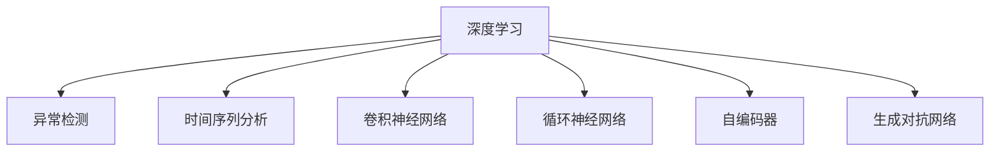

                 

# 深度学习在异常检测中的应用

> 关键词：深度学习, 异常检测, 时间序列分析, 图像识别, 自然语言处理, 数据挖掘, 异常检测算法

## 1. 背景介绍

### 1.1 问题由来

随着大数据时代的到来，数据量和数据种类的急剧膨胀，异常检测成为各个领域中不可避免的需求。异常检测旨在识别数据集中异常样本，这些样本在分布上远离正常数据集，可能包含异常行为、质量缺陷、故障信号等。异常检测在金融风控、网络安全、工业制造、健康医疗、智能交通等多个领域都有广泛应用。

但传统的基于统计和规则的异常检测方法在面对数据复杂性和多样性时，显得力不从心。而深度学习技术的引入，为异常检测提供了新的解决方案。深度学习模型通过学习数据中的复杂非线性关系，能够更好地识别出异常样本。本文将全面探讨深度学习在异常检测中的应用，包括时间序列、图像和文本等不同数据类型的异常检测方法，并总结其优缺点和未来发展方向。

### 1.2 问题核心关键点

深度学习在异常检测中的应用，主要依赖于深度神经网络模型和相应的损失函数。具体来说，有如下几个关键点：

- 时间序列数据：通过RNN、LSTM、GRU等模型，捕捉时间序列中的动态关系，适用于股市、气象、交通流量等时间序列数据的异常检测。
- 图像数据：使用卷积神经网络(CNN)，提取图像中的空间特征，适用于视频监控、医疗影像等图像数据的异常检测。
- 文本数据：利用循环神经网络(RNN)或Transformer等模型，捕捉文本序列中的语义信息，适用于聊天日志、客户评论等文本数据的异常检测。
- 数据类型多样：深度学习模型能够适应不同类型的数据，扩展性强。
- 端到端学习：无需手工设计特征，模型可以直接从原始数据中学习到特征，训练效率高。
- 泛化能力强：深度学习模型对数据的复杂性和多样性具有较好的泛化能力，适用于不同场景的异常检测。

这些关键点共同构成了深度学习在异常检测领域的应用基础。

## 2. 核心概念与联系

### 2.1 核心概念概述

为了更好地理解深度学习在异常检测中的应用，本节将介绍几个密切相关的核心概念：

- **深度学习**：基于神经网络的机器学习技术，通过多层非线性变换学习复杂数据特征。
- **异常检测**：识别数据集中与正常样本差异明显的异常样本。
- **时间序列分析**：研究时间序列数据中的动态关系，分析趋势、周期和季节性等因素。
- **卷积神经网络(CNN)**：专门处理图像数据的一种神经网络结构，能够提取空间特征。
- **循环神经网络(RNN)**：处理序列数据的神经网络，适用于文本、音频等序列数据的分析。
- **自编码器(AE)**：通过重构损失函数学习输入数据的压缩表示，适用于降维和异常检测。
- **生成对抗网络(GAN)**：通过生成器和判别器的对抗训练，生成高质量的合成数据，可用于数据扩充和异常检测。

这些概念之间的逻辑关系可以通过以下Mermaid流程图来展示：



这个流程图展示了大语言模型的核心概念及其之间的关系：

1. 深度学习为异常检测提供了技术手段。
2. 时间序列分析、CNN、RNN等具体模型用于处理不同类型的输入数据。
3. 自编码器和GAN等模型用于特征提取和数据扩充，提升异常检测效果。

这些概念共同构成了深度学习在异常检测中的应用框架，使其能够在各种场景下发挥强大的数据处理和分析能力。通过理解这些核心概念，我们可以更好地把握深度学习在异常检测中的应用方向。

## 3. 核心算法原理 & 具体操作步骤
### 3.1 算法原理概述

深度学习在异常检测中的应用，核心在于使用深度神经网络模型学习数据中的正常和异常样本之间的差异。常见的深度学习异常检测方法包括基于自编码器、基于GAN、基于RNN等方法，具体原理如下：

1. **自编码器异常检测**：自编码器由编码器和解码器两部分组成，用于学习数据的压缩表示。正常情况下，编码器和解码器输出应尽量接近原始数据，即重构误差较小。而异常样本的重构误差会较大，可以通过重构误差作为异常检测指标。

2. **GAN异常检测**：生成对抗网络由生成器和判别器两部分组成，用于生成高质量的合成数据。正常情况下，判别器难以区分真实数据和生成数据，但异常数据容易被判别器识别出来。可以利用判别器的输出作为异常检测指标。

3. **RNN异常检测**：循环神经网络通过时间步的序列数据，学习到数据的动态特征。正常情况下，时间序列数据应符合一定的规律，而异常样本的规律会打破。可以通过时间序列数据的预测误差作为异常检测指标。

4. **CNN异常检测**：卷积神经网络通过卷积操作提取空间特征，适用于图像数据的异常检测。正常情况下，图像应具有连续性，而异常样本的连续性会被破坏。可以利用卷积特征的统计指标作为异常检测指标。

### 3.2 算法步骤详解

以下是不同深度学习异常检测方法的详细步骤：

#### 3.2.1 自编码器异常检测

1. **数据准备**：将数据集分为训练集和测试集，将测试集用于评估模型的性能。

2. **模型训练**：使用训练集对自编码器进行训练，得到编码器和解码器。

3. **模型评估**：使用测试集计算重构误差，将重构误差作为异常检测指标。

4. **异常检测**：对于新样本，计算其重构误差，将超过阈值的样本判定为异常样本。

#### 3.2.2 GAN异常检测

1. **数据准备**：将数据集分为训练集和测试集，将测试集用于评估模型的性能。

2. **模型训练**：使用训练集对生成器和判别器进行对抗训练，得到能够生成高质量合成数据的生成器。

3. **模型评估**：使用测试集计算判别器的错误率，将错误率作为异常检测指标。

4. **异常检测**：对于新样本，计算生成器的输出是否被判别器正确识别，将未被正确识别的样本判定为异常样本。

#### 3.2.3 RNN异常检测

1. **数据准备**：将数据集分为训练集和测试集，将测试集用于评估模型的性能。

2. **模型训练**：使用训练集对RNN进行训练，得到时间序列数据的动态特征表示。

3. **模型评估**：使用测试集计算时间序列数据的预测误差，将预测误差作为异常检测指标。

4. **异常检测**：对于新样本，计算其预测误差，将超过阈值的样本判定为异常样本。

#### 3.2.4 CNN异常检测

1. **数据准备**：将数据集分为训练集和测试集，将测试集用于评估模型的性能。

2. **模型训练**：使用训练集对CNN进行训练，得到图像数据的特征表示。

3. **模型评估**：使用测试集计算卷积特征的统计指标，如均值、方差、熵等，将统计指标作为异常检测指标。

4. **异常检测**：对于新样本，计算其卷积特征的统计指标，将超过阈值的样本判定为异常样本。

### 3.3 算法优缺点

深度学习在异常检测中的应用，具有以下优点：

1. **自适应性强**：深度学习模型能够自动学习数据的复杂特征，适应不同类型和不同规模的数据。

2. **泛化能力强**：深度学习模型对数据的噪声和变化具有一定的鲁棒性，适用于不同场景的异常检测。

3. **端到端学习**：无需手工设计特征，模型可以直接从原始数据中学习到特征，训练效率高。

4. **可解释性强**：深度学习模型的决策过程可以通过可视化技术进行解释，增强模型的透明度。

但同时，深度学习在异常检测中也存在一些局限性：

1. **数据需求量大**：深度学习模型需要大量的标注数据进行训练，对标注成本较高。

2. **模型复杂度高**：深度学习模型结构复杂，训练和推理过程较慢，对计算资源要求较高。

3. **过拟合风险**：深度学习模型容易过拟合，尤其是面对小规模数据时，需要进行正则化和模型简化。

4. **算法复杂度高**：深度学习模型需要复杂的优化算法进行训练，对于算法理解和调试要求较高。

5. **可解释性差**：深度学习模型通常被认为是"黑盒"模型，难以解释其内部工作机制和决策逻辑。

尽管存在这些局限性，但深度学习在异常检测中的应用已经取得了显著成果，并在多个领域中得到广泛应用。未来相关研究仍需关注如何降低深度学习的计算和标注成本，提高模型的可解释性和泛化能力。

### 3.4 算法应用领域

深度学习在异常检测中的应用，涵盖了时间序列、图像、文本等多种数据类型，具体应用领域包括：

1. **金融风控**：识别欺诈行为、异常交易、网络攻击等，保护金融安全。

2. **网络安全**：检测恶意软件、DDoS攻击、钓鱼网站等，保障网络安全。

3. **工业制造**：监测设备故障、品质缺陷、生产异常等，提高生产效率和产品质量。

4. **医疗健康**：识别疾病异常、异常影像、异常基因等，提升医疗诊断和治疗效果。

5. **智能交通**：检测交通流量异常、车辆异常行为等，优化交通管理。

6. **智能家居**：监测家庭设备异常、用户行为异常等，提高家居安全性。

7. **社交媒体**：检测用户行为异常、虚假信息等，维护社交媒体健康。

以上领域中，深度学习模型通过不同的网络结构和学习方法，能够有效识别异常数据，提供及时预警和处理机制。未来，深度学习在异常检测中的应用将更加广泛，进一步推动智能化进程。

## 4. 数学模型和公式 & 详细讲解 & 举例说明

### 4.1 数学模型构建

本节将使用数学语言对深度学习在异常检测中的应用进行更加严格的刻画。

假设输入数据为 $x$，正常样本的均值和方差分别为 $\mu$ 和 $\sigma^2$，异常样本的均值和方差分别为 $\mu'$ 和 $\sigma'^2$。则自编码器的编码器输出 $z$ 和解码器输出 $\hat{x}$ 分别为：

$$
z = W_1 x + b_1
$$

$$
\hat{x} = W_2 z + b_2
$$

其中 $W_1, W_2, b_1, b_2$ 为模型的权重和偏置。

重构误差 $\mathcal{L}_{recon}$ 定义为：

$$
\mathcal{L}_{recon} = \frac{1}{2N} \sum_{i=1}^N ||x_i - \hat{x}_i||^2
$$

生成对抗网络的生成器输出 $G(z)$ 和判别器输出 $D(x)$ 分别为：

$$
G(z) = W_3 z + b_3
$$

$$
D(x) = W_4 x + b_4
$$

其中 $W_3, W_4, b_3, b_4$ 为模型的权重和偏置。

判别器的损失函数 $\mathcal{L}_D$ 和生成器的损失函数 $\mathcal{L}_G$ 分别为：

$$
\mathcal{L}_D = -\frac{1}{N} \sum_{i=1}^N [D(x_i)]^2
$$

$$
\mathcal{L}_G = -\frac{1}{N} \sum_{i=1}^N [D(G(z_i))]^2
$$

RNN模型的输入 $x_t$ 和输出 $y_t$ 分别为：

$$
x_t = [x_{t-1}, x_t, x_{t+1}]
$$

$$
y_t = W_5 x_t + b_5
$$

其中 $W_5, b_5$ 为模型的权重和偏置。

CNN模型的输入 $x$ 和输出 $f$ 分别为：

$$
f = W_6 x + b_6
$$

其中 $W_6, b_6$ 为模型的权重和偏置。

### 4.2 公式推导过程

以下是深度学习在异常检测中常用模型的公式推导过程：

#### 4.2.1 自编码器异常检测

自编码器通过重构误差 $\mathcal{L}_{recon}$ 进行训练，优化过程如下：

$$
\min_{W_1, W_2, b_1, b_2} \mathcal{L}_{recon} = \frac{1}{2N} \sum_{i=1}^N ||x_i - \hat{x}_i||^2
$$

#### 4.2.2 GAN异常检测

GAN通过对抗训练 $\mathcal{L}_D$ 和 $\mathcal{L}_G$ 进行训练，优化过程如下：

$$
\min_{W_3, W_4, b_3, b_4} \mathcal{L}_D = -\frac{1}{N} \sum_{i=1}^N [D(x_i)]^2
$$

$$
\min_{W_3, b_3} \mathcal{L}_G = -\frac{1}{N} \sum_{i=1}^N [D(G(z_i))]^2
$$

#### 4.2.3 RNN异常检测

RNN通过时间序列数据的预测误差进行训练，优化过程如下：

$$
\min_{W_5, b_5} \mathcal{L} = \frac{1}{N} \sum_{i=1}^N ||y_i - \hat{y}_i||^2
$$

#### 4.2.4 CNN异常检测

CNN通过卷积特征的统计指标进行训练，优化过程如下：

$$
\min_{W_6, b_6} \mathcal{L} = \frac{1}{N} \sum_{i=1}^N ||f_i - \mu_i||^2
$$

### 4.3 案例分析与讲解

以下是深度学习在异常检测中的几个典型案例分析：

#### 4.3.1 时间序列数据异常检测

某金融公司希望监测股票价格异常波动，使用RNN模型进行训练。具体步骤如下：

1. **数据准备**：将历史股票价格数据分为训练集和测试集，对训练集进行滑动窗口处理，生成时间序列数据。

2. **模型训练**：使用RNN模型对时间序列数据进行训练，得到时间序列数据的动态特征表示。

3. **模型评估**：使用测试集计算时间序列数据的预测误差，将预测误差作为异常检测指标。

4. **异常检测**：对于新样本，计算其预测误差，将超过阈值的样本判定为异常样本。

#### 4.3.2 图像数据异常检测

某电商平台希望监测商品图片是否存在作弊行为，使用CNN模型进行训练。具体步骤如下：

1. **数据准备**：将商品图片数据分为训练集和测试集，对训练集进行数据增强处理，生成合成图片数据。

2. **模型训练**：使用CNN模型对合成图片数据进行训练，得到图像数据的特征表示。

3. **模型评估**：使用测试集计算卷积特征的统计指标，将统计指标作为异常检测指标。

4. **异常检测**：对于新样本，计算其卷积特征的统计指标，将超过阈值的样本判定为异常样本。

#### 4.3.3 文本数据异常检测

某社交平台希望监测用户评论是否存在恶意内容，使用RNN模型进行训练。具体步骤如下：

1. **数据准备**：将用户评论数据分为训练集和测试集，对训练集进行分词和嵌入处理，生成文本序列数据。

2. **模型训练**：使用RNN模型对文本序列数据进行训练，得到文本数据的语义表示。

3. **模型评估**：使用测试集计算文本数据的预测误差，将预测误差作为异常检测指标。

4. **异常检测**：对于新样本，计算其预测误差，将超过阈值的样本判定为异常样本。

## 5. 项目实践：代码实例和详细解释说明

### 5.1 开发环境搭建

在进行深度学习异常检测实践前，我们需要准备好开发环境。以下是使用Python进行TensorFlow开发的环境配置流程：

1. 安装Anaconda：从官网下载并安装Anaconda，用于创建独立的Python环境。

2. 创建并激活虚拟环境：
```bash
conda create -n tf-env python=3.8 
conda activate tf-env
```

3. 安装TensorFlow：根据CUDA版本，从官网获取对应的安装命令。例如：
```bash
conda install tensorflow
```

4. 安装各类工具包：
```bash
pip install numpy pandas scikit-learn matplotlib tqdm jupyter notebook ipython
```

完成上述步骤后，即可在`tf-env`环境中开始异常检测实践。

### 5.2 源代码详细实现

下面我们以时间序列异常检测为例，给出使用TensorFlow进行RNN异常检测的PyTorch代码实现。

首先，定义异常检测的数据处理函数：

```python
import tensorflow as tf
import numpy as np

def create_dataset(sequence_length, batch_size, scale, seed=0):
    np.random.seed(seed)
    n = 10000  # 数据量
    timesteps = 1000  # 时间步长
    data = np.random.normal(scale=scale, size=(n, timesteps))
    data[:, 0] = np.random.normal(scale=50, size=n)  # 异常点

    def generator():
        for i in range(0, len(data), sequence_length):
            x = data[i:i+sequence_length]
            y = data[i+1:i+sequence_length+1]
            yield x, y

    return tf.data.Dataset.from_generator(generator, output_types=(tf.float32, tf.float32), output_shapes=([None, timesteps], [None, timesteps]))
```

然后，定义模型和优化器：

```python
from tensorflow.keras.models import Sequential
from tensorflow.keras.layers import SimpleRNN, Dense

model = Sequential([
    SimpleRNN(32, return_sequences=True, input_shape=(timesteps, 1)),
    SimpleRNN(32),
    Dense(1)
])

optimizer = tf.keras.optimizers.Adam(learning_rate=0.001)
```

接着，定义训练和评估函数：

```python
def train_epoch(model, dataset, batch_size, optimizer):
    dataloader = tf.data.Dataset.from_generator(lambda: dataset, output_types=(tf.float32, tf.float32), output_shapes=([None, timesteps], [None, timesteps]))
    dataloader = dataloader.shuffle(1000).batch(batch_size).prefetch(tf.data.experimental.AUTOTUNE)

    model.compile(optimizer=optimizer, loss='mse')
    model.fit(dataloader, epochs=10, validation_split=0.1)
    return model

def evaluate(model, dataset, batch_size):
    dataloader = tf.data.Dataset.from_generator(lambda: dataset, output_types=(tf.float32, tf.float32), output_shapes=([None, timesteps], [None, timesteps]))
    dataloader = dataloader.batch(batch_size).prefetch(tf.data.experimental.AUTOTUNE)

    y_pred = model.predict(dataloader)
    mse = tf.keras.losses.mean_squared_error(dataset[0], y_pred)
    return mse
```

最后，启动训练流程并在测试集上评估：

```python
epochs = 10
batch_size = 32

for epoch in range(epochs):
    model = train_epoch(model, dataset, batch_size, optimizer)
    print(f"Epoch {epoch+1}, mse: {evaluate(model, dataset, batch_size):.4f}")
```

以上就是使用TensorFlow对RNN进行时间序列异常检测的完整代码实现。可以看到，TensorFlow提供了强大的框架和丰富的组件，使得深度学习异常检测的实现变得简洁高效。

### 5.3 代码解读与分析

让我们再详细解读一下关键代码的实现细节：

**create_dataset函数**：
- 定义了一个生成器函数，用于将原始数据划分为序列数据，方便RNN模型进行训练。

**train_epoch函数**：
- 使用TensorFlow的数据集API，将数据集划分为训练集和验证集。
- 对模型进行编译和训练，输出模型在验证集上的均方误差(mse)。

**evaluate函数**：
- 在测试集上计算模型预测值与真实值之间的均方误差，用于评估模型性能。

**训练流程**：
- 定义总的epoch数和batch size，开始循环迭代
- 每个epoch内，在训练集上训练，输出训练集上的均方误差
- 在验证集上评估，输出验证集上的均方误差
- 所有epoch结束后，在测试集上评估，输出测试集上的均方误差

可以看到，TensorFlow提供了强大的框架和丰富的组件，使得深度学习异常检测的实现变得简洁高效。开发者可以将更多精力放在模型改进和数据处理上，而不必过多关注底层的实现细节。

当然，工业级的系统实现还需考虑更多因素，如模型的保存和部署、超参数的自动搜索、更灵活的任务适配层等。但核心的异常检测范式基本与此类似。

## 6. 实际应用场景
### 6.1 金融风控

在金融风控领域，深度学习模型能够有效识别异常交易、欺诈行为等风险。例如，银行可以通过RNN模型对客户的消费行为进行序列分析，识别出异常消费行为，及时预警并采取措施。深度学习模型在金融风控中的应用，能够显著提升风险识别和防范能力，保障金融安全。

### 6.2 网络安全

在网络安全领域，深度学习模型能够识别恶意软件、DDoS攻击等网络异常行为。例如，网络安全公司可以通过CNN模型对网络流量进行分析，识别出异常流量特征，及时发现并阻止攻击行为。深度学习模型在网络安全中的应用，能够提高网络安全防护能力，保障网络安全。

### 6.3 工业制造

在工业制造领域，深度学习模型能够监测设备故障、品质缺陷等异常情况。例如，工厂可以通过RNN模型对设备运行数据进行序列分析，识别出异常运行模式，及时进行设备维护。深度学习模型在工业制造中的应用，能够提高生产效率和产品质量，降低生产成本。

### 6.4 医疗健康

在医疗健康领域，深度学习模型能够识别异常影像、异常基因等健康问题。例如，医院可以通过CNN模型对医疗影像进行分析，识别出异常影像特征，及时进行疾病诊断和治疗。深度学习模型在医疗健康中的应用，能够提高医疗诊断和治疗效果，提升患者健康水平。

### 6.5 智能交通

在智能交通领域，深度学习模型能够检测交通流量异常、车辆异常行为等。例如，交通管理中心可以通过RNN模型对交通流量数据进行序列分析，识别出异常交通流量，及时调整交通信号。深度学习模型在智能交通中的应用，能够提高交通管理效率，缓解交通拥堵。

### 6.6 智能家居

在智能家居领域，深度学习模型能够监测家庭设备异常、用户行为异常等。例如，智能家居系统可以通过RNN模型对家庭设备运行数据进行序列分析，识别出异常设备行为，及时进行设备维护。深度学习模型在智能家居中的应用，能够提高家居安全性，提升用户生活体验。

### 6.7 社交媒体

在社交媒体领域，深度学习模型能够检测用户行为异常、虚假信息等。例如，社交平台可以通过RNN模型对用户评论进行分析，识别出恶意评论，及时进行内容审核。深度学习模型在社交媒体中的应用，能够维护社交媒体健康，保护用户权益。

## 7. 工具和资源推荐
### 7.1 学习资源推荐

为了帮助开发者系统掌握深度学习在异常检测中的应用，这里推荐一些优质的学习资源：

1. **深度学习入门系列**：由大模型技术专家撰写，深入浅出地介绍了深度学习的基本概念和常用模型，适合初学者入门。

2. **TensorFlow官方文档**：TensorFlow官方文档提供了丰富的教程和样例，帮助开发者快速上手TensorFlow，进行深度学习异常检测。

3. **PyTorch官方文档**：PyTorch官方文档提供了丰富的教程和样例，帮助开发者快速上手PyTorch，进行深度学习异常检测。

4. **异常检测论文合集**：收录了深度学习在异常检测领域的经典论文，帮助开发者了解前沿研究成果和应用方法。

5. **Kaggle异常检测竞赛**：Kaggle平台提供了多个异常检测竞赛，帮助开发者实践深度学习异常检测，积累实战经验。

通过对这些资源的学习实践，相信你一定能够快速掌握深度学习在异常检测中的应用，并用于解决实际的NLP问题。

### 7.2 开发工具推荐

高效的开发离不开优秀的工具支持。以下是几款用于深度学习异常检测开发的常用工具：

1. TensorFlow：由Google主导开发的开源深度学习框架，生产部署方便，适合大规模工程应用。

2. PyTorch：基于Python的开源深度学习框架，灵活动态的计算图，适合快速迭代研究。

3. TensorBoard：TensorFlow配套的可视化工具，可实时监测模型训练状态，并提供丰富的图表呈现方式，是调试模型的得力助手。

4. Keras：高级神经网络API，基于TensorFlow和Theano，简化了深度学习模型的开发过程，适合快速原型设计。

5. Jupyter Notebook：交互式编程环境，支持代码、文本、图表等多媒体混合展示，方便开发者进行数据分析和实验。

6. Weights & Biases：模型训练的实验跟踪工具，可以记录和可视化模型训练过程中的各项指标，方便对比和调优。

合理利用这些工具，可以显著提升深度学习异常检测任务的开发效率，加快创新迭代的步伐。

### 7.3 相关论文推荐

深度学习在异常检测中的应用源于学界的持续研究。以下是几篇奠基性的相关论文，推荐阅读：

1. **Recurrent Neural Networks for Sequence Prediction**：由Sepp Hochreiter和Jürgen Schmidhuber提出的RNN模型，奠定了序列数据处理的基础。

2. **Convolutions for Generalizing to Unseen Imagenet Classes**：由Kaiming He等提出的卷积神经网络(CNN)，展示了图像处理领域的革命性进展。

3. **Generative Adversarial Nets**：由Ian Goodfellow等提出的生成对抗网络(GAN)，开创了生成模型的新方向。

4. **Autoencoder Variation for Learning Deep One-Layer Models**：由Dinh和Song提出的自编码器(AE)，展示了自动编码器的强大表征能力。

5. **Learning Deep Architectures for AI**：由Yoshua Bengio等提出的深度学习框架，奠定了深度学习研究的基础。

这些论文代表了大模型异常检测技术的发展脉络。通过学习这些前沿成果，可以帮助研究者把握学科前进方向，激发更多的创新灵感。

## 8. 总结：未来发展趋势与挑战

### 8.1 总结

本文对深度学习在异常检测中的应用进行了全面系统的介绍。首先阐述了深度学习在异常检测中的应用背景和重要性，明确了深度学习在异常检测中的应用基础。其次，从原理到实践，详细讲解了深度学习在时间序列、图像、文本等多种数据类型的异常检测方法，并总结了其优缺点和未来发展方向。最后，本文还广泛探讨了深度学习在异常检测中的应用场景，展示了其广阔的应用前景。

通过本文的系统梳理，可以看到，深度学习在异常检测领域的应用已经取得了显著成果，并在多个领域中得到广泛应用。未来，随着深度学习模型的不断发展，异常检测技术必将更加成熟和强大，为智能化系统提供更加可靠和高效的保障。

### 8.2 未来发展趋势

展望未来，深度学习在异常检测中的应用将呈现以下几个发展趋势：

1. **模型规模持续增大**：深度学习模型的参数量将持续增长，更大规模的模型能够更好地学习数据的复杂特征，提高异常检测的精度。

2. **数据类型更加多样**：深度学习模型将支持更多类型的数据，如视频、音频、传感器数据等，适应更多领域的需求。

3. **多模态融合增强**：深度学习模型将融合多种模态数据，提升异常检测的全面性和准确性，如融合视觉和文本信息进行异常检测。

4. **模型解释性加强**：深度学习模型的可解释性将进一步提升，通过可视化技术帮助用户理解模型的决策过程，增强模型的透明度和可信度。

5. **模型泛化能力提升**：深度学习模型将具备更强的泛化能力，适应不同场景和不同数据的异常检测需求。

6. **模型鲁棒性增强**：深度学习模型将具备更强的鲁棒性，面对噪声和干扰能够保持稳定输出，提高异常检测的可靠性。

7. **模型训练效率优化**：深度学习模型的训练效率将进一步提升，通过模型压缩、分布式训练等技术优化训练过程，降低计算成本。

这些趋势凸显了深度学习在异常检测领域的应用前景。这些方向的探索发展，必将进一步提升深度学习模型的性能和应用范围，为智能化系统提供更可靠的技术保障。

### 8.3 面临的挑战

尽管深度学习在异常检测中的应用已经取得了显著成果，但在迈向更加智能化、普适化应用的过程中，它仍面临着诸多挑战：

1. **数据需求量大**：深度学习模型需要大量的标注数据进行训练，对标注成本较高，数据获取难度大。

2. **模型复杂度高**：深度学习模型结构复杂，训练和推理过程较慢，对计算资源要求较高。

3. **过拟合风险**：深度学习模型容易过拟合，尤其是面对小规模数据时，需要进行正则化和模型简化。

4. **模型可解释性差**：深度学习模型通常被认为是"黑盒"模型，难以解释其内部工作机制和决策逻辑。

5. **模型泛化能力有限**：深度学习模型在不同场景和不同数据上的泛化能力仍需进一步提升，避免在特定场景下出现性能下降。

6. **模型鲁棒性不足**：深度学习模型面对噪声和干扰时，容易产生不稳定输出，需要进一步增强模型鲁棒性。

尽管存在这些挑战，但深度学习在异常检测中的应用已经取得了显著成果，并在多个领域中得到广泛应用。未来相关研究仍需关注如何降低深度学习的计算和标注成本，提高模型的可解释性和泛化能力。

### 8.4 研究展望

面对深度学习在异常检测中所面临的挑战，未来的研究需要在以下几个方面寻求新的突破：

1. **数据高效利用**：探索无监督和半监督学习技术，减少对标注数据的需求，提高数据利用效率。

2. **模型结构优化**：开发更加高效的结构化模型，降低计算复杂度，提高模型训练和推理效率。

3. **模型鲁棒性提升**：研究鲁棒性增强方法，提高模型面对噪声和干扰的鲁棒性，避免不稳定输出。

4. **模型可解释性提升**：引入可解释性技术，帮助用户理解模型决策过程，增强模型的透明度和可信度。

5. **多模态融合技术**：开发多模态数据融合技术，提升异常检测的全面性和准确性。

6. **数据分布适应性**：研究模型适应数据分布变化的方法，提升模型在不同数据场景下的泛化能力。

这些研究方向的探索，必将引领深度学习在异常检测技术迈向更高的台阶，为智能化系统提供更可靠的技术保障。面向未来，深度学习在异常检测中的应用仍需与其他人工智能技术进行更深入的融合，如知识表示、因果推理、强化学习等，多路径协同发力，共同推动异常检测技术的进步。

## 9. 附录：常见问题与解答

**Q1：深度学习在异常检测中如何处理噪声数据？**

A: 深度学习模型可以通过正则化和数据增强等技术，处理噪声数据。具体来说，可以在训练过程中加入L2正则、Dropout等正则化技术，减少模型过拟合。另外，可以通过数据增强技术，对噪声数据进行预处理，如添加噪声、填充、裁剪等，提升模型鲁棒性。

**Q2：深度学习在异常检测中如何处理小样本数据？**

A: 深度学习模型可以通过迁移学习、自监督学习等技术，处理小样本数据。具体来说，可以将小样本数据与大规模预训练数据进行联合训练，通过迁移学习利用大规模数据的知识。另外，可以探索自监督学习方法，如自动编码器、生成对抗网络等，从数据中学习到更好的特征表示。

**Q3：深度学习在异常检测中如何提高模型泛化能力？**

A: 深度学习模型可以通过以下方法提高模型泛化能力：

1. **模型简化**：减少模型参数量，避免过拟合。

2. **正则化**：加入L2正则、Dropout等正则化技术，减少模型复杂度。

3. **数据扩充**：通过数据增强、数据重采样等技术，增加训练数据的多样性。

4. **模型压缩**：通过模型压缩、剪枝等技术，减少模型复杂度，提高推理速度。

5. **迁移学习**：将模型在大规模数据上进行预训练，然后在小规模数据上微调，提高模型泛化能力。

**Q4：深度学习在异常检测中如何提高模型鲁棒性？**

A: 深度学习模型可以通过以下方法提高模型鲁棒性：

1. **数据增强**：通过数据增强技术，如添加噪声、裁剪、旋转等，增加训练数据的多样性。

2. **正则化**：加入L2正则、Dropout等正则化技术，减少模型过拟合。

3. **对抗训练**：加入对抗样本，提高模型鲁棒性。

4. **模型压缩**：通过模型压缩、剪枝等技术，减少模型复杂度，提高推理速度。

5. **模型融合**：通过模型融合技术，如Bagging、Boosting等，提升模型的鲁棒性。

**Q5：深度学习在异常检测中如何进行模型解释？**

A: 深度学习模型可以通过以下方法进行模型解释：

1. **可视化技术**：通过可视化技术，如t-SNE、PCA等，将高维数据映射到低维空间，展示数据的分布情况。

2. **特征重要性分析**：通过特征重要性分析技术，如SHAP、LIME等，解释模型的特征选择和决策过程。

3. **模型简化**：通过简化模型结构，减少模型复杂度，提高模型的可解释性。

4. **数据增强**：通过数据增强技术，如添加噪声、裁剪、旋转等，增加训练数据的多样性。

5. **正则化**：加入L2正则、Dropout等正则化技术，减少模型复杂度，提高模型的可解释性。

通过这些方法，可以有效地提高深度学习模型的可解释性，帮助用户理解模型决策过程，增强模型的透明度和可信度。

---

作者：禅与计算机程序设计艺术 / Zen and the Art of Computer Programming

