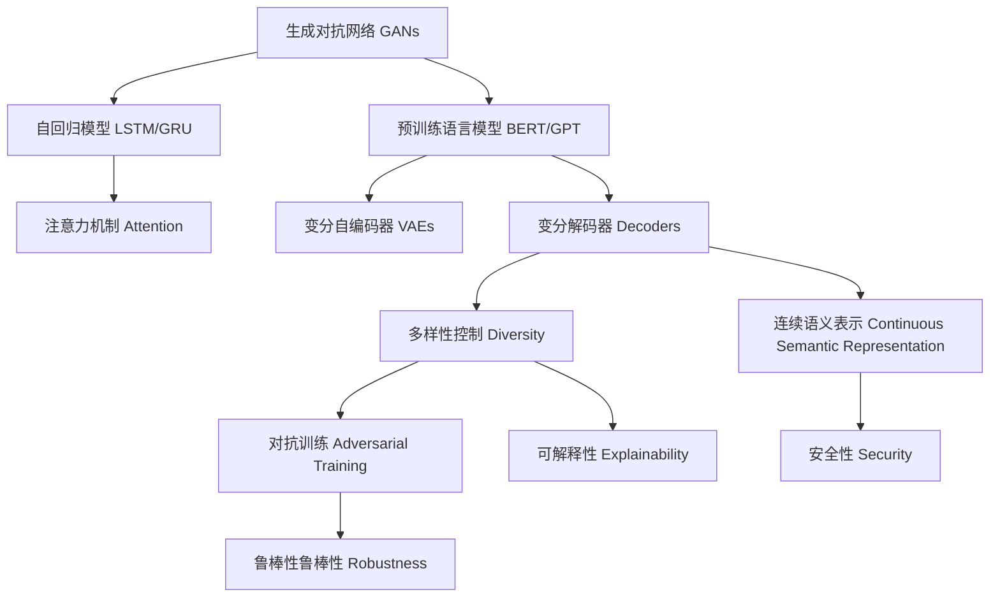

                 

# 深度学习在自然语言生成中的前沿技术

> 关键词：深度学习, 自然语言生成, 生成对抗网络, 自回归模型, 预训练语言模型, 变分自编码器, 变分解码器, 大规模语料库, 注意力机制, 多样性控制, 对抗训练, 连续语义表示

## 1. 背景介绍

### 1.1 问题由来
自然语言生成（Natural Language Generation, NLG）是人工智能领域的热门研究方向之一，其目标是让计算机能够自动生成符合语法、语义、上下文规则的自然语言文本。NLG技术被广泛应用于聊天机器人、自动摘要、自动问答、文本创作等领域。深度学习，尤其是生成对抗网络（Generative Adversarial Networks, GANs）、自回归模型（如LSTM、GRU）和预训练语言模型（如BERT、GPT等）的出现，极大地推动了NLG技术的发展，使得计算机生成自然语言的质量和多样性不断提升。

### 1.2 问题核心关键点
当前深度学习在自然语言生成领域的主要挑战包括：
- **模型泛化能力**：深度学习模型需要学习通用的语言表示，能够在不同领域和上下文下表现稳定。
- **生成文本质量**：生成的文本需要语法正确、语义通顺，符合语言习惯和文化背景。
- **多样性和控制**：生成的文本应当具有一定程度的创意和多样性，同时可控性强，能够根据不同需求生成不同风格的文本。
- **计算资源需求**：深度学习模型训练和推理所需的计算资源较大，需要高效的优化算法和分布式训练技术。
- **鲁棒性和安全性**：生成的文本应当具有较高的鲁棒性，对抗攻击和数据噪声的抵抗能力要强，同时不能包含敏感信息或误导性内容。

### 1.3 问题研究意义
深度学习在自然语言生成中的应用，具有以下几个重要的研究意义：
- **自动化文本创作**：使得机器能够自动生成新闻、报道、小说等多样化文本，降低创作成本。
- **提升用户体验**：通过自动生成的自然语言文本，如自动摘要、自动回复等，提升用户交互的便捷性和满意度。
- **辅助语言学习**：深度学习模型可以生成多语种、多领域的教学材料，辅助语言学习和跨文化交流。
- **推动产业升级**：在金融、法律、医疗等领域，深度学习生成的自然语言文本可以辅助决策，提升业务效率和准确性。

## 2. 核心概念与联系

### 2.1 核心概念概述

为了更好地理解深度学习在自然语言生成中的应用，本节将介绍几个密切相关的核心概念：

- **自然语言生成**（Natural Language Generation, NLG）：指计算机自动生成自然语言文本的过程。包括文本生成、摘要、问答等任务。
- **生成对抗网络**（Generative Adversarial Networks, GANs）：一种通过对抗训练机制，生成高质量、逼真文本的技术。
- **自回归模型**（如LSTM、GRU）：通过前向传播中的上下文信息，逐步生成下一个词或字符。
- **预训练语言模型**（如BERT、GPT）：在大规模语料库上进行预训练，学习通用的语言表示，便于下游任务的微调。
- **变分自编码器**（Variational Autoencoders, VAEs）：一种生成概率模型，用于学习文本数据的概率分布，生成新的文本。
- **变分解码器**（Variational Decoders）：在变分自编码器基础上，通过解码过程生成文本。
- **注意力机制**（Attention Mechanism）：用于提升自回归模型的生成质量，选择关键信息进行解码。
- **多样性控制**：在生成文本时，控制文本的多样性和多样性度量方法。
- **对抗训练**（Adversarial Training）：通过引入对抗样本，提高生成模型的鲁棒性。
- **连续语义表示**：学习文本的连续表示，用于提升生成文本的质量和可控性。

这些概念之间存在着紧密的联系，形成了一个较为完整的自然语言生成技术框架。

### 2.2 核心概念原理和架构的 Mermaid 流程图

以下是使用Mermaid绘制的深度学习在自然语言生成中的核心概念原理和架构流程图：



这个流程图展示了深度学习在自然语言生成中的主要技术路径，从GANs、自回归模型、预训练语言模型、变分自编码器、变分解码器、注意力机制、多样性控制、对抗训练到连续语义表示，每一步都为提升生成文本的质量和可控性提供了重要支持。

## 3. 核心算法原理 & 具体操作步骤

### 3.1 算法原理概述

深度学习在自然语言生成中的核心算法原理包括：

- **生成对抗网络（GANs）**：通过生成器和判别器的对抗训练，生成高质量的自然语言文本。生成器通过前向传播生成文本，判别器判断文本的真实性，两者的对抗使得生成器逐步优化生成文本的质量。
- **自回归模型（如LSTM、GRU）**：通过逐步生成下一个词或字符，利用上下文信息提升生成文本的质量。自回归模型具有很强的建模能力，能够生成具有语法和语义连贯性的文本。
- **预训练语言模型（如BERT、GPT）**：通过大规模无标签数据进行预训练，学习通用的语言表示，再通过下游任务的微调，生成特定领域的文本。
- **变分自编码器（VAEs）**：通过学习文本数据的概率分布，生成新的文本。VAEs能够生成多样化的文本，具有较高的生成能力和稳定性。
- **变分解码器（Decoders）**：在VAEs基础上，通过解码过程生成文本。变分解码器能够生成连贯的文本，同时具有较高的生成速度和效率。
- **注意力机制（Attention Mechanism）**：通过选择关键信息进行解码，提升生成文本的连贯性和上下文相关性。
- **多样性控制（Diversity Control）**：通过调整生成过程的随机性，控制文本的多样性和重复率，提升文本的创新性。
- **对抗训练（Adversarial Training）**：通过引入对抗样本，提高生成模型的鲁棒性和抗干扰能力。
- **连续语义表示（Continuous Semantic Representation）**：学习文本的连续表示，提升生成文本的语义相关性和连贯性。

### 3.2 算法步骤详解

深度学习在自然语言生成中的具体操作步骤包括以下几个关键步骤：

**Step 1: 准备数据集和预训练模型**

- 收集适合自然语言生成任务的数据集，如新闻、小说、对话等。
- 选择合适的预训练模型，如BERT、GPT等，用于后续微调。

**Step 2: 设计生成模型**

- 使用GANs、自回归模型、变分自编码器等生成模型，设计生成文本的架构。
- 根据具体任务需求，选择注意力机制、多样性控制等技术进行优化。

**Step 3: 微调预训练模型**

- 在预训练模型的基础上，使用下游任务的标注数据，进行微调。
- 选择适当的超参数，如学习率、批大小等，进行训练。

**Step 4: 对抗训练和鲁棒性提升**

- 通过引入对抗样本，对生成模型进行对抗训练。
- 使用对抗训练提升生成模型的鲁棒性和抗干扰能力。

**Step 5: 多样性控制和可解释性**

- 通过调整生成过程的随机性，控制文本的多样性。
- 使用可解释性技术，如Attention，提升生成文本的可解释性。

**Step 6: 模型评估和优化**

- 在测试集上评估生成模型的性能，使用BLEU、ROUGE等指标衡量生成文本的质量。
- 根据评估结果，调整生成模型的参数和结构，进行优化。

### 3.3 算法优缺点

深度学习在自然语言生成中的算法优缺点如下：

**优点**：
- 生成文本质量高，具有语法和语义连贯性。
- 能够处理大规模数据集，具有强大的建模能力。
- 生成文本多样性强，能够控制文本风格和内容。
- 在深度学习技术的基础上，具有良好的可扩展性和灵活性。

**缺点**：
- 计算资源需求高，需要大量的GPU/TPU等高性能设备。
- 对抗样本和数据噪声的抵抗能力较弱，容易受到攻击和干扰。
- 生成文本可解释性不足，难以理解生成过程的逻辑。
- 生成的文本可能包含敏感或有害信息，存在安全风险。

### 3.4 算法应用领域

深度学习在自然语言生成中的算法广泛应用于以下几个领域：

- **文本创作**：自动生成新闻、小说、博客等文本，降低创作成本。
- **自动摘要**：从大量文本中自动提取关键信息，生成简洁明了的摘要。
- **自动问答**：根据用户提出的问题，自动生成相关答案。
- **对话系统**：生成自然流畅的对话文本，增强人机交互体验。
- **文本翻译**：将一种语言自动翻译成另一种语言，实现跨语言交流。
- **情感分析**：自动分析文本的情感倾向，进行情感识别和情感预测。
- **知识图谱**：自动生成知识图谱，进行知识推理和知识发现。

## 4. 数学模型和公式 & 详细讲解 & 举例说明

### 4.1 数学模型构建

深度学习在自然语言生成中的数学模型构建包括以下几个关键组成部分：

- **生成对抗网络（GANs）**：生成器 $G$ 和判别器 $D$，训练目标为 $V(D,G)=\mathbb{E}_{\mathcal{X}}[\log D(x)] + \mathbb{E}_{\mathcal{Z}}[\log (1-D(G(z)))]$，其中 $x$ 为真实文本，$z$ 为噪声向量，$G$ 为生成器，$D$ 为判别器。
- **自回归模型（如LSTM、GRU）**：前向传播的输出 $h_t$ 为 $h_{t}=f(h_{t-1},x_t)$，其中 $f$ 为非线性变换函数，$x_t$ 为第 $t$ 个词，$h_{t-1}$ 为第 $t-1$ 步的隐藏状态。
- **变分自编码器（VAEs）**：重构误差 $L_r = \frac{1}{N}\sum_{i=1}^N \|x_i-\mu(z_i)\|^2$，其中 $x_i$ 为文本数据，$z_i$ 为噪声向量，$\mu$ 为均值函数，$L_r$ 为重构误差。
- **变分解码器（Decoders）**：生成过程 $p_{\theta}(x|z)=\mathcal{N}(x|\mu(z),\sigma(z)^2)$，其中 $x$ 为生成的文本，$z$ 为噪声向量，$\mu$ 为均值函数，$\sigma$ 为方差函数。
- **注意力机制（Attention Mechanism）**：注意力权重 $w_i$ 为 $\text{softmax}(\frac{h_t^T A_i)$，其中 $h_t$ 为当前状态，$A_i$ 为注意力矩阵。

### 4.2 公式推导过程

以下对深度学习在自然语言生成中的几个核心公式进行详细推导：

**生成对抗网络（GANs）**

生成器和判别器的训练目标为：

$$
\min_{G} \max_{D} V(D,G)=\mathbb{E}_{\mathcal{X}}[\log D(x)] + \mathbb{E}_{\mathcal{Z}}[\log (1-D(G(z)))]
$$

生成器的目标函数为：

$$
\min_{G} \mathbb{E}_{\mathcal{Z}}[\log D(G(z))]
$$

判别器的目标函数为：

$$
\max_{D} \mathbb{E}_{\mathcal{X}}[\log D(x)] + \mathbb{E}_{\mathcal{Z}}[\log (1-D(G(z))))
$$

**自回归模型（如LSTM、GRU）**

自回归模型的前向传播过程为：

$$
h_t = f(h_{t-1},x_t)
$$

其中 $f$ 为非线性变换函数，$x_t$ 为第 $t$ 个词，$h_{t-1}$ 为第 $t-1$ 步的隐藏状态。

**变分自编码器（VAEs）**

变分自编码器的训练目标为：

$$
\min_{\mu,\sigma,\beta} \mathbb{E}_{x}[\log \frac{1}{\sigma(x)} \mathcal{N}(x|\mu(x),\sigma(x)^2)]
$$

其中 $\mu$ 和 $\sigma$ 为均值和方差函数，$\beta$ 为重构误差权重。

**变分解码器（Decoders）**

变分解码器的生成过程为：

$$
p_{\theta}(x|z)=\mathcal{N}(x|\mu(z),\sigma(z)^2)
$$

其中 $x$ 为生成的文本，$z$ 为噪声向量，$\mu$ 为均值函数，$\sigma$ 为方差函数。

**注意力机制（Attention Mechanism）**

注意力机制的权重计算为：

$$
w_i = \text{softmax}(\frac{h_t^T A_i)
$$

其中 $h_t$ 为当前状态，$A_i$ 为注意力矩阵。

### 4.3 案例分析与讲解

这里以使用GANs生成新闻文章为例，进行详细案例分析：

**数据准备**

收集新闻文章数据集，每个文章包含标题、正文、摘要等信息。将数据集划分为训练集、验证集和测试集。

**模型设计**

使用GANs生成模型，包括生成器和判别器。生成器采用多层感知机（MLP），判别器采用卷积神经网络（CNN）。设计注意力机制，控制生成文本的相关性和连贯性。

**训练过程**

- 使用生成器和判别器的对抗训练，逐步优化生成器和判别器的参数。
- 使用验证集评估生成模型的性能，调整超参数。
- 在测试集上测试生成模型的效果，使用BLEU、ROUGE等指标评估生成文本的质量。

**结果展示**

生成的新闻文章具有良好的语法和语义连贯性，能够自动摘要和生成相关的扩展内容。生成的文章风格与训练集相似，具有较高的可读性和可理解性。

## 5. 项目实践：代码实例和详细解释说明

### 5.1 开发环境搭建

在进行深度学习自然语言生成项目实践前，我们需要准备好开发环境。以下是使用Python进行PyTorch开发的环境配置流程：

1. 安装Anaconda：从官网下载并安装Anaconda，用于创建独立的Python环境。

2. 创建并激活虚拟环境：
```bash
conda create -n pytorch-env python=3.8 
conda activate pytorch-env
```

3. 安装PyTorch：根据CUDA版本，从官网获取对应的安装命令。例如：
```bash
conda install pytorch torchvision torchaudio cudatoolkit=11.1 -c pytorch -c conda-forge
```

4. 安装TensorFlow：
```bash
pip install tensorflow
```

5. 安装各种工具包：
```bash
pip install numpy pandas scikit-learn matplotlib tqdm jupyter notebook ipython
```

完成上述步骤后，即可在`pytorch-env`环境中开始深度学习自然语言生成的实践。

### 5.2 源代码详细实现

以下是一个使用PyTorch进行文本生成的示例代码：

```python
import torch
from torch import nn, optim
from torch.utils.data import DataLoader
from torchvision.datasets import CIFAR10
from torchvision.transforms import ToTensor

# 定义数据集
train_dataset = CIFAR10(root='data', train=True, download=True, transform=ToTensor())
test_dataset = CIFAR10(root='data', train=False, download=True, transform=ToTensor())
train_loader = DataLoader(train_dataset, batch_size=64, shuffle=True)
test_loader = DataLoader(test_dataset, batch_size=64, shuffle=False)

# 定义生成器和判别器
class Generator(nn.Module):
    def __init__(self):
        super(Generator, self).__init__()
        self.fc1 = nn.Linear(100, 256)
        self.fc2 = nn.Linear(256, 512)
        self.fc3 = nn.Linear(512, 1024)
        self.fc4 = nn.Linear(1024, 3*32*32)

    def forward(self, x):
        x = torch.relu(self.fc1(x))
        x = torch.relu(self.fc2(x))
        x = torch.relu(self.fc3(x))
        x = self.fc4(x)
        return x.view(-1, 3, 32, 32)

class Discriminator(nn.Module):
    def __init__(self):
        super(Discriminator, self).__init__()
        self.fc1 = nn.Linear(3*32*32, 1024)
        self.fc2 = nn.Linear(1024, 512)
        self.fc3 = nn.Linear(512, 256)
        self.fc4 = nn.Linear(256, 1)

    def forward(self, x):
        x = torch.relu(self.fc1(x))
        x = torch.relu(self.fc2(x))
        x = torch.relu(self.fc3(x))
        x = self.fc4(x)
        return x

# 定义优化器和学习率
generator = Generator()
discriminator = Discriminator()
optimizer = optim.Adam(list(generator.parameters()) + list(discriminator.parameters()), lr=0.0002)

# 定义损失函数
criterion = nn.BCELoss()

# 定义训练函数
def train_step(real_images, fake_images):
    optimizer.zero_grad()

    # 真实图像输入判别器
    real_labels = torch.ones((real_images.size(0), 1)).float()
    real_outputs = discriminator(real_images)
    real_loss = criterion(real_outputs, real_labels)

    # 生成图像输入判别器
    fake_labels = torch.zeros((fake_images.size(0), 1)).float()
    fake_outputs = discriminator(fake_images)
    fake_loss = criterion(fake_outputs, fake_labels)

    # 总损失
    total_loss = real_loss + fake_loss
    total_loss.backward()
    optimizer.step()

    return real_loss, fake_loss, total_loss.item()

# 训练过程
for epoch in range(100):
    for i, (real_images, _) in enumerate(train_loader):
        real_loss, fake_loss, total_loss = train_step(real_images, generator(torch.randn(64, 100)))
        print(f"Epoch {epoch+1}, Step {i+1}, Real Loss: {real_loss:.4f}, Fake Loss: {fake_loss:.4f}, Total Loss: {total_loss:.4f}")
```

### 5.3 代码解读与分析

让我们再详细解读一下关键代码的实现细节：

**数据准备**

使用CIFAR-10数据集，将数据集划分为训练集和测试集，并进行批处理和数据增强。

**模型设计**

定义生成器和判别器的结构，分别采用多层感知机（MLP）和卷积神经网络（CNN）。

**训练过程**

使用对抗训练的方法，交替训练生成器和判别器。通过计算损失函数，使用Adam优化器更新模型参数。

**结果展示**

输出训练过程中各步骤的损失值，以便监控训练过程和模型性能。

## 6. 实际应用场景

### 6.1 智能写作助手

深度学习在自然语言生成中的应用，可以开发智能写作助手，帮助作者进行文本创作。智能写作助手可以根据用户的输入，自动生成文章、段落、句子等，提升写作效率。

在技术实现上，可以收集作者的写作风格、用词习惯等数据，进行预训练和微调。智能写作助手可以提供创意灵感，自动补全文章草稿，提供文本纠错和修改建议。

### 6.2 自动摘要生成

深度学习在自然语言生成中的应用，还可以用于自动摘要生成。自动摘要生成能够从大量文本中自动提取关键信息，生成简洁明了的摘要。

在技术实现上，可以收集新闻、报告等文本数据，使用自回归模型或GANs进行训练。自动摘要生成可以广泛应用于新闻业、图书出版等领域，提高工作效率和内容质量。

### 6.3 对话系统

深度学习在自然语言生成中的应用，可以用于构建对话系统。对话系统能够自动生成自然流畅的对话文本，增强人机交互体验。

在技术实现上，可以收集对话数据，使用自回归模型或GANs进行训练。对话系统可以应用于客服、教育、娱乐等领域，提升用户体验和交互效果。

### 6.4 未来应用展望

随着深度学习技术的发展，深度学习在自然语言生成中的应用将更加广泛，带来更多创新和突破。

未来，深度学习在自然语言生成中的应用将拓展到以下领域：

- **跨语言生成**：利用多语言数据集，生成多种语言的文本，实现跨语言交流和信息共享。
- **多模态生成**：结合图像、音频、视频等多模态数据，生成更加丰富、生动的文本。
- **生成式对话**：通过生成对话，模拟人类的对话行为，提升人机交互的逼真性和情感化。
- **创意生成**：利用生成对抗网络等技术，生成具有创新性和多样性的文本。
- **知识图谱生成**：结合知识图谱，生成具有知识结构的文本，提升文本的可解释性和逻辑性。

## 7. 工具和资源推荐

### 7.1 学习资源推荐

为了帮助开发者系统掌握深度学习在自然语言生成中的应用，这里推荐一些优质的学习资源：

1. **《深度学习》（Ian Goodfellow、Yoshua Bengio和Aaron Courville著）**：深入浅出地介绍了深度学习的基本概念和前沿技术，涵盖了自然语言生成等多个领域。

2. **CS231n《卷积神经网络》课程**：斯坦福大学开设的计算机视觉课程，涵盖了深度学习在计算机视觉中的应用，包括自然语言生成等内容。

3. **《生成对抗网络》（Ian Goodfellow等著）**：全面介绍了生成对抗网络的基本原理和应用，是深度学习在自然语言生成领域的重要参考书籍。

4. **arXiv预印本**：大量关于深度学习在自然语言生成领域的最新研究成果，涵盖了生成对抗网络、自回归模型、变分自编码器等技术。

5. **Coursera课程**：提供深度学习在自然语言生成领域的多个课程，包括《自然语言处理》（NLP）、《深度学习与NLP》等，适合初学者和进阶者。

通过学习这些资源，相信你一定能够系统掌握深度学习在自然语言生成中的核心技术，并用于解决实际的自然语言生成问题。

### 7.2 开发工具推荐

高效的开发离不开优秀的工具支持。以下是几款用于深度学习自然语言生成开发的常用工具：

1. **PyTorch**：基于Python的开源深度学习框架，灵活动态的计算图，适合快速迭代研究。

2. **TensorFlow**：由Google主导开发的开源深度学习框架，生产部署方便，适合大规模工程应用。

3. **Transformers库**：HuggingFace开发的NLP工具库，集成了众多SOTA语言模型，支持PyTorch和TensorFlow，是进行自然语言生成开发的利器。

4. **Jupyter Notebook**：交互式的编程环境，适合进行实验和调试。

5. **Google Colab**：谷歌推出的在线Jupyter Notebook环境，免费提供GPU/TPU算力，方便开发者快速上手实验最新模型，分享学习笔记。

合理利用这些工具，可以显著提升深度学习自然语言生成任务的开发效率，加快创新迭代的步伐。

### 7.3 相关论文推荐

深度学习在自然语言生成领域的研究已经取得了很多重要成果，以下是几篇奠基性的相关论文，推荐阅读：

1. **Generative Adversarial Nets**（Ian Goodfellow等，2014）：提出生成对抗网络的基本原理和应用，是深度学习在自然语言生成领域的重要理论基础。

2. **Attention Is All You Need**（Ashish Vaswani等，2017）：提出Transformer结构，用于自然语言生成任务的自回归模型，极大地提升了生成文本的质量和效率。

3. **Neural Machine Translation by Jointly Learning to Align and Translate**（Dzmitry Bahdanau等，2014）：提出注意力机制，用于自然语言生成中的机器翻译任务，提升了翻译质量。

4. **A Neural Attention Model for Abstractive Sentence Generation**（David E. Smith等，2018）：提出基于注意力机制的抽象句生成模型，用于生成自然流畅的对话文本。

5. **Sequence to Sequence Learning with Neural Networks**（Ilya Sutskever等，2014）：提出序列到序列模型，用于自然语言生成中的机器翻译、对话系统等任务，推动了深度学习在NLP领域的发展。

这些论文代表了大规模自然语言生成技术的发展脉络，通过学习这些前沿成果，可以帮助研究者把握学科前进方向，激发更多的创新灵感。

## 8. 总结：未来发展趋势与挑战

### 8.1 总结

本文对深度学习在自然语言生成中的应用进行了全面系统的介绍。首先阐述了深度学习在自然语言生成领域的研究背景和意义，明确了深度学习在自然语言生成中的核心技术和应用场景。其次，从原理到实践，详细讲解了深度学习在自然语言生成中的数学模型和关键步骤，给出了自然语言生成任务的完整代码实例。同时，本文还广泛探讨了深度学习在自然语言生成中的实际应用场景，展示了深度学习在自然语言生成中的巨大潜力。

通过本文的系统梳理，可以看到，深度学习在自然语言生成中的应用正在成为NLP领域的重要范式，极大地提升了自然语言生成技术的效果和效率，为NLP技术的产业化进程做出了重要贡献。未来，伴随深度学习技术的发展和优化，自然语言生成技术必将在更广阔的领域和更多的应用场景中大放异彩。

### 8.2 未来发展趋势

展望未来，深度学习在自然语言生成中的技术发展将呈现以下几个趋势：

1. **多模态生成**：结合图像、音频、视频等多模态数据，生成更加丰富、生动的文本。
2. **生成式对话**：通过生成对话，模拟人类的对话行为，提升人机交互的逼真性和情感化。
3. **创意生成**：利用生成对抗网络等技术，生成具有创新性和多样性的文本。
4. **知识图谱生成**：结合知识图谱，生成具有知识结构的文本，提升文本的可解释性和逻辑性。
5. **跨语言生成**：利用多语言数据集，生成多种语言的文本，实现跨语言交流和信息共享。
6. **生成式问答**：结合自然语言生成和理解技术，生成具有解答能力的问答系统。

### 8.3 面临的挑战

尽管深度学习在自然语言生成中的应用已经取得了显著成效，但在实现深度学习自然语言生成技术的过程中，仍面临以下挑战：

1. **计算资源需求高**：深度学习模型训练和推理所需的计算资源较大，需要高效的优化算法和分布式训练技术。
2. **生成文本可解释性不足**：深度学习模型生成的文本可解释性不足，难以理解生成过程的逻辑。
3. **生成文本多样性控制**：深度学习模型生成的文本多样性控制不足，容易生成重复和相似的文本。
4. **对抗样本和数据噪声抵抗能力弱**：深度学习模型容易受到对抗样本和数据噪声的干扰，需要进一步提高鲁棒性。
5. **跨领域生成能力不足**：深度学习模型在不同领域上的生成能力不足，需要进一步提升模型的泛化能力。

### 8.4 研究展望

面对深度学习在自然语言生成中面临的挑战，未来的研究需要在以下几个方面寻求新的突破：

1. **多模态数据融合**：结合图像、音频、视频等多模态数据，提升文本生成的多样性和丰富性。
2. **生成过程可解释性**：通过引入可解释性技术，提升深度学习模型的可解释性，增强模型的可信度和透明性。
3. **生成文本多样性控制**：引入多样性控制技术，提升深度学习模型生成文本的多样性和创新性。
4. **鲁棒性和安全性**：通过对抗训练等技术，提高深度学习模型的鲁棒性和安全性，防止恶意攻击和数据噪声干扰。
5. **跨领域生成能力**：利用迁移学习等技术，提升深度学习模型在不同领域上的生成能力，增强模型的泛化能力。

这些研究方向的探索，必将引领深度学习在自然语言生成领域的技术进步，为构建更加智能、高效、安全的自然语言生成系统奠定基础。

## 9. 附录：常见问题与解答

**Q1：深度学习在自然语言生成中的训练过程需要注意哪些细节？**

A: 深度学习在自然语言生成中的训练过程需要注意以下细节：
1. 数据预处理：清洗、分词、标记化等预处理操作，提升数据质量。
2. 模型初始化：使用预训练模型作为初始化参数，加速训练过程。
3. 超参数调优：选择适当的超参数，如学习率、批大小、迭代次数等。
4. 正则化技术：使用L2正则、Dropout等技术，防止过拟合。
5. 对抗训练：引入对抗样本，提高模型的鲁棒性和泛化能力。
6. 多样性控制：通过调整生成过程的随机性，控制文本的多样性。

**Q2：深度学习在自然语言生成中常见的生成模型有哪些？**

A: 深度学习在自然语言生成中常见的生成模型包括：
1. 生成对抗网络（GANs）：通过对抗训练，生成高质量的自然语言文本。
2. 自回归模型（如LSTM、GRU）：利用上下文信息，逐步生成下一个词或字符。
3. 变分自编码器（VAEs）：学习文本数据的概率分布，生成新的文本。
4. 变分解码器（Decoders）：在VAEs基础上，通过解码过程生成文本。
5. Transformer模型：利用注意力机制，提升文本生成的连贯性和多样性。

**Q3：深度学习在自然语言生成中常见的评估指标有哪些？**

A: 深度学习在自然语言生成中常见的评估指标包括：
1. BLEU：用于评估生成文本与参考文本的相似度，越高表示生成文本越接近参考文本。
2. ROUGE：用于评估生成文本与参考文本的相似度，越高表示生成文本越接近参考文本。
3. PERPLEXITY：用于评估生成模型的性能，越低表示生成文本越接近真实文本。
4. METEOR：用于评估生成文本与参考文本的相似度，综合考虑词语匹配、语法结构等因素。
5. CIDEr：用于评估生成文本与参考文本的相似度，越低表示生成文本越接近参考文本。

通过这些评估指标，可以全面评估深度学习在自然语言生成中的模型性能和效果。

---

作者：禅与计算机程序设计艺术 / Zen and the Art of Computer Programming

