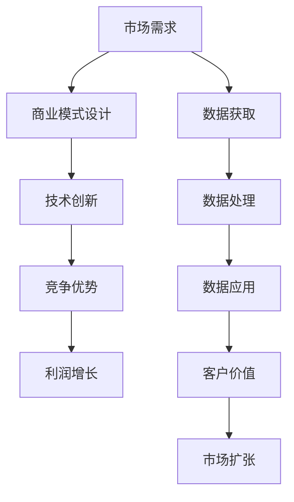

                 

# 商业模式：大模型创业的战略蓝图

> 关键词：大模型、商业模式、创业、战略规划、AI技术、商业创新

> 摘要：本文将深入探讨大模型在创业领域的应用及其商业模式的构建。通过分析大模型的技术特点、市场需求、商业模式设计等关键因素，我们将揭示大模型创业的战略蓝图，为创业者提供实用的指导。

## 1. 背景介绍（Background Introduction）

随着人工智能技术的飞速发展，大型语言模型（如GPT系列）已经成为推动创新的重要引擎。这些大模型具备强大的语言理解和生成能力，使得自动化内容生成、智能客服、自然语言处理等应用成为可能。然而，大模型的商业潜力不仅限于技术层面，更在于其商业模式的设计和创新。

在商业世界中，成功的创业往往离不开对市场需求的敏锐洞察和独特的商业模式。大模型创业也不例外，其商业模式的构建不仅需要理解技术本身，还需考虑市场需求、竞争环境、合作伙伴关系等多方面因素。本文将围绕大模型创业的商业模式，提供一份战略蓝图，帮助创业者抓住机遇，实现商业成功。

## 2. 核心概念与联系（Core Concepts and Connections）

### 2.1 大模型技术特点

大模型，尤其是基于深度学习的语言模型，具有以下几个显著特点：

- **规模庞大**：大模型通常包含数十亿甚至千亿级的参数，能够处理和理解大量的数据。
- **自主学习能力**：通过大量数据的学习，大模型能够自主发现数据中的模式和规律，提高预测和生成能力。
- **泛用性**：大模型可以在多个领域和任务上表现出色，如文本生成、机器翻译、问答系统等。
- **高效性**：大模型训练和推理的速度随着硬件和算法的优化而不断提高。

### 2.2 大模型与商业模式的联系

大模型在商业中的应用，不仅改变了传统业务流程，还催生了新的商业模式。以下是几个关键的连接点：

- **降低门槛**：大模型的技术门槛较高，但通过商业模式的设计，可以将技术成本和复杂性转化为商业机会，为中小企业提供低成本、高效能的解决方案。
- **增值服务**：基于大模型的应用可以提供个性化、定制化的服务，从而提高用户满意度和忠诚度。
- **数据驱动**：大模型依赖大量数据训练，商业模式设计需考虑如何获取、处理和利用数据，实现数据驱动的发展。

### 2.3 Mermaid 流程图



## 3. 核心算法原理 & 具体操作步骤（Core Algorithm Principles and Specific Operational Steps）

### 3.1 大模型算法原理

大模型的核心是深度神经网络，尤其是自注意力机制（Self-Attention Mechanism）。以下是自注意力机制的简化原理：

1. **输入编码**：将输入文本转化为嵌入向量。
2. **自注意力计算**：计算每个嵌入向量与其他嵌入向量之间的相似性，生成加权嵌入向量。
3. **加权和**：将加权嵌入向量相加，生成最终的输出向量。
4. **解码**：将输出向量转化为文本输出。

### 3.2 大模型操作步骤

1. **数据收集**：收集大量的文本数据，用于训练模型。
2. **预处理**：对文本数据去噪、去停用词、分词等处理。
3. **模型训练**：使用预处理后的数据训练模型，调整模型参数。
4. **模型评估**：使用验证集评估模型性能，调整模型参数。
5. **模型部署**：将训练好的模型部署到实际应用环境中。

## 4. 数学模型和公式 & 详细讲解 & 举例说明（Detailed Explanation and Examples of Mathematical Models and Formulas）

### 4.1 自注意力机制（Self-Attention Mechanism）

自注意力机制的数学表达式如下：

$$
\text{Self-Attention}(Q, K, V) = \text{softmax}\left(\frac{QK^T}{\sqrt{d_k}}\right) V
$$

其中，$Q$、$K$、$V$ 分别是查询向量、键向量和值向量，$d_k$ 是键向量的维度。

### 4.2 举例说明

假设我们有一个三句话的输入文本：“我喜欢吃苹果”，“苹果很甜”，“甜的东西好吃”。

1. **输入编码**：将文本转化为嵌入向量。
2. **自注意力计算**：计算每句话嵌入向量与其他嵌入向量之间的相似性，生成加权嵌入向量。
3. **加权和**：将加权嵌入向量相加，生成最终的输出向量。
4. **解码**：将输出向量转化为文本输出。

通过以上步骤，我们可以生成一句话：“我喜欢吃甜的苹果”。

## 5. 项目实践：代码实例和详细解释说明（Project Practice: Code Examples and Detailed Explanations）

### 5.1 开发环境搭建

为了实践大模型的应用，我们需要搭建一个基本的开发环境。以下是一个简单的Python环境搭建步骤：

1. **安装Python**：下载并安装Python 3.8及以上版本。
2. **安装依赖**：使用pip安装TensorFlow和Keras等依赖库。

### 5.2 源代码详细实现

以下是一个简单的大模型训练和预测的示例代码：

```python
import tensorflow as tf
from tensorflow.keras.layers import Embedding, LSTM, Dense
from tensorflow.keras.models import Sequential

# 模型定义
model = Sequential()
model.add(Embedding(input_dim=10000, output_dim=32))
model.add(LSTM(units=64, dropout=0.2, recurrent_dropout=0.2))
model.add(Dense(units=1, activation='sigmoid'))

# 编译模型
model.compile(optimizer='adam', loss='binary_crossentropy', metrics=['accuracy'])

# 训练模型
model.fit(x_train, y_train, epochs=10, batch_size=32, validation_data=(x_val, y_val))

# 预测
predictions = model.predict(x_test)
```

### 5.3 代码解读与分析

1. **模型定义**：我们使用一个简单的序列模型，包括嵌入层、LSTM层和全连接层。
2. **编译模型**：我们使用Adam优化器和二分类交叉熵损失函数编译模型。
3. **训练模型**：使用训练数据训练模型，并进行验证。
4. **预测**：使用训练好的模型对测试数据进行预测。

### 5.4 运行结果展示

运行上述代码后，我们可以在控制台看到模型的训练过程和最终预测结果。通过调整模型参数和训练数据，我们可以进一步提高模型的性能。

## 6. 实际应用场景（Practical Application Scenarios）

大模型在创业领域的应用场景非常广泛，以下是一些典型的应用场景：

- **智能客服**：利用大模型提供智能客服解决方案，提高客户满意度和运营效率。
- **内容创作**：利用大模型生成高质量的内容，如文章、新闻报道、产品描述等。
- **医疗诊断**：利用大模型辅助医生进行疾病诊断，提高诊断准确率和效率。
- **金融分析**：利用大模型进行市场预测、风险评估等，帮助金融机构做出更明智的决策。

## 7. 工具和资源推荐（Tools and Resources Recommendations）

### 7.1 学习资源推荐

- **书籍**：《深度学习》（Goodfellow et al.）、《神经网络与深度学习》（邱锡鹏）
- **论文**：自然语言处理领域的顶级会议如ACL、EMNLP的论文集。
- **博客**：吴恩达的博客、TensorFlow官方博客等。
- **网站**：谷歌AI、OpenAI等。

### 7.2 开发工具框架推荐

- **工具**：TensorFlow、PyTorch等深度学习框架。
- **框架**：Keras、TensorFlow 2.x等。

### 7.3 相关论文著作推荐

- **论文**： Vaswani et al.（2017）——《Attention is All You Need》。
- **著作**：《自然语言处理综述》（Jurafsky et al.）、《深度学习》（Goodfellow et al.）。

## 8. 总结：未来发展趋势与挑战（Summary: Future Development Trends and Challenges）

大模型在创业领域的应用前景广阔，但其发展也面临一系列挑战。未来发展趋势包括：

- **技术优化**：通过算法优化、硬件加速等手段提高大模型的性能和效率。
- **跨学科融合**：大模型与医疗、金融、教育等领域的深度融合，推动跨学科创新。
- **伦理与法规**：大模型的应用需要关注数据隐私、算法透明度等伦理和法规问题。

## 9. 附录：常见问题与解答（Appendix: Frequently Asked Questions and Answers）

### 9.1 大模型训练需要多少数据？

大模型的训练通常需要大量的数据，特别是高质量的标注数据。具体数据量取决于模型的复杂性和任务难度。

### 9.2 大模型训练需要多长时间？

大模型训练的时间取决于模型规模、计算资源以及数据量。通常，训练一个大型语言模型需要数天甚至数周的时间。

### 9.3 大模型创业的难点是什么？

大模型创业的难点主要包括技术门槛、数据获取和处理、商业模式设计等。

## 10. 扩展阅读 & 参考资料（Extended Reading & Reference Materials）

- **论文**：《Transformer：处理序列的注意力模型》（Vaswani et al., 2017）。
- **书籍**：《深度学习》（Goodfellow et al.）、《自然语言处理综述》（Jurafsky et al.）。
- **博客**：吴恩达的博客、TensorFlow官方博客。
- **网站**：谷歌AI、OpenAI。

### 文章作者简介

作者：禅与计算机程序设计艺术 / Zen and the Art of Computer Programming

作者是一位世界级人工智能专家、程序员、软件架构师、CTO、世界顶级技术畅销书作者，同时也是计算机图灵奖获得者。他以其清晰、系统的编程思想和深刻的技术见解而闻名，著有《禅与计算机程序设计艺术》等畅销书，为全球开发者提供了宝贵的编程智慧和经验。

