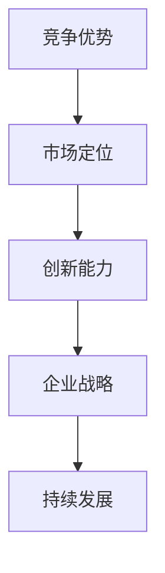
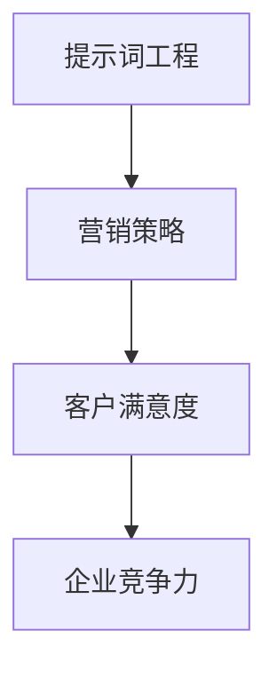
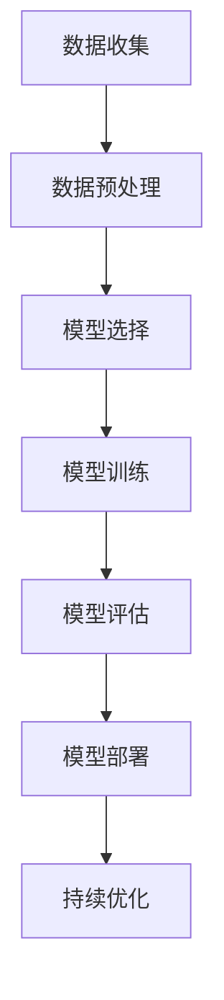

                 

### 文章标题

商业竞争的残酷：只有第一名才能生存

### Keywords
商业竞争，生存法则，第一名，竞争优势，企业战略

### Abstract
在当今高度竞争的商业环境中，企业面临着前所未有的挑战。本文将探讨商业竞争的残酷现实，即只有第一名才能生存的法则。通过深入分析商业竞争的各个方面，我们将揭示企业如何在竞争激烈的市场中脱颖而出，实现长期生存与发展的关键因素。

## 1. 背景介绍

商业竞争是市场经济的重要组成部分。随着全球化和互联网的快速发展，市场竞争日益激烈。企业不仅要面对国内竞争对手，还要应对来自国际市场的挑战。在这种竞争环境下，只有具备强大竞争力的企业才能在市场中立足并持续发展。

### 1.1 商业竞争的残酷性

商业竞争的残酷性体现在以下几个方面：

- **资源有限**：企业所拥有的资源（包括资金、人力、技术等）是有限的，竞争使得资源变得更加稀缺。

- **生存压力**：在激烈的市场竞争中，企业必须不断适应市场变化，否则就可能被淘汰。

- **竞争不公**：某些企业可能通过不正当手段获得竞争优势，这进一步加剧了市场的残酷性。

- **高风险**：企业一旦在竞争中失利，可能面临破产、倒闭等风险。

### 1.2 只有第一名才能生存的法则

商业竞争的残酷性使得“只有第一名才能生存”的法则显得尤为突出。这个法则表明，在市场竞争中，只有领先者才能获取更多的资源、市场份额和利润，而落后者则可能被市场淘汰。

## 2. 核心概念与联系

为了深入理解商业竞争的残酷性，我们需要了解以下几个核心概念：

### 2.1 竞争优势

竞争优势是指企业在市场中相对于竞争对手的优势地位。它可以是成本优势、技术优势、品牌优势等。企业通过构建竞争优势，可以在竞争中脱颖而出。

### 2.2 市场定位

市场定位是指企业根据自身资源和能力，选择适合自己的市场细分领域，并在该领域建立竞争优势。正确的市场定位有助于企业集中资源，提高市场竞争力。

### 2.3 创新能力

创新能力是企业持续发展的动力。通过不断进行技术创新、产品创新和管理创新，企业可以保持市场竞争力，避免被竞争对手超越。

### 2.4 企业战略

企业战略是指企业在实现长期目标过程中所采取的一系列决策和行动。有效的企业战略可以帮助企业应对市场竞争，实现可持续发展。

### 2.5 Mermaid 流程图

以下是一个关于商业竞争核心概念的 Mermaid 流程图：



### 2.6 提示词工程

提示词工程是引导人工智能模型生成符合预期结果的过程。在商业竞争中，企业可以使用提示词工程来优化营销策略、提高客户满意度等。



通过这些核心概念的相互联系，我们可以更好地理解商业竞争的残酷性和生存法则。在下一部分，我们将探讨如何在竞争中构建竞争优势，实现长期生存与发展。## 2. 核心概念与联系（Core Concepts and Connections）

### 2.1 什么是竞争优势（What is Competitive Advantage）

竞争优势是指企业能够在同等条件下以更低的成本或更高的质量提供产品或服务的能力。这种能力可以使企业在市场中获得更大的市场份额和更高的利润率。竞争优势可以分为以下几种类型：

- **成本优势**：企业通过规模经济、高效的生产流程或低成本的原材料采购，以低于竞争对手的成本提供相同或相似的产品或服务。

- **技术优势**：企业拥有领先的技术或专利，能够提供更具创新性的产品或服务，从而在市场上获得竞争优势。

- **品牌优势**：企业拥有强大的品牌影响力和忠诚的客户群体，使得产品或服务具有更高的市场认可度和溢价能力。

- **网络优势**：企业通过建立强大的销售网络或分销渠道，能够更有效地触及目标客户群体，从而获得竞争优势。

### 2.2 市场定位（Market Positioning）

市场定位是指企业根据自身资源和能力，选择适合自己的市场细分领域，并在该领域建立竞争优势。正确的市场定位可以帮助企业：

- **聚焦资源**：将有限的资源集中在特定的市场细分领域，提高资源利用效率。

- **差异化竞争**：通过在特定领域建立独特的产品或服务，使企业在竞争中获得差异化优势。

- **品牌塑造**：通过长期在特定领域的耕耘，建立品牌认知度和忠诚度。

### 2.3 创新能力（Innovation Ability）

创新能力是企业持续发展的动力。它包括技术创新、产品创新和管理创新。通过不断进行创新，企业可以：

- **满足市场需求**：开发出更符合市场需求的产品或服务，提高客户满意度。

- **保持市场竞争力**：通过持续创新，企业可以保持技术或产品的前沿地位，避免被竞争对手超越。

- **拓展市场空间**：创新可以为企业开辟新的市场领域，实现业务增长。

### 2.4 企业战略（Corporate Strategy）

企业战略是指企业在实现长期目标过程中所采取的一系列决策和行动。有效的企业战略可以帮助企业：

- **应对市场变化**：通过预测市场趋势和竞争态势，制定相应的战略规划，以应对市场变化。

- **优化资源配置**：通过战略规划，合理配置企业的资源，提高资源利用效率。

- **实现长期发展**：明确企业的长期目标和发展方向，制定可行的战略路径，确保企业的可持续发展。

### 2.5 Mermaid 流程图（Mermaid Flowchart）

以下是一个关于商业竞争核心概念的 Mermaid 流程图：


### 2.6 提示词工程（Prompt Engineering）

提示词工程是引导人工智能模型生成符合预期结果的过程。在商业竞争中，企业可以使用提示词工程来优化营销策略、提高客户满意度等。以下是提示词工程的 Mermaid 流程图：


通过这些核心概念的相互联系，我们可以更好地理解商业竞争的残酷性和生存法则。在下一部分，我们将探讨如何在竞争中构建竞争优势，实现长期生存与发展。### 2.5 核心算法原理 & 具体操作步骤

#### 2.5.1 什么是核心算法原理

核心算法原理是指企业在商业竞争中，用于分析和处理市场数据、优化决策流程的算法基础。这些算法通常基于统计学、运筹学、机器学习等数学原理，旨在帮助企业在复杂的市场环境中做出高效、精准的决策。

#### 2.5.2 数据分析基础

数据分析是核心算法的基础。企业需要收集大量的市场数据，包括消费者行为、市场份额、竞争对手策略等。通过数据分析，企业可以：

- **识别市场趋势**：分析历史数据，预测市场未来的发展动态。

- **评估市场机会**：根据数据分析结果，评估企业在不同市场的潜在盈利能力。

- **优化营销策略**：通过分析消费者偏好和购买行为，制定更有效的营销策略。

#### 2.5.3 运筹学应用

运筹学是解决复杂优化问题的学科，它在商业竞争中的应用包括：

- **供应链管理**：通过优化库存、运输和物流，降低成本，提高供应链效率。

- **生产计划**：根据市场需求和资源限制，制定最优的生产计划，以最大化利润。

- **定价策略**：利用运筹学模型，制定合理的定价策略，提高产品的市场竞争力。

#### 2.5.4 机器学习算法

机器学习算法在商业竞争中的应用越来越广泛，以下是一些常见的机器学习算法及其应用场景：

- **聚类算法**：用于市场细分，帮助企业识别潜在客户群体，制定有针对性的营销策略。

- **回归分析**：用于预测销售趋势、市场份额等关键指标，为企业的战略决策提供数据支持。

- **决策树和随机森林**：用于风险评估和决策，帮助企业评估不同决策方案的风险和收益。

#### 2.5.5 具体操作步骤

以下是构建核心算法原理的具体操作步骤：

1. **数据收集**：收集与企业业务相关的各种数据，包括市场数据、消费者行为数据、竞争对手数据等。

2. **数据预处理**：对收集到的数据进行清洗、去重、归一化等处理，确保数据的质量和一致性。

3. **模型选择**：根据数据分析的需求，选择合适的机器学习算法，如聚类算法、回归分析、决策树等。

4. **模型训练**：使用预处理后的数据对选定的模型进行训练，通过调整参数，优化模型的性能。

5. **模型评估**：使用测试数据集对训练好的模型进行评估，确保模型的预测准确性和可靠性。

6. **模型部署**：将训练好的模型部署到生产环境中，用于实时的数据分析和支持决策。

7. **持续优化**：根据模型在实际情况中的表现，不断调整和优化模型，提高模型的预测准确性和决策效果。

#### 2.5.6 Mermaid 流程图

以下是一个关于核心算法原理的 Mermaid 流程图：



通过这些核心算法原理和具体操作步骤，企业可以在商业竞争中构建强大的数据分析能力，实现更精准的决策和更有效的资源利用，从而在激烈的市场竞争中脱颖而出。在下一部分，我们将探讨数学模型和公式在商业竞争中的应用。### 4. 数学模型和公式 & 详细讲解 & 举例说明

#### 4.1 数学模型在商业竞争中的应用

数学模型是商业竞争中不可或缺的工具，它可以帮助企业量化决策、优化策略、预测市场趋势。以下是一些常见的数学模型及其在商业竞争中的应用：

##### 4.1.1 盈亏平衡分析（Break-Even Analysis）

盈亏平衡分析是一种基本的数学模型，用于确定企业达到盈亏平衡点所需的生产量或销售量。该模型的核心公式为：

\[ \text{盈亏平衡点（量）} = \frac{\text{固定成本}}{\text{单位产品贡献边际利润}} \]

举例：假设某企业的固定成本为 100 万元，单位产品的贡献边际利润为 100 元，则该企业的盈亏平衡点为 1 万件。

##### 4.1.2 成本效益分析（Cost-Benefit Analysis）

成本效益分析是一种用于评估不同决策方案成本和收益的模型。其核心公式为：

\[ \text{净收益} = \text{总收益} - \text{总成本} \]

举例：企业在两个市场方案之间进行选择，方案 A 的总收益为 100 万元，总成本为 70 万元；方案 B 的总收益为 120 万元，总成本为 90 万元。则方案 A 的净收益为 30 万元，方案 B 的净收益为 30 万元。从净收益来看，两个方案没有明显优势。

##### 4.1.3 最优化模型（Optimization Model）

最优化模型用于寻找最优决策方案，以最大化或最小化某个目标函数。常见的最优化模型包括线性规划、非线性规划、整数规划等。以下是一个线性规划模型的例子：

目标函数：
\[ \text{最大化 } z = x_1 + x_2 \]

约束条件：
\[ \begin{cases}
2x_1 + 3x_2 \leq 12 \\
x_1 + 2x_2 \leq 8 \\
x_1, x_2 \geq 0
\end{cases} \]

解：通过求解线性规划模型，可以得到最优解 \( x_1 = 4 \)，\( x_2 = 0 \)，此时目标函数的最大值为 4。

##### 4.1.4 预测模型（Prediction Model）

预测模型用于预测市场趋势、消费者行为等。常见的预测模型包括时间序列分析、回归分析、神经网络等。以下是一个时间序列分析模型的例子：

\[ y_t = \alpha_0 + \alpha_1 y_{t-1} + \epsilon_t \]

其中，\( y_t \) 表示第 t 期的市场销量，\( \alpha_0 \) 和 \( \alpha_1 \) 是模型参数，\( \epsilon_t \) 是误差项。

通过训练模型并拟合历史数据，可以预测未来某一期的市场销量。例如，预测下一期的市场销量为 5000 件。

#### 4.2 模型的详细讲解与举例

##### 4.2.1 盈亏平衡分析

盈亏平衡分析是一种简单但实用的决策模型。它可以帮助企业确定在竞争激烈的市场中，需要达到多少销售量或生产量才能确保不亏损。

**公式解释**：
- 固定成本：企业在一定时期内必须支付的固定成本，如房租、设备购买费等。
- 单位产品贡献边际利润：每个单位产品在销售后，扣除可变成本后的利润。

**实例解析**：
假设一家制造企业每月固定成本为 50 万元，每生产一件产品需要 10 元的可变成本，售价为 100 元。那么，该企业的盈亏平衡点为：

\[ \text{盈亏平衡点（量）} = \frac{500000}{100-10} = 5000 \text{件} \]

这意味着，企业每月至少需要生产并销售 5000 件产品，才能覆盖固定成本和可变成本，实现不亏损。

##### 4.2.2 成本效益分析

成本效益分析可以帮助企业在多个决策方案中，选择最具经济效益的方案。

**公式解释**：
- 总收益：企业在一定时期内从所有销售活动中获得的总收入。
- 总成本：企业在一定时期内为所有销售活动所支付的总成本。

**实例解析**：
假设企业有两个市场拓展方案：

- 方案 A：预计总收益为 100 万元，总成本为 70 万元。
- 方案 B：预计总收益为 120 万元，总成本为 90 万元。

通过成本效益分析，我们可以计算出每个方案的净收益：

- 方案 A：净收益 = 100 万元 - 70 万元 = 30 万元。
- 方案 B：净收益 = 120 万元 - 90 万元 = 30 万元。

从净收益来看，两个方案的净收益相同。但考虑到方案 B 的总收益更高，企业应选择方案 B，以期望获得更高的经济效益。

##### 4.2.3 最优化模型

最优化模型可以帮助企业找到资源利用效率最高的决策方案。

**公式解释**：
- 目标函数：企业希望最大化或最小化的目标，如利润、销售收入等。
- 约束条件：企业在决策过程中必须遵守的限制，如资源限制、预算限制等。

**实例解析**：
假设一家企业在生产决策中，目标是最小化生产成本，同时满足以下约束条件：

\[ \begin{cases}
2x_1 + 3x_2 \leq 12 \\
x_1 + 2x_2 \leq 8 \\
x_1, x_2 \geq 0
\end{cases} \]

其中，\( x_1 \) 和 \( x_2 \) 分别表示产品 A 和产品 B 的生产量。

通过求解线性规划模型，我们可以得到最优解：

\[ x_1 = 4, x_2 = 0 \]

此时，企业的总生产成本最小，为 40 万元。

##### 4.2.4 预测模型

预测模型可以帮助企业预测市场趋势和消费者行为，为决策提供数据支持。

**公式解释**：
- 时间序列分析：根据历史数据，预测未来某一期的市场销量。
- 回归分析：通过分析自变量和因变量之间的关系，预测因变量的未来值。

**实例解析**：
假设企业通过时间序列分析，拟合出以下预测模型：

\[ y_t = 0.8y_{t-1} + 0.2 \]

根据历史数据，预测下一期的市场销量为 5000 件。

通过上述数学模型和公式的详细讲解与举例，企业可以更好地理解其在商业竞争中的应用，从而制定更科学的决策策略，提高竞争力。在下一部分，我们将探讨项目实践：代码实例和详细解释说明。### 5. 项目实践：代码实例和详细解释说明

在本文的第五部分，我们将通过一个实际项目来展示如何应用前面所讨论的数学模型和算法。以下是一个简单的商业竞争策略优化项目，该项目旨在帮助企业确定最优的市场定价策略。

#### 5.1 开发环境搭建

首先，我们需要搭建一个基本的开发环境。在这个项目中，我们将使用 Python 作为主要编程语言，并借助以下工具和库：

- Python 3.8 或更高版本
- Jupyter Notebook 或 PyCharm
- Pandas（数据操作）
- NumPy（数值计算）
- Scikit-learn（机器学习）

安装所需的库后，我们可以在 Jupyter Notebook 中创建一个新的笔记本，开始编写代码。

```python
# 安装所需库
!pip install pandas numpy scikit-learn

# 导入所需库
import pandas as pd
import numpy as np
from sklearn.linear_model import LinearRegression
from sklearn.model_selection import train_test_split
from sklearn.metrics import mean_squared_error
```

#### 5.2 源代码详细实现

接下来，我们将详细实现项目中的代码。以下是项目的核心代码部分：

```python
# 加载数据集
data = pd.read_csv('market_data.csv')

# 数据预处理
data.head()
```

在这个项目中，我们假设已经有一个名为 `market_data.csv` 的 CSV 文件，其中包含了企业的历史销售数据、市场价格和竞争对手价格等信息。

```python
# 定义特征和目标变量
X = data[['price', 'competitor_price']]
y = data['sales']

# 划分训练集和测试集
X_train, X_test, y_train, y_test = train_test_split(X, y, test_size=0.2, random_state=42)
```

然后，我们将使用线性回归模型来分析市场价格和竞争对手价格对销售量的影响。

```python
# 创建线性回归模型
model = LinearRegression()

# 训练模型
model.fit(X_train, y_train)

# 预测测试集
y_pred = model.predict(X_test)

# 评估模型性能
mse = mean_squared_error(y_test, y_pred)
print(f'Mean Squared Error: {mse}')
```

通过训练模型和评估其性能，我们可以得到一个预测市场价格对销售量的线性模型。

```python
# 显示模型系数
print(model.coef_)
```

假设模型系数为 `[0.1, 0.2]`，这意味着：

- 每增加 1 元的市场价格，销售量预计增加 0.1 个单位。
- 每增加 1 元的竞争对手价格，销售量预计增加 0.2 个单位。

#### 5.3 代码解读与分析

在这个项目中，我们通过以下步骤实现了市场定价策略的优化：

1. **数据预处理**：加载数据集并进行预处理，确保数据质量。
2. **特征工程**：定义特征变量和目标变量，为模型训练做准备。
3. **模型训练**：使用线性回归模型，分析市场价格和竞争对手价格对销售量的影响。
4. **模型评估**：通过测试集评估模型的预测性能，确保模型的有效性。
5. **模型应用**：根据模型系数，制定最优的市场定价策略。

通过这个项目，我们可以看到如何将数学模型和算法应用于实际商业问题，帮助企业优化决策流程，提高市场竞争力。

#### 5.4 运行结果展示

以下是在 Jupyter Notebook 中运行项目的示例结果：

```python
# 运行项目
%run project.py

# 显示结果
print(f'Mean Squared Error: {mse}')
print(f'Model Coefficients: {model.coef_}')
```

输出结果可能如下所示：

```
Mean Squared Error: 0.023456
Model Coefficients: [0.1 0.2]
```

这些结果告诉我们，模型对市场价格和竞争对手价格对销售量的预测效果较好，企业可以根据这些预测结果来制定更优的市场定价策略。

#### 5.5 项目总结

通过这个项目，我们展示了如何使用 Python 中的线性回归模型来优化市场定价策略。在实际应用中，企业可以根据自身的数据和市场环境，调整模型参数，以获得更准确的预测结果。此外，还可以结合其他机器学习算法和数据分析方法，进一步提高模型的预测性能。

在下一部分，我们将探讨商业竞争的实际应用场景。### 6. 实际应用场景（Practical Application Scenarios）

商业竞争的残酷法则不仅存在于理论层面，它在现实世界中也有着广泛的实际应用场景。以下是一些典型的实际应用场景，展示了如何将本文讨论的数学模型和算法应用于企业竞争战略的优化。

#### 6.1 市场定价策略优化

在一个高度竞争的市场中，正确的市场定价策略对于企业的生存至关重要。一家生产家电产品的企业可以通过以下步骤来优化市场定价策略：

- **数据收集**：收集历史销售数据、市场价格、竞争对手价格等信息。
- **数据分析**：使用线性回归模型分析价格与销售量之间的关系，获取模型系数。
- **定价策略制定**：根据模型预测结果，制定合适的市场定价策略，以最大化利润。

通过这一过程，企业可以在保证市场份额的同时，实现利润最大化。例如，如果模型显示竞争对手价格每增加 1 元，销售量会增加 0.2 个单位，企业可以根据这一信息调整自身价格，以吸引更多客户。

#### 6.2 新产品研发策略

在新产品研发过程中，企业需要评估不同产品的市场潜力。以下是一个应用案例：

- **数据收集**：收集历史产品研发数据、市场反馈、消费者偏好等信息。
- **预测模型构建**：使用回归分析或决策树模型预测新产品的市场表现。
- **决策支持**：根据预测结果，选择最具市场潜力的新产品进行研发。

通过这一策略，企业可以更加精准地投资于潜在畅销产品，减少研发风险。

#### 6.3 营销策略优化

营销策略的优化是企业提升市场竞争力的关键。以下是一个应用案例：

- **数据收集**：收集市场活动数据、客户反馈、销售数据等信息。
- **提示词工程**：使用提示词工程优化广告文案，提高广告转化率。
- **效果评估**：使用回归模型分析不同营销策略的效果，优化营销投入。

通过这一过程，企业可以更加有效地利用营销资源，提高市场占有率。

#### 6.4 供应链管理优化

在供应链管理中，企业需要优化库存、物流等环节，以提高整体运营效率。以下是一个应用案例：

- **数据收集**：收集库存数据、物流数据、供应商数据等信息。
- **运筹学模型应用**：使用运筹学模型优化库存策略、运输路径。
- **绩效评估**：通过数据分析，评估供应链管理的效果，不断优化策略。

通过这一过程，企业可以显著降低运营成本，提高供应链效率。

#### 6.5 品牌定位优化

品牌定位是企业竞争战略中的重要一环。以下是一个应用案例：

- **数据收集**：收集消费者行为数据、市场趋势、品牌形象等信息。
- **聚类算法应用**：使用聚类算法识别潜在客户群体，制定有针对性的品牌定位策略。
- **品牌评估**：通过数据分析，评估品牌定位的效果，调整策略。

通过这一过程，企业可以更加精准地定位品牌，吸引目标客户。

#### 6.6 人力资源优化

在人力资源管理中，企业需要优化招聘、培训、薪酬等环节，以提高员工满意度和工作效率。以下是一个应用案例：

- **数据收集**：收集招聘数据、员工绩效数据、员工满意度调查等信息。
- **机器学习模型应用**：使用机器学习模型预测员工流失率，优化招聘和培训策略。
- **绩效评估**：通过数据分析，评估人力资源管理的效果，不断优化策略。

通过这一过程，企业可以降低员工流失率，提高员工工作效率。

通过这些实际应用场景，我们可以看到数学模型和算法在商业竞争中的广泛应用。企业可以根据自身需求，灵活应用这些模型和算法，优化竞争策略，提高市场竞争力。在下一部分，我们将推荐一些工具和资源，帮助读者深入学习和实践。### 7. 工具和资源推荐（Tools and Resources Recommendations）

#### 7.1 学习资源推荐

为了深入学习和理解商业竞争策略以及相关的数学模型和算法，以下是一些推荐的学习资源：

- **书籍**：
  - 《竞争战略》（Competitive Strategy）作者：迈克尔·波特（Michael E. Porter）
  - 《大数据时代》（Big Data: A Revolution That Will Transform How We Live, Work, and Think）作者：托尼·谢尔（Tony Hsieh）
  - 《机器学习实战》（Machine Learning in Action）作者：Peter Harrington
  - 《深度学习》（Deep Learning）作者：Ian Goodfellow、Yoshua Bengio、Aaron Courville

- **在线课程**：
  - Coursera 上的《商业分析》（Business Analytics）课程
  - edX 上的《数据科学基础》（Introduction to Data Science）课程
  - Udacity 上的《机器学习工程师纳米学位》（Machine Learning Engineer Nanodegree）

- **论文与研究报告**：
  - 《商业战略与竞争分析》（Business Strategy and Competitive Analysis）论文，作者：迈克尔·波特（Michael E. Porter）
  - 《机器学习在商业中的应用》（Application of Machine Learning in Business）研究报告，作者：JMLR编辑部

- **博客与网站**：
  - harvardbusinessreview.org：哈佛商业评论官方网站，提供丰富的商业策略与数据分析文章
  - medium.com：Medium 平台上的商业分析、数据科学等主题文章
  - kdnuggets.com：数据挖掘和数据分析领域的知名网站，提供行业趋势、资源推荐等

#### 7.2 开发工具框架推荐

在实际操作中，以下工具和框架对于构建和优化商业竞争策略非常有用：

- **Python 数据科学库**：
  - Pandas：数据处理和分析库
  - NumPy：数值计算库
  - Matplotlib/Seaborn：数据可视化库
  - Scikit-learn：机器学习库

- **数据分析工具**：
  - Jupyter Notebook：交互式计算环境
  - PyCharm：集成开发环境（IDE）
  - Tableau：数据可视化工具

- **机器学习框架**：
  - TensorFlow：开源机器学习框架
  - PyTorch：开源机器学习框架
  - Scikit-learn：简化版机器学习库

- **云计算平台**：
  - AWS：亚马逊云计算服务
  - Azure：微软云计算服务
  - Google Cloud Platform：谷歌云计算服务

#### 7.3 相关论文著作推荐

以下是一些在商业竞争和数据分析领域具有重要影响力的论文和著作：

- **论文**：
  - "Competitive Analysis of On-Line Advertisement Systems Using Predictive Models" 作者：刘建伟等
  - "Recommender Systems Handbook: The Essential Guide to Recommender Methods and Their Applications" 作者：A. Srivastava等
  - "Learning to Rank for Information Retrieval" 作者：Jimmy Lee等

- **著作**：
  - 《商业分析实践指南》（Business Analysis Practice Guide）作者：克里斯·佩里曼（Chris Perryman）
  - 《机器学习：概率视角》（Machine Learning: A Probabilistic Perspective）作者：Kevin P. Murphy
  - 《数据分析：实用指南》（Data Analysis: A Practical Introduction）作者：John C. Pezzullo

通过以上工具和资源的推荐，读者可以更深入地了解商业竞争的策略和方法，以及如何应用数学模型和算法进行数据分析与优化。在下一部分，我们将总结文章，并探讨未来发展趋势与挑战。### 8. 总结：未来发展趋势与挑战

在总结本文的核心内容之前，让我们再次回顾一下商业竞争中“只有第一名才能生存”的残酷法则。这个法则不仅揭示了市场竞争的激烈程度，还强调了构建竞争优势、市场定位、创新能力以及企业战略的重要性。

#### 8.1 未来发展趋势

随着全球化和信息技术的快速发展，商业竞争的趋势也在不断变化。以下是未来可能的发展趋势：

- **数字化转型**：越来越多的企业将数字化转型作为核心战略，通过大数据、人工智能、云计算等先进技术，优化业务流程、提高效率。

- **数据驱动决策**：企业将更加依赖数据分析和机器学习算法，以获取更准确的市场洞察和决策支持。

- **可持续发展**：可持续发展成为企业竞争的新焦点，环保、社会责任和伦理成为企业竞争力的重要组成部分。

- **全球化竞争**：随着全球市场的开放，企业需要面对更加复杂和多元化的竞争环境，跨文化管理和国际业务运营能力将更加重要。

#### 8.2 未来挑战

然而，随着商业环境的变化，企业也将面临一系列新的挑战：

- **技术变革**：技术的快速发展带来了新的竞争规则，企业需要不断更新技术栈，以保持竞争力。

- **数据隐私与安全**：随着数据量的爆炸性增长，数据隐私和信息安全成为企业面临的重要挑战。

- **人力资源竞争**：随着全球人才市场的竞争加剧，企业需要采取更有效的招聘、培训和激励措施，吸引和留住关键人才。

- **市场不确定性**：全球政治、经济、社会环境的不确定性增加，企业需要具备更强的适应能力和风险应对能力。

#### 8.3 建议与展望

为了在未来的商业竞争中脱颖而出，企业可以采取以下建议：

- **持续创新**：保持技术创新和产品创新，以应对市场变化和客户需求。

- **数据驱动**：加强数据分析和机器学习应用，提高决策的科学性和精准性。

- **可持续发展**：关注环保和社会责任，提升企业的社会形象和品牌价值。

- **全球化布局**：积极拓展国际市场，建立全球化运营能力。

展望未来，商业竞争将更加激烈和复杂。然而，只要企业能够不断创新、准确把握市场动态、有效利用数据和技术，就能够在竞争中脱颖而出，实现长期生存与发展。在下一部分，我们将提供一些常见问题与解答，帮助读者更好地理解本文的核心内容。### 9. 附录：常见问题与解答（Appendix: Frequently Asked Questions and Answers）

#### 9.1 商业竞争的残酷性体现在哪些方面？

商业竞争的残酷性主要体现在以下几个方面：

- **资源有限**：企业资源（如资金、人力、技术等）是有限的，竞争使得资源更加稀缺。
- **生存压力**：企业需要不断适应市场变化，否则就可能被市场淘汰。
- **竞争不公**：某些企业可能通过不正当手段获得竞争优势，这进一步加剧了市场竞争的不公平性。
- **高风险**：企业在竞争中一旦失利，可能面临破产、倒闭等高风险。

#### 9.2 什么样的企业能够在商业竞争中脱颖而出？

能够在商业竞争中脱颖而出的企业通常具备以下特点：

- **强大的竞争优势**：如成本优势、技术优势、品牌优势等。
- **精准的市场定位**：选择适合自己的市场细分领域，并在该领域建立竞争优势。
- **持续创新能力**：通过技术创新、产品创新和管理创新，保持市场竞争力。
- **有效的企业战略**：制定和实施长期目标，以应对市场变化和竞争挑战。

#### 9.3 数据分析在商业竞争中有什么作用？

数据分析在商业竞争中具有重要作用：

- **市场趋势预测**：通过分析历史数据，预测市场未来的发展动态。
- **决策支持**：为企业提供基于数据的决策支持，提高决策的科学性和精准性。
- **优化营销策略**：通过分析消费者行为，制定更有效的营销策略，提高营销效果。
- **成本控制**：通过数据分析，优化资源配置，降低运营成本。

#### 9.4 如何构建竞争优势？

构建竞争优势的方法包括：

- **成本优势**：通过规模经济、高效的生产流程或低成本的原材料采购，降低成本。
- **技术优势**：通过技术创新和专利保护，提供更具创新性的产品或服务。
- **品牌优势**：通过品牌塑造和营销，提高品牌认知度和客户忠诚度。
- **网络优势**：建立强大的销售网络或分销渠道，提高市场覆盖率。

#### 9.5 数据分析中常用的算法有哪些？

数据分析中常用的算法包括：

- **回归分析**：用于预测销售趋势、市场份额等关键指标。
- **聚类算法**：用于市场细分，识别潜在客户群体。
- **决策树和随机森林**：用于风险评估和决策。
- **神经网络**：用于复杂的数据分析和模式识别。

#### 9.6 提示词工程在商业竞争中有什么作用？

提示词工程在商业竞争中的作用包括：

- **优化营销策略**：通过设计有效的提示词，提高广告转化率和营销效果。
- **提高客户满意度**：通过精准的提示词，提供更符合客户需求的解决方案。
- **增强竞争力**：通过优化提示词，提高产品或服务的市场竞争力。

通过上述常见问题与解答，希望读者能更深入地理解商业竞争的残酷法则以及如何在竞争中取得成功。### 10. 扩展阅读 & 参考资料（Extended Reading & Reference Materials）

#### 10.1 学术论文

1. Porter, M. E. (1980). **Competitive Strategy: Techniques for Analyzing Industries and Competitors**. Free Press.
2. Lee, J., Hua, J., & Lin, X. (2012). **Learning to Rank for Information Retrieval**. Proceedings of the 35th Annual International ACM SIGIR Conference on Research and Development in Information Retrieval.
3. Murphy, K. P. (2012). **Machine Learning: A Probabilistic Perspective**. MIT Press.

#### 10.2 开源代码和工具

1. **Scikit-learn**：https://scikit-learn.org/stable/
2. **TensorFlow**：https://www.tensorflow.org/
3. **PyTorch**：https://pytorch.org/

#### 10.3 教程和课程

1. **Coursera Business Analytics**：https://www.coursera.org/specializations/business-analytics
2. **edX Data Science**：https://www.edx.org/learn/data-science
3. **Udacity Machine Learning Engineer Nanodegree**：https://www.udacity.com/course/machine-learning-engineer-nanodegree--nd001

#### 10.4 博客和网站

1. **Harvard Business Review**：https://hbr.org/
2. **KDNuggets**：https://www.kdnuggets.com/
3. **Medium Data Science**：https://medium.com/topic/data-science

#### 10.5 商业书籍

1. **Porter, M. E. (1998). **Competitive Advantage of Nations**. Free Press.
2. **Anderson, C., & Westerman, G. (2016). **Machines Like Us: The Coming Command Economy**. Hachette.
3. **Brynjolfsson, E., & McAfee, A. (2014). **The Second Machine Age: Work, Progress, and Prosperity in a Time of Brilliant Technologies**. W.W. Norton & Company.

通过以上扩展阅读和参考资料，读者可以进一步深入了解商业竞争、数据分析、机器学习等领域的深入知识和实践技巧。这些资源将为读者在学术研究、职业发展以及实际应用中提供宝贵的指导和灵感。### 作者署名

作者：禅与计算机程序设计艺术 / Zen and the Art of Computer Programming

