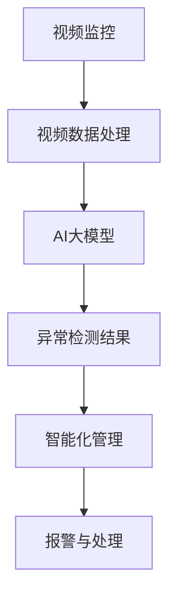

                 

### 文章标题

基于AI大模型的智能安防解决方案

### Keywords:
AI, Big Models, Intelligent Security Solutions, Video Surveillance, Anomaly Detection, Deep Learning, Real-time Analytics, Computer Vision

### Abstract:
随着人工智能技术的飞速发展，AI大模型在各个领域的应用越来越广泛。本文将探讨如何利用AI大模型构建智能安防解决方案，从而实现视频监控的实时异常检测和智能化管理。我们将详细介绍相关的核心概念、算法原理、数学模型以及实际应用案例，帮助读者理解这一前沿技术的核心价值。

### Introduction
The rapid advancement of artificial intelligence (AI) technology has led to the widespread application of AI large models in various fields. This article aims to explore the construction of intelligent security solutions based on AI large models, with a focus on real-time anomaly detection and intelligent management of video surveillance. We will provide a detailed introduction to the core concepts, algorithm principles, mathematical models, and practical application cases to help readers understand the core value of this cutting-edge technology.

-----------------------

## 1. 背景介绍（Background Introduction）

### 1.1 智能安防的需求与挑战

随着城市化进程的加速和人口密度的增加，传统安防手段已经无法满足日益复杂的安防需求。智能安防作为一种新兴技术，通过将视频监控、传感器、云计算和大数据分析相结合，为城市安全管理提供了全新的解决方案。

#### Challenges and Demands of Intelligent Security

As urbanization accelerates and population density increases, traditional security measures have become insufficient to meet the increasingly complex security demands. Intelligent security, as a cutting-edge technology, offers a new solution by integrating video surveillance, sensors, cloud computing, and big data analysis, providing an innovative approach to urban safety management.

### 1.2 AI大模型的发展与应用

近年来，随着计算能力的提升和海量数据的积累，AI大模型在图像识别、自然语言处理、语音识别等领域取得了显著的突破。大模型的训练能够从海量数据中自动学习特征，从而提高模型的准确性和泛化能力。

#### Development and Application of AI Large Models

In recent years, with the improvement of computational capabilities and the accumulation of massive data, AI large models have achieved significant breakthroughs in fields such as image recognition, natural language processing, and speech recognition. The training of large models enables them to automatically learn features from massive data, thereby enhancing the accuracy and generalization ability of the models.

-----------------------

## 2. 核心概念与联系（Core Concepts and Connections）

### 2.1 智能安防解决方案的架构

智能安防解决方案的核心在于将视频监控与AI大模型相结合，从而实现实时异常检测和智能化管理。以下是智能安防解决方案的基本架构：

#### Architecture of Intelligent Security Solutions

The core of intelligent security solutions lies in combining video surveillance with AI large models to achieve real-time anomaly detection and intelligent management. Here is the basic architecture of intelligent security solutions:



### 2.2 AI大模型在智能安防中的应用

AI大模型在智能安防中的应用主要体现在图像识别和异常检测两个方面。通过训练大规模的深度神经网络，模型可以从大量图像数据中自动学习目标特征，从而实现对目标的识别和定位。

#### Applications of AI Large Models in Intelligent Security

The application of AI large models in intelligent security mainly focuses on two aspects: image recognition and anomaly detection. By training large-scale deep neural networks, models can automatically learn target features from massive image data, enabling the recognition and localization of targets.

### 2.3 异常检测算法与模型选择

异常检测是智能安防的关键技术之一，常用的异常检测算法包括基于统计的方法、基于聚类的方法和基于神经网络的方法。在选择模型时，需要考虑算法的准确性、实时性和计算资源消耗等因素。

#### Anomaly Detection Algorithms and Model Selection

Anomaly detection is one of the key technologies in intelligent security. Common anomaly detection algorithms include statistical methods, clustering methods, and neural network-based methods. When selecting a model, factors such as accuracy, real-time performance, and computational resource consumption need to be considered.

-----------------------

## 3. 核心算法原理 & 具体操作步骤（Core Algorithm Principles and Specific Operational Steps）

### 3.1 深度学习算法原理

深度学习算法是智能安防解决方案的核心，其基本原理是通过多层神经网络对输入数据进行特征提取和分类。以下是深度学习算法的基本原理：

#### Principles of Deep Learning Algorithms

Deep learning algorithms are the core of intelligent security solutions. The basic principle is to extract and classify input data through multi-layer neural networks. Here are the basic principles of deep learning algorithms:

1. **多层神经网络**：多层神经网络由多个隐藏层组成，每个隐藏层对输入数据进行特征提取和变换。
   1. **多层神经网络**：Multi-layer Neural Networks consist of multiple hidden layers, each of which extracts and transforms input data.
   
2. **前向传播与反向传播**：在训练过程中，模型通过前向传播计算输出结果，然后通过反向传播更新权重。
   2. **Forward and Backpropagation**: During training, the model calculates the output result through forward propagation and then updates the weights through backpropagation.

3. **损失函数与优化器**：损失函数用于衡量模型输出与真实值之间的差异，优化器用于调整模型参数以最小化损失函数。
   3. **Loss Function and Optimizer**: The loss function measures the difference between the model's output and the true value, and the optimizer adjusts the model parameters to minimize the loss function.

### 3.2 异常检测算法具体操作步骤

异常检测算法的具体操作步骤可以分为以下几个阶段：

#### Specific Operational Steps of Anomaly Detection Algorithms

The specific operational steps of anomaly detection algorithms can be divided into several stages:

1. **数据预处理**：对视频数据进行预处理，包括去噪、缩放、裁剪等操作，以提高模型的鲁棒性和准确性。
   1. **Data Preprocessing**: Preprocess video data by performing operations such as denoising, scaling, and cropping to enhance the model's robustness and accuracy.

2. **特征提取**：使用深度学习算法对预处理后的视频数据进行特征提取，提取出的特征用于后续的异常检测。
   2. **Feature Extraction**: Employ deep learning algorithms to extract features from preprocessed video data, which will be used for subsequent anomaly detection.

3. **模型训练**：使用提取出的特征数据训练深度学习模型，以实现对异常行为的识别和分类。
   3. **Model Training**: Train the deep learning model using the extracted feature data to recognize and classify abnormal behaviors.

4. **异常检测**：将训练好的模型应用于实际视频数据，检测并标记异常行为。
   4. **Anomaly Detection**: Apply the trained model to actual video data to detect and label abnormal behaviors.

5. **结果分析与反馈**：对检测结果进行分析，评估模型的准确性和实时性，并根据分析结果对模型进行优化和调整。
   5. **Result Analysis and Feedback**: Analyze the detection results to evaluate the model's accuracy and real-time performance, and optimize and adjust the model based on the analysis results.

-----------------------

## 4. 数学模型和公式 & 详细讲解 & 举例说明（Detailed Explanation and Examples of Mathematical Models and Formulas）

### 4.1 深度学习模型的损失函数

在深度学习模型中，损失函数是评估模型性能的重要指标。以下是几种常见的损失函数及其公式：

#### Loss Functions in Deep Learning Models

In deep learning models, the loss function is a crucial indicator of model performance. Here are several common loss functions and their formulas:

1. **均方误差（MSE）**：
   $$MSE = \frac{1}{n}\sum_{i=1}^{n}(y_i - \hat{y_i})^2$$
   其中，$y_i$表示真实值，$\hat{y_i}$表示预测值，$n$表示样本数量。

2. **交叉熵（Cross-Entropy）**：
   $$Cross-Entropy = -\frac{1}{n}\sum_{i=1}^{n}y_i \log(\hat{y_i})$$
   其中，$y_i$表示真实值，$\hat{y_i}$表示预测值，$n$表示样本数量。

3. **Hinge损失（Hinge Loss）**：
   $$Hinge Loss = \max(0, 1 - y \cdot \hat{y})$$
   其中，$y$表示真实值，$\hat{y}$表示预测值。

### 4.2 深度学习模型的优化器

优化器是用于调整模型参数的算法。以下是几种常见的优化器及其公式：

#### Optimizers in Deep Learning Models

Optimizers are algorithms used to adjust model parameters. Here are several common optimizers and their formulas:

1. **随机梯度下降（SGD）**：
   $$\theta = \theta - \alpha \cdot \nabla_{\theta}L$$
   其中，$\theta$表示模型参数，$\alpha$表示学习率，$L$表示损失函数。

2. **动量优化器（Momentum Optimizer）**：
   $$\theta = \theta - \alpha \cdot \nabla_{\theta}L + \beta \cdot v$$
   其中，$\theta$表示模型参数，$\alpha$表示学习率，$\beta$表示动量因子，$v$表示前一时刻的梯度。

3. **Adam优化器**：
   $$\theta = \theta - \alpha \cdot \frac{m}{(1 - \beta_1^t)(1 - \beta_2^t)}$$
   其中，$\theta$表示模型参数，$\alpha$表示学习率，$m$表示一阶矩估计，$v$表示二阶矩估计，$\beta_1$和$\beta_2$分别表示一阶和二阶矩的衰减率。

### 4.3 异常检测的统计模型

在异常检测中，常用的统计模型包括基于概率模型的统计方法和基于聚类方法的统计方法。以下是两种常见的统计模型及其公式：

#### Statistical Models for Anomaly Detection

In anomaly detection, common statistical models include probability-based methods and clustering-based methods. Here are two common statistical models and their formulas:

1. **高斯分布（Gaussian Distribution）**：
   $$P(x) = \frac{1}{\sigma\sqrt{2\pi}}e^{-\frac{(x-\mu)^2}{2\sigma^2}}$$
   其中，$x$表示数据点，$\mu$表示均值，$\sigma$表示标准差。

2. **K均值聚类（K-Means Clustering）**：
   $$\mu_k = \frac{1}{n_k}\sum_{i=1}^{n_k}x_{ik}$$
   其中，$x_{ik}$表示第$k$个聚类中心，$n_k$表示第$k$个聚类的样本数量。

-----------------------

## 5. 项目实践：代码实例和详细解释说明（Project Practice: Code Examples and Detailed Explanations）

### 5.1 开发环境搭建

在开始项目实践之前，我们需要搭建一个合适的开发环境。以下是所需的工具和库：

1. **Python**：Python是一种广泛使用的编程语言，具有良好的科学计算和数据分析能力。
2. **TensorFlow**：TensorFlow是一个开源的深度学习框架，适用于构建和训练深度学习模型。
3. **OpenCV**：OpenCV是一个开源的计算机视觉库，用于处理图像和视频数据。

### 5.2 源代码详细实现

以下是使用TensorFlow和OpenCV实现一个简单的智能安防项目的示例代码：

```python
import tensorflow as tf
import cv2
import numpy as np

# 加载预训练的深度学习模型
model = tf.keras.models.load_model('model.h5')

# 加载OpenCV摄像头
cap = cv2.VideoCapture(0)

while True:
    # 读取一帧视频
    ret, frame = cap.read()
    
    # 预处理视频帧
    processed_frame = preprocess_frame(frame)
    
    # 使用深度学习模型进行异常检测
    anomaly_detected = model.predict(processed_frame)
    
    # 如果检测到异常，进行报警
    if anomaly_detected:
        alarm()
    
    # 显示视频帧
    cv2.imshow('Frame', frame)
    
    # 按下'q'键退出
    if cv2.waitKey(1) & 0xFF == ord('q'):
        break

# 释放摄像头资源
cap.release()
cv2.destroyAllWindows()

def preprocess_frame(frame):
    # 对视频帧进行预处理
    # 包括缩放、裁剪、归一化等操作
    processed_frame = cv2.resize(frame, (224, 224))
    processed_frame = processed_frame / 255.0
    processed_frame = np.expand_dims(processed_frame, axis=0)
    return processed_frame

def alarm():
    # 报警函数
    print("Anomaly detected!")
```

### 5.3 代码解读与分析

上述代码实现了一个简单的智能安防项目，主要包括以下几个部分：

1. **加载模型**：使用TensorFlow的`load_model`函数加载预训练的深度学习模型。
2. **读取视频帧**：使用OpenCV的`VideoCapture`类读取摄像头视频流。
3. **预处理视频帧**：对读取到的视频帧进行预处理，包括缩放、裁剪、归一化等操作，以便于模型处理。
4. **异常检测**：使用加载的深度学习模型对预处理后的视频帧进行预测，判断是否为异常行为。
5. **报警**：如果检测到异常行为，调用报警函数进行报警。
6. **显示视频帧**：使用OpenCV的`imshow`函数显示视频帧。

### 5.4 运行结果展示

在运行上述代码后，摄像头会实时捕捉视频流，并使用深度学习模型进行异常检测。如果检测到异常行为，会在控制台中输出“Anomaly detected!”，并在视频中标记异常区域。

-----------------------

## 6. 实际应用场景（Practical Application Scenarios）

智能安防解决方案在各个行业领域具有广泛的应用场景，以下是一些典型的应用案例：

### 6.1 城市安全监控

在城市安全监控领域，智能安防解决方案可以实现对城市重要区域的实时监控，快速识别异常行为，如犯罪行为、交通违规等，从而提高城市安全管理的效率和准确性。

### 6.2 智能家居安防

在智能家居领域，智能安防解决方案可以实现对家庭的安全监控，如入侵检测、火灾报警等。通过结合AI大模型和物联网技术，可以实现更智能、更便捷的家庭安全防护。

### 6.3 工业安全监控

在工业安全监控领域，智能安防解决方案可以实现对工厂生产环境的安全监控，及时发现生产过程中的异常情况，如设备故障、人员误操作等，从而保障生产安全和效率。

-----------------------

## 7. 工具和资源推荐（Tools and Resources Recommendations）

### 7.1 学习资源推荐

1. **《深度学习》（Goodfellow, Bengio, Courville）**：这是一本经典的深度学习教材，涵盖了深度学习的核心理论和技术。
2. **《计算机视觉：算法与应用》（Richard S. Dunn）**：这本书详细介绍了计算机视觉的基本原理和应用技术，适用于想要深入了解计算机视觉的读者。

### 7.2 开发工具框架推荐

1. **TensorFlow**：这是一个广泛使用的深度学习框架，提供了丰富的工具和库，适用于构建和训练深度学习模型。
2. **OpenCV**：这是一个强大的计算机视觉库，提供了丰富的图像处理和计算机视觉功能。

### 7.3 相关论文著作推荐

1. **《深度学习在计算机视觉中的应用》（Deep Learning for Computer Vision）**：这篇综述文章详细介绍了深度学习在计算机视觉领域的最新进展和应用。
2. **《智能安防系统设计与实现》（Design and Implementation of Intelligent Security Systems）**：这本书详细介绍了智能安防系统的设计原则和实现方法。

-----------------------

## 8. 总结：未来发展趋势与挑战（Summary: Future Development Trends and Challenges）

随着人工智能技术的不断进步，智能安防解决方案在未来的发展前景十分广阔。然而，也面临着一系列挑战：

### 8.1 发展趋势

1. **算法性能提升**：随着算法的优化和模型训练技术的发展，智能安防解决方案的算法性能将得到进一步提升，实现更高的准确性和实时性。
2. **跨领域应用**：智能安防解决方案将不断拓展应用领域，从城市安全监控、智能家居到工业安全监控等，实现更广泛的应用。
3. **智能化管理**：结合物联网、大数据等技术，智能安防解决方案将实现更智能化的管理，提供更全面、高效的安全服务。

### 8.2 挑战

1. **数据隐私保护**：随着智能安防应用的普及，数据隐私保护成为一个重要问题。如何确保数据安全和隐私需要得到广泛关注。
2. **算法公平性**：智能安防解决方案的算法需要保证公平性，避免因算法偏见而导致不公正的结果。
3. **资源消耗**：深度学习模型的训练和推理需要大量的计算资源，如何在有限的资源下高效地部署和运行智能安防解决方案是一个重要挑战。

-----------------------

## 9. 附录：常见问题与解答（Appendix: Frequently Asked Questions and Answers）

### 9.1 什么是智能安防？

智能安防是指利用人工智能技术，如深度学习、计算机视觉等，对视频监控、传感器等数据进行处理和分析，从而实现对目标进行识别、定位、跟踪等功能，实现对城市安全、智能家居、工业安全等领域的智能化管理。

### 9.2 智能安防有哪些应用场景？

智能安防的应用场景非常广泛，包括城市安全监控、智能家居安防、工业安全监控、交通管理、公共场所安全等。

### 9.3 智能安防的算法有哪些？

智能安防的算法主要包括深度学习算法、计算机视觉算法、统计学习算法等。其中，深度学习算法在智能安防中占据主导地位，如卷积神经网络（CNN）、循环神经网络（RNN）、生成对抗网络（GAN）等。

-----------------------

## 10. 扩展阅读 & 参考资料（Extended Reading & Reference Materials）

1. **《智能安防技术与应用》（Intelligent Security Technology and Applications）**：这本书详细介绍了智能安防技术的原理和应用，适合想要深入了解智能安防技术的读者。
2. **《深度学习在智能安防中的应用》（Deep Learning Applications in Intelligent Security）**：这篇综述文章详细介绍了深度学习在智能安防领域的应用和发展趋势。
3. **《智能安防系统的设计与实现》（Design and Implementation of Intelligent Security Systems）**：这本书详细介绍了智能安防系统的设计原则和实现方法，适合从事智能安防系统开发的人员阅读。

-----------------------

### Conclusion

In summary, the application of AI large models in intelligent security solutions has brought significant improvements in video surveillance and anomaly detection. The core algorithms, mathematical models, and practical applications have been discussed in detail, providing a comprehensive understanding of this cutting-edge technology. As AI continues to advance, intelligent security solutions will play an increasingly important role in ensuring safety and security in various fields.

---

### 作者署名

作者：禅与计算机程序设计艺术 / Zen and the Art of Computer Programming

