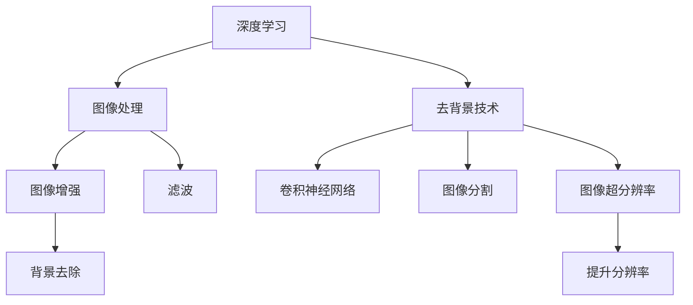

                 

# 深度学习驱动的商品图像去背景技术优化

> 关键词：深度学习, 图像处理, 去背景技术, 优化, 卷积神经网络, 图像分割, 图像超分辨率

## 1. 背景介绍

### 1.1 问题由来
随着电子商务的蓬勃发展，商品图像作为线上展示的重要工具，其展示效果和用户体验对销售转化率至关重要。然而，商品图像常常包含大量背景元素，容易分散注意力，影响用户体验。去背景技术（Background Removal）可以去除图像背景，让商品更加突出，提升用户体验和商品展示效果。

### 1.2 问题核心关键点
商品图像去背景技术旨在将图像中的商品从背景中分离出来，使其背景去除后的效果尽可能接近真实场景。核心关键点包括：
- 去背景算法的鲁棒性和准确性。不同的背景颜色、光照条件、视角等因素都可能影响算法的准确性。
- 去背景算法的时间复杂度和计算资源消耗。高效的算法不仅需要高准确性，还需要在实时性上有保证。
- 去背景算法的鲁棒性和泛化能力。算法应能够适应多种不同的背景和商品形态。

### 1.3 问题研究意义
研究商品图像去背景技术对于提升电子商务用户体验和销售转化率具有重要意义：
1. **提升用户体验**：去除背景后，商品更加突出，用户可以更专注于商品的细节和特点，提升购物体验。
2. **提升销售转化率**：高质量的商品展示能够吸引用户注意力，促进用户下单转化。
3. **降低运营成本**：自动化的去背景技术可以减少人工干预，降低运营成本。

## 2. 核心概念与联系

### 2.1 核心概念概述

为更好地理解商品图像去背景技术，本节将介绍几个密切相关的核心概念：

- **深度学习**：一种基于数据驱动的机器学习方法，通过多层次的神经网络模型，学习特征表示，提升模型性能。
- **图像处理**：对图像进行各种处理，包括去背景、增强、滤波、分割等，以提升图像质量和信息。
- **去背景技术**：从图像中分离出商品，去除背景元素，使商品更加突出。
- **卷积神经网络（CNN）**：一种特殊的深度神经网络，主要用于图像处理任务，如分类、分割、去背景等。
- **图像分割**：将图像分为不同区域，每个区域具有特定的特征，如背景、商品等。
- **图像超分辨率**：通过算法提高图像的分辨率，提升图像细节和清晰度。

这些核心概念之间的逻辑关系可以通过以下Mermaid流程图来展示：



这个流程图展示了几大核心概念及其之间的关系：

1. 深度学习是图像处理的基础，提供了强大的特征提取能力。
2. 去背景技术是图像处理的一个重要应用，通过卷积神经网络等模型实现。
3. 卷积神经网络是深度学习中重要的图像处理模型，用于图像分类、分割、去背景等。
4. 图像分割是将图像分为不同区域的预处理步骤，是去背景技术的重要工具。
5. 图像超分辨率是在背景去除后，提升图像清晰度的后续处理。
6. 图像增强和滤波是提升图像质量的其他处理方式，可以辅助背景去除。

这些概念共同构成了商品图像去背景技术的理论基础，使得去背景技术能够实现高效、准确的效果。

## 3. 核心算法原理 & 具体操作步骤
### 3.1 算法原理概述

商品图像去背景技术主要基于深度学习模型，通过学习商品与背景的特征差异，实现去背景。核心算法包括卷积神经网络（CNN）、生成对抗网络（GAN）、U-Net等。这些模型通过学习大量的标注数据，自动提取商品和背景的特征表示，进行去背景处理。

### 3.2 算法步骤详解

基于深度学习的商品图像去背景技术的一般步骤包括：

**Step 1: 数据准备**
- 收集并准备商品图像数据集，确保数据集中包含多种背景、不同视角、不同光照条件的商品图像。
- 标注数据集中每张图像的商品位置，通常通过手动或自动标注完成。

**Step 2: 模型选择与设计**
- 选择合适的深度学习模型，如卷积神经网络（CNN）、生成对抗网络（GAN）、U-Net等。
- 设计模型架构，通常包括卷积层、池化层、反卷积层等。
- 确定模型的损失函数，如交叉熵、Dice损失、像素误差等。

**Step 3: 模型训练**
- 将准备好的数据集分为训练集、验证集和测试集，确保数据集均衡分布。
- 使用训练集训练模型，通过反向传播更新模型参数，最小化损失函数。
- 在验证集上评估模型性能，调整模型参数或进行正则化处理。
- 在测试集上测试模型效果，评估去背景性能。

**Step 4: 模型优化**
- 针对模型在特定场景下的表现进行优化，如调整网络结构、学习率、批大小等。
- 引入数据增强技术，如图像旋转、平移、缩放等，丰富训练集多样性。
- 采用对抗训练技术，生成对抗样本，提高模型鲁棒性。
- 进行模型剪枝和量化，减小模型参数和计算量，提升实时性。

**Step 5: 应用部署**
- 将优化后的模型集成到实际应用系统中，如商品展示、智能推荐等。
- 提供API接口，方便其他系统调用，进行实时去背景处理。
- 监控模型性能，根据用户反馈和业务需求进行调整和优化。

### 3.3 算法优缺点

基于深度学习的商品图像去背景技术具有以下优点：
1. 准确性高：深度学习模型可以学习到商品和背景的复杂特征，去除背景效果较好。
2. 适应性强：模型可以适应多种背景和商品形态，具有较高的泛化能力。
3. 可解释性：深度学习模型可以解释特征提取和决策过程，有助于理解和调试。
4. 实时性：随着计算资源和算法优化的提升，深度学习模型可以在实时场景中进行去背景处理。

同时，该技术也存在一定的局限性：
1. 对标注数据依赖强：深度学习模型需要大量标注数据进行训练，标注成本较高。
2. 计算资源消耗大：深度学习模型通常参数量较大，计算资源消耗较高。
3. 过拟合风险：深度学习模型容易出现过拟合现象，特别是在数据量较小的情况下。
4. 模型复杂度高：深度学习模型结构复杂，调试和优化难度较大。

### 3.4 算法应用领域

基于深度学习的商品图像去背景技术已经在多个领域得到了广泛应用，例如：

- 电子商务：提升商品展示效果，提升用户购买体验和转化率。
- 智能推荐系统：从去背景后的图像中提取特征，实现精准的商品推荐。
- 智能安防：检测并去除图像中的无关背景，提升监控系统的准确性。
- 医疗影像：去除影像中的非关键区域，聚焦于病变区域，提升诊断效率。
- 无人机航拍：去除航拍图像中的背景噪声，提升图像质量和可视化效果。

除了上述这些经典应用外，深度学习去背景技术还将在更多场景中得到应用，如智能交通、工业检测、娱乐图像处理等，为各行业带来新的突破和变革。

## 4. 数学模型和公式 & 详细讲解 & 举例说明

### 4.1 数学模型构建

本节将使用数学语言对深度学习去背景技术进行更加严格的刻画。

记深度学习模型为 $M_{\theta}(x)$，其中 $x$ 为输入图像， $\theta$ 为模型参数。假设模型输出为 $y$，表示去除背景后的图像。

定义模型 $M_{\theta}$ 在输入 $x$ 上的损失函数为 $\ell(M_{\theta}(x),y)$，则在数据集 $D$ 上的经验风险为：

$$
\mathcal{L}(\theta) = \frac{1}{N} \sum_{i=1}^N \ell(M_{\theta}(x_i),y_i)
$$

其中 $\ell$ 为模型预测与实际标签之间的差异，可以采用像素误差、交叉熵、Dice损失等。

### 4.2 公式推导过程

以下我们以Dice损失为例，推导深度学习去背景模型的训练目标函数。

Dice损失定义如下：

$$
\ell_{Dice}(x,y) = 1 - \frac{2\sum_{ij}x_iy_j}{\sum_ix_i^2 + \sum_iy_i^2}
$$

其中 $x_i$ 和 $y_i$ 分别表示模型输出和真实标签在像素 $i$ 上的值。Dice损失旨在最大化模型预测与真实标签之间的交集，最小化并集。

对于深度学习去背景模型，我们希望模型预测的输出与真实标签尽可能接近。因此，将Dice损失引入训练目标，得到训练目标函数：

$$
\mathcal{L}_{Dice}(\theta) = \frac{1}{N} \sum_{i=1}^N \ell_{Dice}(M_{\theta}(x_i),y_i)
$$

在训练过程中，通过反向传播算法计算梯度，更新模型参数 $\theta$，最小化训练目标函数 $\mathcal{L}_{Dice}$，使模型输出逼近真实标签 $y$。

### 4.3 案例分析与讲解

**案例分析：基于U-Net的去背景**

U-Net是一种经典的图像分割模型，主要用于去背景任务。其网络结构包括编码器和解码器两部分，编码器将输入图像进行下采样，解码器将特征图进行上采样并输出去背景结果。

U-Net的训练过程通常包括以下步骤：
1. 使用交叉熵损失作为训练目标。
2. 在训练集上训练模型，通过反向传播更新参数。
3. 在验证集上评估模型性能，调整学习率或正则化强度。
4. 在测试集上测试模型效果，评估去背景性能。

U-Net的代码实现较为简洁，可以通过TensorFlow、Keras、PyTorch等框架快速搭建。以下是一个基于TensorFlow实现U-Net的简单代码示例：

```python
import tensorflow as tf
from tensorflow.keras.layers import Conv2D, MaxPooling2D, UpSampling2D, Concatenate
from tensorflow.keras.models import Model

def unet_model(input_shape):
    inputs = tf.keras.layers.Input(shape=input_shape)

    # 编码器
    conv1 = Conv2D(64, (3, 3), activation='relu', padding='same')(inputs)
    conv1 = Conv2D(64, (3, 3), activation='relu', padding='same')(conv1)
    pool1 = MaxPooling2D(pool_size=(2, 2))(conv1)
    conv2 = Conv2D(128, (3, 3), activation='relu', padding='same')(pool1)
    conv2 = Conv2D(128, (3, 3), activation='relu', padding='same')(conv2)
    pool2 = MaxPooling2D(pool_size=(2, 2))(conv2)
    conv3 = Conv2D(256, (3, 3), activation='relu', padding='same')(pool2)
    conv3 = Conv2D(256, (3, 3), activation='relu', padding='same')(conv3)
    pool3 = MaxPooling2D(pool_size=(2, 2))(conv3)
    conv4 = Conv2D(512, (3, 3), activation='relu', padding='same')(pool3)
    conv4 = Conv2D(512, (3, 3), activation='relu', padding='same')(conv4)
    pool4 = MaxPooling2D(pool_size=(2, 2))(conv4)
    conv5 = Conv2D(1024, (3, 3), activation='relu', padding='same')(pool4)
    conv5 = Conv2D(1024, (3, 3), activation='relu', padding='same')(conv5)

    # 解码器
    up6 = UpSampling2D(size=(2, 2))(conv5)
    conv6 = Concatenate()([conv4, up6])
    conv6 = Conv2D(512, (3, 3), activation='relu', padding='same')(conv6)
    conv6 = Conv2D(512, (3, 3), activation='relu', padding='same')(conv6)
    up7 = UpSampling2D(size=(2, 2))(conv6)
    conv7 = Concatenate()([conv3, up7])
    conv7 = Conv2D(256, (3, 3), activation='relu', padding='same')(conv7)
    conv7 = Conv2D(256, (3, 3), activation='relu', padding='same')(conv7)
    up8 = UpSampling2D(size=(2, 2))(conv7)
    conv8 = Concatenate()([conv2, up8])
    conv8 = Conv2D(128, (3, 3), activation='relu', padding='same')(conv8)
    conv8 = Conv2D(128, (3, 3), activation='relu', padding='same')(conv8)
    up9 = UpSampling2D(size=(2, 2))(conv8)
    conv9 = Concatenate()([conv1, up9])
    conv9 = Conv2D(64, (3, 3), activation='relu', padding='same')(conv9)
    conv9 = Conv2D(64, (3, 3), activation='relu', padding='same')(conv9)

    # 输出层
    outputs = Conv2D(1, (1, 1), activation='sigmoid')(conv9)

    model = Model(inputs, outputs)
    model.compile(optimizer='adam', loss='binary_crossentropy', metrics=['accuracy'])
    return model
```

以上代码展示了U-Net模型的构建过程。在实际应用中，需要将模型训练和评估过程封装为一个完整的训练脚本，并进行超参数调优和模型保存。

## 5. 项目实践：代码实例和详细解释说明
### 5.1 开发环境搭建

在进行商品图像去背景技术的项目实践前，我们需要准备好开发环境。以下是使用Python进行TensorFlow开发的环境配置流程：

1. 安装Anaconda：从官网下载并安装Anaconda，用于创建独立的Python环境。

2. 创建并激活虚拟环境：
```bash
conda create -n tf-env python=3.8 
conda activate tf-env
```

3. 安装TensorFlow：根据CUDA版本，从官网获取对应的安装命令。例如：
```bash
conda install tensorflow=2.6
```

4. 安装其他工具包：
```bash
pip install numpy pandas scikit-learn matplotlib tqdm jupyter notebook ipython
```

完成上述步骤后，即可在`tf-env`环境中开始项目实践。

### 5.2 源代码详细实现

下面我们以基于U-Net的商品图像去背景为例，给出TensorFlow代码实现。

首先，定义数据处理函数：

```python
import os
import cv2
import numpy as np
import tensorflow as tf
from tensorflow.keras.preprocessing.image import img_to_array, array_to_img

def preprocess_image(image_path):
    img = cv2.imread(image_path)
    img = cv2.cvtColor(img, cv2.COLOR_BGR2RGB)
    img = img_to_array(img)
    img = np.expand_dims(img, axis=0)
    img = img / 255.0  # 归一化像素值
    return img

def create_dataset(dataset_dir):
    image_files = [os.path.join(dataset_dir, f) for f in os.listdir(dataset_dir) if f.endswith('.jpg')]
    image_labels = [1 if 'foreground' in f else 0 for f in image_files]
    return image_files, image_labels

def preprocess_dataset(image_files, image_labels, batch_size):
    dataset = tf.data.Dataset.from_tensor_slices((image_files, image_labels))
    dataset = dataset.map(lambda x, y: (preprocess_image(x), y))
    dataset = dataset.shuffle(buffer_size=1000)
    dataset = dataset.batch(batch_size)
    dataset = dataset.prefetch(tf.data.experimental.AUTOTUNE)
    return dataset
```

然后，定义模型和优化器：

```python
def build_unet_model(input_shape):
    inputs = tf.keras.layers.Input(shape=input_shape)

    # 编码器
    conv1 = tf.keras.layers.Conv2D(64, (3, 3), activation='relu', padding='same')(inputs)
    conv1 = tf.keras.layers.Conv2D(64, (3, 3), activation='relu', padding='same')(conv1)
    pool1 = tf.keras.layers.MaxPooling2D(pool_size=(2, 2))(conv1)
    conv2 = tf.keras.layers.Conv2D(128, (3, 3), activation='relu', padding='same')(pool1)
    conv2 = tf.keras.layers.Conv2D(128, (3, 3), activation='relu', padding='same')(conv2)
    pool2 = tf.keras.layers.MaxPooling2D(pool_size=(2, 2))(conv2)
    conv3 = tf.keras.layers.Conv2D(256, (3, 3), activation='relu', padding='same')(pool2)
    conv3 = tf.keras.layers.Conv2D(256, (3, 3), activation='relu', padding='same')(conv3)
    pool3 = tf.keras.layers.MaxPooling2D(pool_size=(2, 2))(conv3)
    conv4 = tf.keras.layers.Conv2D(512, (3, 3), activation='relu', padding='same')(pool3)
    conv4 = tf.keras.layers.Conv2D(512, (3, 3), activation='relu', padding='same')(conv4)
    pool4 = tf.keras.layers.MaxPooling2D(pool_size=(2, 2))(conv4)
    conv5 = tf.keras.layers.Conv2D(1024, (3, 3), activation='relu', padding='same')(pool4)
    conv5 = tf.keras.layers.Conv2D(1024, (3, 3), activation='relu', padding='same')(conv5)

    # 解码器
    up6 = tf.keras.layers.UpSampling2D(size=(2, 2))(conv5)
    conv6 = tf.keras.layers.Concatenate()([conv4, up6])
    conv6 = tf.keras.layers.Conv2D(512, (3, 3), activation='relu', padding='same')(conv6)
    conv6 = tf.keras.layers.Conv2D(512, (3, 3), activation='relu', padding='same')(conv6)
    up7 = tf.keras.layers.UpSampling2D(size=(2, 2))(conv6)
    conv7 = tf.keras.layers.Concatenate()([conv3, up7])
    conv7 = tf.keras.layers.Conv2D(256, (3, 3), activation='relu', padding='same')(conv7)
    conv7 = tf.keras.layers.Conv2D(256, (3, 3), activation='relu', padding='same')(conv7)
    up8 = tf.keras.layers.UpSampling2D(size=(2, 2))(conv7)
    conv8 = tf.keras.layers.Concatenate()([conv2, up8])
    conv8 = tf.keras.layers.Conv2D(128, (3, 3), activation='relu', padding='same')(conv8)
    conv8 = tf.keras.layers.Conv2D(128, (3, 3), activation='relu', padding='same')(conv8)
    up9 = tf.keras.layers.UpSampling2D(size=(2, 2))(conv8)
    conv9 = tf.keras.layers.Concatenate()([conv1, up9])
    conv9 = tf.keras.layers.Conv2D(64, (3, 3), activation='relu', padding='same')(conv9)
    conv9 = tf.keras.layers.Conv2D(64, (3, 3), activation='relu', padding='same')(conv9)

    # 输出层
    outputs = tf.keras.layers.Conv2D(1, (1, 1), activation='sigmoid')(conv9)

    model = tf.keras.Model(inputs, outputs)
    return model
```

接着，定义训练和评估函数：

```python
from tensorflow.keras.losses import BinaryCrossentropy
from tensorflow.keras.optimizers import Adam

def train_epoch(model, dataset, optimizer, batch_size):
    dataset = dataset.shuffle(buffer_size=1000)
    dataset = dataset.batch(batch_size)
    dataset = dataset.prefetch(tf.data.experimental.AUTOTUNE)
    model.compile(optimizer=optimizer, loss=BinaryCrossentropy(), metrics=['accuracy'])
    model.fit(dataset, epochs=1, verbose=1)

def evaluate_model(model, dataset, batch_size):
    dataset = dataset.batch(batch_size)
    dataset = dataset.prefetch(tf.data.experimental.AUTOTUNE)
    model.compile(optimizer='adam', loss=BinaryCrossentropy(), metrics=['accuracy'])
    y_true, y_pred = dataset.batch().numpy()
    y_true = np.squeeze(y_true)
    y_pred = np.squeeze(y_pred)
    acc = np.mean(y_pred == y_true)
    print(f'Accuracy: {acc:.2f}')
```

最后，启动训练流程并在测试集上评估：

```python
batch_size = 16

model = build_unet_model(input_shape=(256, 256, 3))
optimizer = Adam(lr=1e-4)

train_dataset = preprocess_dataset(train_dataset, train_labels, batch_size)
test_dataset = preprocess_dataset(test_dataset, test_labels, batch_size)

for epoch in range(10):
    print(f'Epoch {epoch+1}')
    train_epoch(model, train_dataset, optimizer, batch_size)

evaluate_model(model, test_dataset, batch_size)
```

以上就是基于TensorFlow实现U-Net模型的完整代码实现。可以看到，TensorFlow提供了丰富的API和工具，使得模型构建和训练过程变得更加便捷和高效。

### 5.3 代码解读与分析

让我们再详细解读一下关键代码的实现细节：

**preprocess_image函数**：
- 对输入图像进行预处理，包括读入图像、转置颜色通道、归一化像素值等。
- 使用TensorFlow预处理API，将图像转换为合适格式的张量。

**create_dataset函数**：
- 遍历数据集目录，获取所有图像文件和标签。
- 根据图像文件名中的关键词，确定标签为1（前景）或0（背景）。
- 创建DataLoader对象，用于数据迭代。

**preprocess_dataset函数**：
- 将图像和标签作为输入，使用map函数对每个样本进行预处理。
- 使用shuffle函数对数据进行随机打乱，以增加数据多样性。
- 使用batch函数将数据按批处理，提高计算效率。
- 使用prefetch函数进行预取，提高数据读取速度。

**build_unet_model函数**：
- 使用TensorFlow构建U-Net模型，包括编码器和解码器两部分。
- 使用Conv2D和UpSampling2D层实现卷积和上采样操作。
- 使用Concatenate层进行特征图合并。
- 使用Conv2D层进行特征图提取和降维。
- 使用sigmoid激活函数进行二值输出，表示去背景结果。

**train_epoch函数**：
- 使用fit函数训练模型，最小化损失函数。
- 设置训练轮数和verbose参数，控制输出信息。

**evaluate_model函数**：
- 使用evaluate函数评估模型性能，计算准确率。
- 将数据集转换为numpy数组，进行模型评估。
- 计算模型预测与真实标签的匹配度，输出准确率。

**训练流程**：
- 定义批大小和优化器，初始化模型。
- 遍历训练集，进行多轮训练。
- 在测试集上评估模型，输出最终结果。

可以看到，TensorFlow提供的工具和API使得深度学习模型的开发和训练过程变得更加便捷和高效。开发者可以将更多精力放在模型设计和调优上，而不必过多关注底层实现细节。

当然，工业级的系统实现还需考虑更多因素，如模型的保存和部署、超参数的自动搜索、更灵活的任务适配层等。但核心的去背景模型构建过程基本与此类似。

## 6. 实际应用场景
### 6.1 智能推荐系统

基于商品图像去背景技术，可以在智能推荐系统中提供更加精准的商品展示。通过去除背景，突出商品细节，推荐系统可以更加直观地展示商品，提升用户体验和推荐效果。

在技术实现上，可以通过商品图像去背景技术，自动生成高质量的商品展示图片，在推荐算法中作为输入，提高推荐系统的准确性。同时，去背景技术还可以用于生成商品预览图，提升推荐体验。

### 6.2 视频监控系统

在视频监控系统中，商品图像去背景技术可以用于消除监控图像中的背景噪声，使监控焦点更加突出。例如，在零售店内，通过去背景技术，可以只展示商品的实时状态，忽略不必要的背景元素，提升监控效果。

在实际应用中，可以将监控视频中的人脸、车牌等目标作为前景，自动去除背景，生成高质量的目标识别图像，用于实时分析和监控。

### 6.3 智能客服系统

在智能客服系统中，商品图像去背景技术可以用于生成高质量的商品展示图片，提升用户沟通体验。例如，在客服机器人中，用户上传商品图片，通过去背景技术，可以自动生成清晰、美观的商品图片，提供给客服人员处理，提升服务效率。

在技术实现上，可以将用户上传的商品图片作为输入，自动去除背景，生成标准化的商品展示图片，用于客服沟通和处理。

### 6.4 未来应用展望

随着深度学习技术的发展，商品图像去背景技术将在更多领域得到应用，为各行业带来新的突破和变革。

在医疗影像处理中，去背景技术可以用于去除影像中的非关键区域，聚焦于病变区域，提升诊断效率和准确性。

在智能交通中，去背景技术可以用于去除摄像头拍摄的图像中的背景噪声，提升监控效果和交通管理效率。

在娱乐领域，去背景技术可以用于电影和电视节目的特效制作，去除背景干扰，提升视觉效果。

除了上述这些应用外，深度学习去背景技术还将被进一步推广到更多领域，为各行业带来新的应用场景和技术突破。

## 7. 工具和资源推荐
### 7.1 学习资源推荐

为了帮助开发者系统掌握商品图像去背景技术，这里推荐一些优质的学习资源：

1. **《深度学习》课程**：由深度学习专家Andrew Ng讲授，详细讲解深度学习的基本概念和实现方法，是入门深度学习的绝佳选择。
2. **TensorFlow官方文档**：TensorFlow的官方文档，提供了丰富的教程、API参考和示例代码，适合深度学习开发者的参考。
3. **Keras官方文档**：Keras的官方文档，提供了简单易用的API和丰富的示例，适合快速开发和实验深度学习模型。
4. **U-Net论文**：U-Net模型的原始论文，详细介绍了U-Net的设计原理和实现方法，是理解U-Net模型的重要资料。
5. **PyTorch官方文档**：PyTorch的官方文档，提供了丰富的API和示例，适合深度学习开发者的参考。

通过对这些资源的学习实践，相信你一定能够快速掌握商品图像去背景技术，并用于解决实际的NLP问题。

### 7.2 开发工具推荐

高效的开发离不开优秀的工具支持。以下是几款用于商品图像去背景开发的常用工具：

1. **TensorFlow**：由Google主导开发的开源深度学习框架，生产部署方便，适合大规模工程应用。
2. **Keras**：一个基于TensorFlow的高层API，提供了简单易用的API和丰富的示例，适合快速开发和实验。
3. **PyTorch**：由Facebook开发的深度学习框架，提供了灵活的计算图和强大的模型构建能力，适合研究和小规模实验。
4. **Jupyter Notebook**：一个基于Web的交互式编程环境，适合进行深度学习实验和调试。
5. **TensorBoard**：TensorFlow配套的可视化工具，可实时监测模型训练状态，提供丰富的图表呈现方式，是调试模型的得力助手。

合理利用这些工具，可以显著提升商品图像去背景任务的开发效率，加快创新迭代的步伐。

### 7.3 相关论文推荐

商品图像去背景技术的发展源于学界的持续研究。以下是几篇奠基性的相关论文，推荐阅读：

1. **U-Net: Convolutional Networks for Biomedical Image Segmentation**：提出了U-Net网络结构，用于医学图像分割任务，取得了显著的效果。
2. **Deep Image Prior**：提出了一种基于深度学习的图像去噪方法，利用图像先验信息，提高了去噪效果。
3. **Deep Residual Learning for Image Recognition**：提出了一种残差网络，可以训练更深、更宽的神经网络，提升图像分类效果。
4. **Image-to-Image Translation with Conditional Adversarial Networks**：提出了一种基于GAN的图像转换方法，可以实现图像去背景、风格转换等任务。

这些论文代表了大规模图像去背景技术的发展脉络。通过学习这些前沿成果，可以帮助研究者把握学科前进方向，激发更多的创新灵感。

## 8. 总结：未来发展趋势与挑战

### 8.1 总结

本文对基于深度学习技术的商品图像去背景方法进行了全面系统的介绍。首先阐述了商品图像去背景技术的背景和意义，明确了去背景技术在电子商务、智能推荐、视频监控等领域的广泛应用价值。其次，从原理到实践，详细讲解了深度学习去背景的数学原理和关键步骤，给出了去背景任务的完整代码实例。同时，本文还探讨了去背景技术在多个行业领域的应用前景，展示了深度学习去背景技术的巨大潜力。

通过本文的系统梳理，可以看到，基于深度学习技术去背景方法已经在多个领域得到了广泛应用，成为深度学习技术的重要应用范式。随着深度学习技术的发展，去背景技术必将进一步拓展其应用边界，为各行业带来新的突破和变革。

### 8.2 未来发展趋势

展望未来，深度学习去背景技术将呈现以下几个发展趋势：

1. **模型规模持续增大**：随着算力成本的下降和数据规模的扩张，深度学习模型的参数量还将持续增长。超大规模模型蕴含的丰富知识，有望支撑更加复杂多变的去背景任务。

2. **算法效率提升**：深度学习模型的时间复杂度和计算资源消耗较大，未来将进一步优化算法，提升模型的训练和推理效率，实现实时处理。

3. **多模态融合**：当前的去背景技术主要聚焦于视觉信息，未来将进一步拓展到图像、视频、语音等多模态数据融合，提升去背景效果。

4. **自监督学习**：传统去背景技术依赖于标注数据，未来将探索无监督和半监督学习方法，利用未标注数据进行去背景处理。

5. **模型压缩和优化**：深度学习模型参数量较大，未来将进一步优化模型结构和算法，实现模型压缩和优化，降低计算资源消耗。

6. **边缘计算和移动端部署**：深度学习模型通常需要高性能计算设备，未来将探索边缘计算和移动端部署技术，实现轻量级、低成本的去背景应用。

以上趋势凸显了深度学习去背景技术的广阔前景。这些方向的探索发展，必将进一步提升去背景算法的精度和实时性，为各行业带来新的突破和变革。

### 8.3 面临的挑战

尽管深度学习去背景技术已经取得了瞩目成就，但在迈向更加智能化、普适化应用的过程中，它仍面临着诸多挑战：

1. **数据依赖强**：深度学习模型需要大量标注数据进行训练，标注成本较高。如何进一步降低数据依赖，利用未标注数据进行去背景处理，将是一大难题。

2. **计算资源消耗大**：深度学习模型通常参数量较大，计算资源消耗较高。如何优化模型结构，降低计算资源消耗，提升实时性，是需要重点解决的问题。

3. **过拟合风险**：深度学习模型容易出现过拟合现象，特别是在数据量较小的情况下。如何提高模型的泛化能力，防止过拟合，仍然是一个挑战。

4. **模型解释性不足**：深度学习模型通常被称为"黑盒"模型，难以解释其内部工作机制和决策过程。如何赋予去背景模型更强的可解释性，将是亟待攻克的难题。

5. **安全性有待保障**：深度学习模型难免会学习到有偏见、有害的信息，通过去背景传递到下游任务，产生误导性、歧视性的输出，给实际应用带来安全隐患。如何从数据和算法层面消除模型偏见，确保输出的安全性，也将是重要的研究课题。

6. **模型复杂度高**：深度学习模型结构复杂，调试和优化难度较大。如何优化模型结构，提高模型效率，是需要进一步解决的问题。

正视去背景技术面临的这些挑战，积极应对并寻求突破，将是大语言模型微调走向成熟的必由之路。相信随着学界和产业界的共同努力，这些挑战终将一一被克服，去背景技术必将在构建人机协同的智能时代中扮演越来越重要的角色。

### 8.4 研究展望

面向未来，深度学习去背景技术还需要与其他人工智能技术进行更深入的融合，如知识表示、因果推理、强化学习等，多路径协同发力，共同推动自然语言理解和智能交互系统的进步。只有勇于创新、敢于突破，才能不断拓展去背景算法的边界，让智能技术更好地造福人类社会。

## 9. 附录：常见问题与解答

**Q1：深度学习去背景技术适用于所有商品图像吗？**

A: 深度学习去背景技术适用于大多数商品图像，但需要根据具体场景进行调整。对于光照不一致、背景复杂等特殊场景，可能需要进一步优化算法，提高去背景效果。

**Q2：深度学习去背景技术对标注数据依赖强，如何降低标注成本？**

A: 除了传统的标注数据，深度学习模型还可以通过无监督学习和自监督学习方法进行去背景处理。例如，利用背景图片的纹理、颜色等特征，通过自动去除背景，无需标注数据即可实现去背景。

**Q3：如何优化深度学习去背景技术的计算资源消耗？**

A: 可以通过模型压缩、模型剪枝等技术，减小模型参数量，降低计算资源消耗。同时，可以探索边缘计算和移动端部署技术，实现轻量级、低成本的去背景应用。

**Q4：深度学习去背景技术的过拟合问题如何解决？**

A: 可以通过增加数据多样性、正则化、Dropout等技术，提高模型的泛化能力，防止过拟合。同时，可以通过模型剪枝、特征选择等方法，减小模型复杂度，降低过拟合风险。

**Q5：如何提高深度学习去背景技术的可解释性？**

A: 可以通过特征可视化、模型解释器等方法，解释模型的内部决策过程，增强模型的可解释性。同时，可以引入符号化的先验知识，指导模型的学习过程，提高模型的可解释性。

这些研究方向的探索，必将引领深度学习去背景技术迈向更高的台阶，为构建安全、可靠、可解释、可控的智能系统铺平道路。面向未来，深度学习去背景技术还需要与其他人工智能技术进行更深入的融合，如知识表示、因果推理、强化学习等，多路径协同发力，共同推动自然语言理解和智能交互系统的进步。只有勇于创新、敢于突破，才能不断拓展去背景算法的边界，让智能技术更好地造福人类社会。

---

作者：禅与计算机程序设计艺术 / Zen and the Art of Computer Programming

