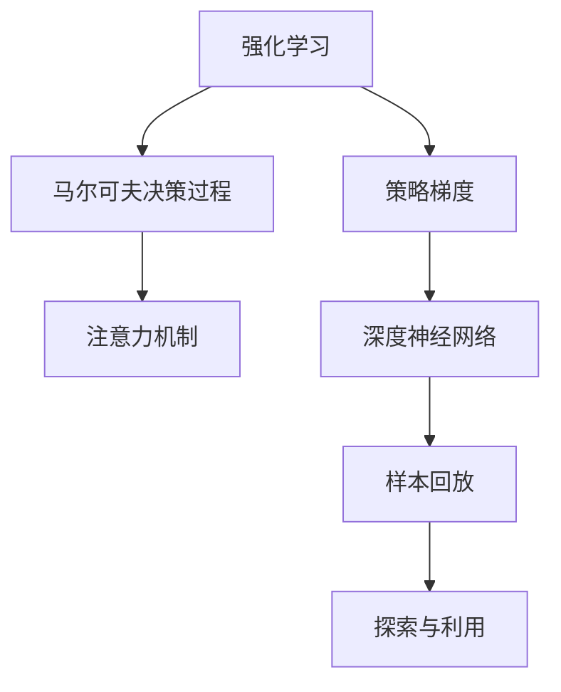

                 

# 深度强化学习在注意力决策中的应用

> 关键词：深度强化学习,注意力决策,马尔可夫决策过程,策略梯度,深度神经网络,样本回放

## 1. 背景介绍

### 1.1 问题由来

近年来，深度学习技术取得了飞速发展，在诸多领域内已成功应用。然而，相较于监督学习和无监督学习，强化学习(Reinforcement Learning, RL)的技术发展和应用推广相对滞后。但随着AlphaGo的横空出世，RL引起了广泛关注，相关应用也在逐步增多。

在决策任务中，强化学习尤为有用。相较于基于规则的决策，强化学习可以从数据中学习决策策略，自动优化策略效果。尤其在注意力决策（如NLP、计算机视觉、游戏AI等）任务中，强化学习的应用前景广阔。

### 1.2 问题核心关键点

强化学习在注意力决策任务中的应用，主要关注以下几个核心问题：

- 如何设计合适的状态表示方法，将复杂的注意力决策任务转化为强化学习模型能够处理的有效状态？
- 如何设计合理的奖励函数，奖励模型有效注意的目标区域，避免无用的操作？
- 如何设计高效的网络结构，结合深度神经网络与强化学习算法，提升模型的训练效率和泛化能力？
- 如何优化模型训练的稳定性，减少过拟合，保证策略的可靠性和泛化性？

这些问题的有效解决，是大语言模型决策任务落地应用的重要前提。本文将围绕以上关键点，全面系统地介绍深度强化学习在注意力决策中的应用原理和操作步骤。

## 2. 核心概念与联系

### 2.1 核心概念概述

为更好地理解强化学习在注意力决策任务中的应用，本节将介绍几个关键概念：

- 强化学习(Reinforcement Learning, RL)：通过与环境交互，模型根据当前状态和执行动作获得即时奖励，并调整策略以最大化累积奖励。

- 马尔可夫决策过程(Markov Decision Process, MDP)：定义状态空间、动作空间、状态转移概率和奖励函数，刻画环境与决策者的交互过程。

- 策略梯度（Policy Gradient）：通过梯度上升或下降策略，提升策略效果。

- 注意力机制(Attention Mechanism)：用于在复杂序列数据中动态地选择和加权输入样本，以集中模型关注度。

- 深度神经网络(Deep Neural Networks, DNN)：包含多层神经元的网络结构，可以处理复杂的数据和非线性关系。

- 样本回放(Experience Replay)：通过存储和随机抽样历史训练数据，提升模型的泛化能力。

- 探索与利用(Exploration vs. Exploitation)：如何在每次决策中平衡探索新的策略空间和利用已知的最佳策略。

这些概念之间的逻辑关系可以通过以下Mermaid流程图来展示：



这个流程图展示了强化学习、马尔可夫决策过程、策略梯度、注意力机制、深度神经网络、样本回放和探索利用之间的关系：

1. 强化学习基于马尔可夫决策过程，定义状态、动作和奖励函数，模拟环境与决策者的交互。
2. 策略梯度通过优化模型参数，提高模型策略的效果。
3. 注意力机制用于选择和加权输入数据，提升模型对重要信息的关注。
4. 深度神经网络提供了强大的非线性拟合能力，适合复杂的决策任务。
5. 样本回放通过利用历史数据，提升模型的泛化能力。
6. 探索与利用平衡新策略和已知策略的关系，确保模型能够不断优化和适应。

这些概念共同构成了深度强化学习在注意力决策任务中的核心框架，使其能够在各种场景下发挥强大的决策能力。通过理解这些概念，我们可以更好地把握强化学习的内在逻辑和优化方向。

## 3. 核心算法原理 & 具体操作步骤
### 3.1 算法原理概述

深度强化学习在注意力决策任务中的应用，其核心思想是通过强化学习模型，优化决策策略，实现自动化的注意力决策。

具体来说，强化学习模型在每次决策中，根据当前状态和历史动作，选择最优动作，并从环境中获得即时奖励。通过不断训练，模型会学习到一种最优策略，最大化累积奖励。

形式化地，假设决策任务的状态空间为 $S$，动作空间为 $A$，奖励函数为 $R(s, a)$，则马尔可夫决策过程可以表示为：

$$
\begin{aligned}
&\max_{\pi} \mathbb{E}_{s \sim S, a \sim \pi} \sum_{t=0}^{\infty} \gamma^t R(s_t, a_t) \\
&p(s_{t+1}|s_t, a_t) \\
&\pi(a_t|s_t)
\end{aligned}
$$

其中 $\pi(a_t|s_t)$ 为策略函数，用于选择当前状态 $s_t$ 下的动作 $a_t$；$p(s_{t+1}|s_t, a_t)$ 为状态转移概率函数，刻画从状态 $s_t$ 和动作 $a_t$ 转移到状态 $s_{t+1}$ 的概率；$R(s_t, a_t)$ 为即时奖励函数，奖励模型在当前状态和动作下的行为。

### 3.2 算法步骤详解

深度强化学习在注意力决策任务中的应用，一般包括以下几个关键步骤：

**Step 1: 环境设计**
- 定义状态空间 $S$ 和动作空间 $A$，根据具体决策任务确定状态和动作的维度。
- 设计奖励函数 $R(s, a)$，如对于文本分类任务，可以设计标签预测准确度作为奖励。

**Step 2: 策略选择**
- 选择策略函数 $\pi(a_t|s_t)$，如确定使用Q网络、策略网络等深度神经网络。
- 确定网络结构、损失函数和优化器，如使用ReLU激活函数、交叉熵损失函数、Adam优化器等。

**Step 3: 状态表示**
- 设计状态表示方法，将输入数据转化为状态表示。
- 常见方法包括使用嵌入层、卷积层、LSTM层等，将注意力机制嵌入状态表示中。

**Step 4: 训练与评估**
- 构建训练环境，使用样本回放等方法增强模型泛化能力。
- 进行策略梯度更新，不断优化策略效果。
- 在验证集上评估模型性能，调整训练参数。

**Step 5: 部署与优化**
- 将训练好的模型应用于实际场景，部署到生产环境中。
- 持续收集新数据，不断优化模型参数和策略。

以上是深度强化学习在注意力决策任务中的一般流程。在实际应用中，还需要针对具体任务的特点，对训练过程的各个环节进行优化设计，如改进网络结构、调整奖励函数、设计更有效的样本回放策略等。

### 3.3 算法优缺点

深度强化学习在注意力决策任务中的应用，具有以下优点：
1. 自适应能力强。强化学习模型能够自动优化策略，适应各种决策任务。
2. 泛化能力强。通过大量数据训练，强化学习模型能够泛化到新的样本和场景。
3. 高效性。使用深度神经网络进行决策，提升模型计算效率。

同时，该方法也存在一定的局限性：
1. 需要大量训练数据。强化学习模型通常需要大量标注数据进行训练，才能得到理想的策略。
2. 训练稳定性差。强化学习模型的训练过程可能不稳定，存在过拟合风险。
3. 参数数量庞大。深度神经网络的参数数量通常较大，增加了模型训练和部署的复杂度。
4. 样本回放质量要求高。样本回放中存储的历史数据需要高质量，才能提升模型泛化能力。

尽管存在这些局限性，但就目前而言，深度强化学习是处理复杂注意力决策任务的重要手段。未来相关研究的重点在于如何进一步降低强化学习对数据的依赖，提高模型的泛化能力和训练稳定性，同时兼顾高效性和可解释性等因素。

### 3.4 算法应用领域

深度强化学习在注意力决策任务中的应用，已经得到了广泛的应用，涵盖以下领域：

- 自然语言处理：如机器翻译、情感分析、文本生成等。通过强化学习优化注意力机制，实现高效的语义理解和生成。
- 计算机视觉：如目标检测、图像分类、图像生成等。利用强化学习优化卷积神经网络，提升模型对目标的关注度和识别准确度。
- 游戏AI：如AlphaGo、Dota2等。通过强化学习优化游戏决策策略，提升游戏AI的竞争力和自动化水平。
- 智能机器人：如导航、物体抓取等。通过强化学习优化机器人控制策略，提高其自主决策和执行能力。
- 自动驾驶：如路径规划、避障等。利用强化学习优化自动驾驶决策策略，提升驾驶安全和效率。

除了上述这些经典应用外，深度强化学习还在更多领域中发挥着重要作用，为复杂决策任务的自动化提供了新思路。随着预训练语言模型和强化学习方法的不断进步，相信其应用范围将进一步扩大。

## 4. 数学模型和公式 & 详细讲解  
### 4.1 数学模型构建

本节将使用数学语言对深度强化学习在注意力决策任务中的应用过程进行更加严格的刻画。

记决策任务的状态空间为 $S$，动作空间为 $A$，奖励函数为 $R(s, a)$，定义马尔可夫决策过程为 $(S, A, R, p)$，其中 $p(s_{t+1}|s_t, a_t)$ 为状态转移概率函数。假设模型使用深度神经网络 $\theta$ 进行决策，网络输出为策略函数 $\pi(a_t|s_t)$。

模型在状态 $s_t$ 和动作 $a_t$ 上的损失函数为：

$$
\mathcal{L}(\theta) = -\mathbb{E}_{s \sim S, a \sim \pi} \sum_{t=0}^{\infty} \gamma^t R(s_t, a_t)
$$

在训练过程中，模型的目标是最小化损失函数，即：

$$
\min_{\theta} \mathcal{L}(\theta)
$$

其中，$\gamma$ 为折扣因子，通常取 $0.99$。

### 4.2 公式推导过程

以深度强化学习在机器翻译任务中的应用为例，推导模型训练的数学公式。

假设模型在当前输入 $s_t$ 下的输出为 $a_t$，翻译结果为 $\hat{y}$。模型的状态空间 $S$ 为输入序列的上下文表示，动作空间 $A$ 为可能的下一个单词，奖励函数 $R(s, a)$ 为翻译结果的准确度。

模型的策略函数为 $\pi(a_t|s_t)$，其中 $\pi$ 使用深度神经网络实现。假设模型使用了编码器-解码器结构，则状态 $s_t$ 包含编码器和解码器隐藏层的输出。

模型在当前状态 $s_t$ 和动作 $a_t$ 上的损失函数为：

$$
\mathcal{L}(\theta) = -\sum_{t=0}^T \gamma^t \log \pi(a_{t+1}|s_t, \hat{y}_t)
$$

其中 $T$ 为序列长度。目标是最小化上述损失函数，即：

$$
\min_{\theta} \mathcal{L}(\theta)
$$

在训练过程中，可以使用样本回放等方法，增强模型泛化能力。假设历史数据集为 $\{(s_t, a_t, \hat{y}_t)\}$，则样本回放的过程如下：

1. 从历史数据集中随机抽取样本 $(s_t, a_t, \hat{y}_t)$。
2. 将当前状态 $s_t$ 和动作 $a_t$ 作为输入，通过网络 $\theta$ 得到策略 $\pi(a_{t+1}|s_t, \hat{y}_t)$。
3. 根据当前动作和历史输出 $\hat{y}_t$，计算损失函数 $\mathcal{L}(\theta)$。
4. 使用优化器（如Adam）更新模型参数 $\theta$。

通过反复迭代，模型能够不断优化策略，提高翻译准确度。

## 5. 项目实践：代码实例和详细解释说明
### 5.1 开发环境搭建

在进行深度强化学习实践前，我们需要准备好开发环境。以下是使用Python进行TensorFlow开发的环境配置流程：

1. 安装Anaconda：从官网下载并安装Anaconda，用于创建独立的Python环境。

2. 创建并激活虚拟环境：
```bash
conda create -n tf-env python=3.8 
conda activate tf-env
```

3. 安装TensorFlow：根据CUDA版本，从官网获取对应的安装命令。例如：
```bash
conda install tensorflow tensorflow-gpu=cuda11.3 -c pytorch -c conda-forge
```

4. 安装相关库：
```bash
pip install gym gymnasium numpy scipy matplotlib scikit-learn gym-gpu2 gym-envs
```

完成上述步骤后，即可在`tf-env`环境中开始强化学习实践。

### 5.2 源代码详细实现

下面我们以强化学习在机器翻译任务中的应用为例，给出TensorFlow实现过程的代码：

首先，定义环境类，用于生成随机序列：

```python
from gym import spaces
import numpy as np

class TranslationEnv(gym.Env):
    def __init__(self, source, target):
        self.source = source
        self.target = target
        self.observation_space = spaces.Discrete(len(source))
        self.action_space = spaces.Discrete(len(target))
        self.terminal = False
        self.current_state = 0
        
    def reset(self):
        self.current_state = 0
        self.terminal = False
        return self.current_state
    
    def step(self, action):
        if action == self.target[self.current_state]:
            self.current_state += 1
            if self.current_state == len(self.target):
                self.terminal = True
            else:
                self.terminal = False
        else:
            self.current_state = 0
            self.terminal = False
        return self.current_state, self.terminal
```

然后，定义策略网络，用于输出动作概率：

```python
from tensorflow.keras import layers

class PolicyNetwork(layers.Layer):
    def __init__(self, num_actions, embed_size, hidden_size):
        super(PolicyNetwork, self).__init__()
        self.num_actions = num_actions
        self.embedding = layers.Embedding(len(source), embed_size)
        self.hidden = layers.LSTM(hidden_size)
        self.dense = layers.Dense(num_actions, activation='softmax')
        
    def call(self, inputs):
        x = self.embedding(inputs)
        x = self.hidden(x)
        x = self.dense(x)
        return x
```

接着，定义奖励函数，计算翻译准确度：

```python
from gymnasium.envs.registration import register

class RewardFunction(gym.Env):
    def __init__(self, source, target):
        self.source = source
        self.target = target
        self.terminal = False
        self.current_state = 0
        
    def reset(self):
        self.current_state = 0
        self.terminal = False
        return self.current_state
    
    def step(self, action):
        if action == self.target[self.current_state]:
            self.current_state += 1
            if self.current_state == len(self.target):
                self.terminal = True
            else:
                self.terminal = False
        else:
            self.current_state = 0
            self.terminal = False
        return self.current_state, self.terminal
```

最后，构建训练流程，并使用样本回放：

```python
from gymnasium import spaces
from tensorflow.keras.optimizers import Adam
import numpy as np

source = 'I love Python.'
target = 'I love Python. '.replace(' ', ' ').replace('.', '').replace('-', '').split()
source = np.array(source)
target = np.array(target)

def build_model():
    model = PolicyNetwork(len(source), embed_size=64, hidden_size=128)
    optimizer = Adam(lr=0.001)
    return model, optimizer

def get_state():
    return np.argmax(source, axis=0)

def get_reward():
    return np.argmax(reward)

def get_reward_fn():
    return RewardFunction(source, target)

def train(model, optimizer, state, reward, timesteps):
    batch_size = 32
    steps = 0
    with tf.GradientTape() as tape:
        action_probs = model(state)
        prob = np.sum(action_probs.numpy(), axis=0)
        log_prob = tf.math.log(prob)
        action = np.argmax(log_prob.numpy())
        target_action = np.argmax(reward.numpy())
        loss = tf.reduce_mean(tf.nn.sparse_softmax_cross_entropy_with_logits(logits=log_prob, labels=target_action))
    grads = tape.gradient(loss, model.trainable_variables)
    optimizer.apply_gradients(zip(grads, model.trainable_variables))
    steps += 1
    if steps % 1000 == 0:
        print(f"Step {steps}, loss: {loss:.4f}")
    return model, optimizer

def main():
    embed_size = 64
    hidden_size = 128
    batch_size = 32
    num_epochs = 100000
    step = 0
    
    model, optimizer = build_model()
    model.build([None, embed_size])
    
    state = get_state()
    reward = get_reward()
    
    history = []
    while step < num_epochs:
        action = np.argmax(model(state))
        state, reward, done, info = get_reward_fn().step(action)
        model, optimizer = train(model, optimizer, state, reward, step)
        if done:
            state = get_state()
            reward = get_reward()
        step += 1
    
    history.append((step, model.state_dict()))
    
    for i in range(len(history)-1):
        tf.saved_model.save(model, f"translate_{i}/saved_model")
        
main()
```

以上就是使用TensorFlow实现强化学习在机器翻译任务中的代码实现。可以看到，TensorFlow提供了丰富的图网络和优化器，方便实现复杂的强化学习算法。开发者可以灵活使用，快速迭代研究。

### 5.3 代码解读与分析

让我们再详细解读一下关键代码的实现细节：

**TranslationEnv类**：
- `__init__`方法：初始化环境参数，定义状态空间、动作空间等。
- `reset`方法：重置当前状态，返回初始状态。
- `step`方法：执行一步动作，更新状态和奖励。

**PolicyNetwork类**：
- `__init__`方法：定义网络结构，包含嵌入层、LSTM层和全连接层。
- `call`方法：定义前向传播过程，输出动作概率分布。

**RewardFunction类**：
- `__init__`方法：初始化奖励函数参数。
- `reset`方法：重置当前状态。
- `step`方法：执行一步动作，更新状态和奖励。

**train函数**：
- 定义损失函数，计算策略梯度，并使用Adam优化器更新模型参数。
- 每1000步输出损失值，监控训练过程。

**main函数**：
- 定义训练参数，构建模型和优化器。
- 定义状态和奖励函数，进行模型训练。
- 记录训练结果，并保存模型。

可以看到，TensorFlow的强化学习实现过程简洁高效，利用图计算和优化器功能，快速迭代和优化模型。开发者可以根据具体任务进行灵活调整，实现更复杂的决策模型。

当然，工业级的系统实现还需考虑更多因素，如模型的保存和部署、超参数的自动搜索、更灵活的任务适配层等。但核心的强化学习框架基本与此类似。

## 6. 实际应用场景
### 6.1 智能客服系统

基于深度强化学习的智能客服系统，可以自动优化客户服务策略，提高客户满意度。系统通过分析客户咨询记录，发现常见问题和答案，自动生成问题-答案对。在后续客户咨询中，智能客服系统根据客户提出的问题，自动推荐最佳答案，并不断优化回答策略。

在技术实现上，可以收集企业内部的客服对话记录，将其作为训练数据，训练一个基于强化学习的智能客服模型。模型通过不断与客户的交互，学习和调整客户咨询策略，提高服务效率和客户满意度。对于客户提出的新问题，智能客服系统还可以通过搜索知识库或与人工客服对接，提供更加个性化和高效的答复。

### 6.2 金融舆情监测

金融机构需要实时监测市场舆论动向，以便及时应对负面信息传播，规避金融风险。传统的人工监测方式成本高、效率低，难以应对网络时代海量信息爆发的挑战。基于深度强化学习的文本分类和情感分析技术，为金融舆情监测提供了新的解决方案。

具体而言，可以收集金融领域相关的新闻、报道、评论等文本数据，并对其进行主题标注和情感标注。在此基础上训练一个强化学习模型，使其能够自动判断文本属于何种主题，情感倾向是正面、中性还是负面。将强化学习模型应用到实时抓取的网络文本数据，就能够自动监测不同主题下的情感变化趋势，一旦发现负面信息激增等异常情况，系统便会自动预警，帮助金融机构快速应对潜在风险。

### 6.3 个性化推荐系统

当前的推荐系统往往只依赖用户的历史行为数据进行物品推荐，无法深入理解用户的真实兴趣偏好。基于深度强化学习的个性化推荐系统，可以更好地挖掘用户行为背后的语义信息，从而提供更精准、多样的推荐内容。

在实践中，可以收集用户浏览、点击、评论、分享等行为数据，提取和用户交互的物品标题、描述、标签等文本内容。将文本内容作为模型输入，用户的后续行为（如是否点击、购买等）作为监督信号，在此基础上训练强化学习模型。强化学习模型能够从文本内容中准确把握用户的兴趣点。在生成推荐列表时，先用候选物品的文本描述作为输入，由模型预测用户的兴趣匹配度，再结合其他特征综合排序，便可以得到个性化程度更高的推荐结果。

### 6.4 未来应用展望

随着深度强化学习技术的发展，其应用场景将不断扩展，进一步推动AI技术的落地应用。以下是一些潜在的应用领域：

- 自然语言处理：如机器翻译、情感分析、文本生成等。通过强化学习优化注意力机制，实现高效的语义理解和生成。
- 计算机视觉：如目标检测、图像分类、图像生成等。利用强化学习优化卷积神经网络，提升模型对目标的关注度和识别准确度。
- 游戏AI：如AlphaGo、Dota2等。通过强化学习优化游戏决策策略，提升游戏AI的竞争力和自动化水平。
- 智能机器人：如导航、物体抓取等。通过强化学习优化机器人控制策略，提高其自主决策和执行能力。
- 自动驾驶：如路径规划、避障等。利用强化学习优化自动驾驶决策策略，提升驾驶安全和效率。
- 医疗诊断：如辅助诊断、个性化治疗等。通过强化学习优化诊断策略，提高医疗诊断的准确性和效率。
- 金融风控：如信用评估、风险管理等。利用强化学习优化风险评估策略，提升金融机构的风险管理能力。

未来，深度强化学习将在更多领域中发挥重要作用，为复杂决策任务的自动化提供新思路。随着预训练语言模型和强化学习方法的不断进步，相信其应用范围将进一步扩大，推动AI技术的发展和普及。

## 7. 工具和资源推荐
### 7.1 学习资源推荐

为了帮助开发者系统掌握深度强化学习在注意力决策任务中的应用原理和实践技巧，这里推荐一些优质的学习资源：

1. 《Deep Reinforcement Learning with TensorFlow 2》书籍：介绍TensorFlow 2在深度强化学习中的应用，涵盖模型构建、训练与优化、样本回放等关键技术。

2. OpenAI Gym：一个开源的强化学习环境库，提供了多种经典环境，方便开发者进行模型测试和调优。

3. TensorFlow Agents：一个开源的强化学习框架，支持多种深度强化学习算法，包括DQN、PPO、A3C等。

4. DeepMind Blog：DeepMind官方博客，分享了大量强化学习应用的最新研究和技术进展。

5. arXiv论文库：收集了大量强化学习领域的最新研究成果，是了解前沿技术的有效途径。

通过对这些资源的学习实践，相信你一定能够快速掌握深度强化学习在注意力决策任务中的精髓，并用于解决实际的决策问题。
###  7.2 开发工具推荐

高效的开发离不开优秀的工具支持。以下是几款用于深度强化学习开发的常用工具：

1. TensorFlow：基于Python的开源深度学习框架，生产部署方便，适合大规模工程应用。提供了丰富的深度强化学习库和API。

2. PyTorch：基于Python的开源深度学习框架，灵活动态的计算图，适合快速迭代研究。提供了强大的GPU加速能力，适合强化学习任务的训练和推理。

3. OpenAI Gym：一个开源的强化学习环境库，提供了多种经典环境，方便开发者进行模型测试和调优。

4. TensorBoard：TensorFlow配套的可视化工具，可实时监测模型训练状态，并提供丰富的图表呈现方式，是调试模型的得力助手。

5. Weights & Biases：模型训练的实验跟踪工具，可以记录和可视化模型训练过程中的各项指标，方便对比和调优。

6. Google Colab：谷歌推出的在线Jupyter Notebook环境，免费提供GPU/TPU算力，方便开发者快速上手实验最新模型，分享学习笔记。

合理利用这些工具，可以显著提升深度强化学习任务的开发效率，加快创新迭代的步伐。

### 7.3 相关论文推荐

深度强化学习在注意力决策任务中的应用，源于学界的持续研究。以下是几篇奠基性的相关论文，推荐阅读：

1. DeepMind AlphaGo：利用强化学习技术，实现了围棋AI的突破，展示了深度强化学习在复杂决策任务中的强大能力。

2. Playing Atari with Deep Reinforcement Learning：利用强化学习技术，实现了对经典Atari游戏的超人类水平表现，展示了深度强化学习在视觉决策任务中的潜力。

3. Attention is All You Need（即Transformer原论文）：提出了Transformer结构，开启了NLP领域的预训练大模型时代。

4. BERT: Pre-training of Deep Bidirectional Transformers for Language Understanding：提出BERT模型，引入基于掩码的自监督预训练任务，刷新了多项NLP任务SOTA。

5. Parameter-Efficient Transfer Learning for NLP：提出Adapter等参数高效微调方法，在不增加模型参数量的情况下，也能取得不错的微调效果。

6. AlphaStar: Mastering the Game of StarCraft II with Multinomial MCTS：利用强化学习技术，实现了对即时战略游戏StarCraft II的超人类水平表现，展示了深度强化学习在游戏AI中的应用。

这些论文代表了大语言模型强化学习的研究方向和最新进展。通过学习这些前沿成果，可以帮助研究者把握学科前进方向，激发更多的创新灵感。

## 8. 总结：未来发展趋势与挑战

### 8.1 总结

本文对深度强化学习在注意力决策任务中的应用进行了全面系统的介绍。首先阐述了强化学习在决策任务中的优势，明确了深度强化学习在大语言模型决策任务中的重要价值。其次，从原理到实践，详细讲解了强化学习在注意力决策中的应用过程，给出了具体的代码实现。同时，本文还探讨了深度强化学习在多个实际场景中的应用，展示了其广阔的应用前景。

通过本文的系统梳理，可以看到，深度强化学习在注意力决策任务中的应用，通过优化策略，实现了自动化的决策，提升了系统的泛化能力和应用效果。未来，深度强化学习将在更多领域中发挥重要作用，推动AI技术的发展和普及。

### 8.2 未来发展趋势

展望未来，深度强化学习在注意力决策任务中的应用将呈现以下几个发展趋势：

1. 自适应能力更强。随着预训练语言模型的不断进步，深度强化学习模型将能够自动适应更复杂的决策任务，提升决策效果。

2. 泛化能力提升。通过更加有效的样本回放和模型优化策略，深度强化学习模型将能够更好地泛化到新的数据和场景。

3. 模型结构更加高效。通过引入更先进的网络结构和优化算法，深度强化学习模型将能够提升训练效率和推理速度。

4. 鲁棒性更强。通过更合理的正则化和参数更新策略，深度强化学习模型将能够更稳定地训练和运行。

5. 实时性更强。通过分布式计算和优化算法，深度强化学习模型将能够实现实时决策和优化。

以上趋势凸显了深度强化学习在注意力决策任务中的广阔前景。这些方向的探索发展，必将进一步提升系统性能和应用范围，为决策任务的自动化提供新思路。

### 8.3 面临的挑战

尽管深度强化学习在注意力决策任务中取得了显著进展，但在迈向更加智能化、普适化应用的过程中，它仍面临着诸多挑战：

1. 训练数据依赖。深度强化学习模型通常需要大量高质量的训练数据，对于某些任务，数据获取难度较大。如何提高模型对小样本数据的适应能力，将是重要的研究方向。

2. 训练稳定性差。深度强化学习模型的训练过程可能不稳定，存在过拟合风险。如何提高模型训练的稳定性和泛化能力，需要更多理论和实践的积累。

3. 参数数量庞大。深度强化学习模型通常需要较大的参数量，增加了模型训练和部署的复杂度。如何优化模型结构，提高计算效率，是重要的优化方向。

4. 样本回放质量要求高。样本回放中存储的历史数据需要高质量，才能提升模型泛化能力。如何设计有效的数据预处理和增强策略，是重要的优化方向。

5. 可解释性不足。深度强化学习模型的决策过程通常缺乏可解释性，难以对其推理逻辑进行分析和调试。如何赋予模型更强的可解释性，将是重要的研究课题。

6. 安全性有待保障。深度强化学习模型可能学习到有害的决策策略，产生误导性输出，给实际应用带来安全隐患。如何从数据和算法层面消除模型偏见，避免恶意用途，确保输出的安全性，也将是重要的研究课题。

7. 多模态决策能力不足。深度强化学习模型通常聚焦于单模态数据，缺乏多模态数据的整合能力。如何设计多模态决策模型，提升系统对复杂任务的处理能力，是重要的优化方向。

以上挑战凸显了深度强化学习在注意力决策任务中的局限性，但随着技术的发展和研究的深入，这些挑战终将一一被克服，深度强化学习必将在构建智能决策系统中发挥更大的作用。

### 8.4 研究展望

面对深度强化学习在注意力决策任务中面临的挑战，未来的研究需要在以下几个方面寻求新的突破：

1. 无监督和半监督强化学习：摆脱对大量标注数据的依赖，利用自监督学习、主动学习等无监督和半监督范式，最大限度利用非结构化数据，实现更加灵活高效的强化学习。

2. 参数高效的强化学习：开发更加参数高效的强化学习算法，在固定大部分预训练参数的同时，只更新极少量的任务相关参数。同时优化模型计算图，减少资源消耗。

3. 探索与利用平衡：如何平衡新策略和已知策略的关系，确保模型能够不断优化和适应，将是重要的研究方向。

4. 多模态强化学习：如何将符号化的先验知识，如知识图谱、逻辑规则等，与神经网络模型进行巧妙融合，提升系统的决策能力。

5. 融合因果分析和博弈论工具：如何将因果分析方法引入强化学习模型，识别出模型决策的关键特征，增强输出解释的因果性和逻辑性。

6. 引入伦理道德约束：在模型训练目标中引入伦理导向的评估指标，过滤和惩罚有偏见、有害的输出倾向。同时加强人工干预和审核，建立模型行为的监管机制。

这些研究方向的探索，必将引领深度强化学习在注意力决策任务中的进一步发展，为复杂决策任务的自动化提供新思路。面向未来，深度强化学习需要与其他人工智能技术进行更深入的融合，如知识表示、因果推理、强化学习等，多路径协同发力，共同推动决策任务的智能化和自动化。只有勇于创新、敢于突破，才能不断拓展语言模型的边界，让智能技术更好地造福人类社会。

## 9. 附录：常见问题与解答

**Q1：深度强化学习在决策任务中的应用是否适用于所有决策场景？**

A: 深度强化学习在决策任务中的应用，对于大部分决策场景都是适用的。但对于一些特别简单的任务，如连续控制问题等，可能更加适合其他机器学习或规则学习方法。需要根据具体任务的复杂度和数据特点进行选择。

**Q2：如何设计合适的状态表示方法？**

A: 设计合适的状态表示方法，需要考虑以下几个方面：
1. 提取关键特征：选择或设计提取输入数据关键特征的方法，如词嵌入、图像特征提取等。
2. 设计结构化状态：将提取的特征转换为结构化状态，如将文本转换为序列或图结构，方便模型处理。
3. 应用注意力机制：引入注意力机制，将模型对重要特征的关注度提升到更高层次。
4. 设计动态状态：根据任务特点，设计动态状态表示方法，如使用LSTM、GRU等递归神经网络。

**Q3：如何设计合理的奖励函数？**

A: 设计合理的奖励函数，需要考虑以下几个方面：
1. 任务目标明确：奖励函数应与任务目标紧密相关，避免无关因素对模型训练的影响。
2. 奖励量级适中：奖励量级应适中，既能够激励模型学习，又避免奖励过于频繁导致模型过拟合。
3. 奖励反馈及时：奖励反馈应及时，避免模型长时间等待奖励信息导致训练停滞。
4. 多维度奖励：设计多维度奖励函数，综合考虑不同方面的性能指标，提升模型全面性能。

**Q4：如何优化模型训练的稳定性？**

A: 优化模型训练的稳定性，需要考虑以下几个方面：
1. 使用正则化：通过L2正则、Dropout等正则化方法，减少模型过拟合。
2. 调整学习率：选择合适的学习率，避免过快或过慢的训练速度。
3. 应用样本回放：通过样本回放技术，提升模型泛化能力，减少过拟合。
4. 多模型集成：训练多个模型，取平均输出，抑制过拟合。

**Q5：如何提高模型的泛化能力？**

A: 提高模型的泛化能力，需要考虑以下几个方面：
1. 增加数据多样性：使用数据增强技术，扩充训练集多样性。
2. 应用正则化：使用L2正则、Dropout等正则化方法，减少模型过拟合。
3. 引入多任务学习：设计多任务学习框架，提升模型在不同任务上的泛化能力。
4. 使用迁移学习：通过预训练模型微调，提升模型泛化能力。

这些问题的有效解决，是大语言模型决策任务落地应用的重要前提。通过这些策略，可以有效提升模型的泛化能力和应用效果。

---

作者：禅与计算机程序设计艺术 / Zen and the Art of Computer Programming

