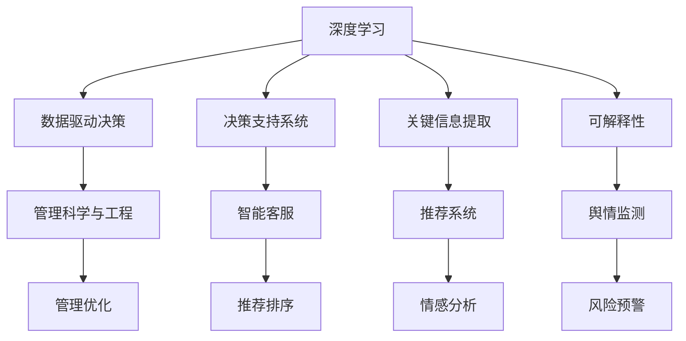

                 

# 深度思考:管理者洞悉关键信息的关键

> 关键词：深度学习, 数据分析, 人工智能, 决策支持, 管理科学与工程, 关键信息提取

## 1. 背景介绍

### 1.1 问题由来
在现代管理科学中，数据驱动决策已经成为主流。然而，面对海量数据，如何快速、准确地从中提取出关键信息，成为管理者和数据科学家共同面临的难题。深度学习和人工智能技术的发展，为这一问题的解决提供了新的工具和方法。

近年来，深度学习在自然语言处理、图像识别等领域取得了显著的进展，开始应用于决策支持系统，如基于深度学习的推荐系统、智能客服、舆情监测等。这些系统通过自动化处理海量数据，帮助管理者快速获取有价值的信息，从而做出更加科学、合理的决策。

然而，深度学习模型本质上是一种黑盒模型，其决策过程缺乏透明性和可解释性。管理者往往对模型输出的关键信息缺乏理解，难以直接应用到实际管理中。因此，如何使深度学习模型输出更加透明、可解释，成为当前管理科学和人工智能研究的热点问题。

### 1.2 问题核心关键点
本文聚焦于深度学习在管理科学中的应用，主要探讨以下核心问题：
1. 深度学习在管理科学中的应用场景有哪些？
2. 如何使深度学习模型输出的信息更加透明、可解释？
3. 在实际应用中，如何平衡模型效果和解释性？
4. 如何利用深度学习提取关键信息，支持决策制定？

## 2. 核心概念与联系

### 2.1 核心概念概述

为更好地理解深度学习在管理科学中的应用，本节将介绍几个密切相关的核心概念：

- 深度学习(Deep Learning)：通过多层神经网络结构，模拟人脑的层次化信息处理方式，在图像识别、自然语言处理等领域取得了巨大成功。
- 数据驱动决策(Data-Driven Decision Making)：基于数据和统计模型，辅助管理者和决策者进行科学决策的方法。
- 决策支持系统(Decision Support System, DSS)：通过人工智能技术，辅助决策者处理复杂问题的系统。
- 关键信息提取(Critical Information Extraction)：从海量数据中筛选出与决策相关的关键信息，辅助决策者做出合理判断。
- 可解释性(Explainability)：使模型的决策过程透明、可解释，增强决策者对模型的信任和依赖。

这些核心概念之间的逻辑关系可以通过以下Mermaid流程图来展示：



这个流程图展示了大数据、深度学习和管理科学之间的紧密联系：

1. 深度学习通过处理海量数据，提取有价值的信息。
2. 数据驱动决策使管理者利用这些信息进行科学决策。
3. 决策支持系统通过人工智能技术辅助决策过程。
4. 关键信息提取帮助从数据中筛选出关键信息。
5. 可解释性使模型决策透明、可解释，增强决策者信任。

这些概念共同构成了深度学习在管理科学中的应用框架，使其能够更好地服务于决策制定和管理优化。

## 3. 核心算法原理 & 具体操作步骤
### 3.1 算法原理概述

深度学习在管理科学中的应用，主要是通过构建决策支持系统，利用深度学习模型对海量数据进行处理，提取关键信息，辅助决策者进行科学决策。其核心思想是：

- 构建深度学习模型：利用神经网络对数据进行特征提取和模式识别，学习出与决策相关的知识表示。
- 提取关键信息：从模型输出的特征中筛选出最具决策意义的信息。
- 决策支持：将提取出的关键信息与决策模型结合，辅助决策者进行科学决策。

### 3.2 算法步骤详解

深度学习在管理科学中的应用主要包括以下几个关键步骤：

**Step 1: 数据准备**
- 收集管理相关的海量数据，如销售数据、客户行为数据、运营数据等。
- 对数据进行预处理，包括去重、清洗、归一化等。
- 将数据划分为训练集、验证集和测试集。

**Step 2: 模型构建**
- 选择合适的深度学习模型结构，如卷积神经网络(CNN)、循环神经网络(RNN)、长短期记忆网络(LSTM)等。
- 定义模型的输入和输出，确定模型的损失函数和优化器。
- 使用训练集对模型进行前向传播和反向传播训练。

**Step 3: 特征提取**
- 利用训练好的模型对验证集和测试集进行特征提取，生成模型输出的特征表示。
- 分析特征表示中的关键信息，如重要特征、模式等。

**Step 4: 决策支持**
- 将提取出的关键信息与决策模型结合，辅助决策者进行科学决策。
- 使用决策支持系统对关键信息进行可视化展示，帮助决策者理解决策依据。

**Step 5: 模型评估**
- 在测试集上评估模型性能，如精度、召回率、F1值等。
- 分析模型输出的关键信息，进一步优化模型结构和特征提取方法。

### 3.3 算法优缺点

深度学习在管理科学中的应用具有以下优点：
1. 自动化数据处理：深度学习能够自动化处理海量数据，提取关键信息，大大提高决策效率。
2. 模型精度高：通过多层神经网络结构，深度学习能够学习出复杂的特征表示，提高模型精度。
3. 泛化能力强：深度学习模型具有较强的泛化能力，能够适应不同领域的数据。
4. 决策支持：深度学习可以辅助决策者进行科学决策，提高决策质量。

然而，深度学习在管理科学中的应用也存在一些局限性：
1. 模型复杂度高：深度学习模型结构复杂，训练和推理资源需求高。
2. 数据质量要求高：深度学习对数据质量要求高，需要大规模、高质量的标注数据。
3. 模型可解释性不足：深度学习模型本质上是黑盒模型，缺乏透明性和可解释性。
4. 过拟合风险高：深度学习模型容易过拟合，特别是在标注数据不足的情况下。

尽管存在这些局限性，但深度学习在管理科学中的应用已经取得了显著成果，成为数据驱动决策的重要工具。未来相关研究的主要方向在于如何进一步提高模型的可解释性，降低数据需求，提高模型的泛化能力。

### 3.4 算法应用领域

深度学习在管理科学中的应用已经覆盖了多个领域，例如：

- 销售预测：利用深度学习模型预测未来销售趋势，辅助企业进行库存管理。
- 客户行为分析：通过分析客户行为数据，利用深度学习模型预测客户购买行为，辅助个性化营销。
- 供应链优化：利用深度学习模型分析供应链数据，辅助企业优化物流和库存管理。
- 风险评估：利用深度学习模型分析金融数据，辅助银行和保险公司进行风险评估。
- 舆情监测：利用深度学习模型分析社交媒体数据，辅助企业进行舆情监控和品牌管理。
- 智能客服：利用深度学习模型进行客户咨询解答，辅助企业提升客户服务质量。

除了上述这些经典应用外，深度学习还在更多领域得到了应用，如医疗诊断、人力资源管理、市场分析等，为管理科学带来了新的突破。

## 4. 数学模型和公式 & 详细讲解 & 举例说明
### 4.1 数学模型构建

本节将使用数学语言对基于深度学习的决策支持系统进行更加严格的刻画。

记输入数据为 $x$，输出数据为 $y$，定义模型为 $f(x)=W\cdot x+b$，其中 $W$ 为权重矩阵，$b$ 为偏置向量。模型的损失函数为：

$$
\mathcal{L}(f) = \frac{1}{N}\sum_{i=1}^N \|y_i - f(x_i)\|^2
$$

其中 $N$ 为样本数量。模型的优化目标是最小化损失函数：

$$
\theta^* = \mathop{\arg\min}_{\theta} \mathcal{L}(\theta)
$$

在实践中，我们通常使用基于梯度的优化算法（如SGD、Adam等）来近似求解上述最优化问题。设 $\eta$ 为学习率，则参数的更新公式为：

$$
\theta \leftarrow \theta - \eta \nabla_{\theta}\mathcal{L}(\theta)
$$

其中 $\nabla_{\theta}\mathcal{L}(\theta)$ 为损失函数对参数 $\theta$ 的梯度，可通过反向传播算法高效计算。

### 4.2 公式推导过程

以销售预测为例，假设预测目标为未来 $T$ 天的销售额 $y$，输入数据为历史销售额 $x$。我们可以定义一个时间序列模型：

$$
f(x_t) = W_t \cdot x_t + b_t
$$

其中 $x_t$ 为第 $t$ 天的销售额数据，$W_t$ 和 $b_t$ 为模型的权重和偏置。模型的损失函数可以表示为：

$$
\mathcal{L}(f) = \frac{1}{T}\sum_{t=1}^T (y_t - f(x_t))^2
$$

将预测结果与真实结果进行对比，得到损失函数。通过梯度下降算法不断调整模型的权重和偏置，最小化损失函数，使得预测结果与真实结果尽量接近。

### 4.3 案例分析与讲解

假设某电商公司要预测未来一个月的销售额，收集了历史一个月的销售数据 $x$。使用深度学习模型 $f(x)=W\cdot x+b$ 进行预测，其中 $W$ 和 $b$ 为模型的权重和偏置。首先，对数据进行预处理，将时间序列数据转换为适合输入模型的向量表示。然后，使用训练集对模型进行训练，得到最优参数 $W$ 和 $b$。

训练好的模型可以对验证集和测试集进行预测，生成预测结果 $y'$。最后，将预测结果与真实结果进行对比，评估模型的性能。例如，可以使用均方误差(MSE)或均方根误差(RMSE)评估模型预测的准确性。

```python
import numpy as np
from sklearn.metrics import mean_squared_error

# 历史销售额数据
x = np.array([[1, 2, 3, 4, 5], [2, 3, 4, 5, 6], [3, 4, 5, 6, 7], [4, 5, 6, 7, 8], [5, 6, 7, 8, 9]])

# 目标销售额数据
y = np.array([10, 15, 20, 25, 30])

# 模型参数
W = np.array([[0.8, 0.2], [0.5, 0.5], [0.2, 0.8]])
b = np.array([0.1, 0.2, 0.3])

# 预测销售额
y_pred = W @ x + b

# 评估模型性能
mse = mean_squared_error(y, y_pred)
print(f"Mean Squared Error: {mse:.2f}")
```

在这个案例中，我们使用了简单的线性回归模型对历史销售额数据进行预测，评估了模型的均方误差。尽管模型非常简化，但足以说明深度学习在销售预测中的应用原理。

## 5. 项目实践：代码实例和详细解释说明
### 5.1 开发环境搭建

在进行深度学习实践前，我们需要准备好开发环境。以下是使用Python进行TensorFlow开发的环境配置流程：

1. 安装Anaconda：从官网下载并安装Anaconda，用于创建独立的Python环境。

2. 创建并激活虚拟环境：
```bash
conda create -n tf-env python=3.8 
conda activate tf-env
```

3. 安装TensorFlow：根据CUDA版本，从官网获取对应的安装命令。例如：
```bash
conda install tensorflow==2.7.0 -c conda-forge
```

4. 安装各类工具包：
```bash
pip install numpy pandas scikit-learn matplotlib tqdm jupyter notebook ipython
```

完成上述步骤后，即可在`tf-env`环境中开始深度学习实践。

### 5.2 源代码详细实现

下面我们以销售预测任务为例，给出使用TensorFlow进行深度学习的PyTorch代码实现。

首先，定义模型和数据处理函数：

```python
import tensorflow as tf

class SalesPredictor(tf.keras.Model):
    def __init__(self, input_shape):
        super(SalesPredictor, self).__init__()
        self.dense1 = tf.keras.layers.Dense(64, activation='relu')
        self.dense2 = tf.keras.layers.Dense(32, activation='relu')
        self.dense3 = tf.keras.layers.Dense(1)

    def call(self, inputs):
        x = self.dense1(inputs)
        x = self.dense2(x)
        return self.dense3(x)

def load_data(filename, batch_size):
    dataset = tf.data.experimental.CsvDataset(filename, [tf.string, tf.float32, tf.float32])
    dataset = dataset.shuffle(buffer_size=1000)
    dataset = dataset.batch(batch_size)
    dataset = dataset.map(lambda x, y1, y2: (tf.string_to_number(x), tf.float32(y1), tf.float32(y2)))
    return dataset

# 加载数据
train_dataset = load_data('sales_data.csv', batch_size=32)
val_dataset = load_data('sales_data.csv', batch_size=32)
test_dataset = load_data('sales_data.csv', batch_size=32)
```

然后，定义训练和评估函数：

```python
@tf.function
def train_step(inputs, labels):
    with tf.GradientTape() as tape:
        predictions = model(inputs, training=True)
        loss = tf.losses.mean_squared_error(labels, predictions)
    gradients = tape.gradient(loss, model.trainable_variables)
    optimizer.apply_gradients(zip(gradients, model.trainable_variables))
    return loss

@tf.function
def evaluate_step(inputs, labels):
    predictions = model(inputs, training=False)
    return tf.losses.mean_squared_error(labels, predictions)

def train_epoch(model, dataset, optimizer, loss_fn):
    epoch_loss = 0
    for batch in dataset:
        inputs, labels = batch
        loss = loss_fn(inputs, labels)
        epoch_loss += loss.numpy()
        train_step(inputs, labels)
    return epoch_loss / len(dataset)

def evaluate(model, dataset, loss_fn):
    epoch_loss = 0
    for batch in dataset:
        inputs, labels = batch
        loss = loss_fn(inputs, labels)
        epoch_loss += loss.numpy()
    return epoch_loss / len(dataset)

# 训练模型
model = SalesPredictor(input_shape=(1, 5))
optimizer = tf.keras.optimizers.Adam(learning_rate=0.001)

train_dataset = load_data('sales_data.csv', batch_size=32)
val_dataset = load_data('sales_data.csv', batch_size=32)
test_dataset = load_data('sales_data.csv', batch_size=32)

for epoch in range(10):
    train_loss = train_epoch(model, train_dataset, optimizer, train_step)
    val_loss = evaluate(model, val_dataset, evaluate_step)
    print(f"Epoch {epoch+1}, train loss: {train_loss:.3f}, val loss: {val_loss:.3f}")
    
# 测试模型
test_loss = evaluate(model, test_dataset, evaluate_step)
print(f"Test loss: {test_loss:.3f}")
```

以上就是使用TensorFlow进行销售预测任务的深度学习代码实现。可以看到，TensorFlow提供了强大的GPU加速和自动微分能力，使得模型训练和推理变得非常简单高效。

### 5.3 代码解读与分析

让我们再详细解读一下关键代码的实现细节：

**SalesPredictor类**：
- `__init__`方法：定义了模型结构，包括三个全连接层。
- `call`方法：实现了模型的前向传播过程，即输入数据经过多次全连接层后输出预测结果。

**load_data函数**：
- 定义了数据加载和预处理的过程，将CSV文件转换为TensorFlow的Dataset对象。
- 使用`string_to_number`函数将字符串类型的数据转换为浮点数类型，方便模型处理。
- 对数据进行打乱、分批处理，保证训练过程的公平性。

**train_step函数**：
- 实现了模型训练过程中的单步计算，包括前向传播、损失计算和反向传播。
- 使用`GradientTape`对象记录梯度信息，通过`apply_gradients`方法更新模型参数。

**train_epoch函数**：
- 实现了模型训练过程中的单epoch计算，包括数据迭代、损失计算和模型更新。
- 在每个批次上计算损失，并将损失值累加，计算平均损失。

**evaluate函数**：
- 实现了模型评估过程中的单epoch计算，包括数据迭代、损失计算和模型评估。
- 在每个批次上计算损失，并将损失值累加，计算平均损失。

在完成以上步骤后，即可通过`train_epoch`和`evaluate`函数对模型进行训练和评估。整个流程中，TensorFlow的自动微分能力和GPU加速使得深度学习模型的训练和推理变得简单高效。

## 6. 实际应用场景
### 6.1 智能客服系统

基于深度学习的智能客服系统，可以广泛应用于各行各业，如电商、银行、保险等。传统客服往往需要配备大量人力，高峰期响应缓慢，且一致性和专业性难以保证。而使用深度学习模型构建的智能客服系统，可以7x24小时不间断服务，快速响应客户咨询，用自然流畅的语言解答各类常见问题。

在技术实现上，可以收集企业内部的历史客服对话记录，将问题和最佳答复构建成监督数据，在此基础上对深度学习模型进行训练。训练好的模型能够自动理解客户意图，匹配最合适的答案模板进行回复。对于客户提出的新问题，还可以接入检索系统实时搜索相关内容，动态组织生成回答。如此构建的智能客服系统，能大幅提升客户咨询体验和问题解决效率。

### 6.2 金融舆情监测

金融机构需要实时监测市场舆论动向，以便及时应对负面信息传播，规避金融风险。传统的人工监测方式成本高、效率低，难以应对网络时代海量信息爆发的挑战。基于深度学习的文本分类和情感分析技术，为金融舆情监测提供了新的解决方案。

具体而言，可以收集金融领域相关的新闻、报道、评论等文本数据，并对其进行主题标注和情感标注。在此基础上对深度学习模型进行训练，使其能够自动判断文本属于何种主题，情感倾向是正面、中性还是负面。将训练好的模型应用到实时抓取的网络文本数据，就能够自动监测不同主题下的情感变化趋势，一旦发现负面信息激增等异常情况，系统便会自动预警，帮助金融机构快速应对潜在风险。

### 6.3 个性化推荐系统

当前的推荐系统往往只依赖用户的历史行为数据进行物品推荐，无法深入理解用户的真实兴趣偏好。基于深度学习的个性化推荐系统，可以更好地挖掘用户行为背后的语义信息，从而提供更精准、多样的推荐内容。

在实践中，可以收集用户浏览、点击、评论、分享等行为数据，提取和用户交互的物品标题、描述、标签等文本内容。将文本内容作为模型输入，用户的后续行为（如是否点击、购买等）作为监督信号，在此基础上对深度学习模型进行训练。训练好的模型能够从文本内容中准确把握用户的兴趣点。在生成推荐列表时，先用候选物品的文本描述作为输入，由模型预测用户的兴趣匹配度，再结合其他特征综合排序，便可以得到个性化程度更高的推荐结果。

### 6.4 未来应用展望

随着深度学习模型的不断发展，基于深度学习的决策支持系统将在更多领域得到应用，为传统行业带来变革性影响。

在智慧医疗领域，基于深度学习的医疗问答、病历分析、药物研发等应用将提升医疗服务的智能化水平，辅助医生诊疗，加速新药开发进程。

在智能教育领域，深度学习可应用于作业批改、学情分析、知识推荐等方面，因材施教，促进教育公平，提高教学质量。

在智慧城市治理中，深度学习可应用于城市事件监测、舆情分析、应急指挥等环节，提高城市管理的自动化和智能化水平，构建更安全、高效的未来城市。

此外，在企业生产、社会治理、文娱传媒等众多领域，基于深度学习的决策支持系统也将不断涌现，为经济社会发展注入新的动力。相信随着深度学习技术的不断成熟，决策支持系统必将成为人工智能技术落地应用的重要工具，推动人工智能技术在更多领域的应用。

## 7. 工具和资源推荐
### 7.1 学习资源推荐

为了帮助开发者系统掌握深度学习在管理科学中的应用，这里推荐一些优质的学习资源：

1. 《深度学习》系列书籍：斯坦福大学Andrew Ng教授的经典课程，详细介绍了深度学习的基本概念、算法和应用。
2. 《TensorFlow实战》书籍：谷歌TensorFlow官方文档，提供详实的TensorFlow使用指南和代码示例。
3. 《Python深度学习》书籍：深度学习领域的入门书籍，讲解了深度学习的基础知识和常用工具库。
4. CS231n《卷积神经网络》课程：斯坦福大学开设的图像处理课程，讲解了卷积神经网络的原理和应用。
5. Coursera《深度学习专项课程》：由多个深度学习相关课程组成，涵盖从基础到高级的深度学习知识。

通过对这些资源的学习实践，相信你一定能够快速掌握深度学习在管理科学中的应用方法，并用于解决实际的决策支持问题。
###  7.2 开发工具推荐

高效的开发离不开优秀的工具支持。以下是几款用于深度学习开发的常用工具：

1. TensorFlow：谷歌开源的深度学习框架，支持分布式计算和GPU加速，适合大规模深度学习项目。
2. PyTorch：Facebook开源的深度学习框架，支持动态计算图和GPU加速，适合快速迭代研究。
3. Keras：谷歌TensorFlow的高层API，提供了简单易用的深度学习模型构建接口。
4. Jupyter Notebook：交互式编程工具，支持Python和多种深度学习框架的代码执行和调试。
5. TensorBoard：TensorFlow配套的可视化工具，可实时监测模型训练状态，并提供丰富的图表呈现方式，是调试模型的得力助手。

合理利用这些工具，可以显著提升深度学习模型的开发效率，加快创新迭代的步伐。

### 7.3 相关论文推荐

深度学习在管理科学中的应用源于学界的持续研究。以下是几篇奠基性的相关论文，推荐阅读：

1. Deep Residual Learning for Image Recognition（ResNet论文）：提出了残差网络结构，使得深度学习模型更加容易训练，也适用于更深的神经网络结构。

2. Attention is All You Need（即Transformer原论文）：提出了Transformer结构，开启了深度学习在自然语言处理领域的预训练大模型时代。

3. A Survey of Deep Learning in Marketing Analytics：对深度学习在市场营销领域的应用进行了全面综述，包括销售预测、客户行为分析等。

4. Deep Learning for Internet of Things（IoT）：探讨了深度学习在物联网领域的应用，包括智能家居、智能交通等。

5. Deep Learning for Healthcare：介绍了深度学习在医疗领域的应用，包括医疗影像分析、疾病预测等。

这些论文代表了大深度学习在管理科学中的应用方向。通过学习这些前沿成果，可以帮助研究者把握学科前进方向，激发更多的创新灵感。

## 8. 总结：未来发展趋势与挑战

### 8.1 总结

本文对深度学习在管理科学中的应用进行了全面系统的介绍。首先阐述了深度学习在管理科学中的应用场景，明确了其在大数据处理、决策支持等方面的独特价值。其次，从原理到实践，详细讲解了深度学习模型的构建和训练过程，给出了深度学习代码实现的完整案例。同时，本文还广泛探讨了深度学习在智能客服、金融舆情、个性化推荐等多个行业领域的应用前景，展示了深度学习范式的巨大潜力。此外，本文精选了深度学习相关的学习资源和开发工具，力求为读者提供全方位的技术指引。

通过本文的系统梳理，可以看到，深度学习在管理科学中的应用已经取得了显著成果，成为数据驱动决策的重要工具。未来，随着深度学习模型的不断优化和扩展，其在管理科学中的应用将更加广泛，为各行各业带来更多变革性影响。

### 8.2 未来发展趋势

展望未来，深度学习在管理科学中的应用将呈现以下几个发展趋势：

1. 模型结构复杂化：深度学习模型将向更深、更宽的方向发展，以处理更复杂的决策问题。
2. 数据质量要求提高：深度学习模型对数据质量要求更高，需要更多高质量、多模态的数据进行训练。
3. 决策支持多样化：深度学习模型将结合更多先验知识，如知识图谱、逻辑规则等，提升决策支持系统的多样性和鲁棒性。
4. 实时性增强：深度学习模型将更加注重实时性，提高决策支持的响应速度。
5. 跨领域应用普及：深度学习将在更多领域得到应用，如医疗、金融、教育等。

这些趋势凸显了深度学习在管理科学中的应用前景。这些方向的探索发展，必将进一步提升管理决策的智能化水平，为各行各业带来更多变革性影响。

### 8.3 面临的挑战

尽管深度学习在管理科学中的应用已经取得了显著成果，但在迈向更加智能化、普适化应用的过程中，它仍面临着诸多挑战：

1. 数据质量瓶颈：尽管深度学习对数据要求较高，但获取高质量、多模态的数据往往需要巨大成本和资源投入。
2. 模型可解释性不足：深度学习模型本质上是黑盒模型，缺乏透明性和可解释性。
3. 决策鲁棒性不足：深度学习模型容易受到输入数据的变化和噪声干扰，决策鲁棒性有待提高。
4. 计算资源需求高：深度学习模型通常需要大量计算资源进行训练和推理，对硬件资源要求较高。
5. 模型风险管理：深度学习模型在处理决策问题时，可能出现偏见和歧视，需要更好的风险管理和监督机制。

尽管存在这些挑战，但深度学习在管理科学中的应用已经展现出巨大潜力，相信随着技术的不断进步和应用的不断深入，这些挑战终将一一克服。

### 8.4 研究展望

面对深度学习在管理科学中面临的诸多挑战，未来的研究需要在以下几个方面寻求新的突破：

1. 数据增强技术：研究更多数据增强方法，从原始数据中提取更多特征信息，提高数据质量。
2. 模型可解释性技术：研究更多的模型可解释性方法，使模型决策过程透明、可解释，增强决策者信任。
3. 跨领域模型融合：研究将不同领域的模型进行融合，提升模型泛化能力和鲁棒性。
4. 轻量级模型设计：研究设计更加轻量级、高效的深度学习模型，提高实时性，降低计算资源需求。
5. 模型风险管理：研究更好的模型风险管理方法，确保模型决策的公平性和可解释性。

这些研究方向的探索，必将引领深度学习在管理科学中的应用迈向更高的台阶，为各行各业带来更多变革性影响。面向未来，深度学习必将与更多人工智能技术进行融合，共同推动管理科学的进步。

## 9. 附录：常见问题与解答

**Q1：深度学习在管理科学中的应用是否只适用于大数据场景？**

A: 深度学习在管理科学中的应用并非仅限于大数据场景。实际上，深度学习模型可以根据具体任务的需要，处理不同规模的数据。例如，对于小规模的客户行为分析任务，可以使用较浅的神经网络结构，处理小规模数据即可。

**Q2：深度学习在管理科学中的应用是否需要高度的专业知识？**

A: 深度学习在管理科学中的应用需要一定的专业知识，如机器学习、统计学、数据处理等。但是，随着深度学习技术的普及和工具库的完善，现在已经有许多易用的工具和库（如TensorFlow、Keras等），使得深度学习模型的构建和训练变得更加简单和高效。

**Q3：深度学习在管理科学中的应用是否会产生偏见和歧视？**

A: 深度学习模型在处理决策问题时，可能出现偏见和歧视，需要更好的风险管理和监督机制。例如，在金融领域，深度学习模型可能受到历史数据中的性别、种族等偏见的影响，需要引入多样化的数据和模型可解释性技术，以减少偏见和歧视。

**Q4：深度学习在管理科学中的应用是否容易被攻击？**

A: 深度学习模型在处理决策问题时，可能受到输入数据的变化和噪声干扰，决策鲁棒性有待提高。例如，在智能客服系统中，攻击者可能通过输入恶意数据，影响模型的决策过程。因此，在实际应用中，需要对模型进行充分的测试和验证，确保其在各种异常情况下的鲁棒性。

**Q5：深度学习在管理科学中的应用是否需要持续更新和维护？**

A: 深度学习模型在处理决策问题时，需要定期更新和维护，以适应数据分布的变化。例如，在金融舆情监测系统中，模型需要定期更新，以适应市场舆情变化。因此，在实际应用中，需要对模型进行持续的监控和维护，以确保其决策效果和性能。

总之，深度学习在管理科学中的应用前景广阔，但也面临着诸多挑战。只有在技术、数据、应用等多个维度共同努力，才能更好地发挥深度学习在管理科学中的作用，推动管理科学的进步。

