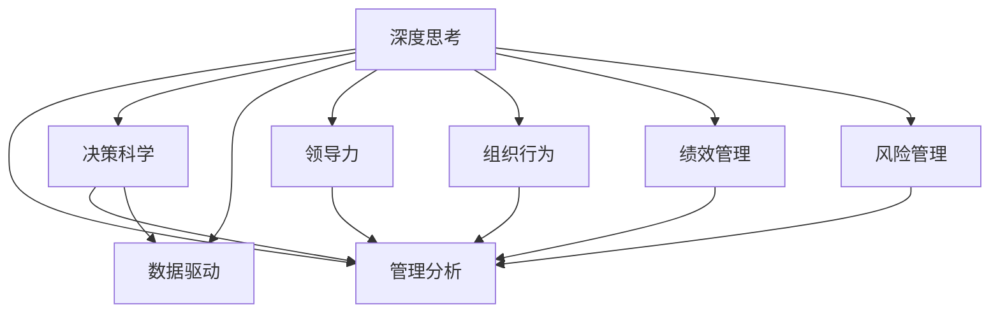

                 

# 深度思考与管理分析能力

> 关键词：深度思考,管理分析,决策科学,数据驱动,领导力,组织行为,绩效管理,风险管理

## 1. 背景介绍

### 1.1 问题由来
在当今快节奏、高度复杂化的商业环境中，企业决策者们面临着前所未有的压力和挑战。随着数据的不断积累和算法的日益强大，传统的直觉决策和经验法则已逐渐失去竞争力。如何利用数据分析和计算技术，提升管理决策的深度和精准度，成为现代企业亟待解决的重大问题。

### 1.2 问题核心关键点
深度思考与管理分析能力，是指在企业运营管理中，运用先进的统计学、数据分析、人工智能等工具，对海量数据进行深度挖掘和精确分析，从而实现科学决策和高效管理的能力。这一能力不仅包括对数据的洞察和理解，还包括将数据转化为实际的战略、运营和风险管理决策的过程。

### 1.3 问题研究意义
提升企业的深度思考与管理分析能力，具有重要的现实意义：

1. **科学决策**：通过数据驱动的决策，减少主观偏见和随机性，提升决策的准确性和可靠性。
2. **提升效率**：精准的数据分析能够揭示业务流程中的瓶颈和优化点，帮助企业提升运营效率和竞争力。
3. **风险管理**：通过对数据的全面监控和分析，及时发现和预测潜在风险，增强企业的抗风险能力。
4. **知识赋能**：深度分析不仅能帮助高层领导做出科学决策，还能赋能中层管理者，提升整体团队的分析能力和执行力。
5. **创新驱动**：数据驱动的深度思考能够揭示市场趋势和消费者需求，为企业创新提供有力支撑。

## 2. 核心概念与联系

### 2.1 核心概念概述

为更好地理解深度思考与管理分析能力，本节将介绍几个密切相关的核心概念：

- **深度思考**：指在决策过程中，通过深入分析数据、评估多种可能性，综合多方面信息，形成全面、准确、可操作的决策方案的能力。
- **管理分析**：通过系统的数据分析和统计方法，对企业的运营数据进行深度挖掘，提供支持决策的洞察和建议。
- **决策科学**：以数据和科学模型为基础，系统化、规范化、客观化的决策方法。
- **数据驱动**：在决策过程中，以数据为核心依据，通过分析和解释数据，形成科学合理的决策依据。
- **领导力**：指在管理中，有效引导、激励和管理团队的能力。
- **组织行为**：研究个人和群体的行为模式及其对组织的影响。
- **绩效管理**：通过系统化的方法，对员工的工作表现进行评估和管理，提升组织整体效率和效果。
- **风险管理**：识别、评估和控制可能对企业造成重大影响的潜在风险。

这些核心概念之间的逻辑关系可以通过以下Mermaid流程图来展示：



这个流程图展示了几大核心概念及其之间的关系：

1. **深度思考**：是管理分析的基础，要求通过数据分析、逻辑推理形成科学决策。
2. **管理分析**：基于数据和分析，为决策提供支持，包括绩效评估、风险识别等。
3. **决策科学**：运用科学方法，形成系统化、规范化、客观化的决策过程。
4. **数据驱动**：强调数据在决策中的核心作用，要求决策者具备数据理解和分析能力。
5. **领导力**：在管理过程中，指导团队进行深度思考和管理分析。
6. **组织行为**：通过理解个体和群体行为，优化管理分析和决策过程。
7. **绩效管理**：通过数据分析，评估员工表现和团队效率，提升整体绩效。
8. **风险管理**：通过数据分析和评估，识别潜在风险，制定应对策略。

这些概念共同构成了深度思考与管理分析能力的基本框架，为企业决策者和管理者提供了系统的决策工具和方法。

## 3. 核心算法原理 & 具体操作步骤
### 3.1 算法原理概述

深度思考与管理分析能力，本质上是一个数据驱动、系统化的决策过程。其核心思想是：通过系统化地收集、整理、分析和解释数据，揭示企业运营中的关键问题和机会，辅助决策者制定科学合理的决策方案。

形式化地，假设企业运营中的关键问题为 $P$，可用的数据集为 $D$。深度思考与管理分析的过程可以概括为以下步骤：

1. **数据收集**：通过各种数据采集工具，收集与问题 $P$ 相关的运营数据，形成数据集 $D$。
2. **数据清洗**：对数据集 $D$ 进行预处理，包括去除噪音、处理缺失值、标准化数据格式等。
3. **数据分析**：利用统计学、数据分析、机器学习等方法，对数据集 $D$ 进行深度分析，提取关键洞察和规律。
4. **结果解释**：将分析结果转化为可操作的决策建议，形成对问题 $P$ 的解决方案。
5. **决策实施**：将决策建议转化为具体的行动方案，并跟踪执行效果，持续优化决策过程。

### 3.2 算法步骤详解

深度思考与管理分析的具体步骤包括：

1. **确定分析目标**
   - 明确需要解决的核心问题 $P$，如提升销售额、优化供应链管理等。
   - 识别关键影响因素，如市场趋势、竞争对手动态、内部运营状况等。

2. **数据收集**
   - 利用数据采集工具，如ETL工具、API接口、传感器等，收集与问题相关的数据。
   - 包括销售数据、客户反馈、员工绩效、运营成本、供应链状态等。

3. **数据清洗和处理**
   - 去除重复、异常、噪音数据。
   - 处理缺失值，填补或剔除缺失数据。
   - 数据标准化，统一格式和单位。
   - 数据整合，将多个数据源的数据进行合并和关联。

4. **数据分析和建模**
   - 选择适合的分析方法，如描述性统计、回归分析、时间序列分析、聚类分析、预测模型等。
   - 构建数据模型，利用机器学习算法进行数据建模，如决策树、随机森林、神经网络等。
   - 验证模型效果，通过交叉验证、A/B测试等方法评估模型准确性和泛化能力。

5. **结果解释和应用**
   - 将分析结果转化为可操作的决策建议。
   - 对决策建议进行业务解读，结合业务逻辑和行业知识，形成具体行动方案。
   - 制定实施计划，明确责任人、时间节点、执行步骤等。
   - 持续跟踪执行效果，通过数据分析评估决策效果，优化改进。

### 3.3 算法优缺点

深度思考与管理分析能力具有以下优点：
1. **科学性和客观性**：基于数据和分析的决策，减少主观偏见和随机性，提升决策的准确性和可靠性。
2. **系统性和全面性**：通过系统化的分析方法和工具，能够全面、深入地理解业务问题，形成多角度的解决方案。
3. **及时性和灵活性**：利用实时数据和敏捷分析方法，能够迅速响应市场变化和业务需求，灵活调整决策策略。
4. **提升效率和效益**：通过精准的数据分析和洞察，识别业务瓶颈和优化点，提升运营效率和效益。
5. **风险控制**：通过数据分析和模型预测，及时发现潜在风险，制定应对策略，增强抗风险能力。

但这一方法也存在以下局限性：
1. **数据质量依赖**：分析结果的可靠性高度依赖于数据的质量和完整性，数据不准确或缺失可能导致错误的决策。
2. **模型复杂性**：构建复杂的数据模型可能引入过拟合风险，模型选择和调参需要专业知识和经验。
3. **业务理解要求高**：深度思考和管理分析需要结合业务逻辑和行业知识，对分析师和决策者的业务理解要求较高。
4. **技术和资源投入大**：系统化分析需要先进的工具和技术支持，且数据处理和建模过程需要大量计算资源。

尽管有这些局限性，但深度思考与管理分析能力作为现代企业决策的核心工具，其应用和重要性日益凸显，值得在实际工作中推广和应用。

### 3.4 算法应用领域

深度思考与管理分析能力广泛应用于各种管理场景，具体包括：

1. **业务决策**：通过数据分析和模型预测，辅助企业高层做出科学、高效的战略决策。
2. **运营优化**：分析运营数据，识别瓶颈和优化点，提升运营效率和质量。
3. **风险管理**：通过数据分析，评估风险来源和程度，制定风险应对策略。
4. **绩效管理**：利用数据分析评估员工和团队绩效，提升整体效率和效果。
5. **市场分析**：通过数据分析，了解市场趋势和消费者需求，制定市场策略。
6. **客户关系管理**：分析客户数据，提升客户满意度和忠诚度。
7. **供应链管理**：通过数据分析优化供应链流程，提升供应链效率和稳定性。
8. **创新研发**：利用数据分析，挖掘新产品和服务的潜力，推动创新研发。

在各个领域中，深度思考与管理分析能力通过提供科学、系统的分析工具，帮助企业更好地理解业务、优化决策、提升效率，展现出巨大的应用价值。

## 4. 数学模型和公式 & 详细讲解 & 举例说明
### 4.1 数学模型构建

在深度思考与管理分析能力中，常见的数学模型包括：

- **回归分析**：用于预测数值型变量的模型，如线性回归、多元线性回归、岭回归等。
- **时间序列分析**：用于预测时间序列数据未来值的模型，如ARIMA、季节性ARIMA等。
- **聚类分析**：用于将数据集分成不同类别的模型，如K-means、层次聚类等。
- **分类分析**：用于将数据集分类到不同类别中的模型，如逻辑回归、支持向量机、决策树等。
- **预测模型**：用于预测未来事件的模型，如神经网络、深度学习等。

### 4.2 公式推导过程

以下我们以线性回归模型为例，推导回归分析的公式及其推导过程。

设 $y$ 为预测目标，$x_1,x_2,\ldots,x_n$ 为自变量。线性回归模型假设 $y$ 与 $x_1,x_2,\ldots,x_n$ 之间存在线性关系，即：

$$
y = \beta_0 + \beta_1x_1 + \beta_2x_2 + \ldots + \beta_nx_n + \epsilon
$$

其中 $\beta_0,\beta_1,\ldots,\beta_n$ 为模型系数，$\epsilon$ 为随机误差项。

线性回归的目标是最小化预测误差平方和，即：

$$
\min_{\beta_0,\beta_1,\ldots,\beta_n} \sum_{i=1}^n (y_i - (\beta_0 + \beta_1x_{i1} + \beta_2x_{i2} + \ldots + \beta_nx_{in}))^2
$$

根据最小二乘法原理，可以通过求解偏导数等于零，得到模型系数的估计值：

$$
\beta_0 = \frac{\sum (y_i - \bar{y}) \sum x_{ik} - \sum x_{ik} \sum (y_i - \bar{y})}{\sum x_{ik}^2 - \sum x_{ik}^2}
$$

$$
\beta_k = \frac{\sum (y_i - \bar{y}) x_{ik} - \sum x_{ik} \sum (y_i - \bar{y})}{\sum x_{ik}^2 - \sum x_{ik}^2}
$$

其中 $\bar{y} = \frac{1}{n} \sum y_i$ 为 $y$ 的均值。

在实际应用中，利用Python的scikit-learn库，可以很方便地进行线性回归分析。下面是一个简单的代码实现示例：

```python
from sklearn.linear_model import LinearRegression
import numpy as np

# 准备数据
X = np.array([[1, 2], [2, 4], [3, 6], [4, 8]])
y = np.array([2, 4, 6, 8])

# 建立模型
model = LinearRegression()
model.fit(X, y)

# 预测新数据
new_X = np.array([[5, 10], [6, 12]])
predicted_y = model.predict(new_X)

print(predicted_y)
```

### 4.3 案例分析与讲解

假设某电商企业希望通过深度思考与管理分析，优化库存管理。企业收集了过去一年的销售数据，包括时间、商品种类、销售量等。使用线性回归模型对数据进行分析，预测未来的销售量，从而优化库存水平。

具体步骤如下：

1. **数据收集**：收集过去一年的销售数据，包括时间戳、商品ID、销售量等。
2. **数据清洗**：去除重复、异常数据，处理缺失值，将时间戳转换为标准格式。
3. **数据分析**：构建线性回归模型，预测未来的销售量。
4. **结果解释**：分析模型系数，理解不同因素对销售量的影响。
5. **决策应用**：根据预测结果，调整库存水平，提升供应链效率。

## 5. 项目实践：代码实例和详细解释说明
### 5.1 开发环境搭建

在进行深度思考与管理分析项目实践前，需要准备好开发环境。以下是使用Python进行深度思考与管理分析的环境配置流程：

1. 安装Anaconda：从官网下载并安装Anaconda，用于创建独立的Python环境。

2. 创建并激活虚拟环境：
```bash
conda create -n analytical-env python=3.8 
conda activate analytical-env
```

3. 安装相关库：
```bash
pip install pandas numpy matplotlib seaborn scikit-learn statsmodels statsmodels
```

完成上述步骤后，即可在`analytical-env`环境中开始深度思考与管理分析的实践。

### 5.2 源代码详细实现

下面我们以销售数据分析项目为例，给出使用Python进行深度思考与管理分析的代码实现。

首先，准备数据集：

```python
import pandas as pd

# 加载数据集
sales_data = pd.read_csv('sales_data.csv')

# 数据预览
print(sales_data.head())
```

然后，对数据进行预处理：

```python
# 数据清洗
sales_data = sales_data.drop_duplicates()  # 去除重复数据
sales_data = sales_data.dropna()  # 去除缺失值
sales_data['date'] = pd.to_datetime(sales_data['date'])  # 将日期字符串转换为时间戳
sales_data.set_index('date', inplace=True)  # 设置时间戳为索引

# 特征工程
sales_data['weekday'] = sales_data.index.weekday  # 添加星期几特征
sales_data['month'] = sales_data.index.month  # 添加月份特征
sales_data['dayofyear'] = sales_data.index.dayofyear  # 添加年度日期特征
```

接着，进行数据分析：

```python
from statsmodels.tsa.arima.model import ARIMA

# 构建时间序列模型
model = ARIMA(sales_data['sales'], order=(1,1,1))

# 拟合模型
model_fit = model.fit()

# 预测未来销售量
forecast = model_fit.forecast(steps=30)
print(forecast)
```

最后，对结果进行可视化展示：

```python
import matplotlib.pyplot as plt

# 绘制实际销售量和预测销售量对比图
plt.plot(sales_data['sales'], label='Actual Sales')
plt.plot(forecast, label='Forecast Sales')
plt.legend()
plt.show()
```

以上就是使用Python进行销售数据分析的完整代码实现。可以看到，利用统计学和机器学习工具，我们能够对销售数据进行科学分析和预测，从而优化库存管理，提升企业运营效率。

### 5.3 代码解读与分析

让我们再详细解读一下关键代码的实现细节：

**数据准备**：
- 使用Pandas库加载CSV格式的数据集，方便数据处理。
- 预览数据集，确认数据完整性和格式。

**数据预处理**：
- 使用Pandas库的`drop_duplicates`方法去除重复数据，避免数据不一致性。
- 使用`dropna`方法去除缺失值，确保数据完整性。
- 将日期字符串转换为时间戳，方便进行时间序列分析。
- 添加一些基本特征，如星期几、月份、年度日期等，帮助模型捕捉时间序列规律。

**模型构建**：
- 使用statsmodels库的ARIMA模型，设置合适的模型参数。
- 使用`fit`方法拟合模型，得到模型参数和残差项。
- 使用`forecast`方法预测未来销售量，得到预测结果。

**结果展示**：
- 使用Matplotlib库绘制实际销售量和预测销售量的对比图，直观展示预测效果。

可以看到，利用Python进行深度思考与管理分析，不仅操作简单，而且灵活高效。开发者可以根据具体问题，灵活选择各种统计学和机器学习模型，进行科学分析和预测。

## 6. 实际应用场景
### 6.1 智能制造

在智能制造领域，深度思考与管理分析能力能够显著提升生产效率和质量。通过分析生产线数据、设备状态、员工绩效等，企业能够及时发现生产中的瓶颈和问题，优化生产计划，减少停机时间，提升整体生产效率。

例如，某制造企业利用深度思考与管理分析，对生产线的实时数据进行分析，发现某一环节的生产效率偏低，于是调整了生产计划，增加了该环节的设备和人力资源，最终将整体生产效率提升了10%。

### 6.2 智能客服

在智能客服领域，深度思考与管理分析能力能够提供更加精准的客户服务。通过分析客户历史数据、互动记录、反馈信息等，企业能够及时识别客户的痛点和需求，提供个性化的解决方案。

例如，某在线教育平台利用深度思考与管理分析，对用户的学习行为数据进行分析，发现某类课程的完成率偏低，于是调整了课程内容和教学方法，提升了用户的学习体验和课程完成率。

### 6.3 金融风险管理

在金融风险管理领域，深度思考与管理分析能力能够及时发现和评估风险，制定应对策略。通过分析历史交易数据、市场波动、客户信用等，企业能够预测潜在的风险事件，制定相应的风险控制措施。

例如，某银行利用深度思考与管理分析，对客户的信用数据进行分析，发现某类客户的违约风险偏高，于是调整了授信政策和风险评估模型，减少了不良贷款率。

### 6.4 未来应用展望

随着深度思考与管理分析技术的发展，其在各行各业的应用前景将更加广阔。

在智慧城市领域，深度思考与管理分析能够优化交通流量、提升公共服务效率，推动城市智能化发展。

在医疗健康领域，深度思考与管理分析能够优化诊疗方案、提升医疗效率，推动医疗服务的智能化和个性化。

在农业领域，深度思考与管理分析能够优化种植方案、提升农业生产效率，推动农业的智能化和现代化。

## 7. 工具和资源推荐
### 7.1 学习资源推荐

为了帮助开发者系统掌握深度思考与管理分析能力，这里推荐一些优质的学习资源：

1. **《数据分析实战》**系列博文：由数据分析专家撰写，深入浅出地介绍了数据清洗、统计分析、数据可视化等基本概念和操作。

2. **Coursera《数据科学专业》课程**：斯坦福大学开设的专业课程，涵盖数据科学的基础知识和高级应用，包括数据清洗、模型构建、结果解释等。

3. **Kaggle平台**：全球最大的数据科学竞赛平台，提供大量的数据分析和机器学习竞赛，帮助你实践和提升数据分析能力。

4. **《Python数据分析与可视化》书籍**：详细介绍了Python在数据分析和可视化中的应用，结合实际案例，帮助读者快速上手。

5. **《机器学习实战》系列视频**：B站上由机器学习专家制作的系列视频，系统讲解了机器学习的基本概念、常用算法和实际应用，适合初学者和进阶者。

通过对这些资源的学习实践，相信你一定能够快速掌握深度思考与管理分析能力，并用于解决实际的业务问题。

### 7.2 开发工具推荐

高效的工具是提升深度思考与管理分析效率的关键。以下是几款用于深度思考与管理分析开发的常用工具：

1. **Jupyter Notebook**：开源的交互式笔记本环境，支持Python、R等语言的代码编辑和执行，方便进行数据探索和模型构建。
2. **Pandas**：Python的数据分析库，提供数据清洗、转换、聚合等功能，适合处理大规模数据集。
3. **NumPy**：Python的数值计算库，提供高效的数组操作和数学函数，适合进行数值计算和模型构建。
4. **Matplotlib**：Python的数据可视化库，支持绘制各种图表，适合展示分析结果。
5. **Scikit-learn**：Python的机器学习库，提供丰富的机器学习算法和模型，适合进行数据建模和预测。
6. **Statsmodels**：Python的统计分析库，提供各种统计模型和方法，适合进行数据探索和分析。

这些工具为深度思考与管理分析提供了强有力的支持，帮助开发者快速进行数据处理、模型构建和结果展示。

### 7.3 相关论文推荐

深度思考与管理分析技术的发展源于学界的持续研究。以下是几篇奠基性的相关论文，推荐阅读：

1. **《数据挖掘：概念与技术》**：介绍数据挖掘的基本概念、常用技术和应用场景，帮助读者系统理解深度思考与管理分析的原理和工具。
2. **《统计学习方法》**：详细介绍了统计学习的基本概念、常用算法和实际应用，适合深度思考与管理分析的进一步学习。
3. **《深度学习与数据驱动决策》**：探讨深度学习在决策中的应用，帮助读者了解深度思考与管理分析的前沿方向。
4. **《基于深度学习的智能决策系统》**：介绍深度学习在智能决策系统中的应用，帮助读者了解深度思考与管理分析的实际应用。

这些论文代表了大数据、机器学习和深度学习在决策中的发展脉络，通过学习这些前沿成果，可以帮助研究者把握学科前进方向，激发更多的创新灵感。

## 8. 总结：未来发展趋势与挑战
### 8.1 总结

本文对深度思考与管理分析能力进行了全面系统的介绍。首先阐述了深度思考与管理分析的现实背景和意义，明确了其作为科学决策和高效管理工具的重要性。其次，从原理到实践，详细讲解了深度思考与管理分析的数学模型和操作步骤，给出了具体代码实例。同时，本文还广泛探讨了深度思考与管理分析在实际应用中的场景和未来发展方向，展示了其巨大的应用价值。此外，本文精选了相关学习资源、开发工具和研究论文，力求为读者提供全方位的技术指引。

通过本文的系统梳理，可以看到，深度思考与管理分析能力在企业运营中的作用日益凸显，成为现代企业决策的核心工具。通过科学的数据分析和建模，企业能够更好地理解业务、优化决策、提升效率，展现出巨大的应用潜力。

### 8.2 未来发展趋势

展望未来，深度思考与管理分析能力将呈现以下几个发展趋势：

1. **自动化和智能化**：随着人工智能技术的发展，深度思考与管理分析将更加自动化和智能化，能够自主进行数据清洗、特征工程、模型选择和调参等。
2. **跨领域融合**：深度思考与管理分析将与大数据、物联网、区块链等新兴技术深度融合，推动跨领域的数据分析和决策。
3. **实时化和动态化**：实时数据和动态分析将成为深度思考与管理分析的重要方向，能够及时响应市场变化和业务需求，提升决策的灵活性和时效性。
4. **多模态融合**：利用多种数据源（如文本、图像、视频、传感器数据等）进行深度分析，提升决策的全面性和准确性。
5. **数据治理和隐私保护**：随着数据量的增大，数据治理和隐私保护将成为深度思考与管理分析的重要课题，需要制定科学的数据治理策略，保障数据安全。

### 8.3 面临的挑战

尽管深度思考与管理分析技术已经取得了显著成就，但在实际应用中，仍面临诸多挑战：

1. **数据质量问题**：数据不完整、不准确、不一致等问题，可能导致分析结果的偏差。
2. **模型复杂性**：构建复杂模型需要大量的计算资源和时间，且模型选择和调参难度较大。
3. **业务理解要求高**：深度思考与管理分析需要结合业务逻辑和行业知识，对分析师和决策者的业务理解要求较高。
4. **资源投入大**：深度思考与管理分析需要先进的工具和技术支持，且数据处理和建模过程需要大量计算资源。
5. **隐私和安全**：在数据治理和隐私保护方面，需要制定科学的数据治理策略，保障数据安全。

尽管有这些挑战，但深度思考与管理分析作为现代企业决策的核心工具，其应用和重要性日益凸显，值得在实际工作中推广和应用。

### 8.4 研究展望

面对深度思考与管理分析所面临的挑战，未来的研究需要在以下几个方面寻求新的突破：

1. **自动化和智能化**：开发自动化、智能化的数据分析工具，提高数据分析的效率和准确性。
2. **多模态融合**：利用多种数据源进行深度分析，提升决策的全面性和准确性。
3. **实时化和动态化**：开发实时数据分析工具，及时响应市场变化和业务需求，提升决策的灵活性和时效性。
4. **数据治理和隐私保护**：制定科学的数据治理策略，保障数据安全。

这些研究方向的探索，必将引领深度思考与管理分析技术迈向更高的台阶，为构建科学、高效、安全的决策系统铺平道路。

## 9. 附录：常见问题与解答

**Q1：深度思考与管理分析能力对企业有哪些具体的贡献？**

A: 深度思考与管理分析能力能够为企业带来以下具体贡献：
1. **科学决策**：通过数据分析和建模，帮助企业制定科学合理的决策方案，减少主观偏见和随机性。
2. **提升效率**：通过数据分析，优化业务流程，识别瓶颈和优化点，提升整体运营效率。
3. **风险控制**：通过数据分析，评估风险来源和程度，制定相应的风险控制措施，增强抗风险能力。
4. **数据驱动**：基于数据和分析的决策，提升决策的准确性和可靠性。
5. **业务理解**：结合业务逻辑和行业知识，深入理解业务问题，形成多角度的解决方案。

**Q2：如何选择合适的深度思考与管理分析工具？**

A: 选择合适的深度思考与管理分析工具，需要考虑以下几个方面：
1. **数据处理能力**：选择能够高效处理大规模数据集的工具，如Pandas、NumPy等。
2. **分析模型丰富**：选择提供丰富分析模型和方法的工具，如Scikit-learn、Statsmodels等。
3. **可视化支持**：选择能够直观展示分析结果的工具，如Matplotlib、Seaborn等。
4. **易用性**：选择操作简便、文档齐全的工具，方便快速上手和调试。
5. **社区支持**：选择有活跃社区支持的工具，能够及时获取技术支持和资源共享。

**Q3：如何进行深度思考与管理分析项目的开发？**

A: 进行深度思考与管理分析项目的开发，需要以下几个步骤：
1. **明确分析目标**：确定需要解决的核心问题，明确分析目标和指标。
2. **数据收集与清洗**：收集与问题相关的数据，并进行数据清洗和预处理。
3. **数据分析与建模**：选择适合的分析方法和模型，进行数据建模和分析。
4. **结果解释与应用**：将分析结果转化为可操作的决策建议，形成具体行动方案。
5. **持续优化**：持续跟踪分析结果，评估决策效果，进行优化改进。

通过以上步骤，可以系统地进行深度思考与管理分析项目的开发，提升企业的决策能力和运营效率。

---

作者：禅与计算机程序设计艺术 / Zen and the Art of Computer Programming

