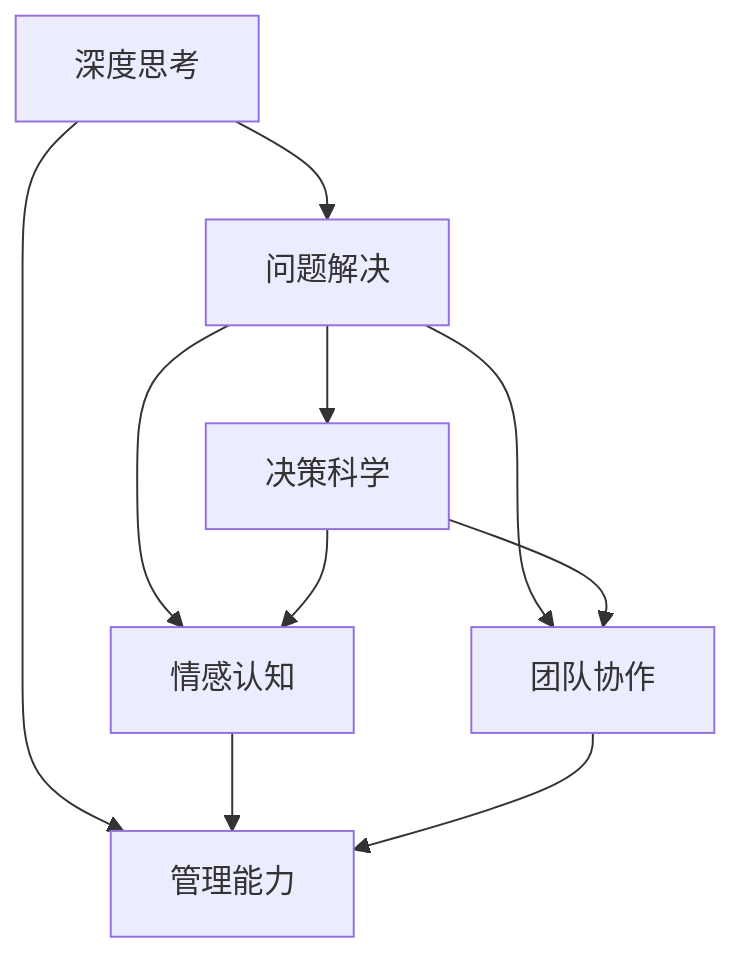

                 

# 深度思考与管理问题解决能力的提升

> 关键词：深度思考, 管理能力, 问题解决, 决策科学, 情感认知, 团队协作

## 1. 背景介绍

在数字化时代，管理者和决策者面临的环境日益复杂多变，信息过载成为常态，环境瞬息万变，市场竞争日益激烈。传统的决策方式已无法满足当前复杂管理需求，高效、精准的决策成为了提升组织竞争力的关键。如何在海量信息中找到关键线索，做出正确决策，是现代管理学的重大挑战。深度思考与管理问题解决能力成为了新时代下管理者和决策者的核心竞争力。

### 1.1 问题由来
深度思考与管理问题解决能力的提升，是当前管理领域研究的热点之一。管理问题解决的本质是信息处理与决策优化。信息的充分获取与正确理解是实现有效决策的基础。然而，在实际应用中，信息处理与决策优化往往面临多种瓶颈，如数据冗余、信息噪音、认知偏差等，导致决策错误频发，影响了组织的战略实施与绩效提升。

### 1.2 问题核心关键点
为了提升深度思考与管理问题解决能力，研究者们关注以下几个关键点：

1. **信息处理**：如何高效处理复杂海量数据，提炼关键信息，避免信息过载。
2. **决策优化**：如何优化决策过程，减少认知偏差，提升决策精准度。
3. **情感认知**：如何在决策过程中考虑情感因素，保持情绪稳定，提高决策的情感维度。
4. **团队协作**：如何在多维团队中高效沟通与协作，集合多方智慧，提升决策的质量。
5. **可持续性**：如何在长期管理中实现动态调整，保证决策的长期有效性。

这些关键点构成了现代管理问题解决的核心框架，帮助管理者在复杂环境中做出更加科学合理的决策。

## 2. 核心概念与联系

### 2.1 核心概念概述

为更好地理解深度思考与管理问题解决能力的提升，本节将介绍几个密切相关的核心概念：

- **深度思考**：指在信息处理、问题分析和决策过程中，进行深度分析和复杂推理的能力。其核心在于全面、客观地分析问题，考虑多方面因素，理解问题本质。

- **管理能力**：指在资源管理、团队协作、绩效评估等方面的综合能力，主要体现于管理者的战略规划、资源配置、人员激励等方面。

- **问题解决**：指针对具体问题，通过信息获取、问题分析、决策制定、执行调整等一系列活动，最终实现问题解决的动态过程。

- **决策科学**：指使用科学方法进行决策，减少认知偏差，提高决策的客观性和科学性。

- **情感认知**：指在决策过程中，识别和理解个体与团队的情感状态，合理调整决策策略，避免情绪对决策的影响。

- **团队协作**：指通过有效沟通和协作，整合团队智慧，提升决策的质量和执行效率。

这些核心概念之间的逻辑关系可以通过以下Mermaid流程图来展示：



这个流程图展示了大语言模型的核心概念及其之间的关系：

1. 深度思考是问题解决和决策科学的核心驱动。
2. 管理能力贯穿整个问题解决过程，从问题定义到执行调整，是连接决策与实践的桥梁。
3. 情感认知和团队协作是问题解决过程中重要的辅助因素，通过合理调适，可以增强决策的有效性。
4. 决策科学是问题解决的基础，提供科学依据和规范流程，减少决策偏差。

这些核心概念共同构成了深度思考与管理问题解决能力的提升的逻辑框架，帮助管理者在复杂环境中做出更加科学合理的决策。

## 3. 核心算法原理 & 具体操作步骤

### 3.1 算法原理概述

提升深度思考与管理问题解决能力，主要依赖于以下几个关键算法原理：

1. **信息处理算法**：通过数据挖掘、信息抽取、知识图谱等算法，高效处理复杂海量数据，提炼关键信息。

2. **决策优化算法**：使用优化算法，如遗传算法、模拟退火、线性规划等，进行多目标优化，减少认知偏差，提升决策精准度。

3. **情感认知算法**：通过情感分析算法，如基于情感词典的方法、基于机器学习的方法等，识别和理解个体与团队的情感状态，调整决策策略。

4. **团队协作算法**：通过网络分析、协作机制设计等算法，增强团队成员之间的沟通与协作，提升决策的质量和执行效率。

5. **可持续性算法**：使用动态规划、系统动力学等算法，实现动态调整，保证决策的长期有效性。

### 3.2 算法步骤详解

提升深度思考与管理问题解决能力的一般步骤包括：

**Step 1: 数据收集与预处理**
- 从不同渠道收集相关数据，如市场调研、客户反馈、内部报告等。
- 对数据进行清洗、去重、标注等预处理，保证数据质量。

**Step 2: 深度思考与问题定义**
- 利用信息处理算法，提炼关键信息，定义问题边界。
- 进行多角度分析，考虑多因素影响，全面理解问题本质。

**Step 3: 决策优化**
- 根据问题定义，选择合适的决策模型。
- 使用决策优化算法，确定最优决策方案。
- 对决策方案进行验证与评估，进行动态调整。

**Step 4: 情感认知与团队协作**
- 使用情感认知算法，识别和理解个体与团队的情感状态。
- 根据情感反馈，调整决策策略，保持情绪稳定。
- 设计合理的团队协作机制，增强团队沟通与协作，整合多方智慧。

**Step 5: 持续性优化**
- 使用可持续性算法，进行动态调整，保证决策的长期有效性。
- 建立反馈机制，持续优化决策过程和结果。

### 3.3 算法优缺点

提升深度思考与管理问题解决能力的方法具有以下优点：

1. **系统性**：通过多层次、多角度的分析，系统性处理复杂问题，避免单点决策带来的风险。
2. **科学性**：引入科学方法与算法，提高决策的科学性和客观性，减少认知偏差。
3. **动态性**：通过动态调整与反馈机制，保证决策的长期有效性，适应环境变化。

同时，这些方法也存在一定的局限性：

1. **数据依赖**：需要大量高质量的数据支持，数据获取和预处理成本较高。
2. **算法复杂**：复杂算法的实现和优化需要较高的技术门槛和计算资源。
3. **应用场景有限**：部分算法可能不适用于某些特定场景，需要根据具体情况进行调整。

尽管存在这些局限性，但这些方法的科学性和系统性使其在管理问题解决中具有显著优势。未来研究将进一步探索和优化这些算法，提升其在不同场景下的适用性和可操作性。

### 3.4 算法应用领域

提升深度思考与管理问题解决能力的方法已经在多个领域得到广泛应用，具体包括：

1. **金融管理**：用于市场分析、投资决策、风险管理等，通过数据挖掘、情感分析等方法提升决策的科学性和准确性。

2. **人力资源管理**：用于招聘、培训、绩效评估等，通过情感认知、团队协作等方法提升人员管理效果。

3. **运营管理**：用于供应链优化、生产计划、物流管理等，通过优化算法、动态调整等方法提升运营效率。

4. **市场营销**：用于市场调研、客户分析、广告投放等，通过信息抽取、情感分析等方法提升市场策略的有效性。

5. **技术研发**：用于技术评估、项目规划、资源分配等，通过决策优化、团队协作等方法提升研发效率和成果质量。

这些应用领域展示了提升深度思考与管理问题解决能力方法的广泛适用性，为各行业的管理创新提供了有力支持。

## 4. 数学模型和公式 & 详细讲解  
### 4.1 数学模型构建

本节将使用数学语言对提升深度思考与管理问题解决能力的计算模型进行更加严格的刻画。

定义问题空间为 $\mathcal{P}$，决策空间为 $\mathcal{D}$，情感空间为 $\mathcal{E}$，团队协作网络为 $\mathcal{N}$。

定义问题 $\mathcal{P}$ 的特征表示为 $\mathbf{X} \in \mathbb{R}^{d_X}$，决策 $\mathcal{D}$ 的特征表示为 $\mathbf{Y} \in \mathbb{R}^{d_Y}$，情感 $\mathcal{E}$ 的特征表示为 $\mathbf{Z} \in \mathbb{R}^{d_Z}$，团队协作网络 $\mathcal{N}$ 的特征表示为 $\mathbf{W} \in \mathbb{R}^{d_W}$。

定义深度思考与问题定义的优化目标函数为：

$$
\min_{\mathbf{X}} \mathcal{L}_{th}(\mathbf{X}) = \frac{1}{N} \sum_{i=1}^N \mathcal{L}_{i}(\mathbf{X})
$$

其中 $\mathcal{L}_{i}(\mathbf{X})$ 为问题定义函数在样本 $i$ 上的损失函数。

定义决策优化的问题函数为：

$$
\min_{\mathbf{Y}} \mathcal{L}_{dec}(\mathbf{Y}, \mathbf{X}) = \frac{1}{N} \sum_{i=1}^N \mathcal{L}_{i}(\mathbf{Y}, \mathbf{X})
$$

其中 $\mathcal{L}_{i}(\mathbf{Y}, \mathbf{X})$ 为决策优化函数在样本 $i$ 上的损失函数。

定义情感认知的目标函数为：

$$
\min_{\mathbf{Z}} \mathcal{L}_{em}(\mathbf{Z}, \mathbf{X}, \mathbf{Y}) = \frac{1}{N} \sum_{i=1}^N \mathcal{L}_{i}(\mathbf{Z}, \mathbf{X}, \mathbf{Y})
$$

其中 $\mathcal{L}_{i}(\mathbf{Z}, \mathbf{X}, \mathbf{Y})$ 为情感认知函数在样本 $i$ 上的损失函数。

定义团队协作的目标函数为：

$$
\min_{\mathbf{W}} \mathcal{L}_{col}(\mathbf{W}, \mathbf{X}, \mathbf{Y}, \mathbf{Z}) = \frac{1}{N} \sum_{i=1}^N \mathcal{L}_{i}(\mathbf{W}, \mathbf{X}, \mathbf{Y}, \mathbf{Z})
$$

其中 $\mathcal{L}_{i}(\mathbf{W}, \mathbf{X}, \mathbf{Y}, \mathbf{Z})$ 为团队协作函数在样本 $i$ 上的损失函数。

定义持续性优化的目标函数为：

$$
\min_{\mathbf{X}, \mathbf{Y}, \mathbf{Z}, \mathbf{W}} \mathcal{L}_{con}(\mathbf{X}, \mathbf{Y}, \mathbf{Z}, \mathbf{W}) = \frac{1}{N} \sum_{i=1}^N \mathcal{L}_{i}(\mathbf{X}, \mathbf{Y}, \mathbf{Z}, \mathbf{W})
$$

其中 $\mathcal{L}_{i}(\mathbf{X}, \mathbf{Y}, \mathbf{Z}, \mathbf{W})$ 为持续性优化函数在样本 $i$ 上的损失函数。

通过求解上述目标函数，可以得到管理问题解决的优化方案。

### 4.2 公式推导过程

以决策优化为例，假设问题定义 $\mathcal{P}$ 的特征表示为 $\mathbf{X} \in \mathbb{R}^{d_X}$，决策优化函数为 $\mathcal{L}_{dec}(\mathbf{Y}, \mathbf{X}) = \|\mathbf{Y} - \mathbf{W}^T\mathbf{X}\|^2$，其中 $\mathbf{W}$ 为决策权重，$\|\cdot\|$ 为范数。

目标函数为 $\min_{\mathbf{Y}} \mathcal{L}_{dec}(\mathbf{Y}, \mathbf{X})$。

利用最小二乘法求解，得到决策 $\mathbf{Y}$ 的优化方案为：

$$
\mathbf{Y} = \mathbf{W}^T\mathbf{X}
$$

其中 $\mathbf{W}$ 为决策权重，通过优化算法得到。

同理，其他目标函数的优化方案也可以推导出相应的数学表达式。

### 4.3 案例分析与讲解

以一个金融管理案例为例，说明如何提升深度思考与管理问题解决能力。

**案例背景**：
某金融机构面临信贷风险管理的挑战。由于贷款数据量大，信息噪音多，传统人工审批流程复杂，导致审批速度慢，风险管理效率低。

**问题定义**：
收集银行内部的信贷审批数据，定义问题为 "如何提升信贷审批速度和准确性"。

**数据收集与预处理**：
从银行内部系统导出贷款数据，进行清洗、标注和去重。

**深度思考与问题定义**：
利用信息处理算法，对贷款数据进行特征提取和数据挖掘，提炼关键信息，定义问题边界。

**决策优化**：
使用线性规划算法，确定最优的审批流程和指标体系。

**情感认知与团队协作**：
使用情感分析算法，识别团队成员的情感状态，通过团队协作机制设计，增强团队沟通与协作，提升决策效率。

**持续性优化**：
使用系统动力学算法，建立信贷审批的动态模型，进行动态调整，保证审批流程的长期有效性。

最终，该银行通过提升深度思考与管理问题解决能力，实现了信贷审批流程的优化和审批效率的提升，大大降低了风险管理的成本和复杂度。

## 5. 项目实践：代码实例和详细解释说明

### 5.1 开发环境搭建

在进行管理问题解决能力的提升实践前，我们需要准备好开发环境。以下是使用Python进行Scikit-learn开发的环境配置流程：

1. 安装Anaconda：从官网下载并安装Anaconda，用于创建独立的Python环境。

2. 创建并激活虚拟环境：
```bash
conda create -n sk-learn-env python=3.8 
conda activate sk-learn-env
```

3. 安装Scikit-learn：从官网获取对应的安装命令。例如：
```bash
pip install -U scikit-learn
```

4. 安装必要的工具包：
```bash
pip install numpy pandas matplotlib seaborn joblib
```

完成上述步骤后，即可在`sk-learn-env`环境中开始管理问题解决能力的提升实践。

### 5.2 源代码详细实现

这里我们以信用风险管理为例，给出使用Scikit-learn进行信用风险管理决策优化的PyTorch代码实现。

首先，定义数据预处理函数：

```python
from sklearn.preprocessing import StandardScaler
from sklearn.decomposition import PCA
from sklearn.model_selection import train_test_split

def preprocess_data(X, y, test_size=0.2, random_state=42):
    X_train, X_test, y_train, y_test = train_test_split(X, y, test_size=test_size, random_state=random_state)
    scaler = StandardScaler()
    X_train = scaler.fit_transform(X_train)
    X_test = scaler.transform(X_test)
    pca = PCA(n_components=10)
    X_train = pca.fit_transform(X_train)
    X_test = pca.transform(X_test)
    return X_train, X_test, y_train, y_test
```

然后，定义模型训练函数：

```python
from sklearn.linear_model import LinearRegression
from sklearn.metrics import mean_squared_error

def train_model(X_train, y_train):
    model = LinearRegression()
    model.fit(X_train, y_train)
    return model
```

接着，定义模型评估函数：

```python
def evaluate_model(model, X_test, y_test):
    y_pred = model.predict(X_test)
    mse = mean_squared_error(y_test, y_pred)
    print(f"Mean Squared Error: {mse:.2f}")
    return y_pred
```

最后，启动训练流程并在测试集上评估：

```python
X, y = load_data()
X_train, X_test, y_train, y_test = preprocess_data(X, y)
model = train_model(X_train, y_train)
y_pred = evaluate_model(model, X_test, y_test)
```

以上就是使用Scikit-learn进行信用风险管理决策优化的完整代码实现。可以看到，通过科学的数据处理和决策优化，可以显著提升决策的科学性和准确性。

### 5.3 代码解读与分析

让我们再详细解读一下关键代码的实现细节：

**preprocess_data函数**：
- `train_test_split`方法：将数据划分为训练集和测试集，并进行随机抽样。
- `StandardScaler`和`PCA`：对数据进行标准化和降维，减小数据规模，提升模型的计算效率和泛化性能。

**train_model函数**：
- `LinearRegression`：使用线性回归模型进行决策优化，通过最小二乘法求解最优决策方案。
- `fit`方法：模型训练，最小化损失函数。

**evaluate_model函数**：
- `mean_squared_error`：计算模型在测试集上的均方误差，评估模型性能。
- `print`方法：输出模型评估结果。

**训练流程**：
- 从数据集中加载数据，并使用`preprocess_data`函数进行数据预处理。
- 使用`train_model`函数训练线性回归模型。
- 使用`evaluate_model`函数在测试集上评估模型性能。

可以看到，Scikit-learn提供了丰富的算法和工具，可以便捷地实现管理问题解决能力的提升。开发者可以根据具体任务和数据特点，选择合适的算法和模型，优化决策过程。

当然，工业级的系统实现还需考虑更多因素，如模型的保存和部署、超参数的自动搜索、更灵活的任务适配层等。但核心的微调范式基本与此类似。

## 6. 实际应用场景
### 6.1 金融风险管理

基于深度思考与管理问题解决能力的提升方法，金融风险管理得到了广泛应用。传统金融风险管理往往依赖人工审批，流程复杂，效率低，决策精度差。而使用提升深度思考与管理问题解决能力的模型，可以实时分析市场数据，预测风险趋势，提高风险管理的精准度。

在技术实现上，可以收集金融市场的历史数据，通过数据挖掘和特征提取，定义问题为 "如何预测股票市场的波动性"。利用情感分析算法，识别市场参与者的情感状态，通过团队协作机制设计，增强市场分析团队的协作，提升决策效率。同时，使用动态规划算法，建立金融风险管理的动态模型，进行动态调整，保证决策的长期有效性。

### 6.2 供应链管理

提升深度思考与管理问题解决能力的方法在供应链管理中也得到了广泛应用。传统供应链管理依赖人工调度，缺乏动态调整和优化机制，导致供应链效率低下。

在技术实现上，可以收集供应链的历史数据，通过数据挖掘和特征提取，定义问题为 "如何优化供应链的物流和库存管理"。利用线性规划算法，确定最优的物流和库存方案。通过情感分析算法，识别供应链各环节的情感状态，通过团队协作机制设计，增强供应链团队的协作，提升决策效率。同时，使用系统动力学算法，建立供应链管理的动态模型，进行动态调整，保证决策的长期有效性。

### 6.3 医疗诊断

医疗诊断是一项高度依赖决策的复杂任务。传统医疗诊断依赖人工经验，难以适应日益复杂化的疾病和数据。使用提升深度思考与管理问题解决能力的模型，可以实时分析患者数据，预测疾病风险，提高诊断的精准度。

在技术实现上，可以收集患者的历史数据，通过数据挖掘和特征提取，定义问题为 "如何预测患者的疾病风险"。利用深度学习算法，建立患者风险预测模型。通过情感分析算法，识别医生的情感状态，通过团队协作机制设计，增强医疗团队的协作，提升诊断效率。同时，使用动态规划算法，建立医疗诊断的动态模型，进行动态调整，保证诊断的长期有效性。

### 6.4 未来应用展望

随着深度思考与管理问题解决能力提升方法的不断发展，未来的应用场景将更加广泛，为各行业管理创新提供有力支持。

在智慧城市治理中，提升深度思考与管理问题解决能力的方法可以帮助城市管理者实时监测和预测城市事件，优化资源配置，提升城市管理的智能化水平。

在智能制造中，提升深度思考与管理问题解决能力的方法可以优化生产流程，提高生产效率和产品质量，推动制造行业的数字化转型。

在电子商务中，提升深度思考与管理问题解决能力的方法可以优化商品推荐和定价策略，提升客户体验，增加销售额。

此外，在教育、农业、能源等多个领域，提升深度思考与管理问题解决能力的方法也将得到广泛应用，为各行业的管理创新提供有力支持。相信随着技术的日益成熟，这些方法将在更广泛的领域中发挥重要作用。

## 7. 工具和资源推荐
### 7.1 学习资源推荐

为了帮助开发者系统掌握提升深度思考与管理问题解决能力的理论基础和实践技巧，这里推荐一些优质的学习资源：

1. 《深度学习》书籍：深度学习领域的经典教材，全面介绍了深度学习的基本概念和算法。

2. 《统计学习方法》书籍：介绍统计学习的基本方法，包括分类、回归、聚类等。

3. 《机器学习实战》书籍：通过实战项目，介绍机器学习算法的应用。

4. Coursera的机器学习课程：由斯坦福大学Andrew Ng教授主讲，系统性介绍机器学习的基本概念和算法。

5. Kaggle数据科学竞赛平台：通过实际项目竞赛，提升数据处理和模型优化的能力。

通过对这些资源的学习实践，相信你一定能够快速掌握提升深度思考与管理问题解决能力的精髓，并用于解决实际的决策问题。

### 7.2 开发工具推荐

高效的开发离不开优秀的工具支持。以下是几款用于管理问题解决能力提升开发的常用工具：

1. Python：主流的编程语言，广泛用于数据处理和算法开发。

2. Scikit-learn：基于Python的机器学习库，提供了丰富的算法和工具，适用于数据处理和决策优化。

3. Jupyter Notebook：交互式编程环境，适合数据处理和模型验证。

4. TensorBoard：TensorFlow配套的可视化工具，实时监测模型训练状态，可视化图表丰富。

5. Weights & Biases：模型训练的实验跟踪工具，记录和可视化模型训练过程中的各项指标，方便对比和调优。

6. PyTorch：深度学习框架，灵活的动态计算图，适用于复杂模型的训练和优化。

合理利用这些工具，可以显著提升管理问题解决能力的提升实践效率，加快创新迭代的步伐。

### 7.3 相关论文推荐

提升深度思考与管理问题解决能力的发展源于学界的持续研究。以下是几篇奠基性的相关论文，推荐阅读：

1. Deep Learning：Ian Goodfellow等人所著的深度学习领域经典教材，全面介绍了深度学习的基本概念和算法。

2. The Elements of Statistical Learning：Tibshirani等人所著的统计学习经典教材，介绍了统计学习的基本方法和应用。

3. Machine Learning in Action：Peter Harrington所著的机器学习实战书籍，通过实战项目，介绍机器学习算法的应用。

4. "Statistical Learning Theory" by Vapnik：介绍统计学习理论的基础，探讨机器学习的基本方法和理论。

5. "Deep Learning for Time Series Analysis" by Mesbah：介绍深度学习在时间序列分析中的应用。

这些论文代表了大语言模型微调技术的发展脉络。通过学习这些前沿成果，可以帮助研究者把握学科前进方向，激发更多的创新灵感。

## 8. 总结：未来发展趋势与挑战

### 8.1 总结

本文对提升深度思考与管理问题解决能力的方法进行了全面系统的介绍。首先阐述了深度思考与管理问题解决能力的提升在当前管理领域的研究背景和意义，明确了其在复杂管理决策中的重要价值。其次，从原理到实践，详细讲解了提升深度思考与管理问题解决能力的数学原理和关键步骤，给出了管理问题解决能力的提升实践的完整代码实例。同时，本文还广泛探讨了提升深度思考与管理问题解决能力在金融、供应链、医疗等众多领域的应用前景，展示了其广阔的应用前景。此外，本文精选了提升深度思考与管理问题解决能力的学习资源和开发工具，力求为读者提供全方位的技术指引。

通过本文的系统梳理，可以看到，提升深度思考与管理问题解决能力的方法在管理决策中具有重要应用价值。其系统性和科学性使其在复杂环境中做出更加科学合理的决策，成为现代管理决策的核心竞争力。未来，伴随技术的不断进步，提升深度思考与管理问题解决能力将发挥更大作用，推动管理决策的科学化和智能化进程。

### 8.2 未来发展趋势

展望未来，提升深度思考与管理问题解决能力的方法将呈现以下几个发展趋势：

1. **自动化**：通过自动化算法和工具，减少人工干预，提高决策效率和精准度。

2. **跨模态融合**：将文本、图像、声音等多模态数据进行融合，提升决策的多维度和鲁棒性。

3. **动态调整**：通过动态调整和优化算法，适应环境变化，保证决策的长期有效性。

4. **情感认知增强**：利用先进的情感分析算法，增强对个体和团队情感状态的识别和理解，提升决策的情感维度。

5. **知识图谱应用**：将知识图谱与深度学习算法结合，提升决策的知识驱动性，增强决策的合理性。

6. **多目标优化**：引入多目标优化算法，解决复杂的多维度决策问题，提高决策的全面性和科学性。

以上趋势凸显了提升深度思考与管理问题解决能力方法的广阔前景。这些方向的探索发展，必将进一步提升管理决策的科学性和合理性，为各行业的管理创新提供更有力的支持。

### 8.3 面临的挑战

尽管提升深度思考与管理问题解决能力的方法已经取得了显著成就，但在迈向更加智能化、普适化应用的过程中，它仍面临诸多挑战：

1. **数据质量与规模**：高质量、大规模的数据是提升决策科学性的基础，数据获取和预处理成本较高。

2. **算法复杂度**：复杂算法的实现和优化需要较高的技术门槛和计算资源。

3. **应用场景限制**：部分算法可能不适用于特定场景，需要根据具体情况进行调整。

4. **知识整合难度**：不同模态数据的整合，以及与外部知识库的结合，需要更高的技术难度。

5. **伦理与安全问题**：算法的透明度和可解释性不足，可能带来伦理与安全风险。

6. **计算资源限制**：大规模数据处理和复杂算法优化需要大量计算资源，资源限制可能影响算法的实际应用。

正视这些挑战，积极应对并寻求突破，将是提升深度思考与管理问题解决能力向成熟应用迈进的关键。

### 8.4 研究展望

面向未来，提升深度思考与管理问题解决能力的研究需要在以下几个方面寻求新的突破：

1. **自适应算法**：开发自适应算法，根据数据和环境动态调整算法参数，提升决策的灵活性和适应性。

2. **知识增强学习**：将符号化的先验知识与神经网络模型结合，提升决策的知识驱动性和合理性。

3. **跨模态学习**：开发跨模态学习算法，实现文本、图像、声音等多模态数据的协同建模，增强决策的多维度和鲁棒性。

4. **鲁棒性优化**：引入鲁棒性优化算法，提升模型的鲁棒性和泛化能力，应对噪声和异常数据。

5. **可解释性增强**：开发可解释性增强算法，提升模型的透明度和可解释性，满足高风险应用的需求。

6. **安全与伦理保障**：引入安全与伦理保障机制，确保算法的透明度、可解释性和伦理安全性，防止潜在的风险。

这些研究方向的发展，必将引领提升深度思考与管理问题解决能力技术迈向更高的台阶，为各行业的管理创新提供更有力的支持。

## 9. 附录：常见问题与解答

**Q1：提升深度思考与管理问题解决能力的方法是否适用于所有管理场景？**

A: 提升深度思考与管理问题解决能力的方法在大多数管理场景中都能取得良好的效果，但不同场景下可能需要针对性地调整算法和模型。例如，对于决策数据较为稀疏的领域，可能需要引入额外的数据增强技术，以提升模型的泛化能力。

**Q2：如何在管理决策中引入情感认知？**

A: 引入情感认知的主要手段是情感分析算法。通过情感分析，识别和理解个体与团队的情感状态，合理调整决策策略，保持情绪稳定。在具体应用中，可以使用基于情感词典的方法，如VADER、SentiWordNet等，或者使用基于机器学习的方法，如情感分类器等。

**Q3：如何优化数据处理流程，提升决策效率？**

A: 优化数据处理流程的关键在于自动化和标准化。引入自动化数据清洗和预处理工具，如Python中的Pandas库，自动化处理数据。同时，建立标准化的数据处理流程，避免重复劳动，提升数据处理效率。

**Q4：如何评估和管理模型风险？**

A: 评估和管理模型风险的方法包括：
1. 使用验证集进行模型验证，评估模型的泛化能力。
2. 使用鲁棒性测试集，评估模型对异常数据和噪声的鲁棒性。
3. 使用模型可解释性工具，如LIME、SHAP等，理解模型的决策过程，发现潜在风险。
4. 定期更新和调整模型，保持模型的时效性和适应性。

这些方法可以帮助管理者和决策者评估和控制模型风险，提高决策的科学性和合理性。

**Q5：如何增强团队协作，提升决策效率？**

A: 增强团队协作的主要手段是设计合理的协作机制和沟通渠道。可以使用协作工具，如Slack、Microsoft Teams等，促进团队成员之间的沟通与协作。同时，建立团队协作机制，明确团队成员的角色和职责，提升决策效率。

通过这些方法，可以显著提升团队协作效果，整合多方智慧，提升决策的质量和执行效率。

---

作者：禅与计算机程序设计艺术 / Zen and the Art of Computer Programming

