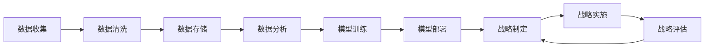

                 

# 深度思考在战略制定中的作用

> 关键词：战略制定, 深度学习, 数据分析, 决策支持系统, 不确定性分析, 人工智能, 商业智能

## 1. 背景介绍

### 1.1 问题由来

在当今快节奏、竞争激烈的商业环境中，企业需要不断地制定和调整战略，以适应市场变化和应对挑战。然而，传统的战略制定方法往往依赖经验、直觉和有限的定性分析，难以在复杂多变的环境中做出精确的决策。为了提升战略制定过程的科学性和系统性，企业开始寻求数据驱动、技术驱动的新方法，其中深度学习成为了一个强有力的工具。

### 1.2 问题核心关键点

深度学习在战略制定中的应用，主要体现在以下几个方面：

- **数据分析与挖掘**：通过大数据技术对历史和实时数据进行深度分析，挖掘出有价值的商业洞察和模式。
- **预测与模拟**：利用深度学习模型对未来市场趋势、消费者行为等进行预测，并进行情景模拟。
- **优化与优化**：基于历史数据和预测结果，通过优化算法确定最优的资源配置和行动策略。
- **自动化与智能化**：将深度学习模型嵌入到商业决策系统中，实现自动化决策和智能推荐。
- **动态调整与自适应**：深度学习模型能够实时更新和调整，适应市场和环境的变化。

### 1.3 问题研究意义

深度学习在战略制定中的应用，具有以下重要意义：

- **提升决策质量**：通过数据分析和深度学习，企业能够获得更加客观、精准的决策依据。
- **降低决策风险**：通过情景模拟和不确定性分析，企业能够预测潜在风险并提前应对。
- **增强战略灵活性**：深度学习模型的自适应能力，使得企业能够灵活调整战略以应对外部环境变化。
- **提高决策效率**：自动化和智能化的决策过程，显著降低了人工干预的复杂性和时间成本。
- **推动商业创新**：深度学习技术的引入，带来了新的商业模式和业务机会。

## 2. 核心概念与联系

### 2.1 核心概念概述

为更好地理解深度学习在战略制定中的应用，本节将介绍几个关键概念：

- **深度学习**：一种基于神经网络的机器学习方法，通过多层次的非线性映射，从大量数据中提取复杂模式。
- **商业智能(BI)**：使用数据分析和可视化技术，将商业洞察转化为可操作的战略决策。
- **决策支持系统(DSS)**：利用数据分析和人工智能技术，辅助决策者进行科学决策的系统。
- **不确定性分析**：评估和量化决策过程中面临的各种不确定性因素。
- **大数据分析**：利用先进的数据处理和分析技术，从大规模数据中提取商业洞察。
- **预测与模拟**：利用数学模型和仿真技术，对未来情况进行预测和模拟分析。
- **优化算法**：通过数学方法寻找最优解决方案的算法，如线性规划、遗传算法等。

这些核心概念之间通过一系列的技术和方法手段联系起来，共同构成了一个完整的战略制定和决策支持框架。

### 2.2 核心概念原理和架构的 Mermaid 流程图



该流程图展示了从数据收集到战略评估的全流程，其中每个环节都是深度学习和其他技术手段的综合应用。

## 3. 核心算法原理 & 具体操作步骤

### 3.1 算法原理概述

深度学习在战略制定中的应用，主要依赖于以下几个核心算法：

- **神经网络**：通过多层非线性变换，捕捉数据中的复杂模式和关系。
- **卷积神经网络(CNN)**：适用于图像和时序数据的深度分析。
- **循环神经网络(RNN)**：适用于序列数据的预测和生成。
- **长短期记忆网络(LSTM)**：处理长时间依赖关系，适合于文本和语音等序列数据。
- **自编码器(AE)**：通过压缩和重构，提取数据的特征表示。
- **生成对抗网络(GAN)**：通过对抗训练，生成逼真的数据样本。
- **强化学习(RL)**：通过试错学习，优化决策过程和资源配置。

### 3.2 算法步骤详解

深度学习在战略制定中的应用，一般包括以下几个关键步骤：

**Step 1: 数据收集与预处理**

- 收集企业内部的运营数据、市场数据、消费者数据等，确保数据的时效性和多样性。
- 对数据进行清洗、去重、归一化等预处理操作，确保数据的质量和一致性。

**Step 2: 数据分析与模型训练**

- 利用深度学习模型（如CNN、RNN、LSTM等）对数据进行特征提取和模式挖掘。
- 使用大规模标注数据训练模型，确保模型的泛化能力和稳定性。
- 通过交叉验证和超参数调优，找到最优的模型配置。

**Step 3: 预测与模拟**

- 利用训练好的模型对未来市场趋势、消费者行为等进行预测。
- 通过情景模拟技术，对不同市场情景下的业务表现进行评估。
- 利用不确定性分析方法，评估预测结果的可靠性和不确定性。

**Step 4: 优化与优化**

- 基于预测结果和不确定性分析，使用优化算法（如线性规划、遗传算法等）确定最优的资源配置和行动策略。
- 进行多情景模拟，评估不同策略的优劣和风险。
- 使用强化学习算法，动态调整策略以应对市场变化。

**Step 5: 战略实施与评估**

- 将优化后的策略转化为具体的执行计划，并监控实施过程。
- 定期评估策略效果，根据反馈调整策略。
- 利用可视化工具和仪表盘，实时展示战略实施进度和效果。

### 3.3 算法优缺点

深度学习在战略制定中的应用，具有以下优缺点：

**优点**：

- **数据驱动**：基于大量数据进行分析，提供客观、可靠的决策依据。
- **自动化**：模型训练和预测过程自动化，减少人工干预和人为错误。
- **灵活性**：深度学习模型的自适应能力，能够灵活调整和优化决策。
- **可解释性**：通过可视化工具和解释性技术，提高决策的可解释性。
- **预测精度**：深度学习模型能够处理复杂模式和关系，提高预测精度。

**缺点**：

- **数据依赖**：深度学习模型的效果依赖于数据的质量和数量，缺乏高质量数据的支持会降低模型性能。
- **计算资源需求高**：训练和预测深度学习模型需要大量的计算资源和存储空间。
- **模型复杂性**：深度学习模型结构复杂，难以理解和调试。
- **过拟合风险**：在训练数据不足或模型过于复杂的情况下，存在过拟合的风险。
- **解释性不足**：深度学习模型的决策过程缺乏可解释性，难以理解其内部工作机制。

### 3.4 算法应用领域

深度学习在战略制定中的应用，广泛涵盖以下几个领域：

- **市场分析与预测**：利用深度学习模型分析市场趋势，预测销售额、市场份额等关键指标。
- **消费者行为分析**：通过深度学习分析消费者行为数据，挖掘消费者偏好和需求。
- **供应链优化**：利用深度学习优化供应链管理，提高物流效率和库存管理。
- **产品推荐系统**：利用深度学习模型推荐个性化的产品和服务，提升用户体验和销售效果。
- **风险管理**：利用深度学习模型评估和管理财务、运营风险，保障企业安全稳定。
- **人力资源管理**：通过深度学习模型分析员工数据，优化人力资源配置和人才管理。

## 4. 数学模型和公式 & 详细讲解 & 举例说明

### 4.1 数学模型构建

深度学习在战略制定中的应用，依赖于以下几个数学模型：

- **回归模型**：用于预测连续型变量，如销售额、利润等。
- **分类模型**：用于预测离散型变量，如市场份额、客户分类等。
- **聚类模型**：用于对数据进行分类和分组，挖掘数据中的潜在结构。
- **时间序列模型**：用于预测时间序列数据，如销售趋势、市场变化等。
- **优化模型**：用于求解资源配置和行动策略的最优解，如线性规划、整数规划等。

### 4.2 公式推导过程

以回归模型为例，推导其基本公式。设 $y$ 为连续型目标变量，$x_1, x_2, ..., x_n$ 为自变量，$w_0, w_1, ..., w_n$ 为模型参数，回归模型可以表示为：

$$
y = w_0 + w_1x_1 + w_2x_2 + ... + w_nx_n + \epsilon
$$

其中，$\epsilon$ 为误差项，满足 $\epsilon \sim N(0, \sigma^2)$。模型的最小二乘估计为：

$$
\hat{y} = \sum_{i=1}^n w_i x_i + \hat{\epsilon}
$$

其中，$\hat{\epsilon} = y - \hat{y}$。模型的均方误差为：

$$
MSE = \frac{1}{N} \sum_{i=1}^N (y_i - \hat{y_i})^2
$$

### 4.3 案例分析与讲解

假设某电子商务公司想要预测下季度的销售额。公司收集了过去一年内的销售数据，包括月度销售额、广告投入、促销活动等。使用深度学习模型（如LSTM）对历史数据进行训练，得到预测模型。模型的输入为月度销售额、广告投入、促销活动等，输出为下季度的销售额。训练完成后，利用历史数据对模型进行验证，并在下季度进行实际预测。

## 5. 项目实践：代码实例和详细解释说明

### 5.1 开发环境搭建

在进行项目实践前，我们需要准备好开发环境。以下是使用Python进行TensorFlow开发的环境配置流程：

1. 安装Anaconda：从官网下载并安装Anaconda，用于创建独立的Python环境。

2. 创建并激活虚拟环境：
```bash
conda create -n tf-env python=3.8 
conda activate tf-env
```

3. 安装TensorFlow：根据CUDA版本，从官网获取对应的安装命令。例如：
```bash
conda install tensorflow -c tf -c conda-forge
```

4. 安装各类工具包：
```bash
pip install numpy pandas scikit-learn matplotlib tqdm jupyter notebook ipython
```

完成上述步骤后，即可在`tf-env`环境中开始项目实践。

### 5.2 源代码详细实现

以下是使用TensorFlow构建回归模型的Python代码实现：

```python
import tensorflow as tf
from tensorflow.keras.layers import Dense
from tensorflow.keras.models import Sequential
from sklearn.model_selection import train_test_split
import numpy as np

# 加载数据
data = np.loadtxt('sales_data.csv', delimiter=',')
x = data[:, :-1]
y = data[:, -1]

# 数据预处理
x_train, x_test, y_train, y_test = train_test_split(x, y, test_size=0.2, random_state=42)

# 构建模型
model = Sequential()
model.add(Dense(32, activation='relu', input_dim=x_train.shape[1]))
model.add(Dense(1))
model.compile(loss='mse', optimizer='adam')

# 训练模型
model.fit(x_train, y_train, epochs=100, batch_size=32, validation_data=(x_test, y_test))

# 预测下季度销售额
new_data = np.array([[30, 200, 100]])
prediction = model.predict(new_data)
print(f"预测下季度销售额为：{prediction}")
```

### 5.3 代码解读与分析

让我们再详细解读一下关键代码的实现细节：

**数据加载**：
- `np.loadtxt()`函数从文件中加载数据，并将其转换为numpy数组。
- `train_test_split()`函数将数据划分为训练集和测试集。

**模型构建**：
- `Sequential()`函数创建顺序模型。
- `Dense`层添加全连接层，其中`input_dim`指定输入维度。
- `model.compile()`函数设置模型的损失函数和优化器。

**模型训练**：
- `model.fit()`函数进行模型训练，其中`epochs`指定训练轮数，`batch_size`指定批次大小。
- `validation_data`参数指定验证集数据。

**预测**：
- `model.predict()`函数进行预测，其中`new_data`为新的数据样本。

可以看到，TensorFlow使得深度学习模型的构建和训练变得简洁高效。开发者可以将更多精力放在数据处理、模型改进等高层逻辑上，而不必过多关注底层的实现细节。

## 6. 实际应用场景

### 6.1 智能客服系统

深度学习在智能客服系统中的应用，可以极大地提升客户咨询体验和问题解决效率。通过深度学习模型，客服系统能够自动理解用户意图，匹配最合适的答案模板进行回复。对于用户提出的新问题，还可以接入检索系统实时搜索相关内容，动态组织生成回答。

### 6.2 金融舆情监测

深度学习在金融舆情监测中的应用，可以实时监测市场舆论动向，帮助金融机构快速应对负面信息传播，规避金融风险。通过深度学习模型，金融机构能够自动判断文本属于何种主题，情感倾向是正面、中性还是负面。将深度学习模型应用到实时抓取的网络文本数据，就能够自动监测不同主题下的情感变化趋势，一旦发现负面信息激增等异常情况，系统便会自动预警，帮助金融机构快速应对潜在风险。

### 6.3 个性化推荐系统

深度学习在个性化推荐系统中的应用，可以通过深度学习模型分析用户浏览、点击、评论、分享等行为数据，提取和用户交互的物品标题、描述、标签等文本内容。将文本内容作为模型输入，用户的后续行为（如是否点击、购买等）作为监督信号，在此基础上微调预训练语言模型。微调后的模型能够从文本内容中准确把握用户的兴趣点。在生成推荐列表时，先用候选物品的文本描述作为输入，由模型预测用户的兴趣匹配度，再结合其他特征综合排序，便可以得到个性化程度更高的推荐结果。

### 6.4 未来应用展望

随着深度学习技术的不断发展，其在战略制定中的应用也将迎来更多创新和突破。未来，深度学习在战略制定中的应用可能包括：

- **多模态数据分析**：将深度学习应用于多模态数据（如文本、图像、视频等）的综合分析，提升决策的全面性和准确性。
- **动态战略优化**：利用深度学习模型实时更新和优化战略，增强战略的灵活性和动态调整能力。
- **跨领域应用**：将深度学习应用于更多行业和领域的战略制定，提升不同行业的决策质量和效率。
- **决策可视化**：利用深度学习模型和可视化工具，将决策过程和结果进行可视化展示，提高决策的透明度和可解释性。

## 7. 工具和资源推荐

### 7.1 学习资源推荐

为了帮助开发者系统掌握深度学习在战略制定中的应用，这里推荐一些优质的学习资源：

1. **《深度学习》系列书籍**：由深度学习领域专家撰写，全面介绍了深度学习的基本概念和核心算法。
2. **Coursera《深度学习专项课程》**：由斯坦福大学和谷歌等机构提供的深度学习课程，涵盖深度学习的基础、应用和前沿技术。
3. **Kaggle竞赛平台**：提供大量数据集和比赛，可以实践深度学习模型的构建和优化。
4. **arXiv预印本服务器**：收录最新的深度学习研究论文，可以了解前沿技术和最新成果。
5. **GitHub开源项目**：搜索和参考深度学习在实际应用中的代码实现，学习实践技巧。

通过对这些资源的学习实践，相信你一定能够快速掌握深度学习在战略制定中的应用，并用于解决实际的商业问题。

### 7.2 开发工具推荐

高效的开发离不开优秀的工具支持。以下是几款用于深度学习在战略制定中应用的常用工具：

1. **TensorFlow**：由谷歌主导开发的开源深度学习框架，生产部署方便，适合大规模工程应用。
2. **PyTorch**：基于Python的开源深度学习框架，灵活动态的计算图，适合快速迭代研究。
3. **Keras**：高层次的深度学习API，易于上手和使用，支持TensorFlow和Theano后端。
4. **Jupyter Notebook**：免费的开源工具，支持Python、R等语言，适合数据科学和机器学习的交互式编程和数据可视化。
5. **Tableau**：强大的商业智能工具，可以将深度学习模型分析结果进行可视化展示。

合理利用这些工具，可以显著提升深度学习在战略制定中的开发效率，加快创新迭代的步伐。

### 7.3 相关论文推荐

深度学习在战略制定中的应用，得益于众多学者的持续研究。以下是几篇奠基性的相关论文，推荐阅读：

1. **《Deep Learning》**：深度学习领域经典著作，由Ian Goodfellow、Yoshua Bengio和Aaron Courville共同撰写，系统介绍了深度学习的基本概念和核心算法。
2. **《Deep Learning for Self-Driving Cars》**：特斯拉联合创始人Andrew Ng和Eric Jang等人撰写的论文，探讨了深度学习在自动驾驶领域的应用。
3. **《Deep Learning and Reinforcement Learning for Resource Allocation in Smart Grids》**：通过深度学习和强化学习优化智能电网资源分配的论文，展示了深度学习在复杂系统的应用。
4. **《A Survey on Deep Learning and Big Data Analytics for Business Intelligence》**：综述了深度学习在大数据分析和商业智能中的应用，提供了丰富的案例和实例。

这些论文代表了大深度学习在战略制定中的发展和应用，通过学习这些前沿成果，可以帮助研究者把握学科前进方向，激发更多的创新灵感。

## 8. 总结：未来发展趋势与挑战

### 8.1 总结

本文对深度学习在战略制定中的应用进行了全面系统的介绍。首先阐述了深度学习在战略制定中的背景和意义，明确了深度学习在数据分析、预测、优化等环节的应用价值。其次，从原理到实践，详细讲解了深度学习的数学模型和关键步骤，给出了深度学习在商业智能中的应用代码实例。同时，本文还广泛探讨了深度学习在智能客服、金融舆情、个性化推荐等多个行业领域的应用前景，展示了深度学习范式的巨大潜力。此外，本文精选了深度学习技术的各类学习资源，力求为读者提供全方位的技术指引。

通过本文的系统梳理，可以看到，深度学习在战略制定中的应用，极大地提升了决策过程的科学性和系统性，帮助企业在复杂多变的环境中做出精准的战略决策。未来，伴随深度学习技术的持续演进，其在商业决策中的应用将更加广泛，为企业带来更多的竞争优势。

### 8.2 未来发展趋势

展望未来，深度学习在战略制定中的应用将呈现以下几个发展趋势：

1. **自动化与智能化**：随着深度学习模型的自适应能力增强，自动化的战略制定和优化将更加普遍，智能决策系统将得到广泛应用。
2. **多模态融合**：深度学习将应用于更多模态的数据分析，提升决策的全面性和准确性。
3. **实时性提升**：通过分布式计算和实时数据处理，深度学习模型将实现更高效的实时决策。
4. **跨领域应用**：深度学习将在更多领域和行业中得到应用，提升不同行业的决策质量和效率。
5. **决策可视化**：利用可视化工具和技术，提高决策过程和结果的可解释性。
6. **伦理与道德考量**：随着深度学习模型应用的普及，伦理和道德问题将更加受到关注，需要在技术设计中加以考虑。

以上趋势凸显了深度学习在战略制定中的广阔前景，这些方向的探索发展，必将进一步提升企业决策的科学性和系统性，推动企业的持续创新和竞争力提升。

### 8.3 面临的挑战

尽管深度学习在战略制定中的应用已经取得了显著成效，但在迈向更加智能化、普适化应用的过程中，它仍面临着诸多挑战：

1. **数据依赖**：深度学习模型的效果依赖于数据的质量和数量，缺乏高质量数据的支持会降低模型性能。
2. **计算资源需求高**：训练和预测深度学习模型需要大量的计算资源和存储空间。
3. **模型复杂性**：深度学习模型结构复杂，难以理解和调试。
4. **过拟合风险**：在训练数据不足或模型过于复杂的情况下，存在过拟合的风险。
5. **解释性不足**：深度学习模型的决策过程缺乏可解释性，难以理解其内部工作机制。

### 8.4 研究展望

未来，在深度学习在战略制定中的应用中，需要更多地关注以下几个方面的研究：

1. **无监督学习与半监督学习**：摆脱对大规模标注数据的依赖，利用自监督学习、主动学习等无监督和半监督范式，最大限度利用非结构化数据，实现更加灵活高效的战略制定。
2. **多任务学习**：将深度学习模型应用于多个相关任务，提升模型泛化能力和资源利用效率。
3. **因果推断**：引入因果推断方法，评估和量化决策过程中的因果关系，提升决策的可靠性和透明性。
4. **跨领域应用**：将深度学习应用于更多领域和行业，提升不同行业的决策质量和效率。
5. **分布式计算**：利用分布式计算技术，提高深度学习模型的训练和推理效率。

这些研究方向的探索，将推动深度学习在战略制定中的应用更加广泛和深入，为企业的商业决策带来更多的价值和创新。

## 9. 附录：常见问题与解答

**Q1：深度学习在战略制定中是否适用于所有行业和企业？**

A: 深度学习在战略制定中的应用，广泛适用于各种行业和企业，尤其是数据密集型和高技术含量的领域。但对于一些传统行业和企业，深度学习的应用可能存在一定的挑战和局限性。需要根据具体情况进行评估和选择。

**Q2：如何提高深度学习模型的解释性？**

A: 提高深度学习模型的解释性，可以采取以下措施：
1. 使用可视化工具，如TensorBoard、t-SNE等，展示模型结构和参数变化。
2. 引入可解释性方法，如LIME、SHAP等，对模型进行局部可解释性分析。
3. 设计易于理解的模型架构，如线性模型、树模型等，提高模型的透明性。

**Q3：如何缓解深度学习模型在训练过程中的过拟合问题？**

A: 缓解深度学习模型在训练过程中的过拟合问题，可以采取以下措施：
1. 增加训练数据量，提升数据多样性。
2. 引入正则化方法，如L2正则、Dropout等，抑制过拟合。
3. 使用数据增强技术，如图像旋转、平移等，扩充训练数据集。
4. 采用早停机制，监控验证集上的性能，及时停止训练。

**Q4：深度学习模型在部署过程中需要注意哪些问题？**

A: 将深度学习模型转化为实际应用，还需要考虑以下问题：
1. 模型裁剪：去除不必要的层和参数，减小模型尺寸，加快推理速度。
2. 量化加速：将浮点模型转为定点模型，压缩存储空间，提高计算效率。
3. 服务化封装：将模型封装为标准化服务接口，便于集成调用。
4. 弹性伸缩：根据请求流量动态调整资源配置，平衡服务质量和成本。
5. 监控告警：实时采集系统指标，设置异常告警阈值，确保服务稳定性。

**Q5：如何提升深度学习模型在战略制定中的性能？**

A: 提升深度学习模型在战略制定中的性能，可以采取以下措施：
1. 使用更好的数据预处理技术，提升数据质量和多样性。
2. 引入更先进的深度学习模型，如BERT、GPT等，提升模型泛化能力。
3. 利用数据增强和迁移学习技术，提升模型的鲁棒性和泛化性。
4. 引入更多先验知识，如知识图谱、逻辑规则等，引导模型学习更准确、合理的语言模型。
5. 结合因果分析和博弈论工具，增强模型的因果关系和决策稳定性。

这些措施可以帮助提升深度学习模型在战略制定中的应用效果，确保模型能够提供高质量的决策支持和战略建议。

---

作者：禅与计算机程序设计艺术 / Zen and the Art of Computer Programming

