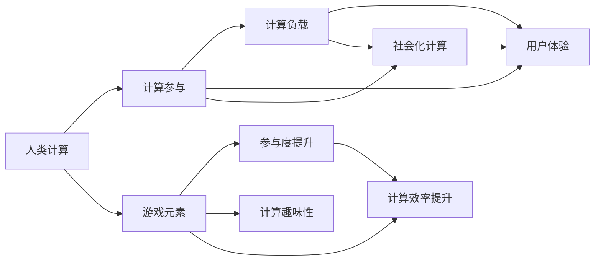

                 

# 游戏化设计：让参与人类计算充满乐趣

> 关键词：游戏化设计，人类计算，计算负载，参与体验，用户体验，计算参与，趣味化，高效性，奖励机制，社会化计算

## 1. 背景介绍

### 1.1 问题由来

随着科技的进步和互联网的发展，计算已经成为了现代生活中不可或缺的一部分。从简单的数据处理到复杂的科学研究，计算能力对各个领域都有着深远的影响。然而，在计算过程中，尤其是涉及到大量数据或复杂计算时，人类往往感到负担沉重，导致计算参与度低下，用户体验较差。如何提升人类的计算参与度，提高计算的趣味性和效率，成为了一个亟待解决的问题。

### 1.2 问题核心关键点

游戏化设计（Gamification Design）作为一种创新方法，通过将游戏元素融入计算任务中，使得计算过程变得更加有趣和互动。核心关键点包括：

- **参与度提升**：通过引入游戏元素，如奖励、竞赛、任务进度等，提升用户对计算任务的兴趣和参与度。
- **计算趣味性**：将枯燥的计算过程变成一场游戏，让用户在使用计算工具的过程中获得愉悦的体验。
- **计算效率提升**：通过合理的游戏设计，引导用户更快地完成计算任务，提高计算效率。
- **社会化计算**：将计算任务通过社交网络等平台进行分享和协作，促进社会化计算的发展。

这些关键点构成了游戏化设计的核心框架，使其能够在各个计算任务中发挥重要作用。

### 1.3 问题研究意义

提升人类的计算参与度，不仅有助于提高计算效率，还能激发人们的创新思维和协作精神。研究游戏化设计的方法，对于提升计算技术在各行各业中的应用，具有重要意义：

1. **提高计算效率**：通过游戏化设计，使得计算过程更加高效，减少用户在使用计算工具时的心理负担。
2. **增强用户体验**：游戏化的设计理念能够提升用户对计算任务的满意度和忠诚度，从而提高用户粘性和使用频率。
3. **促进社会化计算**：通过社交网络等平台，将计算任务进行分享和协作，形成互动和知识共享的社区环境。
4. **激发创新思维**：游戏化设计能够激发用户的好奇心和创造力，推动计算技术和应用领域的发展。
5. **提升协作精神**：通过团队协作和竞赛等游戏机制，增强用户间的互动和合作，提高社会化计算的效果。

## 2. 核心概念与联系

### 2.1 核心概念概述

为了更好地理解游戏化设计的原理和应用，本节将介绍几个关键概念：

- **人类计算（Human Computation）**：利用人类的智慧和技能进行计算，而非依赖于机器自动化计算。
- **计算参与（Computation Participation）**：指用户积极参与计算任务的程度和频率。
- **游戏元素（Gamification Elements）**：包括奖励、任务、竞争、成就等，用于提升用户参与度和趣味性。
- **社会化计算（Social Computation）**：通过社交网络等平台，将计算任务进行分享和协作，促进知识共享。
- **用户体验（User Experience）**：指用户在使用计算工具或平台时的感受和反馈。
- **计算负载（Computation Load）**：指计算任务对用户计算资源的消耗程度。

这些概念之间存在紧密的联系，通过游戏化设计，可以有效提升计算参与度，提高计算趣味性和效率，同时增强用户体验和协作精神。

### 2.2 核心概念原理和架构的 Mermaid 流程图



这个流程图展示了各个概念之间的联系。人类计算通过引入游戏元素，提升用户的计算参与度和趣味性，进而提高计算效率和用户体验，同时促进社会化计算的发展。

## 3. 核心算法原理 & 具体操作步骤

### 3.1 算法原理概述

游戏化设计的核心在于通过引入游戏元素，提升用户的计算参与度和趣味性。其核心算法原理可以总结如下：

1. **参与度提升**：通过奖励、任务进度、成就等游戏元素，吸引用户参与计算任务。
2. **计算趣味性**：通过设计有趣的游戏环节，将计算任务变成一种游戏体验。
3. **计算效率提升**：通过任务分解、时间限制等机制，引导用户更快地完成计算任务。
4. **社会化计算**：通过社交网络等平台，将计算任务进行分享和协作，增强用户的互动和合作。

### 3.2 算法步骤详解

游戏化设计的一般流程包括以下几个关键步骤：

**Step 1: 分析计算任务**

- 分析计算任务的需求和特点，确定需要引入哪些游戏元素。
- 评估计算任务的复杂度和计算负载，确保游戏元素不会影响任务完成。

**Step 2: 设计游戏元素**

- 设计奖励系统，如积分、金币、排行榜等，激励用户完成任务。
- 设计任务系统，将计算任务分解为多个子任务，逐步完成。
- 设计竞争机制，如竞赛、比赛等，提升用户参与度和紧迫感。
- 设计成就系统，如徽章、荣誉等，增强用户成就感和自豪感。

**Step 3: 实施游戏机制**

- 将游戏元素嵌入计算任务中，确保用户能够轻松参与。
- 实时监测用户参与度和任务进度，根据反馈进行调整。
- 引入社交网络等平台，将计算任务进行分享和协作，增强互动。

**Step 4: 评估和优化**

- 收集用户反馈，评估游戏化设计的效果。
- 根据反馈进行优化调整，提升用户参与度和计算效率。

### 3.3 算法优缺点

游戏化设计具有以下优点：

- **提升参与度**：通过奖励和任务进度等游戏元素，显著提升用户对计算任务的兴趣和参与度。
- **提高趣味性**：将枯燥的计算任务变成有趣的游戏，让用户在使用计算工具的过程中获得愉悦的体验。
- **提升效率**：通过合理的游戏设计，引导用户更快地完成计算任务，提高计算效率。
- **增强协作**：通过社交网络等平台，将计算任务进行分享和协作，促进社会化计算的发展。

同时，游戏化设计也存在一些缺点：

- **实施复杂**：设计复杂的游戏元素需要一定的技术投入和创意设计。
- **用户体验影响**：如果游戏元素设计不当，可能反而影响用户体验，甚至引起用户反感。
- **计算负载增加**：引入游戏元素后，计算任务的复杂度可能会增加，影响计算效率。
- **用户依赖性强**：依赖游戏元素维持用户参与度，可能导致用户对计算任务的持续关注降低。

### 3.4 算法应用领域

游戏化设计在游戏、教育、科研等多个领域中得到了广泛应用，以下是几个典型的应用场景：

1. **教育领域**：通过游戏化设计，提升学生的计算参与度和兴趣，提高学习效率。例如，使用积分和成就系统，激励学生完成数学题目和科学实验。
2. **科研领域**：利用游戏化设计，提升科研团队的协作效率和创新精神。例如，通过竞赛和任务系统，引导团队成员合作完成复杂的科研项目。
3. **企业应用**：在企业内部，通过游戏化设计，提升员工对计算任务的参与度和工作效率。例如，使用排行榜和奖励机制，激励员工完成数据处理和分析任务。
4. **公共服务**：通过游戏化设计，提升公众对政府服务的参与度和满意度。例如，使用竞赛和任务系统，鼓励市民参与环境监测和公共卫生等计算任务。

## 4. 数学模型和公式 & 详细讲解 & 举例说明

### 4.1 数学模型构建

本节将使用数学语言对游戏化设计的过程进行更加严格的刻画。

记计算任务为 $C$，用户参与度为 $P$，计算负载为 $L$，用户体验为 $U$，社交化计算程度为 $S$。定义游戏元素 $G$，包括奖励、任务、竞争、成就等。

**游戏元素对用户参与度的影响模型**：

$$ P = f_G(P_0) $$

其中 $P_0$ 为初始用户参与度，$G$ 为游戏元素，$f_G$ 为游戏元素对参与度的函数。

**游戏元素对计算趣味性的影响模型**：

$$ U = g_G(U_0) $$

其中 $U_0$ 为初始用户体验，$G$ 为游戏元素，$g_G$ 为游戏元素对用户体验的函数。

**游戏元素对计算效率的影响模型**：

$$ L = h_G(L_0) $$

其中 $L_0$ 为初始计算负载，$G$ 为游戏元素，$h_G$ 为游戏元素对计算负载的函数。

**游戏元素对社交化计算的影响模型**：

$$ S = i_G(S_0) $$

其中 $S_0$ 为初始社交化计算程度，$G$ 为游戏元素，$i_G$ 为游戏元素对社交化计算的函数。

### 4.2 公式推导过程

以计算参与度提升为例，推导游戏元素对参与度的影响。

假设初始用户参与度为 $P_0$，游戏元素对参与度的提升率为 $k$，则有：

$$ P = P_0(1+k) $$

其中 $k$ 为游戏元素对参与度的提升系数。

同理，对于计算趣味性、计算效率和社交化计算，也可以通过类似的方式推导出游戏元素对各个方面的影响模型。

### 4.3 案例分析与讲解

以一个在线教育平台为例，分析游戏化设计对用户体验和参与度的影响。

假设平台初始用户体验为 $U_0$，初始用户参与度为 $P_0$。平台通过引入积分奖励系统，设置每日学习任务，举办学习竞赛，用户参与度和用户体验分别提升为 $P$ 和 $U$。

根据游戏元素对用户体验和参与度的影响模型，可以得到：

$$ U = U_0(1+a) $$

$$ P = P_0(1+b) $$

其中 $a$ 为积分奖励对用户体验的提升系数，$b$ 为每日任务对用户参与度的提升系数。

通过实际运行数据分析，可以得出游戏化设计对用户体验和参与度的提升效果。例如，通过A/B测试，比较引入游戏元素前后的用户行为数据，发现用户参与度和平均学习时间都有显著提升。

## 5. 项目实践：代码实例和详细解释说明

### 5.1 开发环境搭建

在进行游戏化设计实践前，我们需要准备好开发环境。以下是使用Python进行Django开发的环境配置流程：

1. 安装Python：确保Python版本为3.7以上，从官网下载并安装。
2. 安装Pip：安装Pip工具，用于包管理。
3. 安装Django：通过pip安装Django框架，命令为 `pip install django`。
4. 创建项目和应用：通过Django命令行工具创建新的项目和应用，命令为 `django-admin startproject project_name` 和 `python manage.py startapp app_name`。
5. 设置数据库：在settings.py文件中配置数据库连接信息，支持MySQL、PostgreSQL等。
6. 安装前端框架：安装Bootstrap等前端框架，用于页面设计和布局。

完成上述步骤后，即可在项目环境中开始游戏化设计实践。

### 5.2 源代码详细实现

这里我们以一个简单的学习任务为例，使用Django框架实现游戏化设计。

**代码实现步骤**：

1. 创建学习任务模型和表单：
```python
from django.db import models
from django import forms

class Task(models.Model):
    name = models.CharField(max_length=100)
    description = models.TextField()
    reward = models.IntegerField()

    class Meta:
        ordering = ['name']

class TaskForm(forms.ModelForm):
    class Meta:
        model = Task
        fields = ['name', 'description', 'reward']
```

2. 创建任务列表视图：
```python
from django.shortcuts import render, redirect
from .models import Task
from .forms import TaskForm

def task_list(request):
    tasks = Task.objects.all()
    context = {'tasks': tasks}
    return render(request, 'task_list.html', context)
```

3. 创建任务创建视图：
```python
def task_create(request):
    if request.method == 'POST':
        form = TaskForm(request.POST)
        if form.is_valid():
            task = form.save(commit=False)
            task.save()
            return redirect('task_list')
    else:
        form = TaskForm()
    context = {'form': form}
    return render(request, 'task_create.html', context)
```

4. 创建任务详情视图：
```python
def task_detail(request, pk):
    task = Task.objects.get(pk=pk)
    return render(request, 'task_detail.html', {'task': task})
```

5. 创建积分奖励系统：
```python
from django.contrib.auth.models import User
from django.db import models

class Reward(models.Model):
    user = models.ForeignKey(User, on_delete=models.CASCADE)
    task = models.ForeignKey(Task, on_delete=models.CASCADE)
    points = models.IntegerField()

    def __str__(self):
        return f"{self.user.username} completed task {self.task.name}"
```

### 5.3 代码解读与分析

让我们再详细解读一下关键代码的实现细节：

**任务模型**：
- 定义了任务的姓名、描述和奖励等属性。
- 通过Meta类的ordering属性，设置任务的默认排序方式。

**任务表单**：
- 使用Django的ModelForm，将任务模型转换为表单，方便用户输入和提交任务信息。

**任务列表视图**：
- 从数据库中获取所有任务，并传入模板中渲染。
- 使用Django的render函数，将渲染后的HTML页面返回给用户。

**任务创建视图**：
- 检查请求方法是否为POST，如果是，则使用表单数据创建任务对象，并保存到数据库中。
- 如果不是POST请求，则显示空表单。

**任务详情视图**：
- 根据任务ID从数据库中获取任务信息，并传入模板中渲染。

**积分奖励系统**：
- 通过Django的内置User模型，与任务模型建立关联。
- 每当用户完成一个任务时，自动给予一定积分，并保存到奖励表中。

**运行结果展示**：
- 用户登录后，可以在任务列表页面中查看所有任务。
- 点击“创建任务”按钮，进入任务创建页面，填写任务信息后提交。
- 查看任务详情页面，可以看到任务的基本信息和完成情况。
- 用户完成任务后，会自动获得积分奖励。

## 6. 实际应用场景

### 6.1 智能客服系统

基于游戏化设计，智能客服系统可以显著提升用户参与度，提高客户满意度。例如，将常见问题设计成任务，设置积分奖励，鼓励用户解决问题。通过排行榜和成就系统，激励用户积极参与客服服务。

### 6.2 金融数据分析

在金融数据分析中，通过游戏化设计，可以提高数据处理的速度和准确性。例如，将复杂的数据分析任务分解为多个子任务，设置时间限制和奖励机制，激励用户快速完成任务。通过社交网络分享任务，增强用户间的协作和知识共享。

### 6.3 公共卫生监测

公共卫生监测需要大量的数据分析和处理，通过游戏化设计，可以提升用户的计算参与度。例如，将环境监测数据处理任务设计成游戏任务，设置积分奖励，鼓励用户参与数据分析。通过社交网络分享任务，促进知识共享和协作。

## 7. 工具和资源推荐

### 7.1 学习资源推荐

为了帮助开发者系统掌握游戏化设计的理论基础和实践技巧，这里推荐一些优质的学习资源：

1. 《Gamification Design》系列博文：由游戏化设计专家撰写，深入浅出地介绍了游戏化设计的原理、方法和案例。
2. Coursera《Gamification in Education》课程：由游戏化设计专家开设的课程，涵盖游戏化设计在教育领域的应用。
3. 《Gamification by Design》书籍：全面介绍了游戏化设计的理论和实践，提供大量案例和工具。
4. Behaviour Design Academy：提供丰富的游戏化设计资源，包括博客、视频、书籍等。
5. Google Developers Play Services：提供游戏化设计框架和工具，帮助开发者实现游戏化功能。

通过对这些资源的学习实践，相信你一定能够快速掌握游戏化设计的精髓，并用于解决实际的计算问题。

### 7.2 开发工具推荐

高效的开发离不开优秀的工具支持。以下是几款用于游戏化设计开发的常用工具：

1. Django：Python的开源Web框架，灵活易用，支持RESTful API和模板系统。
2. Bootstrap：前端框架，提供丰富的UI组件和布局工具，方便快速开发网页。
3. Unity3D：跨平台的游戏引擎，支持3D和2D游戏开发，提供强大的游戏设计工具。
4. Unreal Engine：强大的游戏引擎，支持高性能的3D游戏开发，提供丰富的游戏设计工具。
5. Processing：Java和C++的开发环境，支持图形化编程，适合初学者入门。

合理利用这些工具，可以显著提升游戏化设计任务的开发效率，加快创新迭代的步伐。

### 7.3 相关论文推荐

游戏化设计的研究源于学界的持续研究。以下是几篇奠基性的相关论文，推荐阅读：

1. Designing Effective Gameful Experiences（ESGC）：提出游戏化设计的框架和方法，分析游戏元素对用户体验的影响。
2. Game Design Critique System (GDCS)：提出游戏化设计的评估系统，帮助设计师优化游戏元素设计。
3. Gamification Design Frameworks：介绍多种游戏化设计框架，如Systematic Game Design、Six Elements of Gamification等。
4. Gamification Elements and Impacts：系统研究游戏元素对用户体验的影响，提供实证数据和案例分析。
5. Gamification in Software Development：介绍游戏化设计在软件开发中的应用，涵盖任务管理、代码评审等方面。

这些论文代表了大语言模型微调技术的发展脉络。通过学习这些前沿成果，可以帮助研究者把握学科前进方向，激发更多的创新灵感。

## 8. 总结：未来发展趋势与挑战

### 8.1 总结

本文对游戏化设计的方法进行了全面系统的介绍。首先阐述了游戏化设计在提升计算参与度和趣味性方面的重要作用，明确了游戏元素对用户体验和计算效率的影响。其次，从原理到实践，详细讲解了游戏化设计的数学模型和操作步骤，给出了游戏化设计任务开发的完整代码实例。同时，本文还广泛探讨了游戏化设计在智能客服、金融数据分析、公共卫生监测等多个行业领域的应用前景，展示了游戏化设计的巨大潜力。此外，本文精选了游戏化设计的各类学习资源，力求为读者提供全方位的技术指引。

通过本文的系统梳理，可以看到，游戏化设计在提升计算任务参与度和趣味性方面具有广阔前景。游戏元素的巧妙设计和应用，可以显著提升用户体验和计算效率，促进社会化计算的发展。未来，伴随游戏化设计的持续演进，相信计算技术和应用领域将迎来新的突破。

### 8.2 未来发展趋势

展望未来，游戏化设计将呈现以下几个发展趋势：

1. **个性化设计**：根据用户的行为和偏好，动态调整游戏元素，提供个性化的游戏体验。
2. **数据驱动设计**：利用大数据分析，优化游戏元素设计，提升用户体验和参与度。
3. **跨平台设计**：支持多平台的游戏化设计，提供跨设备、跨终端的游戏体验。
4. **情感计算**：引入情感计算技术，实时监测用户情感状态，提供适时的游戏支持和反馈。
5. **社交化设计**：增强社交互动，利用社交网络等平台，促进知识共享和协作。
6. **人工智能融合**：将游戏化设计与其他人工智能技术（如自然语言处理、机器学习等）进行融合，提升计算任务的智能化水平。

以上趋势凸显了游戏化设计的广阔前景。这些方向的探索发展，必将进一步提升计算任务的用户体验和参与度，推动计算技术的普及和应用。

### 8.3 面临的挑战

尽管游戏化设计已经取得了显著成效，但在迈向更加智能化、普适化应用的过程中，它仍面临着诸多挑战：

1. **用户体验依赖**：游戏元素设计不当，可能导致用户体验降低，甚至引发用户反感。
2. **计算负载增加**：引入游戏元素后，计算任务的复杂度可能会增加，影响计算效率。
3. **用户依赖性强**：依赖游戏元素维持用户参与度，可能导致用户对计算任务的持续关注降低。
4. **开发成本高**：游戏化设计需要投入大量的时间和资源，开发成本较高。

### 8.4 研究展望

面对游戏化设计面临的挑战，未来的研究需要在以下几个方面寻求新的突破：

1. **优化游戏元素设计**：通过用户行为数据分析，优化游戏元素设计，提升用户体验和计算效率。
2. **降低计算负载**：采用优化算法和高效数据结构，减少游戏元素对计算负载的影响。
3. **增强社交互动**：利用社交网络等平台，促进知识共享和协作，增强用户互动和参与度。
4. **引入人工智能**：将游戏化设计与其他人工智能技术（如自然语言处理、机器学习等）进行融合，提升计算任务的智能化水平。
5. **实现个性化设计**：根据用户的行为和偏好，动态调整游戏元素，提供个性化的游戏体验。
6. **提升开发效率**：采用自动化工具和模板，降低游戏化设计的开发成本，提高开发效率。

这些研究方向的探索，必将引领游戏化设计技术迈向更高的台阶，为计算任务提供更加有趣和高效的游戏体验。面向未来，游戏化设计将与其他计算技术和应用领域进行更深层次的融合，共同推动计算技术的进步和应用。

## 9. 附录：常见问题与解答

**Q1：游戏化设计是否适用于所有计算任务？**

A: 游戏化设计在大多数计算任务上都能取得不错的效果，特别是对于数据量较小的任务。但对于一些特定领域的任务，如医学、法律等，仅仅依靠游戏元素可能难以很好地适应。此时需要在特定领域语料上进一步预训练，再进行游戏化设计，才能获得理想效果。

**Q2：游戏化设计中的奖励机制如何设计？**

A: 奖励机制是游戏化设计的关键组成部分，设计时需要考虑以下几点：
1. **多样性**：设计多种奖励形式，如积分、勋章、荣誉称号等，满足不同用户的需求。
2. **公平性**：确保奖励机制公平公正，避免偏袒某一部分用户。
3. **即时性**：及时给予奖励，增强用户的成就感和满足感。
4. **层次性**：设计多层次的奖励结构，鼓励用户逐步提升。

**Q3：游戏化设计对计算任务的影响有哪些？**

A: 游戏化设计对计算任务的影响主要体现在以下几个方面：
1. **提升参与度**：通过奖励和任务进度等游戏元素，显著提升用户对计算任务的兴趣和参与度。
2. **提高趣味性**：将枯燥的计算任务变成有趣的游戏，让用户在使用计算工具的过程中获得愉悦的体验。
3. **提升效率**：通过合理的游戏设计，引导用户更快地完成计算任务，提高计算效率。
4. **增强协作**：通过社交网络等平台，将计算任务进行分享和协作，促进社会化计算的发展。

**Q4：游戏化设计在企业应用中的优势有哪些？**

A: 游戏化设计在企业应用中的优势主要包括：
1. **提高效率**：通过游戏化设计，提高员工对计算任务的参与度和效率，减少人力成本。
2. **增强协作**：利用社交网络等平台，促进团队协作和知识共享，提高团队的整体实力。
3. **提升创新能力**：通过竞赛和任务系统，激发员工的创造力和创新精神，推动企业发展。
4. **提升员工满意度**：通过奖励和成就系统，增强员工的成就感和满意度，提高员工的忠诚度和稳定性。

**Q5：游戏化设计在公共服务中的应用有哪些？**

A: 游戏化设计在公共服务中的应用主要包括：
1. **提升参与度**：通过游戏化设计，提升公众对公共服务任务的参与度和满意度。
2. **提高效率**：利用游戏化设计，提高数据处理和分析的效率，支持公共服务的决策和优化。
3. **增强互动**：通过社交网络等平台，增强公众与政府之间的互动和沟通，提升服务质量。
4. **推动知识共享**：利用游戏化设计，促进知识共享和传播，提升公共服务的质量和效率。

通过这些应用实例，可以看到游戏化设计在提升计算任务参与度和趣味性方面的强大力量。未来，随着游戏化设计的不断发展和完善，将有更多的领域受益于这种创新方法。

