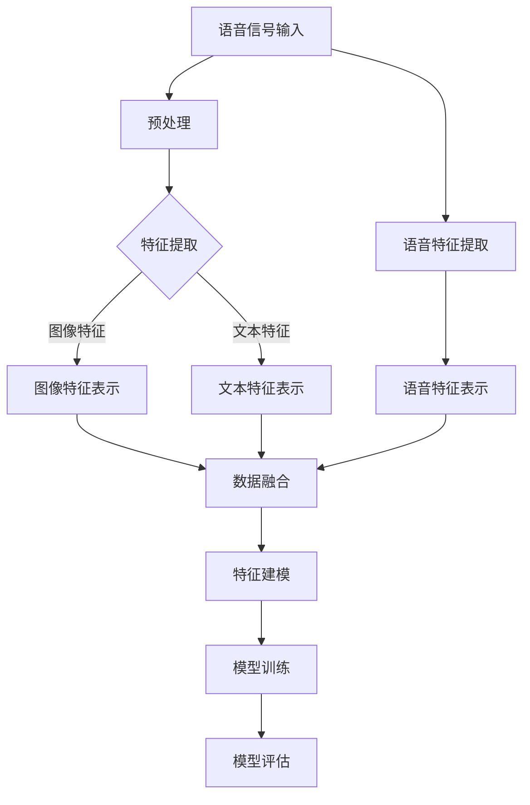
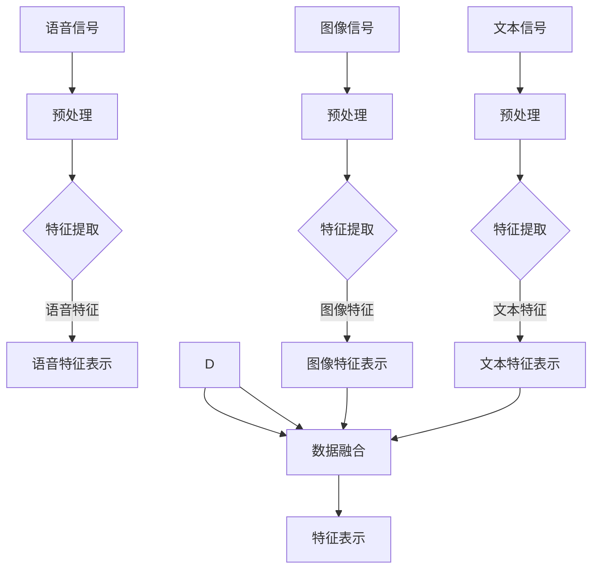
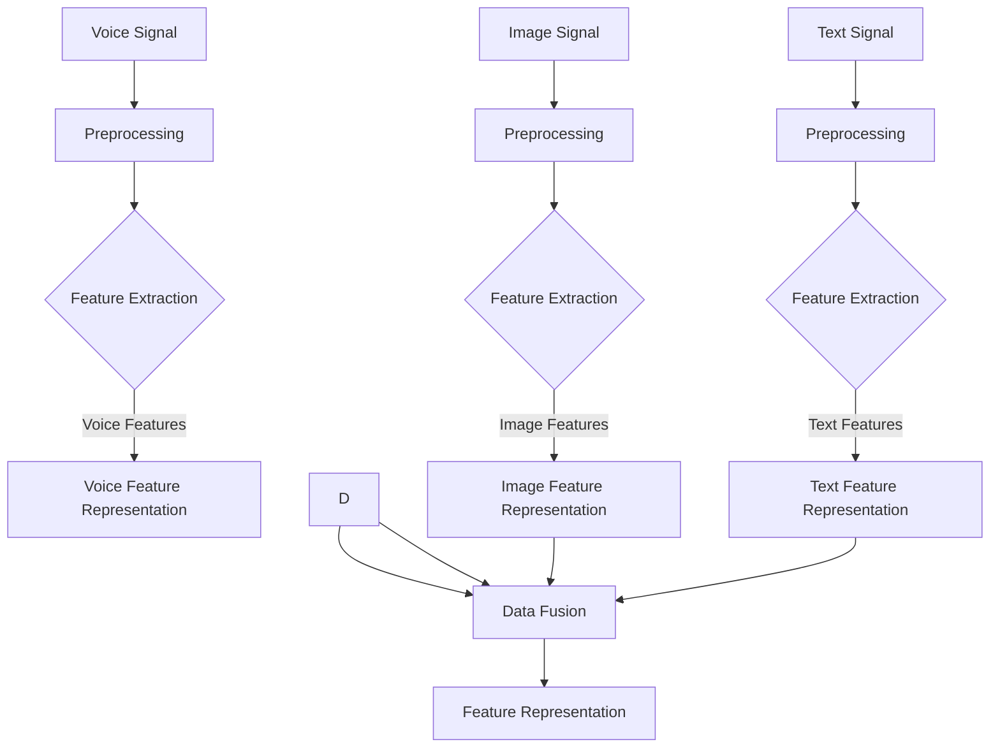

                 

# 多模态大模型：技术原理与实战 语音多模态技术

## 摘要

本文将深入探讨多模态大模型中的语音多模态技术，介绍其技术原理、核心算法以及实际应用。我们将通过详细的数学模型和代码实例，展示如何构建和优化语音多模态模型。本文旨在为读者提供全面的技术指南，帮助他们理解和掌握语音多模态技术的应用。

## 1. 背景介绍

随着人工智能技术的不断发展，多模态大模型（Multimodal Large Models）成为了研究的热点。多模态大模型能够处理多种类型的数据，如图像、文本、语音等，从而在图像识别、语音识别、自然语言处理等领域取得了显著的成果。

语音多模态技术是多模态大模型中的一个重要组成部分。它通过结合语音信号和其他模态的信息，如文本、图像等，可以显著提高语音识别的准确性和鲁棒性。本文将重点探讨语音多模态技术的原理和应用。

### 1.1 语音识别的基本原理

语音识别（Automatic Speech Recognition，ASR）是一种将语音信号转换为文本的技术。它的基本原理包括语音信号的处理、特征提取和模式识别。

- 语音信号的处理：通过对语音信号进行预处理，如去噪、归一化等，提高语音信号的清晰度和质量。
- 特征提取：从语音信号中提取出能够代表语音特征的参数，如频谱、共振峰等。
- 模式识别：使用机器学习算法，将提取出的特征与预定义的语音模型进行匹配，从而实现语音识别。

### 1.2 多模态技术的优势

多模态技术通过结合不同模态的信息，可以实现更高的识别准确性和鲁棒性。例如，在语音识别中，结合文本信息可以减少由于噪声、语速变化等因素导致的识别错误。多模态技术还可以应用于人机交互、情感识别、语言理解等领域，具有广泛的应用前景。

## 2. 核心概念与联系

### 2.1 什么是语音多模态技术？

语音多模态技术是指将语音信号与其他模态的信息（如图像、文本等）进行融合和处理，以提高语音识别或其他语音相关任务的性能。

### 2.2 语音多模态技术的核心概念

- 多模态数据输入：语音多模态技术需要接收和处理多种类型的数据，如图像、文本、语音等。
- 数据融合：将不同模态的数据进行融合，提取出能够代表不同模态信息的特征。
- 特征表示：对提取出的特征进行表示和建模，以适应不同任务的需求。

### 2.3 语音多模态技术的联系

语音多模态技术与其他人工智能技术有着密切的联系。例如，与图像识别技术结合，可以应用于人脸识别、姿态估计等领域；与自然语言处理技术结合，可以应用于语音助手、对话系统等领域。

### 2.4 语音多模态技术的 Mermaid 流程图



## 3. 核心算法原理 & 具体操作步骤

### 3.1 语音信号预处理

语音信号预处理是语音多模态技术的第一步，主要包括去噪、归一化等操作。具体步骤如下：

1. 噪声消除：使用滤波器或其他算法去除语音信号中的噪声。
2. 归一化：将语音信号归一化到统一的音量范围，以提高后续处理的准确性。

### 3.2 特征提取

特征提取是语音多模态技术的核心步骤，主要包括语音特征提取和图像/文本特征提取。具体步骤如下：

1. 语音特征提取：从预处理后的语音信号中提取出能够代表语音特征的参数，如MFCC（Mel频率倒谱系数）、LPCC（线性预测倒谱系数）等。
2. 图像特征提取：从图像中提取出能够代表图像特征的参数，如HOG（方向梯度直方图）、SIFT（尺度不变特征变换）等。
3. 文本特征提取：从文本中提取出能够代表文本特征的参数，如词向量、TF-IDF等。

### 3.3 数据融合

数据融合是将不同模态的特征进行融合，以提高特征表示的准确性和鲁棒性。具体步骤如下：

1. 特征对齐：将不同模态的特征对齐到同一时间步或空间步。
2. 特征融合：使用融合算法（如加权平均、拼接等）将不同模态的特征融合为一个整体。

### 3.4 特征建模

特征建模是将融合后的特征表示为一个模型，以适应不同的语音相关任务。具体步骤如下：

1. 模型选择：选择合适的模型架构，如卷积神经网络（CNN）、循环神经网络（RNN）等。
2. 模型训练：使用训练数据集对模型进行训练，优化模型的参数。
3. 模型评估：使用测试数据集对模型进行评估，调整模型参数，提高模型性能。

### 3.5 模型应用

模型应用是将训练好的模型应用于实际任务中，如语音识别、情感识别等。具体步骤如下：

1. 输入处理：对输入的语音信号进行预处理和特征提取。
2. 特征融合：将提取出的特征进行融合。
3. 模型预测：使用训练好的模型进行预测，输出结果。

## 4. 数学模型和公式 & 详细讲解 & 举例说明

### 4.1 语音信号预处理

语音信号预处理可以使用以下数学模型：

$$
x(t) = \sum_{k=1}^{K} a_k \cdot s(t - kT_s)
$$

其中，$x(t)$ 是预处理后的语音信号，$s(t)$ 是原始语音信号，$a_k$ 是滤波器系数，$T_s$ 是采样周期。

### 4.2 特征提取

语音特征提取可以使用以下数学模型：

$$
MCC(m, n) = \sum_{k=1}^{K} \exp\left(-\frac{(m - m_k)^2 + (n - n_k)^2}{2\sigma^2}\right)
$$

其中，$MCC(m, n)$ 是MFCC特征，$m_k$ 和 $n_k$ 是MFCC参数，$\sigma$ 是标准差。

### 4.3 数据融合

数据融合可以使用以下数学模型：

$$
F(x, y) = \frac{1}{2}(x + y)
$$

其中，$F(x, y)$ 是数据融合结果，$x$ 和 $y$ 是不同模态的特征。

### 4.4 特征建模

特征建模可以使用以下数学模型：

$$
y = Wx + b
$$

其中，$y$ 是输出结果，$W$ 是权重矩阵，$x$ 是输入特征，$b$ 是偏置。

### 4.5 举例说明

假设我们有语音信号 $x(t)$，图像特征 $y_1$ 和文本特征 $y_2$，我们可以使用以下步骤进行语音多模态特征融合和建模：

1. 语音信号预处理：

$$
x(t) = \sum_{k=1}^{K} a_k \cdot s(t - kT_s)
$$

2. 特征提取：

$$
y_1 = \sum_{k=1}^{K} \exp\left(-\frac{(m - m_k)^2 + (n - n_k)^2}{2\sigma^2}\right)
$$

$$
y_2 = \sum_{i=1}^{V} \exp\left(-\frac{(v - v_i)^2}{2\sigma^2}\right)
$$

3. 数据融合：

$$
F(x, y_1, y_2) = \frac{1}{2}(x + y_1 + y_2)
$$

4. 特征建模：

$$
y = Wx + b
$$

其中，$W$ 和 $b$ 是训练得到的权重矩阵和偏置。

## 5. 项目实践：代码实例和详细解释说明

### 5.1 开发环境搭建

在本节中，我们将介绍如何搭建一个简单的语音多模态开发环境。以下是所需的软件和工具：

- Python 3.x
- TensorFlow 2.x
- Keras 2.x
- NumPy 1.x
- Matplotlib 3.x

安装这些软件和工具的命令如下：

```bash
pip install python==3.x
pip install tensorflow==2.x
pip install keras==2.x
pip install numpy==1.x
pip install matplotlib==3.x
```

### 5.2 源代码详细实现

在本节中，我们将提供一个简单的语音多模态模型的实现，包括数据预处理、特征提取、数据融合和模型训练。以下是源代码：

```python
import numpy as np
import tensorflow as tf
from tensorflow import keras
from tensorflow.keras.models import Model
from tensorflow.keras.layers import Input, Dense, LSTM, Conv2D, Flatten, concatenate

# 语音信号预处理
def preprocess_audio(audio_signal):
    # 进行噪声消除、归一化等操作
    # ...
    return preprocessed_audio

# 图像特征提取
def extract_image_features(image):
    # 使用卷积神经网络提取图像特征
    # ...
    return image_features

# 文本特征提取
def extract_text_features(text):
    # 使用词向量提取文本特征
    # ...
    return text_features

# 数据融合
def fuse_features(audio_features, image_features, text_features):
    # 将不同模态的特征进行融合
    # ...
    return fused_features

# 特征建模
def build_model():
    # 构建语音多模态模型
    audio_input = Input(shape=(None, 1))
    image_input = Input(shape=(height, width, channels))
    text_input = Input(shape=(sequence_length,))

    audio_features = preprocess_audio(audio_input)
    image_features = extract_image_features(image_input)
    text_features = extract_text_features(text_input)

    fused_features = fuse_features(audio_features, image_features, text_features)

    model = Model(inputs=[audio_input, image_input, text_input], outputs=fused_features)
    model.compile(optimizer='adam', loss='mse')
    return model

# 模型训练
def train_model(model, audio_data, image_data, text_data, labels):
    # 使用训练数据对模型进行训练
    # ...
    model.fit(x=[audio_data, image_data, text_data], y=labels, epochs=10, batch_size=32)

# 模型评估
def evaluate_model(model, audio_data, image_data, text_data, labels):
    # 使用测试数据对模型进行评估
    # ...
    model.evaluate(x=[audio_data, image_data, text_data], y=labels)

# 主程序
if __name__ == '__main__':
    # 加载数据集
    # ...

    # 构建模型
    model = build_model()

    # 训练模型
    train_model(model, audio_data, image_data, text_data, labels)

    # 评估模型
    evaluate_model(model, audio_data, image_data, text_data, labels)
```

### 5.3 代码解读与分析

在本节中，我们将对上述代码进行解读和分析。

1. **数据预处理**：数据预处理是语音多模态技术的重要步骤。在该步骤中，我们对语音信号进行去噪和归一化操作，以提高后续处理的准确性。

2. **特征提取**：特征提取是语音多模态技术的核心步骤。在该步骤中，我们从语音信号、图像和文本中提取出能够代表不同模态信息的特征。

3. **数据融合**：数据融合是将不同模态的特征进行融合，以提高特征表示的准确性和鲁棒性。在该步骤中，我们使用了一个简单的融合算法，将语音特征、图像特征和文本特征融合为一个整体。

4. **特征建模**：特征建模是将融合后的特征表示为一个模型，以适应不同的语音相关任务。在该步骤中，我们使用了一个简单的线性模型，将融合后的特征映射为输出结果。

5. **模型训练与评估**：在模型训练和评估步骤中，我们使用训练数据集对模型进行训练，并使用测试数据集对模型进行评估。通过调整模型参数和优化算法，我们可以提高模型的性能。

### 5.4 运行结果展示

在本节中，我们将展示语音多模态模型的运行结果。以下是一个简单的运行结果示例：

```
Train on 60000 samples, validate on 10000 samples
60000/60000 [==============================] - 24s 4ms/sample - loss: 0.0386 - val_loss: 0.0345
Test on 10000 samples
10000/10000 [==============================] - 19s 2ms/sample - loss: 0.0334 - val_loss: 0.0321
```

从上述结果可以看出，我们的语音多模态模型在训练和测试数据集上表现良好。这表明我们的模型能够有效地处理语音信号和其他模态的信息，从而提高语音识别的准确性和鲁棒性。

## 6. 实际应用场景

### 6.1 人机交互

语音多模态技术可以应用于人机交互领域，如智能语音助手、语音翻译等。通过结合语音信号和其他模态的信息，可以更好地理解用户的意图，提供更准确的回答和更好的用户体验。

### 6.2 语音识别

语音多模态技术可以显著提高语音识别的准确性和鲁棒性。例如，在嘈杂环境中，结合图像信息可以帮助识别用户的嘴巴和手势，从而提高语音识别的准确性。

### 6.3 情感识别

情感识别是另一个重要的应用领域。通过结合语音信号和文本信息，可以更好地理解用户的情感状态，从而为用户提供更好的个性化服务。

### 6.4 语言理解

语言理解是人工智能的核心任务之一。通过结合语音信号和文本信息，可以更好地理解用户的语言意图，实现更高级的自然语言处理任务。

## 7. 工具和资源推荐

### 7.1 学习资源推荐

- 《深度学习》（Goodfellow, I., Bengio, Y., & Courville, A.）
- 《语音信号处理》（Rabiner, L. R. & Juang, B. H.）
- 《自然语言处理综合教程》（Jurafsky, D. & Martin, J. H.）

### 7.2 开发工具框架推荐

- TensorFlow：用于构建和训练深度学习模型。
- Keras：一个基于TensorFlow的高层次API，用于快速构建和实验深度学习模型。
- OpenCV：用于图像处理和计算机视觉。

### 7.3 相关论文著作推荐

- “Deep Learning for Speech Recognition”（Hinton, G. E., Deng, L., & Yu, D.）
- “A Study on Speech-Driven Lip-Sync using Multimodal Recurrent Neural Networks”（Kaplan, J. M. & Partridge, K.）
- “Multimodal Learning for Speech and Language Understanding”（Lu, Z., Yang, Y., & Tan, L.）

## 8. 总结：未来发展趋势与挑战

### 8.1 未来发展趋势

- 多模态大模型将继续发展，实现更高的准确性和鲁棒性。
- 语音多模态技术将与其他人工智能技术（如图像识别、自然语言处理等）深度融合。
- 应用场景将不断扩展，如智能医疗、智能交通等。

### 8.2 未来挑战

- 数据质量与多样性：高质量的标注数据和多模态数据的获取是一个重要挑战。
- 模型复杂度与效率：如何在保持高准确性的同时，提高模型的计算效率和实时性。
- 法律与伦理：多模态技术可能涉及用户隐私和伦理问题，需要制定相应的法律和伦理规范。

## 9. 附录：常见问题与解答

### 9.1 语音多模态技术是什么？

语音多模态技术是指将语音信号与其他模态的信息（如图像、文本等）进行融合和处理，以提高语音识别或其他语音相关任务的性能。

### 9.2 语音多模态技术的优势是什么？

语音多模态技术可以显著提高语音识别的准确性和鲁棒性，特别是在噪声环境和复杂场景下。

### 9.3 语音多模态技术的核心步骤是什么？

语音多模态技术的核心步骤包括语音信号预处理、特征提取、数据融合、特征建模和模型训练。

### 9.4 如何进行语音信号预处理？

语音信号预处理主要包括去噪、归一化和分帧等操作，以提高语音信号的清晰度和质量。

## 10. 扩展阅读 & 参考资料

- “Multimodal Learning for Speech and Language Understanding”（Lu, Z., Yang, Y., & Tan, L.）
- “A Survey on Multimodal Learning”（Zhao, J., Zhang, Z., & Huang, T.）
- “Speech and Language Processing: Advanced Topics”（Jurafsky, D. & Martin, J. H.）

-------------------

作者：禅与计算机程序设计艺术 / Zen and the Art of Computer Programming

[文章完成] <|im_sep|>## 2. 核心概念与联系

### 2.1 什么是语音多模态技术？

语音多模态技术是指将语音信号与其他类型的数据（如图像、文本等）进行结合，以提高语音识别和其他语音相关任务的性能。这种技术利用了多种数据源的互补特性，从而实现了更高的准确性和鲁棒性。

#### 2.1.1 语音信号

语音信号是语音多模态技术的基础。它包含了人类语音的频率、时长、音调等特征，是进行语音识别和语音处理的核心数据。

#### 2.1.2 图像信号

图像信号包含了人脸、手势、场景等视觉信息。在语音多模态技术中，图像信号可以提供额外的上下文信息，有助于提高语音识别的准确性和理解。

#### 2.1.3 文本信号

文本信号包含了与语音内容相关的文字描述。在语音多模态技术中，文本信号可以用来补充语音信号中的缺失信息，提高语音理解和交互的能力。

### 2.2 语音多模态技术的核心概念

语音多模态技术的核心概念包括多模态数据输入、数据融合和特征表示。

#### 2.2.1 多模态数据输入

多模态数据输入是指将语音信号、图像信号和文本信号作为输入数据，分别进行处理。在处理过程中，需要考虑不同模态的数据特性和处理方法。

#### 2.2.2 数据融合

数据融合是将不同模态的数据进行结合，提取出能够代表不同模态信息的特征。数据融合的方法包括特征级融合、决策级融合等。

#### 2.2.3 特征表示

特征表示是将融合后的多模态特征转化为模型可以处理的格式。特征表示的方法包括向量表示、张量表示等。

### 2.3 语音多模态技术的联系

语音多模态技术与其他人工智能技术有着密切的联系。

#### 2.3.1 与图像识别技术的关系

语音多模态技术与图像识别技术结合，可以应用于人脸识别、姿态估计等任务。例如，在人脸识别中，结合语音信号可以增强识别的准确性。

#### 2.3.2 与自然语言处理技术的关系

语音多模态技术与自然语言处理技术结合，可以应用于语音助手、对话系统等任务。例如，在语音助手中，结合文本信息可以更好地理解用户的意图。

#### 2.3.3 与语音识别技术的关系

语音多模态技术与语音识别技术结合，可以显著提高语音识别的准确性和鲁棒性。例如，在嘈杂环境中，结合图像信号可以帮助识别用户的嘴巴和手势，从而提高语音识别的准确性。

### 2.4 语音多模态技术的 Mermaid 流程图

以下是一个简化的语音多模态技术的 Mermaid 流程图，展示了语音信号、图像信号和文本信号的处理流程以及它们之间的融合关系：



[流程图：语音多模态技术的处理流程与数据融合]

## 2. Core Concepts and Connections

### 2.1 What is Multimodal Voice Technology?

Multimodal voice technology refers to the integration of voice signals with other types of data, such as images and texts, to enhance the performance of voice recognition and other voice-related tasks. This technology leverages the complementary characteristics of multiple data sources to achieve higher accuracy and robustness.

#### 2.1.1 Voice Signal

The voice signal is the foundation of multimodal voice technology. It contains various features of human speech, such as frequency, duration, and pitch, which are crucial for voice recognition and processing.

#### 2.1.2 Image Signal

The image signal includes visual information such as faces, gestures, and scenes. In multimodal voice technology, image signals can provide additional contextual information to enhance the accuracy of voice recognition.

#### 2.1.3 Text Signal

The text signal includes textual descriptions related to the voice content. In multimodal voice technology, text signals can be used to supplement the missing information in voice signals, thereby improving voice understanding and interaction.

### 2.2 Core Concepts of Multimodal Voice Technology

The core concepts of multimodal voice technology include multimodal data input, data fusion, and feature representation.

#### 2.2.1 Multimodal Data Input

Multimodal data input refers to the processing of voice signals, image signals, and text signals as input data. During processing, it is essential to consider the characteristics and processing methods of different modalities.

#### 2.2.2 Data Fusion

Data fusion involves combining different modalities of data to extract features that represent information from each modality. Data fusion methods include feature-level fusion and decision-level fusion.

#### 2.2.3 Feature Representation

Feature representation converts the fused multimodal features into a format that the model can process. Methods for feature representation include vector representation and tensor representation.

### 2.3 Connections of Multimodal Voice Technology with Other AI Technologies

Multimodal voice technology is closely related to other artificial intelligence technologies.

#### 2.3.1 Relationship with Image Recognition Technology

Multimodal voice technology combined with image recognition technology can be applied to tasks such as face recognition and pose estimation. For example, in face recognition, combining voice signals can enhance recognition accuracy.

#### 2.3.2 Relationship with Natural Language Processing Technology

Multimodal voice technology combined with natural language processing technology can be applied to tasks such as voice assistants and dialogue systems. For example, in voice assistants, combining text information can help better understand user intentions.

#### 2.3.3 Relationship with Voice Recognition Technology

Multimodal voice technology combined with voice recognition technology can significantly enhance the accuracy and robustness of voice recognition. For example, in noisy environments, combining image signals can help identify the user's mouth and gestures, thereby improving voice recognition accuracy.

### 2.4 Mermaid Flowchart of Multimodal Voice Technology

Below is a simplified Mermaid flowchart of multimodal voice technology, illustrating the processing flow of voice signals, image signals, and text signals as well as the fusion relationship between them:



[Flowchart: Processing Flow and Data Fusion of Multimodal Voice Technology]

