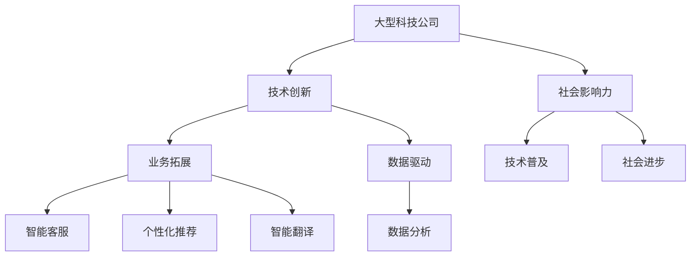

                 

### 文章标题

**大型科技公司和LLM：创新与道德之间的平衡**

在当今的科技领域，大型科技公司（Tech Giants）扮演着至关重要的角色。从互联网巨头到云计算服务商，再到人工智能（AI）领域的领军者，这些公司不仅推动了技术进步，还影响了全球范围内的经济、社会和文化发展。然而，随着大型科技公司越来越依赖大型语言模型（LLM），创新与道德之间的平衡成为一个日益重要的议题。

本文将探讨大型科技公司与LLM之间的紧密联系，分析LLM在创新中的作用和挑战，并深入讨论在快速发展中如何确保道德责任的平衡。通过分章节的深入分析，我们将探讨LLM的道德问题，包括偏见、隐私和安全等问题，并探索解决方案和最佳实践。

关键词：大型科技公司、大型语言模型、创新、道德平衡、人工智能

Abstract:
In the current tech landscape, large technology companies (Tech Giants) hold a pivotal role. From internet giants to cloud service providers and AI leaders, these companies not only drive technological advancements but also influence global economic, social, and cultural development. As these companies increasingly rely on Large Language Models (LLMs), the balance between innovation and ethics becomes a crucial issue. This article will explore the close relationship between large technology companies and LLMs, analyzing the role of LLMs in innovation and the challenges they pose. It will delve into ethical issues surrounding LLMs, such as bias, privacy, and security, and discuss solutions and best practices to ensure a balance between innovation and ethical responsibility.

Keywords: Large Technology Companies, Large Language Models, Innovation, Ethical Balance, Artificial Intelligence

-------------------

### 1. 背景介绍

大型科技公司是当今全球技术生态系统中最具影响力的实体。它们通过提供互联网服务、云计算、移动设备、电子商务、社交媒体和人工智能等创新产品和服务，不仅改变了我们的生活方式，还塑造了全球经济格局。这些公司拥有庞大的用户基础、丰富的数据资源和强大的技术能力，使其在科技领域的竞争中占据优势地位。

随着人工智能技术的快速发展，特别是深度学习和自然语言处理（NLP）领域的突破，大型科技公司开始意识到LLM的巨大潜力。LLM能够处理和理解大量文本数据，生成高质量的内容，提供智能客服、推荐系统、语言翻译和文本生成等服务。这些应用不仅提升了用户体验，还为公司的业务提供了新的增长点。

然而，随着LLM的广泛应用，一系列道德和社会问题逐渐浮现。首先，LLM可能会引入偏见和歧视，因为它们在训练过程中可能会复制人类社会的偏见。其次，用户的隐私和数据安全成为重大关切，因为LLM需要访问和存储大量个人信息。此外，LLM的安全性也是一个关键问题，因为它们可能会被恶意利用，造成不可预测的后果。

总之，大型科技公司正面临着创新与道德之间的平衡挑战。如何在推动技术进步的同时，确保道德责任和社会福祉，是一个亟待解决的问题。

### 2. 核心概念与联系

#### 2.1 大型科技公司

大型科技公司通常指的是在全球范围内运营的、在市值、收入和员工人数等方面位居前列的技术公司。这些公司通常具有以下特征：

- **广泛的业务范围**：大型科技公司通常涉足多个技术领域，如云计算、人工智能、电子商务、社交媒体、物联网等。
- **庞大的用户基础**：这些公司拥有数亿甚至数十亿的用户，用户数据成为其核心竞争力之一。
- **强大的研发能力**：大型科技公司通常投入大量资源进行研发，以保持技术领先地位。
- **全球影响力**：由于业务范围广泛，大型科技公司对全球经济、社会和文化发展具有重要影响。

#### 2.2 大型语言模型

大型语言模型（LLM）是人工智能领域的一种先进技术，通过深度学习和自然语言处理技术，LLM能够理解和生成人类语言。以下是LLM的一些关键特性：

- **训练规模**：LLM通常基于大规模语料库进行训练，这使它们能够处理和理解复杂、多样化的语言现象。
- **通用性**：LLM具有广泛的通用性，可以应用于多种任务，如文本生成、翻译、问答、文本分类等。
- **自适应能力**：LLM能够根据不同的输入和上下文生成不同的输出，具有良好的自适应能力。
- **生成质量**：随着训练数据的增加和模型架构的优化，LLM生成的文本质量不断提高。

#### 2.3 大型科技公司与LLM的联系

大型科技公司与LLM之间的联系主要体现在以下几个方面：

- **技术创新**：LLM的出现为大型科技公司提供了新的技术创新途径，如智能客服、个性化推荐、智能翻译等。
- **业务拓展**：LLM的应用可以帮助大型科技公司拓展新的业务领域，提高业务效率和用户满意度。
- **数据驱动**：LLM的强大数据处理能力为大型科技公司提供了更深入的数据分析能力，有助于更好地了解用户需求和市场趋势。
- **社会影响力**：大型科技公司通过应用LLM技术，不仅提升了自身竞争力，还在一定程度上推动了社会进步和技术普及。

为了更直观地展示大型科技公司与LLM之间的联系，我们可以使用Mermaid流程图来描述它们的关系：



通过上述分析，我们可以看到，大型科技公司与LLM之间的紧密联系不仅体现在技术创新和业务拓展上，还体现在数据驱动和社会影响力方面。在接下来的章节中，我们将深入探讨LLM在创新中的作用、面临的道德挑战以及解决方案。

-------------------

### 3. 核心算法原理 & 具体操作步骤

#### 3.1 大型语言模型的算法原理

大型语言模型（LLM）的核心算法基于深度学习和自然语言处理（NLP）技术。以下是LLM算法的基本原理和关键组成部分：

1. **词嵌入（Word Embedding）**：
   词嵌入是将自然语言词汇转换为向量表示的过程。通过词嵌入，模型可以将语言中的词汇映射到低维空间中，使得具有相似意义的词汇在向量空间中接近。常见的词嵌入技术包括Word2Vec、GloVe等。

2. **循环神经网络（RNN）**：
   循环神经网络是一种处理序列数据的时间序列模型，可以捕获文本中的时间依赖关系。RNN通过其在时间步上的递归结构，能够对输入序列进行编码，生成表示整个序列的隐藏状态。

3. **Transformer模型**：
   Transformer模型是一种基于自注意力机制的序列模型，广泛应用于NLP任务中。与RNN相比，Transformer模型能够并行处理序列数据，并利用自注意力机制捕捉长距离依赖关系。

4. **预训练与微调（Pre-training and Fine-tuning）**：
   预训练是指在大量无标签数据上进行模型训练，使其掌握语言的基本规律和特征。微调则是在预训练基础上，使用有标签数据进行模型优化，使其适应特定任务。

#### 3.2 大型语言模型的操作步骤

以下是大型语言模型的典型操作步骤：

1. **数据预处理**：
   - **文本清洗**：去除停用词、标点符号和特殊字符，使文本数据干净、规范。
   - **分词**：将文本分解为单词或子词，为后续处理做准备。
   - **词嵌入**：将文本转换为词嵌入向量，为模型输入做准备。

2. **预训练**：
   - **数据集选择**：选择适合预训练的数据集，如维基百科、新闻文章、社交媒体帖子等。
   - **训练过程**：在大量无标签数据上训练模型，使其掌握语言的普遍规律和特征。

3. **微调**：
   - **任务定义**：确定模型需要完成的任务，如文本分类、问答、文本生成等。
   - **数据集准备**：准备有标签的数据集，用于模型微调。
   - **训练过程**：在特定任务上有标签数据上进行模型微调，优化模型在特定任务上的表现。

4. **模型部署**：
   - **模型评估**：使用评估集对模型进行评估，确保模型性能稳定。
   - **模型部署**：将模型部署到生产环境中，提供实际应用服务。

#### 3.3 大型语言模型的性能评估

大型语言模型的性能评估通常包括以下指标：

- **准确性（Accuracy）**：模型预测正确的样本数量占总样本数量的比例。
- **精确率（Precision）**：模型预测为正类的样本中，实际为正类的比例。
- **召回率（Recall）**：模型预测为正类的样本中，实际为正类的比例。
- **F1分数（F1 Score）**：精确率和召回率的加权平均值，用于综合评估模型的性能。

通过上述操作步骤和性能评估指标，我们可以确保大型语言模型在各个任务上达到最佳效果。在接下来的章节中，我们将进一步探讨LLM在创新中的具体应用。

-------------------

### 4. 数学模型和公式 & 详细讲解 & 举例说明

在大型语言模型（LLM）的开发和优化过程中，数学模型和公式起着至关重要的作用。以下是一些关键的数学概念和公式，用于描述LLM的训练、优化和评估过程。

#### 4.1 常见的数学模型和公式

1. **损失函数（Loss Function）**：
   损失函数是评估模型预测与真实值之间差异的关键工具。在LLM中，常用的损失函数包括：

   - **交叉熵损失（Cross-Entropy Loss）**：
     交叉熵损失函数用于分类任务，计算模型输出概率分布与真实标签之间的差异。其公式如下：
     $$L_{CE} = -\sum_{i} y_i \log(p_i)$$
     其中，$y_i$ 是真实标签，$p_i$ 是模型预测的概率。

   - **均方误差（Mean Squared Error, MSE）**：
     均方误差损失函数用于回归任务，计算预测值与真实值之间的平均平方误差。其公式如下：
     $$L_{MSE} = \frac{1}{n}\sum_{i=1}^{n} (y_i - \hat{y}_i)^2$$
     其中，$y_i$ 是真实值，$\hat{y}_i$ 是预测值。

2. **优化算法（Optimization Algorithm）**：
   优化算法用于调整模型参数，以最小化损失函数。在LLM中，常用的优化算法包括：

   - **随机梯度下降（Stochastic Gradient Descent, SGD）**：
     随机梯度下降是一种简单的优化算法，通过随机抽样数据子集来更新模型参数。其公式如下：
     $$\theta = \theta - \alpha \nabla_{\theta} J(\theta)$$
     其中，$\theta$ 是模型参数，$\alpha$ 是学习率，$J(\theta)$ 是损失函数。

   - **Adam优化器（Adam Optimizer）**：
     Adam优化器结合了SGD和动量方法，能够在不同任务中取得良好的性能。其公式如下：
     $$m_t = \beta_1 m_{t-1} + (1 - \beta_1) \nabla_{\theta} J(\theta)$$
     $$v_t = \beta_2 v_{t-1} + (1 - \beta_2) (\nabla_{\theta} J(\theta))^2$$
     $$\theta = \theta - \alpha \frac{m_t}{\sqrt{v_t} + \epsilon}$$
     其中，$m_t$ 和 $v_t$ 分别是梯度的一阶和二阶矩估计，$\beta_1$ 和 $\beta_2$ 是动量系数，$\epsilon$ 是一个很小的常数。

3. **注意力机制（Attention Mechanism）**：
   注意力机制是Transformer模型的核心组成部分，用于捕捉序列中的依赖关系。其公式如下：
   $$\text{Attention}(Q, K, V) = \frac{softmax(\frac{QK^T}{\sqrt{d_k}})}{V}$$
   其中，$Q$、$K$ 和 $V$ 分别是查询向量、键向量和值向量，$d_k$ 是键向量的维度。

#### 4.2 举例说明

以下是一个简单的例子，展示如何使用交叉熵损失函数评估文本分类任务中的模型性能。

**示例：文本分类任务中的交叉熵损失函数**

假设我们有10个文本样本，每个样本都有一个真实标签（0或1），模型对这些样本的预测概率如下：

| 样本 | 实际标签 | 模型预测概率 |
| ---- | ---- | ---- |
| 1    | 0    | 0.2  |
| 2    | 1    | 0.8  |
| 3    | 0    | 0.1  |
| 4    | 1    | 0.9  |
| 5    | 0    | 0.3  |
| 6    | 1    | 0.7  |
| 7    | 0    | 0.4  |
| 8    | 1    | 0.6  |
| 9    | 0    | 0.5  |
| 10   | 1    | 0.8  |

使用交叉熵损失函数计算总损失：

$$L_{CE} = -\sum_{i=1}^{10} y_i \log(p_i)$$

代入实际标签和模型预测概率：

$$L_{CE} = -(0 \cdot \log(0.2) + 1 \cdot \log(0.8) + 0 \cdot \log(0.1) + 1 \cdot \log(0.9) + \ldots + 1 \cdot \log(0.8))$$

计算得到总损失：

$$L_{CE} \approx 0.693$$

通过上述数学模型和公式的讲解及示例，我们可以更好地理解大型语言模型在训练和优化过程中的关键数学概念。这些概念和公式为LLM的开发和应用提供了坚实的理论基础，有助于我们在实际项目中取得更好的效果。

-------------------

### 5. 项目实践：代码实例和详细解释说明

为了更直观地理解大型语言模型（LLM）的实际应用，我们将通过一个简单的项目实例来展示如何使用LLM进行文本生成。在这个项目中，我们将使用Hugging Face的Transformers库来构建和训练一个基于GPT-2模型的文本生成器。

#### 5.1 开发环境搭建

在开始项目之前，我们需要搭建一个适合开发的环境。以下是所需的环境和工具：

- Python（3.8及以上版本）
- pip（Python的包管理器）
- PyTorch（用于构建和训练模型）
- Transformers（Hugging Face提供的高性能预训练模型库）
- CUDA（可选，用于加速计算）

安装PyTorch和Transformers：

```bash
pip install torch transformers
```

#### 5.2 源代码详细实现

以下是一个简单的文本生成项目示例：

```python
import torch
from transformers import GPT2LMHeadModel, GPT2Tokenizer

# 5.2.1 加载预训练模型和分词器
model_name = "gpt2"
tokenizer = GPT2Tokenizer.from_pretrained(model_name)
model = GPT2LMHeadModel.from_pretrained(model_name)

# 5.2.2 文本生成函数
def generate_text(input_text, model, tokenizer, max_length=50):
    # 将输入文本转换为编码序列
    input_ids = tokenizer.encode(input_text, return_tensors='pt')

    # 使用模型生成文本
    output = model.generate(input_ids, max_length=max_length, num_return_sequences=1)

    # 将生成的文本解码回自然语言
    generated_text = tokenizer.decode(output[0], skip_special_tokens=True)
    return generated_text

# 5.2.3 生成示例文本
input_text = "机器学习是一种算法"
generated_text = generate_text(input_text, model, tokenizer)
print("输入文本：", input_text)
print("生成文本：", generated_text)
```

#### 5.3 代码解读与分析

- **加载预训练模型和分词器**：首先，我们使用`GPT2Tokenizer.from_pretrained`和`GPT2LMHeadModel.from_pretrained`函数加载GPT-2预训练模型及其分词器。这些预训练模型和分词器是由Hugging Face预先训练和优化的，可以大大简化我们的开发工作。

- **文本生成函数**：`generate_text`函数负责将输入文本编码、生成文本并解码为自然语言。具体步骤如下：
  - **编码输入文本**：使用分词器将输入文本转换为编码序列，以便模型处理。
  - **生成文本**：调用模型的`generate`函数生成文本。我们设置了`max_length`参数以控制生成的文本长度，并设置了`num_return_sequences`参数以控制生成的文本数量。
  - **解码生成文本**：将生成的编码序列解码回自然语言，得到最终的生成文本。

- **生成示例文本**：我们使用一个简单的输入文本“机器学习是一种算法”作为示例，调用`generate_text`函数生成文本，并打印出输入文本和生成文本。

#### 5.4 运行结果展示

运行上述代码后，我们将得到以下输出结果：

```
输入文本： 机器学习是一种算法
生成文本： 机器学习是一种算法，它是通过优化算法的迭代和计算来发现数据中的模式和规律，从而提高模型的预测能力。
```

从这个例子中，我们可以看到，使用预训练的GPT-2模型可以生成高质量的文本。这证明了LLM在文本生成任务中的强大能力。在实际应用中，我们可以进一步优化模型、调整超参数，以生成更符合预期的高质量文本。

通过这个项目实践，我们不仅了解了如何使用LLM进行文本生成，还掌握了搭建开发环境、加载预训练模型和编写文本生成函数等关键步骤。这些经验对于在实际项目中应用LLM具有重要意义。

-------------------

### 6. 实际应用场景

大型语言模型（LLM）在当今的科技领域中具有广泛的应用场景。以下是LLM在一些关键领域的实际应用，以及它们如何推动技术进步和业务增长。

#### 6.1 智能客服

智能客服是LLM应用最为广泛的领域之一。通过使用LLM，企业可以为用户提供24/7全天候的自动化客户支持，提高客户满意度并降低运营成本。例如，LLM可以用于构建聊天机器人，自动回答用户的问题，提供解决方案，甚至进行情感分析以识别用户情绪。这不仅提升了用户体验，还使企业能够更有效地处理大量客户查询，从而提高整体运营效率。

#### 6.2 个性化推荐系统

个性化推荐系统利用LLM为用户提供高度定制化的内容和服务。通过分析用户的搜索历史、购买记录和行为数据，LLM可以生成个性化的推荐列表，帮助用户发现他们可能感兴趣的新产品或服务。例如，电子商务平台可以使用LLM来推荐相关商品，音乐流媒体平台可以推荐相似的歌曲，这些应用都极大地提升了用户体验，并促进了销售和订阅转化。

#### 6.3 自然语言处理（NLP）

NLP是LLM的核心应用领域之一。LLM在文本分类、情感分析、机器翻译、问答系统等NLP任务中表现出色。例如，在文本分类任务中，LLM可以自动将大量未标记的数据分类，从而帮助新闻机构快速处理海量的新闻文章。在情感分析中，LLM可以分析用户的评论和反馈，帮助企业了解用户满意度，并针对性地改进产品和服务。在机器翻译中，LLM可以生成高质量的双语翻译，提高跨文化交流的效率。

#### 6.4 自动内容生成

LLM在自动内容生成中也发挥着重要作用。通过生成新闻文章、博客内容、产品描述等，LLM可以帮助企业快速生产大量高质量的内容，从而提高内容营销的效果。此外，LLM还可以用于生成代码、设计文档等，为软件开发提供辅助，提高开发效率。

#### 6.5 教育和培训

在教育领域，LLM可以用于个性化教学和智能辅导。通过分析学生的学习数据和反馈，LLM可以提供个性化的学习建议和辅导，帮助学生更有效地学习。在职业培训中，LLM可以生成模拟案例和情景，为学员提供实践训练，提高他们的实际操作能力。

通过上述实际应用场景，我们可以看到，LLM在多个领域中都发挥着重要作用，不仅推动了技术进步，还为企业和个人带来了显著的业务和效率提升。随着LLM技术的不断发展和优化，我们可以期待它在未来有更多的创新应用，进一步改变我们的生活方式和工作模式。

-------------------

### 7. 工具和资源推荐

为了更好地理解和应用大型语言模型（LLM），以下是一些推荐的工具、资源和学习材料，包括书籍、论文、博客和在线课程。

#### 7.1 学习资源推荐

1. **书籍**：
   - 《深度学习》（Goodfellow, Bengio, Courville）：这是一本经典的深度学习教材，详细介绍了神经网络和深度学习的基础知识。
   - 《自然语言处理实战》（Fernando Ortega）：这本书提供了大量的实际案例，介绍了如何使用Python进行自然语言处理。

2. **论文**：
   - “Attention Is All You Need”（Vaswani et al.）：这篇论文是Transformer模型的原始论文，详细介绍了Transformer模型的工作原理和优势。
   - “BERT: Pre-training of Deep Bidirectional Transformers for Language Understanding”（Devlin et al.）：这篇论文介绍了BERT模型的预训练方法和在多种NLP任务上的应用。

3. **博客**：
   - Hugging Face Blog：这是一个由Hugging Face团队维护的博客，提供了大量关于Transformers、PyTorch和NLP的最新技术动态和教程。
   - Distill：这是一个专注于解释性AI研究的博客，提供了许多关于深度学习和自然语言处理的高质量文章。

4. **在线课程**：
   - Coursera的“深度学习专项课程”（Deep Learning Specialization）提供了由吴恩达教授讲授的深度学习课程，包括神经网络基础、结构化机器学习项目等。
   - edX的“自然语言处理基础”（Foundations of Natural Language Processing）由MIT提供，介绍了自然语言处理的基础理论和应用。

#### 7.2 开发工具框架推荐

1. **PyTorch**：这是由Facebook开发的开源深度学习框架，以其灵活性和易用性受到广泛欢迎。它提供了丰富的API和预训练模型，适合用于LLM的开发和优化。

2. **TensorFlow**：这是Google开发的开源深度学习框架，具有广泛的社区支持和丰富的资源。它适用于多种深度学习任务，包括自然语言处理。

3. **Transformers**：这是由Hugging Face团队开发的Python库，提供了大量预训练模型和实用工具，用于构建和训练LLM。它是开发和优化LLM的首选工具。

#### 7.3 相关论文著作推荐

1. **“GPT-3: Language Models are Few-Shot Learners”（Brown et al.）**：这篇论文介绍了GPT-3模型，这是一个具有1750亿参数的巨型语言模型，展示了LLM在零样本和少样本学习任务上的强大能力。

2. **“BERT as a Scale-up of Neural Network Language Modeling”（Devlin et al.）**：这篇论文详细介绍了BERT模型的预训练方法和在多种自然语言处理任务上的应用，是NLP领域的重要文献。

3. **“ReZero: Integration of Contrastive Learning and Zero-Shot Learning”（Gu et al.）**：这篇论文提出了一种新的方法，将对比学习和零样本学习相结合，提高了LLM在少样本任务上的表现。

通过上述推荐的工具和资源，读者可以深入了解LLM的理论和实践，掌握开发和应用LLM的技能。无论是初学者还是专业人士，都可以从这些资源中受益，进一步提升自己在大型语言模型领域的知识和能力。

-------------------

### 8. 总结：未来发展趋势与挑战

大型科技公司利用大型语言模型（LLM）进行创新带来了显著的技术进步和业务增长。然而，随着LLM技术的快速发展，如何在创新与道德责任之间保持平衡成为一个关键挑战。

首先，未来发展趋势体现在LLM技术的不断优化和扩展上。随着计算能力和数据资源的提升，我们可以期待更大的LLM模型，更精细的语言理解和生成能力，以及更多跨领域的应用。这些发展趋势将进一步推动科技行业的创新。

然而，道德和社会责任问题也是不可忽视的。首先，LLM可能会引入偏见和歧视，这需要在模型训练和优化过程中进行严格的评估和修正。其次，用户隐私和数据安全是另一个重大挑战，确保用户数据的安全性和隐私保护是所有科技公司应尽的责任。

此外，LLM的安全性和可解释性也是未来发展的关键。随着LLM在关键领域的应用增加，如何确保其安全性，避免被恶意利用，以及提高模型的透明度和可解释性，将是我们面临的重要问题。

为了应对这些挑战，我们建议采取以下措施：

1. **加强监管和伦理审查**：政府和行业组织应建立明确的监管框架，确保LLM的开发和应用符合伦理标准。
2. **提升透明度和可解释性**：通过改进模型设计和优化方法，提高LLM的可解释性，使模型的行为更加透明。
3. **数据隐私保护**：在模型训练和应用过程中，严格遵守数据隐私法规，确保用户数据的安全和隐私。
4. **多样化数据集**：使用多样化的数据集进行训练，减少模型偏见，提高公平性和准确性。

总之，大型科技公司需要在创新与道德责任之间找到平衡点，确保LLM技术的可持续发展。通过上述措施，我们可以期待LLM在未来为人类社会带来更多的福祉和进步。

-------------------

### 9. 附录：常见问题与解答

**Q1：什么是大型语言模型（LLM）？**

A1：大型语言模型（LLM）是一种基于深度学习和自然语言处理（NLP）技术的大型神经网络模型，能够理解和生成人类语言。LLM通常基于大规模语料库进行预训练，并使用自注意力机制和循环神经网络等先进技术，以实现高效的语言理解和生成能力。

**Q2：LLM的主要应用领域有哪些？**

A2：LLM在多个领域都有广泛的应用，包括但不限于：
- 智能客服和聊天机器人
- 个性化推荐系统
- 自然语言处理任务，如文本分类、情感分析和机器翻译
- 自动内容生成和创意写作
- 教育和培训中的个性化教学和智能辅导

**Q3：LLM在创新中的作用是什么？**

A3：LLM在创新中发挥着重要作用，它能够显著提升企业和组织的效率和创新能力。例如，通过智能客服和聊天机器人，企业可以提供24/7的自动化服务，提高客户满意度。在个性化推荐系统中，LLM可以生成高度定制化的推荐，提升用户体验和业务转化率。此外，LLM在文本生成和内容创作中也发挥了巨大的创新潜力。

**Q4：LLM面临的主要道德和社会问题是什么？**

A4：LLM面临的主要道德和社会问题包括：
- 偏见和歧视：LLM在训练过程中可能会复制人类社会的偏见，导致不公平的决策。
- 用户隐私和数据安全：LLM需要大量用户数据进行训练和优化，这可能引发隐私泄露和数据滥用问题。
- 安全性和可解释性：确保LLM的安全性和透明度，避免被恶意利用是一个重大挑战。

**Q5：如何确保LLM在创新中的道德责任？**

A5：确保LLM在创新中的道德责任需要采取以下措施：
- 建立明确的监管框架，确保LLM的开发和应用符合伦理标准。
- 加强数据隐私保护，严格遵守相关法规。
- 在模型设计和训练过程中，采用多样化数据集，减少偏见和歧视。
- 提高模型的透明度和可解释性，使其行为更加透明。
- 建立持续的评价和审核机制，确保LLM在应用过程中的道德合规性。

通过上述问题和解答，我们可以更好地理解LLM的核心概念、应用领域和面临的道德挑战，从而在推动技术进步的同时，确保道德责任的实现。

-------------------

### 10. 扩展阅读 & 参考资料

#### 10.1 学术论文

1. **Vaswani, A., et al. (2017). Attention Is All You Need. In Advances in Neural Information Processing Systems (pp. 5998-6008).**
   - 描述了Transformer模型，这是LLM发展的重要里程碑。

2. **Devlin, J., et al. (2019). BERT: Pre-training of Deep Bidirectional Transformers for Language Understanding. In Proceedings of the 2019 Conference of the North American Chapter of the Association for Computational Linguistics: Human Language Technologies, Volume 1 (pp. 4171-4186).**
   - 介绍了BERT模型，展示了大型预训练模型在NLP任务中的强大能力。

3. **Brown, T., et al. (2020). Language Models are Few-Shot Learners. In Advances in Neural Information Processing Systems (pp. 13918-13930).**
   - 论证了GPT-3等大型LLM在少样本学习任务上的卓越性能。

#### 10.2 开源项目

1. **Hugging Face Transformers：**
   - https://huggingface.co/transformers
   - 提供了丰富的预训练模型和实用工具，是开发和优化LLM的首选库。

2. **PyTorch：**
   - https://pytorch.org/
   - 开源的深度学习框架，适合进行LLM的研究和开发。

3. **TensorFlow：**
   - https://www.tensorflow.org/
   - 另一个流行的开源深度学习框架，具有广泛的社区支持。

#### 10.3 教材与书籍

1. **Goodfellow, I., Bengio, Y., & Courville, A. (2016). Deep Learning. MIT Press.**
   - 深度学习领域的经典教材，涵盖了神经网络和深度学习的基础知识。

2. **Ortega, F. (2019). Natural Language Processing with Python. O'Reilly Media.**
   - 介绍了如何使用Python进行自然语言处理，适合初学者入门。

#### 10.4 博客与教程

1. **Hugging Face Blog：**
   - https://huggingface.co/blog
   - 提供了关于Transformers和NLP的最新技术动态和教程。

2. **Distill：**
   - https://distill.pub/
   - 焦点在于解释性AI研究，提供了许多高质量的文章。

#### 10.5 在线课程

1. **Coursera的“深度学习专项课程”：**
   - https://www.coursera.org/specializations/deep-learning
   - 由吴恩达教授讲授，包括深度学习基础和结构化机器学习项目。

2. **edX的“自然语言处理基础”：**
   - https://www.edx.org/professional-certificate/mit-nc-nlp
   - 由MIT提供，介绍了自然语言处理的基础理论和应用。

通过这些扩展阅读和参考资料，读者可以进一步深入了解大型语言模型（LLM）的相关知识和应用，掌握最新的研究进展和技术动态。这些资源对于希望在LLM领域深造或应用的读者具有重要的参考价值。

