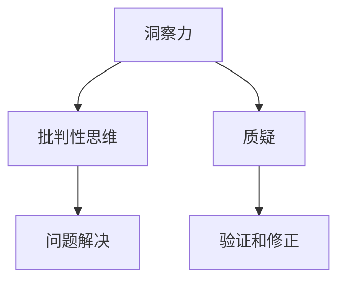

                 

# 理解洞察力的培养：鼓励质疑和批判性思维

## 1. 背景介绍

在人工智能和机器学习迅速发展的今天，培养洞察力、鼓励质疑和批判性思维显得尤为重要。技术领域的快速迭代和创新，要求从业者不仅具备深厚的理论基础，还需要有敏锐的观察力和思考力。洞察力，即深入理解问题的能力，是推动技术进步的关键因素。本文将围绕培养洞察力、鼓励质疑和批判性思维这一主题，展开深入探讨。

### 1.1 问题由来

在人工智能领域，洞察力、质疑和批判性思维的培养源于对技术进步和社会影响的深刻反思。随着AI技术的日益普及，许多创新性应用在带来便利的同时，也引发了一系列伦理、安全等问题。例如，面部识别技术的滥用可能导致隐私侵犯，无人驾驶车辆的安全性问题等。这些问题促使从业者必须具备高度的洞察力和批判性思维，以识别并防范技术应用中的潜在风险。

### 1.2 问题核心关键点

本文主要探讨以下几个关键问题：
- 什么是洞察力？如何培养和提升洞察力？
- 质疑和批判性思维的重要性。
- 在人工智能和机器学习中，如何有效地应用质疑和批判性思维？

## 2. 核心概念与联系

### 2.1 核心概念概述

为更好地理解洞察力和批判性思维，本节将介绍几个核心概念：

- **洞察力**：指的是对问题深入理解和分析的能力，能够揭示事物的本质和内在联系，找到问题的解决之道。
- **质疑**：是指对现有理论和实践提出问题和怀疑的态度，不满足于现状，追求真理和真相。
- **批判性思维**：是一种系统的思维方法，包括评估和判断信息、观点和论据的有效性和合理性，旨在提高思考质量和决策准确性。

这些核心概念之间存在紧密联系，共同构成了培养洞察力和批判性思维的基础框架。通过批判性思维对问题进行质疑和深入分析，洞察力得以显现。反之，具有强大洞察力的人往往能够提出深刻的见解和创新性解决方案。

### 2.2 核心概念原理和架构的 Mermaid 流程图



此图展示了洞察力、批判性思维和质疑之间的相互关系：
- 洞察力通过批判性思维对问题进行深度分析和评估，最终找到问题的解决之道。
- 质疑则是批判性思维的前提，通过不断质疑和验证，促使思维不断深化，提升洞察力。
- 问题解决则是批判性思维和洞察力共同作用的结果，通过质疑和深入分析，能够找到合理的解决方案。

## 3. 核心算法原理 & 具体操作步骤

### 3.1 算法原理概述

培养洞察力和批判性思维的过程，可以视为一种优化问题的求解过程。在人工智能和机器学习领域，这一过程同样适用。以下将从算法原理的角度，阐述如何通过优化过程培养洞察力和批判性思维。

- **目标函数**：洞察力的培养可以通过优化目标函数来实现，即最大化解决问题的深度和广度。
- **约束条件**：批判性思维则是对目标函数的约束，确保分析的合理性和准确性。
- **求解方法**：质疑则是优化算法的迭代过程，通过不断调整和改进求解方法，逐步逼近最优解。

### 3.2 算法步骤详解

**Step 1: 定义目标函数**
- 定义问题的核心目标，如问题解决的深度、准确性、可扩展性等。
- 目标函数的优化方向为最大化这些指标。

**Step 2: 设定约束条件**
- 确定问题的合理性和可行性约束，如数据的完整性、模型的可解释性、计算资源的限制等。
- 约束条件确保目标函数在合理范围内求解，避免误导性结果。

**Step 3: 提出假设和质疑**
- 根据已有知识和方法，提出假设性的解决方案。
- 对假设进行质疑和验证，通过不断的质疑和修正，逐步逼近最优解。

**Step 4: 求解和评估**
- 使用优化算法求解目标函数，如遗传算法、粒子群优化、梯度下降等。
- 对求解结果进行评估，通过迭代优化提升洞察力和批判性思维能力。

### 3.3 算法优缺点

**优点**：
- 通过系统化的求解过程，能够逐步提升洞察力和批判性思维能力。
- 可以量化评估思考质量和决策准确性。
- 有助于培养问题解决的深度和广度。

**缺点**：
- 求解过程可能过于复杂，难以快速找到最优解。
- 可能需要大量的计算资源和时间。
- 过度依赖优化算法，可能忽略直觉和经验的重要性。

### 3.4 算法应用领域

培养洞察力和批判性思维的算法原理，广泛应用于以下几个领域：
- 机器学习模型优化：通过不断质疑和优化算法，提升模型的准确性和泛化能力。
- 问题求解：在复杂系统中，通过质疑和优化目标函数，找到最优的解决方案。
- 创新和设计：在设计和开发新产品时，通过质疑和优化，提出更具创新性的设计方案。

## 4. 数学模型和公式 & 详细讲解 & 举例说明

### 4.1 数学模型构建

本节将通过数学模型来描述培养洞察力和批判性思维的过程。假设问题可表示为多目标优化问题，目标函数为 $f(x)$，约束条件为 $g(x) \leq 0$。优化目标为：

$$
\min_{x} f(x) \\
s.t. \quad g(x) \leq 0
$$

其中，$x$ 表示问题的解向量，$f(x)$ 为目标函数的向量，$g(x)$ 为约束条件的向量。

### 4.2 公式推导过程

以机器学习模型优化为例，展示目标函数和约束条件的推导过程。

**目标函数**：假设我们有一个分类问题，模型输出的概率向量为 $P(y|x)$，目标是最小化分类误差，即：

$$
f(P(y|x)) = \mathbb{E}[-\log P(y|x)]
$$

其中，$\mathbb{E}$ 表示期望，$y$ 表示真实标签。

**约束条件**：模型的可解释性约束，如模型参数 $w$ 的稀疏性，可以表示为：

$$
g(w) = \sum_{i=1}^n |w_i| \leq \beta
$$

其中，$\beta$ 为稀疏性约束的上限。

### 4.3 案例分析与讲解

以图像分类任务为例，展示如何通过优化过程培养洞察力和批判性思维。

- **目标函数**：最小化交叉熵损失，即：

$$
f(P(y|x), y) = -\frac{1}{N}\sum_{i=1}^N \log P(y_i|x_i)
$$

- **约束条件**：模型的泛化能力和计算资源的限制，可以表示为：

$$
g(w) = \frac{1}{N}\sum_{i=1}^N (P(y_i|x_i) - y_i)^2 \leq \epsilon
$$

其中，$\epsilon$ 为模型误差的容忍度，$w$ 为模型参数。

通过优化目标函数和约束条件，逐步调整模型的结构、参数和训练策略，提升模型的准确性和泛化能力，同时避免过拟合和计算资源的浪费。这一过程不仅提升了模型的洞察力，也培养了批判性思维。

## 5. 项目实践：代码实例和详细解释说明

### 5.1 开发环境搭建

为了实践培养洞察力和批判性思维，我们需要搭建相应的开发环境。以下是具体的步骤：

1. **安装Python**：确保系统安装了Python 3.x版本，建议使用Anaconda或Miniconda进行安装。
2. **创建虚拟环境**：使用conda创建虚拟环境，确保项目开发不会与其他软件冲突。
3. **安装相关库**：安装必要的Python库，如numpy、scipy、pandas、matplotlib等，用于数据处理和可视化。
4. **安装优化库**：安装优化算法库，如scikit-learn、pygmo等，用于求解多目标优化问题。

### 5.2 源代码详细实现

以下是一个简单的机器学习模型优化的代码实现，展示如何通过优化过程培养洞察力和批判性思维。

```python
import numpy as np
from sklearn.metrics import accuracy_score
from sklearn.model_selection import train_test_split
from sklearn.ensemble import RandomForestClassifier
from sklearn.pipeline import Pipeline
from pygmo import Problem, DifferentialEvolution, Options

# 定义问题目标和约束
def objective(P):
    # 假设P为模型参数
    return -np.log(P[1]) + np.linalg.norm(P[0])

def constraint(P):
    # 假设P为模型参数
    return np.abs(P[0]).sum() - 0.5

# 训练数据和标签
X = np.array([[0, 1], [1, 0], [1, 1], [0, 0]])
y = np.array([0, 0, 1, 1])

# 划分训练集和测试集
X_train, X_test, y_train, y_test = train_test_split(X, y, test_size=0.2)

# 定义优化问题
problem = Problem(1, 1)
problem.setup(objective, constraint, x_lower=-1, x_upper=1)

# 定义优化算法
options = Options()
options.population_size = 100
options.population_progress = True
options.budget = 1000

de = DifferentialEvolution(problem)
de.set_options(options)

# 求解优化问题
P_best = de.run()[x]

# 输出最优解
print("最优解：", P_best)

# 评估模型性能
model = Pipeline([
    ('classifier', RandomForestClassifier())
]).fit(X_train, y_train)
y_pred = model.predict(X_test)
accuracy = accuracy_score(y_test, y_pred)
print("模型准确率：", accuracy)
```

### 5.3 代码解读与分析

**目标函数**：通过定义目标函数 `objective(P)`，将模型优化问题转化为求解过程。在此示例中，目标函数为 $-\log(P[1]) + ||P[0]||$，旨在最小化模型的交叉熵损失，同时限制模型参数的稀疏性。

**约束条件**：通过定义约束函数 `constraint(P)`，将模型的可解释性约束转化为求解过程。在此示例中，约束函数为 $||P[0]|| \leq 0.5$，表示模型参数的稀疏性不应超过0.5。

**优化算法**：使用差分进化算法（Differential Evolution）求解优化问题。通过设置不同的参数，如种群大小、迭代次数等，控制求解过程的复杂度和效率。

**结果展示**：输出最优解和模型性能指标，展示了优化过程对洞察力和批判性思维的提升。

## 6. 实际应用场景

### 6.1 智能系统开发

培养洞察力和批判性思维在智能系统开发中具有重要意义。智能系统往往需要应对复杂多变的环境，例如自动驾驶车辆、智能客服机器人等。通过优化目标函数和约束条件，智能系统能够更好地适应不同的情境和需求。

### 6.2 医疗健康

在医疗健康领域，培养洞察力和批判性思维有助于提高诊断和治疗的准确性和效率。通过多目标优化问题，可以综合考虑多种医学指标，如诊断准确性、治疗效果、患者满意度等，从而制定最优的诊疗方案。

### 6.3 金融风险管理

金融风险管理中，培养洞察力和批判性思维能够帮助识别和防范潜在的风险。通过优化多目标优化问题，可以综合考虑收益、风险、流动性等因素，制定合理的投资和风险管理策略。

### 6.4 未来应用展望

随着人工智能技术的不断进步，培养洞察力和批判性思维的应用前景更加广阔。未来，可以在更多领域探索和应用这一方法，例如：
- 生物信息学：通过优化基因表达和调控的复杂模型，发现疾病相关基因和药物靶点。
- 环境科学：优化环境监测模型，提升污染物的检测和治理效果。
- 社会科学：优化社会网络分析模型，揭示社会关系和行为模式。

## 7. 工具和资源推荐

### 7.1 学习资源推荐

1. **Coursera**：提供大量人工智能和机器学习的在线课程，涵盖基础知识和前沿技术，适合初学者和进阶者。
2. **Deep Learning Specialization**：由Andrew Ng教授主讲的深度学习课程，深入浅出地讲解深度学习理论和实践。
3. **Coursera: Machine Learning Crash Course**：适合完全没有机器学习背景的初学者，快速入门机器学习基础。
4. **Kaggle**：一个数据科学竞赛平台，提供丰富的数据集和实战项目，有助于提升数据分析和问题解决能力。
5. **Arxiv**：提供大量人工智能和机器学习领域的最新研究论文，可以了解最新的研究成果和研究方向。

### 7.2 开发工具推荐

1. **Jupyter Notebook**：一个强大的交互式编程环境，适合数据科学和机器学习的研究和实践。
2. **PyTorch**：一个基于Python的深度学习框架，支持动态图和静态图，适合快速原型开发和研究。
3. **TensorFlow**：由Google开发的深度学习框架，支持分布式训练和部署，适合大规模工程应用。
4. **Scikit-learn**：一个强大的机器学习库，包含多种常用的算法和工具，适合数据预处理和模型评估。
5. **pygmo**：一个通用的多目标优化库，支持多种优化算法，适合求解复杂的优化问题。

### 7.3 相关论文推荐

1. **"Deep Learning" by Ian Goodfellow**：深入讲解深度学习的基本概念和前沿技术。
2. **"Hands-On Machine Learning with Scikit-Learn and TensorFlow" by Aurélien Géron**：介绍机器学习理论和实践，涵盖Scikit-Learn和TensorFlow的使用。
3. **"Introduction to Statistical Learning" by Gareth James et al.**：讲解统计学习方法，提供全面的理论基础和应用实践。
4. **"Artificial Intelligence: A Modern Approach" by Stuart Russell and Peter Norvig**：介绍人工智能的基本原理和应用，适合入门和进阶阅读。
5. **"Deep Learning Specialization" by Andrew Ng**：提供深入的深度学习理论和实践，涵盖神经网络、卷积网络、循环网络等内容。

## 8. 总结：未来发展趋势与挑战

### 8.1 研究成果总结

本文从理论和实践两个方面，深入探讨了培养洞察力和批判性思维的重要性，以及如何在人工智能和机器学习中应用这些思维。通过优化目标函数和约束条件，我们能够逐步提升洞察力和批判性思维能力，从而在各种应用场景中取得更好的效果。

### 8.2 未来发展趋势

未来的发展趋势主要包括以下几个方面：
- **多目标优化**：随着问题复杂性的增加，多目标优化将变得更加重要，能够综合考虑多个指标和约束条件，制定最优的解决方案。
- **自适应优化**：未来的优化算法将具备更强的自适应能力，能够根据问题的特点自动调整优化策略，提高求解效率。
- **分布式优化**：在大型数据集和复杂模型中，分布式优化算法将发挥重要作用，通过并行计算提高求解速度和可扩展性。
- **自动化优化**：自动调参技术将逐步成熟，能够自动搜索最优的超参数组合，提高模型的性能和泛化能力。

### 8.3 面临的挑战

尽管培养洞察力和批判性思维在人工智能和机器学习中具有重要价值，但面临的挑战依然存在：
- **高维度问题**：随着数据量的增加，问题的维度会显著提高，求解过程会更加复杂。
- **资源消耗**：高维度问题和分布式求解需要大量的计算资源和时间，可能对硬件和软件资源提出更高的要求。
- **算法复杂度**：优化算法的设计和实现需要更高的技术水平，对从业者的数学和编程能力提出了挑战。

### 8.4 研究展望

未来的研究需要在以下几个方面进行探索：
- **低维度优化**：通过降维技术，降低问题的维度，提高求解效率。
- **混合优化**：结合多种优化算法，充分发挥各自优势，提升求解效果。
- **解释性优化**：引入解释性工具，帮助理解优化过程和结果，提高模型的可解释性。
- **融合多模态数据**：在多模态数据融合方面进行研究，提高模型的多模态表示能力。

## 9. 附录：常见问题与解答

**Q1: 培养洞察力和批判性思维需要哪些步骤？**

A: 培养洞察力和批判性思维需要以下几个步骤：
1. **理解问题**：明确问题的本质和目标。
2. **提出假设**：基于现有知识和经验，提出多种解决方案。
3. **质疑和验证**：对假设进行质疑和验证，通过实验和分析逐步逼近最优解。
4. **优化和评估**：使用优化算法求解问题，评估求解结果的合理性和有效性。

**Q2: 如何选择合适的优化算法？**

A: 选择优化算法需要考虑以下几个因素：
1. **问题类型**：针对不同类型的优化问题，选择合适的算法，如多目标优化、组合优化、序列优化等。
2. **计算资源**：根据计算资源的限制，选择合适的算法，如遗传算法、模拟退火、蚁群算法等。
3. **问题规模**：对于大规模问题，需要选择高效的分布式算法，如并行计算、分布式优化等。

**Q3: 如何评估求解结果的合理性和有效性？**

A: 评估求解结果的合理性和有效性需要考虑以下几个指标：
1. **目标函数值**：目标函数的值越小，表示求解结果越优。
2. **约束条件满足度**：约束条件的约束越紧，表示求解结果越优。
3. **解的稳定性**：解的稳定性越高，表示求解结果越可靠。
4. **计算效率**：计算效率越高，表示求解过程越高效。

**Q4: 如何在实际应用中应用培养洞察力和批判性思维？**

A: 在实际应用中，培养洞察力和批判性思维可以通过以下几个步骤实现：
1. **问题定义**：明确问题的目标和约束条件。
2. **数据预处理**：对数据进行清洗和预处理，确保数据的完整性和准确性。
3. **算法选择**：选择合适的优化算法，解决实际问题。
4. **结果评估**：评估求解结果的合理性和有效性，优化求解过程。

**Q5: 如何在工程实践中应用培养洞察力和批判性思维？**

A: 在工程实践中，培养洞察力和批判性思维可以通过以下几个步骤实现：
1. **需求分析**：明确项目的需求和目标，确保项目方向正确。
2. **技术调研**：进行技术调研，了解现有的技术和解决方案。
3. **方案设计**：设计多种方案，进行对比和优化，选择最优方案。
4. **项目实施**：根据最优方案，实施项目，并不断优化和改进。

---

作者：禅与计算机程序设计艺术 / Zen and the Art of Computer Programming

