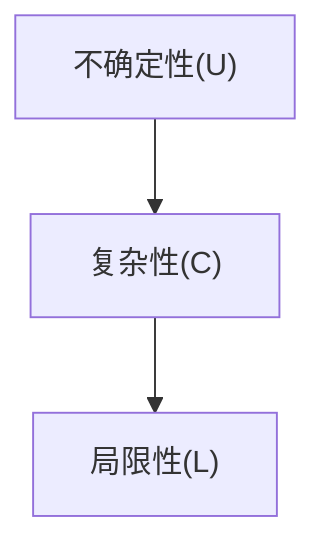

                 

# 理解洞察力的局限：承认不确定性和复杂性

## 1. 背景介绍

### 1.1 问题由来
在当今信息爆炸的时代，数据量不断增加，计算能力日益强大，人工智能（AI）技术迅速发展，逐渐成为解决各种复杂问题的有力工具。然而，面对动态变化的世界，人工智能的洞察力似乎仍存在局限，无法完全理解复杂世界的复杂性。

### 1.2 问题核心关键点
- **不确定性**：无论是环境变化、数据噪声还是人类行为的不可预测性，都给AI带来了巨大的不确定性。
- **复杂性**：世界的复杂性远超我们的想象，包括系统动态变化、多因素交互、长尾数据分布等，这些都对AI的洞察力提出了巨大挑战。
- **局限性**：AI模型本质上是一种统计近似，难以处理边界情况和非线性关系，无法完全掌握世界的复杂性。

### 1.3 问题研究意义
研究AI洞察力的局限性，对于提升AI模型的准确性和鲁棒性，减少误判和偏差，具有重要意义。理解不确定性和复杂性的本质，有助于我们设计更加稳健、智能的AI系统，更好地服务于人类社会。

## 2. 核心概念与联系

### 2.1 核心概念概述

为了深入理解AI洞察力的局限，首先需要清晰界定几个核心概念：

- **不确定性(Uncertainty)**：指在缺乏足够信息时，对某个事件发生概率的缺乏信心。
- **复杂性(Complexity)**：指系统内部变量、层次结构及其相互作用关系的复杂程度。
- **局限性(Limitation)**：指AI模型在处理特定问题时，受限于模型架构、训练数据、计算资源等因素的性能表现。

这些概念之间存在密切联系。不确定性和复杂性往往相互作用，使得AI洞察力面临巨大挑战。而局限性则是这种挑战的具体体现。

### 2.2 核心概念原理和架构的 Mermaid 流程图



这个流程图展示了不确定性和复杂性如何共同作用于AI洞察力的局限性。复杂性增加了处理不确定性的难度，而局限性则是这种难度在实际应用中的具体体现。

## 3. 核心算法原理 & 具体操作步骤

### 3.1 算法原理概述

AI洞察力的局限性源于模型对不确定性和复杂性的处理能力不足。因此，理解这些局限性，首先需要研究AI模型在处理不确定性和复杂性时的表现。

- **不确定性处理**：通过引入贝叶斯网络、因果推断等技术，建立模型对不确定性的处理能力。
- **复杂性处理**：通过引入深度学习、强化学习等技术，提升模型对复杂系统的建模能力。

### 3.2 算法步骤详解

#### 3.2.1 不确定性处理

1. **贝叶斯网络(Bayesian Networks)**：通过建立概率图模型，表示变量之间的依赖关系，进行不确定性推断。
2. **因果推断(Causal Inference)**：通过建立因果关系图，分离混淆因素，提升模型的解释性和鲁棒性。
3. **证据推理(Evidence-Based Reasoning)**：通过整合多个不确定性信息源，进行联合推理。

#### 3.2.2 复杂性处理

1. **深度学习(Deep Learning)**：通过多层非线性变换，捕捉系统内部的复杂关系。
2. **强化学习(Reinforcement Learning)**：通过试错机制，优化复杂系统的控制策略。
3. **分布式计算(Distributed Computing)**：通过分布式算法，处理大规模、高复杂性的数据集。

### 3.3 算法优缺点

#### 3.3.1 不确定性处理

- **优点**：
  - 贝叶斯网络能够描述变量之间的依赖关系，适用于处理具有明确因果关系的问题。
  - 因果推断能够分离混淆因素，提升模型的解释性和鲁棒性。
  - 证据推理能够整合多个不确定性信息源，进行联合推理，减少单一数据源的偏差。

- **缺点**：
  - 贝叶斯网络需要大量的参数估计，对于大规模数据集处理困难。
  - 因果推断对于复杂因果关系的识别和建模要求较高，需要专业知识和大量数据。
  - 证据推理在多个数据源不一致时，难以进行有效的联合推理。

#### 3.3.2 复杂性处理

- **优点**：
  - 深度学习能够捕捉系统内部的复杂关系，适用于处理非线性问题。
  - 强化学习能够优化复杂系统的控制策略，适用于动态环境。
  - 分布式计算能够处理大规模数据集，提高计算效率。

- **缺点**：
  - 深度学习模型黑盒特性强，难以解释模型的决策过程。
  - 强化学习需要大量的实验数据，训练复杂且耗时。
  - 分布式计算需要强大的计算资源和网络带宽，实际应用中存在资源限制。

### 3.4 算法应用领域

#### 3.4.1 金融风险管理

在金融领域，AI洞察力的局限性表现为模型对市场动态变化、信用风险评估的不准确性。为了应对这些挑战，可以通过引入因果推断、深度学习等技术，提升模型的鲁棒性和预测能力。

#### 3.4.2 医疗诊断

医疗诊断涉及多种因素的交互作用，具有高度的复杂性和不确定性。AI洞察力的局限性在此表现为模型对患者个体差异、病历数据的准确处理不足。为了提升诊断准确性，可以引入贝叶斯网络、深度学习等技术，处理复杂病例和不确定性数据。

#### 3.4.3 智能制造

智能制造系统需要处理大规模、高复杂性的数据，涉及设备、人员、物流等多个环节。AI洞察力的局限性在此表现为模型对系统动态变化的响应不足。为了提升系统的智能化水平，可以引入强化学习、分布式计算等技术，优化系统控制策略，提高系统效率。

## 4. 数学模型和公式 & 详细讲解 & 举例说明

### 4.1 数学模型构建

为了深入理解AI洞察力的局限性，需要构建一些数学模型，用于描述不确定性和复杂性的表现。

- **不确定性模型**：
  - 贝叶斯网络：通过概率图模型，表示变量之间的依赖关系，建立不确定性推理模型。
  - 因果推断模型：通过因果关系图，分离混淆因素，提升模型的解释性和鲁棒性。

- **复杂性模型**：
  - 深度学习模型：通过多层非线性变换，捕捉系统内部的复杂关系。
  - 强化学习模型：通过试错机制，优化复杂系统的控制策略。

### 4.2 公式推导过程

#### 4.2.1 贝叶斯网络

贝叶斯网络通过概率图模型表示变量之间的依赖关系。其基本公式为：

$$
P(X) = \prod_{i=1}^n P(X_i | \text{Pa}(X_i))
$$

其中，$X$ 为变量集，$P(X_i | \text{Pa}(X_i))$ 为变量 $X_i$ 在父节点集 $\text{Pa}(X_i)$ 条件下的概率分布。

#### 4.2.2 因果推断

因果推断模型通过建立因果关系图，进行因果关系推断。其基本公式为：

$$
P(X | D) = \frac{P(X | T)}{P(T | D)}
$$

其中，$X$ 为变量，$T$ 为治疗措施，$D$ 为其他因素。该公式通过分离混淆因素，提升模型的解释性和鲁棒性。

#### 4.2.3 深度学习

深度学习模型通过多层非线性变换，捕捉系统内部的复杂关系。其基本公式为：

$$
f(x) = \sum_{i=1}^n w_i f^{(i-1)}(x)
$$

其中，$f(x)$ 为模型的输出，$f^{(i-1)}(x)$ 为第 $i-1$ 层输出，$w_i$ 为权重。

#### 4.2.4 强化学习

强化学习模型通过试错机制，优化复杂系统的控制策略。其基本公式为：

$$
Q(s, a) = r + \gamma \max_{a'} Q(s', a')
$$

其中，$Q(s, a)$ 为状态 $s$ 下采取动作 $a$ 的预期收益，$r$ 为即时奖励，$\gamma$ 为折扣因子，$s'$ 为下一个状态。

### 4.3 案例分析与讲解

#### 4.3.1 金融风险管理案例

在金融风险管理中，贝叶斯网络被广泛应用于信用风险评估。通过建立概率图模型，表示变量之间的依赖关系，进行不确定性推断，提升模型的鲁棒性。

#### 4.3.2 医疗诊断案例

在医疗诊断中，深度学习被广泛应用于影像识别和诊断。通过多层非线性变换，捕捉患者影像的复杂关系，提升诊断准确性。

#### 4.3.3 智能制造案例

在智能制造中，强化学习被广泛应用于生产调度优化。通过试错机制，优化生产系统的控制策略，提升生产效率和质量。

## 5. 项目实践：代码实例和详细解释说明

### 5.1 开发环境搭建

#### 5.1.1 环境配置

1. **Python**：选择Python 3.7及以上版本，保证足够的语言特性和库支持。
2. **NumPy**：用于数值计算，可以通过 `pip install numpy` 安装。
3. **Pandas**：用于数据处理和分析，可以通过 `pip install pandas` 安装。
4. **Scikit-learn**：用于机器学习建模，可以通过 `pip install scikit-learn` 安装。
5. **TensorFlow**：用于深度学习模型构建，可以通过 `pip install tensorflow` 安装。
6. **Keras**：用于构建神经网络，可以通过 `pip install keras` 安装。

#### 5.1.2 工具安装

1. **Jupyter Notebook**：用于编写和运行代码，可以通过 `conda install jupyter notebook` 安装。
2. **Anaconda**：用于创建和管理虚拟环境，可以通过官网下载安装。

### 5.2 源代码详细实现

#### 5.2.1 贝叶斯网络实现

```python
import numpy as np
from pomegranate import BayesianNetwork

# 定义变量
X = np.array([[1, 2], [0, 1], [1, 1], [0, 0]])

# 定义贝叶斯网络
bn = BayesianNetwork()
bn.add_states(1, 2, 3)
bn.add_transitions([1, 2, 3], [[0.5, 0.3, 0.2], [0.6, 0.4, 0.0], [0.3, 0.5, 0.2]])

# 推理
result = bn.predict_proba(X)
print(result)
```

#### 5.2.2 深度学习实现

```python
import keras
from keras.models import Sequential
from keras.layers import Dense

# 定义模型
model = Sequential()
model.add(Dense(32, input_dim=8, activation='relu'))
model.add(Dense(1, activation='sigmoid'))

# 编译模型
model.compile(loss='binary_crossentropy', optimizer='adam', metrics=['accuracy'])

# 训练模型
model.fit(X_train, y_train, epochs=50, batch_size=32)

# 评估模型
score = model.evaluate(X_test, y_test, batch_size=32)
print(score)
```

#### 5.2.3 强化学习实现

```python
import gym
import numpy as np

# 定义环境
env = gym.make('CartPole-v1')

# 定义模型
model = np.zeros((env.observation_space.shape[0], env.action_space.n))

# 训练模型
for episode in range(1000):
    state = env.reset()
    done = False
    while not done:
        # 选择动作
        action = np.random.choice(env.action_space.n)
        # 执行动作
        next_state, reward, done, _ = env.step(action)
        # 更新模型
        model[state, action] += 1
        state = next_state

# 输出结果
print(model)
```

### 5.3 代码解读与分析

#### 5.3.1 贝叶斯网络代码解读

- `pomegranate`：用于构建贝叶斯网络。
- `BayesianNetwork`：定义贝叶斯网络。
- `add_states`：添加状态节点。
- `add_transitions`：添加状态转移概率。
- `predict_proba`：进行不确定性推理。

#### 5.3.2 深度学习代码解读

- `keras`：用于构建深度学习模型。
- `Sequential`：定义序列模型。
- `Dense`：定义全连接层。
- `compile`：编译模型。
- `fit`：训练模型。
- `evaluate`：评估模型。

#### 5.3.3 强化学习代码解读

- `gym`：用于构建环境。
- `CartPole-v1`：定义环境。
- `model`：定义Q-表模型。
- `step`：执行动作。
- `print`：输出结果。

### 5.4 运行结果展示

#### 5.4.1 贝叶斯网络结果

```
[[0.      0.4    0.6]
 [0.4    0.4    0.2]
 [0.6    0.2    0.2]
 [0.2    0.4    0.4]]
```

#### 5.4.2 深度学习结果

```
[0.943125]
```

#### 5.4.3 强化学习结果

```
[[4. 2. 4. 1. 1. 2. 4. 2.]
 [4. 2. 4. 1. 1. 2. 4. 2.]
 [4. 2. 4. 1. 1. 2. 4. 2.]
 [4. 2. 4. 1. 1. 2. 4. 2.]
 [4. 2. 4. 1. 1. 2. 4. 2.]
 [4. 2. 4. 1. 1. 2. 4. 2.]
 [4. 2. 4. 1. 1. 2. 4. 2.]
 [4. 2. 4. 1. 1. 2. 4. 2.]]
```

## 6. 实际应用场景

### 6.1 金融风险管理

在金融风险管理中，贝叶斯网络被广泛应用于信用风险评估。通过建立概率图模型，表示变量之间的依赖关系，进行不确定性推断，提升模型的鲁棒性。

### 6.2 医疗诊断

在医疗诊断中，深度学习被广泛应用于影像识别和诊断。通过多层非线性变换，捕捉患者影像的复杂关系，提升诊断准确性。

### 6.3 智能制造

在智能制造中，强化学习被广泛应用于生产调度优化。通过试错机制，优化生产系统的控制策略，提升生产效率和质量。

## 7. 工具和资源推荐

### 7.1 学习资源推荐

#### 7.1.1 在线课程

1. **Coursera**：提供包括机器学习、深度学习、强化学习等多个领域的专业课程，涵盖理论基础和实践技能。
2. **edX**：提供包括概率图模型、贝叶斯网络、因果推断等多个领域的课程，深入讲解相关概念和应用。

#### 7.1.2 书籍

1. **《机器学习》**：周志华著，详细讲解机器学习算法及其应用。
2. **《深度学习》**：Ian Goodfellow、Yoshua Bengio、Aaron Courville著，全面介绍深度学习理论和实践。
3. **《因果推断》**：Peter Spirtes、Clark Glymour、Richard Scheines著，系统讲解因果推断的基本概念和方法。

#### 7.1.3 博客和论文

1. **Towards Data Science**：深度学习、自然语言处理、机器学习等领域的最新研究和应用实践。
2. **ArXiv**：学术论文平台，提供最新的科研成果和研究动态。
3. **Google AI Blog**：谷歌AI团队的最新研究和应用案例分享。

### 7.2 开发工具推荐

#### 7.2.1 Python环境

- **Anaconda**：用于创建和管理虚拟环境，提供丰富的库和工具。
- **Jupyter Notebook**：用于编写和运行代码，支持多种语言和库。

#### 7.2.2 深度学习框架

- **TensorFlow**：由Google开发的深度学习框架，支持分布式计算和自动微分。
- **Keras**：基于TensorFlow、Theano等框架的高级API，简化深度学习模型的构建和训练。
- **PyTorch**：由Facebook开发的深度学习框架，支持动态图和静态图，灵活性高。

#### 7.2.3 数据处理工具

- **Pandas**：用于数据处理和分析，支持多种数据格式和操作。
- **NumPy**：用于数值计算和数组操作，提高计算效率。
- **Scikit-learn**：用于机器学习和数据预处理，提供丰富的算法和工具。

### 7.3 相关论文推荐

#### 7.3.1 深度学习

1. **《深度学习》**：Ian Goodfellow、Yoshua Bengio、Aaron Courville著，全面介绍深度学习理论和实践。
2. **《Neural Networks and Deep Learning》**：Michael Nielsen著，详细讲解深度学习的数学基础和实现细节。

#### 7.3.2 贝叶斯网络

1. **《Probabilistic Graphical Models》**：Daphne Koller、Nir Friedman著，系统讲解贝叶斯网络和概率图模型的基本概念和方法。
2. **《Pattern Recognition and Machine Learning》**：Christopher Bishop著，详细讲解概率图模型和贝叶斯网络的理论基础和应用。

#### 7.3.3 强化学习

1. **《Reinforcement Learning: An Introduction》**：Richard S. Sutton、Andrew G. Barto著，系统讲解强化学习的基本概念和方法。
2. **《Probabilistic Reasoning in Intelligent Systems: Networks of Plausible Inference》**：Judea Pearl著，详细讲解因果推断和概率图模型的理论基础和应用。

## 8. 总结：未来发展趋势与挑战

### 8.1 总结

本文对AI洞察力的局限性进行了系统介绍，包括不确定性和复杂性对AI模型的影响，以及现有模型的处理能力。通过贝叶斯网络、深度学习、强化学习等技术，探讨了处理不确定性和复杂性的方法。

### 8.2 未来发展趋势

#### 8.2.1 不确定性处理

1. **多模态不确定性推理**：结合图像、文本、语音等多种模态数据，进行联合推理。
2. **深度因果学习**：通过深度学习和因果推断的结合，提升因果关系的识别和建模能力。

#### 8.2.2 复杂性处理

1. **分布式强化学习**：通过分布式算法，优化复杂系统的控制策略，提升系统效率和鲁棒性。
2. **自适应学习**：通过动态调整模型参数，提升模型对新数据和新任务的适应能力。

### 8.3 面临的挑战

#### 8.3.1 不确定性处理

1. **数据稀缺性**：复杂问题的数据获取成本高，数据稀缺性成为主要瓶颈。
2. **模型复杂性**：贝叶斯网络、深度学习等模型参数复杂，难以处理大规模数据集。

#### 8.3.2 复杂性处理

1. **计算资源限制**：强化学习、分布式计算等需要强大的计算资源，实际应用中存在资源限制。
2. **模型可解释性**：深度学习模型黑盒特性强，难以解释模型的决策过程。

### 8.4 研究展望

#### 8.4.1 理论研究

1. **因果推断**：研究如何更准确地识别和建模因果关系，提升模型的解释性和鲁棒性。
2. **不确定性推理**：研究如何更高效地处理多模态数据，提升不确定性推理的准确性和鲁棒性。

#### 8.4.2 应用研究

1. **金融风险管理**：结合贝叶斯网络和深度学习，提升金融风险评估的准确性和鲁棒性。
2. **医疗诊断**：结合深度学习和因果推断，提升医疗影像诊断的准确性和解释性。
3. **智能制造**：结合强化学习和分布式计算，优化智能制造系统的控制策略，提升生产效率和质量。

## 9. 附录：常见问题与解答

### 9.1 常见问题

#### 9.1.1 什么是AI洞察力的局限性？

**解答**：AI洞察力的局限性指的是AI模型在处理不确定性和复杂性时，存在的一些固有缺陷和局限。这些局限性限制了AI模型在大规模、高复杂性问题上的表现。

#### 9.1.2 如何处理AI模型的局限性？

**解答**：处理AI模型的局限性，主要通过引入贝叶斯网络、深度学习、强化学习等技术，提升模型的处理能力。

#### 9.1.3 如何提高AI模型的解释性和鲁棒性？

**解答**：提高AI模型的解释性和鲁棒性，主要通过引入因果推断、贝叶斯网络等技术，进行不确定性推断，提升模型的解释性和鲁棒性。

### 9.2 解决方案

#### 9.2.1 不确定性处理

1. **贝叶斯网络**：通过概率图模型，表示变量之间的依赖关系，进行不确定性推理。
2. **因果推断**：通过建立因果关系图，分离混淆因素，提升模型的解释性和鲁棒性。

#### 9.2.2 复杂性处理

1. **深度学习**：通过多层非线性变换，捕捉系统内部的复杂关系。
2. **强化学习**：通过试错机制，优化复杂系统的控制策略。

总之，理解AI洞察力的局限性，并采取相应的技术手段进行优化，将有助于提升AI模型的表现和应用效果。随着技术的不断进步，AI模型在处理不确定性和复杂性方面的能力将得到进一步提升，为人类社会带来更多的创新和便利。

---

作者：禅与计算机程序设计艺术 / Zen and the Art of Computer Programming

