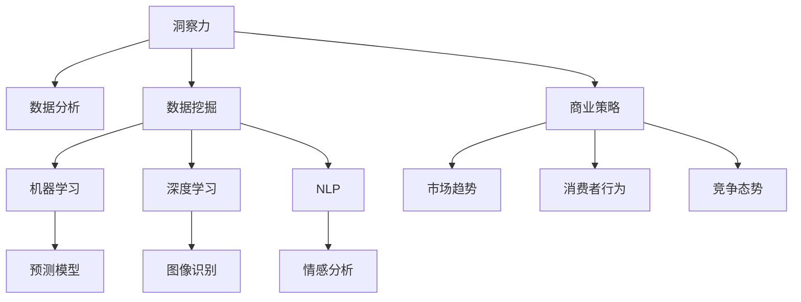

                 

# 理解洞察力的应用：在商业策略中的实践

> 关键词：洞察力,商业策略,数据分析,数据挖掘,机器学习,深度学习,自然语言处理

## 1. 背景介绍

### 1.1 问题由来

在今天这个信息爆炸的时代，商业决策者面临着前所未有的挑战。海量数据的涌现使得决策者难以迅速找到真正有价值的洞察力。这种洞察力，是商业竞争中的重要战略资源，能够帮助企业发现市场机会、预测未来趋势、制定精准营销策略，进而占据市场先机。

然而，传统的商业洞察力获取方式（如调查问卷、市场分析报告）已经难以满足实时、全面、精准的需求。机器学习和大数据分析技术的发展，为商业洞察力的获取开辟了新天地。通过构建智能商业洞察系统，企业可以高效、精准地从海量数据中提取有价值的洞察力，支持其商业决策。

### 1.2 问题核心关键点

构建智能商业洞察系统，主要涉及以下几个关键问题：

- **数据获取与处理**：如何高效、全面地收集和清洗数据，是构建洞察系统的前提。
- **数据分析与挖掘**：如何从海量数据中提取有意义的模式和洞察，是洞察系统的核心。
- **商业洞察呈现**：如何将分析结果转化为直观、易懂的商业洞察，辅助决策者使用。
- **系统性能优化**：如何提高系统的响应速度、准确性和稳定性，确保商业洞察的可靠性和高效性。

这些核心问题共同构成了商业洞察系统的建设框架，使其能够为企业提供精准、实时的商业洞察力支持。

### 1.3 问题研究意义

理解商业洞察力在商业决策中的作用，对于提升企业竞争力、优化资源配置、驱动商业创新具有重要意义：

1. **提高决策效率**：通过智能分析，决策者可以快速获得关键洞察，减少信息过载和决策延误。
2. **降低决策风险**：基于数据驱动的洞察，可以避免人为偏见和经验误导，提升决策的科学性和准确性。
3. **增强市场响应能力**：实时、动态的商业洞察支持，可以帮助企业快速响应市场变化，抓住商业机会。
4. **优化资源配置**：通过对历史数据和趋势的分析，企业可以更合理地配置资源，提高运营效率。
5. **驱动创新发展**：洞察系统可以揭示市场潜力和新机会，推动企业创新和业务模式升级。

## 2. 核心概念与联系

### 2.1 核心概念概述

为了深入理解商业洞察力在商业策略中的应用，我们首先需要了解几个核心概念：

- **洞察力（Insight）**：商业洞察力是指从数据中提取出的、对企业战略具有指导意义的洞察和结论。通常包括市场趋势、消费者行为、竞争态势等方面的信息。
- **商业策略（Business Strategy）**：商业策略是指企业为实现其目标，在市场竞争中采取的整体行动方案和规划。商业策略的制定需要依赖于准确的商业洞察。
- **数据分析（Data Analytics）**：数据分析是指使用统计、机器学习等方法，从数据中提取有用信息和洞察的过程。
- **数据挖掘（Data Mining）**：数据挖掘是指从大量数据中发现隐含的模式和关系，帮助企业做出更好的决策。
- **机器学习（Machine Learning）**：机器学习是指利用算法和模型，自动从数据中学习规律，做出预测和决策。
- **深度学习（Deep Learning）**：深度学习是指利用多层神经网络，处理复杂数据和高维特征，提取更深层次的洞察。
- **自然语言处理（Natural Language Processing, NLP）**：自然语言处理是指利用计算机处理和理解人类语言的技术，有助于从文本数据中提取有价值的洞察。

这些概念之间的逻辑关系可以通过以下Mermaid流程图来展示：



这个流程图展示了各个概念之间的联系和交互：

1. 商业洞察力通过数据分析和数据挖掘获取。
2. 数据分析和数据挖掘可以采用机器学习和深度学习方法。
3. 深度学习在处理复杂数据时尤其有效，如文本和图像数据。
4. 自然语言处理技术可以用于文本数据的分析。
5. 商业洞察力可以指导商业策略的制定。
6. 商业策略的制定依赖于对市场趋势、消费者行为和竞争态势的理解。

这些概念共同构成了商业洞察系统的建设基础，使其能够高效地从数据中提取商业洞察力，支撑商业决策。

## 3. 核心算法原理 & 具体操作步骤
### 3.1 算法原理概述

商业洞察系统的核心算法原理基于数据分析和机器学习技术。其基本流程如下：

1. **数据采集与预处理**：从不同来源收集数据，并进行清洗、归一化等预处理。
2. **特征提取**：使用数据挖掘和特征工程技术，从原始数据中提取有意义的特征。
3. **模型训练与评估**：采用机器学习算法，训练预测模型，并在验证集上评估模型性能。
4. **商业洞察生成**：将训练好的模型应用于实际数据，生成商业洞察和决策建议。
5. **洞察力呈现**：将商业洞察转化为易于理解的图表、报告和推荐，辅助决策者使用。

### 3.2 算法步骤详解

以下详细介绍商业洞察系统的核心算法步骤：

**Step 1: 数据采集与预处理**

- **数据来源**：商业洞察系统需要收集各种类型的数据，包括客户数据、市场数据、运营数据等。常见数据来源包括CRM系统、ERP系统、社交媒体、搜索引擎等。
- **数据清洗**：清洗数据以去除缺失值、异常值和噪声，确保数据质量。
- **数据转换**：将数据转换为统一格式，便于后续处理和分析。

**Step 2: 特征提取**

- **特征选择**：从原始数据中选择有意义的特征，减少冗余信息，提高模型性能。
- **特征工程**：对原始特征进行转换、组合等操作，生成新的特征。例如，对时间序列数据进行滑动窗口处理，生成新的特征点。

**Step 3: 模型训练与评估**

- **选择合适的模型**：根据问题类型选择合适的模型，如线性回归、决策树、随机森林、神经网络等。
- **数据划分**：将数据划分为训练集、验证集和测试集，进行交叉验证。
- **模型训练**：使用训练集训练模型，并在验证集上评估模型性能，调整模型参数。
- **模型评估**：使用测试集评估模型泛化能力，确保模型性能稳定。

**Step 4: 商业洞察生成**

- **实时数据处理**：对实时数据进行预处理，提取特征，进行模型预测。
- **商业洞察生成**：根据模型预测结果，生成商业洞察，如市场趋势预测、消费者行为分析、竞争态势评估等。

**Step 5: 洞察力呈现**

- **可视化**：将商业洞察结果可视化，转化为图表、报告等形式。
- **推荐系统**：根据洞察结果，生成推荐策略，如市场推广计划、产品定价策略等。

### 3.3 算法优缺点

商业洞察系统的算法优点包括：

- **高效性**：通过自动化数据处理和模型训练，大大提高了分析效率。
- **准确性**：基于数据驱动的分析方法，能够提供高质量的商业洞察。
- **灵活性**：可以适应不同类型和规模的数据，灵活应用多种分析方法。
- **可扩展性**：可以构建分布式系统，支持大规模数据处理和分析。

同时，该系统也存在一些缺点：

- **数据依赖**：商业洞察的准确性依赖于数据的质量和完整性。
- **模型复杂性**：复杂的模型可能导致过拟合，需要谨慎选择和调整。
- **实时性问题**：对于实时数据处理，系统需要具备高效的计算能力和资源配置。
- **隐私和安全**：商业洞察系统处理大量敏感数据，需要严格的数据保护措施。

### 3.4 算法应用领域

商业洞察系统在多个领域得到了广泛应用，例如：

- **零售行业**：通过客户数据和市场趋势分析，制定精准的营销策略和库存管理方案。
- **金融行业**：通过交易数据和市场行为分析，进行风险评估和投资决策。
- **物流行业**：通过运输数据和供应链分析，优化物流路线和仓储管理。
- **医疗行业**：通过患者数据和医疗记录分析，提高医疗诊断和治疗效果。
- **电商行业**：通过用户行为数据和市场趋势分析，优化商品推荐和广告投放。

这些领域的应用展示了商业洞察系统在实际商业决策中的强大功能和广泛价值。

## 4. 数学模型和公式 & 详细讲解 & 举例说明

### 4.1 数学模型构建

商业洞察系统涉及多种数学模型，以下以线性回归模型为例进行详细讲解。

假设我们有以下数据集 $\{(x_i, y_i)\}_{i=1}^n$，其中 $x_i$ 为输入特征向量，$y_i$ 为对应目标值。线性回归模型为：

$$
y_i = \beta_0 + \beta_1 x_{i1} + \beta_2 x_{i2} + \cdots + \beta_k x_{ik} + \epsilon_i
$$

其中 $\beta_0, \beta_1, \cdots, \beta_k$ 为回归系数，$\epsilon_i$ 为误差项。

我们的目标是最小化预测误差，构建回归模型。损失函数为：

$$
\mathcal{L}(\beta) = \frac{1}{2n} \sum_{i=1}^n (y_i - (\beta_0 + \beta_1 x_{i1} + \cdots + \beta_k x_{ik}))^2
$$

使用梯度下降算法优化模型参数，最小化损失函数：

$$
\frac{\partial \mathcal{L}}{\partial \beta_j} = \frac{1}{n} \sum_{i=1}^n (y_i - (\beta_0 + \beta_1 x_{i1} + \cdots + \beta_k x_{ik}))
$$

**Step 1: 数据预处理**

- **归一化**：将特征向量 $x_i$ 归一化到 $[0,1]$ 区间，避免不同特征尺度不一导致的影响。
- **特征选择**：通过相关性分析，选择与目标值相关性较高的特征。

**Step 2: 模型训练**

- **梯度下降**：使用随机梯度下降算法，迭代更新回归系数 $\beta$，直至损失函数收敛。

**Step 3: 模型评估**

- **交叉验证**：使用交叉验证方法评估模型泛化能力，选择最优模型。
- **测试集评估**：使用测试集验证模型性能，确保模型稳定。

### 4.2 公式推导过程

以线性回归模型为例，推导最小二乘法求解回归系数的公式。

根据损失函数，我们希望最小化：

$$
\mathcal{L}(\beta) = \frac{1}{2n} \sum_{i=1}^n (y_i - (\beta_0 + \beta_1 x_{i1} + \cdots + \beta_k x_{ik}))^2
$$

对 $\beta_0, \beta_1, \cdots, \beta_k$ 求偏导数：

$$
\frac{\partial \mathcal{L}}{\partial \beta_0} = \frac{1}{n} \sum_{i=1}^n (y_i - \beta_0 - \beta_1 x_{i1} - \cdots - \beta_k x_{ik})
$$
$$
\frac{\partial \mathcal{L}}{\partial \beta_1} = \frac{1}{n} \sum_{i=1}^n (y_i - \beta_0 - \beta_1 x_{i1} - \cdots - \beta_k x_{ik}) x_{i1}
$$
$$
\vdots
$$
$$
\frac{\partial \mathcal{L}}{\partial \beta_k} = \frac{1}{n} \sum_{i=1}^n (y_i - \beta_0 - \beta_1 x_{i1} - \cdots - \beta_k x_{ik}) x_{ik}
$$

将这些导数设置为零，解得：

$$
\beta_0 = \frac{1}{n} \sum_{i=1}^n y_i
$$
$$
\beta_1 = \frac{\sum_{i=1}^n (y_i - \beta_0) x_{i1}}{\sum_{i=1}^n (x_{i1}^2)}
$$
$$
\vdots
$$
$$
\beta_k = \frac{\sum_{i=1}^n (y_i - \beta_0) x_{ik}}{\sum_{i=1}^n (x_{ik}^2)}
$$

以上推导过程展示了线性回归模型最小二乘法的数学原理，说明了如何通过梯度下降算法求解最优回归系数。

### 4.3 案例分析与讲解

以客户流失预测为例，分析商业洞察系统的应用。

**数据集**：我们有一个客户流失数据集，包含客户基本信息、历史交易记录、客户反馈等。

**特征提取**：
- **基本信息**：客户年龄、性别、注册时间。
- **历史交易**：平均交易金额、最近一次交易时间。
- **客户反馈**：满意度评分、投诉次数。

**模型训练**：使用线性回归模型，构建预测客户流失概率的模型。

**商业洞察生成**：根据模型预测结果，生成客户流失预警报告，识别高风险客户。

**洞察力呈现**：通过可视化工具，将客户流失预警报告呈现给决策者，辅助其制定流失客户挽留策略。

## 5. 项目实践：代码实例和详细解释说明
### 5.1 开发环境搭建

为了进行商业洞察系统的开发，需要以下开发环境：

- **Python 3.8**：确保使用最新版本的Python，并兼容多种第三方库。
- **Jupyter Notebook**：用于交互式数据分析和模型训练。
- **Pandas**：用于数据处理和分析。
- **NumPy**：用于数值计算和矩阵操作。
- **Scikit-learn**：用于机器学习模型的训练和评估。
- **Matplotlib**：用于数据可视化。
- **TensorFlow**：用于深度学习模型的训练和推理。
- **Keras**：用于快速搭建深度学习模型。

完成上述环境配置后，即可开始商业洞察系统的开发。

### 5.2 源代码详细实现

以下是一个简单的客户流失预测项目的代码实现：

**数据预处理**

```python
import pandas as pd
import numpy as np

# 读取数据集
data = pd.read_csv('customer_churn.csv')

# 数据清洗
data = data.dropna()

# 特征选择
selected_features = ['age', 'gender', 'registration_time', 'avg_transaction_amount', 'last_transaction_time', 'satisfaction_score', 'complaint_count']

# 特征编码
data = pd.get_dummies(data, columns=selected_features)

# 数据归一化
data = (data - data.mean()) / data.std()
```

**模型训练**

```python
from sklearn.linear_model import LinearRegression

# 划分训练集和测试集
X_train = data.drop('churn', axis=1)
y_train = data['churn']
X_test = data.drop('churn', axis=1)
y_test = data['churn']

# 训练线性回归模型
model = LinearRegression()
model.fit(X_train, y_train)

# 评估模型性能
score = model.score(X_test, y_test)
print('模型评分:', score)
```

**商业洞察生成**

```python
# 预测客户流失概率
churn_prob = model.predict(X_test)

# 生成商业洞察报告
report = pd.DataFrame({'customer_id': data['customer_id'], 'churn_prob': churn_prob})
report = report.sort_values('churn_prob', ascending=False)

# 输出前10个高风险客户
print(report.head(10))
```

**洞察力呈现**

```python
import matplotlib.pyplot as plt

# 绘制高风险客户直方图
plt.hist(churn_prob, bins=50, edgecolor='black')
plt.xlabel('流失概率')
plt.ylabel('客户数量')
plt.title('高流失概率客户分布')
plt.show()
```

### 5.3 代码解读与分析

**数据预处理**

- **数据读取**：使用Pandas库读取CSV格式的数据集。
- **数据清洗**：通过dropna方法删除缺失值，确保数据完整性。
- **特征选择**：选择与客户流失相关的特征，使用get_dummies方法进行编码，转换为独热编码形式。
- **数据归一化**：使用标准差归一化方法，将特征数据转化为均值为0、标准差为1的分布，便于后续模型训练。

**模型训练**

- **模型选择**：选择线性回归模型，使用scikit-learn库的LinearRegression类。
- **数据划分**：将数据集分为训练集和测试集，使用drop和drop方法提取特征和标签。
- **模型训练**：使用fit方法训练模型，将训练集数据和标签传递给模型。
- **模型评估**：使用score方法评估模型性能，返回决定系数R^2。

**商业洞察生成**

- **模型预测**：使用predict方法对测试集进行预测，生成客户流失概率。
- **结果可视化**：将预测结果整理为DataFrame，按照流失概率降序排序。
- **洞察报告**：输出高风险客户的前10名，用于决策参考。

**洞察力呈现**

- **可视化展示**：使用Matplotlib库绘制高流失概率客户的直方图，直观展示客户流失的概率分布。

通过以上代码实现，我们可以看到商业洞察系统的基本流程：数据预处理、模型训练、商业洞察生成和洞察力呈现。这些步骤共同构成了商业洞察系统的核心功能。

## 6. 实际应用场景
### 6.1 智能营销

商业洞察系统在智能营销中的应用非常广泛。通过分析客户行为数据和市场趋势，企业可以制定精准的营销策略，提升广告投放的转化率和ROI。

**应用场景**：电商平台可以通过客户购买行为分析，推荐个性化商品，提高用户粘性和转化率。

**技术实现**：使用商业洞察系统，实时监控用户行为数据，如浏览记录、购买记录、点击率等，进行聚类分析和关联规则挖掘，生成个性化推荐方案。

### 6.2 风险管理

金融行业通过商业洞察系统，可以实时监测市场波动和交易风险，及时调整投资策略，避免损失。

**应用场景**：证券公司可以通过客户交易数据和市场指数分析，预测股票价格变化，优化投资组合。

**技术实现**：使用商业洞察系统，对客户交易数据进行时序分析和预测建模，结合市场指数数据，生成实时风险评估报告。

### 6.3 供应链优化

物流行业通过商业洞察系统，可以优化供应链管理，提高物流效率和成本控制能力。

**应用场景**：配送公司可以通过客户订单数据和历史运输数据，预测未来需求，优化库存和运输计划。

**技术实现**：使用商业洞察系统，对订单数据进行聚类分析，预测客户购买行为和需求变化，生成需求预测报告。

### 6.4 未来应用展望

未来，商业洞察系统将在更多领域得到应用，为企业的决策支持提供更加精准、全面的数据洞察。

- **大数据分析**：随着数据规模的扩大，商业洞察系统将能够处理更多维度和更复杂的数据，提供更深入的洞察力。
- **实时分析**：通过流数据处理技术，商业洞察系统将能够实现实时分析，快速响应市场变化。
- **多模态数据融合**：结合文本、图像、视频等多模态数据，提供更丰富的洞察力。
- **跨领域应用**：商业洞察系统将能够跨越行业边界，提供通用性的洞察力支持。

## 7. 工具和资源推荐
### 7.1 学习资源推荐

为了帮助开发者系统掌握商业洞察力的应用，以下是一些优质的学习资源：

1. **《Python数据科学手册》**：介绍Python在数据科学中的应用，包含数据预处理、机器学习、可视化等内容。
2. **《深度学习》课程**：斯坦福大学开设的深度学习课程，涵盖深度学习的基本原理和应用。
3. **《Python自然语言处理》课程**：北卡罗来纳大学开设的自然语言处理课程，讲解NLP技术在商业应用中的应用。
4. **Kaggle竞赛**：参加Kaggle数据科学竞赛，实践商业洞察系统的构建和优化。
5. **Google Cloud Data Analytics**：提供免费的数据分析和机器学习工具，支持大规模商业洞察系统的构建。

这些资源能够帮助开发者全面掌握商业洞察力的应用，加速其在实际商业决策中的落地。

### 7.2 开发工具推荐

高效的开发离不开优秀的工具支持。以下是几款用于商业洞察系统开发的常用工具：

1. **Jupyter Notebook**：交互式数据分析和模型训练环境，支持Python、R等语言。
2. **PyTorch**：灵活的深度学习框架，支持GPU加速，适用于大规模数据处理。
3. **TensorFlow**：工业级深度学习框架，支持分布式计算，适用于生产部署。
4. **Pandas**：数据处理和分析库，支持大规模数据集操作。
5. **Scikit-learn**：机器学习库，提供多种算法和模型。
6. **Keras**：快速搭建深度学习模型的框架。
7. **Matplotlib**：数据可视化库，支持多种图表展示。
8. **Dask**：分布式数据处理库，支持大规模数据处理。

合理利用这些工具，可以显著提升商业洞察系统的开发效率，提高分析的准确性和速度。

### 7.3 相关论文推荐

商业洞察系统的研究涉及多个学科领域，以下是几篇相关论文，推荐阅读：

1. **《数据挖掘与统计学习基础》**：介绍数据挖掘和统计学习的理论基础，涵盖机器学习、深度学习、自然语言处理等内容。
2. **《商业智能技术与应用》**：分析商业智能技术的原理和应用，涵盖数据分析、商业洞察、决策支持等内容。
3. **《大数据驱动的商业洞察力提升》**：探讨大数据技术在商业洞察中的应用，分析数据挖掘和机器学习在商业决策中的作用。
4. **《商业洞察系统的设计与实现》**：介绍商业洞察系统的构建过程和实现方法，涵盖数据采集、数据处理、模型训练和结果呈现等内容。
5. **《自然语言处理在商业洞察中的应用》**：分析自然语言处理技术在商业洞察中的应用，涵盖情感分析、文本分类、主题建模等内容。

这些论文代表了大数据和商业洞察领域的最新研究成果，有助于深入理解商业洞察系统的原理和应用。

## 8. 总结：未来发展趋势与挑战

### 8.1 总结

本文对商业洞察力的应用进行了全面系统的介绍。首先阐述了商业洞察力在商业决策中的作用，明确了商业洞察系统的建设目标。其次，从原理到实践，详细讲解了商业洞察系统的核心算法和操作步骤，提供了代码实例和详细解释。同时，本文还广泛探讨了商业洞察系统的实际应用场景，展示了其在智能营销、风险管理、供应链优化等多个领域的应用前景。最后，本文精选了商业洞察系统的学习资源和开发工具，力求为开发者提供全方位的技术指引。

通过本文的系统梳理，可以看到，商业洞察系统在商业决策中具有重要的战略价值。通过系统构建和优化，商业洞察系统能够高效地从海量数据中提取有价值的洞察力，支持企业的商业决策。未来，随着技术的不断进步和数据的不断积累，商业洞察系统将进一步拓展其应用领域，为企业提供更加精准、实时的决策支持。

### 8.2 未来发展趋势

展望未来，商业洞察系统将呈现以下几个发展趋势：

1. **自动化程度提升**：商业洞察系统的自动化程度将进一步提升，减少人工干预，提高分析效率。
2. **实时分析能力增强**：通过流数据处理技术，商业洞察系统将能够实现实时分析，快速响应市场变化。
3. **多模态数据融合**：结合文本、图像、视频等多模态数据，提供更丰富的洞察力。
4. **跨领域应用拓展**：商业洞察系统将能够跨越行业边界，提供通用性的洞察力支持。
5. **数据隐私保护**：在数据收集和分析过程中，加强数据隐私保护，确保数据安全。
6. **模型解释性增强**：提高商业洞察系统的解释性，确保其决策过程透明、可解释。
7. **算法优化**：优化商业洞察系统的算法，提升模型性能和泛化能力。

这些趋势将推动商业洞察系统向更加智能化、实时化、精准化的方向发展，为企业决策提供更强大的支持。

### 8.3 面临的挑战

尽管商业洞察系统在实际应用中取得了显著效果，但仍面临以下挑战：

1. **数据质量问题**：数据清洗和预处理过程中，可能会遇到数据缺失、噪声等问题，影响分析结果的准确性。
2. **模型复杂性**：复杂的商业洞察系统需要大量计算资源，可能面临计算效率和模型可解释性问题。
3. **实时响应能力**：对于实时数据处理，系统需要具备高效的计算能力和资源配置。
4. **数据隐私和安全**：商业洞察系统处理大量敏感数据，需要严格的数据保护措施。
5. **模型集成难度**：在多模型集成过程中，可能面临模型冲突和参数优化问题。

### 8.4 研究展望

面对商业洞察系统所面临的挑战，未来的研究需要在以下几个方面寻求新的突破：

1. **自动化数据预处理**：研究自动化数据清洗和预处理方法，提高数据质量。
2. **实时数据处理**：研究流数据处理技术，实现实时分析和决策支持。
3. **多模态数据融合**：研究多模态数据的整合方法，提高洞察力丰富性。
4. **模型解释性增强**：研究模型的解释性方法，提高系统透明度。
5. **跨领域应用**：研究跨领域的商业洞察系统构建方法，提供通用性的洞察力支持。
6. **数据隐私保护**：研究数据隐私保护技术，确保数据安全。
7. **模型优化**：研究模型优化方法，提升系统性能和泛化能力。

这些研究方向的探索将推动商业洞察系统的不断进步，为企业提供更加全面、精准、实时的决策支持。

## 9. 附录：常见问题与解答

**Q1: 商业洞察系统的数据采集和预处理过程中需要注意什么？**

A: 商业洞察系统的数据采集和预处理是系统构建的重要环节。在数据采集过程中，需要注意数据的完整性和准确性，避免缺失和噪声数据对分析结果的影响。在预处理过程中，需要进行数据清洗、归一化、特征选择等操作，确保数据的质量和一致性。

**Q2: 商业洞察系统的模型选择和训练过程中需要注意什么？**

A: 商业洞察系统的模型选择和训练是系统构建的核心环节。在选择模型时，需要根据问题的类型和数据的特点，选择合适的模型算法。在训练过程中，需要进行数据划分、特征工程、模型调参等操作，确保模型的泛化能力和性能稳定性。

**Q3: 商业洞察系统的商业洞察生成和呈现过程中需要注意什么？**

A: 商业洞察系统的商业洞察生成和呈现是系统应用的关键环节。在生成洞察时，需要根据模型的预测结果，生成有意义的洞察结论。在呈现洞察时，需要将洞察结论转化为易于理解的图表、报告等形式，方便决策者使用。

**Q4: 商业洞察系统的自动化程度如何提升？**

A: 商业洞察系统的自动化程度可以通过以下几个方面提升：
1. 自动化数据预处理：使用自动化数据清洗和预处理方法，提高数据质量。
2. 自动化模型训练：使用自动化模型训练工具，自动选择和训练最优模型。
3. 自动化洞察生成和呈现：使用自动化洞察生成工具，自动生成洞察结论和可视化报告。

**Q5: 商业洞察系统如何处理多模态数据？**

A: 商业洞察系统可以通过以下方式处理多模态数据：
1. 数据融合：将不同模态的数据融合在一起，进行统一分析。
2. 特征提取：对不同模态的数据进行特征提取，生成统一的特征向量。
3. 模型集成：将不同模态的模型集成在一起，生成多模态的预测结果。

通过以上常见问题的解答，我们可以更加全面地理解商业洞察系统的构建和优化过程，进一步提升其在实际商业决策中的应用效果。

---

作者：禅与计算机程序设计艺术 / Zen and the Art of Computer Programming

