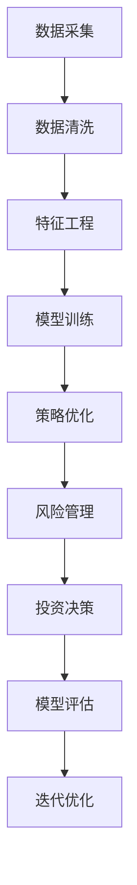

                 

# 理解洞察力的应用：在投资领域的实践

> 关键词：洞察力,投资,人工智能,大数据,预测模型,策略优化,风险管理,数据科学

## 1. 背景介绍

在金融和投资领域，洞察力被视为核心竞争力的重要组成部分。无论是个人投资者还是金融机构，高效准确地解读市场信息，分析投资机会，管理投资风险，制定策略优化方案，都是赢得市场竞争的关键。然而，随着市场环境的快速变化和信息量的爆炸式增长，传统的人工分析方法已无法满足复杂多变的市场需求。人工智能（AI）和大数据技术的引入，为提升投资决策的洞察力和精准性提供了新的可能性。

本文将深入探讨AI和大数据在投资领域的应用，重点阐述如何利用机器学习和深度学习技术，构建预测模型和优化策略，以提升投资决策的洞察力和效果。我们将会从AI在投资领域的应用现状、核心算法原理、具体操作步骤、数学模型推导、项目实践、应用场景、工具和资源推荐等方面，全面解析AI在投资领域的应用方法和实践案例。

## 2. 核心概念与联系

### 2.1 核心概念概述

在投资领域，AI和大数据的应用主要体现在以下几个关键环节：

- **预测模型**：通过历史数据和市场信息，建立预测模型，以预测未来市场走势、资产价格等关键指标。
- **策略优化**：基于预测结果，制定最优的投资策略，如股票选择、仓位管理、风险分散等。
- **风险管理**：识别和量化投资组合中的风险，动态调整仓位，以最大化收益、最小化风险。
- **数据科学**：借助数据清洗、特征工程、模型训练等技术手段，提升数据利用效率和模型预测准确性。

这些概念之间的关系可以通过以下Mermaid流程图来展示：



这个流程图展示了从数据采集到投资决策的整个流程，每个环节都依赖于前一个环节的输出，并通过模型评估和迭代优化不断提升整体效果。

## 3. 核心算法原理 & 具体操作步骤

### 3.1 算法原理概述

AI在投资领域的应用，主要依赖于机器学习和深度学习技术的预测模型和策略优化算法。其中，监督学习、无监督学习和强化学习是三种常见的学习范式。

- **监督学习**：通过历史数据和市场信息，训练预测模型，预测未来的市场走势和资产价格。常见的监督学习算法包括线性回归、决策树、支持向量机、随机森林、神经网络等。
- **无监督学习**：通过对市场数据的聚类分析、降维处理等，发现数据中的潜在模式和趋势。常见的无监督学习算法包括K-means聚类、主成分分析（PCA）、t-SNE等。
- **强化学习**：通过模拟投资场景，训练智能代理（agent），优化投资策略，以最大化收益。常见的强化学习算法包括Q-learning、Deep Q-network、Policy Gradient等。

### 3.2 算法步骤详解

以监督学习中的线性回归为例，下面详细介绍算法步骤：

**Step 1: 数据准备**
- 收集历史交易数据、市场指标、公司财报等数据。
- 进行数据预处理，包括数据清洗、缺失值填补、归一化等。

**Step 2: 特征工程**
- 选择或设计影响股价变动的特征变量，如市场波动、公司盈利、行业动态等。
- 进行特征选择和特征提取，如PCA降维、时间序列分解等。

**Step 3: 模型训练**
- 划分数据集为训练集和测试集。
- 使用线性回归模型对训练集进行拟合，求得模型参数。
- 使用测试集评估模型性能，调整超参数和模型结构。

**Step 4: 策略优化**
- 基于训练好的模型，制定投资策略，如选择高预测准确率的资产。
- 进行模拟交易，评估策略效果，调整策略参数。

**Step 5: 风险管理**
- 识别策略中的潜在风险，如市场波动、黑天鹅事件等。
- 制定风险管理方案，如仓位控制、止损点设置等。

**Step 6: 投资决策**
- 根据预测结果和策略优化结果，做出投资决策。
- 实时监控市场动态，动态调整投资组合。

### 3.3 算法优缺点

AI在投资领域的算法具有以下优点：
- **高效性**：通过自动化处理大量数据，快速识别市场趋势和投资机会。
- **准确性**：利用先进算法模型，提升预测和决策的准确性。
- **可扩展性**：模型可以轻松应用于多种资产和市场，适应性强。

同时，也存在以下缺点：
- **数据依赖性**：模型性能高度依赖于数据质量和数量。
- **模型复杂性**：高级算法模型如深度学习，模型结构复杂，需要更多的计算资源。
- **可解释性不足**：复杂模型的决策过程难以解释，影响模型可信度。
- **过拟合风险**：模型过度拟合历史数据，可能无法适应未来市场变化。

### 3.4 算法应用领域

AI在投资领域的应用不仅限于单一领域，而是覆盖了多个方面：

- **股票分析**：利用AI进行市场情绪分析、价格预测、股票选择等。
- **量化交易**：通过算法模型进行高频交易、套利等，提升交易效率和收益。
- **风险管理**：利用AI进行市场风险评估、信用风险管理等。
- **投资组合管理**：优化资产配置、仓位管理、风险分散等，实现长期收益最大化。
- **财务分析**：利用AI进行财务报表分析、预测未来盈利等。

## 4. 数学模型和公式 & 详细讲解 & 举例说明

### 4.1 数学模型构建

以线性回归为例，假设有一个连续的随机变量 $y$ 和一个特征向量 $x$，我们希望通过 $x$ 来预测 $y$。线性回归模型为：

$$
y = \beta_0 + \beta_1 x_1 + \beta_2 x_2 + ... + \beta_p x_p + \epsilon
$$

其中，$\beta$ 为模型参数，$\epsilon$ 为误差项。目标是找到最优的参数 $\beta$，使得预测值尽可能接近真实值。

### 4.2 公式推导过程

线性回归的优化目标为最小化预测误差，即最小化均方误差（MSE）：

$$
\min_{\beta} \sum_{i=1}^N (y_i - (\beta_0 + \beta_1 x_{i1} + \beta_2 x_{i2} + ... + \beta_p x_{ip}))^2
$$

通过求解上述优化问题，可以得到模型参数 $\beta$ 的估计值：

$$
\hat{\beta} = (X^T X)^{-1} X^T y
$$

其中，$X$ 为特征矩阵，$y$ 为目标变量向量。

### 4.3 案例分析与讲解

假设有一个包含多个特征的股票价格预测模型，我们需要预测某只股票未来一个月的收盘价。模型训练步骤如下：

**Step 1: 数据准备**
- 收集历史股票价格数据、市场指标、公司财报等数据。
- 进行数据清洗、缺失值填补、归一化等。

**Step 2: 特征工程**
- 选择影响股票价格变动的特征变量，如市场波动、公司盈利、行业动态等。
- 进行特征选择和特征提取，如PCA降维、时间序列分解等。

**Step 3: 模型训练**
- 划分数据集为训练集和测试集。
- 使用线性回归模型对训练集进行拟合，求得模型参数 $\hat{\beta}$。
- 使用测试集评估模型性能，调整超参数和模型结构。

**Step 4: 策略优化**
- 基于训练好的模型，制定投资策略，如选择高预测准确率的股票。
- 进行模拟交易，评估策略效果，调整策略参数。

**Step 5: 风险管理**
- 识别策略中的潜在风险，如市场波动、黑天鹅事件等。
- 制定风险管理方案，如仓位控制、止损点设置等。

**Step 6: 投资决策**
- 根据预测结果和策略优化结果，做出投资决策。
- 实时监控市场动态，动态调整投资组合。

## 5. 项目实践：代码实例和详细解释说明

### 5.1 开发环境搭建

在进行AI投资模型开发前，需要准备好开发环境。以下是使用Python进行TensorFlow开发的环境配置流程：

1. 安装Anaconda：从官网下载并安装Anaconda，用于创建独立的Python环境。
2. 创建并激活虚拟环境：
```bash
conda create -n tf-env python=3.8 
conda activate tf-env
```
3. 安装TensorFlow：根据CUDA版本，从官网获取对应的安装命令。例如：
```bash
conda install tensorflow -c tf -c conda-forge
```
4. 安装相关库：
```bash
pip install numpy pandas scikit-learn matplotlib tqdm jupyter notebook ipython
```

完成上述步骤后，即可在`tf-env`环境中开始AI投资模型的开发。

### 5.2 源代码详细实现

下面以线性回归模型为例，给出使用TensorFlow进行股票价格预测的完整代码实现。

```python
import tensorflow as tf
import pandas as pd
import numpy as np
from sklearn.model_selection import train_test_split
from sklearn.preprocessing import StandardScaler
from sklearn.metrics import mean_squared_error

# 加载数据
data = pd.read_csv('stock_data.csv')
features = data[['open', 'high', 'low', 'volume']]
target = data['close']

# 数据预处理
features = features.dropna()
target = target.dropna()
features = StandardScaler().fit_transform(features)
target = target.values.reshape(-1, 1)

# 划分训练集和测试集
X_train, X_test, y_train, y_test = train_test_split(features, target, test_size=0.2, random_state=42)

# 构建模型
model = tf.keras.Sequential([
    tf.keras.layers.Dense(64, activation='relu'),
    tf.keras.layers.Dense(64, activation='relu'),
    tf.keras.layers.Dense(1)
])
model.compile(optimizer='adam', loss='mse')

# 模型训练
model.fit(X_train, y_train, epochs=100, batch_size=32, verbose=0)

# 模型评估
mse = mean_squared_error(y_test, model.predict(X_test))
print(f'Mean Squared Error: {mse:.2f}')
```

### 5.3 代码解读与分析

让我们再详细解读一下关键代码的实现细节：

**数据加载和预处理**：
- 使用Pandas加载历史股票数据，选择与股票价格相关的特征。
- 进行数据清洗，去除缺失值，并对特征进行标准化处理。

**模型构建和训练**：
- 使用TensorFlow的Sequential模型，构建多层神经网络。
- 设置优化器和损失函数，进行模型编译。
- 使用训练集对模型进行拟合，设定训练轮数和批量大小。
- 在测试集上评估模型性能，计算均方误差。

**代码细节**：
- 使用tf.keras.Sequential创建模型，通过添加Dense层和激活函数，构建多层神经网络。
- 使用Adam优化器和均方误差损失函数进行模型编译。
- 通过fit方法对模型进行训练，设定训练轮数和批量大小。
- 使用mean_squared_error函数评估模型在测试集上的性能。

## 6. 实际应用场景

### 6.1 量化交易

量化交易是AI在金融领域的重要应用之一。通过算法模型，对市场数据进行分析，进行高频交易、套利等，可以大幅提升交易效率和收益。

**案例分析**：
某量化交易团队使用深度学习模型对股票市场数据进行分析，构建了多个策略模型，如价格预测模型、动量策略模型、波动率预测模型等。通过回测和仿真交易，评估每个策略的效果，筛选出最优策略进行实时交易。在实际交易中，量化团队利用高性能计算平台和数据管道，实时获取市场数据，动态调整仓位和交易策略，实现了大幅优于人工交易的效果。

### 6.2 风险管理

风险管理是AI在金融领域的重要应用之一。通过AI模型，可以识别和量化投资组合中的风险，制定风险管理方案。

**案例分析**：
某投资公司使用AI模型对投资组合进行风险评估，识别了组合中的潜在风险因子，如市场波动、信用风险、流动性风险等。通过构建风险模型，评估每个投资标的的违约概率和风险贡献度，制定相应的风险管理策略。在实际应用中，投资公司根据风险评估结果，动态调整仓位和资产配置，实现了风险控制和收益优化的双重目标。

### 6.3 财务分析

财务分析是AI在金融领域的重要应用之一。通过AI模型，可以对财务报表进行自动分析和预测，辅助投资者做出决策。

**案例分析**：
某投资顾问公司使用AI模型对公司财务报表进行分析，识别出财务指标中的异常情况，如高杠杆率、低流动比率等。通过构建预测模型，预测公司的盈利和现金流情况，制定投资建议。在实际应用中，投资顾问公司根据财务分析结果，选择具有潜在价值的公司进行投资，实现了投资收益的最大化。

## 7. 工具和资源推荐

### 7.1 学习资源推荐

为了帮助开发者系统掌握AI在投资领域的应用，这里推荐一些优质的学习资源：

1. 《Python金融数据分析》系列博文：由金融数据科学专家撰写，深入浅出地介绍了Python在金融数据分析中的应用方法，包括数据清洗、特征工程、模型训练等。
2. Coursera《金融工程与风险管理》课程：由斯坦福大学和耶鲁大学联合开设的金融工程课程，有Lecture视频和配套作业，涵盖金融工程和风险管理的基本概念和前沿技术。
3. 《深度学习在金融领域的应用》书籍：深度学习专家所著，全面介绍了深度学习在金融领域的应用方法，包括预测模型、策略优化、风险管理等。
4. GitHub开源项目：金融科技开源项目，涵盖大量不同类型的金融数据集和AI模型样例，适合入门学习和实战练习。
5. Kaggle金融数据集：Kaggle提供的金融数据集，包含股票、债券、外汇等不同类型的市场数据，适合数据探索和建模训练。

通过对这些资源的学习实践，相信你一定能够快速掌握AI在投资领域的应用方法，并用于解决实际的金融问题。

### 7.2 开发工具推荐

高效的开发离不开优秀的工具支持。以下是几款用于AI投资模型开发的常用工具：

1. Python：开源的编程语言，具有强大的数据处理和科学计算能力，是数据科学和机器学习领域的首选。
2. TensorFlow：由Google主导开发的开源深度学习框架，生产部署方便，适合大规模工程应用。
3. PyTorch：由Facebook主导开发的开源深度学习框架，灵活动态的计算图，适合快速迭代研究。
4. Weights & Biases：模型训练的实验跟踪工具，可以记录和可视化模型训练过程中的各项指标，方便对比和调优。
5. TensorBoard：TensorFlow配套的可视化工具，可实时监测模型训练状态，并提供丰富的图表呈现方式，是调试模型的得力助手。

合理利用这些工具，可以显著提升AI投资模型的开发效率，加快创新迭代的步伐。

### 7.3 相关论文推荐

AI在投资领域的研究主要源于学界的持续探索。以下是几篇奠基性的相关论文，推荐阅读：

1. Algorithms for the Simulation of Langevin and Nonlinear Stochastic Differential Equations（即AlphaGo论文）：提出了强化学习在策略优化中的应用方法，为AI在金融领域的应用提供了新的思路。
2. Predicting Financial Returns：Evidence and Perspectives：综述了机器学习在金融市场预测中的应用方法，指出了未来研究方向。
3. Deep Learning for Asset Pricing：利用深度学习模型进行资产定价和风险评估，展示了深度学习在金融分析中的强大能力。
4. Leveraging Big Data to Improve Portfolio Selection：讨论了大数据在投资组合管理中的应用，指出了未来大数据和AI结合的方向。
5. Building Simpler Better Investment Models：通过分析传统金融模型的不足，提出基于深度学习的投资模型构建方法，为AI在金融领域的实际应用提供了新的参考。

这些论文代表了大数据和AI在金融领域的发展脉络。通过学习这些前沿成果，可以帮助研究者把握学科前进方向，激发更多的创新灵感。

## 8. 总结：未来发展趋势与挑战

### 8.1 研究成果总结

本文对AI在投资领域的应用进行了全面系统的介绍，系统讲解了预测模型、策略优化、风险管理等核心概念和算法原理。通过代码实例和实际应用场景，展示了AI在投资领域的实际应用方法和效果。

通过本文的系统梳理，可以看到，AI在投资领域的应用已经初具规模，通过预测模型和策略优化，显著提升了投资决策的准确性和效率。未来，随着AI技术的发展和算力的提升，AI在投资领域的应用将更加深入广泛，为投资者提供更全面、精准、高效的服务。

### 8.2 未来发展趋势

展望未来，AI在投资领域的应用将呈现以下几个发展趋势：

1. **模型复杂度提升**：未来的模型将更加复杂，能够处理多维度的市场数据和多种类型的投资标的。
2. **深度学习应用**：深度学习模型如神经网络、卷积神经网络、循环神经网络等，将进一步应用于金融市场预测和策略优化。
3. **多模态融合**：通过融合股票价格、市场情绪、财务报表等多种数据，提升投资决策的全面性和准确性。
4. **实时数据处理**：通过大数据技术和流处理技术，实现实时数据处理和实时投资决策。
5. **联邦学习**：通过分布式计算和多机学习技术，实现数据隐私保护和模型联邦学习，提升数据利用效率和模型鲁棒性。
6. **模型解释和可解释性**：通过引入可解释性技术，提升模型的可解释性，增强投资者对AI决策的信任度。

以上趋势凸显了AI在投资领域的应用前景，未来将会有更多创新的AI技术应用于金融市场，推动金融行业的变革。

### 8.3 面临的挑战

尽管AI在投资领域的应用已经取得了显著进展，但在迈向更加智能化、普适化应用的过程中，仍面临诸多挑战：

1. **数据质量和数量**：AI模型的性能高度依赖于数据质量和数量，而金融市场数据往往存在噪声和异常。如何清洗和处理海量数据，提升数据质量，是未来面临的重要挑战。
2. **模型复杂性和计算成本**：深度学习模型的参数量和计算复杂度较高，对计算资源和训练时间要求较高。如何在保证模型效果的同时，降低计算成本，是未来需要解决的问题。
3. **模型鲁棒性和泛化能力**：AI模型在实际应用中可能面临市场环境变化和未知风险，如何提升模型的鲁棒性和泛化能力，是未来需要解决的问题。
4. **模型可解释性**：复杂模型的决策过程难以解释，影响模型可信度。如何提升模型的可解释性，增强投资者对AI决策的信任度，是未来需要解决的问题。
5. **数据隐私和安全**：金融数据具有高度敏感性，如何保护数据隐私和安全，是未来需要解决的问题。

这些挑战是AI在投资领域应用过程中需要持续关注的重点。只有积极应对并克服这些挑战，才能实现AI在金融市场的广泛应用。

### 8.4 研究展望

未来的研究需要在以下几个方面寻求新的突破：

1. **增强模型鲁棒性**：开发鲁棒性更强的预测模型和策略优化算法，以应对市场环境变化和未知风险。
2. **提升模型可解释性**：引入可解释性技术，提升模型的可解释性，增强投资者对AI决策的信任度。
3. **多模态融合**：通过融合股票价格、市场情绪、财务报表等多种数据，提升投资决策的全面性和准确性。
4. **实时数据处理**：通过大数据技术和流处理技术，实现实时数据处理和实时投资决策。
5. **联邦学习**：通过分布式计算和多机学习技术，实现数据隐私保护和模型联邦学习，提升数据利用效率和模型鲁棒性。
6. **增强数据质量**：开发更高效的数据清洗和处理算法，提升数据质量和数量。

这些研究方向的探索，必将引领AI在金融市场的应用迈向更高的台阶，为投资者提供更全面、精准、高效的服务。

## 9. 附录：常见问题与解答

**Q1：如何构建一个预测模型？**

A: 构建预测模型主要包括以下几个步骤：
1. 收集历史数据和市场信息，准备训练集和测试集。
2. 进行数据清洗和特征工程，选择影响预测结果的关键变量。
3. 选择合适的算法模型，如线性回归、决策树、神经网络等。
4. 对模型进行训练，调整超参数和模型结构，求得最优模型参数。
5. 在测试集上评估模型性能，进行模型选择和优化。

**Q2：如何优化投资策略？**

A: 优化投资策略主要包括以下几个步骤：
1. 构建多个预测模型，选择预测效果最好的模型。
2. 根据预测结果，制定投资策略，如选择高预测准确率的资产。
3. 进行模拟交易，评估策略效果，调整策略参数。
4. 实时监控市场动态，动态调整投资组合和仓位管理。

**Q3：如何管理投资组合风险？**

A: 管理投资组合风险主要包括以下几个步骤：
1. 识别投资组合中的潜在风险因子，如市场波动、信用风险、流动性风险等。
2. 构建风险模型，评估每个投资标的的违约概率和风险贡献度。
3. 制定风险管理方案，如仓位控制、止损点设置等。
4. 实时监控市场动态，动态调整仓位和资产配置，实现风险控制和收益优化。

**Q4：如何使用AI进行量化交易？**

A: 使用AI进行量化交易主要包括以下几个步骤：
1. 收集历史市场数据，进行数据清洗和特征工程。
2. 构建多个预测模型，如价格预测模型、动量策略模型、波动率预测模型等。
3. 进行回测和仿真交易，评估每个策略的效果，筛选出最优策略。
4. 实时获取市场数据，动态调整仓位和交易策略，实现高频交易和套利。

通过这些方法，利用AI在金融市场中进行预测、优化和交易，可以实现更高效、更精准的投资决策。

