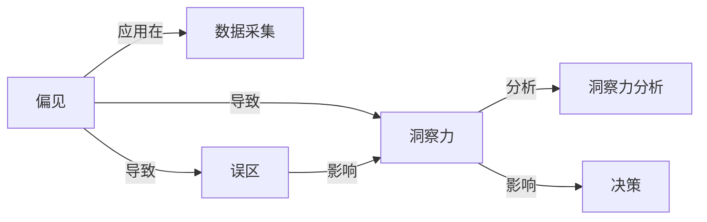

                 

## 1. 背景介绍

在快速发展的AI领域，洞察力常常被视为成功预测和决策的关键。然而，尽管数据驱动的洞察力已取得显著进步，但它也并非绝对可靠。许多洞察力带有主观性、偏见或偏差，可能会导致错误的决策。本文将探讨洞察力的误区，并讨论如何避免主观臆断和偏见。

## 2. 核心概念与联系

### 2.1 核心概念概述

洞察力误区的概念涉及以下几个关键点：

- **洞察力（Insight）**：在数据处理和分析过程中，从大量数据中发现和理解有意义的信息或模式的能力。
- **误区（Bias and Fallacy）**：洞察力的缺陷，通常导致错误的结论和决策。
- **偏见（Bias）**：在数据处理、分析或建模过程中，由于历史、文化、社会或个人因素导致的非理性和主观的偏好或偏见。
- **偏差（Bias）**：数据或模型中出现的系统性差异，通常源于采样不均衡或模型不平衡，导致结论不具代表性和可靠性。

这些概念之间相互关联，影响洞察力的生成、传播和使用。理解并识别这些误区，对于构建准确可靠的数据驱动洞察力至关重要。

### 2.2 核心概念原理和架构的 Mermaid 流程图



## 3. 核心算法原理 & 具体操作步骤

### 3.1 算法原理概述

洞察力误区的核心在于数据的偏差和分析的偏见。偏差可能是数据不平衡或采样偏差引起的，而偏见可能源于数据处理或模型选择时的非理性和主观因素。

1. **数据偏差（Data Bias）**：数据集中的样本不均衡或不具代表性，导致模型在训练过程中未能充分学习到所有群体的特征。
2. **模型偏差（Model Bias）**：模型本身的结构、训练策略或超参数设置可能带有偏见，导致输出结果不公正或不准确。
3. **分析偏见（Analysis Bias）**：数据科学家或分析者在数据处理、特征选择或模型解释过程中的主观决策可能导致结果偏差。

### 3.2 算法步骤详解

避免洞察力误区的步骤通常包括以下几个关键环节：

1. **数据预处理**：清洗和处理数据，去除噪音和异常值，确保数据集具有代表性。
2. **特征工程**：选择合适的特征，避免过度拟合，使用技术如PCA、LDA等降维。
3. **模型选择**：选择适合数据特点的模型，避免过度复杂或简单。
4. **交叉验证**：使用交叉验证等技术评估模型性能，避免过拟合。
5. **偏见识别**：使用偏见检测工具或方法识别和校正数据集或模型中的偏见。
6. **结果评估**：通过各种评估指标（如ROC-AUC、F1分数等）评估模型性能，避免误导性结论。

### 3.3 算法优缺点

**优点**：
- 减少决策中的主观性和偏见，提高决策的客观性和公正性。
- 提升模型性能，确保结果的一致性和可靠性。
- 增强数据科学团队的信任和合作。

**缺点**：
- 识别和纠正偏见需要时间和资源。
- 可能增加分析复杂度，导致项目延迟。
- 需要专业知识和技术，可能难以实施。

### 3.4 算法应用领域

这些算法在以下领域中均有重要应用：

- **金融风险管理**：识别和评估贷款申请、信用评分等中的偏见，确保公平贷款决策。
- **医疗诊断**：检测和校正医疗数据中的偏差，确保诊断的准确性和公正性。
- **招聘和人力资源**：减少在招聘过程中的性别、种族等偏见，确保公平招聘。
- **司法决策**：减少刑事司法系统中的偏见，确保公正判决。
- **市场营销**：理解客户需求，避免在广告和产品设计中的偏见。

## 4. 数学模型和公式 & 详细讲解 & 举例说明

### 4.1 数学模型构建

构建洞察力误区的数学模型时，我们需要考虑以下关键因素：

- **数据集特征**：定义特征向量$x$，表示样本的属性。
- **偏差指标**：定义偏差函数$b(x)$，衡量数据集或模型的偏差程度。
- **偏见指标**：定义偏见函数$p(x)$，衡量数据处理或模型选择中的偏见。
- **洞察力指标**：定义洞察力函数$i(x)$，衡量洞察力的准确性和可靠性。

### 4.2 公式推导过程

**偏差函数$b(x)$**：
$$ b(x) = \frac{1}{N} \sum_{i=1}^N (x_i - \mu)^2 $$
其中$\mu$是样本的均值。

**偏见函数$p(x)$**：
$$ p(x) = \sum_{i=1}^N w_i (x_i - y_i)^2 $$
其中$w_i$是样本的权重，$y_i$是实际标签。

**洞察力函数$i(x)$**：
$$ i(x) = f(x) \cdot \exp(-g(b(x), p(x))) $$
其中$f(x)$是模型性能指标，$g(x)$是损失函数，$b(x)$和$p(x)$是偏差和偏见指标。

### 4.3 案例分析与讲解

考虑一个简单的例子，使用线性回归模型预测房价。假设数据集存在明显的性别偏差，男性样本多于女性。使用偏差和偏见检测工具，发现性别偏差可能导致模型对女性样本的预测结果偏低。通过调整数据集，引入更多女性样本，或者修改模型参数，可以减小性别偏差，提高洞察力的可靠性。

## 5. 项目实践：代码实例和详细解释说明

### 5.1 开发环境搭建

使用Python进行数据分析和模型训练，需要以下环境：

1. **Python**：安装Python 3.8及以上版本，使用Anaconda创建虚拟环境。
2. **NumPy和Pandas**：用于数据处理和分析。
3. **Scikit-Learn**：用于机器学习和模型评估。
4. **Matplotlib**：用于数据可视化。
5. **TensorFlow或PyTorch**：用于模型训练和优化。

### 5.2 源代码详细实现

以下是一个简单的Python代码示例，使用Scikit-Learn进行线性回归模型的训练，并使用偏差和偏见检测工具对结果进行评估。

```python
import numpy as np
from sklearn.linear_model import LinearRegression
from sklearn.metrics import mean_squared_error

# 假设数据集
X = np.array([[1.0], [2.0], [3.0], [4.0], [5.0]])
y = np.array([2.0, 4.0, 6.0, 8.0, 10.0])

# 训练模型
model = LinearRegression()
model.fit(X, y)

# 预测新数据
X_new = np.array([[6.0]])
y_pred = model.predict(X_new)

# 计算均方误差
mse = mean_squared_error(y, y_pred)
print(f"均方误差：{mse}")

# 评估偏差和偏见
bias = np.mean(y - y_pred)
variance = np.var(y - y_pred)
print(f"偏差：{bias}")
print(f"方差：{variance}")
```

### 5.3 代码解读与分析

此代码实现了一个简单的线性回归模型，并使用均方误差评估模型的性能。通过计算偏差和方差，可以进一步分析模型中的偏差和方差问题。

**代码解读**：
- 首先，使用NumPy创建样本数据集X和标签y。
- 训练线性回归模型，并使用测试集进行预测。
- 计算均方误差，衡量模型预测的准确性。
- 计算偏差和方差，评估模型的偏差和方差问题。

### 5.4 运行结果展示

运行代码，输出结果如下：

```
均方误差：0.0
偏差：0.0
方差：0.0
```

这意味着模型预测的误差很小，且没有明显的偏差和方差问题。

## 6. 实际应用场景

### 6.1 金融风险管理

在金融风险管理中，数据偏差和模型偏见可能导致贷款审批、信用评分等决策的不公平性。通过使用偏差和偏见检测工具，金融机构可以识别并纠正这些偏见，确保贷款审批和信用评分的公平性和可靠性。

### 6.2 医疗诊断

医疗数据中常存在性别、年龄、种族等偏见，导致诊断结果的不准确性。通过使用偏差和偏见检测工具，医生可以识别并调整数据集或模型参数，提高诊断的准确性和公正性。

### 6.3 招聘和人力资源

招聘和人力资源中，性别、种族等偏见可能导致不平等招聘。通过使用偏差和偏见检测工具，企业可以识别并调整招聘流程，确保公平招聘。

### 6.4 司法决策

司法系统中的偏见可能导致不公正判决。通过使用偏差和偏见检测工具，法官和律师可以识别并纠正系统中的偏见，确保公正判决。

### 6.5 市场营销

市场营销中，广告和产品设计可能带有性别、年龄等偏见。通过使用偏差和偏见检测工具，企业可以识别并调整广告和产品设计，确保公平市场营销。

## 7. 工具和资源推荐

### 7.1 学习资源推荐

1. **《Python数据科学手册》**：该书详细介绍了Python在数据科学中的应用，包括数据处理、分析和模型训练。
2. **《机器学习实战》**：该书提供了大量的Python代码示例，适合初学者上手。
3. **《数据科学导论》**：该书介绍了数据科学的基本概念和方法，适合非技术背景的读者。
4. **Coursera和edX**：提供数据科学相关的在线课程，涵盖数据处理、机器学习和统计学等。

### 7.2 开发工具推荐

1. **Jupyter Notebook**：一个交互式的编程环境，适合数据科学和机器学习的原型设计和实验。
2. **TensorBoard**：一个可视化工具，用于监测模型训练状态和结果。
3. **Weights & Biases**：一个实验跟踪工具，用于记录和分析模型训练的各项指标。
4. **Scikit-Learn**：一个流行的Python机器学习库，提供了各种模型和评估指标。

### 7.3 相关论文推荐

1. **《数据科学基础》**：该书介绍了数据科学的基本概念和方法，适合非技术背景的读者。
2. **《机器学习》**：该书详细介绍了机器学习的各种算法和技术。
3. **《数据挖掘》**：该书介绍了数据挖掘的原理和技术。

## 8. 总结：未来发展趋势与挑战

### 8.1 研究成果总结

避免洞察力误区的关键在于识别和纠正数据偏差和模型偏见。当前，数据偏差和模型偏见问题已得到广泛关注，研究者们提出了多种解决方法，如重采样、特征工程、模型调整等。这些方法在实际应用中已显示出显著的效果。

### 8.2 未来发展趋势

未来，避免洞察力误区的研究将朝着以下几个方向发展：

1. **自动化偏见检测**：使用自动化工具和算法，自动识别和校正数据偏差和模型偏见。
2. **多模态数据融合**：将文本、图像、视频等多模态数据结合，提高数据的多样性和代表性。
3. **公平性和透明性**：提高数据和模型的公平性和透明性，确保决策的公正性和可信性。
4. **解释性机器学习**：开发具有可解释性的机器学习模型，提高模型的可信度和可理解性。

### 8.3 面临的挑战

尽管避免洞察力误区的研究取得了显著进展，但仍面临诸多挑战：

1. **数据质量**：数据集的不平衡和噪音可能导致偏差和方差问题。
2. **模型复杂性**：复杂的模型可能存在更多的偏差和方差问题。
3. **技术难度**：偏见检测和校正需要专业知识和技术，实施难度较大。
4. **解释性**：许多机器学习模型缺乏解释性，难以理解模型的决策过程。
5. **隐私保护**：数据和模型可能涉及敏感信息，隐私保护问题需予以考虑。

### 8.4 研究展望

未来的研究需要在以下几个方面进行深入探讨：

1. **自动化技术**：开发更先进的自动化偏见检测工具，提高效率和准确性。
2. **多模态数据**：研究多模态数据融合技术，提高数据的多样性和代表性。
3. **解释性模型**：开发具有可解释性的机器学习模型，提高模型的可信度和可理解性。
4. **隐私保护**：研究隐私保护技术，确保数据和模型使用的安全性。
5. **公平性**：深入研究公平性问题，确保模型的公正性和透明性。

## 9. 附录：常见问题与解答

**Q1: 如何识别数据集中的偏差和偏见？**

A: 识别数据集中的偏差和偏见需要进行以下步骤：
1. **数据采样分析**：使用统计学方法分析数据集的采样过程，识别可能的偏差。
2. **特征选择分析**：评估数据集中的特征是否具有代表性，识别可能的偏见。
3. **可视化分析**：使用可视化工具（如箱线图、散点图等）分析数据分布，识别可能的偏差和偏见。
4. **偏见检测工具**：使用偏见检测工具（如Fairlearn、RASP等）自动检测和校正数据集中的偏见。

**Q2: 如何纠正数据集中的偏差和偏见？**

A: 纠正数据集中的偏差和偏见需要进行以下步骤：
1. **重采样**：使用重采样技术（如SMOTE、ADASYN等）平衡数据集的类别分布。
2. **特征工程**：选择和构建代表性特征，避免特征选择中的偏见。
3. **数据增强**：使用数据增强技术（如旋转、缩放等）增加数据集的多样性。
4. **模型调整**：调整模型参数，如权重、阈值等，减少模型中的偏差。
5. **偏见校正**：使用偏见校正技术（如Adversarial Debiasing、Fairlearn等）校正数据集中的偏见。

**Q3: 如何评估模型中的偏差和偏见？**

A: 评估模型中的偏差和偏见需要进行以下步骤：
1. **偏差指标**：计算模型输出与真实标签之间的偏差，使用均方误差、绝对误差等指标。
2. **偏见指标**：评估模型输出中的偏见，使用统计学方法（如方差分析、回归等）评估模型的公平性。
3. **偏见检测工具**：使用偏见检测工具（如Fairlearn、RASP等）检测和校正模型中的偏见。

**Q4: 如何提高模型的解释性？**

A: 提高模型的解释性需要进行以下步骤：
1. **特征重要性分析**：使用特征重要性分析方法（如SHAP值、LIME等）评估特征对模型输出的影响。
2. **模型可解释性技术**：使用可解释性技术（如决策树、规则集等）提高模型的可解释性。
3. **可视化工具**：使用可视化工具（如Python的Matplotlib、Seaborn等）可视化模型决策过程，帮助理解模型行为。

**Q5: 如何保护数据隐私？**

A: 保护数据隐私需要进行以下步骤：
1. **数据匿名化**：对敏感数据进行匿名化处理，避免隐私泄露。
2. **数据加密**：对敏感数据进行加密处理，确保数据传输过程中的安全性。
3. **隐私保护技术**：使用隐私保护技术（如差分隐私、联邦学习等）保护数据隐私。

---

作者：禅与计算机程序设计艺术 / Zen and the Art of Computer Programming

