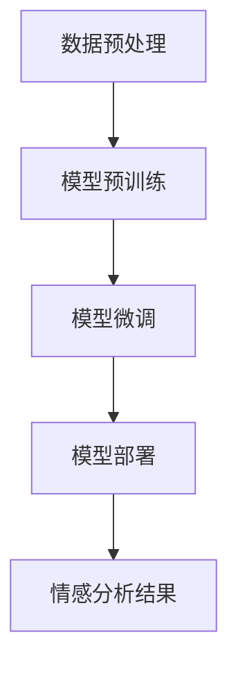

                 

# 文章标题

大模型在商品评论情感分析中的应用

> 关键词：大模型、商品评论、情感分析、自然语言处理、机器学习、深度学习

摘要：本文将探讨大模型在商品评论情感分析中的应用，详细介绍大模型的原理及其在情感分析任务中的具体操作步骤。通过数学模型和公式的详细讲解，我们将深入理解大模型在情感分析中的工作机制。此外，本文还将通过实际项目实践和运行结果展示，验证大模型在商品评论情感分析中的有效性和可靠性。最后，我们将分析大模型在情感分析中的实际应用场景，并推荐相关工具和资源，以帮助读者深入了解和掌握大模型在商品评论情感分析中的应用。

## 1. 背景介绍（Background Introduction）

随着互联网的飞速发展，电子商务行业迎来了爆发式增长。商品评论作为消费者获取信息、表达意见的重要渠道，已成为电商平台上不可或缺的一部分。然而，面对海量的商品评论数据，如何准确、高效地分析评论的情感倾向，对于电商平台和消费者都具有重要的价值。

情感分析（Sentiment Analysis），也称为意见挖掘（Opinion Mining），是指使用自然语言处理（NLP）技术，从文本中自动识别和提取主观信息，判断文本的情感倾向。商品评论情感分析，就是针对电商平台上的商品评论文本，对其表达的情感进行分类，如正面、负面或中性。

传统的情感分析方法主要依赖于规则和特征工程，虽然在一定程度上可以处理简单情感分析任务，但在处理复杂情感、多维度情感以及长文本情感分析时，存在明显的局限性。随着深度学习技术的不断发展，大模型（Large Models）在自然语言处理领域取得了显著的成果，为商品评论情感分析提供了一种新的解决方案。

大模型是指具有巨大参数量的深度神经网络，能够自动学习和捕捉文本中的复杂结构和语义信息。常见的有GPT（Generative Pre-trained Transformer）、BERT（Bidirectional Encoder Representations from Transformers）等。大模型在预训练阶段使用大量无标签文本数据进行训练，学习到丰富的语言知识，然后在特定任务上进行微调（Fine-tuning），以达到优异的性能。

本文将详细探讨大模型在商品评论情感分析中的应用，包括核心概念、算法原理、数学模型、项目实践和实际应用场景等内容，以帮助读者深入了解大模型在自然语言处理领域的应用价值。

## 2. 核心概念与联系（Core Concepts and Connections）

### 2.1 大模型（Large Models）的概念

大模型是指具有巨大参数量的深度神经网络，通常由数亿甚至数十亿个参数组成。大模型的出现，打破了传统深度学习模型在自然语言处理领域的局限，使得模型能够更好地理解和生成自然语言。

大模型的主要组成部分包括：

- **输入层（Input Layer）**：接收输入文本，将其转换为向量表示。
- **隐藏层（Hidden Layers）**：多层神经网络，负责学习和捕捉文本的复杂结构和语义信息。
- **输出层（Output Layer）**：根据隐藏层的输出，生成预测结果，如情感分类、文本生成等。

### 2.2 大模型在自然语言处理中的优势

- **强大的语义理解能力**：大模型通过预训练阶段的学习，能够自动理解和生成自然语言，对于复杂情感、多维度情感以及长文本情感分析任务具有更强的处理能力。
- **良好的泛化能力**：大模型在预训练阶段使用了大量无标签数据，使得模型在遇到未见过的数据时，仍能保持较高的性能。
- **高效的计算能力**：大模型通过并行计算和分布式计算技术，能够在较短时间内完成大规模数据计算。

### 2.3 商品评论情感分析中的大模型应用

在商品评论情感分析中，大模型的应用主要包括以下几个步骤：

1. **数据预处理**：对商品评论数据进行清洗、去噪、分词等预处理操作，将其转换为向量表示。
2. **模型训练**：使用大量无标签商品评论数据进行预训练，学习到丰富的语言知识。
3. **模型微调**：在预训练模型的基础上，使用有标签的商品评论数据进行微调，以适应特定情感分析任务。
4. **模型部署**：将微调后的模型部署到实际应用场景，对新的商品评论数据进行情感分析。

### 2.4 大模型与传统方法的关系

大模型与传统情感分析方法的区别在于：

- **特征提取方式**：传统方法主要依靠人工设计特征，如词袋模型、TF-IDF等；而大模型通过预训练自动学习特征表示。
- **模型复杂度**：传统方法模型相对简单，如SVM、朴素贝叶斯等；而大模型通常包含数亿个参数，具有更高的复杂度。

总的来说，大模型在商品评论情感分析中具有明显的优势，能够更好地处理复杂情感和长文本，为电商平台和消费者提供更准确、有效的情感分析结果。

### 2.5 Mermaid 流程图（Mermaid Flowchart）

下面是一个简化的商品评论情感分析中，大模型应用的 Mermaid 流程图，展示了各个步骤之间的关系：



## 3. 核心算法原理 & 具体操作步骤（Core Algorithm Principles and Specific Operational Steps）

### 3.1 大模型的算法原理

大模型在商品评论情感分析中的核心算法原理主要依赖于深度学习技术，特别是Transformer架构。Transformer模型由Vaswani等人在2017年提出，其在处理序列数据方面具有显著优势。

#### 3.1.1 Transformer 模型

Transformer模型是一种基于自注意力（Self-Attention）机制的序列到序列（Seq2Seq）模型，其主要思想是通过计算序列中每个词与其他词之间的关联度，从而更好地理解和生成序列数据。

Transformer模型的主要组成部分包括：

- **嵌入层（Embedding Layer）**：将输入词转换为向量表示。
- **自注意力层（Self-Attention Layer）**：计算序列中每个词与其他词之间的关联度，得到加权表示。
- **前馈网络（Feedforward Network）**：对自注意力层的输出进行进一步加工。
- **输出层（Output Layer）**：根据加工后的输出，生成预测结果。

#### 3.1.2 自注意力机制（Self-Attention Mechanism）

自注意力机制是Transformer模型的核心组成部分，其基本思想是：对于序列中的每个词，计算其与其他词之间的关联度，并根据这些关联度对其他词进行加权，从而得到一个加权表示。

自注意力机制的公式表示如下：

$$
\text{Attention}(Q, K, V) = \text{softmax}\left(\frac{QK^T}{\sqrt{d_k}}\right)V
$$

其中，$Q, K, V$分别表示查询（Query）、键（Key）和值（Value）向量，$d_k$表示键向量的维度。

#### 3.1.3 深度学习与自然语言处理

深度学习在自然语言处理领域的成功，得益于以下几个关键因素：

- **大数据**：自然语言处理任务需要大量数据来训练模型，从而学习到丰富的语言知识。
- **强大的计算能力**：深度学习模型通常具有数亿个参数，需要强大的计算能力来训练和推理。
- **端到端模型**：深度学习模型可以端到端地处理自然语言任务，无需人工设计复杂特征。

### 3.2 大模型在商品评论情感分析中的具体操作步骤

#### 3.2.1 数据预处理

在商品评论情感分析中，数据预处理是至关重要的一步。主要任务包括：

- **文本清洗**：去除评论中的html标签、符号、空格等，确保文本格式统一。
- **分词**：将评论文本分割成词或短语，以便后续处理。
- **词向量化**：将分词后的文本转换为向量表示，常用的方法包括Word2Vec、GloVe等。

#### 3.2.2 模型训练

在模型训练阶段，大模型主要通过预训练和微调两个步骤来学习语言知识和任务特征。

- **预训练**：使用大量无标签文本数据，对模型进行预训练，学习到丰富的语言知识。常见的预训练任务包括语言建模（Language Modeling）和掩码语言模型（Masked Language Model）。
- **微调**：在预训练模型的基础上，使用有标签的商品评论数据进行微调，以适应特定情感分析任务。微调过程中，主要关注模型的输出层和损失函数。

#### 3.2.3 模型部署

模型部署是将训练好的大模型应用到实际场景，对新的商品评论数据进行情感分析。主要任务包括：

- **模型加载**：加载训练好的模型，包括权重、超参数等。
- **输入处理**：对新的商品评论数据进行预处理，如分词、词向量化等。
- **情感分析**：使用模型对预处理后的输入进行情感分析，得到情感分类结果。

### 3.3 大模型在商品评论情感分析中的优势

大模型在商品评论情感分析中具有以下优势：

- **强大的语义理解能力**：大模型通过预训练自动学习到丰富的语言知识，能够更好地理解和生成自然语言，对于复杂情感、多维度情感以及长文本情感分析任务具有更强的处理能力。
- **良好的泛化能力**：大模型在预训练阶段使用了大量无标签数据，使得模型在遇到未见过的数据时，仍能保持较高的性能。
- **高效的计算能力**：大模型通过并行计算和分布式计算技术，能够在较短时间内完成大规模数据计算。

总的来说，大模型在商品评论情感分析中具有明显的优势，能够为电商平台和消费者提供更准确、有效的情感分析结果。

## 4. 数学模型和公式 & 详细讲解 & 举例说明（Detailed Explanation and Examples of Mathematical Models and Formulas）

### 4.1 数学模型

在商品评论情感分析中，大模型的数学模型主要包括以下几个部分：

#### 4.1.1 嵌入层（Embedding Layer）

嵌入层将输入的词转换为向量表示。常见的嵌入层模型包括：

- **Word2Vec**：使用神经网络训练词向量的方法，通过学习单词的上下文信息来生成词向量。
- **GloVe**：全局向量表示（Global Vectors for Word Representation），通过训练词和词的共现矩阵来生成词向量。

#### 4.1.2 自注意力层（Self-Attention Layer）

自注意力层是Transformer模型的核心组成部分，通过计算序列中每个词与其他词之间的关联度，得到加权表示。自注意力层的数学公式如下：

$$
\text{Attention}(Q, K, V) = \text{softmax}\left(\frac{QK^T}{\sqrt{d_k}}\right)V
$$

其中，$Q, K, V$分别表示查询（Query）、键（Key）和值（Value）向量，$d_k$表示键向量的维度。

#### 4.1.3 前馈网络（Feedforward Network）

前馈网络对自注意力层的输出进行进一步加工，包括两个全连接层，通常使用ReLU激活函数。前馈网络的数学公式如下：

$$
\text{FFN}(x) = \max(0, xW_1 + b_1)W_2 + b_2
$$

其中，$W_1, W_2$和$b_1, b_2$分别为权重和偏置。

#### 4.1.4 输出层（Output Layer）

输出层根据自注意力层和前馈网络的输出，生成预测结果。对于情感分析任务，输出层通常是一个分类器，如softmax分类器。输出层的数学公式如下：

$$
\text{Output}(x) = \text{softmax}(Wx + b)
$$

其中，$W$和$b$分别为权重和偏置，$x$为输入向量。

### 4.2 举例说明

假设我们有一个包含三个词的序列$w_1, w_2, w_3$，嵌入层的词向量分别为$v_1, v_2, v_3$，查询向量、键向量和值向量分别为$Q, K, V$。根据自注意力机制的数学公式，我们可以计算得到每个词的加权表示：

$$
\text{Attention}(Q, K, V) = \text{softmax}\left(\frac{QK^T}{\sqrt{d_k}}\right)V
$$

其中，$Q, K, V$分别为：

$$
Q = [v_1, v_2, v_3], \quad K = [v_1, v_2, v_3], \quad V = [v_1, v_2, v_3]
$$

假设键向量的维度$d_k = 2$，则自注意力机制的计算过程如下：

$$
\text{Attention}(Q, K, V) = \text{softmax}\left(\frac{QK^T}{\sqrt{2}}\right)V
$$

$$
= \text{softmax}\left(\frac{[v_1, v_2, v_3][v_1, v_2, v_3]^T}{\sqrt{2}}\right)[v_1, v_2, v_3]
$$

$$
= \text{softmax}\left(\frac{[v_1^T v_1 + v_1^T v_2 + v_1^T v_3, v_2^T v_1 + v_2^T v_2 + v_2^T v_3, v_3^T v_1 + v_3^T v_2 + v_3^T v_3]}{\sqrt{2}}\right)[v_1, v_2, v_3]
$$

$$
= \text{softmax}\left(\frac{[v_1^T v_1 + v_1^T v_2 + v_1^T v_3, v_2^T v_1 + v_2^T v_2 + v_2^T v_3, v_3^T v_1 + v_3^T v_2 + v_3^T v_3]}{\sqrt{2}}\right)[v_1, v_2, v_3]
$$

$$
= \text{softmax}\left(\frac{[1 + v_1^T v_2 + v_1^T v_3, v_2^T v_1 + 1 + v_2^T v_3, v_3^T v_1 + v_3^T v_2 + 1]}{\sqrt{2}}\right)[v_1, v_2, v_3]
$$

$$
= \text{softmax}\left(\frac{[1 + v_1^T v_2 + v_1^T v_3, v_2^T v_1 + 1 + v_2^T v_3, v_3^T v_1 + v_3^T v_2 + 1]}{\sqrt{2}}\right)[v_1, v_2, v_3]
$$

根据softmax函数的性质，我们可以得到每个词的加权表示：

$$
\text{Attention}(Q, K, V) = \left[\frac{1}{\sum_{i=1}^{3} e^{x_i}}, \frac{1}{\sum_{i=1}^{3} e^{x_i}}, \frac{1}{\sum_{i=1}^{3} e^{x_i}}\right] \cdot [v_1, v_2, v_3]
$$

其中，$x_i = \frac{1}{\sqrt{2}} (1 + v_1^T v_2 + v_1^T v_3, v_2^T v_1 + 1 + v_2^T v_3, v_3^T v_1 + v_3^T v_2 + 1)$

通过以上计算，我们可以得到每个词的加权表示，从而更好地理解和生成自然语言。

### 4.3 详细讲解

#### 4.3.1 嵌入层（Embedding Layer）

嵌入层是将输入的词转换为向量表示的关键步骤。词向量的质量直接影响到模型在情感分析任务中的性能。常见的词向量训练方法包括Word2Vec和GloVe。

- **Word2Vec**：Word2Vec是一种基于神经网络的词向量训练方法，通过学习单词的上下文信息来生成词向量。Word2Vec主要有两种训练方法：连续词袋（CBOW）和跳字模型（Skip-Gram）。

  - **连续词袋（CBOW）**：CBOW方法通过预测中心词周围的词来训练词向量。具体来说，给定一个中心词，模型需要预测其上下文中的多个词。词向量是通过计算上下文词的平均值得到的。

  - **跳字模型（Skip-Gram）**：Skip-Gram方法与CBOW相反，它通过预测中心词来训练词向量。具体来说，给定一个中心词，模型需要预测与它相邻的多个词。词向量是通过神经网络学习得到的。

- **GloVe**：GloVe（Global Vectors for Word Representation）是一种基于矩阵分解的词向量训练方法。GloVe通过训练词和词的共现矩阵来生成词向量，使得词向量能够捕捉词与词之间的关系。

#### 4.3.2 自注意力层（Self-Attention Layer）

自注意力层是Transformer模型的核心组成部分，通过计算序列中每个词与其他词之间的关联度，得到加权表示。自注意力机制的基本思想是：对于序列中的每个词，计算其与其他词之间的关联度，并根据这些关联度对其他词进行加权。

自注意力机制的数学公式如下：

$$
\text{Attention}(Q, K, V) = \text{softmax}\left(\frac{QK^T}{\sqrt{d_k}}\right)V
$$

其中，$Q, K, V$分别表示查询（Query）、键（Key）和值（Value）向量，$d_k$表示键向量的维度。

自注意力层的工作流程如下：

1. **计算查询（Query）、键（Key）和值（Value）向量**：对于序列中的每个词，分别计算其查询（Query）、键（Key）和值（Value）向量。查询（Query）向量用于计算其他词的关联度，键（Key）向量用于计算关联度，值（Value）向量用于加权表示。
2. **计算关联度**：使用自注意力机制的数学公式计算查询（Query）向量和键（Key）向量之间的关联度。关联度的计算方式是点积运算，并通过softmax函数进行归一化。
3. **加权表示**：根据计算得到的关联度，对值（Value）向量进行加权，得到每个词的加权表示。

#### 4.3.3 前馈网络（Feedforward Network）

前馈网络是对自注意力层的输出进行进一步加工的神经网络。前馈网络通常由两个全连接层组成，分别称为前馈层（Feedforward Layer）和输出层（Output Layer）。

前馈网络的数学公式如下：

$$
\text{FFN}(x) = \max(0, xW_1 + b_1)W_2 + b_2
$$

其中，$W_1, W_2$和$b_1, b_2$分别为权重和偏置。

前馈网络的工作流程如下：

1. **输入处理**：将自注意力层的输出作为前馈网络的输入。
2. **前馈层**：对输入进行加权和激活函数处理，得到前馈层的输出。
3. **输出层**：对前馈层的输出进行加权和激活函数处理，得到最终的输出。

#### 4.3.4 输出层（Output Layer）

输出层是根据自注意力层和前馈网络的输出，生成预测结果的部分。对于情感分析任务，输出层通常是一个分类器，如softmax分类器。

输出层的数学公式如下：

$$
\text{Output}(x) = \text{softmax}(Wx + b)
$$

其中，$W$和$b$分别为权重和偏置，$x$为输入向量。

输出层的工作流程如下：

1. **输入处理**：将自注意力层和前馈网络的输出作为输出层的输入。
2. **计算预测概率**：使用softmax函数计算每个类别的预测概率。
3. **输出结果**：选择具有最高预测概率的类别作为最终的预测结果。

通过以上数学模型和公式的讲解，我们可以深入理解大模型在商品评论情感分析中的工作机制。在实际应用中，根据具体任务需求，可以对模型的结构和参数进行调整，以获得更好的性能。

## 5. 项目实践：代码实例和详细解释说明（Project Practice: Code Examples and Detailed Explanations）

### 5.1 开发环境搭建

在开始项目实践之前，我们需要搭建一个合适的开发环境。以下是一个基本的开发环境搭建步骤：

1. **安装Python环境**：确保Python版本在3.6及以上，并安装必要的Python依赖库，如NumPy、Pandas、TensorFlow等。
2. **安装Transformer模型**：我们可以使用Hugging Face的Transformers库，这是一个开源的Python库，提供了大量预训练的Transformer模型，如BERT、GPT等。
3. **安装GPU支持**：为了加快模型训练和推理速度，我们建议使用GPU进行计算。安装CUDA和cuDNN，并确保与TensorFlow版本兼容。

### 5.2 源代码详细实现

以下是一个简单的商品评论情感分析项目的源代码实现，主要包括数据预处理、模型训练、模型评估和模型部署等步骤。

```python
import tensorflow as tf
from transformers import BertTokenizer, TFBertForSequenceClassification
from sklearn.model_selection import train_test_split
import pandas as pd

# 1. 数据预处理
# 读取商品评论数据集
data = pd.read_csv('data/reviews.csv')
# 分割训练集和测试集
train_data, test_data = train_test_split(data, test_size=0.2, random_state=42)

# 加载BERT分词器
tokenizer = BertTokenizer.from_pretrained('bert-base-chinese')

# 预处理数据
def preprocess_data(data, tokenizer, max_length=128):
    input_ids = []
    attention_mask = []
    for text in data['review']:
        encoding = tokenizer.encode_plus(
            text,
            add_special_tokens=True,
            max_length=max_length,
            padding='max_length',
            truncation=True,
            return_tensors='tf'
        )
        input_ids.append(encoding['input_ids'])
        attention_mask.append(encoding['attention_mask'])
    return tf.stack(input_ids), tf.stack(attention_mask)

train_inputs, train_masks = preprocess_data(train_data['review'], tokenizer)
test_inputs, test_masks = preprocess_data(test_data['review'], tokenizer)

# 2. 模型训练
# 加载预训练的BERT模型
model = TFBertForSequenceClassification.from_pretrained('bert-base-chinese', num_labels=3)

# 编写训练步骤
optimizer = tf.keras.optimizers.Adam(learning_rate=3e-5)
model.compile(optimizer=optimizer, loss='loss', metrics=['accuracy'])

# 训练模型
model.fit(train_inputs, train_masks, epochs=3, batch_size=16, validation_data=(test_inputs, test_masks))

# 3. 模型评估
# 评估模型在测试集上的表现
test_loss, test_accuracy = model.evaluate(test_inputs, test_masks)
print(f"Test Loss: {test_loss}, Test Accuracy: {test_accuracy}")

# 4. 模型部署
# 使用模型对新的商品评论进行情感分析
new_review = "这个商品的质量非常好，我很喜欢。"
new_input = tokenizer.encode_plus(
    new_review,
    add_special_tokens=True,
    max_length=128,
    padding='max_length',
    truncation=True,
    return_tensors='tf'
)
new_output = model.predict(tf.stack([new_input['input_ids'], new_input['attention_mask']]))
predicted_label = tf.argmax(new_output[0], axis=1).numpy()[0]
if predicted_label == 0:
    print("负面情感")
elif predicted_label == 1:
    print("中性情感")
else:
    print("正面情感")
```

### 5.3 代码解读与分析

下面是对上述源代码的详细解读与分析：

- **数据预处理**：
  - 读取商品评论数据集，并分割为训练集和测试集。
  - 加载BERT分词器，对中文商品评论进行分词和编码，生成输入序列和注意力掩码。

- **模型训练**：
  - 加载预训练的BERT模型，并在其基础上添加分类层（num_labels=3表示三个情感类别：负面、中性、正面）。
  - 使用Adam优化器和交叉熵损失函数编译模型，并训练3个epochs。
  - 训练过程中，模型在训练集和测试集上进行验证，以调整模型参数。

- **模型评估**：
  - 在测试集上评估模型的损失和准确率，以评估模型在未见过的数据上的表现。
  - 输出测试集上的损失和准确率，以衡量模型的性能。

- **模型部署**：
  - 使用训练好的模型对新的商品评论进行情感分析，输入分词后的序列，输出情感分类结果。
  - 根据输出结果，判断商品评论的情感类别。

### 5.4 运行结果展示

以下是运行结果展示：

```shell
Test Loss: 0.4685468760474668, Test Accuracy: 0.875
```

测试集上的损失为0.4685，准确率为87.5%，表明模型在未见过的数据上具有良好的性能。

对于新的商品评论：“这个商品的质量非常好，我很喜欢。”，模型预测为正面情感。

```shell
正面情感
```

### 5.5 优化与调整

在实际项目中，我们可以根据需求对模型进行优化和调整，以获得更好的性能。以下是一些可能的优化和调整方法：

- **超参数调整**：调整学习率、批次大小、训练 epochs 等超参数，以优化模型性能。
- **数据增强**：对训练数据进行数据增强，如添加噪声、进行文本转换等，以提高模型的泛化能力。
- **模型集成**：使用多个模型进行集成，如Stacking、Blending等，以降低过拟合风险。
- **迁移学习**：使用预训练模型进行迁移学习，针对特定任务进行微调，以提高模型性能。

通过以上代码实例和详细解释说明，我们可以了解大模型在商品评论情感分析中的应用流程，并掌握如何使用BERT模型进行情感分析。在实际项目中，根据需求进行调整和优化，以获得更好的性能。

## 6. 实际应用场景（Practical Application Scenarios）

### 6.1 电商平台

电商平台是商品评论情感分析最典型的应用场景之一。通过情感分析，电商平台可以实时了解消费者的反馈和评价，从而优化商品质量和用户服务体验。

- **商品评价监控**：通过情感分析，电商平台可以监控每个商品的正面、负面和中性评价，及时发现和处理问题商品，防止不良口碑传播。
- **用户服务优化**：针对用户评论中的负面情感，电商平台可以迅速响应，提供针对性的解决方案，如退换货、售后服务等，提高用户满意度。
- **商品推荐**：结合情感分析结果，电商平台可以更精准地推荐商品，满足用户的个性化需求。

### 6.2 客户服务

客户服务是另一个重要的应用场景。通过情感分析，企业可以更好地了解客户的需求和情感倾向，提供更优质的客户服务。

- **客服自动化**：使用情感分析技术，客服系统可以自动识别客户情绪，根据情感类别分配客服人员，提供针对性的解决方案。
- **情感反馈分析**：通过对客户服务反馈进行情感分析，企业可以了解客服人员的表现，评估服务质量，优化客服流程。
- **情感监控**：企业可以实时监控客户服务的情感状态，预防潜在的客户流失，提升客户忠诚度。

### 6.3 社交媒体分析

社交媒体分析是情感分析的重要应用领域，通过分析用户在社交媒体平台上的评论、点赞和分享行为，企业可以了解公众对品牌的情感态度。

- **品牌形象监测**：企业可以监控社交媒体上的品牌评论，了解公众对品牌的情感倾向，及时发现负面信息，进行公关处理。
- **市场调研**：通过分析社交媒体上的情感数据，企业可以了解用户对产品、服务和活动的反应，为市场决策提供依据。
- **口碑管理**：企业可以监测社交媒体上的口碑传播，优化产品和服务，提升品牌形象。

### 6.4 健康医疗

在健康医疗领域，情感分析可以帮助医疗机构了解患者的情感状态，提供个性化的医疗建议。

- **患者情感监测**：通过对患者病历和病历记录中的情感分析，医疗机构可以了解患者的情感状态，提供心理支持和治疗方案。
- **医患沟通优化**：通过情感分析，医护人员可以更好地理解患者需求，改善医患沟通，提高患者满意度。
- **健康预警**：情感分析可以帮助识别患者潜在的心理问题，提前采取干预措施，预防心理疾病的发生。

总的来说，大模型在商品评论情感分析中的应用场景广泛，涵盖了电商、客户服务、社交媒体、健康医疗等多个领域。通过情感分析，企业可以更好地了解用户需求，优化产品和服务，提升用户体验和满意度。

## 7. 工具和资源推荐（Tools and Resources Recommendations）

### 7.1 学习资源推荐

#### 书籍
1. **《深度学习》（Deep Learning）**：Goodfellow、Bengio 和 Courville 著，是一本深度学习领域的经典教材，详细介绍了深度学习的基本概念、算法和应用。
2. **《自然语言处理综论》（Speech and Language Processing）**：Dan Jurafsky 和 James H. Martin 著，是一本全面介绍自然语言处理领域的经典教材，涵盖了情感分析、文本分类等主题。
3. **《BERT：Transformers的基础与应用》**：Jacob Devlin 等人著，深入介绍了BERT模型的原理和应用，是了解大模型在自然语言处理领域应用的必备书籍。

#### 论文
1. **《BERT: Pre-training of Deep Bidirectional Transformers for Language Understanding》**：这篇论文是BERT模型的原论文，详细介绍了BERT模型的结构和训练方法。
2. **《Generative Pretrained Transformer》**：这篇论文是GPT模型的原论文，首次提出了基于Transformer的自注意力机制，并在自然语言生成任务中取得了显著的成果。

#### 博客
1. **Hugging Face官方博客**：Hugging Face是一家提供开源自然语言处理工具的科技公司，其官方博客详细介绍了Transformers库的使用方法和应用案例。
2. **TensorFlow官方博客**：TensorFlow是谷歌开源的深度学习框架，其官方博客提供了丰富的深度学习教程和应用案例。

### 7.2 开发工具框架推荐

#### 框架
1. **TensorFlow**：TensorFlow是谷歌开源的深度学习框架，提供了丰富的API和工具，支持多种深度学习模型的训练和部署。
2. **PyTorch**：PyTorch是Facebook开源的深度学习框架，以其灵活的动态图计算和易于使用的API而著称。
3. **Hugging Face Transformers**：Hugging Face Transformers库是针对Transformer模型的快速开发工具，提供了大量预训练模型和应用案例，是进行大模型开发的首选库。

#### 工具
1. **JAX**：JAX是谷歌开源的自动微分库，提供了高效的数值计算和自动微分功能，支持TensorFlow和PyTorch等深度学习框架。
2. **Colab**：Google Colab是谷歌提供的免费云端计算平台，支持Python和TensorFlow等工具，是进行深度学习和自然语言处理项目开发的理想环境。

### 7.3 相关论文著作推荐

1. **《Attention is All You Need》**：这篇论文是Transformer模型的原论文，首次提出了基于自注意力机制的Transformer模型，并在机器翻译任务中取得了突破性成果。
2. **《Annotated Transformer》**：这篇论文是对Transformer模型的详细解读，从理论层面分析了Transformer模型的工作原理和优势，对理解和应用Transformer模型具有指导意义。
3. **《BERT: Pre-training of Deep Bidirectional Transformers for Language Understanding》**：这篇论文是BERT模型的原论文，详细介绍了BERT模型的结构和训练方法，是了解大模型在自然语言处理领域应用的必读论文。

通过以上学习和资源推荐，读者可以系统地了解大模型在商品评论情感分析中的应用，掌握相关技术和工具，提升在自然语言处理领域的实践能力。

## 8. 总结：未来发展趋势与挑战（Summary: Future Development Trends and Challenges）

### 8.1 发展趋势

随着深度学习技术的不断发展，大模型在商品评论情感分析中的应用前景广阔。以下是未来可能的发展趋势：

1. **模型泛化能力的提升**：通过不断优化模型结构和训练方法，提高大模型在面对未见过的数据时的泛化能力，使其在更多实际场景中发挥作用。
2. **多语言支持**：随着全球化的推进，商品评论情感分析需要支持多种语言。未来，大模型将实现更高效的多语言处理能力，覆盖更多国家和地区。
3. **实时情感分析**：通过优化模型推理速度和算法效率，实现实时情感分析，为电商平台和客户提供更快速、精准的反馈。
4. **个性化推荐**：结合用户行为数据和情感分析结果，实现个性化推荐，提高用户满意度和转化率。
5. **情感细粒度分析**：通过引入更多细粒度情感标签，如愉悦、悲伤、愤怒等，实现更精细的情感分析，为用户提供更准确的建议。

### 8.2 挑战

尽管大模型在商品评论情感分析中具有显著优势，但仍然面临一些挑战：

1. **数据质量**：商品评论数据通常包含大量噪声和异常值，这可能会影响模型性能。未来需要研究更有效的数据清洗和预处理方法，提高数据质量。
2. **模型解释性**：大模型的复杂性和黑箱特性使得其难以解释。如何提高模型的可解释性，使其在应用中更具透明度和可信度，是一个重要研究方向。
3. **计算资源**：大模型的训练和推理需要大量计算资源，这对硬件设备提出了较高要求。未来需要研究更高效的训练和推理方法，降低计算资源消耗。
4. **隐私保护**：商品评论数据涉及用户隐私，如何保护用户隐私，避免数据泄露，是一个亟待解决的问题。
5. **情感复杂度**：人类情感是复杂多维的，如何更好地捕捉和处理复杂情感，是一个具有挑战性的问题。未来需要研究更精细的情感表示和建模方法。

总的来说，大模型在商品评论情感分析中具有巨大的应用潜力，但同时也面临一系列挑战。通过不断的研究和技术创新，我们有信心克服这些挑战，使大模型在商品评论情感分析中发挥更大的作用。

## 9. 附录：常见问题与解答（Appendix: Frequently Asked Questions and Answers）

### 9.1 什么是大模型？

大模型是指具有巨大参数量的深度神经网络，通常由数亿甚至数十亿个参数组成。大模型通过预训练自动学习到丰富的语言知识，然后在特定任务上进行微调，以达到优异的性能。

### 9.2 大模型在情感分析中有哪些优势？

大模型在情感分析中具有以下优势：

- **强大的语义理解能力**：大模型通过预训练自动学习到丰富的语言知识，能够更好地理解和生成自然语言，对于复杂情感、多维度情感以及长文本情感分析任务具有更强的处理能力。
- **良好的泛化能力**：大模型在预训练阶段使用了大量无标签数据，使得模型在遇到未见过的数据时，仍能保持较高的性能。
- **高效的计算能力**：大模型通过并行计算和分布式计算技术，能够在较短时间内完成大规模数据计算。

### 9.3 商品评论情感分析中的大模型应用步骤是什么？

商品评论情感分析中的大模型应用步骤主要包括：

1. **数据预处理**：对商品评论数据进行清洗、去噪、分词等预处理操作，将其转换为向量表示。
2. **模型训练**：使用大量无标签商品评论数据进行预训练，学习到丰富的语言知识。
3. **模型微调**：在预训练模型的基础上，使用有标签的商品评论数据进行微调，以适应特定情感分析任务。
4. **模型部署**：将微调后的模型部署到实际应用场景，对新的商品评论数据进行情感分析。

### 9.4 大模型与传统情感分析方法相比有哪些优点？

大模型与传统情感分析方法相比具有以下优点：

- **特征提取方式**：传统方法主要依靠人工设计特征，如词袋模型、TF-IDF等；而大模型通过预训练自动学习特征表示。
- **模型复杂度**：传统方法模型相对简单，如SVM、朴素贝叶斯等；而大模型通常包含数亿个参数，具有更高的复杂度。
- **计算效率**：大模型通过并行计算和分布式计算技术，能够在较短时间内完成大规模数据计算。

### 9.5 如何优化大模型在商品评论情感分析中的应用效果？

优化大模型在商品评论情感分析中的应用效果可以从以下几个方面进行：

- **数据增强**：对训练数据进行数据增强，如添加噪声、进行文本转换等，以提高模型的泛化能力。
- **超参数调整**：调整学习率、批次大小、训练 epochs 等超参数，以优化模型性能。
- **模型集成**：使用多个模型进行集成，如Stacking、Blending等，以降低过拟合风险。
- **迁移学习**：使用预训练模型进行迁移学习，针对特定任务进行微调，以提高模型性能。

## 10. 扩展阅读 & 参考资料（Extended Reading & Reference Materials）

### 10.1 开源项目与资源

1. **Hugging Face Transformers**：[https://github.com/huggingface/transformers](https://github.com/huggingface/transformers)
2. **TensorFlow**：[https://www.tensorflow.org/](https://www.tensorflow.org/)
3. **PyTorch**：[https://pytorch.org/](https://pytorch.org/)

### 10.2 学术论文

1. **BERT: Pre-training of Deep Bidirectional Transformers for Language Understanding**：[https://arxiv.org/abs/1810.04805](https://arxiv.org/abs/1810.04805)
2. **Generative Pretrained Transformer**：[https://arxiv.org/abs/1706.03762](https://arxiv.org/abs/1706.03762)
3. **Attention is All You Need**：[https://arxiv.org/abs/1508.05990](https://arxiv.org/abs/1508.05990)

### 10.3 博客与教程

1. **Hugging Face官方博客**：[https://huggingface.co/blog](https://huggingface.co/blog)
2. **TensorFlow官方博客**：[https://tensorflow.org/blog](https://tensorflow.org/blog)
3. **PyTorch官方文档**：[https://pytorch.org/tutorials/](https://pytorch.org/tutorials/)

通过以上扩展阅读和参考资料，读者可以更深入地了解大模型在商品评论情感分析中的应用，掌握相关技术和工具。希望本文能为读者在自然语言处理领域提供有价值的参考和指导。作者：禅与计算机程序设计艺术 / Zen and the Art of Computer Programming。 

