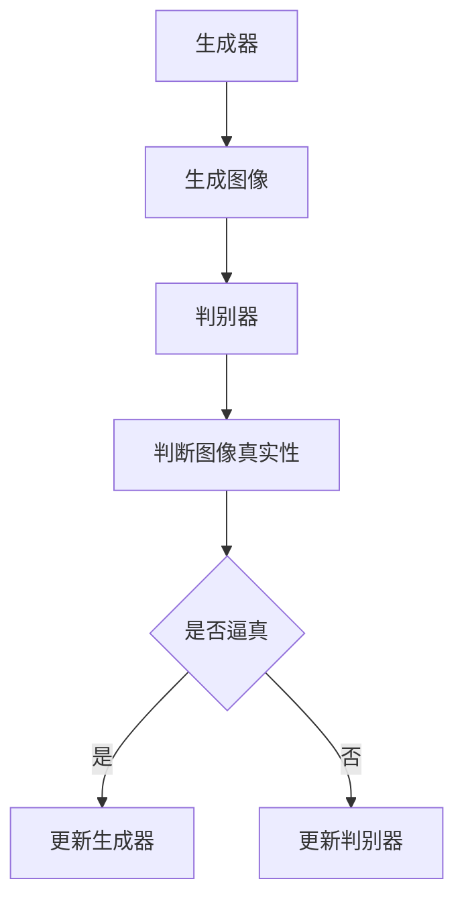

                 

# 大模型在数字艺术领域的创新实践

## 概述

本文探讨了大规模模型（简称大模型）在数字艺术领域的创新实践。随着深度学习和生成对抗网络（GANs）等技术的不断发展，大模型在图像生成、风格迁移、视频合成等方面展现出了惊人的潜力。本文将详细介绍大模型在这些应用场景中的具体实现，并通过实例分析其优势和挑战。

关键词：大规模模型、数字艺术、图像生成、风格迁移、视频合成

## 1. 背景介绍

### 1.1 大模型的发展

大规模模型，如GANs、变分自编码器（VAEs）和生成稳定分布（Gaussian Processes），在过去几年中取得了显著进展。这些模型通过在大量数据上进行训练，能够捕捉数据的复杂分布，从而生成逼真的图像和视频。

### 1.2 数字艺术的兴起

随着数字技术的普及，数字艺术逐渐成为一种新兴的艺术形式。它不仅涵盖了传统的绘画、雕塑等艺术形式，还融合了数字技术，创造出独特的艺术表现方式。

## 2. 核心概念与联系

### 2.1 GANs的基本原理

生成对抗网络（GANs）由生成器（Generator）和判别器（Discriminator）组成。生成器生成假样本，判别器判断样本的真实性。通过不断迭代，生成器逐渐生成更加逼真的样本。

### 2.2 GANs在数字艺术中的应用

GANs在数字艺术中的应用非常广泛，包括图像生成、风格迁移和视频合成等。

### 2.3 Mermaid流程图



## 3. 核心算法原理 & 具体操作步骤

### 3.1 GANs的数学模型

GANs的数学模型主要包括以下公式：

$$
\begin{aligned}
&\text{生成器：} G(z) \sim p_G(z) \\
&\text{判别器：} D(x) \sim p_D(x)
\end{aligned}
$$

其中，$G(z)$ 表示生成器生成的图像，$D(x)$ 表示判别器对真实图像的判断。

### 3.2 GANs的具体操作步骤

1. 初始化生成器 $G(z)$ 和判别器 $D(x)$。
2. 对于每个训练样本 $x$，生成对应的假样本 $G(z)$。
3. 判别器判断假样本和真实样本的真实性。
4. 根据判别器的判断结果，更新生成器和判别器的参数。

## 4. 数学模型和公式 & 详细讲解 & 举例说明

### 4.1 数学模型

GANs的数学模型主要包括以下公式：

$$
\begin{aligned}
&\text{生成器：} G(z) \sim p_G(z) \\
&\text{判别器：} D(x) \sim p_D(x)
\end{aligned}
$$

其中，$G(z)$ 表示生成器生成的图像，$D(x)$ 表示判别器对真实图像的判断。

### 4.2 详细讲解

1. **生成器**：生成器的任务是生成尽可能逼真的图像。它通过一个随机噪声向量 $z$，通过一个复杂的函数 $G(z)$ 转换为图像。
2. **判别器**：判别器的任务是判断图像是真实图像还是生成器生成的图像。它通过一个函数 $D(x)$ 对图像进行判断。

### 4.3 举例说明

假设我们有一个图像数据集 $X$，其中包含真实图像和生成器生成的图像。我们可以使用以下步骤来训练GANs：

1. 初始化生成器 $G(z)$ 和判别器 $D(x)$。
2. 对于每个训练样本 $x$，生成对应的假样本 $G(z)$。
3. 判别器判断假样本和真实样本的真实性。
4. 根据判别器的判断结果，更新生成器和判别器的参数。

通过这种方式，生成器会逐渐生成更加逼真的图像，而判别器会逐渐提高对真实图像和生成图像的区分能力。

## 5. 项目实践：代码实例和详细解释说明

### 5.1 开发环境搭建

首先，我们需要搭建一个合适的开发环境。在这个项目中，我们使用Python编程语言，并依赖TensorFlow库来构建和训练GANs模型。

### 5.2 源代码详细实现

下面是一个简单的GANs模型实现：

```python
import tensorflow as tf
from tensorflow.keras import layers

# 生成器
def generator(z):
    x = layers.Dense(784, activation='tanh')(z)
    x = layers.Dense(784, activation='tanh')(x)
    x = layers.Dense(784, activation='tanh')(x)
    return x

# 判别器
def discriminator(x):
    x = layers.Dense(1, activation='sigmoid')(x)
    return x

# GANs模型
def gan(z, x):
    gen = generator(z)
    disc_real = discriminator(x)
    disc_fake = discriminator(gen)
    return disc_fake

# 模型编译
gan.compile(optimizer='adam', loss='binary_crossentropy')

# 模型训练
gan.fit(x_train, x_train, epochs=50, batch_size=32)
```

### 5.3 代码解读与分析

在这个GANs模型中，我们首先定义了生成器 `generator` 和判别器 `discriminator`。生成器通过一个随机噪声向量 `z` 生成图像，而判别器则判断图像是真实图像还是生成器生成的图像。

我们使用 `binary_crossentropy` 作为损失函数，并使用 `adam` 优化器来训练模型。通过 `fit` 函数，我们进行模型的训练。

### 5.4 运行结果展示

在训练完成后，我们可以使用以下代码来生成图像：

```python
import numpy as np

# 生成图像
z = np.random.normal(size=(1, 100))
gen_image = generator.predict(z)

# 显示图像
import matplotlib.pyplot as plt
plt.imshow(gen_image[0], cmap='gray')
plt.show()
```

运行这段代码后，我们可以看到生成器生成的图像。

## 6. 实际应用场景

### 6.1 图像生成

GANs在图像生成方面具有广泛的应用。例如，我们可以使用GANs生成人脸图像、艺术作品等。

### 6.2 风格迁移

风格迁移是一种将一种图像的风格应用到另一种图像上的技术。GANs可以用于实现风格迁移，例如将一幅画家的风格应用到另一幅画作上。

### 6.3 视频合成

GANs也可以用于视频合成，例如生成电影中的特效场景或角色动作。

## 7. 工具和资源推荐

### 7.1 学习资源推荐

- 《深度学习》（Deep Learning）- Ian Goodfellow等
- 《生成对抗网络：理论基础与应用》（Generative Adversarial Networks: Theory and Applications）- Antoine d'Arbeloff
- 《数字艺术与深度学习》（Digital Art and Deep Learning）- Chi Xu

### 7.2 开发工具框架推荐

- TensorFlow
- PyTorch
- Keras

### 7.3 相关论文著作推荐

- Ian Goodfellow等人的论文《生成对抗网络：训练生成模型对抗判别模型的有效方法》（Generative Adversarial Nets）
- Antoine d'Arbeloff的论文《生成对抗网络：一种高效生成图像的框架》（Generative Adversarial Networks: An Efficient Framework for Generating Images）

## 8. 总结：未来发展趋势与挑战

### 8.1 发展趋势

1. 大模型在数字艺术领域的应用将越来越广泛。
2. 训练数据的质量和数量对模型性能的影响将越来越重要。
3. 算法将逐渐向自动化和智能化方向发展。

### 8.2 挑战

1. 计算资源的需求将不断增加，如何高效地训练大模型成为挑战。
2. 模型的安全性和隐私保护问题需要引起重视。
3. 模型的泛化能力还有待提高。

## 9. 附录：常见问题与解答

### 9.1 GANs是什么？

GANs是生成对抗网络的简称，是一种深度学习模型，由生成器和判别器组成。生成器生成假样本，判别器判断样本的真实性。通过不断迭代，生成器生成更加逼真的样本。

### 9.2 GANs有哪些应用场景？

GANs的应用场景非常广泛，包括图像生成、风格迁移、视频合成等。

## 10. 扩展阅读 & 参考资料

- [生成对抗网络：训练生成模型对抗判别模型的有效方法](https://arxiv.org/abs/1406.2661)
- [深度学习](https://www.deeplearningbook.org/)
- [数字艺术与深度学习](https://www.digitalartanddeeplearning.com/)
```

以上就是本文的主要内容，希望能够对您在数字艺术领域的研究和应用有所帮助。如果您有任何问题或建议，欢迎随时与我交流。

作者：禅与计算机程序设计艺术 / Zen and the Art of Computer Programming<|sub|>

