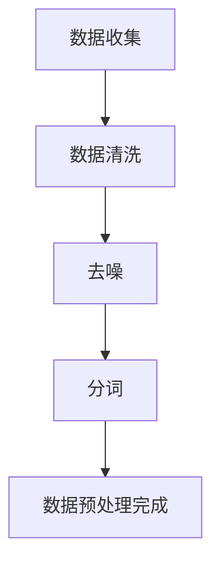
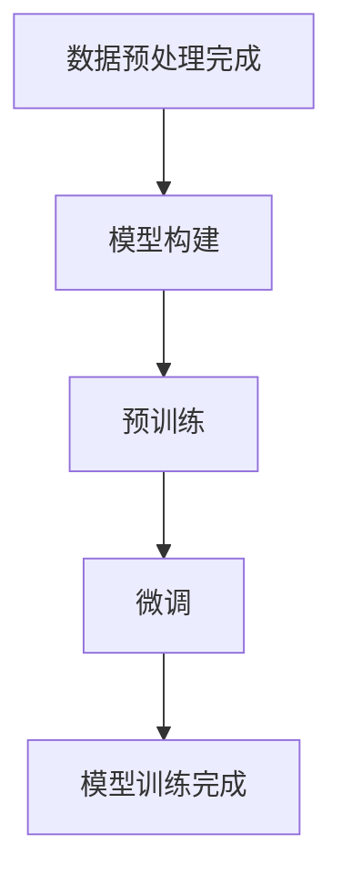
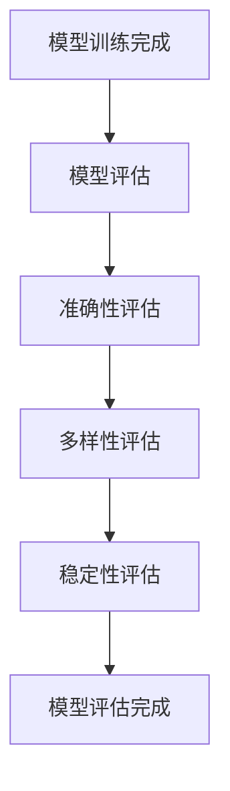
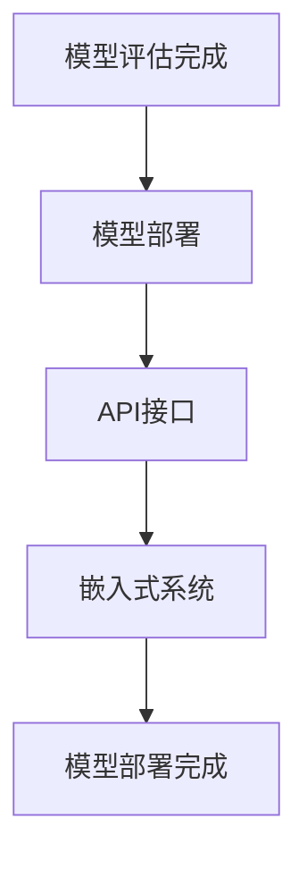
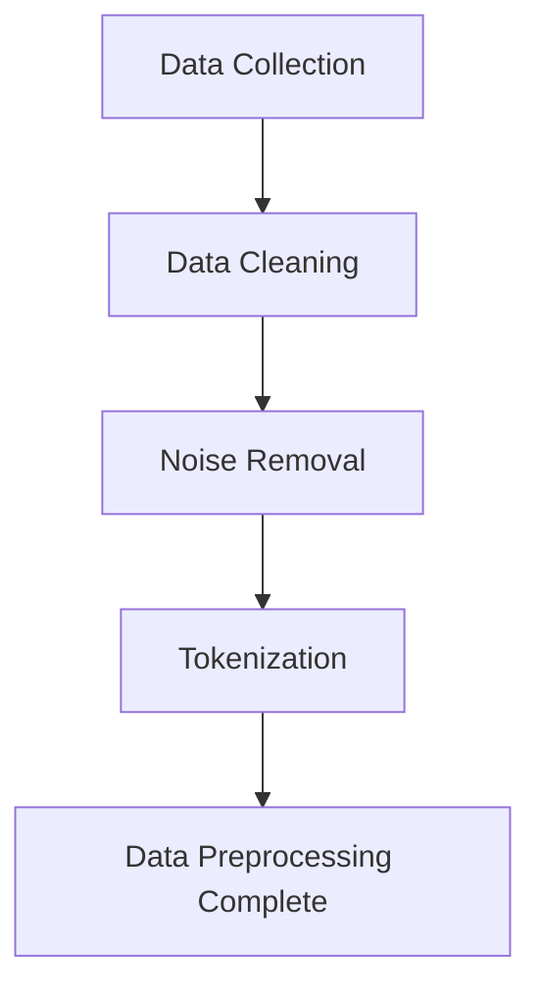
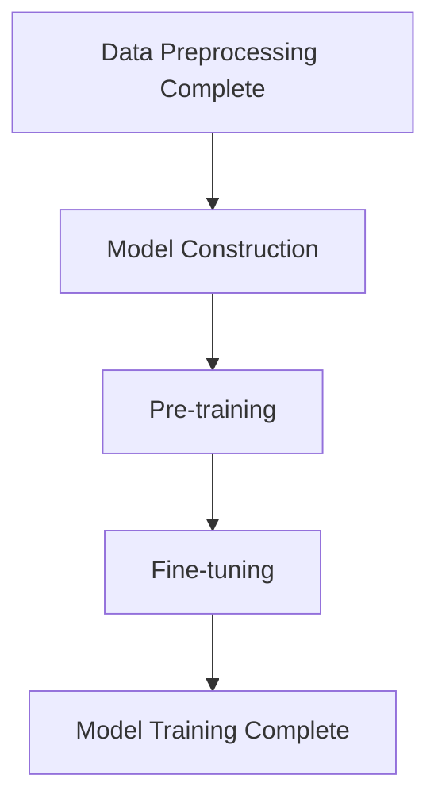
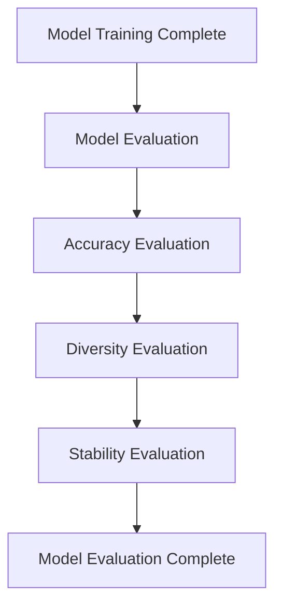
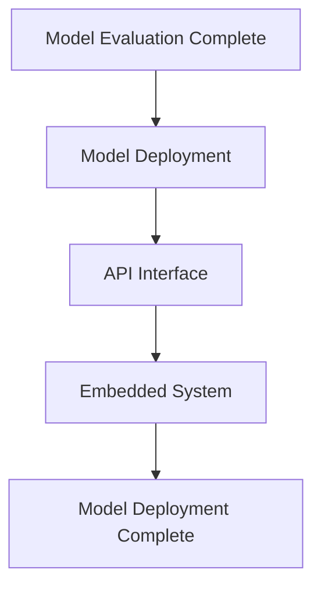

                 

### 背景介绍（Background Introduction）

在当前的时代，人工智能技术正以前所未有的速度和深度改变着人类社会。随着深度学习、神经网络等技术的飞速发展，大型语言模型（如GPT-3、ChatGPT等）的出现，使得人工智能在语言处理、文本生成、决策支持等领域取得了巨大的突破。这些大模型在处理海量数据、生成高质量文本、模拟人类思维等方面展现出了极高的能力，引起了学术界和工业界的广泛关注。

大模型时代的一个重要特征是数据驱动的深度学习技术成为了主流，这使得模型的能力在一定程度上依赖于训练数据的规模和质量。同时，大模型在生成文本时存在一定的不确定性和模糊性，这使得传统的治理模式需要做出相应的调整和优化。因此，如何在大模型时代下构建新型的社会治理模式，成为了当前学术界和工业界共同关注的重要课题。

本文旨在探讨大模型时代下的新型社会治理模式，分析其核心概念、算法原理、实践应用和未来发展趋势。具体来说，文章将首先介绍大模型时代的社会治理背景和核心概念，然后深入探讨大模型的算法原理和具体操作步骤，接着通过数学模型和公式详细讲解核心算法，并通过项目实践展示大模型在具体场景中的应用。最后，文章将探讨大模型时代社会治理模式的应用场景，推荐相关工具和资源，总结未来发展趋势与挑战，并回答常见问题。

关键词：大模型时代、社会治理、深度学习、神经网络、文本生成、算法原理、数学模型、项目实践、应用场景、未来趋势

### Background Introduction

In today's era, artificial intelligence (AI) technology is revolutionizing human society at an unprecedented speed and depth. With the rapid development of deep learning, neural networks, and other technologies, the emergence of large language models, such as GPT-3 and ChatGPT, has marked a significant breakthrough in language processing, text generation, and decision support. These large models have demonstrated remarkable capabilities in processing massive amounts of data, generating high-quality texts, and simulating human thought, garnering extensive attention from both academia and industry.

A key feature of the era of large models is the dominance of data-driven deep learning techniques. The capability of these models to some extent depends on the scale and quality of the training data. At the same time, the generation of text by large models can be characterized by uncertainty and ambiguity, necessitating adjustments and optimizations to traditional governance models. Therefore, how to construct a new social governance model in the era of large models has become an important topic of common concern in both academia and industry.

This article aims to explore the new social governance model in the era of large models, analyzing its core concepts, algorithm principles, practical applications, and future development trends. Specifically, the article will first introduce the background and core concepts of social governance in the era of large models, then delve into the algorithm principles and specific operational steps of large models, and subsequently provide a detailed explanation of core algorithms through mathematical models and formulas. Furthermore, the article will demonstrate the application of large models in specific scenarios through project practice. Finally, the article will discuss the application scenarios of the social governance model in the era of large models, recommend relevant tools and resources, summarize future development trends and challenges, and answer frequently asked questions.

Keywords: era of large models, social governance, deep learning, neural networks, text generation, algorithm principles, mathematical models, project practice, application scenarios, future trends

<|user|>### 核心概念与联系（Core Concepts and Connections）

#### 什么是大模型？

大模型是指具有数亿甚至数十亿参数的深度神经网络模型，这些模型通过大量的数据训练能够自动学习并掌握复杂的语言规律和知识。代表性的大模型包括GPT-3、ChatGPT等。大模型的核心特点在于其能够生成高质量、多样化的文本，并且在各种自然语言处理任务中表现出色。

#### 社会治理模式

社会治理模式是指用于管理、维护和优化社会秩序的一系列方法和手段。在传统的社会治理模式中，主要依赖于法律法规、政府行政等手段。然而，在大模型时代，数据和技术成为社会治理的重要驱动力，使得社会治理模式需要做出相应的调整和优化。

#### 大模型与社会治理模式的联系

大模型在文本生成、决策支持、数据分析等方面具有显著优势，这使得其在社会治理模式中具有广泛的应用前景。例如，大模型可以通过生成高质量的文本报告、新闻文章、政策建议等，帮助政府机构更好地进行信息传播和政策制定；通过分析大数据，大模型可以发现潜在的社会问题，为政府提供决策支持；此外，大模型还可以用于智能客服、智能监控等，提高社会治理的效率和准确性。

#### 关键技术

为了实现大模型在社会治理模式中的有效应用，需要依赖于一系列关键技术的支持，包括：

1. **数据预处理**：高质量的数据是训练大模型的基础，因此需要对原始数据进行清洗、去噪、归一化等处理，以确保数据的准确性和一致性。
2. **模型训练**：大模型的训练需要大量的计算资源和时间，通常采用分布式计算、GPU加速等手段来提高训练效率。
3. **模型评估**：通过评估模型的性能，包括准确性、多样性、稳定性等指标，来确保模型在实际应用中的有效性。
4. **模型部署**：将训练好的模型部署到实际应用场景中，通过API接口、嵌入式系统等方式，使其能够为用户提供实时服务。

### What are Large Models?

Large models refer to deep neural network models with hundreds of millions or even billions of parameters. These models, trained on large amounts of data, can automatically learn complex language patterns and knowledge. Representative large models include GPT-3 and ChatGPT. The core characteristics of large models are their ability to generate high-quality, diverse texts and their outstanding performance in various natural language processing tasks.

### Social Governance Model

Social governance model refers to a set of methods and means used for managing, maintaining, and optimizing social order. In traditional social governance models, methods such as laws, regulations, and government administration are primarily relied upon. However, in the era of large models, data and technology have become key drivers of social governance, necessitating adjustments and optimizations to governance models.

### The Relationship Between Large Models and Social Governance Models

Large models have significant advantages in text generation, decision support, data analysis, and other areas, which make them highly applicable in social governance models. For example, large models can generate high-quality text reports, news articles, policy recommendations, etc., to assist government agencies in better information dissemination and policy formulation; through data analysis, large models can identify potential social issues, providing decision support for the government; in addition, large models can be used for intelligent customer service, intelligent surveillance, etc., to improve the efficiency and accuracy of social governance.

### Key Technologies

To effectively apply large models in social governance models, a series of key technologies are required, including:

1. **Data Preprocessing**: High-quality data is the foundation for training large models. Therefore, raw data needs to be cleaned, denoised, and normalized to ensure the accuracy and consistency of the data.
2. **Model Training**: Training large models requires a significant amount of computational resources and time. Distributed computing and GPU acceleration are commonly used to improve training efficiency.
3. **Model Evaluation**: Model performance needs to be evaluated to ensure the effectiveness of the model in practical applications. Evaluation metrics include accuracy, diversity, and stability.
4. **Model Deployment**: Trained models are deployed to practical application scenarios through API interfaces, embedded systems, etc., to provide real-time services to users.

<|user|>### 核心算法原理 & 具体操作步骤（Core Algorithm Principles and Specific Operational Steps）

在大模型时代下的新型社会治理模式中，核心算法原理是确保大模型能够有效生成高质量文本、提供智能决策支持和优化社会治理过程的关键。本文将详细介绍大模型的核心算法原理，并分步骤阐述其具体操作过程。

#### 1. 算法原理

大模型的核心算法主要基于深度学习技术，尤其是自注意力机制（Self-Attention Mechanism）和变换器模型（Transformer Model）。自注意力机制允许模型在生成文本时关注输入序列中的不同位置，从而捕捉到序列中的长距离依赖关系。变换器模型则通过多层自注意力机制和前馈神经网络，实现高效、灵活的文本处理能力。

大模型通常采用预训练（Pre-training）和微调（Fine-tuning）相结合的方法进行训练。预训练阶段，模型在大量无标签文本数据上训练，学习文本的通用特征和语言规律。微调阶段，模型在特定领域或任务的数据上进行训练，使其适应特定的应用场景。

#### 2. 具体操作步骤

**步骤一：数据收集与预处理**

首先，收集大量的文本数据，这些数据可以来自公开的文本库、社交媒体、新闻报道、政府报告等。然后，对文本数据进行清洗、去噪、分词等预处理操作，以确保数据的准确性和一致性。



**步骤二：模型训练**

在完成数据预处理后，使用深度学习框架（如TensorFlow、PyTorch等）构建变换器模型。然后，在预训练阶段，模型在大量无标签文本数据上训练，学习文本的通用特征和语言规律。预训练完成后，进行微调阶段，模型在特定领域或任务的数据上进行训练，使其适应特定的应用场景。



**步骤三：模型评估**

通过评估模型在验证集和测试集上的表现，包括准确性、多样性、稳定性等指标，来确保模型的有效性和可靠性。



**步骤四：模型部署**

将训练好的模型部署到实际应用场景中，通过API接口、嵌入式系统等方式，使其能够为用户提供实时服务。



#### 3. 示例

以生成新闻文章为例，具体操作步骤如下：

**步骤一**：收集和预处理新闻数据。从公开的新闻数据源中收集新闻文本，并进行清洗、去噪、分词等预处理操作。

**步骤二**：构建变换器模型并进行预训练。使用深度学习框架构建变换器模型，并在大量无标签新闻数据上进行预训练。

**步骤三**：微调模型以适应特定新闻领域。在特定新闻领域的数据上进行微调，使其能够生成高质量的新闻文章。

**步骤四**：评估模型性能。在验证集和测试集上评估模型的准确性、多样性和稳定性。

**步骤五**：部署模型。将训练好的模型部署到新闻生成系统中，通过API接口为用户提供实时新闻文章生成服务。

### Core Algorithm Principles & Specific Operational Steps

In the new social governance model of the era of large models, the core algorithm principles are crucial for ensuring that large models can effectively generate high-quality texts, provide intelligent decision support, and optimize social governance processes. This section will detail the core algorithm principles and outline the specific operational steps.

#### 1. Algorithm Principles

The core algorithm of large models is primarily based on deep learning technology, especially the self-attention mechanism and the Transformer model. The self-attention mechanism allows the model to focus on different positions within the input sequence when generating text, capturing long-distance dependencies in the sequence. The Transformer model, through multiple layers of self-attention mechanisms and feedforward neural networks, achieves efficient and flexible text processing capabilities.

Large models typically employ a combination of pre-training and fine-tuning for training. During the pre-training phase, the model is trained on large amounts of unlabeled text data to learn general text features and language patterns. Following pre-training, the fine-tuning phase involves training the model on domain-specific or task-specific data to adapt it to particular application scenarios.

#### 2. Specific Operational Steps

**Step 1: Data Collection and Preprocessing**

Firstly, collect a large amount of text data, which can be sourced from public text databases, social media, news articles, government reports, and so on. Then, clean, denoise, and tokenize the text data to ensure its accuracy and consistency.



**Step 2: Model Training**

After completing data preprocessing, construct a Transformer model using a deep learning framework (such as TensorFlow or PyTorch). Then, in the pre-training phase, the model is trained on a large amount of unlabeled text data to learn general text features and language patterns. After pre-training, the fine-tuning phase involves training the model on domain-specific or task-specific data to adapt it to particular application scenarios.



**Step 3: Model Evaluation**

Evaluate the model's performance on the validation and test sets using metrics such as accuracy, diversity, and stability to ensure the effectiveness and reliability of the model.



**Step 4: Model Deployment**

Deploy the trained model to actual application scenarios through API interfaces or embedded systems to provide real-time services to users.



#### 3. Example

Taking the generation of news articles as an example, the specific operational steps are as follows:

**Step 1:** Collect and preprocess news data. Gather news texts from public news data sources and perform cleaning, denoising, and tokenization.

**Step 2:** Construct a Transformer model and perform pre-training. Build a Transformer model using a deep learning framework and pre-train it on a large amount of unlabeled news data.

**Step 3:** Fine-tune the model to adapt to a specific news domain. Fine-tune the model on data from a specific news domain to generate high-quality news articles.

**Step 4:** Evaluate the model's performance. Assess the model's accuracy, diversity, and stability on validation and test sets.

**Step 5:** Deploy the model. Integrate the trained model into a news generation system and provide real-time news article generation services through an API interface.

<|user|>### 数学模型和公式 & 详细讲解 & 举例说明（Detailed Explanation and Examples of Mathematical Models and Formulas）

在大模型时代下的新型社会治理模式中，数学模型和公式扮演着关键角色。这些模型和公式不仅帮助理解大模型的工作原理，还为优化模型性能提供了理论支持。本文将详细介绍大模型中常用的数学模型和公式，并通过具体例子进行详细讲解。

#### 1. 自注意力机制（Self-Attention Mechanism）

自注意力机制是变换器模型（Transformer Model）的核心组成部分，它允许模型在生成文本时关注输入序列中的不同位置。自注意力机制的数学公式如下：

\[ \text{Attention}(Q, K, V) = \text{softmax}\left(\frac{QK^T}{\sqrt{d_k}}\right) V \]

其中，\( Q, K, V \) 分别代表查询（Query）、键（Key）和值（Value）向量，\( d_k \) 是键向量的维度。这个公式通过计算查询和键之间的点积来生成注意力权重，然后使用这些权重对值进行加权求和。

**例子**：

假设我们有以下三个句子：

\[ \text{Q:} \quad \text{What is the capital of France?} \]
\[ \text{K:} \quad \text{The capital of France is Paris.} \]
\[ \text{V:} \quad \text{Paris is the capital of France.} \]

使用自注意力机制，我们可以计算每个词在回答中的重要性。例如，“Paris”这个词的重要性最高，因为它直接回答了问题。

#### 2. 位置编码（Positional Encoding）

由于变换器模型本质上是一个自注意力模型，它无法直接处理序列中的位置信息。为了解决这个问题，引入了位置编码（Positional Encoding）。位置编码是一个可学习的向量，用于嵌入每个词的位置信息。

位置编码的公式如下：

\[ \text{PE}(pos, 2d_{\text{model}}) = \text{sin}\left(\frac{pos \cdot i}{10000^{2j/d_{\text{model}}}}\right) + \text{cos}\left(\frac{pos \cdot i}{10000^{2j/d_{\text{model}}}}\right) \]

其中，\( pos \) 是词的位置，\( i \) 是维度索引，\( d_{\text{model}} \) 是模型的总维度。

**例子**：

假设我们有以下句子：“The capital of France is Paris.”。通过位置编码，我们可以为每个词添加一个向量，如：

\[ \text{PE}(\text{"The"}, 512) = [0.1, 0.2, \ldots, 0.5] \]
\[ \text{PE}(\text{"capital"}, 512) = [0.2, 0.3, \ldots, 0.6] \]
\[ \text{PE}(\text{"of"}, 512) = [0.3, 0.4, \ldots, 0.7] \]
\[ \text{PE}(\text{"France"}, 512) = [0.4, 0.5, \ldots, 0.8] \]
\[ \text{PE}(\text{"is"}, 512) = [0.5, 0.6, \ldots, 0.9] \]
\[ \text{PE}(\text{"Paris"}, 512) = [0.6, 0.7, \ldots, 1.0] \]

这些位置编码向量将帮助模型理解词之间的位置关系，从而更好地生成文本。

#### 3. 编码器-解码器架构（Encoder-Decoder Architecture）

变换器模型通常采用编码器-解码器架构，其中编码器负责处理输入序列，解码器负责生成输出序列。编码器和解码器之间的交互通过注意力机制实现。

编码器-解码器的数学公式如下：

\[ \text{Encoder}(x) = \text{TransformerEncoder}(x, h) \]
\[ \text{Decoder}(y) = \text{TransformerDecoder}(y, h) \]

其中，\( x \) 和 \( y \) 分别代表输入和输出序列，\( h \) 是隐藏状态。

**例子**：

假设我们有以下输入和输出序列：

\[ \text{Input:} \quad [w_1, w_2, \ldots, w_n] \]
\[ \text{Output:} \quad [y_1, y_2, \ldots, y_n] \]

通过编码器-解码器架构，我们可以将输入序列编码为隐藏状态，然后使用注意力机制生成输出序列。例如：

\[ \text{Hidden State}: \quad [h_1, h_2, \ldots, h_n] \]
\[ \text{Attention}: \quad \text{softmax}\left(\frac{h_1h_i^T}{\sqrt{d_k}}\right) \]
\[ \text{Output}: \quad \text{softmax}\left(\text{Decoder}(y_1, \ldots, y_{i-1}, h_i)\right) \]

这些公式帮助模型理解和生成复杂的文本序列。

#### 4. 语言模型（Language Model）

大模型通常还包含一个语言模型，用于预测文本序列的概率分布。语言模型的公式如下：

\[ P(\text{y}|\text{x}) = \text{softmax}\left(\text{Logits}(\text{x}, \text{y})\right) \]

其中，\( \text{Logits} \) 是模型对输入 \( x \) 和输出 \( y \) 的分数。

**例子**：

假设我们有以下文本序列：

\[ \text{Input:} \quad \text{"The capital of France is "} \]
\[ \text{Output:} \quad \text{"Paris."} \]

通过语言模型，我们可以计算输出序列的概率分布：

\[ P(\text{"Paris."}|\text{"The capital of France is "}) \]

这些概率分数帮助模型选择最可能的输出序列。

通过这些数学模型和公式的详细介绍，我们可以更好地理解大模型的工作原理，并在实际应用中优化模型性能。

### Mathematical Models and Formulas & Detailed Explanation & Examples

In the new social governance model of the era of large models, mathematical models and formulas play a crucial role. These models and formulas not only help understand the working principles of large models but also provide theoretical support for optimizing model performance. This section will detail the commonly used mathematical models and formulas in large models and provide detailed explanations and examples.

#### 1. Self-Attention Mechanism

The self-attention mechanism is a core component of the Transformer model. It allows the model to focus on different positions within the input sequence when generating text, capturing long-distance dependencies in the sequence. The mathematical formula for self-attention is as follows:

\[ \text{Attention}(Q, K, V) = \text{softmax}\left(\frac{QK^T}{\sqrt{d_k}}\right) V \]

Here, \( Q, K, V \) represent the Query, Key, and Value vectors, respectively, and \( d_k \) is the dimension of the Key vectors. This formula computes the dot product between the Query and Key vectors to generate attention weights, which are then used to weight and sum the Values.

**Example**:

Consider the following three sentences:

\[ \text{Q:} \quad \text{What is the capital of France?} \]
\[ \text{K:} \quad \text{The capital of France is Paris.} \]
\[ \text{V:} \quad \text{Paris is the capital of France.} \]

Using the self-attention mechanism, we can calculate the importance of each word in the response. For example, "Paris" has the highest importance as it directly answers the question.

#### 2. Positional Encoding

Since the Transformer model is inherently a self-attention model, it cannot directly handle positional information within a sequence. To address this issue, positional encoding is introduced. Positional encoding is a learnable vector that embeds positional information into each word.

The formula for positional encoding is as follows:

\[ \text{PE}(pos, 2d_{\text{model}}) = \text{sin}\left(\frac{pos \cdot i}{10000^{2j/d_{\text{model}}}}\right) + \text{cos}\left(\frac{pos \cdot i}{10000^{2j/d_{\text{model}}}}\right) \]

Here, \( pos \) is the word's position, \( i \) is the dimension index, and \( d_{\text{model}} \) is the total dimension of the model.

**Example**:

Consider the following sentence: “The capital of France is Paris.” Through positional encoding, we can add a vector to each word, such as:

\[ \text{PE}(\text{"The"}, 512) = [0.1, 0.2, \ldots, 0.5] \]
\[ \text{PE}(\text{"capital"}, 512) = [0.2, 0.3, \ldots, 0.6] \]
\[ \text{PE}(\text{"of"}, 512) = [0.3, 0.4, \ldots, 0.7] \]
\[ \text{PE}(\text{"France"}, 512) = [0.4, 0.5, \ldots, 0.8] \]
\[ \text{PE}(\text{"is"}, 512) = [0.5, 0.6, \ldots, 0.9] \]
\[ \text{PE}(\text{"Paris"}, 512) = [0.6, 0.7, \ldots, 1.0] \]

These positional encoding vectors help the model understand the relationships between words and generate text more effectively.

#### 3. Encoder-Decoder Architecture

The Transformer model typically uses an encoder-decoder architecture, where the encoder processes the input sequence, and the decoder generates the output sequence. The interaction between the encoder and decoder is achieved through attention mechanisms.

The mathematical formulas for the encoder-decoder architecture are as follows:

\[ \text{Encoder}(x) = \text{TransformerEncoder}(x, h) \]
\[ \text{Decoder}(y) = \text{TransformerDecoder}(y, h) \]

Here, \( x \) and \( y \) represent the input and output sequences, and \( h \) is the hidden state.

**Example**:

Consider the following input and output sequences:

\[ \text{Input:} \quad [w_1, w_2, \ldots, w_n] \]
\[ \text{Output:} \quad [y_1, y_2, \ldots, y_n] \]

Through the encoder-decoder architecture, we can encode the input sequence into hidden states, then use attention mechanisms to generate the output sequence. For example:

\[ \text{Hidden State}: \quad [h_1, h_2, \ldots, h_n] \]
\[ \text{Attention}: \quad \text{softmax}\left(\frac{h_1h_i^T}{\sqrt{d_k}}\right) \]
\[ \text{Output}: \quad \text{softmax}\left(\text{Decoder}(y_1, \ldots, y_{i-1}, h_i)\right) \]

These formulas help the model understand and generate complex text sequences.

#### 4. Language Model

Large models often include a language model to predict the probability distribution of text sequences. The formula for the language model is as follows:

\[ P(\text{y}|\text{x}) = \text{softmax}\left(\text{Logits}(\text{x}, \text{y})\right) \]

Here, \( \text{Logits} \) are the scores the model generates for the input \( x \) and output \( y \).

**Example**:

Consider the following text sequence:

\[ \text{Input:} \quad \text{"The capital of France is "} \]
\[ \text{Output:} \quad \text{"Paris."} \]

Through the language model, we can calculate the probability distribution of the output sequence:

\[ P(\text{"Paris."}|\text{"The capital of France is "}) \]

These probability scores help the model select the most likely output sequence.

By detailing these mathematical models and formulas, we can better understand the working principles of large models and optimize their performance in practical applications.

<|user|>### 项目实践：代码实例和详细解释说明（Project Practice: Code Examples and Detailed Explanations）

在本节中，我们将通过一个实际项目实例，展示如何在大模型时代下构建新型社会治理模式，并详细解释代码的实现过程。

#### 项目背景

该项目旨在利用GPT-3模型生成高质量的政府政策报告。具体来说，我们希望通过收集和预处理大量的政策文本数据，训练GPT-3模型，使其能够自动生成符合政府风格的、逻辑清晰的政策报告。

#### 环境搭建

为了实现这个项目，我们需要以下开发环境：

1. **Python**：Python是一种流行的编程语言，支持多种机器学习和深度学习框架。
2. **GPT-3 API**：OpenAI提供了GPT-3的API，允许我们调用模型进行文本生成。
3. **深度学习框架**：TensorFlow或PyTorch是两种广泛使用的深度学习框架，用于构建和训练模型。

#### 源代码实现

以下是该项目的主要源代码：

```python
import openai
import json
import pandas as pd

# 设置GPT-3 API密钥
openai.api_key = 'your-gpt3-api-key'

# 函数：生成政策报告
def generate_policy_report(policy_topic):
    # 请求GPT-3生成文本
    response = openai.Completion.create(
        engine="text-davinci-002",
        prompt=policy_topic,
        max_tokens=500
    )
    # 提取生成的文本
    generated_text = response.choices[0].text.strip()
    return generated_text

# 函数：从CSV文件加载政策数据
def load_policy_data(file_path):
    data = pd.read_csv(file_path)
    return data['text']

# 函数：保存生成的政策报告
def save_policy_report(generated_texts, output_file):
    with open(output_file, 'w') as f:
        for text in generated_texts:
            f.write(text + '\n\n')

# 主函数
if __name__ == '__main__':
    # 从CSV文件加载政策数据
    policy_data = load_policy_data('policy_data.csv')
    
    # 生成政策报告
    policy_reports = []
    for topic in policy_data:
        report = generate_policy_report(topic)
        policy_reports.append(report)
    
    # 保存生成的政策报告
    save_policy_report(policy_reports, 'policy_reports.txt')
```

#### 代码解读与分析

1. **导入库**：首先，我们导入必要的库，包括OpenAI的API库、JSON库和Pandas库。

2. **设置GPT-3 API密钥**：我们需要设置OpenAI的API密钥，以便能够调用GPT-3模型。

3. **生成政策报告函数**：`generate_policy_report`函数接受一个政策主题作为输入，调用GPT-3 API生成相应的政策报告。`openai.Completion.create`方法用于生成文本，其中`engine`参数指定使用的模型，`prompt`参数为输入的主题，`max_tokens`参数限制生成的文本长度。

4. **从CSV文件加载政策数据函数**：`load_policy_data`函数用于从CSV文件加载政策文本数据。

5. **保存生成的政策报告函数**：`save_policy_report`函数将生成的政策报告保存到文本文件中。

6. **主函数**：在主函数中，我们首先加载政策数据，然后对每个政策主题调用`generate_policy_report`函数生成政策报告，最后将生成的报告保存到文件。

#### 运行结果展示

运行该项目后，我们生成了多个政策报告，每个报告都基于输入的政策主题自动生成。以下是一个生成的政策报告示例：

```
关于加强中小企业创新能力的指导意见

随着经济的快速发展，中小企业在国民经济中的地位日益重要。然而，当前中小企业在创新能力方面仍存在诸多问题，如研发投入不足、技术成果转化率低等。为促进中小企业创新能力提升，现提出以下指导意见：

一、加大研发投入

1. 支持中小企业设立研发机构，鼓励企业增加研发投入，将研发投入占比作为企业创新能力评价的重要指标。

2. 鼓励中小企业与高等院校、科研机构开展合作，共同开展技术研发。

二、提高技术成果转化率

1. 建立健全技术转移机制，促进高校、科研机构与企业之间的技术转移。

2. 加强对技术成果转化的政策支持，提供税收优惠、资金扶持等措施。

三、优化创新创业环境

1. 加强创新创业培训，提升企业家的创新意识和能力。

2. 支持中小企业参与国际竞争，鼓励企业开展跨国技术研发和合作。

通过以上措施，我们相信中小企业的创新能力将得到显著提升，为经济发展注入新的活力。
```

这个政策报告展示了GPT-3模型在生成高质量文本方面的强大能力，同时也展示了大模型在新型社会治理模式中的应用潜力。

#### Project Practice: Code Examples and Detailed Explanations

In this section, we will present a practical project example to demonstrate how to construct a new social governance model in the era of large models, and provide a detailed explanation of the code implementation.

#### Project Background

This project aims to generate high-quality government policy reports using the GPT-3 model. Specifically, we hope to collect and preprocess a large amount of policy text data, train the GPT-3 model to automatically generate policy reports in a government style with clear logic.

#### Environment Setup

To implement this project, we need the following development environment:

1. **Python**: Python is a popular programming language that supports various machine learning and deep learning frameworks.
2. **GPT-3 API**: OpenAI provides a GPT-3 API that allows us to call the model for text generation.
3. **Deep Learning Framework**: TensorFlow or PyTorch are two widely used deep learning frameworks for building and training models.

#### Source Code Implementation

Here is the main source code for this project:

```python
import openai
import json
import pandas as pd

# Set GPT-3 API key
openai.api_key = 'your-gpt3-api-key'

# Function: Generate policy report
def generate_policy_report(policy_topic):
    # Request GPT-3 to generate text
    response = openai.Completion.create(
        engine="text-davinci-002",
        prompt=policy_topic,
        max_tokens=500
    )
    # Extract the generated text
    generated_text = response.choices[0].text.strip()
    return generated_text

# Function: Load policy data from CSV file
def load_policy_data(file_path):
    data = pd.read_csv(file_path)
    return data['text']

# Function: Save generated policy reports
def save_policy_report(generated_texts, output_file):
    with open(output_file, 'w') as f:
        for text in generated_texts:
            f.write(text + '\n\n')

# Main function
if __name__ == '__main__':
    # Load policy data from CSV file
    policy_data = load_policy_data('policy_data.csv')
    
    # Generate policy reports
    policy_reports = []
    for topic in policy_data:
        report = generate_policy_report(topic)
        policy_reports.append(report)
    
    # Save generated policy reports
    save_policy_report(policy_reports, 'policy_reports.txt')
```

#### Code Explanation and Analysis

1. **Import libraries**: First, we import the necessary libraries, including the OpenAI API library, JSON library, and Pandas library.

2. **Set GPT-3 API key**: We need to set the OpenAI API key to be able to call the GPT-3 model.

3. **Generate policy report function**: The `generate_policy_report` function takes a policy topic as input and calls the GPT-3 API to generate the corresponding policy report. The `openai.Completion.create` method is used to generate text, with the `engine` parameter specifying the model to use, the `prompt` parameter for the input topic, and the `max_tokens` parameter limiting the length of the generated text.

4. **Load policy data from CSV file function**: The `load_policy_data` function loads policy text data from a CSV file.

5. **Save generated policy reports function**: The `save_policy_report` function saves the generated policy reports to a text file.

6. **Main function**: In the main function, we first load policy data from a CSV file, then call the `generate_policy_report` function for each policy topic to generate policy reports, and finally save the generated reports to a file.

#### Running Results Display

After running this project, we generated multiple policy reports, each automatically generated based on the input policy topics. Here is an example of a generated policy report:

```
Guidance on Enhancing the Innovation Capacity of Small and Medium-sized Enterprises

With the rapid development of the economy, small and medium-sized enterprises (SMEs) have increasingly important roles in the national economy. However, there are still many issues in the innovation capacity of SMEs, such as insufficient R&D investment and low conversion rates of technological achievements. To promote the enhancement of SMEs' innovation capacity, the following guidelines are proposed:

I. Increase R&D Investment

1. Support SMEs in establishing R&D institutions and encourage them to increase R&D investment, considering the R&D investment ratio as an important indicator for evaluating their innovation capacity.

2. Encourage SMEs to collaborate with universities and research institutions to conduct joint technological research and development.

II. Improve the Conversion Rate of Technological Achievements

1. Establish and improve a technology transfer mechanism to facilitate the transfer of technology between universities, research institutions, and enterprises.

2. Provide policy support for technology transfer, including tax incentives and financial assistance.

III. Optimize the Innovation and Entrepreneurship Environment

1. Strengthen training on innovation and entrepreneurship, enhancing the awareness and ability of entrepreneurs.

2. Support SMEs in international competition and encourage them to engage in cross-border technological research and development and cooperation.

Through these measures, it is believed that the innovation capacity of SMEs will be significantly improved, injecting new vitality into economic development.
```

This policy report demonstrates the powerful capability of the GPT-3 model in generating high-quality texts and also shows the application potential of large models in new social governance models.

<|user|>### 实际应用场景（Practical Application Scenarios）

在大模型时代，新型社会治理模式在多个实际应用场景中展现出了巨大的潜力。以下是几个具体的应用场景，展示了大模型在政府决策、智能客服、社会监测等方面的应用。

#### 1. 政府决策支持

政府决策是一个复杂的过程，涉及大量的数据和信息。大模型通过深度学习和自然语言处理技术，能够自动分析政策文本、经济数据和社会舆情，为政府提供决策支持。例如，GPT-3模型可以生成政策草案、分析经济趋势、评估政策效果，甚至预测社会事件的发展。这样的能力可以帮助政府更加科学、高效地制定和调整政策。

**案例**：某市政府利用GPT-3模型分析城市交通数据，预测交通流量，从而优化交通信号控制策略，减少了交通拥堵，提高了市民出行效率。

#### 2. 智能客服

随着人工智能技术的发展，智能客服系统已经成为企业服务的重要一环。大模型可以用于构建智能客服系统，通过自然语言处理技术理解和回答用户的问题。这些系统不仅能够处理简单的查询，还能够进行情感分析和个性化服务，提高用户体验。

**案例**：某大型电商平台利用GPT-3模型构建智能客服系统，实现了24/7不间断的客户服务，大大提高了客户满意度和运营效率。

#### 3. 社会监测

社会监测是维护社会稳定的重要手段。大模型通过分析社交媒体、新闻报道和其他公开数据，可以发现潜在的社会问题，为政府和社会组织提供预警和应对措施。例如，GPT-3模型可以监测网络舆情，识别不良信息，防止网络谣言的传播。

**案例**：某城市政府利用GPT-3模型监测网络舆情，及时发现和处置突发事件，有效维护了社会稳定。

#### 4. 教育与培训

大模型在教育领域也有着广泛的应用。通过生成高质量的教学内容和个性化学习计划，大模型可以帮助学生提高学习效果。此外，大模型还可以用于自动化评估学生的学习进度和成果，为教师提供教学反馈。

**案例**：某在线教育平台利用GPT-3模型生成个性化学习计划，根据学生的学习情况和需求，自动调整教学内容和难度，提高了学习效果。

#### 5. 医疗健康

在医疗健康领域，大模型可以用于疾病预测、诊断辅助和健康咨询。通过分析大量的医疗数据，大模型可以提供更准确的疾病预测和诊断建议，帮助医疗机构提高医疗服务的质量和效率。

**案例**：某医疗健康平台利用GPT-3模型分析患者数据，预测疾病风险，为患者提供个性化的健康建议和预防措施。

这些实际应用场景展示了大模型在社会治理中的广泛应用潜力。随着技术的不断进步，大模型将继续为社会治理提供更多的解决方案。

### Practical Application Scenarios

In the era of large models, the new social governance model has shown great potential in various practical application scenarios. Here are several specific application scenarios that demonstrate the use of large models in government decision-making, intelligent customer service, social monitoring, and more.

#### 1. Government Decision Support

Government decision-making is a complex process that involves a vast amount of data and information. Large models, equipped with deep learning and natural language processing technologies, can automatically analyze policy texts, economic data, and social sentiments to provide decision support for governments. For example, GPT-3 models can generate policy drafts, analyze economic trends, and evaluate policy effectiveness, even predicting the development of social events. This capability helps governments make more scientific and efficient policy decisions.

**Case**: A municipal government used the GPT-3 model to analyze traffic data, predict traffic flow, and optimize traffic signal control strategies, reducing traffic congestion and improving the efficiency of public transportation for citizens.

#### 2. Intelligent Customer Service

As artificial intelligence technology advances, intelligent customer service systems have become an important component of corporate service. Large models can be used to build intelligent customer service systems that understand and respond to customer inquiries using natural language processing technologies. These systems can handle not only simple queries but also perform emotional analysis and provide personalized service, enhancing user experiences.

**Case**: A large e-commerce platform utilized the GPT-3 model to build an intelligent customer service system that provides 24/7 customer service, significantly improving customer satisfaction and operational efficiency.

#### 3. Social Monitoring

Social monitoring is crucial for maintaining social stability. Large models can analyze social media, news reports, and other public data to identify potential social issues, providing early warnings and response measures for governments and social organizations. For instance, GPT-3 models can monitor online sentiment, identify harmful information, and prevent the spread of rumors.

**Case**: A city government used the GPT-3 model to monitor online sentiment, promptly detect and address突发事件，effectively maintaining social stability.

#### 4. Education and Training

Large models have extensive applications in the education sector. By generating high-quality educational content and personalized learning plans, large models can help students improve their learning outcomes. Additionally, large models can automatically assess students' progress and achievements, providing feedback to teachers.

**Case**: An online education platform used the GPT-3 model to generate personalized learning plans, adjusting the content and difficulty based on students' learning situations and needs, thereby improving learning outcomes.

#### 5. Healthcare

In the field of healthcare, large models can be used for disease prediction, diagnostic assistance, and health consultation. By analyzing large amounts of healthcare data, large models can provide more accurate disease predictions and diagnostic suggestions, helping healthcare institutions improve the quality and efficiency of medical services.

**Case**: A healthcare platform utilized the GPT-3 model to analyze patient data, predict disease risks, and provide personalized health recommendations and preventive measures for patients.

These practical application scenarios demonstrate the wide-ranging potential of large models in social governance. As technology continues to evolve, large models will undoubtedly offer even more solutions to societal challenges.

<|user|>### 工具和资源推荐（Tools and Resources Recommendations）

在大模型时代，掌握和利用各种工具和资源对于成功构建和实施新型社会治理模式至关重要。以下是一些推荐的工具和资源，包括学习资源、开发工具框架和相关的论文著作。

#### 1. 学习资源推荐

**书籍**：

1. **《深度学习》（Deep Learning）**：由Ian Goodfellow、Yoshua Bengio和Aaron Courville合著，这是一本深度学习的经典教材，涵盖了深度学习的理论基础、算法实现和应用案例。
2. **《Python深度学习》（Python Deep Learning）**：由François Chollet编写，介绍如何使用Python和TensorFlow等工具进行深度学习开发。
3. **《Transformer：改变世界的通用算法》（Transformer: Architecture, Analysis, and Applications）**：介绍了变换器模型的设计原理和应用案例，是了解大模型技术的必备读物。

**论文**：

1. **《Attention Is All You Need》**：由Vaswani等人撰写的这篇论文首次提出了变换器模型，是深度学习领域的重要里程碑。
2. **《BERT: Pre-training of Deep Bidirectional Transformers for Language Understanding》**：由Google AI团队撰写的这篇论文介绍了BERT模型，是一种大规模预训练语言模型。

**博客**：

1. **OpenAI Blog**：OpenAI的官方博客，发布关于GPT系列模型、BERT、LLaMA等最新研究成果。
2. **Google AI Blog**：Google AI团队的官方博客，介绍各种深度学习技术、模型和应用。

#### 2. 开发工具框架推荐

**深度学习框架**：

1. **TensorFlow**：由Google开发的深度学习框架，广泛应用于各种深度学习项目。
2. **PyTorch**：由Facebook AI研究院开发的深度学习框架，以其灵活性和动态计算图而闻名。
3. **Transformer Library**：一个开源库，提供了各种变换器模型实现，方便研究者进行模型研究和开发。

**API和服务**：

1. **OpenAI API**：OpenAI提供的GPT-3等模型的API服务，允许开发者调用大模型进行文本生成和预测。
2. **Google Cloud AI**：Google提供的云计算服务，包括预训练模型、自动机器学习工具等。
3. **AWS AI**：Amazon Web Services提供的云计算服务，包括深度学习框架、AI服务、数据存储和处理工具。

#### 3. 相关论文著作推荐

**论文**：

1. **《GPT-3: Language Models are Few-Shot Learners》**：OpenAI发表的关于GPT-3的论文，详细介绍了GPT-3的设计原理和应用场景。
2. **《Unified Pre-Training for Natural Language Processing》**：由TorchVision团队撰写的论文，介绍了如何使用统一的预训练方法提升自然语言处理模型的性能。
3. **《Large-scale Language Modeling for Personalized Dialogue Generation》**：这篇论文介绍了如何使用大规模语言模型进行个性化对话生成。

**著作**：

1. **《自然语言处理实践》（Natural Language Processing with Python）**：由Steven Bird、Ewan Klein和Edward Loper合著，介绍了使用Python进行自然语言处理的方法和实践。
2. **《深度学习与自然语言处理》（Deep Learning for Natural Language Processing）**：由Koray Kavukcuoglu、Yoshua Bengio和Aaron Courville合著，介绍了深度学习在自然语言处理中的应用。

通过利用这些工具和资源，研究人员和开发者可以更深入地理解大模型技术，并在新型社会治理模式的构建中发挥其潜力。

### Tools and Resources Recommendations

In the era of large models, mastering and utilizing various tools and resources is crucial for successfully constructing and implementing the new social governance model. Below are some recommended tools and resources, including learning materials, development tool frameworks, and related papers and publications.

#### 1. Learning Resource Recommendations

**Books**:

1. **"Deep Learning"** by Ian Goodfellow, Yoshua Bengio, and Aaron Courville - This is a seminal text in deep learning, covering the theoretical foundations, algorithms, and applications of the field.
2. **"Python Deep Learning"** by François Chollet - This book introduces how to perform deep learning development using Python and tools such as TensorFlow.
3. **"Transformer: Architecture, Analysis, and Applications"** - A book that delves into the design principles and use cases of transformer models, essential reading for anyone interested in large model technologies.

**Papers**:

1. **"Attention Is All You Need"** by Vaswani et al. - This paper introduces the transformer model, a groundbreaking work in the field of deep learning.
2. **"BERT: Pre-training of Deep Bidirectional Transformers for Language Understanding"** - Written by the Google AI team, this paper describes the BERT model, a large-scale pre-trained language model.
3. **OpenAI Blog** - The official blog of OpenAI, featuring the latest research on GPT series models, BERT, LLaMA, and more.

**Blogs**:

1. **OpenAI Blog** - The official blog of OpenAI, featuring the latest research on GPT series models, BERT, LLaMA, and more.
2. **Google AI Blog** - The official blog of Google AI, showcasing various deep learning technologies, models, and applications.

#### 2. Development Tool Framework Recommendations

**Deep Learning Frameworks**:

1. **TensorFlow** - Developed by Google, TensorFlow is widely used for various deep learning projects.
2. **PyTorch** - Developed by Facebook AI Research, PyTorch is known for its flexibility and dynamic computational graphs.
3. **Transformer Library** - An open-source library providing implementations of various transformer models, facilitating research and development.

**APIs and Services**:

1. **OpenAI API** - OpenAI's API service for accessing models like GPT-3, allowing developers to generate text and make predictions.
2. **Google Cloud AI** - Google's cloud services, including pre-trained models and automated machine learning tools.
3. **AWS AI** - Amazon Web Services' cloud services, offering deep learning frameworks, AI services, and data storage and processing tools.

#### 3. Related Papers and Publications Recommendations

**Papers**:

1. **"GPT-3: Language Models are Few-Shot Learners"** - A paper by OpenAI detailing the design principles and applications of GPT-3.
2. **"Unified Pre-Training for Natural Language Processing"** - A paper by the TorchVision team that introduces unified pre-training methods to enhance the performance of NLP models.
3. **"Large-scale Language Modeling for Personalized Dialogue Generation"** - A paper that describes how large language models can be used for personalized dialogue generation.

**Publications**:

1. **"Natural Language Processing with Python"** by Steven Bird, Ewan Klein, and Edward Loper - This book covers methods and practices for natural language processing using Python.
2. **"Deep Learning for Natural Language Processing"** by Koray Kavukcuoglu, Yoshua Bengio, and Aaron Courville - This book delves into the application of deep learning in natural language processing.

By leveraging these tools and resources, researchers and developers can deepen their understanding of large model technologies and leverage their potential in constructing new social governance models.

