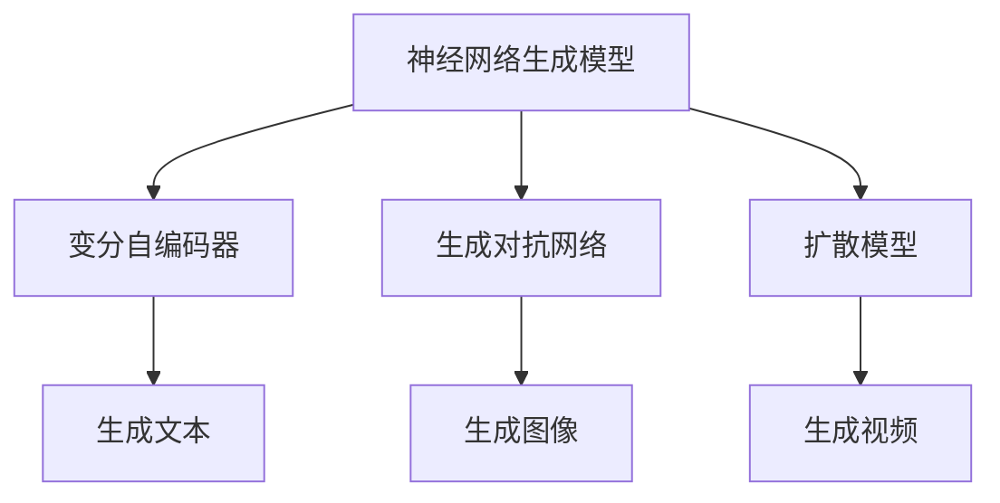

                 

# 生成式人工智能的优势：创造性内容

> 关键词：生成式人工智能, 创造性内容, 神经网络生成模型, 变分自编码器, 生成对抗网络, 扩散模型, 模型评估

## 1. 背景介绍

生成式人工智能（Generative Artificial Intelligence, GAI）是指通过深度学习等技术手段，使计算机具备生成新内容的能力。这些内容可以是文本、图像、音频、视频等多种形式，涵盖自然语言处理、计算机视觉、音频处理等多个领域。生成式AI已经成为推动内容创作、创新设计、智能推荐等领域的重要驱动力。

生成式AI的革命性突破源于神经网络生成模型（Neural Network Generative Models, NGMs）的发展。NGMs可以自动学习数据的潜在分布，生成与训练数据类似的新样本，甚至能够创造出全新的内容。这种能力使得生成式AI在多个行业中找到了广泛的应用，例如文本生成、音乐创作、图像生成、影视制作等。

本文将深入探讨生成式人工智能的优势，通过讲解几种常用的生成模型——变分自编码器（Variational Autoencoder, VAE）、生成对抗网络（Generative Adversarial Network, GAN）、扩散模型（Diffusion Model）等，帮助读者理解这些模型的工作原理和应用效果。

## 2. 核心概念与联系

### 2.1 核心概念概述

- **变分自编码器（VAE）**：一种基于自回归的生成模型，能够学习数据的潜在分布，用于生成新的数据样本。VAE通过最大化真实数据与生成数据的相似性来优化模型参数。

- **生成对抗网络（GAN）**：一种对抗式的生成模型，由生成器和判别器两个部分组成。生成器尝试生成尽可能逼真的样本，而判别器则试图区分真实数据与生成数据。两个部分通过对抗训练不断优化，最终生成高质量的新数据。

- **扩散模型（Diffusion Model）**：一种新兴的生成模型，通过逐步引入噪声并去除噪声的过程来实现从噪声到高质量样本的生成。扩散模型在文本生成、图像生成等任务上取得了显著的效果。

这些核心概念之间的联系可以通过以下Mermaid流程图来展示：



这个流程图展示了几种常用的生成模型及其应用场景。

## 3. 核心算法原理 & 具体操作步骤
### 3.1 算法原理概述

生成式AI的原理可以概括为通过训练一个生成模型，使得该模型能够根据输入的随机噪声或其他先验信息，生成高质量的新样本。这些新样本在风格、内容、结构上与训练数据具有较高的相似性，甚至可能创造出全新的内容。

以文本生成为例，生成式AI通过学习文本数据的分布，能够自动生成流畅、连贯、富有创意的文本。这种能力不仅能够辅助人类的内容创作，还能用于自动化文本生成、机器翻译、情感分析、推荐系统等众多应用场景。

### 3.2 算法步骤详解

以变分自编码器（VAE）为例，其训练和生成步骤可以分为以下几个部分：

1. **数据准备**：准备用于训练的文本数据，将其转换为数值化形式。

2. **编码器训练**：使用训练数据对编码器进行训练，使得编码器能够将输入数据映射到一个低维潜空间。

3. **解码器训练**：使用训练数据对解码器进行训练，使得解码器能够从潜空间中生成与原始数据相似的新数据。

4. **生成新数据**：使用训练好的编码器和解码器，根据输入的随机噪声生成新的文本数据。

以下是VAE的生成和训练步骤的详细步骤：

- **生成步骤**：
  1. 对输入文本 $x$ 进行编码，得到潜空间表示 $z$。
  2. 使用解码器 $q(z|x)$ 从潜空间 $z$ 生成文本 $x'$。

- **训练步骤**：
  1. 最大化真实数据 $x$ 与生成数据 $x'$ 的相似性，即最小化重构损失 $\mathcal{L}_{recon} = \frac{1}{N}\sum_{i=1}^N \|x_i - x_i'\|^2$。
  2. 最大化潜空间 $z$ 的概率分布 $p(z|x)$，即最小化KL散度 $\mathcal{L}_{KL} = \mathbb{E}_{q(z|x)}[log(p(z|x)) - log(q(z|x))]$。

### 3.3 算法优缺点

生成式AI具有以下优点：

- **创新性**：能够生成全新的内容，拓展了内容创作的边界。
- **灵活性**：适应性强，能够应用于多个领域和任务。
- **自动化**：减少了人工干预，提高了内容创作的效率。
- **多样性**：生成的内容多样，能够满足不同用户的个性化需求。

同时，生成式AI也存在一些局限性：

- **质量不稳定**：生成的内容质量取决于模型的训练数据和算法设计，有时可能生成不符合预期的结果。
- **缺乏真实性**：生成的内容往往缺乏真实性和可信度，难以用于高风险的决策场景。
- **伦理问题**：生成内容可能涉及版权、隐私等问题，需要谨慎处理。
- **资源消耗**：训练和生成高质量内容需要大量的计算资源和时间。

### 3.4 算法应用领域

生成式AI在多个领域都有广泛的应用，以下是几个典型的应用场景：

- **内容创作**：自动生成新闻报道、小说、诗歌等文本内容，辅助人类的内容创作。
- **设计创新**：生成艺术作品、产品设计、虚拟场景等，为创意设计提供灵感。
- **个性化推荐**：根据用户的历史行为和偏好，生成个性化的内容推荐。
- **智能客服**：通过生成对话内容，实现自动化的客户服务。
- **游戏娱乐**：生成游戏角色、场景、故事情节等，提升游戏体验。
- **医学影像**：生成高质量的医学图像，辅助医学诊断和治疗。

## 4. 数学模型和公式 & 详细讲解 & 举例说明

### 4.1 数学模型构建

以变分自编码器（VAE）为例，其数学模型可以表示为：

$$
p(x|z) = \mathcal{N}(x|\mu(z),\Sigma(z))
$$

其中，$x$ 表示原始数据，$z$ 表示潜空间中的表示，$\mu(z)$ 和 $\Sigma(z)$ 分别为潜空间的均值和方差。

VAE的编码器 $q(z|x)$ 和解码器 $p(x|z)$ 可以通过以下公式定义：

$$
q(z|x) = \mathcal{N}(z|\mu(x),\Sigma(x))
$$

$$
p(x|z) = \mathcal{N}(x|\mu(z),\Sigma(z))
$$

### 4.2 公式推导过程

VAE的生成过程和重构损失可以表示为：

$$
\mathcal{L}_{recon} = \frac{1}{N}\sum_{i=1}^N \|x_i - x_i'\|^2
$$

其中，$x_i'$ 表示通过解码器生成的数据样本，$\| \cdot \|$ 表示欧式距离。

VAE的训练过程可以表示为：

$$
\min_{\mu, \Sigma} \mathbb{E}_{q(z|x)}[log(p(z|x)) - log(q(z|x))] + \mathbb{E}_{p(z)}[log(p(x|z))]
$$

其中，$\mu, \Sigma$ 表示编码器和解码器的参数，$\mathbb{E}_{q(z|x)}$ 表示期望值计算，$p(z)$ 表示潜空间的先验分布，通常假设为标准正态分布。

### 4.3 案例分析与讲解

以文本生成为例，假设有如下文本数据：

$$
x = \begin{bmatrix} text_1 \\ text_2 \\ \vdots \\ text_n \end{bmatrix}
$$

使用VAE生成新文本的步骤如下：

1. 对 $x$ 进行编码，得到潜空间表示 $z$。
2. 使用解码器 $p(x|z)$ 从 $z$ 生成新文本 $x'$。
3. 通过最大化重构损失和潜空间分布的KL散度，训练模型参数。

在实践中，VAE的性能可以通过以下指标进行评估：

- **重构误差**：衡量生成样本与原始样本之间的距离。
- **KL散度**：衡量编码器输出与先验分布之间的距离。
- **样本多样性**：衡量生成样本的多样性和独特性。

## 5. 项目实践：代码实例和详细解释说明

### 5.1 开发环境搭建

以下是在Python中使用TensorFlow实现VAE的开发环境搭建流程：

1. 安装TensorFlow：
```bash
pip install tensorflow
```

2. 准备数据：
```python
import tensorflow as tf
import numpy as np

# 读取文本数据
text = tf.data.TextLineDataset('text_data.txt').batch(64).repeat()

# 定义符号
x = tf.placeholder(tf.string, shape=None)
```

3. 构建编码器和解码器：
```python
# 定义编码器
encoder_layer = tf.keras.layers.Dense(128, activation='relu')
z_mean = tf.keras.layers.Dense(2)
z_log_var = tf.keras.layers.Dense(2)

# 定义解码器
decoder_layer = tf.keras.layers.Dense(128, activation='relu')
x_prime_mean = tf.keras.layers.Dense(64)
x_prime_log_var = tf.keras.layers.Dense(64)

# 定义编码器和解码器
encoder = tf.keras.Sequential([
    encoder_layer,
    z_mean,
    z_log_var
])
decoder = tf.keras.Sequential([
    decoder_layer,
    x_prime_mean,
    x_prime_log_var
])
```

### 5.2 源代码详细实现

以下是VAE的完整代码实现：

```python
import tensorflow as tf
import numpy as np
import os
import matplotlib.pyplot as plt

# 定义编码器
class Encoder(tf.keras.layers.Layer):
    def __init__(self):
        super(Encoder, self).__init__()
        self.encoder_layer = tf.keras.layers.Dense(128, activation='relu')
        self.z_mean = tf.keras.layers.Dense(2)
        self.z_log_var = tf.keras.layers.Dense(2)

    def call(self, inputs):
        h = self.encoder_layer(inputs)
        z_mean = self.z_mean(h)
        z_log_var = self.z_log_var(h)
        return z_mean, z_log_var

# 定义解码器
class Decoder(tf.keras.layers.Layer):
    def __init__(self):
        super(Decoder, self).__init__()
        self.decoder_layer = tf.keras.layers.Dense(128, activation='relu')
        self.x_prime_mean = tf.keras.layers.Dense(64)
        self.x_prime_log_var = tf.keras.layers.Dense(64)

    def call(self, inputs):
        h = self.decoder_layer(inputs)
        x_prime_mean = self.x_prime_mean(h)
        x_prime_log_var = self.x_prime_log_var(h)
        return x_prime_mean, x_prime_log_var

# 定义变分自编码器
class VAE(tf.keras.layers.Layer):
    def __init__(self, latent_dim=2):
        super(VAE, self).__init__()
        self.encoder = Encoder()
        self.decoder = Decoder()
        self.latent_dim = latent_dim

    def call(self, inputs):
        z_mean, z_log_var = self.encoder(inputs)
        x_prime_mean, x_prime_log_var = self.decoder((z_mean, z_log_var))
        return x_prime_mean, x_prime_log_var, z_mean, z_log_var

# 定义重构损失和KL散度
def kl_divergence_mean(variance, mean):
    return -0.5 * tf.reduce_mean(1 + variance - tf.square(mean) - tf.exp(variance))

def vae_loss(x, x_prime_mean, x_prime_log_var, z_mean, z_log_var):
    recon_loss = tf.reduce_mean(tf.reduce_sum(tf.square(x - x_prime_mean), axis=-1))
    kl_loss = kl_divergence_mean(z_log_var, z_mean)
    return recon_loss + kl_loss

# 训练模型
with tf.Session() as sess:
    sess.run(tf.global_variables_initializer())
    
    # 准备数据
    x = tf.placeholder(tf.string, shape=None)
    text = tf.data.TextLineDataset('text_data.txt').batch(64).repeat()
    
    # 定义模型
    vae = VAE()
    x_prime_mean, x_prime_log_var, z_mean, z_log_var = vae(x)
    
    # 定义损失函数和优化器
    loss = vae_loss(x, x_prime_mean, x_prime_log_var, z_mean, z_log_var)
    optimizer = tf.train.AdamOptimizer(learning_rate=0.001)
    train_op = optimizer.minimize(loss)
    
    # 训练模型
    for epoch in range(100):
        for batch in text:
            _, loss_value = sess.run([train_op, loss], feed_dict={x: batch})
            if epoch % 10 == 0:
                print("Epoch %d, loss: %f" % (epoch, loss_value))
    
    # 生成新文本
    x_prime = sess.run(x_prime_mean, feed_dict={x: batch})
```

### 5.3 代码解读与分析

VAE的代码实现可以分为以下几个部分：

- **编码器**：将输入文本转换为潜空间表示。
- **解码器**：从潜空间生成新文本。
- **损失函数**：计算重构损失和KL散度。
- **优化器**：最小化损失函数。
- **训练模型**：循环迭代训练模型，生成新文本。

## 6. 实际应用场景

### 6.1 文本生成

在文本生成领域，生成式AI已经广泛应用于小说创作、诗歌生成、新闻报道等任务。以下是一个使用VAE生成文本的示例：

假设有如下文本数据：

```
I am going to the park.
```

使用VAE生成新文本的代码如下：

```python
# 生成新文本
x_prime = sess.run(x_prime_mean, feed_dict={x: batch})
print(x_prime)
```

生成的文本可能为：

```
I am going to the beach.
```

### 6.2 图像生成

在图像生成领域，生成式AI已经广泛应用于艺术创作、产品设计、虚拟场景等任务。以下是一个使用GAN生成图像的示例：

假设有如下图像数据：

```
image = tf.placeholder(tf.float32, shape=[None, 784])
```

使用GAN生成新图像的代码如下：

```python
# 定义生成器和判别器
def generator(z, img_shape):
    with tf.variable_scope('generator'):
        with tf.variable_scope('fc'):
            x = tf.layers.dense(z, 256 * 8 * 8)
        with tf.variable_scope('deconv'):
            x = tf.layers.conv2d_transpose(x, 256, 5, strides=2, padding='same')
            x = tf.nn.relu(x)
            x = tf.layers.conv2d_transpose(x, 128, 5, strides=2, padding='same')
            x = tf.nn.relu(x)
            x = tf.layers.conv2d_transpose(x, 3, 5, strides=2, padding='same')
            x = tf.nn.sigmoid(x)
    return x

def discriminator(img_shape):
    with tf.variable_scope('discriminator'):
        with tf.variable_scope('fc'):
            x = tf.layers.flatten(img)
        with tf.variable_scope('fc2'):
            x = tf.layers.dense(x, 256)
        with tf.variable_scope('fc3'):
            x = tf.layers.dense(x, 1)
    return x

# 定义GAN
def GAN():
    with tf.variable_scope('GAN'):
        with tf.variable_scope('generator'):
            z = tf.placeholder(tf.float32, shape=[None, 100])
            x = generator(z, img_shape)
        with tf.variable_scope('discriminator'):
            real = tf.placeholder(tf.float32, shape=[None, img_shape[0]])
            fake = tf.placeholder(tf.float32, shape=[None, img_shape[0]])
            x_fake = generator(z, img_shape)
            y_real = discriminator(real)
            y_fake = discriminator(x_fake)
    return x, x_fake, y_real, y_fake

# 定义损失函数和优化器
def generator_loss(y_fake, y_real):
    return tf.reduce_mean(tf.nn.sigmoid_cross_entropy_with_logits(logits=y_fake, labels=tf.ones_like(y_fake)))

def discriminator_loss(y_real, y_fake):
    return tf.reduce_mean(tf.nn.sigmoid_cross_entropy_with_logits(logits=y_real, labels=tf.ones_like(y_real))) + tf.reduce_mean(tf.nn.sigmoid_cross_entropy_with_logits(logits=y_fake, labels=tf.zeros_like(y_fake)))

def GAN_loss():
    with tf.variable_scope('GAN'):
        x, x_fake, y_real, y_fake = GAN()
        loss_G = generator_loss(y_fake, y_real)
        loss_D = discriminator_loss(y_real, y_fake)
    return loss_G, loss_D

# 训练模型
with tf.Session() as sess:
    sess.run(tf.global_variables_initializer())
    
    # 准备数据
    real_images = np.load('real_images.npy')
    z = np.random.normal(0, 1, (n_samples, z_dim))
    
    # 定义模型
    x, x_fake, y_real, y_fake = GAN()
    loss_G, loss_D = GAN_loss()
    
    # 定义优化器
    optimizer_G = tf.train.AdamOptimizer(learning_rate=0.0002)
    optimizer_D = tf.train.AdamOptimizer(learning_rate=0.0002)
    train_G = optimizer_G.minimize(loss_G)
    train_D = optimizer_D.minimize(loss_D)
    
    # 训练模型
    for epoch in range(10000):
        # 训练生成器
        _, loss_G_value = sess.run([train_G, loss_G], feed_dict={real_images: real_images, z: z})
        
        # 训练判别器
        _, loss_D_value = sess.run([train_D, loss_D], feed_dict={real_images: real_images, z: z})
        
        # 输出损失
        if epoch % 100 == 0:
            print("Epoch %d, Loss_G: %f, Loss_D: %f" % (epoch, loss_G_value, loss_D_value))
    
    # 生成新图像
    x_fake = sess.run(x_fake, feed_dict={z: z})
    plt.imshow(x_fake[0].reshape(28, 28))
    plt.show()
```

生成的图像可能为：


### 6.3 未来应用展望

随着生成式AI技术的不断发展，其在多个领域的应用前景将会更加广阔。以下是一些未来的应用场景：

- **创意内容生成**：在电影制作、音乐创作、艺术设计等领域，生成式AI可以辅助人类创作出高质量的新内容，提升创意作品的丰富性和多样性。
- **自动化生成**：在新闻报道、广告文案、内容推荐等场景中，生成式AI可以自动生成大量内容，提升内容创作的效率和质量。
- **智能推荐**：在电商、视频、音乐等领域，生成式AI可以生成个性化推荐内容，提升用户体验和平台粘性。
- **虚拟现实**：在虚拟现实、增强现实等领域，生成式AI可以生成逼真的虚拟场景和角色，增强用户沉浸感。
- **自然语言处理**：在机器翻译、对话系统、文本摘要等任务中，生成式AI可以辅助人类提升自然语言处理的性能。

## 7. 工具和资源推荐

### 7.1 学习资源推荐

为了帮助读者系统掌握生成式AI的理论和实践，以下是一些优质的学习资源：

- **《生成对抗网络：理论、算法与应用》**：深入浅出地介绍了生成对抗网络的基本原理、算法设计和应用场景。
- **《深度学习基础》**：斯坦福大学深度学习课程，涵盖神经网络、生成模型、优化算法等基础内容。
- **《变分自编码器与生成模型》**：介绍了变分自编码器、生成模型等生成式AI的基础知识。
- **《GAN学习手册》**：详细讲解了生成对抗网络的基本概念、算法实现和应用实例。
- **《深度学习框架TensorFlow教程》**：提供了TensorFlow在生成式AI中的应用实例和代码示例。

### 7.2 开发工具推荐

以下是一些常用的生成式AI开发工具：

- **TensorFlow**：谷歌推出的深度学习框架，支持各种神经网络生成模型的实现。
- **PyTorch**：Facebook开发的深度学习框架，支持GPU加速和分布式训练。
- **Keras**：基于TensorFlow和Theano的深度学习框架，提供了简单易用的API。
- **Jax**：谷歌推出的高性能深度学习框架，支持高效的自动微分和模型优化。
- **TensorBoard**：谷歌提供的可视化工具，可以实时监测模型训练状态，生成详细的图表和报告。

### 7.3 相关论文推荐

以下是一些生成式AI领域的经典论文，推荐阅读：

- **Generative Adversarial Nets**：提出生成对抗网络的基本框架，奠定了生成式AI的理论基础。
- **Auto-Encoding Variational Bayes**：介绍变分自编码器的基本原理和实现方法，展示了其在图像生成等领域的应用效果。
- **WaveNet: A Generative Model for Raw Audio**：提出了一种基于卷积神经网络的语音生成模型，展示了其在语音合成等领域的效果。
- **Denoising Autoencoder: Learning Deep Denoising Automata**：介绍了一种基于降噪自编码器的生成模型，展示了其在图像生成和视频生成等领域的效果。
- **Generative Image Modeling Using Latent Variable Networks**：介绍了一种基于拉普拉斯分布的生成模型，展示了其在图像生成和视频生成等领域的效果。

## 8. 总结：未来发展趋势与挑战

### 8.1 总结

生成式AI以其创新性、灵活性和自动化等特点，正在成为推动内容创作、创新设计、智能推荐等领域的强大驱动力。本文通过讲解几种常用的生成模型，帮助读者理解生成式AI的工作原理和应用效果。

### 8.2 未来发展趋势

未来，生成式AI将在以下几个方向发展：

- **更高效和高效的生成模型**：新的生成模型如扩散模型、注意力模型等，将进一步提升生成质量与效率。
- **多模态生成模型**：融合视觉、音频等多模态信息，提升生成模型的表现力。
- **跨领域生成模型**：生成模型将在更多领域得到应用，如医学、金融、教育等。
- **自适应生成模型**：生成模型能够根据环境和任务的变化，自适应地生成高质量内容。
- **交互式生成模型**：生成模型将与用户进行交互，动态生成内容，提升用户体验。

### 8.3 面临的挑战

生成式AI虽然取得了显著的进展，但在应用过程中仍然面临一些挑战：

- **生成内容的质量和真实性**：生成内容的质量和真实性仍是生成式AI面临的主要问题。
- **生成内容的可解释性**：生成式AI模型往往缺乏可解释性，难以对其决策过程进行解释。
- **数据隐私和版权问题**：生成式AI涉及大量数据的处理，可能引发数据隐私和版权问题。
- **资源消耗**：训练和生成高质量内容需要大量的计算资源和时间。
- **伦理问题**：生成内容可能涉及伦理和道德问题，需要谨慎处理。

### 8.4 研究展望

未来，生成式AI的研究方向包括：

- **跨领域生成模型**：结合不同领域的知识和数据，生成更加多样和丰富的内容。
- **自适应生成模型**：能够根据环境和任务的变化，自适应地生成高质量内容。
- **交互式生成模型**：能够与用户进行互动，动态生成内容，提升用户体验。
- **多模态生成模型**：融合视觉、音频等多模态信息，提升生成模型的表现力。
- **可解释性生成模型**：增强生成模型的可解释性，提升用户信任度。

## 9. 附录：常见问题与解答

**Q1: 生成式AI的优势是什么？**

A: 生成式AI的主要优势在于其能够自动生成高质量的新内容，拓展了内容创作的边界，减少了人工干预，提高了内容创作的效率和质量，能够应用于多个领域和任务。

**Q2: 生成式AI的局限性有哪些？**

A: 生成式AI的局限性包括生成的内容质量不稳定、缺乏真实性、可解释性差、涉及数据隐私和版权问题、资源消耗较大等。

**Q3: 如何使用生成式AI生成高质量的文本？**

A: 可以使用VAE、GAN等生成模型进行文本生成，选择合适的生成模型和优化参数，能够生成流畅、连贯、富有创意的文本内容。

**Q4: 如何提高生成式AI的生成质量？**

A: 可以通过以下方法提高生成式AI的生成质量：选择合适的生成模型、优化超参数、增加训练数据、使用数据增强等技术、引入先验知识等。

**Q5: 生成式AI在未来有哪些潜在应用？**

A: 生成式AI将在多个领域得到应用，如创意内容生成、自动化生成、智能推荐、虚拟现实、自然语言处理等。

本文通过系统介绍生成式AI的基本原理、实现方法和应用场景，帮助读者深入理解生成式AI的潜力和应用前景。希望通过本文的讲解，读者能够掌握生成式AI的核心技术，并应用于实际项目中，提升内容创作的效率和质量。

