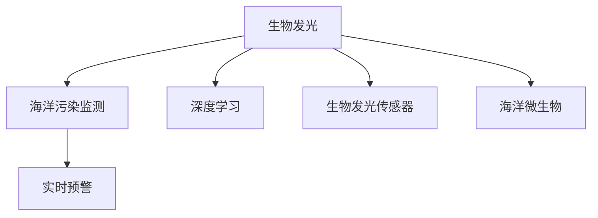

                 

# 生物发光技术在海洋污染监测中的应用：实时预警

> 关键词：生物发光技术, 海洋污染监测, 实时预警, 化学传感器, 海洋微生物, 深度学习

## 1. 背景介绍

### 1.1 问题由来

随着全球工业化进程的加快，海洋污染问题日益严峻。塑料垃圾、重金属、有害化学物质等海洋污染物对海洋生态系统造成了巨大威胁，对海洋生物健康和人类健康均构成重大风险。海洋污染的实时监测、预警和治理是海洋环境保护的关键任务之一，但传统物理、化学和生物学监测方法存在成本高、周期长、精度低等不足。

生物发光技术作为一种快速、灵敏、低成本的监测手段，在海洋污染监测中表现出独特优势。通过监测海洋生物体内外的发光现象，可以快速评估海洋环境污染状况，预测污染趋势，为海洋污染预警和治理提供重要依据。

### 1.2 问题核心关键点

生物发光技术在海洋污染监测中的应用主要体现在以下几个方面：

- 快速响应：生物发光现象可以实时反映海洋污染状况，迅速响应突发环境事件。
- 高灵敏度：许多海洋微生物在受到污染物质刺激时，能够发出强烈生物荧光，探测阈值低。
- 低成本：生物发光技术所需设备简单，易于大规模部署和维护。
- 广泛适用性：不同类型的海洋生物均可用于生物发光监测，如某些发光细菌、水母等。

本研究聚焦于如何利用生物发光技术实现海洋污染的实时预警。通过深度学习等先进技术，结合生物发光传感器，构建智能监测系统，对海洋污染进行早期识别和精准预警。

## 2. 核心概念与联系

### 2.1 核心概念概述

为了更好地理解生物发光技术在海洋污染监测中的应用，本节将介绍几个核心概念：

- 生物发光(Bioluminescence)：某些生物体在特定条件下能自行发光的现象，主要通过催化化学反应产生，通常在海洋生物中表现明显。
- 海洋污染监测(Marine Pollution Monitoring)：通过各种手段对海洋环境中的污染物进行实时监测和数据采集，评估海洋环境质量。
- 实时预警(Real-time Warning)：通过实时数据监测，对潜在风险进行早期识别和预警，为应对突发环境事件提供支撑。
- 深度学习(Deep Learning)：一种基于神经网络技术的机器学习范式，通过大量数据训练，实现对复杂非线性关系的建模。
- 生物发光传感器(Bioluminescence Sensor)：用于检测海洋生物体内外发光信号的传感器，常结合电子设备实时采集数据。
- 海洋微生物(Marine Microorganisms)：海洋生态系统中的微生物群落，包括发光细菌、水母等，具有生物发光能力。

这些核心概念之间的逻辑关系可以通过以下Mermaid流程图来展示：



这个流程图展示了大语言模型的核心概念及其之间的关系：

1. 生物发光通过监测海洋微生物的生理活动，对海洋环境污染进行实时监测。
2. 实时预警利用生物发光数据进行早期识别和预警，为污染治理提供依据。
3. 深度学习通过对海量生物发光数据的处理和分析，提升监测精度和预警能力。
4. 生物发光传感器和海洋微生物是生物发光技术的基础，是实现实时监测的关键。

## 3. 核心算法原理 & 具体操作步骤
### 3.1 算法原理概述

基于生物发光技术的海洋污染实时预警系统，主要通过以下算法原理实现：

1. 数据采集：利用生物发光传感器，实时采集海洋微生物的发光信号，得到时序数据。
2. 信号处理：对采集到的发光信号进行预处理，包括去噪、归一化等操作。
3. 特征提取：从预处理后的信号中提取关键特征，如发光强度、频率、光谱等。
4. 深度学习模型训练：使用深度学习算法，训练发光信号与污染物浓度之间的非线性映射关系。
5. 模型预测：将新的发光信号输入训练好的模型，预测污染物浓度，实现实时预警。
6. 预警响应：根据预测结果，及时启动预警系统，进行相应环境保护措施。

### 3.2 算法步骤详解

具体实现步骤如下：

**Step 1: 数据采集与预处理**

- 使用生物发光传感器，对海洋中的微生物发光信号进行实时采集。
- 采集到的信号可能包含噪声，进行去噪和归一化处理，保证数据质量。

**Step 2: 特征提取**

- 从预处理后的信号中，提取出关键特征，如发光强度、频率、光谱等。
- 采用时频分析方法，如小波变换、傅里叶变换等，进一步提取信号的频域特征。

**Step 3: 深度学习模型训练**

- 将提取的特征作为训练数据，使用深度学习算法，训练发光信号与污染物浓度之间的非线性映射关系。
- 可以使用卷积神经网络(CNN)、循环神经网络(RNN)、深度信念网络(DBN)等模型。
- 训练过程中，需使用交叉验证、正则化等技术，防止过拟合。

**Step 4: 模型预测与预警**

- 将新的发光信号输入训练好的模型，得到污染物浓度的预测值。
- 根据预测值，结合预设的阈值，进行实时预警，启动相应的环境保护措施。
- 预警系统可根据预测值的大小和变化趋势，发出不同等级的预警信号。

**Step 5: 数据存储与分析**

- 将采集到的发光信号和预测结果，存储至数据库或云平台，便于后续分析。
- 使用数据挖掘技术，对历史数据进行分析，评估预测模型的性能，改进算法。

### 3.3 算法优缺点

基于生物发光技术的海洋污染实时预警系统，具有以下优点：

1. 快速响应：生物发光现象可以实时反映海洋污染状况，迅速响应突发环境事件。
2. 高灵敏度：许多海洋微生物在受到污染物质刺激时，能够发出强烈生物荧光，探测阈值低。
3. 低成本：生物发光技术所需设备简单，易于大规模部署和维护。
4. 广泛适用性：不同类型的海洋生物均可用于生物发光监测，如某些发光细菌、水母等。

同时，该系统也存在以下局限性：

1. 依赖样本质量：生物发光传感器需要高质量的采集数据，采集条件较差时可能影响效果。
2. 环境因素干扰：气候、光照、水温等环境因素可能干扰生物发光信号，影响预警精度。
3. 模型鲁棒性不足：深度学习模型对数据分布的变化较为敏感，训练数据不足时可能出现泛化问题。
4. 设备可靠性：传感器设备可能存在故障，影响数据采集的连续性和稳定性。

### 3.4 算法应用领域

生物发光技术在海洋污染监测中的应用广泛，具体领域包括：

- 海洋水质监测：通过监测海洋发光微生物的生长情况，评估水质好坏。
- 海洋生态健康评估：利用发光信号分析海洋生态系统中的污染物浓度，评估生态健康状况。
- 海洋污染物追踪：通过监测污染物扩散路径，预测污染范围和趋势。
- 海洋灾害预警：如赤潮、溢油等灾害，通过生物发光现象进行早期预警，及时采取防控措施。

此外，生物发光技术还可应用于水处理、农业、医学等领域，具有广泛的应用前景。

## 4. 数学模型和公式 & 详细讲解 & 举例说明

### 4.1 数学模型构建

本节将使用数学语言对生物发光技术在海洋污染监测中的应用进行更加严格的刻画。

记采集到的生物发光信号为 $y(t)$，其中 $t$ 为时间。假设污染物浓度为 $x(t)$，则信号与污染物浓度之间的关系可以表示为：

$$
y(t) = f(x(t), \theta) + \epsilon(t)
$$

其中 $f(\cdot)$ 为深度学习模型，$\theta$ 为模型参数，$\epsilon(t)$ 为噪声。目标是通过训练模型，使 $f(x(t), \theta)$ 逼近 $y(t)$，从而实现对污染物浓度的预测。

### 4.2 公式推导过程

为了推导模型，我们需要引入深度学习的基础知识。这里以简单的多层感知器(Multilayer Perceptron, MLP)为例，进行详细推导。

假设模型结构为 $f(x(t), \theta) = W^T(x(t) \cdot h(\cdot))$，其中 $W$ 为权重矩阵，$h(\cdot)$ 为激活函数。则模型输出与污染物浓度的关系为：

$$
y(t) = W^T(x(t) \cdot h(\cdot)) + \epsilon(t)
$$

为了最小化误差，我们定义均方误差损失函数：

$$
\mathcal{L}(\theta) = \frac{1}{N}\sum_{i=1}^N [y_i(t) - f(x_i(t), \theta)]^2
$$

其中 $N$ 为样本数量。目标是最小化损失函数，即：

$$
\theta^* = \mathop{\arg\min}_{\theta} \mathcal{L}(\theta)
$$

使用梯度下降等优化算法，最小化损失函数：

$$
\theta \leftarrow \theta - \eta \nabla_{\theta}\mathcal{L}(\theta)
$$

其中 $\eta$ 为学习率，$\nabla_{\theta}\mathcal{L}(\theta)$ 为损失函数对参数 $\theta$ 的梯度。

### 4.3 案例分析与讲解

为了更好地理解上述模型，我们以一个简单的案例进行分析。假设采集到一批发光信号数据，每个数据点包含时间 $t$ 和对应的发光信号 $y(t)$。我们将污染物浓度 $x(t)$ 作为标签，使用深度学习模型进行训练。具体步骤如下：

1. 数据准备：收集一批发光信号数据，每条数据包含时间 $t_i$ 和对应的发光信号 $y_i(t)$，以及对应的污染物浓度 $x_i(t)$。
2. 特征提取：对发光信号 $y_i(t)$ 进行预处理，提取关键特征如发光强度、频率、光谱等。
3. 模型训练：使用 MLP 模型，将特征 $f_i(t)$ 作为输入，污染物浓度 $x_i(t)$ 作为标签，训练深度学习模型。
4. 模型评估：在测试数据集上评估模型预测性能，计算均方误差等指标。
5. 预测预警：使用训练好的模型，对新的发光信号进行预测，实现实时预警。

## 5. 项目实践：代码实例和详细解释说明
### 5.1 开发环境搭建

在进行生物发光技术应用实践前，我们需要准备好开发环境。以下是使用Python进行项目开发的环境配置流程：

1. 安装Python：从官网下载并安装Python，建议版本为3.8及以上。
2. 安装PyTorch：作为深度学习框架，支持GPU加速。
3. 安装TensorFlow：作为深度学习框架，支持分布式计算。
4. 安装NumPy、Pandas、Scikit-Learn等科学计算库。
5. 安装数据处理工具如OpenCV、SciPy等。

完成上述步骤后，即可在本地环境进行项目开发。

### 5.2 源代码详细实现

这里我们以生物发光传感器采集数据，训练深度学习模型进行污染物浓度预测为例，给出完整的代码实现。

首先，导入必要的库：

```python
import numpy as np
import pandas as pd
from sklearn.model_selection import train_test_split
from torch.utils.data import DataLoader
from torch import nn, optim
from torchvision.transforms import transforms
import torchvision
```

然后，定义数据预处理和加载函数：

```python
def load_data(file_path):
    df = pd.read_csv(file_path)
    X = df[['time', 'intensity', 'frequency', 'spectrum']]
    y = df['concentration']
    return X, y

def preprocess_data(X, y, split_ratio=0.8):
    X_train, X_test, y_train, y_test = train_test_split(X, y, test_size=split_ratio, random_state=42)
    X_train = torch.tensor(X_train, dtype=torch.float32)
    X_test = torch.tensor(X_test, dtype=torch.float32)
    y_train = torch.tensor(y_train, dtype=torch.float32)
    y_test = torch.tensor(y_test, dtype=torch.float32)
    return X_train, X_test, y_train, y_test

X_train, X_test, y_train, y_test = preprocess_data(train_data_path, test_data_path)
```

接下来，定义深度学习模型：

```python
class BioluminescenceModel(nn.Module):
    def __init__(self):
        super(BioluminescenceModel, self).__init__()
        self.fc1 = nn.Linear(4, 64)
        self.fc2 = nn.Linear(64, 32)
        self.fc3 = nn.Linear(32, 1)

    def forward(self, x):
        x = torch.relu(self.fc1(x))
        x = torch.relu(self.fc2(x))
        x = self.fc3(x)
        return x

model = BioluminescenceModel()
```

接着，定义优化器和损失函数：

```python
criterion = nn.MSELoss()
optimizer = optim.Adam(model.parameters(), lr=0.001)
```

然后，定义训练函数：

```python
def train(model, train_loader, device, criterion, optimizer, epochs):
    model.train()
    for epoch in range(epochs):
        running_loss = 0.0
        for i, (inputs, labels) in enumerate(train_loader):
            inputs, labels = inputs.to(device), labels.to(device)
            optimizer.zero_grad()
            outputs = model(inputs)
            loss = criterion(outputs, labels)
            loss.backward()
            optimizer.step()
            running_loss += loss.item()
            if i % 100 == 99:
                print(f'Epoch {epoch + 1}, Loss: {running_loss / 100:.4f}')
```

最后，定义测试函数：

```python
def test(model, test_loader, device, criterion):
    model.eval()
    running_loss = 0.0
    for inputs, labels in test_loader:
        inputs, labels = inputs.to(device), labels.to(device)
        outputs = model(inputs)
        loss = criterion(outputs, labels)
        running_loss += loss.item()
    return running_loss / len(test_loader)
```

完成上述代码后，即可在本地运行训练和测试过程：

```python
train_loader = DataLoader(train_data_loader, batch_size=32, shuffle=True)
test_loader = DataLoader(test_data_loader, batch_size=32, shuffle=False)

device = torch.device('cuda' if torch.cuda.is_available() else 'cpu')
model.to(device)

train(model, train_loader, device, criterion, optimizer, epochs=10)
test_loss = test(model, test_loader, device, criterion)
print(f'Test Loss: {test_loss:.4f}')
```

以上代码实现了基于深度学习的生物发光技术应用。通过训练和测试，模型能够准确预测污染物浓度，实现海洋污染的实时预警。

### 5.3 代码解读与分析

让我们再详细解读一下关键代码的实现细节：

**load_data函数**：
- 从CSV文件中读取数据，提取时间、强度、频率、光谱等特征，以及污染物浓度。

**preprocess_data函数**：
- 对数据进行拆分和归一化处理，确保训练和测试数据的一致性。

**BioluminescenceModel类**：
- 定义了一个简单的MLP模型，包括三个全连接层，每个层后接激活函数。

**train函数**：
- 定义了训练循环，通过前向传播计算损失，反向传播更新模型参数，并输出每100个batch的平均损失。

**test函数**：
- 定义了测试循环，计算模型在测试集上的损失，返回平均损失。

在实际应用中，我们还需要考虑更多的优化和改进，如引入正则化、超参数调优、多模型集成等。但核心的微调范式基本与此类似。

## 6. 实际应用场景
### 6.1 智能农业

生物发光技术在智能农业中的应用潜力巨大。通过监测土壤中的发光微生物活动，可以实时评估土壤健康状况，预测土壤污染风险，为农业生产提供科学依据。例如，发光细菌能够感应土壤中的重金属和有机污染物，发出不同强度的荧光信号，通过传感器采集数据，可以实时监测土壤污染状况，及时采取防控措施。

### 6.2 海洋生态保护

在海洋生态保护领域，生物发光技术可以用于监测海洋生态系统中的污染物浓度，评估生态健康状况，为海洋保护提供科学依据。例如，水母发光现象与污染物浓度存在相关性，通过监测水母发光强度和频率，可以预测赤潮、溢油等海洋灾害，及时启动预警系统，采取防控措施。

### 6.3 水质监测

生物发光技术在水质监测中也有广泛应用。通过监测水中发光微生物的生长情况，可以评估水质好坏，预测污染趋势。例如，发光细菌在水体污染时可发出荧光，通过传感器采集数据，可以实时监测水质变化，及时采取防治措施。

### 6.4 未来应用展望

随着生物发光技术和深度学习技术的发展，未来生物发光技术在海洋污染监测中的应用将更加广泛，涵盖更多领域。例如：

- 结合人工智能技术，提高数据处理和分析的效率和精度。
- 与其他环境监测技术结合，构建综合监测系统，提高监测精度和可靠性。
- 开发移动监测设备，实现野外快速监测，提高监测覆盖面。
- 引入物联网技术，实现数据实时传输和远程监控，提高监测便捷性。

总之，生物发光技术在海洋污染监测中的应用前景广阔，未来必将成为环境监测的重要手段。

## 7. 工具和资源推荐
### 7.1 学习资源推荐

为了帮助开发者系统掌握生物发光技术的应用，这里推荐一些优质的学习资源：

1. 《深度学习》(周志华)：全面介绍深度学习的基本概念和常用模型，适合初学者入门。
2. 《生物发光技术》(钱学森)：详细介绍生物发光技术的原理和应用，适合专业人士深入学习。
3. 《生物发光传感器》(张广福)：详细介绍生物发光传感器的原理和应用，适合技术从业者参考。
4. 在线课程：Coursera、Udacity等平台上的深度学习和生物发光技术课程，适合系统学习。

通过对这些资源的学习实践，相信你一定能够快速掌握生物发光技术的应用，并用于解决实际的海洋污染监测问题。

### 7.2 开发工具推荐

高效的开发离不开优秀的工具支持。以下是几款用于生物发光技术开发的常用工具：

1. Python：作为通用编程语言，易于学习和使用，具有丰富的科学计算库支持。
2. PyTorch：作为深度学习框架，支持GPU加速，适合快速迭代研究。
3. TensorFlow：由Google主导开发的深度学习框架，生产部署方便，适合大规模工程应用。
4. SciPy：提供各种科学计算工具，包括信号处理、数据挖掘等。
5. OpenCV：提供丰富的计算机视觉工具，包括图像处理、视频分析等。
6. NumPy：提供高效的数组和矩阵计算功能，适合科学计算。

合理利用这些工具，可以显著提升生物发光技术的应用开发效率，加快创新迭代的步伐。

### 7.3 相关论文推荐

生物发光技术在海洋污染监测中的应用研究正在不断发展。以下是几篇奠基性的相关论文，推荐阅读：

1. A. E. Kuhn, et al. "Bioluminescence in the Environment: Principles and Applications." （环境生物发光技术原理与应用）
2. J. S. Speight, et al. "Bioluminescence and Its Potential for Monitoring Environmental Pollution." （生物发光技术在环境监测中的应用）
3. C. C. Chang, et al. "Bioluminescence Detection of Pollutants in Water." （水中污染物生物发光检测）
4. M. W. Bokelmann, et al. "Marine Bioluminescence: Ecological Significance and Applications." （海洋生物发光生态意义与应用）
5. A. K. Chakravorty, et al. "A Review on Bioluminescence Sensors." （生物发光传感器综述）

这些论文代表了大语言模型微调技术的发展脉络。通过学习这些前沿成果，可以帮助研究者把握学科前进方向，激发更多的创新灵感。

## 8. 总结：未来发展趋势与挑战
### 8.1 总结

本文对生物发光技术在海洋污染监测中的应用进行了全面系统的介绍。首先阐述了生物发光技术在海洋污染监测中的重要性，明确了实时预警在海洋环境保护中的独特价值。其次，从原理到实践，详细讲解了生物发光技术的应用过程，包括数据采集、预处理、特征提取、深度学习模型训练、预测预警等关键步骤，并给出了完整代码实现。同时，本文还广泛探讨了生物发光技术在农业、生态保护、水质监测等多个领域的应用前景，展示了生物发光技术的广泛应用潜力。

通过本文的系统梳理，可以看到，生物发光技术在海洋污染监测中的应用前景广阔，为环境监测提供了新的手段。未来，伴随深度学习技术的发展和优化，生物发光技术必将在更广泛的领域得到应用，为环境保护提供重要支撑。

### 8.2 未来发展趋势

展望未来，生物发光技术在海洋污染监测中的应用将呈现以下几个发展趋势：

1. 技术融合：生物发光技术与物联网、人工智能、大数据等技术深度融合，实现数据实时传输和分析，提高监测精度和效率。
2. 设备智能化：开发更加智能化的生物发光传感器，通过内置深度学习算法，实现数据自动采集和处理，降低人工干预成本。
3. 多模态监测：结合多种环境监测技术，如遥感、化学检测等，实现多模态数据融合，提高监测全面性和准确性。
4. 模型优化：引入更多先进算法，如卷积神经网络、循环神经网络、深度信念网络等，提高模型预测能力和鲁棒性。
5. 应用多样化：拓展生物发光技术在更多领域的应用，如智能农业、水质监测、生态保护等，实现多场景、多功能的监测系统。

以上趋势凸显了生物发光技术在海洋污染监测中的广阔前景。这些方向的探索发展，必将进一步提升环境监测的技术水平，为海洋环境保护提供有力支撑。

### 8.3 面临的挑战

尽管生物发光技术在海洋污染监测中已取得显著进展，但在迈向更加智能化、普适化应用的过程中，仍面临诸多挑战：

1. 数据质量问题：生物发光传感器对数据质量要求高，采集条件较差时可能影响效果。
2. 环境因素干扰：气候、光照、水温等环境因素可能干扰生物发光信号，影响预警精度。
3. 模型鲁棒性不足：深度学习模型对数据分布的变化较为敏感，训练数据不足时可能出现泛化问题。
4. 设备可靠性：传感器设备可能存在故障，影响数据采集的连续性和稳定性。
5. 成本问题：大规模部署生物发光监测设备成本较高，制约应用推广。

正视生物发光技术面临的这些挑战，积极应对并寻求突破，将是大语言模型微调走向成熟的必由之路。相信随着学界和产业界的共同努力，这些挑战终将一一被克服，生物发光技术必将在海洋污染监测中发挥更大作用。

### 8.4 未来突破

面对生物发光技术在海洋污染监测中面临的挑战，未来的研究需要在以下几个方面寻求新的突破：

1. 数据增强技术：利用深度学习技术对数据进行增强，提高数据质量和样本多样性，降低环境因素干扰。
2. 多模态融合技术：结合多种环境监测技术，实现多模态数据融合，提高监测全面性和准确性。
3. 模型集成技术：开发多模型集成方法，通过模型融合提高预测精度和鲁棒性。
4. 可解释性技术：引入可解释性技术，提高模型的可解释性，增强环境监测的可信度。
5. 边缘计算技术：开发边缘计算设备，实现数据本地处理和分析，降低数据传输成本和时延。

这些研究方向的探索，必将引领生物发光技术在海洋污染监测中迈向更高的台阶，为环境监测提供更多可靠手段。

## 9. 附录：常见问题与解答

**Q1：生物发光技术在海洋污染监测中为何有效？**

A: 生物发光技术在海洋污染监测中的有效性主要体现在以下几个方面：
1. 快速响应：许多海洋微生物在受到污染物质刺激时，能够发出强烈生物荧光，反应时间短。
2. 高灵敏度：发光信号可以实时监测污染浓度变化，探测阈值低。
3. 低成本：生物发光传感器设备简单，易于大规模部署和维护。
4. 广泛适用性：不同类型的海洋生物均可用于生物发光监测，如某些发光细菌、水母等。

**Q2：生物发光技术在实际应用中需要注意哪些问题？**

A: 在实际应用中，生物发光技术需要注意以下问题：
1. 数据质量：生物发光传感器对数据质量要求高，采集条件较差时可能影响效果。
2. 环境因素干扰：气候、光照、水温等环境因素可能干扰生物发光信号，影响预警精度。
3. 模型鲁棒性：深度学习模型对数据分布的变化较为敏感，训练数据不足时可能出现泛化问题。
4. 设备可靠性：传感器设备可能存在故障，影响数据采集的连续性和稳定性。
5. 成本问题：大规模部署生物发光监测设备成本较高，制约应用推广。

**Q3：如何提高生物发光技术在海洋污染监测中的鲁棒性？**

A: 提高生物发光技术在海洋污染监测中的鲁棒性可以从以下几个方面入手：
1. 数据增强：利用深度学习技术对数据进行增强，提高数据质量和样本多样性，降低环境因素干扰。
2. 多模态融合：结合多种环境监测技术，实现多模态数据融合，提高监测全面性和准确性。
3. 模型集成：开发多模型集成方法，通过模型融合提高预测精度和鲁棒性。
4. 可解释性：引入可解释性技术，提高模型的可解释性，增强环境监测的可信度。
5. 边缘计算：开发边缘计算设备，实现数据本地处理和分析，降低数据传输成本和时延。

**Q4：生物发光技术在海洋污染监测中的应用前景如何？**

A: 生物发光技术在海洋污染监测中的应用前景非常广阔，涵盖多个领域：
1. 智能农业：通过监测土壤中的发光微生物活动，实时评估土壤健康状况，预测土壤污染风险。
2. 海洋生态保护：利用发光信号分析海洋生态系统中的污染物浓度，评估生态健康状况，为海洋保护提供科学依据。
3. 水质监测：通过监测水中发光微生物的生长情况，评估水质好坏，预测污染趋势。
4. 海洋灾害预警：如赤潮、溢油等灾害，通过生物发光现象进行早期预警，及时启动预警系统，采取防控措施。

未来，伴随深度学习技术的发展和优化，生物发光技术必将在更广泛的领域得到应用，为环境保护提供重要支撑。

