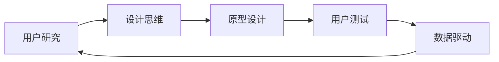

                 

## 1. 背景介绍

### 1.1 问题由来

在数字时代，用户体验（User Experience, UX）是决定企业成败的关键因素之一。随着互联网和移动设备的普及，越来越多的企业意识到良好的用户体验可以带来巨大的商业价值。但是，如何打造一个能够吸引用户、满足用户需求、提升用户满意度的极致产品，却是一个复杂且需要深度思考的问题。本文将探讨用户体验设计创业的关键要素，以及如何通过科学的方法和工具，打造出用户满意、市场认可的产品。

### 1.2 问题核心关键点

用户体验设计的核心在于：如何通过系统性的方法，研究用户需求，并将其转化为具体的产品设计。核心关键点包括：

- **用户研究**：了解目标用户的真实需求和行为习惯。
- **设计思维**：运用设计思维的方法论，进行创造性解决问题。
- **原型设计**：通过快速原型设计，迭代验证设计方案。
- **用户测试**：通过用户测试，收集反馈并不断优化设计。
- **数据驱动**：利用数据分析指导设计决策，确保设计的科学性。

## 2. 核心概念与联系

### 2.1 核心概念概述

为了更好地理解用户体验设计创业，本节将介绍几个核心概念：

- **用户体验（User Experience, UX）**：指用户与产品互动过程中的整体感受和体验，包括易用性、满意度、情感共鸣等方面。

- **设计思维（Design Thinking）**：一种以用户为中心的创造性解决问题的思维方式，通过同理心、共创、迭代等方法，不断探索用户需求和解决方案。

- **原型设计（Prototyping）**：通过快速制作产品原型，验证设计方案的有效性，并不断迭代优化。

- **用户测试（User Testing）**：通过用户使用产品的方式和反馈，评估产品设计的实际效果，指导后续设计改进。

- **数据驱动（Data-Driven）**：基于数据和分析，指导设计决策，确保设计的科学性和有效性。

这些概念之间的联系可以通过以下Mermaid流程图来展示：



这个流程图展示用户体验设计的关键环节及其相互关系：

1. 用户研究为设计思维提供基础数据。
2. 设计思维指导原型设计，产出初步产品方案。
3. 用户测试收集反馈，进一步优化设计。
4. 数据驱动提供科学依据，指导设计决策。
5. 设计迭代和优化后，再次回到用户研究环节，形成一个循环。

## 3. 核心算法原理 & 具体操作步骤
### 3.1 算法原理概述

用户体验设计的核心在于通过系统性的方法，理解和满足用户的真实需求。其核心算法原理可以概括为：

1. **用户研究**：收集和分析用户数据，识别用户需求和痛点。
2. **设计思维**：运用同理心、共创、迭代等方法，提出创新解决方案。
3. **原型设计**：快速构建产品原型，验证设计方案的可行性。
4. **用户测试**：通过用户实际使用，收集反馈并改进设计。
5. **数据驱动**：基于用户数据和反馈，指导设计决策。

### 3.2 算法步骤详解

用户体验设计的具体步骤包括：

1. **用户研究**：
   - 定义目标用户群体，进行用户访谈、问卷调查、行为分析等，收集用户需求和行为数据。
   - 分析用户数据，识别用户痛点和需求，形成用户画像。

2. **设计思维**：
   - 运用共创工作坊、同理心映射、角色扮演等方法，与用户深度沟通，理解用户需求。
   - 基于用户反馈和研究数据，进行创意思维，提出多个设计方案。

3. **原型设计**：
   - 使用工具如Sketch、Figma、Adobe XD等，快速制作低保真和高保真原型。
   - 原型应包括主要功能模块和交互流程，便于后续测试和迭代。

4. **用户测试**：
   - 招募目标用户群体，进行用户体验测试，观察用户使用产品的方式和反馈。
   - 分析用户反馈，识别产品设计中的问题和改进点。

5. **数据驱动**：
   - 收集用户行为数据，如点击率、停留时间、转化率等。
   - 分析数据，提取关键指标，指导设计优化和迭代。

### 3.3 算法优缺点

用户体验设计的核心算法具有以下优点：

- **用户中心**：以用户需求和反馈为中心，确保产品设计符合用户期望。
- **迭代优化**：通过不断迭代设计，不断改进产品，提升用户体验。
- **科学依据**：基于数据和分析，确保设计决策的科学性和有效性。

但同时也存在一些缺点：

- **时间成本高**：设计和测试的迭代过程可能需要较长时间。
- **资源消耗大**：原型设计和用户测试需要大量人力和资源投入。
- **风险难以控制**：设计过程中可能存在不确定性，需要不断调整和优化。

### 3.4 算法应用领域

用户体验设计的方法论在各个领域都有广泛应用，包括：

- **电商**：优化购物流程、提升用户体验。
- **金融**：提升金融产品的易用性和安全性。
- **医疗**：提高患者诊疗体验，优化医疗服务流程。
- **教育**：优化教学工具和内容，提升学习效果。
- **旅游**：优化旅游产品和服务，提升用户满意度。

这些领域的企业通过用户体验设计，能够显著提升用户满意度和市场竞争力。

## 4. 数学模型和公式 & 详细讲解 & 举例说明

### 4.1 数学模型构建

用户体验设计的数学模型主要基于用户行为数据分析和用户满意度评估。其核心模型包括：

- **用户满意度模型**：衡量用户对产品的整体满意度，包括可用性、易用性、愉悦性等方面。
- **用户行为模型**：分析用户在产品中的行为路径和频率，识别用户关键节点。
- **用户情感模型**：通过情感分析，识别用户对产品的情感倾向和变化趋势。

### 4.2 公式推导过程

以用户满意度模型为例，其核心公式为：

$$
S = \alpha \times U + \beta \times E + \gamma \times P
$$

其中，$S$为用户的总体满意度，$U$为可用性评分，$E$为易用性评分，$P$为愉悦性评分，$\alpha$、$\beta$、$\gamma$为模型权重，反映了不同因素对满意度的影响程度。

### 4.3 案例分析与讲解

假设我们正在设计一款电商平台的用户体验，通过用户访谈和问卷调查收集数据。用户的满意度可以通过以下步骤计算：

1. **数据收集**：通过问卷收集用户对可用性、易用性和愉悦性的评分。
2. **数据处理**：对评分进行标准化处理，转化为0-1之间的数值。
3. **模型计算**：将标准化后的评分代入公式，计算总体满意度。
4. **分析优化**：根据计算结果，识别满意度高的功能和低分项，进行有针对性的优化。

## 5. 项目实践：代码实例和详细解释说明
### 5.1 开发环境搭建

在进行用户体验设计开发前，需要准备好开发环境。以下是使用Python进行Sketchup开发的常见环境配置流程：

1. **安装Python**：从官网下载并安装Python，用于后续开发。

2. **安装Sketchup**：从Sketchup官网下载并安装Sketchup，用于设计和制作原型。

3. **安装Sketchup Plugins**：安装必要的插件，如Figma integration插件，以便与Figma进行数据同步。

4. **安装Figma**：从Figma官网下载并安装Figma，用于团队协作和用户测试。

5. **安装数据分析工具**：安装Google Analytics、Hotjar等工具，收集和分析用户数据。

### 5.2 源代码详细实现

以下是使用Python和Sketchup进行用户体验设计原型制作的示例代码：

```python
from sketchup import SketchUp
from data_analysis import GoogleAnalytics

# 创建SketchUp实例
sketchup = SketchUp()

# 创建用户行为数据模型
user_behavior = GoogleAnalytics()

# 定义原型设计模块
def design_prototype():
    # 创建草图原型
    sketchup.create_sketch('原型设计.png', '用户界面')
    
    # 添加关键功能模块
    sketchup.add_function('购物车', '购物')
    sketchup.add_function('结算', '结账')
    
    # 设定交互流程
    sketchup.set_interaction('点击购物车', '显示购物车')
    sketchup.set_interaction('结账', '进入结账页面')
    
    # 保存并导出草图
    sketchup.save_sketch()
    sketchup.export_sketch('设计原型.sketch')

# 定义用户测试模块
def user_test():
    # 招募目标用户
    users = user_behavior招募用户('电商用户')
    
    # 进行用户体验测试
    test_result = user_behavior.user_test(users, '设计原型.sketch')
    
    # 分析测试结果
    sketchup.analyze_test_result(test_result)
    
    # 优化设计方案
    design_prototype()

# 启动设计流程
user_test()
```

### 5.3 代码解读与分析

以下是关键代码的解读：

**SketchUp模块**：
- 通过SketchUp的Python API创建草图，添加功能模块，设定交互流程。
- 使用SketchUp的保存和导出功能，生成设计原型。

**GoogleAnalytics模块**：
- 通过Google Analytics API收集用户行为数据。
- 定义用户招募和测试流程，分析测试结果。

**用户测试模块**：
- 定义用户招募和测试流程，使用Google Analytics的数据分析功能。
- 分析测试结果，根据测试结果优化设计方案，并重新启动设计流程。

### 5.4 运行结果展示

运行上述代码后，可以生成一个草图原型，并进行用户测试。测试结果将反馈到设计模块，指导后续设计改进。通过不断的迭代优化，可以确保设计方案能够满足用户需求，提升产品用户体验。

## 6. 实际应用场景
### 6.1 电商平台的优化

在电商平台优化用户体验中，用户体验设计能够显著提升用户满意度。通过设计思维和用户测试，可以发现用户在使用流程中的痛点，进行优化改进。例如：

- **购物车功能**：通过用户访谈，发现用户在使用购物车时遇到的操作问题。优化购物车功能设计，使其更加直观易用。
- **结账流程**：通过用户测试，发现结账流程复杂，用户容易放弃。简化结账流程，减少步骤，提高转化率。

### 6.2 金融产品的设计

金融产品需要高度关注用户体验和安全性能。通过用户体验设计，可以提升金融产品的易用性和安全性。例如：

- **账户管理**：通过用户访谈，了解用户对账户管理的痛点。设计简洁友好的账户管理界面，提高用户操作效率。
- **交易安全**：通过用户测试，验证交易安全功能。优化支付流程，减少用户输入次数，降低风险。

### 6.3 医疗服务的改进

医疗服务需要高效、安全、人性化的设计。通过用户体验设计，可以优化医疗服务流程，提升患者满意度。例如：

- **预约挂号**：通过用户访谈，发现预约挂号流程繁琐。设计简洁的预约挂号界面，提高预约效率。
- **电子病历**：通过用户测试，优化电子病历系统，使其更加友好易用。

## 7. 工具和资源推荐
### 7.1 学习资源推荐

为了帮助开发者系统掌握用户体验设计的核心方法和工具，以下是一些优质的学习资源：

1. **《设计思维：打造创新未来》**：这本书详细介绍了设计思维的基本原理和应用方法，适合初学者入门。

2. **《用户体验设计实战指南》**：该书涵盖用户体验设计的各个环节，包括用户研究、设计思维、原型设计、用户测试等。

3. **Udemy《UX Design Masterclass》**：这门课程由Udemy提供，涵盖了用户体验设计从理论到实践的全过程。

4. **Coursera《UX Design》**：由斯坦福大学开设的在线课程，涵盖用户体验设计的核心概念和工具。

5. **Nielsen Norman Group**：这是一个知名的用户体验设计研究机构，提供大量实用研究和资源。

### 7.2 开发工具推荐

以下是几款用于用户体验设计开发的常用工具：

1. **Sketchup**：一款流行的原型设计工具，支持草图制作、功能模块添加、交互流程设定等功能。

2. **Figma**：一款团队协作工具，支持在线设计、数据同步、用户测试等功能。

3. **Google Analytics**：一款强大的数据分析工具，可以收集和分析用户行为数据，指导设计优化。

4. **Hotjar**：一款用户行为分析工具，通过热图、录屏等方式，帮助设计师理解用户行为和需求。

5. **UsabilityHub**：一款用户测试平台，支持远程用户测试，收集用户反馈。

### 7.3 相关论文推荐

用户体验设计领域的研究成果众多，以下是几篇具有代表性的论文：

1. **《设计思维：从方法到实践》**：该论文详细介绍了设计思维的基本方法论，适合研究者和从业者参考。

2. **《用户体验设计的原则与实践》**：该论文系统总结了用户体验设计的核心原则和实践方法。

3. **《用户体验设计模式》**：该论文总结了用户体验设计的常见模式，为实际应用提供参考。

4. **《用户研究：方法和技术》**：该论文详细介绍了用户研究的方法和工具，帮助设计师理解用户需求。

## 8. 总结：未来发展趋势与挑战
### 8.1 总结

本文对用户体验设计创业的关键要素进行了全面系统的介绍。首先阐述了用户体验设计的背景和意义，明确了用户体验设计在提升产品性能、用户满意度方面的独特价值。其次，从原理到实践，详细讲解了用户体验设计的数学模型和操作步骤，给出了用户体验设计任务开发的完整代码实例。同时，本文还广泛探讨了用户体验设计在电商、金融、医疗等多个行业领域的应用前景，展示了用户体验设计范式的巨大潜力。此外，本文精选了用户体验设计的各类学习资源，力求为读者提供全方位的技术指引。

通过本文的系统梳理，可以看到，用户体验设计在数字时代的重要性，以及如何通过系统性的方法和工具，打造出用户满意、市场认可的产品。用户体验设计的核心在于用户研究、设计思维、原型设计、用户测试和数据驱动，这些环节相互依赖，共同构成了用户体验设计的全流程。通过不断迭代优化，设计师可以逐步提升产品用户体验，满足用户需求，提升市场竞争力。

### 8.2 未来发展趋势

展望未来，用户体验设计的趋势包括：

1. **多渠道融合**：随着互联网和移动设备的普及，用户体验设计将跨越多个渠道，包括网站、应用、社交媒体等。

2. **个性化设计**：通过数据分析和人工智能技术，实现个性化用户体验，提高用户满意度和留存率。

3. **用户中心设计**：以用户为中心的设计理念将更加深入人心，设计师将更加注重用户需求和反馈。

4. **全生命周期设计**：用户体验设计将贯穿产品从研发到上线的全生命周期，确保每个环节都符合用户需求。

5. **创新设计工具**：更多智能设计工具将涌现，如自动原型生成、智能用户测试等，提高设计效率和效果。

### 8.3 面临的挑战

尽管用户体验设计已经取得了一定的成就，但在迈向更加智能化、普适化应用的过程中，它仍面临着诸多挑战：

1. **跨渠道设计**：不同渠道的用户需求和行为习惯存在差异，设计需要兼顾多渠道的用户体验。

2. **数据隐私**：用户数据隐私保护成为越来越重要的问题，如何在保护隐私的同时，收集有效数据，是一大难题。

3. **用户体验标准**：用户体验设计的标准和规范尚未完全统一，各企业和设计师存在差异。

4. **用户研究难度**：用户研究需要耗费大量时间和资源，如何高效地进行用户研究，是设计团队面临的挑战。

5. **设计效率**：用户体验设计的迭代过程需要时间和人力投入，如何提高设计效率，缩短迭代周期，是一大挑战。

### 8.4 研究展望

面向未来，用户体验设计需要在以下几个方面寻求新的突破：

1. **数据驱动设计**：利用大数据和人工智能技术，实现更科学、高效的用户体验设计。

2. **智能设计工具**：开发更多智能设计工具，如自动原型生成、智能用户测试等，提高设计效率和效果。

3. **跨学科融合**：用户体验设计需要与心理学、社会学、人机交互等学科进行深度融合，提升设计的科学性和系统性。

4. **持续改进机制**：建立持续改进机制，通过用户反馈和数据驱动，不断优化用户体验设计。

5. **伦理和道德**：在设计过程中，考虑伦理和道德问题，确保设计的公正性和安全性。

这些研究方向的探索，将引领用户体验设计迈向更高的台阶，为构建安全、可靠、可解释、可控的智能系统铺平道路。用户体验设计需要不断创新、优化，方能在数字时代中发挥更大作用，提升用户的整体体验，推动行业发展。

## 9. 附录：常见问题与解答

**Q1：用户体验设计是否适用于所有产品？**

A: 用户体验设计适用于大部分产品，特别是那些以用户为中心的产品。通过用户体验设计，可以提升产品的易用性、满意度、忠诚度等，从而提升产品的市场竞争力。

**Q2：用户体验设计是否需要复杂的技术支持？**

A: 用户体验设计并不需要复杂的技术支持，其核心在于对用户需求的深入理解和科学的设计方法。掌握基本的用户体验设计方法和工具，即可进行有效的设计实践。

**Q3：用户体验设计的投入产出比如何？**

A: 用户体验设计的投入产出比较高，通过优化用户体验，可以有效提升用户满意度和留存率，从而增加用户转化和收入。

**Q4：用户体验设计的流程如何？**

A: 用户体验设计的流程包括用户研究、设计思维、原型设计、用户测试、数据驱动等环节。这些环节相互依赖，共同构成设计循环。

**Q5：如何评估用户体验设计的成效？**

A: 用户体验设计的成效可以通过用户满意度、用户留存率、用户转化率等指标进行评估。通过收集用户反馈和数据分析，不断优化设计方案。

---

作者：禅与计算机程序设计艺术 / Zen and the Art of Computer Programming

