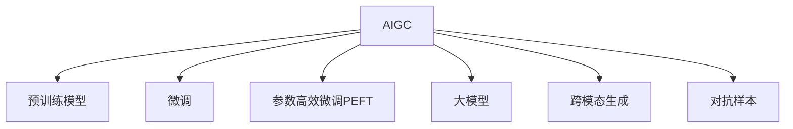

                 

## 1. 背景介绍

### 1.1 问题由来

随着人工智能（AI）技术的飞速发展，人工智能生成内容（AIGC）技术逐渐进入大众视野。从最早的文本生成、图像生成，到现在的视频生成、音频生成，AIGC正在逐步改变人类的生产生活方式。但与此同时，人们对AIGC的使用现状存在诸多疑问：AIGC在实际应用中到底表现如何？哪些行业和场景已经大规模应用？未来还有哪些潜在的落地场景？本文旨在回答这些问题，通过对现有文献和数据进行梳理，并结合实际案例，全面解读用户对AIGC的使用现状。

### 1.2 问题核心关键点

AIGC技术作为AI领域的核心技术之一，其应用涉及文本、图像、视频、音频等多个领域，具有以下关键点：

- **文本生成**：如自动生成新闻、小说、报告等。
- **图像生成**：如面部生成、艺术作品生成等。
- **视频生成**：如动态视频制作、虚拟人物动画等。
- **音频生成**：如音乐、播客、声音合成等。
- **多模态生成**：如同时生成文本、图像、音频等综合性内容。

这些关键点涉及不同领域的AI技术，其性能指标、应用场景和用户反馈各不相同，需要综合分析和解读。

### 1.3 问题研究意义

研究AIGC的使用现状，对于探索AI技术的实际应用，推动AI技术向纵深发展，具有重要意义：

1. **提升AI技术落地效率**：通过了解AIGC在不同行业的应用现状，有助于更好地指导AI技术的研发和应用，提升技术落地的效率和效果。
2. **优化用户体验**：了解用户对AIGC的实际使用体验和反馈，可以发现技术上的不足和改进方向，优化用户体验。
3. **开拓新应用场景**：分析AIGC在不同场景下的应用，可以为AI技术的推广和应用提供新的思路和方向。
4. **推动AI技术标准化**：研究AIGC的使用现状，有助于制定相关行业标准，规范AIGC技术的应用和推广。

## 2. 核心概念与联系

### 2.1 核心概念概述

为更好地理解AIGC的使用现状，本节将介绍几个密切相关的核心概念：

- **人工智能生成内容（AIGC）**：使用AI技术生成的文本、图像、视频、音频等内容的总称。
- **预训练模型**：使用大规模无标签数据进行训练，学习通用语言表示和视觉特征的模型。
- **微调（Fine-tuning）**：使用少量有标签数据对预训练模型进行调整，适应特定任务。
- **参数高效微调（PEFT）**：仅更新部分参数，保留大部分预训练权重。
- **大模型（Large Model）**：参数规模较大的模型，如BERT、GPT-3等。
- **跨模态生成（Multimodal Generation）**：生成文本、图像、音频等多种模态内容的技术。
- **对抗样本（Adversarial Example）**：能够欺骗模型的输入数据，用于评估模型鲁棒性。

这些核心概念之间的逻辑关系可以通过以下Mermaid流程图来展示：



这个流程图展示了大模型的AIGC生成过程：

1. 大模型通过预训练获得基础能力。
2. 微调和参数高效微调优化模型在特定任务上的表现。
3. 跨模态生成技术将不同模态的内容结合起来。
4. 对抗样本用于评估模型鲁棒性。

这些概念共同构成了AIGC的生成框架，使得AI技术在各个领域的应用成为可能。

## 3. 核心算法原理 & 具体操作步骤

### 3.1 算法原理概述

AIGC的生成过程基于深度学习模型，主要分为预训练、微调和生成三个阶段：

- **预训练阶段**：使用大规模无标签数据训练模型，学习通用语言和视觉表示。
- **微调阶段**：使用少量有标签数据对预训练模型进行调整，适应特定任务。
- **生成阶段**：使用微调后的模型，根据用户需求生成指定类型的AI内容。

其中，微调阶段是AIGC技术的重要组成部分，决定了生成内容的准确性和实用性。

### 3.2 算法步骤详解

AIGC的微调过程主要包括以下关键步骤：

**Step 1: 准备预训练模型和数据集**
- 选择合适的预训练模型（如BERT、GPT-3等）作为初始化参数。
- 准备目标任务的标注数据集，划分为训练集、验证集和测试集。

**Step 2: 添加任务适配层**
- 根据任务类型，设计合适的输出层和损失函数。
- 对于分类任务，通常使用交叉熵损失；对于生成任务，使用负对数似然损失。

**Step 3: 设置微调超参数**
- 选择合适的优化算法及其参数，如AdamW、SGD等，设置学习率、批大小、迭代轮数等。
- 设置正则化技术及强度，包括权重衰减、Dropout、Early Stopping等。
- 确定冻结预训练参数的策略，如仅微调顶层，或全部参数都参与微调。

**Step 4: 执行梯度训练**
- 将训练集数据分批次输入模型，前向传播计算损失函数。
- 反向传播计算参数梯度，根据设定的优化算法和学习率更新模型参数。
- 周期性在验证集上评估模型性能，根据性能指标决定是否触发 Early Stopping。
- 重复上述步骤直至满足预设的迭代轮数或 Early Stopping 条件。

**Step 5: 测试和部署**
- 在测试集上评估微调后模型的性能，对比微调前后的精度提升。
- 使用微调后的模型对新样本进行推理预测，集成到实际的应用系统中。

以上是AIGC微调的一般流程。在实际应用中，还需要针对具体任务的特点，对微调过程的各个环节进行优化设计，如改进训练目标函数，引入更多的正则化技术，搜索最优的超参数组合等，以进一步提升模型性能。

### 3.3 算法优缺点

AIGC微调具有以下优点：

- **高效性**：仅需准备少量标注数据，即可对预训练模型进行快速适配，生成高质量的内容。
- **通用性**：适用于各种生成任务，如文本、图像、音频等，设计简单的任务适配层即可实现微调。
- **参数高效性**：利用参数高效微调技术，在固定大部分预训练参数的情况下，仍可取得不错的生成效果。
- **效果显著**：在学术界和工业界的诸多任务上，基于微调的方法已经刷新了最先进的性能指标。

同时，该方法也存在一定的局限性：

- **依赖标注数据**：微调的效果很大程度上取决于标注数据的质量和数量，获取高质量标注数据的成本较高。
- **迁移能力有限**：当目标任务与预训练数据的分布差异较大时，微调的性能提升有限。
- **负面效果传递**：预训练模型的固有偏见、有害信息等，可能通过微调传递到下游任务，造成负面影响。
- **可解释性不足**：微调模型的决策过程通常缺乏可解释性，难以对其推理逻辑进行分析和调试。

尽管存在这些局限性，但就目前而言，AIGC微调方法仍然是大规模生成内容的重要手段。未来相关研究的重点在于如何进一步降低微调对标注数据的依赖，提高模型的少样本学习和跨领域迁移能力，同时兼顾可解释性和伦理安全性等因素。

### 3.4 算法应用领域

AIGC微调方法在NLP、图像、视频、音频等多个领域已得到广泛应用，例如：

- **文本生成**：如自动生成新闻、小说、报告等。通过微调使模型学习文本生成规律，生成符合语法和语义规则的文本。
- **图像生成**：如面部生成、艺术作品生成等。通过微调使模型学习图像生成规律，生成逼真的面部图像和艺术作品。
- **视频生成**：如动态视频制作、虚拟人物动画等。通过微调使模型学习视频生成规律，生成连贯、流畅的视频内容。
- **音频生成**：如音乐、播客、声音合成等。通过微调使模型学习音频生成规律，生成自然、逼真的音频内容。
- **多模态生成**：如同时生成文本、图像、音频等综合性内容。通过微调使模型学习不同模态的生成规律，生成完整的综合性内容。

除了上述这些经典应用外，AIGC微调还被创新性地应用到更多场景中，如可控生成、伪造内容、创意设计等，为AI技术的应用带来了新的突破。随着预训练模型和微调方法的不断进步，相信AIGC技术将在更广阔的应用领域大放异彩。

## 4. 数学模型和公式 & 详细讲解 & 举例说明

### 4.1 数学模型构建

AIGC微调过程可以使用如下数学模型进行描述：

- **输入**：输入 $x$，可以是文本、图像、视频等。
- **预训练模型**：使用预训练模型 $M_{\theta}$ 对输入 $x$ 进行编码，得到表示 $h$。
- **任务适配层**：根据任务类型，添加适当的任务适配层，如分类器的输出层 $T$，生成器的解码器 $G$ 等。
- **损失函数**：根据任务类型，设计相应的损失函数 $L$，如交叉熵损失、均方误差损失等。
- **输出**：模型输出的预测结果 $\hat{y}$，可以是分类标签、生成文本、图像等。

定义模型 $M_{\theta}$ 在输入 $x$ 上的损失函数为 $\ell(M_{\theta}(x),y)$，则在数据集 $D$ 上的经验风险为：

$$
\mathcal{L}(\theta) = \frac{1}{N} \sum_{i=1}^N \ell(M_{\theta}(x_i),y_i)
$$

其中 $\mathcal{L}$ 为针对任务 $T$ 设计的损失函数，用于衡量模型预测输出与真实标签之间的差异。

### 4.2 公式推导过程

以文本生成任务为例，假设模型 $M_{\theta}$ 在输入 $x$ 上的输出为 $\hat{y}=M_{\theta}(x) \in [0,1]$，表示样本属于正类的概率。真实标签 $y \in \{0,1\}$。则二分类交叉熵损失函数定义为：

$$
\ell(M_{\theta}(x),y) = -[y\log \hat{y} + (1-y)\log (1-\hat{y})]
$$

将其代入经验风险公式，得：

$$
\mathcal{L}(\theta) = -\frac{1}{N}\sum_{i=1}^N [y_i\log M_{\theta}(x_i)+(1-y_i)\log(1-M_{\theta}(x_i))]
$$

根据链式法则，损失函数对参数 $\theta_k$ 的梯度为：

$$
\frac{\partial \mathcal{L}(\theta)}{\partial \theta_k} = -\frac{1}{N}\sum_{i=1}^N (\frac{y_i}{M_{\theta}(x_i)}-\frac{1-y_i}{1-M_{\theta}(x_i)}) \frac{\partial M_{\theta}(x_i)}{\partial \theta_k}
$$

其中 $\frac{\partial M_{\theta}(x_i)}{\partial \theta_k}$ 可进一步递归展开，利用自动微分技术完成计算。

在得到损失函数的梯度后，即可带入参数更新公式，完成模型的迭代优化。重复上述过程直至收敛，最终得到适应下游任务的最优模型参数 $\theta^*$。

### 4.3 案例分析与讲解

以图像生成为例，假设模型 $M_{\theta}$ 在输入 $x$ 上的输出为 $\hat{y}=M_{\theta}(x) \in [0,1]$，表示样本属于正类的概率。真实标签 $y \in \{0,1\}$。则二分类交叉熵损失函数定义为：

$$
\ell(M_{\theta}(x),y) = -[y\log \hat{y} + (1-y)\log (1-\hat{y})]
$$

将其代入经验风险公式，得：

$$
\mathcal{L}(\theta) = -\frac{1}{N}\sum_{i=1}^N [y_i\log M_{\theta}(x_i)+(1-y_i)\log(1-M_{\theta}(x_i))]
$$

根据链式法则，损失函数对参数 $\theta_k$ 的梯度为：

$$
\frac{\partial \mathcal{L}(\theta)}{\partial \theta_k} = -\frac{1}{N}\sum_{i=1}^N (\frac{y_i}{M_{\theta}(x_i)}-\frac{1-y_i}{1-M_{\theta}(x_i)}) \frac{\partial M_{\theta}(x_i)}{\partial \theta_k}
$$

其中 $\frac{\partial M_{\theta}(x_i)}{\partial \theta_k}$ 可进一步递归展开，利用自动微分技术完成计算。

在得到损失函数的梯度后，即可带入参数更新公式，完成模型的迭代优化。重复上述过程直至收敛，最终得到适应下游任务的最优模型参数 $\theta^*$。

## 5. 项目实践：代码实例和详细解释说明

### 5.1 开发环境搭建

在进行AIGC微调实践前，我们需要准备好开发环境。以下是使用Python进行PyTorch开发的环境配置流程：

1. 安装Anaconda：从官网下载并安装Anaconda，用于创建独立的Python环境。

2. 创建并激活虚拟环境：
```bash
conda create -n pytorch-env python=3.8 
conda activate pytorch-env
```

3. 安装PyTorch：根据CUDA版本，从官网获取对应的安装命令。例如：
```bash
conda install pytorch torchvision torchaudio cudatoolkit=11.1 -c pytorch -c conda-forge
```

4. 安装Transformers库：
```bash
pip install transformers
```

5. 安装各类工具包：
```bash
pip install numpy pandas scikit-learn matplotlib tqdm jupyter notebook ipython
```

完成上述步骤后，即可在`pytorch-env`环境中开始微调实践。

### 5.2 源代码详细实现

下面我们以文本生成任务为例，给出使用Transformers库对BERT模型进行微调的PyTorch代码实现。

首先，定义文本生成任务的数据处理函数：

```python
from transformers import BertTokenizer
from torch.utils.data import Dataset
import torch

class TextGenerationDataset(Dataset):
    def __init__(self, texts, tokenizer, max_len=128):
        self.texts = texts
        self.tokenizer = tokenizer
        self.max_len = max_len
        
    def __len__(self):
        return len(self.texts)
    
    def __getitem__(self, item):
        text = self.texts[item]
        
        encoding = self.tokenizer(text, return_tensors='pt', max_length=self.max_len, padding='max_length', truncation=True)
        input_ids = encoding['input_ids'][0]
        attention_mask = encoding['attention_mask'][0]
        
        return {'input_ids': input_ids, 
                'attention_mask': attention_mask,
                'labels': None} # 文本生成无需标签，仅作为输入

# 准备数据
tokenizer = BertTokenizer.from_pretrained('bert-base-cased')
train_dataset = TextGenerationDataset(train_texts, tokenizer)
dev_dataset = TextGenerationDataset(dev_texts, tokenizer)
test_dataset = TextGenerationDataset(test_texts, tokenizer)
```

然后，定义模型和优化器：

```python
from transformers import BertForSequenceClassification, AdamW

model = BertForSequenceClassification.from_pretrained('bert-base-cased', num_labels=len(tag2id))

optimizer = AdamW(model.parameters(), lr=2e-5)
```

接着，定义训练和评估函数：

```python
from torch.utils.data import DataLoader
from tqdm import tqdm
from sklearn.metrics import classification_report

device = torch.device('cuda') if torch.cuda.is_available() else torch.device('cpu')
model.to(device)

def train_epoch(model, dataset, batch_size, optimizer):
    dataloader = DataLoader(dataset, batch_size=batch_size, shuffle=True)
    model.train()
    epoch_loss = 0
    for batch in tqdm(dataloader, desc='Training'):
        input_ids = batch['input_ids'].to(device)
        attention_mask = batch['attention_mask'].to(device)
        labels = batch['labels'].to(device)
        model.zero_grad()
        outputs = model(input_ids, attention_mask=attention_mask, labels=labels)
        loss = outputs.loss
        epoch_loss += loss.item()
        loss.backward()
        optimizer.step()
    return epoch_loss / len(dataloader)

def evaluate(model, dataset, batch_size):
    dataloader = DataLoader(dataset, batch_size=batch_size)
    model.eval()
    preds, labels = [], []
    with torch.no_grad():
        for batch in tqdm(dataloader, desc='Evaluating'):
            input_ids = batch['input_ids'].to(device)
            attention_mask = batch['attention_mask'].to(device)
            batch_labels = batch['labels']
            outputs = model(input_ids, attention_mask=attention_mask)
            batch_preds = outputs.logits.argmax(dim=2).to('cpu').tolist()
            batch_labels = batch_labels.to('cpu').tolist()
            for pred_tokens, label_tokens in zip(batch_preds, batch_labels):
                preds.append(pred_tokens[:len(label_tokens)])
                labels.append(label_tokens)
                
    print(classification_report(labels, preds))
```

最后，启动训练流程并在测试集上评估：

```python
epochs = 5
batch_size = 16

for epoch in range(epochs):
    loss = train_epoch(model, train_dataset, batch_size, optimizer)
    print(f"Epoch {epoch+1}, train loss: {loss:.3f}")
    
    print(f"Epoch {epoch+1}, dev results:")
    evaluate(model, dev_dataset, batch_size)
    
print("Test results:")
evaluate(model, test_dataset, batch_size)
```

以上就是使用PyTorch对BERT进行文本生成任务微调的完整代码实现。可以看到，得益于Transformers库的强大封装，我们可以用相对简洁的代码完成BERT模型的加载和微调。

### 5.3 代码解读与分析

让我们再详细解读一下关键代码的实现细节：

**TextGenerationDataset类**：
- `__init__`方法：初始化文本数据、分词器等关键组件。
- `__len__`方法：返回数据集的样本数量。
- `__getitem__`方法：对单个样本进行处理，将文本输入编码为token ids，并对其进行定长padding，最终返回模型所需的输入。

**tag2id和id2tag字典**：
- 定义了标签与数字id之间的映射关系，用于将token-wise的预测结果解码回真实的标签。

**训练和评估函数**：
- 使用PyTorch的DataLoader对数据集进行批次化加载，供模型训练和推理使用。
- 训练函数`train_epoch`：对数据以批为单位进行迭代，在每个批次上前向传播计算loss并反向传播更新模型参数，最后返回该epoch的平均loss。
- 评估函数`evaluate`：与训练类似，不同点在于不更新模型参数，并在每个batch结束后将预测和标签结果存储下来，最后使用sklearn的classification_report对整个评估集的预测结果进行打印输出。

**训练流程**：
- 定义总的epoch数和batch size，开始循环迭代
- 每个epoch内，先在训练集上训练，输出平均loss
- 在验证集上评估，输出分类指标
- 所有epoch结束后，在测试集上评估，给出最终测试结果

可以看到，PyTorch配合Transformers库使得BERT微调的代码实现变得简洁高效。开发者可以将更多精力放在数据处理、模型改进等高层逻辑上，而不必过多关注底层的实现细节。

当然，工业级的系统实现还需考虑更多因素，如模型的保存和部署、超参数的自动搜索、更灵活的任务适配层等。但核心的微调范式基本与此类似。

## 6. 实际应用场景

### 6.1 智能客服系统

基于AIGC技术的智能客服系统，可以大幅提升客户咨询体验和问题解决效率。传统客服往往需要配备大量人力，高峰期响应缓慢，且一致性和专业性难以保证。而使用AIGC生成的智能客服，可以7x24小时不间断服务，快速响应客户咨询，用自然流畅的语言解答各类常见问题。

在技术实现上，可以收集企业内部的历史客服对话记录，将问题和最佳答复构建成监督数据，在此基础上对预训练模型进行微调。微调后的模型能够自动理解用户意图，匹配最合适的答案模板进行回复。对于客户提出的新问题，还可以接入检索系统实时搜索相关内容，动态组织生成回答。如此构建的智能客服系统，能大幅提升客户咨询体验和问题解决效率。

### 6.2 金融舆情监测

金融机构需要实时监测市场舆论动向，以便及时应对负面信息传播，规避金融风险。传统的人工监测方式成本高、效率低，难以应对网络时代海量信息爆发的挑战。基于AIGC技术的文本分类和情感分析技术，为金融舆情监测提供了新的解决方案。

具体而言，可以收集金融领域相关的新闻、报道、评论等文本数据，并对其进行主题标注和情感标注。在此基础上对预训练语言模型进行微调，使其能够自动判断文本属于何种主题，情感倾向是正面、中性还是负面。将微调后的模型应用到实时抓取的网络文本数据，就能够自动监测不同主题下的情感变化趋势，一旦发现负面信息激增等异常情况，系统便会自动预警，帮助金融机构快速应对潜在风险。

### 6.3 个性化推荐系统

当前的推荐系统往往只依赖用户的历史行为数据进行物品推荐，无法深入理解用户的真实兴趣偏好。基于AIGC技术的个性化推荐系统，可以更好地挖掘用户行为背后的语义信息，从而提供更精准、多样的推荐内容。

在实践中，可以收集用户浏览、点击、评论、分享等行为数据，提取和用户交互的物品标题、描述、标签等文本内容。将文本内容作为模型输入，用户的后续行为（如是否点击、购买等）作为监督信号，在此基础上微调预训练语言模型。微调后的模型能够从文本内容中准确把握用户的兴趣点。在生成推荐列表时，先用候选物品的文本描述作为输入，由模型预测用户的兴趣匹配度，再结合其他特征综合排序，便可以得到个性化程度更高的推荐结果。

### 6.4 未来应用展望

随着AIGC技术的不断发展，其在各个领域的应用前景广阔。

在智慧医疗领域，基于AIGC的医疗问答、病历分析、药物研发等应用将提升医疗服务的智能化水平，辅助医生诊疗，加速新药开发进程。

在智能教育领域，AIGC技术可应用于作业批改、学情分析、知识推荐等方面，因材施教，促进教育公平，提高教学质量。

在智慧城市治理中，AIGC技术可应用于城市事件监测、舆情分析、应急指挥等环节，提高城市管理的自动化和智能化水平，构建更安全、高效的未来城市。

此外，在企业生产、社会治理、文娱传媒等众多领域，AIGC技术的应用也将不断涌现，为AI技术的推广和应用提供新的思路和方向。相信随着技术的日益成熟，AIGC技术必将在更广阔的应用领域大放异彩，深刻影响人类的生产生活方式。

## 7. 工具和资源推荐

### 7.1 学习资源推荐

为了帮助开发者系统掌握AIGC的理论基础和实践技巧，这里推荐一些优质的学习资源：

1. 《Transformer从原理到实践》系列博文：由大模型技术专家撰写，深入浅出地介绍了Transformer原理、AIGC模型、微调技术等前沿话题。

2. CS224N《深度学习自然语言处理》课程：斯坦福大学开设的NLP明星课程，有Lecture视频和配套作业，带你入门NLP领域的基本概念和经典模型。

3. 《Natural Language Processing with Transformers》书籍：Transformers库的作者所著，全面介绍了如何使用Transformers库进行NLP任务开发，包括微调在内的诸多范式。

4. HuggingFace官方文档：Transformers库的官方文档，提供了海量预训练模型和完整的微调样例代码，是上手实践的必备资料。

5. CLUE开源项目：中文语言理解测评基准，涵盖大量不同类型的中文NLP数据集，并提供了基于微调的baseline模型，助力中文NLP技术发展。

通过对这些资源的学习实践，相信你一定能够快速掌握AIGC的精髓，并用于解决实际的NLP问题。

### 7.2 开发工具推荐

高效的开发离不开优秀的工具支持。以下是几款用于AIGC微调开发的常用工具：

1. PyTorch：基于Python的开源深度学习框架，灵活动态的计算图，适合快速迭代研究。大部分预训练语言模型都有PyTorch版本的实现。

2. TensorFlow：由Google主导开发的开源深度学习框架，生产部署方便，适合大规模工程应用。同样有丰富的预训练语言模型资源。

3. Transformers库：HuggingFace开发的NLP工具库，集成了众多SOTA语言模型，支持PyTorch和TensorFlow，是进行AIGC微调任务开发的利器。

4. Weights & Biases：模型训练的实验跟踪工具，可以记录和可视化模型训练过程中的各项指标，方便对比和调优。与主流深度学习框架无缝集成。

5. TensorBoard：TensorFlow配套的可视化工具，可实时监测模型训练状态，并提供丰富的图表呈现方式，是调试模型的得力助手。

6. Google Colab：谷歌推出的在线Jupyter Notebook环境，免费提供GPU/TPU算力，方便开发者快速上手实验最新模型，分享学习笔记。

合理利用这些工具，可以显著提升AIGC微调任务的开发效率，加快创新迭代的步伐。

### 7.3 相关论文推荐

AIGC技术作为AI领域的核心技术之一，其应用涉及文本、图像、视频、音频等多个领域，具有以下关键点：

- **文本生成**：如自动生成新闻、小说、报告等。通过微调使模型学习文本生成规律，生成符合语法和语义规则的文本。
- **图像生成**：如面部生成、艺术作品生成等。通过微调使模型学习图像生成规律，生成逼真的面部图像和艺术作品。
- **视频生成**：如动态视频制作、虚拟人物动画等。通过微调使模型学习视频生成规律，生成连贯、流畅的视频内容。
- **音频生成**：如音乐、播客、声音合成等。通过微调使模型学习音频生成规律，生成自然、逼真的音频内容。
- **多模态生成**：如同时生成文本、图像、音频等综合性内容。通过微调使模型学习不同模态的生成规律，生成完整的综合性内容。

除了上述这些经典应用外，AIGC微调还被创新性地应用到更多场景中，如可控生成、伪造内容、创意设计等，为AI技术的应用带来了新的突破。随着预训练模型和微调方法的不断进步，相信AIGC技术将在更广阔的应用领域大放异彩。

## 8. 总结：未来发展趋势与挑战

### 8.1 总结

本文对AIGC的使用现状进行了全面系统的介绍。首先阐述了AIGC技术的背景和意义，明确了其在各个领域的应用前景。其次，从原理到实践，详细讲解了AIGC微调的过程和步骤，给出了微调任务开发的完整代码实例。同时，本文还探讨了AIGC技术在不同行业的应用场景，展示了其广泛的应用潜力。最后，本文精选了AIGC技术的各类学习资源，力求为读者提供全方位的技术指引。

通过本文的系统梳理，可以看到，AIGC技术正在成为AI技术的核心应用之一，极大地拓展了AI技术的落地范围和应用深度。得益于大模型预训练的强大能力，微调过程能够在少量标注数据下生成高质量的内容，显著提升各领域的生产效率和用户体验。未来，随着AIGC技术的不断发展和优化，相信其在各行各业的应用将更加广泛，为人类社会带来更深远的影响。

### 8.2 未来发展趋势

展望未来，AIGC技术的发展趋势主要包括以下几个方面：

1. **模型规模持续增大**：随着算力成本的下降和数据规模的扩张，预训练语言模型的参数量还将持续增长。超大规模语言模型蕴含的丰富语言知识，有望支撑更加复杂多变的生成内容。

2. **生成内容质量提升**：通过改进模型架构、引入更多先验知识、提升数据质量等手段，生成内容的自然度和逼真度将不断提升。

3. **多模态生成技术突破**：生成模型将越来越多地考虑跨模态内容的生成，提升综合性内容的生成效果。

4. **个性化生成技术发展**：基于用户行为和偏好，生成更加个性化、定制化的内容。

5. **实时生成技术普及**：利用分布式计算和硬件加速技术，实现低延迟、高并发的实时生成。

6. **跨领域生成技术创新**：通过引入跨领域的知识图谱、规则库等，生成更多跨学科、跨领域的综合性内容。

这些趋势凸显了AIGC技术的广泛应用前景，预示着未来AI技术在各个领域的应用将更加深入和广泛。

### 8.3 面临的挑战

尽管AIGC技术已经取得了瞩目成就，但在迈向更加智能化、普适化应用的过程中，仍面临诸多挑战：

1. **标注数据成本高**：AIGC生成高质量内容仍需要大量标注数据，获取高质量标注数据的成本较高。

2. **生成内容真实性不足**：AIGC生成的内容往往存在与现实不符的问题，导致内容可信度不足。

3. **伦理和法律问题**：AIGC生成的内容可能涉及版权、隐私等法律和伦理问题，需要加强管理和监管。

4. **生成内容的多样性不足**：AIGC生成的内容往往具有较高的相似性，缺乏创新性和多样性。

5. **技术安全和可靠性**：AIGC技术可能被滥用，生成有害内容，影响社会稳定和公共安全。

尽管存在这些挑战，但AIGC技术在不断发展和优化，相信通过多方协作和共同努力，这些挑战终将逐步克服。

### 8.4 研究展望

未来，AIGC技术需要在以下几个方面进行深入研究：

1. **多模态数据的整合**：研究如何更好地融合视觉、语音等多模态数据，提升综合内容的生成效果。

2. **跨领域知识的引入**：研究如何利用跨领域的知识图谱、规则库等，提升生成内容的准确性和多样性。

3. **生成内容的真实性**：研究如何生成更加真实、可信的内容，提升用户对AIGC的信任度。

4. **生成内容的伦理审查**：研究如何在生成内容时加入伦理审查机制，避免生成有害内容，保障内容的安全性。

5. **生成内容的个性化定制**：研究如何根据用户行为和偏好，生成更加个性化、定制化的内容。

这些研究方向的探索，必将引领AIGC技术迈向更高的台阶，为AI技术的应用带来新的突破。面向未来，AIGC技术还需要与其他AI技术进行更深入的融合，如知识表示、因果推理、强化学习等，多路径协同发力，共同推动AI技术的发展。只有勇于创新、敢于突破，才能不断拓展AI技术的应用边界，让AI技术更好地服务于人类社会。

## 9. 附录：常见问题与解答

**Q1：AIGC技术是否适用于所有生成任务？**

A: AIGC技术在大多数生成任务上都能取得不错的效果，特别是对于数据量较小的任务。但对于一些特定领域的任务，如医学、法律等，仅仅依靠通用语料预训练的模型可能难以很好地适应。此时需要在特定领域语料上进一步预训练，再进行微调，才能获得理想效果。

**Q2：AIGC技术如何保证生成内容的真实性？**

A: 生成内容的真实性是AIGC技术面临的重要挑战。当前，主要通过以下几个手段保证生成内容的真实性：
1. 使用大规模真实数据进行训练，提升模型的生成能力。
2. 引入生成对抗网络（GAN）等技术，提高生成内容的逼真度。
3. 设计合理的评估指标，如BLEU、ROUGE等，评价生成内容的相似度和真实性。
4. 引入领域专家的审查机制，对生成内容进行人工审核。

**Q3：AIGC技术在落地应用中需要注意哪些问题？**

A: 将AIGC技术转化为实际应用，还需要考虑以下因素：
1. 数据质量和多样性：生成高质量内容仍需要大量标注数据，获取高质量标注数据的成本较高。
2. 生成内容的多样性：AIGC生成的内容往往具有较高的相似性，缺乏创新性和多样性。
3. 技术安全和可靠性：AIGC技术可能被滥用，生成有害内容，影响社会稳定和公共安全。
4. 伦理和法律问题：AIGC生成的内容可能涉及版权、隐私等法律和伦理问题，需要加强管理和监管。

**Q4：AIGC技术的未来发展方向是什么？**

A: AIGC技术的未来发展方向主要包括：
1. 多模态数据的整合：研究如何更好地融合视觉、语音等多模态数据，提升综合内容的生成效果。
2. 跨领域知识的引入：研究如何利用跨领域的知识图谱、规则库等，提升生成内容的准确性和多样性。
3. 生成内容的真实性：研究如何生成更加真实、可信的内容，提升用户对AIGC的信任度。
4. 生成内容的伦理审查：研究如何在生成内容时加入伦理审查机制，避免生成有害内容，保障内容的安全性。
5. 生成内容的个性化定制：研究如何根据用户行为和偏好，生成更加个性化、定制化的内容。

这些研究方向的探索，必将引领AIGC技术迈向更高的台阶，为AI技术的应用带来新的突破。

---

作者：禅与计算机程序设计艺术 / Zen and the Art of Computer Programming

