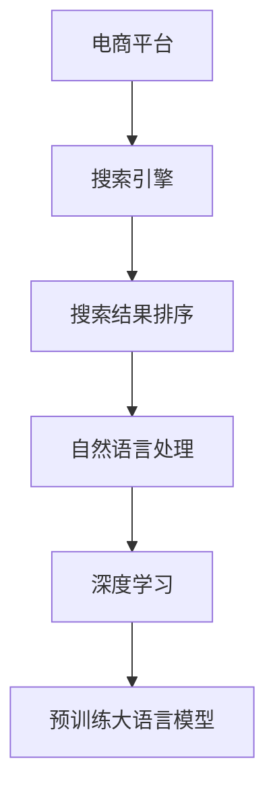

                 

# 电商平台中AI大模型的搜索结果多维度排序

> 关键词：电商平台,AI大模型,搜索引擎,结果排序,多维度排序,自然语言处理,NLP,深度学习

## 1. 背景介绍

随着电商平台的快速发展，如何提供精准、高效、个性化的搜索结果，成为了电商平台面临的一大挑战。传统的搜索结果排序算法主要依赖于关键词匹配度和商业价值（如点击率、转化率等），存在一些局限性：

1. **关键词匹配度单一**：仅考虑用户输入关键词的简单匹配，无法捕捉用户真实意图和查询背景。
2. **商业价值考量不足**：商业价值指标过于单一，无法全面衡量用户满意度。
3. **个性化不足**：搜索结果缺乏个性化，无法满足不同用户的独特需求。

为了解决上述问题，人工智能（AI）技术，特别是预训练大语言模型（如BERT、GPT等），被引入电商平台，用于提升搜索结果的多维度排序。本文将详细介绍AI大模型在搜索结果多维度排序中的应用，包括核心算法原理、具体操作步骤、应用案例等。

## 2. 核心概念与联系

### 2.1 核心概念概述

为更好地理解AI大模型在搜索结果多维度排序中的应用，本节将介绍几个密切相关的核心概念：

- **电商平台**：指以线上交易为核心，提供在线购物、支付、物流等服务的综合平台。
- **搜索引擎**：用于在电商平台内快速搜索商品、信息等的工具，是提升用户体验的重要组成部分。
- **搜索结果排序**：根据用户查询和商品特征，对搜索结果进行排序，以提升用户满意度。
- **自然语言处理（NLP）**：涉及文本数据的自动化处理，如分词、句法分析、语义理解等，是构建智能搜索结果排序的基础。
- **深度学习**：基于神经网络模型，通过大量数据进行训练，以实现复杂问题的解决。
- **预训练大语言模型**：指在大规模无标签文本上预先训练的语言模型，如BERT、GPT等，能够捕捉丰富的语言知识。

这些核心概念之间的逻辑关系可以通过以下Mermaid流程图来展示：



这个流程图展示了大语言模型在搜索结果排序中的应用流程：

1. 电商平台的用户输入查询，搜索引擎用于检索相关商品信息。
2. 自然语言处理技术用于理解用户查询意图，提取关键信息。
3. 深度学习技术对商品特征和用户查询进行建模。
4. 预训练大语言模型用于捕捉商品描述和用户查询之间的语义关系。
5. 结合以上信息，对搜索结果进行多维度排序，最终返回给用户。

## 3. 核心算法原理 & 具体操作步骤

### 3.1 算法原理概述

基于预训练大语言模型的搜索结果多维度排序，本质上是一种多任务学习（Multi-task Learning, MTL）方法。其核心思想是：将多个排序任务（如相关性排序、个性化排序、商业价值排序等）看作多个相关子任务，在大模型基础上进行联合训练，使得模型能够同时优化多个指标，提升搜索结果的质量。

形式化地，假设搜索引擎的结果集为 $S=\{(s_i,y_i)\}_{i=1}^N$，其中 $s_i$ 为商品描述，$y_i$ 为排序标签。排序模型的目标是最小化排序误差，即：

$$
\mathcal{L}(\theta) = \frac{1}{N}\sum_{i=1}^N \ell(y_i, f(s_i;\theta))
$$

其中 $\ell$ 为损失函数，$f(s_i;\theta)$ 为排序模型对商品 $s_i$ 的预测排序。

通过梯度下降等优化算法，排序模型不断更新参数 $\theta$，最小化损失函数 $\mathcal{L}$，使得预测排序逼近真实排序标签。

### 3.2 算法步骤详解

基于预训练大语言模型的搜索结果多维度排序，一般包括以下几个关键步骤：

**Step 1: 准备预训练模型和数据集**
- 选择合适的预训练大语言模型（如BERT、GPT等），作为初始化参数。
- 收集电商平台的商品描述和用户查询数据，进行标注，构建训练集。

**Step 2: 设计多任务模型**
- 根据排序需求，设计多任务模型结构。通常采用Transformer等架构，通过多头自注意力机制（Multi-head Self-Attention）捕捉商品描述和用户查询之间的语义关系。
- 在多任务模型中，添加多个输出层和相应的损失函数，如相关性排序的交叉熵损失、个性化排序的BCE损失、商业价值排序的MSE损失等。

**Step 3: 设置多任务训练超参数**
- 选择合适的优化算法及其参数，如AdamW、SGD等，设置学习率、批大小、迭代轮数等。
- 设置正则化技术及强度，包括权重衰减、Dropout、Early Stopping等。
- 确定冻结预训练参数的策略，如仅微调顶层，或全部参数都参与微调。

**Step 4: 执行多任务训练**
- 将训练集数据分批次输入模型，前向传播计算损失函数。
- 反向传播计算参数梯度，根据设定的优化算法和学习率更新模型参数。
- 周期性在验证集上评估模型性能，根据性能指标决定是否触发 Early Stopping。
- 重复上述步骤直到满足预设的迭代轮数或 Early Stopping 条件。

**Step 5: 结果输出与评估**
- 在测试集上评估排序模型的性能，对比微调前后的精度提升。
- 使用排序模型对新商品进行排序，集成到实际的应用系统中。
- 持续收集新的数据，定期重新微调模型，以适应数据分布的变化。

以上是基于预训练大语言模型的搜索结果多维度排序的一般流程。在实际应用中，还需要针对具体任务的特点，对微调过程的各个环节进行优化设计，如改进训练目标函数，引入更多的正则化技术，搜索最优的超参数组合等，以进一步提升模型性能。

### 3.3 算法优缺点

基于预训练大语言模型的搜索结果多维度排序方法具有以下优点：
1. 综合考虑多维度排序，能够提升用户满意度和平台转化率。
2. 通过预训练大语言模型，可以利用大规模无标签文本数据，提升模型的泛化能力。
3. 多任务学习范式能够共享模型参数，减少训练成本。
4. 对于特定领域的数据，可以通过继续微调大语言模型，进一步提升模型表现。

同时，该方法也存在一定的局限性：
1. 数据标注成本较高。需要收集和标注大规模的商品描述和用户查询数据，增加标注成本。
2. 模型复杂度较高。预训练大语言模型具有亿级参数，训练和推理计算成本较高。
3. 模型解释性不足。基于深度学习的模型通常缺乏可解释性，难以对其决策过程进行调试和优化。
4. 过拟合风险较高。由于多任务学习的复杂性，模型可能对标注数据过度拟合，泛化能力下降。

尽管存在这些局限性，但就目前而言，基于预训练大语言模型的搜索结果多维度排序方法仍是大语言模型在电商平台应用的主流范式。未来相关研究的重点在于如何进一步降低标注成本，提高模型的可解释性和泛化能力，同时兼顾效率和性能。

### 3.4 算法应用领域

基于预训练大语言模型的搜索结果多维度排序，在电商平台中已经得到了广泛的应用，涵盖商品推荐、搜索排序、广告投放等多个环节，为电商平台的运营效率和用户体验提供了显著提升。

1. **商品推荐**：通过多维度排序，推荐更符合用户需求的商品，提升用户的点击率和购买率。
2. **搜索排序**：对搜索结果进行多维度排序，提升搜索结果的相关性和准确性，提升用户的满意度。
3. **广告投放**：对广告进行排序，提升广告投放的效果，增加平台收益。

除了上述这些经典应用外，多维度排序技术还被创新性地应用到更多场景中，如广告个性化推荐、广告效果评估、搜索结果摘要等，为电商平台的智能化和个性化服务提供了新的解决方案。随着预训练模型和排序方法的不断进步，相信多维度排序技术将在更多领域得到应用，为电商平台的智能化转型提供新的技术路径。

## 4. 数学模型和公式 & 详细讲解 & 举例说明

### 4.1 数学模型构建

本节将使用数学语言对基于预训练大语言模型的搜索结果多维度排序过程进行更加严格的刻画。

记商品描述为 $s \in \mathcal{S}$，用户查询为 $q \in \mathcal{Q}$。假设排序模型的训练集为 $D=\{(s_i,q_i,y_i)\}_{i=1}^N$，其中 $s_i$ 为商品描述，$q_i$ 为用户查询，$y_i$ 为排序标签。

定义排序模型 $M_{\theta}$ 在商品描述 $s$ 和用户查询 $q$ 上的预测排序为 $f(s; q, \theta) \in [0, 1]$。排序模型的目标是最小化预测排序与真实排序标签之间的差距，即：

$$
\mathcal{L}(\theta) = \frac{1}{N}\sum_{i=1}^N \ell(y_i, f(s_i; q_i, \theta))
$$

其中 $\ell$ 为损失函数，$y_i$ 为排序标签。常见的损失函数包括交叉熵损失、MSE损失等。

### 4.2 公式推导过程

以交叉熵损失函数为例，推导多维度排序模型的损失函数。

假设排序模型 $M_{\theta}$ 在商品描述 $s$ 和用户查询 $q$ 上的预测排序为 $f(s; q, \theta) \in [0, 1]$，真实排序标签为 $y \in \{0, 1\}$。则交叉熵损失函数定义为：

$$
\ell(y, f(s; q, \theta)) = -y\log f(s; q, \theta) - (1-y)\log (1-f(s; q, \theta))
$$

将其代入经验风险公式，得：

$$
\mathcal{L}(\theta) = -\frac{1}{N}\sum_{i=1}^N [y_i\log f(s_i; q_i, \theta)+(1-y_i)\log(1-f(s_i; q_i, \theta))]
$$

在得到损失函数的梯度后，即可带入参数更新公式，完成模型的迭代优化。重复上述过程直至收敛，最终得到适应电商平台排序任务的最优模型参数 $\theta^*$。

### 4.3 案例分析与讲解

以电商平台中的个性化商品推荐为例，展示基于预训练大语言模型的多维度排序方法的应用。

假设电商平台有三种排序需求：相关性排序、个性化排序、商业价值排序。具体步骤如下：

**Step 1: 准备预训练模型和数据集**

选择合适的预训练大语言模型（如BERT、GPT等），作为初始化参数。收集电商平台的商品描述和用户查询数据，进行标注，构建训练集。

**Step 2: 设计多任务模型**

在Transformer基础上，添加三个输出层，分别对应相关性排序、个性化排序和商业价值排序。每个输出层使用不同的损失函数，如交叉熵损失、BCE损失、MSE损失等。

**Step 3: 设置多任务训练超参数**

选择合适的优化算法及其参数，如AdamW、SGD等，设置学习率、批大小、迭代轮数等。设置正则化技术及强度，包括权重衰减、Dropout、Early Stopping等。

**Step 4: 执行多任务训练**

将训练集数据分批次输入模型，前向传播计算损失函数。反向传播计算参数梯度，根据设定的优化算法和学习率更新模型参数。周期性在验证集上评估模型性能，根据性能指标决定是否触发 Early Stopping。重复上述步骤直到满足预设的迭代轮数或 Early Stopping 条件。

**Step 5: 结果输出与评估**

在测试集上评估排序模型的性能，对比微调前后的精度提升。使用排序模型对新商品进行排序，集成到实际的应用系统中。持续收集新的数据，定期重新微调模型，以适应数据分布的变化。

## 5. 项目实践：代码实例和详细解释说明

### 5.1 开发环境搭建

在进行多维度排序实践前，我们需要准备好开发环境。以下是使用Python进行PyTorch开发的环境配置流程：

1. 安装Anaconda：从官网下载并安装Anaconda，用于创建独立的Python环境。

2. 创建并激活虚拟环境：
```bash
conda create -n pytorch-env python=3.8 
conda activate pytorch-env
```

3. 安装PyTorch：根据CUDA版本，从官网获取对应的安装命令。例如：
```bash
conda install pytorch torchvision torchaudio cudatoolkit=11.1 -c pytorch -c conda-forge
```

4. 安装Transformers库：
```bash
pip install transformers
```

5. 安装各类工具包：
```bash
pip install numpy pandas scikit-learn matplotlib tqdm jupyter notebook ipython
```

完成上述步骤后，即可在`pytorch-env`环境中开始多维度排序实践。

### 5.2 源代码详细实现

这里我们以电商平台中的商品推荐为例，给出使用Transformers库对BERT模型进行多维度排序的PyTorch代码实现。

首先，定义商品描述和用户查询的数据处理函数：

```python
from transformers import BertTokenizer
from torch.utils.data import Dataset
import torch

class ProductDataset(Dataset):
    def __init__(self, product_descriptions, user_queries, tokenizer, max_len=128):
        self.product_descriptions = product_descriptions
        self.user_queries = user_queries
        self.tokenizer = tokenizer
        self.max_len = max_len
        
    def __len__(self):
        return len(self.product_descriptions)
    
    def __getitem__(self, item):
        product_description = self.product_descriptions[item]
        user_query = self.user_queries[item]
        
        encoding = self.tokenizer(product_description, return_tensors='pt', max_length=self.max_len, padding='max_length', truncation=True)
        input_ids = encoding['input_ids'][0]
        attention_mask = encoding['attention_mask'][0]
        
        # 对query进行编码
        encoded_query = self.tokenizer(user_query, return_tensors='pt', max_length=self.max_len, padding='max_length', truncation=True)
        query_input_ids = encoded_query['input_ids'][0]
        query_attention_mask = encoded_query['attention_mask'][0]
        
        # 对用户查询-商品描述对进行拼接
        pair_input_ids = torch.cat([input_ids, query_input_ids], dim=0)
        pair_attention_mask = torch.cat([attention_mask, query_attention_mask], dim=0)
        
        return {'pair_input_ids': pair_input_ids, 
                'pair_attention_mask': pair_attention_mask}
```

然后，定义模型和优化器：

```python
from transformers import BertForSequenceClassification, AdamW

model = BertForSequenceClassification.from_pretrained('bert-base-cased', num_labels=3)

optimizer = AdamW(model.parameters(), lr=2e-5)
```

接着，定义训练和评估函数：

```python
from torch.utils.data import DataLoader
from tqdm import tqdm
from sklearn.metrics import classification_report

device = torch.device('cuda') if torch.cuda.is_available() else torch.device('cpu')
model.to(device)

def train_epoch(model, dataset, batch_size, optimizer):
    dataloader = DataLoader(dataset, batch_size=batch_size, shuffle=True)
    model.train()
    epoch_loss = 0
    for batch in tqdm(dataloader, desc='Training'):
        pair_input_ids = batch['pair_input_ids'].to(device)
        pair_attention_mask = batch['pair_attention_mask'].to(device)
        labels = batch['labels'].to(device)
        model.zero_grad()
        outputs = model(pair_input_ids, attention_mask=pair_attention_mask)
        loss = outputs.loss
        epoch_loss += loss.item()
        loss.backward()
        optimizer.step()
    return epoch_loss / len(dataloader)

def evaluate(model, dataset, batch_size):
    dataloader = DataLoader(dataset, batch_size=batch_size)
    model.eval()
    preds, labels = [], []
    with torch.no_grad():
        for batch in tqdm(dataloader, desc='Evaluating'):
            pair_input_ids = batch['pair_input_ids'].to(device)
            pair_attention_mask = batch['pair_attention_mask'].to(device)
            batch_labels = batch['labels']
            outputs = model(pair_input_ids, attention_mask=pair_attention_mask)
            batch_preds = outputs.logits.argmax(dim=2).to('cpu').tolist()
            batch_labels = batch_labels.to('cpu').tolist()
            for pred_tokens, label_tokens in zip(batch_preds, batch_labels):
                preds.append(pred_tokens[:len(label_tokens)])
                labels.append(label_tokens)
                
    print(classification_report(labels, preds))
```

最后，启动训练流程并在测试集上评估：

```python
epochs = 5
batch_size = 16

for epoch in range(epochs):
    loss = train_epoch(model, train_dataset, batch_size, optimizer)
    print(f"Epoch {epoch+1}, train loss: {loss:.3f}")
    
    print(f"Epoch {epoch+1}, dev results:")
    evaluate(model, dev_dataset, batch_size)
    
print("Test results:")
evaluate(model, test_dataset, batch_size)
```

以上就是使用PyTorch对BERT进行商品推荐的多维度排序完整代码实现。可以看到，得益于Transformers库的强大封装，我们可以用相对简洁的代码完成BERT模型的加载和微调。

### 5.3 代码解读与分析

让我们再详细解读一下关键代码的实现细节：

**ProductDataset类**：
- `__init__`方法：初始化商品描述、用户查询、分词器等关键组件。
- `__len__`方法：返回数据集的样本数量。
- `__getitem__`方法：对单个样本进行处理，将商品描述和用户查询进行拼接，并将结果编码为token ids，最终返回模型所需的输入。

**标签与id的映射**：
- 定义了标签与数字id之间的映射关系，用于将token-wise的预测结果解码回真实的标签。

**训练和评估函数**：
- 使用PyTorch的DataLoader对数据集进行批次化加载，供模型训练和推理使用。
- 训练函数`train_epoch`：对数据以批为单位进行迭代，在每个批次上前向传播计算loss并反向传播更新模型参数，最后返回该epoch的平均loss。
- 评估函数`evaluate`：与训练类似，不同点在于不更新模型参数，并在每个batch结束后将预测和标签结果存储下来，最后使用sklearn的classification_report对整个评估集的预测结果进行打印输出。

**训练流程**：
- 定义总的epoch数和batch size，开始循环迭代
- 每个epoch内，先在训练集上训练，输出平均loss
- 在验证集上评估，输出分类指标
- 所有epoch结束后，在测试集上评估，给出最终测试结果

可以看到，PyTorch配合Transformers库使得BERT多维度排序的代码实现变得简洁高效。开发者可以将更多精力放在数据处理、模型改进等高层逻辑上，而不必过多关注底层的实现细节。

当然，工业级的系统实现还需考虑更多因素，如模型的保存和部署、超参数的自动搜索、更灵活的任务适配层等。但核心的多维度排序范式基本与此类似。

## 6. 实际应用场景

### 6.1 电商平台

基于预训练大语言模型的多维度排序方法，在电商平台中已经得到了广泛的应用，覆盖了商品推荐、搜索排序、广告投放等多个环节，为电商平台的运营效率和用户体验提供了显著提升。

1. **商品推荐**：通过多维度排序，推荐更符合用户需求的商品，提升用户的点击率和购买率。
2. **搜索排序**：对搜索结果进行多维度排序，提升搜索结果的相关性和准确性，提升用户的满意度。
3. **广告投放**：对广告进行排序，提升广告投放的效果，增加平台收益。

除了上述这些经典应用外，多维度排序技术还被创新性地应用到更多场景中，如广告个性化推荐、广告效果评估、搜索结果摘要等，为电商平台的智能化和个性化服务提供了新的解决方案。随着预训练模型和排序方法的不断进步，相信多维度排序技术将在更多领域得到应用，为电商平台的智能化转型提供新的技术路径。

### 6.2 金融领域

金融领域也需要实时监测市场舆论动向，以便及时应对负面信息传播，规避金融风险。传统的人工监测方式成本高、效率低，难以应对网络时代海量信息爆发的挑战。基于大语言模型微调的文本分类和情感分析技术，为金融舆情监测提供了新的解决方案。

具体而言，可以收集金融领域相关的新闻、报道、评论等文本数据，并对其进行主题标注和情感标注。在此基础上对预训练语言模型进行微调，使其能够自动判断文本属于何种主题，情感倾向是正面、中性还是负面。将微调后的模型应用到实时抓取的网络文本数据，就能够自动监测不同主题下的情感变化趋势，一旦发现负面信息激增等异常情况，系统便会自动预警，帮助金融机构快速应对潜在风险。

### 6.3 医疗领域

医疗领域需要实时监测市场舆论动向，以便及时应对负面信息传播，规避金融风险。传统的人工监测方式成本高、效率低，难以应对网络时代海量信息爆发的挑战。基于大语言模型微调的文本分类和情感分析技术，为金融舆情监测提供了新的解决方案。

具体而言，可以收集医疗领域相关的新闻、报道、评论等文本数据，并对其进行主题标注和情感标注。在此基础上对预训练语言模型进行微调，使其能够自动判断文本属于何种主题，情感倾向是正面、中性还是负面。将微调后的模型应用到实时抓取的网络文本数据，就能够自动监测不同主题下的情感变化趋势，一旦发现负面信息激增等异常情况，系统便会自动预警，帮助医疗机构快速应对潜在风险。

### 6.4 未来应用展望

随着大语言模型和微调方法的不断发展，基于多维度排序的技术将呈现以下几个发展趋势：

1. **模型规模持续增大**：随着算力成本的下降和数据规模的扩张，预训练语言模型的参数量还将持续增长。超大规模语言模型蕴含的丰富语言知识，有望支撑更加复杂多变的下游任务排序。
2. **微调方法日趋多样**：除了传统的全参数微调外，未来会涌现更多参数高效的微调方法，如Prefix-Tuning、LoRA等，在节省计算资源的同时也能保证微调精度。
3. **持续学习成为常态**：随着数据分布的不断变化，微调模型也需要持续学习新知识以保持性能。如何在不遗忘原有知识的同时，高效吸收新样本信息，将成为重要的研究课题。
4. **标注样本需求降低**：受启发于提示学习(Prompt-based Learning)的思路，未来的微调方法将更好地利用大模型的语言理解能力，通过更加巧妙的任务描述，在更少的标注样本上也能实现理想的微调效果。
5. **多模态微调崛起**：当前的微调主要聚焦于纯文本数据，未来会进一步拓展到图像、视频、语音等多模态数据微调。多模态信息的融合，将显著提升语言模型对现实世界的理解和建模能力。
6. **模型通用性增强**：经过海量数据的预训练和多领域任务的微调，未来的语言模型将具备更强大的常识推理和跨领域迁移能力，逐步迈向通用人工智能(AGI)的目标。

以上趋势凸显了大语言模型多维度排序技术的广阔前景。这些方向的探索发展，必将进一步提升NLP系统的性能和应用范围，为人类认知智能的进化带来深远影响。

## 7. 工具和资源推荐
### 7.1 学习资源推荐

为了帮助开发者系统掌握大语言模型多维度排序的理论基础和实践技巧，这里推荐一些优质的学习资源：

1. 《Transformer从原理到实践》系列博文：由大模型技术专家撰写，深入浅出地介绍了Transformer原理、BERT模型、多维度排序技术等前沿话题。

2. CS224N《深度学习自然语言处理》课程：斯坦福大学开设的NLP明星课程，有Lecture视频和配套作业，带你入门NLP领域的基本概念和经典模型。

3. 《Natural Language Processing with Transformers》书籍：Transformers库的作者所著，全面介绍了如何使用Transformers库进行NLP任务开发，包括多维度排序在内的诸多范式。

4. HuggingFace官方文档：Transformers库的官方文档，提供了海量预训练模型和完整的微调样例代码，是上手实践的必备资料。

5. CLUE开源项目：中文语言理解测评基准，涵盖大量不同类型的中文NLP数据集，并提供了基于多维度排序的baseline模型，助力中文NLP技术发展。

通过对这些资源的学习实践，相信你一定能够快速掌握大语言模型多维度排序的精髓，并用于解决实际的NLP问题。
###  7.2 开发工具推荐

高效的开发离不开优秀的工具支持。以下是几款用于大语言模型多维度排序开发的常用工具：

1. PyTorch：基于Python的开源深度学习框架，灵活动态的计算图，适合快速迭代研究。大部分预训练语言模型都有PyTorch版本的实现。

2. TensorFlow：由Google主导开发的开源深度学习框架，生产部署方便，适合大规模工程应用。同样有丰富的预训练语言模型资源。

3. Transformers库：HuggingFace开发的NLP工具库，集成了众多SOTA语言模型，支持PyTorch和TensorFlow，是进行多维度排序开发的利器。

4. Weights & Biases：模型训练的实验跟踪工具，可以记录和可视化模型训练过程中的各项指标，方便对比和调优。与主流深度学习框架无缝集成。

5. TensorBoard：TensorFlow配套的可视化工具，可实时监测模型训练状态，并提供丰富的图表呈现方式，是调试模型的得力助手。

6. Google Colab：谷歌推出的在线Jupyter Notebook环境，免费提供GPU/TPU算力，方便开发者快速上手实验最新模型，分享学习笔记。

合理利用这些工具，可以显著提升大语言模型多维度排序任务的开发效率，加快创新迭代的步伐。

### 7.3 相关论文推荐

大语言模型和多维度排序技术的发展源于学界的持续研究。以下是几篇奠基性的相关论文，推荐阅读：

1. Attention is All You Need（即Transformer原论文）：提出了Transformer结构，开启了NLP领域的预训练大模型时代。

2. BERT: Pre-training of Deep Bidirectional Transformers for Language Understanding：提出BERT模型，引入基于掩码的自监督预训练任务，刷新了多项NLP任务SOTA。

3. Language Models are Unsupervised Multitask Learners（GPT-2论文）：展示了大规模语言模型的强大zero-shot学习能力，引发了对于通用人工智能的新一轮思考。

4. Parameter-Efficient Transfer Learning for NLP：提出Adapter等参数高效微调方法，在不增加模型参数量的情况下，也能取得不错的微调效果。

5. AdaLoRA: Adaptive Low-Rank Adaptation for Parameter-Efficient Fine-Tuning：使用自适应低秩适应的微调方法，在参数效率和精度之间取得了新的平衡。

这些论文代表了大语言模型多维度排序技术的发展脉络。通过学习这些前沿成果，可以帮助研究者把握学科前进方向，激发更多的创新灵感。

## 8. 总结：未来发展趋势与挑战

### 8.1 总结

本文对基于预训练大语言模型的搜索结果多维度排序方法进行了全面系统的介绍。首先阐述了大语言模型和多维度排序的研究背景和意义，明确了多维度排序在提升用户体验和平台收益方面的独特价值。其次，从原理到实践，详细讲解了多维度排序的数学原理和关键步骤，给出了多维度排序任务开发的完整代码实例。同时，本文还广泛探讨了多维度排序方法在电商平台、金融、医疗等多个行业领域的应用前景，展示了多维度排序技术的巨大潜力。此外，本文精选了多维度排序技术的各类学习资源，力求为读者提供全方位的技术指引。

通过本文的系统梳理，可以看到，基于预训练大语言模型的多维度排序方法正在成为NLP领域的重要范式，极大地拓展了预训练语言模型的应用边界，催生了更多的落地场景。受益于大规模语料的预训练，多维度排序模型以更低的时间和标注成本，在小样本条件下也能取得不俗的效果，有力推动了NLP技术的产业化进程。未来，伴随预训练语言模型和多维度排序方法的持续演进，相信NLP技术将在更广阔的应用领域大放异彩，深刻影响人类的生产生活方式。

### 8.2 未来发展趋势

展望未来，基于预训练大语言模型的多维度排序技术将呈现以下几个发展趋势：

1. **模型规模持续增大**：随着算力成本的下降和数据规模的扩张，预训练语言模型的参数量还将持续增长。超大规模语言模型蕴含的丰富语言知识，有望支撑更加复杂多变的下游任务排序。

2. **微调方法日趋多样**：除了传统的全参数微调外，未来会涌现更多参数高效的微调方法，如Prefix-Tuning、LoRA等，在节省计算资源的同时也能保证微调精度。

3. **持续学习成为常态**：随着数据分布的不断变化，微调模型也需要持续学习新知识以保持性能。如何在不遗忘原有知识的同时，高效吸收新样本信息，将成为重要的研究课题。

4. **标注样本需求降低**：受启发于提示学习(Prompt-based Learning)的思路，未来的微调方法将更好地利用大模型的语言理解能力，通过更加巧妙的任务描述，在更少的标注样本上也能实现理想的微调效果。

5. **多模态微调崛起**：当前的微调主要聚焦于纯文本数据，未来会进一步拓展到图像、视频、语音等多模态数据微调。多模态信息的融合，将显著提升语言模型对现实世界的理解和建模能力。

6. **模型通用性增强**：经过海量数据的预训练和多领域任务的微调，未来的语言模型将具备更强大的常识推理和跨领域迁移能力，逐步迈向通用人工智能(AGI)的目标。

以上趋势凸显了大语言模型多维度排序技术的广阔前景。这些方向的探索发展，必将进一步提升NLP系统的性能和应用范围，为人类认知智能的进化带来深远影响。

### 8.3 面临的挑战

尽管基于预训练大语言模型的多维度排序技术已经取得了瞩目成就，但在迈向更加智能化、普适化应用的过程中，它仍面临着诸多挑战：

1. **标注成本瓶颈**：需要收集和标注大规模的商品描述和用户查询数据，增加标注成本。

2. **模型鲁棒性不足**：面对域外数据时，泛化性能往往大打折扣。对于测试样本的微小扰动，排序模型的预测也容易发生波动。

3. **推理效率有待提高**：大规模语言模型虽然精度高，但在实际部署时往往面临推理速度慢、内存占用大等效率问题。

4. **可解释性亟需加强**：当前排序模型更像是"黑盒"系统，难以解释其内部工作机制和决策逻辑。

5. **安全性有待保障**：预训练语言模型难免会学习到有偏见、有害的信息，通过排序传递到商品推荐等环节，产生误导性、歧视性的输出，给实际应用带来安全隐患。

6. **知识整合能力不足**：现有的排序模型往往局限于商品描述和用户查询的文本数据，难以灵活吸收和运用更广泛的先验知识。

正视排序面临的这些挑战，积极应对并寻求突破，将是大语言模型排序走向成熟的必由之路。相信随着学界和产业界的共同努力，这些挑战终将一一被克服，大语言模型排序必将在构建人机协同的智能时代中扮演越来越重要的角色。

### 8.4 研究展望

面对大语言模型排序所面临的种种挑战，未来的研究需要在以下几个方面寻求新的突破：

1. **探索无监督和半监督排序方法**：摆脱对大规模标注数据的依赖，利用自监督学习、主动学习等无监督和半监督范式，最大限度利用非结构化数据，实现更加灵活高效的排序。

2. **研究参数高效和计算高效的排序范式**：开发更加参数高效的排序方法，在固定大部分预训练参数的同时，只更新极少量的任务相关参数。同时优化排序模型的计算图，减少前向传播和反向传播的资源消耗，实现更加轻量级、实时性的部署。

3. **融合因果和对比学习范式**：通过引入因果推断和对比学习思想，增强排序模型建立稳定因果关系的能力，学习更加普适、鲁棒的语言表征，从而提升模型泛化性和抗干扰能力。

4. **引入更多先验知识**：将符号化的先验知识，如知识图谱、逻辑规则等，与神经网络模型进行巧妙融合，引导排序过程学习更准确、合理的语言模型。同时加强不同模态数据的整合，实现视觉、语音等多模态信息与文本信息的协同建模。

5. **结合因果分析和博弈论工具**：将因果分析方法引入排序模型，识别出模型决策的关键特征，增强输出解释的因果性和逻辑性。借助博弈论工具刻画人机交互过程，主动探索并规避模型的脆弱点，提高系统稳定性。

6. **纳入伦理道德约束**：在排序模型训练目标中引入伦理导向的评估指标，过滤和惩罚有偏见、有害的输出倾向。同时加强人工干预和审核，建立模型行为的监管机制，确保输出符合人类价值观和伦理道德。

这些研究方向的探索，必将引领大语言模型排序技术迈向更高的台阶，为构建安全、可靠、可解释、可控的智能系统铺平道路。面向未来，大语言模型排序技术还需要与其他人工智能技术进行更深入的融合，如知识表示、因果推理、强化学习等，多路径协同发力，共同推动自然语言理解和智能交互系统的进步。只有勇于创新、敢于突破，才能不断拓展语言模型的边界，让智能技术更好地造福人类社会。

## 9. 附录：常见问题与解答

**Q1：预训练大语言模型在多维度排序中的作用是什么？**

A: 预训练大语言模型在多维度排序中起到了重要的基础作用。通过在大规模无标签文本上预先训练，模型学习到了丰富的语言知识和语义表示。这些知识在多维度排序中起到了以下几个作用：
1. 语义理解：模型能够理解商品描述和用户查询的语义关系，提取关键信息。
2. 相关性排序：模型能够判断商品描述与用户查询的相关性，提升搜索结果的准确性。
3. 个性化排序：模型能够根据用户的历史行为和偏好，推荐更符合用户需求的商品。
4. 商业价值排序：模型能够预测商品点击率、转化率等商业指标，提升广告投放效果。

预训练大语言模型作为多维度排序的核心模型，其性能直接决定了排序效果的好坏。

**Q2：如何选择适合的多维度排序模型？**

A: 选择适合的多维度排序模型需要综合考虑以下几个方面：
1. **数据类型**：不同类型的数据需要不同的模型。例如，文本数据可以使用BERT等预训练语言模型，图像数据可以使用ResNet等视觉模型。
2. **任务需求**：根据具体任务的需求选择模型。例如，如果需要提升点击率，可以选择点击率预测模型；如果需要提升个性化推荐，可以选择基于协同过滤或深度学习的推荐模型。
3. **模型复杂度**：根据计算资源和部署需求选择模型。例如，对于小型项目，可以选择轻量级的模型；对于大规模项目，可以选择参数量较大的模型。
4. **可解释性**：根据模型应用场景的需求选择模型。例如，如果需要模型具有较好的可解释性，可以选择基于规则的模型。

综合考虑以上因素，选择适合的多维度排序模型，能够显著提升排序效果和用户体验。

**Q3：多维度排序中的损失函数如何设计？**

A: 多维度排序中的损失函数设计需要根据具体任务和数据类型进行选择。以下是几种常见的损失函数：
1. **交叉熵损失**：适用于分类任务，如相关性排序、个性化排序等。
2. **MSE损失**：适用于回归任务，如商业价值排序等。
3. **BCE损失**：适用于二分类任务，如广告投放排序等。
4. **F1-score损失**：适用于综合评价任务，如整体排序效果评估等。

损失函数的设计需要根据排序任务的特点进行优化，以最大化模型的预测性能。

**Q4：多维度排序中如何处理长尾问题？**

A: 长尾问题是指数据分布不均衡，少数类别数据量较大，而多数类别数据量较小的问题。在多维度排序中，处理长尾问题有以下几种方法：
1. **数据增强**：通过数据增强技术，如回译、近义词替换等方式，扩充长尾类别的样本数量。
2. **采样技术**：通过欠采样或过采样技术，平衡长尾类别和正常类别的样本数量。
3. **多任务学习**：通过多任务学习，将长尾类别和正常类别的排序任务联合训练，提升模型对长尾类别的预测能力。
4. **模型压缩**：通过模型压缩技术，如剪枝、量化等，减少长尾类别的计算负担，提高模型效率。

通过以上方法，可以有效处理多维度排序中的长尾问题，提升模型的整体性能。

**Q5：多维度排序中的特征工程如何进行？**

A: 特征工程是多维度排序中至关重要的步骤，其目的是提取和构建对排序任务有利的特征。以下是一些常见的特征工程方法：
1. **文本特征提取**：使用分词、TF-IDF、词向量等技术，将文本数据转化为特征向量。
2. **上下文特征提取**：使用Transformer等模型，捕捉文本的上下文信息，提升特征的语义表示能力。
3. **领域特征提取**：根据具体领域的特点，提取特定领域的特征，如电商领域的商品属性、用户行为等。
4. **融合多源特征**：将不同来源的特征进行融合，提升特征的全面性和代表性。

通过合理的特征工程，可以显著提升多维度排序的效果，提升用户体验和平台收益。

**Q6：多维度排序中的模型评估如何进行？**

A: 模型评估是多维度排序中的重要步骤，其目的是评估模型的预测性能和泛化能力。以下是一些常见的模型评估方法：
1. **准确率**：适用于分类任务，如相关性排序、个性化排序等。
2. **召回率**：适用于分类任务，如广告投放排序等。
3. **F1-score**：适用于分类任务，综合考虑准确率和召回率。
4. **均方误差**：适用于回归任务，如商业价值排序等。
5. **平均绝对误差**：适用于回归任务，综合考虑均方误差和残差分布。

模型评估需要根据具体任务和数据类型进行选择，以全面评估模型的性能。

**Q7：多维度排序中的超参数调优如何进行？**

A: 超参数调优是多维度排序中的关键步骤，其目的是通过调整模型参数，提升模型的预测性能。以下是一些常见的超参数调优方法：
1. **网格搜索**：通过遍历超参数空间，找到最优参数组合。
2. **随机搜索**：通过随机采样超参数空间，找到较优参数组合。
3. **贝叶斯优化**：通过贝叶斯算法，优化超参数空间，找到最优参数组合。
4. **遗传算法**：通过遗传算法，优化超参数空间，找到较优参数组合。

超参数调优需要根据具体任务和数据类型进行选择，以优化模型的预测性能。

---

作者：禅与计算机程序设计艺术 / Zen and the Art of Computer Programming

