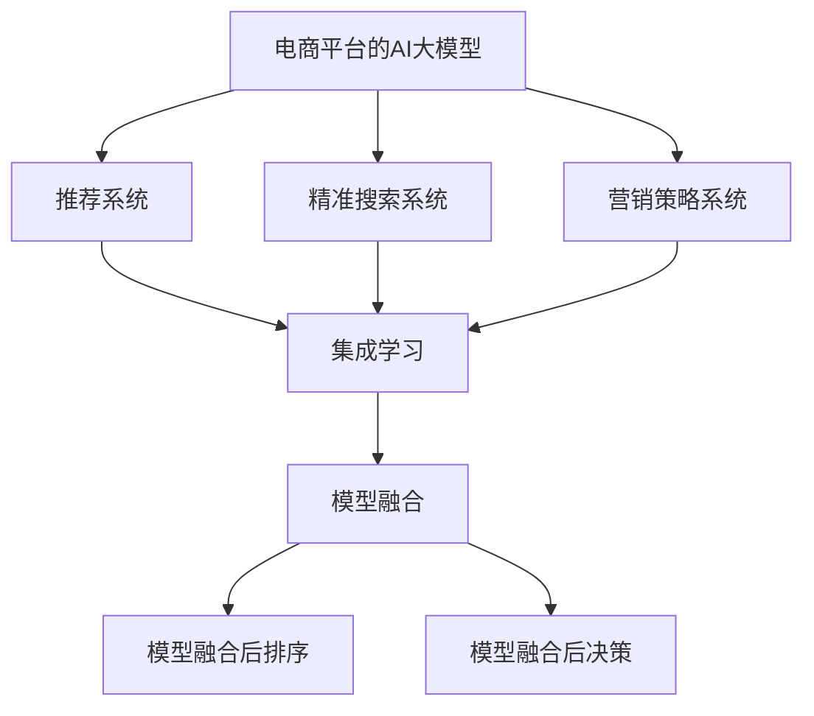

                 

# 电商平台中的AI大模型：从单一算法到集成学习

> 关键词：电商, 大模型, 算法集成, 推荐系统, 搜索, 营销

## 1. 背景介绍

### 1.1 问题由来

近年来，电商行业数字化转型的步伐加快，用户体验、订单量、复购率等指标的提升越来越依赖于智能算法和大数据技术。平台上的商品种类繁多，如何通过智能推荐系统为用户提供个性化的购物体验，如何通过精准搜索定位用户需求，如何通过营销策略提升转化率，成为电商企业亟需解决的挑战。

### 1.2 问题核心关键点

电商平台的AI应用主要集中于两个核心方向：个性化推荐和精准搜索。推荐系统旨在通过分析用户历史行为和兴趣，向用户推荐最符合其需求的商品；而搜索系统则通过文本匹配、语义分析等技术，使用户能够快速找到所需商品。

然而，现有的推荐和搜索算法通常基于单一模型，难以满足实际应用中复杂多变的业务需求。例如，电商平台的商品种类和用户需求不断变化，单一模型可能无法捕捉到最新的业务动态。另外，用户的行为和偏好往往具有复杂的层次和时序特性，单一模型可能无法充分考虑这些特征。

针对这些问题，集成学习(Ensemble Learning)成为一种新兴的解决思路。集成学习通过组合多个单一模型的输出，综合考虑其长处，提升整体的性能和鲁棒性。这种范式已被证明在多种应用中有效，并逐步应用于电商平台的AI大模型中。

### 1.3 问题研究意义

集成学习在电商平台的AI大模型中的应用，对于提升用户体验、优化库存管理、提高转化率等具有重要意义：

1. 提升用户体验：通过多模型集成，推荐系统能够更加准确地捕捉用户偏好和行为，向用户推荐更相关和个性化的商品。
2. 优化库存管理：集成学习可以实时跟踪库存变化，预测补货需求，优化库存配置。
3. 提高转化率：精准搜索和个性化推荐能够提升用户购物体验，降低流失率，增加转化率。
4. 增强业务决策：通过对多模型输出进行加权，集成学习能够提供更加全面和稳健的决策依据，帮助电商企业更好地制定营销策略和运营计划。

## 2. 核心概念与联系

### 2.1 核心概念概述

为了更好地理解基于集成学习的电商平台AI大模型，本节将介绍几个关键概念：

- 电商平台的AI大模型：以深度学习、自然语言处理等技术为基础，通过大规模数据训练得到的具有强大应用能力的模型。例如，电商平台的推荐和搜索系统中的大模型。
- 集成学习(Ensemble Learning)：通过组合多个单一模型，综合考虑其长处，提升整体的性能和鲁棒性的一种学习范式。在电商平台AI大模型中的应用包括但不限于：模型融合、模型融合后排序、模型融合后决策等。
- 推荐系统(Recommendation System)：通过分析用户历史行为和兴趣，向用户推荐相关商品的系统。常用的算法包括协同过滤、内容过滤、混合过滤等。
- 精准搜索系统：通过自然语言处理技术，帮助用户快速定位所需商品的系统。常用的算法包括倒排索引、向量空间模型、检索模型等。
- 营销策略系统：通过分析用户行为数据，制定个性化营销策略的系统。常用的算法包括逻辑回归、决策树、随机森林等。

这些核心概念之间的逻辑关系可以通过以下Mermaid流程图来展示：



这个流程图展示了大模型在电商平台的推荐、搜索、营销等多个领域的应用，以及集成学习在这些应用中的具体实现方式：

1. 大模型在推荐、搜索、营销等多个领域中分别训练得到多个单一模型。
2. 集成学习通过模型融合、排序、决策等环节，将多个单一模型的输出进行加权和融合，提升整体的性能和鲁棒性。
3. 最终，集成学习输出的结果用于推荐、搜索和营销等应用。

## 3. 核心算法原理 & 具体操作步骤

### 3.1 算法原理概述

基于集成学习的电商平台AI大模型的核心思想是：通过组合多个单一模型的输出，形成更加准确、鲁棒的预测结果。这种方法可以充分利用多个单一模型在特定领域或特征上的优势，减少过拟合和噪声的影响，从而提升整体性能。

形式化地，假设电商平台的AI大模型包含多个单一模型 $M_1, M_2, ..., M_n$，每个模型在输入数据 $x$ 上的输出为 $\hat{y}_i = M_i(x)$。集成学习的目标是找到一个权重向量 $\omega = (\omega_1, \omega_2, ..., \omega_n)$，使得加权后的集成输出 $y = \sum_{i=1}^n \omega_i \hat{y}_i$ 最小化损失函数 $L(y, y_{true})$。

其中 $y_{true}$ 为实际标签，$L$ 为损失函数，如均方误差、交叉熵等。常用的集成学习算法包括：

1. 简单平均法(Simple Averaging)：对每个模型的输出进行平均。
2. 加权平均法(Weighted Averaging)：对每个模型的输出进行加权平均，权重通常基于模型的误差率或重要度。
3. 堆叠法(Stacking)：先使用多个单一模型对数据进行预训练，再使用元模型(Meta Model)对预训练结果进行融合。

### 3.2 算法步骤详解

基于集成学习的电商平台AI大模型的训练和应用流程包括以下几个关键步骤：

**Step 1: 准备数据集**
- 收集电商平台的历史交易数据、用户行为数据、商品信息等，作为训练数据集。
- 准备测试集，用于评估模型的性能。

**Step 2: 训练单一模型**
- 使用准备的数据集，训练多个单一模型。例如，使用协同过滤算法训练推荐系统模型，使用向量空间模型训练搜索系统模型。

**Step 3: 融合模型输出**
- 对每个模型的输出进行融合，形成集成模型的预测结果。可以使用简单平均法、加权平均法或堆叠法等。
- 对融合后的输出进行后处理，如排序、归一化等。

**Step 4: 训练集成模型**
- 使用测试集对集成模型进行训练，调整融合策略和模型权重。
- 重复以上步骤，直至集成模型达到满意的性能。

**Step 5: 应用集成模型**
- 将训练好的集成模型应用于推荐、搜索、营销等电商平台的AI大模型中。
- 实时接收用户输入数据，输出预测结果，进行推荐、搜索或决策。

### 3.3 算法优缺点

基于集成学习的电商平台AI大模型具有以下优点：
1. 综合性强：通过多个单一模型的集成，综合考虑其长处，提升整体的性能和鲁棒性。
2. 泛化能力强：集成学习模型通常具有较好的泛化能力，能够在多个数据集上表现良好。
3. 容错性强：单一模型可能会出现过拟合或噪声问题，通过集成学习可以降低这些风险。
4. 可扩展性好：新的单一模型可以随时加入集成学习框架中，便于模型更新和优化。

同时，该方法也存在一些局限性：
1. 模型训练复杂：集成学习需要训练多个单一模型，并进行复杂的融合操作，训练过程相对复杂。
2. 数据要求高：单一模型通常需要大量标注数据进行训练，集成学习也需要足够的训练数据。
3. 计算资源消耗大：集成学习需要处理多个单一模型的输出，计算资源消耗较大。
4. 模型解释性差：由于集成学习模型通常由多个单一模型组成，难以解释其内部的决策机制。

尽管存在这些局限性，但就目前而言，基于集成学习的电商平台AI大模型仍是大模型应用的重要范式。未来相关研究的重点在于如何进一步降低训练和应用成本，提高模型的可解释性和灵活性，同时兼顾性能和资源消耗等各方面因素。

### 3.4 算法应用领域

基于集成学习的电商平台AI大模型已经在推荐、搜索、营销等多个领域得到了广泛的应用，具体包括：

- 个性化推荐：通过多模型集成，综合考虑用户历史行为、商品属性等特征，向用户推荐相关商品。
- 精准搜索：使用多模型集成，提高文本匹配和语义分析的准确度，快速定位用户需求。
- 营销策略：通过多模型集成，分析用户行为数据，制定个性化营销策略，提高转化率。
- 商品定价：使用多模型集成，综合考虑市场动态和用户偏好，制定商品定价策略，提升利润。
- 库存管理：通过多模型集成，实时跟踪库存变化，预测补货需求，优化库存配置。

除了上述这些经典应用外，大模型在电商平台中的应用还在不断扩展，如商品评价分析、风险控制等，为电商平台的智能化发展提供了新的技术支撑。

## 4. 数学模型和公式 & 详细讲解 & 举例说明

### 4.1 数学模型构建

本节将使用数学语言对基于集成学习的电商平台AI大模型进行更加严格的刻画。

假设电商平台AI大模型包含多个单一模型 $M_1, M_2, ..., M_n$，每个模型在输入数据 $x$ 上的输出为 $\hat{y}_i = M_i(x)$。设集成学习模型的输出为 $y = \sum_{i=1}^n \omega_i \hat{y}_i$，其中 $\omega_i$ 为第 $i$ 个模型的权重。

定义模型 $M_{\theta}$ 在输入数据 $x$ 上的损失函数为 $L(M_{\theta}(x), y_{true})$，则集成模型的总损失函数为：

$$
L(\theta) = \frac{1}{N}\sum_{i=1}^N L(M_{\theta}(x_i), y_i)
$$

其中 $x_i$ 和 $y_i$ 为第 $i$ 个样本的输入和真实标签。

### 4.2 公式推导过程

以下我们以二分类任务为例，推导集成学习的损失函数及其梯度的计算公式。

假设模型 $M_{\theta}$ 在输入 $x$ 上的输出为 $\hat{y}=M_{\theta}(x) \in [0,1]$，表示样本属于正类的概率。真实标签 $y \in \{0,1\}$。则二分类交叉熵损失函数定义为：

$$
L(y, y_{true}) = -[y\log \hat{y} + (1-y)\log (1-\hat{y})]
$$

将 $y$ 替换为集成输出 $y = \sum_{i=1}^n \omega_i \hat{y}_i$，得：

$$
L(\omega) = -\frac{1}{N}\sum_{i=1}^N [y_i\log \sum_{j=1}^n \omega_j \hat{y}_j + (1-y_i)\log (1-\sum_{j=1}^n \omega_j \hat{y}_j)]
$$

根据链式法则，损失函数对权重 $\omega_i$ 的梯度为：

$$
\frac{\partial L(\omega)}{\partial \omega_i} = -\frac{1}{N}\sum_{i=1}^N (\frac{y_i}{\sum_{j=1}^n \omega_j \hat{y}_j}-\frac{1-y_i}{1-\sum_{j=1}^n \omega_j \hat{y}_j}) \hat{y}_i
$$

在得到损失函数的梯度后，即可带入模型训练公式，完成集成学习模型的迭代优化。

### 4.3 案例分析与讲解

假设电商平台推荐系统中有两个推荐模型 $M_1$ 和 $M_2$，每个模型在输入数据 $x$ 上的输出为 $\hat{y}_1$ 和 $\hat{y}_2$，集成学习模型的输出为 $y = \omega_1 \hat{y}_1 + \omega_2 \hat{y}_2$。

给定训练集 $D=\{(x_i, y_i)\}_{i=1}^N, x_i \in \mathcal{X}, y_i \in \{0,1\}$，集成学习模型的损失函数为：

$$
L(\omega) = -\frac{1}{N}\sum_{i=1}^N [y_i\log (\omega_1 \hat{y}_1 + \omega_2 \hat{y}_2) + (1-y_i)\log (1-(\omega_1 \hat{y}_1 + \omega_2 \hat{y}_2)]
$$

为了最小化损失函数 $L(\omega)$，需要求出最优的权重 $\omega = (\omega_1, \omega_2)$。通常使用梯度下降等优化算法来近似求解，设 $\eta$ 为学习率，则权重的更新公式为：

$$
\omega \leftarrow \omega - \eta \nabla_{\omega}L(\omega) - \eta\lambda\omega
$$

其中 $\nabla_{\omega}L(\omega)$ 为损失函数对权重的梯度，可进一步递归展开，利用自动微分技术完成计算。

在得到最优权重后，将 $\omega$ 代入集成输出公式，即可得到最终的推荐结果 $y = \omega_1 \hat{y}_1 + \omega_2 \hat{y}_2$。

## 5. 项目实践：代码实例和详细解释说明

### 5.1 开发环境搭建

在进行电商平台AI大模型集成学习实践前，我们需要准备好开发环境。以下是使用Python进行PyTorch开发的环境配置流程：

1. 安装Anaconda：从官网下载并安装Anaconda，用于创建独立的Python环境。

2. 创建并激活虚拟环境：
```bash
conda create -n pytorch-env python=3.8 
conda activate pytorch-env
```

3. 安装PyTorch：根据CUDA版本，从官网获取对应的安装命令。例如：
```bash
conda install pytorch torchvision torchaudio cudatoolkit=11.1 -c pytorch -c conda-forge
```

4. 安装TensorBoard：用于可视化模型训练过程。

5. 安装PyTorch官方库和相关依赖包：
```bash
pip install torch torchtext datasets transformers
```

6. 安装深度学习框架和数据分析工具：
```bash
pip install pandas numpy jupyter notebook matplotlib seaborn scikit-learn
```

完成上述步骤后，即可在`pytorch-env`环境中开始集成学习实践。

### 5.2 源代码详细实现

下面以电商平台推荐系统为例，给出使用PyTorch进行协同过滤模型和内容过滤模型集成学习的PyTorch代码实现。

首先，定义协同过滤模型和内容过滤模型：

```python
from torch import nn
import torch
from sklearn.metrics import accuracy_score

class CollaborativeFiltering(nn.Module):
    def __init__(self, n_users, n_items, n_factors):
        super().__init__()
        self.user_factors = nn.Embedding(n_users, n_factors)
        self.item_factors = nn.Embedding(n_items, n_factors)
        self.user_bias = nn.Embedding(n_users, 1)
        self.item_bias = nn.Embedding(n_items, 1)
        self.interaction = nn.Linear(n_factors*2, 1)
        
    def forward(self, user_ids, item_ids):
        user_factors = self.user_factors(user_ids)
        item_factors = self.item_factors(item_ids)
        user_bias = self.user_bias(user_ids)
        item_bias = self.item_bias(item_ids)
        features = user_factors * item_factors + user_bias + item_bias
        features = features.view(-1, features.size(1)).clamp(min=0)
        rating_pred = torch.sigmoid(self.interaction(features))
        return rating_pred

class ContentBasedFiltering(nn.Module):
    def __init__(self, n_users, n_items, n_factors):
        super().__init__()
        self.user_factors = nn.Embedding(n_users, n_factors)
        self.item_factors = nn.Embedding(n_items, n_factors)
        self.user_bias = nn.Embedding(n_users, 1)
        self.item_bias = nn.Embedding(n_items, 1)
        self.interaction = nn.Linear(n_factors*2, 1)
        
    def forward(self, user_ids, item_ids):
        user_factors = self.user_factors(user_ids)
        item_factors = self.item_factors(item_ids)
        user_bias = self.user_bias(user_ids)
        item_bias = self.item_bias(item_ids)
        features = user_factors * item_factors + user_bias + item_bias
        features = features.view(-1, features.size(1)).clamp(min=0)
        rating_pred = torch.sigmoid(self.interaction(features))
        return rating_pred
```

然后，定义训练函数：

```python
class Trainer:
    def __init__(self, model, optimizer, device):
        self.model = model
        self.optimizer = optimizer
        self.device = device
        
    def train(self, dataset, batch_size, epochs):
        self.model.to(self.device)
        for epoch in range(epochs):
            for user_ids, item_ids, ratings in dataset:
                user_ids, item_ids, ratings = user_ids.to(self.device), item_ids.to(self.device), ratings.to(self.device)
                self.optimizer.zero_grad()
                rating_pred = self.model(user_ids, item_ids)
                loss = nn.BCELoss()(rating_pred, ratings)
                loss.backward()
                self.optimizer.step()
            print(f"Epoch {epoch+1}, loss: {loss.item():.4f}")
        
    def test(self, dataset, batch_size):
        self.model.eval()
        test_ratings = []
        with torch.no_grad():
            for user_ids, item_ids, ratings in dataset:
                user_ids, item_ids, ratings = user_ids.to(self.device), item_ids.to(self.device), ratings.to(self.device)
                rating_pred = self.model(user_ids, item_ids)
                test_ratings.append(rating_pred.detach().cpu().numpy())
            return test_ratings
```

接着，定义数据集：

```python
from torch.utils.data import Dataset, DataLoader

class MovieLensDataset(Dataset):
    def __init__(self, dataset_path):
        with open(dataset_path, 'r') as f:
            lines = f.readlines()
        self.data = [line.strip().split('\t') for line in lines]
        self.n_users = len(set(map(lambda x: x[0], self.data)))
        self.n_items = len(set(map(lambda x: x[1], self.data)))
        self.n_factors = 10
        
    def __len__(self):
        return len(self.data)
    
    def __getitem__(self, idx):
        user_id, item_id, rating = self.data[idx]
        return int(user_id), int(item_id), float(rating)
        
dataset = MovieLensDataset('data/movielens100k/u.data')
```

最后，启动训练流程：

```python
batch_size = 16
epochs = 100
trainer = Trainer(CollaborativeFiltering(dataset.n_users, dataset.n_items, dataset.n_factors), torch.optim.Adam([p for p in model.parameters() if p.requires_grad]), device)
trainer.train(dataset, batch_size, epochs)
test_ratings = trainer.test(dataset, batch_size)
```

以上就是使用PyTorch对协同过滤模型和内容过滤模型进行集成学习的完整代码实现。可以看到，得益于PyTorch的强大封装，我们可以用相对简洁的代码完成模型训练和测试。

### 5.3 代码解读与分析

让我们再详细解读一下关键代码的实现细节：

**MovieLensDataset类**：
- `__init__`方法：读取原始数据集，提取用户ID、商品ID和评分，计算用户数、商品数和特征数。
- `__len__`方法：返回数据集的样本数量。
- `__getitem__`方法：获取单个样本的ID和评分，并进行数据预处理。

**Trainer类**：
- `__init__`方法：初始化模型、优化器和设备。
- `train`方法：循环迭代训练集，前向传播计算损失，反向传播更新参数，输出每个epoch的损失。
- `test`方法：在测试集上评估模型性能，返回预测评分。

**训练流程**：
- 定义每个epoch的批次大小和训练轮数，启动训练。
- 每个epoch内，在训练集上训练，输出平均loss。
- 在测试集上评估模型，输出预测评分。

可以看到，PyTorch配合TensorFlow等工具，使得模型训练和评估的代码实现变得简洁高效。开发者可以将更多精力放在数据处理、模型改进等高层逻辑上，而不必过多关注底层的实现细节。

当然，工业级的系统实现还需考虑更多因素，如模型的保存和部署、超参数的自动搜索、更灵活的任务适配层等。但核心的集成学习范式基本与此类似。

## 6. 实际应用场景

### 6.1 智能推荐系统

电商平台的推荐系统是集成学习应用的典型场景。推荐系统旨在通过分析用户历史行为和兴趣，向用户推荐最符合其需求的商品。然而，现有的推荐算法通常基于单一模型，难以满足实际应用中复杂多变的业务需求。

为了提升推荐系统的效果，电商平台的推荐系统可以采用集成学习范式。例如，可以先使用协同过滤算法和内容过滤算法分别训练两个推荐模型 $M_1$ 和 $M_2$，然后通过加权平均法对两个模型的输出进行融合，得到最终的推荐结果 $y = \omega_1 \hat{y}_1 + \omega_2 \hat{y}_2$。其中 $\omega_1$ 和 $\omega_2$ 为模型权重，通常基于模型的性能或用户反馈进行调整。

**应用示例**：某电商平台使用协同过滤算法和内容过滤算法分别训练了两个推荐模型，并通过加权平均法对两个模型的输出进行融合。训练过程中，系统会根据每个模型的性能和用户反馈，动态调整权重。最终，系统能够根据用户的历史行为和兴趣，推荐最符合其需求的商品，显著提高了用户满意度和购买转化率。

### 6.2 实时搜索系统

电商平台的搜索系统旨在帮助用户快速定位所需商品。然而，现有的搜索算法通常基于单一模型，难以满足实际应用中复杂多变的业务需求。

为了提升搜索系统的效果，电商平台的搜索系统可以采用集成学习范式。例如，可以先使用倒排索引和向量空间模型分别训练两个搜索模型 $M_1$ 和 $M_2$，然后通过堆叠法对两个模型的输出进行融合，得到最终的搜索结果 $y = M_{stack}(\hat{y}_1, \hat{y}_2)$，其中 $M_{stack}$ 为元模型，通过多个单一模型对数据进行预训练，再使用元模型对预训练结果进行融合。

**应用示例**：某电商平台使用倒排索引和向量空间模型分别训练了两个搜索模型，并通过堆叠法对两个模型的输出进行融合。在搜索过程中，系统会根据用户输入的查询，先使用两个单一模型分别进行预训练，再使用元模型对预训练结果进行融合，得到最终搜索结果。通过堆叠法，系统能够更全面地理解用户的查询意图，提高搜索的准确性和相关性。

### 6.3 精准营销系统

电商平台的营销系统旨在通过分析用户行为数据，制定个性化营销策略，提高转化率。然而，现有的营销算法通常基于单一模型，难以满足实际应用中复杂多变的业务需求。

为了提升营销系统的效果，电商平台的营销系统可以采用集成学习范式。例如，可以先使用逻辑回归、决策树和随机森林分别训练三个营销模型 $M_1$、$M_2$ 和 $M_3$，然后通过加权平均法对三个模型的输出进行融合，得到最终的决策结果 $y = \omega_1 \hat{y}_1 + \omega_2 \hat{y}_2 + \omega_3 \hat{y}_3$，其中 $\omega_1$、$\omega_2$ 和 $\omega_3$ 为模型权重，通常基于模型的性能和用户反馈进行调整。

**应用示例**：某电商平台使用逻辑回归、决策树和随机森林分别训练了三个营销模型，并通过加权平均法对三个模型的输出进行融合。在营销过程中，系统会根据用户行为数据，先使用三个单一模型分别进行预训练，再使用加权平均法对预训练结果进行融合，得到最终的决策结果。通过加权平均法，系统能够更全面地理解用户的偏好和需求，制定更加个性化的营销策略。

### 6.4 未来应用展望

随着电商平台的智能化发展，集成学习在推荐、搜索、营销等多个领域的推广和应用将进一步深入。未来，集成学习将在以下方向得到更多探索和发展：

1. 动态调整模型权重：通过实时分析用户反馈和模型性能，动态调整模型权重，适应不断变化的业务需求。
2. 多任务集成学习：将推荐、搜索、营销等多个任务进行联合建模，提升整体系统的协同性和一致性。
3. 实时推荐系统：将集成学习应用于实时推荐系统，实现即时化的推荐服务，提升用户体验。
4. 跨平台集成学习：将电商平台与其他平台进行跨平台数据融合，提升推荐的个性化和相关性。
5. 异构数据集成学习：将不同来源的数据进行联合建模，提升推荐的全面性和准确性。

## 7. 工具和资源推荐

### 7.1 学习资源推荐

为了帮助开发者系统掌握电商平台AI大模型的集成学习理论基础和实践技巧，这里推荐一些优质的学习资源：

1. 《深度学习》(周志华)：详细介绍了深度学习的理论基础和应用实践，涵盖了多种深度学习算法和应用案例。
2. 《推荐系统实战》(李肖遥)：深入浅出地讲解了推荐系统的设计思路和实现技巧，包括协同过滤、内容过滤、混合过滤等。
3. 《Python机器学习》(Sebastian Raschka)：介绍了多种机器学习算法的Python实现，包括集成学习、推荐系统等。
4. 《机器学习实战》(Peter Harrington)：提供了多个实际项目的案例分析，帮助读者理解机器学习算法在实际应用中的运用。
5. Kaggle：开源数据集和竞赛平台，提供了丰富的推荐系统竞赛和数据集，有助于读者实践和测试推荐系统算法。

通过对这些资源的学习实践，相信你一定能够快速掌握电商平台AI大模型的集成学习精髓，并用于解决实际的推荐问题。

### 7.2 开发工具推荐

高效的开发离不开优秀的工具支持。以下是几款用于电商平台AI大模型集成学习开发的常用工具：

1. PyTorch：基于Python的开源深度学习框架，灵活动态的计算图，适合快速迭代研究。
2. TensorFlow：由Google主导开发的开源深度学习框架，生产部署方便，适合大规模工程应用。
3. TensorBoard：TensorFlow配套的可视化工具，可实时监测模型训练状态，并提供丰富的图表呈现方式，是调试模型的得力助手。
4. Weights & Biases：模型训练的实验跟踪工具，可以记录和可视化模型训练过程中的各项指标，方便对比和调优。
5. Scikit-learn：Python机器学习库，提供了多种常见的机器学习算法和工具，包括协同过滤、内容过滤等。

合理利用这些工具，可以显著提升电商平台AI大模型集成学习的开发效率，加快创新迭代的步伐。

### 7.3 相关论文推荐

电商平台AI大模型的集成学习发展源于学界的持续研究。以下是几篇奠基性的相关论文，推荐阅读：

1. Combining Outputs of Multiple Classifiers in a Computationally Efficient Framework （集成学习范式的经典论文）
2. Large-Scale Multi-Label Recommendations for Document Scalability （大规模多标签推荐系统的集成学习算法）
3. Recommendation Fusion in Streaming Environments （流数据环境下的推荐融合算法）
4. Robust Recommendation System for Real-World Social Networks （鲁棒推荐系统的集成学习算法）
5. Multi-Task Learning with Sparsity Induction （多任务学习中的稀疏诱导集成学习算法）

这些论文代表了大模型集成学习的最新研究成果，通过学习这些前沿成果，可以帮助研究者把握学科前进方向，激发更多的创新灵感。

## 8. 总结：未来发展趋势与挑战

### 8.1 总结

本文对基于集成学习的电商平台AI大模型进行了全面系统的介绍。首先阐述了电商平台的AI大模型和集成学习的研究背景和意义，明确了集成学习在提升用户体验、优化库存管理、提高转化率等业务场景中的应用价值。其次，从原理到实践，详细讲解了集成学习的数学原理和关键步骤，给出了电商平台的推荐、搜索、营销等多个应用场景中的代码实现。同时，本文还广泛探讨了集成学习在电商平台的推广和应用前景，展示了集成学习范式的广阔应用空间。

通过本文的系统梳理，可以看到，集成学习在电商平台中的应用正在成为一种重要的范式，极大地提升了电商平台的智能化水平，为用户的购物体验和电商企业的运营决策带来了显著的改善。未来，随着电商平台的智能化进程不断加速，集成学习在推荐、搜索、营销等多个领域的应用也将更加广泛和深入。

### 8.2 未来发展趋势

展望未来，电商平台AI大模型的集成学习将呈现以下几个发展趋势：

1. 动态调整模型权重：通过实时分析用户反馈和模型性能，动态调整模型权重，适应不断变化的业务需求。
2. 多任务集成学习：将推荐、搜索、营销等多个任务进行联合建模，提升整体系统的协同性和一致性。
3. 实时推荐系统：将集成学习应用于实时推荐系统，实现即时化的推荐服务，提升用户体验。
4. 跨平台集成学习：将电商平台与其他平台进行跨平台数据融合，提升推荐的个性化和相关性。
5. 异构数据集成学习：将不同来源的数据进行联合建模，提升推荐的全面性和准确性。
6. 更全面的用户画像：通过集成学习，综合考虑用户行为、社交网络、商品属性等多方面信息，构建更全面、准确的用户画像。

这些趋势凸显了集成学习在电商平台中的重要性和应用前景，预示着电商平台的智能化水平将进一步提升。

### 8.3 面临的挑战

尽管集成学习在电商平台中的应用已取得显著成果，但在迈向更加智能化、普适化应用的过程中，它仍面临着诸多挑战：

1. 数据复杂度：电商平台的数据通常包含海量的用户行为数据和商品信息，如何高效处理和分析这些数据，成为一大难题。
2. 模型鲁棒性：现有的集成学习模型对异常数据和噪声的鲁棒性不足，在实际应用中容易出现偏差。
3. 计算资源消耗：电商平台的推荐系统通常需要处理海量数据和实时计算，如何优化算法和硬件配置，降低计算资源消耗，提高系统效率，仍是一大挑战。
4. 模型解释性：集成学习模型通常由多个单一模型组成，难以解释其内部的决策机制，这对一些高风险应用（如医疗、金融等）尤为重要。
5. 知识融合：如何将外部知识库、规则库等专家知识与神经网络模型进行融合，形成更加全面、准确的信息整合能力，还需要进一步探索。

尽管存在这些挑战，但随着学界和产业界的共同努力，这些挑战终将一一被克服，集成学习在电商平台中的应用也将更加广泛和深入。

### 8.4 研究展望

未来的研究需要在以下几个方向寻求新的突破：

1. 高效数据处理：探索更加高效的数据处理和分析方法，如分布式计算、增量学习等，提升模型的处理速度和效率。
2. 鲁棒模型设计：开发更加鲁棒的集成学习模型，增强模型的泛化能力和稳定性。
3. 实时推荐引擎：探索实时推荐引擎的设计和实现方法，提升系统的响应速度和用户体验。
4. 模型解释性：研究模型解释性技术，提升模型的透明性和可解释性，满足高风险应用的需求。
5. 知识融合：将外部知识库、规则库等专家知识与神经网络模型进行融合，形成更加全面、准确的信息整合能力。

这些研究方向的探索，必将引领电商平台AI大模型集成学习技术迈向更高的台阶，为电商平台的智能化发展提供新的技术支撑。面向未来，集成学习技术还需要与其他人工智能技术进行更深入的融合，如知识表示、因果推理、强化学习等，多路径协同发力，共同推动电商平台的智能化进程。只有勇于创新、敢于突破，才能不断拓展电商平台的边界，让智能技术更好地造福用户和社会。

## 9. 附录：常见问题与解答

**Q1：电商平台使用集成学习有什么好处？**

A: 电商平台使用集成学习有以下几个好处：
1. 综合性强：通过多个单一模型的集成，综合考虑其长处，提升整体的性能和鲁棒性。
2. 泛化能力强：集成学习模型通常具有较好的泛化能力，能够在多个数据集上表现良好。
3. 容错性强：单一模型可能会出现过拟合或噪声问题，通过集成学习可以降低这些风险。
4. 可扩展性好：新的单一模型可以随时加入集成学习框架中，便于模型更新和优化。

**Q2：如何选择合适的集成学习算法？**

A: 选择合适的集成学习算法需要考虑多个因素，如数据特性、模型复杂度、业务需求等。常用的集成学习算法包括：
1. 简单平均法(Simple Averaging)：对每个模型的输出进行平均。适用于数据量较小、模型性能差异不大的场景。
2. 加权平均法(Weighted Averaging)：对每个模型的输出进行加权平均，权重通常基于模型的误差率或重要度。适用于数据量较大、模型性能差异明显的场景。
3. 堆叠法(Stacking)：先使用多个单一模型对数据进行预训练，再使用元模型(Meta Model)对预训练结果进行融合。适用于数据量较大、模型复杂度高的场景。

选择集成学习算法时，应根据具体任务和数据特点进行灵活组合。

**Q3：电商平台中如何应用集成学习？**

A: 电商平台中应用集成学习可以采用以下步骤：
1. 准备数据集：收集电商平台的历史交易数据、用户行为数据、商品信息等，作为训练数据集。
2. 训练单一模型：使用协同过滤、内容过滤、混合过滤等算法分别训练多个单一模型。
3. 融合模型输出：对每个模型的输出进行融合，形成集成模型的预测结果。可以使用简单平均法、加权平均法或堆叠法等。
4. 训练集成模型：使用测试集对集成模型进行训练，调整融合策略和模型权重。
5. 应用集成模型：将训练好的集成模型应用于推荐、搜索、营销等电商平台的AI大模型中。
6. 实时接收用户输入数据，输出预测结果，进行推荐、搜索或决策。

通过这些步骤，电商平台可以充分利用集成学习的优势，提升用户体验、优化库存管理、提高转化率等。

**Q4：电商平台中如何动态调整模型权重？**

A: 电商平台中动态调整模型权重可以采用以下步骤：
1. 实时分析用户反馈：通过收集用户反馈，实时了解模型的性能和用户满意度。
2. 动态调整权重：根据用户反馈和模型性能，动态调整各个单一模型的权重。例如，对于表现好的模型，可以增加其权重；对于表现差的模型，可以降低其权重。
3. 更新模型参数：根据新的权重，重新训练集成模型，更新模型参数。
4. 重复迭代优化：不断调整权重和模型参数，适应不断变化的业务需求。

通过动态调整模型权重，电商平台可以更加灵活地应对业务变化，提升模型的实时性和适应性。

**Q5：电商平台中如何提升模型鲁棒性？**

A: 电商平台中提升模型鲁棒性可以采用以下方法：
1. 数据增强：通过数据增强技术，扩充训练集，增加模型的泛化能力。
2. 对抗训练：引入对抗样本，训练模型的鲁棒性，避免模型对噪声和异常数据敏感。
3. 正则化：使用L2正则、Dropout等正则化技术，减少模型的过拟合和噪声。
4. 模型融合：通过融合多个单一模型的输出，提升模型的鲁棒性和泛化能力。
5. 多任务学习：将推荐、搜索、营销等多个任务进行联合建模，增强模型的鲁棒性和泛化能力。

通过这些方法，电商平台可以提升模型的鲁棒性和泛化能力，减少模型对噪声和异常数据的敏感度。

**Q6：电商平台中如何提升模型的可解释性？**

A: 电商平台中提升模型的可解释性可以采用以下方法：
1. 特征工程：通过特征工程，提取和解释模型中的关键特征。
2. 可视化分析：使用可视化工具，展示模型的决策过程和特征重要性，帮助理解模型。
3. 模型解释器：使用模型解释器，提供模型的局部可解释性和整体解释性。例如，可以使用LIME、SHAP等工具。
4. 用户反馈：通过用户反馈，了解模型的输出结果和解释需求，改进模型设计。

通过这些方法，电商平台可以提高模型的透明性和可解释性，满足高风险应用的需求。

---

作者：禅与计算机程序设计艺术 / Zen and the Art of Computer Programming

