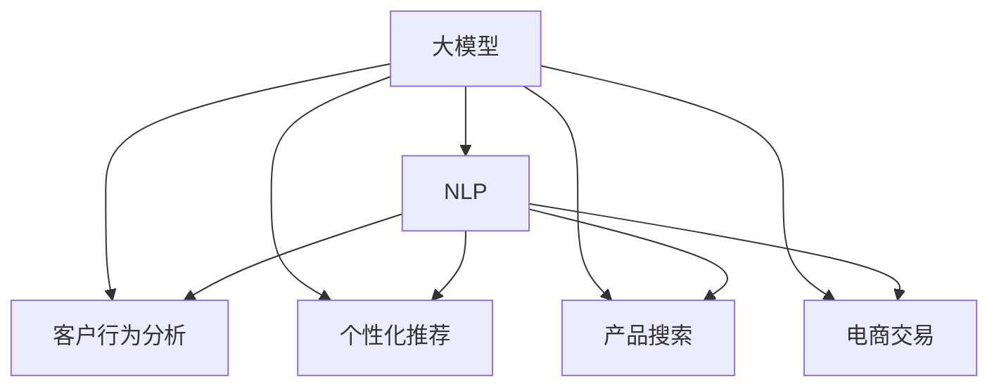

                 

# 电商平台中的AI大模型：从数据到决策

> 关键词：电商平台,人工智能,大模型,自然语言处理,NLP,客户行为分析,个性化推荐,产品搜索,电商交易

## 1. 背景介绍

### 1.1 问题由来
近年来，随着电商行业的迅速发展，消费者行为的多样化和复杂化，传统的电商平台数据处理和决策制定方式已难以满足现代电商的个性化需求。越来越多的电商平台开始引入人工智能技术，特别是大模型，以期提升用户体验、优化库存管理、提高交易转化率等。大模型如GPT-3、BERT等，具有强大的自然语言处理能力，能够从海量文本数据中提取有用信息，为电商平台的决策制定提供有力支撑。

然而，将大模型应用于电商平台并非易事。电商平台的数据往往来自多个渠道，且数据质量参差不齐，如何有效地利用这些数据进行模型训练和决策制定，是电商领域面临的重大挑战。本文将深入探讨大模型在电商平台中的应用，从数据预处理、模型训练到决策制定的全流程，以期为电商平台的智能化转型提供理论指导和实践建议。

### 1.2 问题核心关键点
电商平台引入大模型的关键点在于如何从海量数据中提取有用的信息，为电商平台的客户行为分析、个性化推荐、产品搜索、交易转化等业务场景提供支持。具体来说，需要解决以下问题：

1. **数据收集与预处理**：电商平台的数据来源广泛，如何有效地收集和预处理这些数据，以保证模型训练的质量。
2. **模型训练与优化**：如何将大模型应用于电商平台的各个业务场景，如何设计合适的模型架构和优化策略，以提升模型的性能。
3. **决策制定与反馈**：如何将模型输出的结果转化为实际的电商决策，如何对模型进行评估和反馈，以不断提升模型的准确性和实用性。

## 2. 核心概念与联系

### 2.1 核心概念概述

为更好地理解大模型在电商平台中的应用，本节将介绍几个密切相关的核心概念：

- **大模型(Large Model)**：以深度学习为代表的具有数亿或数十亿参数的大型模型，如GPT-3、BERT等。这些模型通常通过在大规模语料库上进行预训练，学习丰富的语言和知识表示。
- **自然语言处理(NLP)**：使用计算机处理和理解人类语言的技术，包括文本分类、情感分析、机器翻译、问答系统等。大模型在NLP领域的应用，可以提升模型的语言理解和生成能力。
- **客户行为分析(Customer Behavior Analysis)**：通过分析客户的历史行为数据，预测其未来的行为，以提升客户满意度和转化率。大模型可以学习复杂的客户行为模式，提供更加准确的预测。
- **个性化推荐(Personalized Recommendation)**：根据客户的个性化需求，提供定制化的商品推荐，提升用户购物体验。大模型可以通过学习用户的历史行为和偏好，进行精准推荐。
- **产品搜索(Product Search)**：提升电商平台的搜索效果，帮助用户快速找到需要的商品。大模型可以通过理解用户查询的语义，提供更相关的搜索结果。
- **电商交易(Online Shopping)**：利用大模型提升电商交易的转化率和用户体验，如自动化客服、自动结算、推荐系统等。

这些核心概念之间的逻辑关系可以通过以下Mermaid流程图来展示：



这个流程图展示了大模型在电商平台中的应用场景：

1. 大模型通过预训练获得基础的自然语言处理能力。
2. 通过NLP技术，应用于客户行为分析、个性化推荐、产品搜索、电商交易等多个业务场景。
3. 这些技术共同构建了电商平台的智能化决策系统。

## 3. 核心算法原理 & 具体操作步骤
### 3.1 算法原理概述

大模型在电商平台中的应用，通常依赖于其强大的自然语言处理能力。核心思想是：将大模型视作一种高效的特征提取器，通过从电商平台的大量文本数据中提取有用特征，进而提升电商平台的各个业务场景的决策效率和准确性。

具体来说，大模型的训练过程包括以下几个关键步骤：

1. **数据收集与预处理**：从电商平台的不同渠道收集相关的文本数据，如商品描述、用户评论、搜索记录等。对数据进行清洗、去噪、分词等预处理操作，确保数据质量。

2. **模型训练**：使用收集到的文本数据对大模型进行预训练，学习通用的语言表示。在此基础上，根据电商平台的特定需求，对大模型进行微调，使其能够更好地适应电商平台的业务场景。

3. **特征提取与决策制定**：将大模型输出的特征结果应用到电商平台的各个业务场景中，如客户行为分析、个性化推荐、产品搜索、电商交易等。通过这些特征，进行决策制定，提升电商平台的整体运营效率。

### 3.2 算法步骤详解

基于上述原理，大模型在电商平台中的应用主要包括以下几个关键步骤：

**Step 1: 数据收集与预处理**
- 从电商平台收集文本数据，包括商品描述、用户评论、搜索记录等。
- 对数据进行清洗，去除无关或低质量的文本。
- 对文本进行分词、去噪等预处理操作。
- 将处理后的文本数据划分为训练集、验证集和测试集。

**Step 2: 模型训练**
- 选择合适的预训练模型，如GPT-3、BERT等。
- 对大模型进行预训练，学习通用的语言表示。
- 在预训练的基础上，根据电商平台的特定需求，对大模型进行微调。
- 使用电商平台的标注数据，训练模型，优化模型参数。

**Step 3: 特征提取与决策制定**
- 将微调后的大模型应用于电商平台的各个业务场景，如客户行为分析、个性化推荐、产品搜索、电商交易等。
- 根据大模型的输出特征，进行决策制定，提升电商平台的运营效率和用户体验。
- 定期评估模型的性能，根据评估结果调整模型参数，进行持续优化。

### 3.3 算法优缺点

使用大模型在电商平台中的应用，具有以下优点：

1. **强大的自然语言处理能力**：大模型能够从海量文本数据中提取有用的信息，提升电商平台的决策制定能力。
2. **通用性和灵活性**：大模型可以应用于电商平台的各个业务场景，如客户行为分析、个性化推荐、产品搜索、电商交易等。
3. **可扩展性**：随着电商平台的规模扩大，可以通过扩展大模型的参数和计算资源，满足更多的业务需求。

同时，也存在一些缺点：

1. **高计算成本**：大模型的训练和微调需要大量的计算资源，对硬件设备要求较高。
2. **数据依赖性**：大模型的效果很大程度上依赖于电商平台的标注数据质量，标注成本较高。
3. **解释性不足**：大模型的决策过程通常缺乏可解释性，难以对其推理逻辑进行分析和调试。

尽管存在这些缺点，但大模型在电商平台中的应用前景仍然广阔，特别是在处理复杂自然语言任务和提升电商平台的智能化水平方面具有显著优势。

### 3.4 算法应用领域

大模型在电商平台中的应用，已经涵盖了多个业务场景，如：

- **客户行为分析**：通过分析用户的历史行为数据，预测其未来的行为，提升客户满意度和转化率。
- **个性化推荐**：根据客户的个性化需求，提供定制化的商品推荐，提升用户购物体验。
- **产品搜索**：提升电商平台的搜索效果，帮助用户快速找到需要的商品。
- **电商交易**：利用大模型提升电商交易的转化率和用户体验，如自动化客服、自动结算、推荐系统等。

此外，大模型还被创新性地应用于数据增强、对抗训练等技术，以提升模型的鲁棒性和泛化能力。随着大模型和微调技术的不断发展，其应用场景还将进一步拓展。

## 4. 数学模型和公式 & 详细讲解 & 举例说明
### 4.1 数学模型构建

为更好地理解大模型在电商平台中的应用，我们将使用数学语言对相关模型进行详细的推导和讲解。

假设电商平台收集到的文本数据为 $D=\{x_i\}_{i=1}^N$，其中 $x_i$ 为第 $i$ 条文本。我们使用大模型 $M_{\theta}$ 对其进行训练，其中 $\theta$ 为大模型的参数。大模型在输入 $x_i$ 上的输出为 $y_i=M_{\theta}(x_i)$。

我们的目标是通过大模型的预训练和微调，学习到电商平台相关的语言表示，以便应用于客户行为分析、个性化推荐、产品搜索、电商交易等业务场景。

### 4.2 公式推导过程

假设电商平台的任务为文本分类，即根据文本内容判断其所属的类别。我们定义模型 $M_{\theta}$ 在输入 $x_i$ 上的输出为 $\hat{y}_i=M_{\theta}(x_i)$，其中 $\hat{y}_i \in [0,1]$ 表示样本属于正类的概率。

定义模型 $M_{\theta}$ 在数据样本 $(x_i,y_i)$ 上的损失函数为 $\ell(M_{\theta}(x_i),y_i)$，则在数据集 $D$ 上的经验风险为：

$$
\mathcal{L}(\theta) = \frac{1}{N} \sum_{i=1}^N \ell(M_{\theta}(x_i),y_i)
$$

在实践中，我们通常使用基于梯度的优化算法（如SGD、Adam等）来近似求解上述最优化问题。设 $\eta$ 为学习率，$\lambda$ 为正则化系数，则参数的更新公式为：

$$
\theta \leftarrow \theta - \eta \nabla_{\theta}\mathcal{L}(\theta) - \eta\lambda\theta
$$

其中 $\nabla_{\theta}\mathcal{L}(\theta)$ 为损失函数对参数 $\theta$ 的梯度，可通过反向传播算法高效计算。

### 4.3 案例分析与讲解

以客户行为分析为例，我们假设电商平台希望通过分析用户的历史行为数据，预测其未来的购买意向。我们收集用户的历史浏览、点击、购买等行为数据，将其作为训练样本 $(x,y)$，其中 $x$ 为用户的浏览历史，$y$ 为用户的购买意向（0表示不购买，1表示购买）。

我们将这些数据输入大模型 $M_{\theta}$ 进行训练，目标是最小化损失函数 $\ell$。通过不断的迭代优化，模型逐渐学习到用户行为与购买意向之间的关系，并输出预测结果 $\hat{y}$。

在实际应用中，我们需要对模型的输出进行评估，计算模型在验证集和测试集上的准确率、召回率、F1值等指标。如果模型性能不达标，我们需要调整模型参数，重新训练，以提升模型的预测准确性。

## 5. 项目实践：代码实例和详细解释说明
### 5.1 开发环境搭建

在进行大模型在电商平台中的应用实践前，我们需要准备好开发环境。以下是使用Python进行PyTorch开发的环境配置流程：

1. 安装Anaconda：从官网下载并安装Anaconda，用于创建独立的Python环境。

2. 创建并激活虚拟环境：
```bash
conda create -n pytorch-env python=3.8 
conda activate pytorch-env
```

3. 安装PyTorch：根据CUDA版本，从官网获取对应的安装命令。例如：
```bash
conda install pytorch torchvision torchaudio cudatoolkit=11.1 -c pytorch -c conda-forge
```

4. 安装Transformers库：
```bash
pip install transformers
```

5. 安装各类工具包：
```bash
pip install numpy pandas scikit-learn matplotlib tqdm jupyter notebook ipython
```

完成上述步骤后，即可在`pytorch-env`环境中开始大模型的应用实践。

### 5.2 源代码详细实现

下面我们以个性化推荐系统为例，给出使用Transformers库对BERT模型进行训练的PyTorch代码实现。

首先，定义推荐系统的数据处理函数：

```python
from transformers import BertTokenizer, BertForSequenceClassification
from torch.utils.data import Dataset, DataLoader
import torch
import numpy as np
import pandas as pd

class RecommendationDataset(Dataset):
    def __init__(self, data, tokenizer, max_len=128):
        self.data = data
        self.tokenizer = tokenizer
        self.max_len = max_len
        
    def __len__(self):
        return len(self.data)
    
    def __getitem__(self, item):
        text = self.data.iloc[item]['text']
        label = self.data.iloc[item]['label']
        
        encoding = self.tokenizer(text, return_tensors='pt', max_length=self.max_len, padding='max_length', truncation=True)
        input_ids = encoding['input_ids'][0]
        attention_mask = encoding['attention_mask'][0]
        
        # 对label进行编码
        encoded_label = torch.tensor([label], dtype=torch.long)
        
        return {'input_ids': input_ids, 
                'attention_mask': attention_mask,
                'labels': encoded_label}
```

然后，定义模型和优化器：

```python
from transformers import AdamW

model = BertForSequenceClassification.from_pretrained('bert-base-uncased', num_labels=2)

optimizer = AdamW(model.parameters(), lr=2e-5)
```

接着，定义训练和评估函数：

```python
from tqdm import tqdm
from sklearn.metrics import accuracy_score, precision_recall_fscore_support

device = torch.device('cuda') if torch.cuda.is_available() else torch.device('cpu')
model.to(device)

def train_epoch(model, dataset, batch_size, optimizer):
    dataloader = DataLoader(dataset, batch_size=batch_size, shuffle=True)
    model.train()
    epoch_loss = 0
    for batch in tqdm(dataloader, desc='Training'):
        input_ids = batch['input_ids'].to(device)
        attention_mask = batch['attention_mask'].to(device)
        labels = batch['labels'].to(device)
        model.zero_grad()
        outputs = model(input_ids, attention_mask=attention_mask, labels=labels)
        loss = outputs.loss
        epoch_loss += loss.item()
        loss.backward()
        optimizer.step()
    return epoch_loss / len(dataloader)

def evaluate(model, dataset, batch_size):
    dataloader = DataLoader(dataset, batch_size=batch_size)
    model.eval()
    preds, labels = [], []
    with torch.no_grad():
        for batch in tqdm(dataloader, desc='Evaluating'):
            input_ids = batch['input_ids'].to(device)
            attention_mask = batch['attention_mask'].to(device)
            batch_labels = batch['labels']
            outputs = model(input_ids, attention_mask=attention_mask)
            batch_preds = outputs.logits.argmax(dim=2).to('cpu').tolist()
            batch_labels = batch_labels.to('cpu').tolist()
            for pred, label in zip(batch_preds, batch_labels):
                preds.append(pred)
                labels.append(label)
                
    print('Accuracy:', accuracy_score(labels, preds))
```

最后，启动训练流程并在测试集上评估：

```python
epochs = 5
batch_size = 16

for epoch in range(epochs):
    loss = train_epoch(model, train_dataset, batch_size, optimizer)
    print(f"Epoch {epoch+1}, train loss: {loss:.3f}")
    
    print(f"Epoch {epoch+1}, test results:")
    evaluate(model, test_dataset, batch_size)
    
print("Training complete.")
```

以上就是使用PyTorch对BERT模型进行个性化推荐系统训练的完整代码实现。可以看到，得益于Transformers库的强大封装，我们可以用相对简洁的代码完成BERT模型的加载和训练。

### 5.3 代码解读与分析

让我们再详细解读一下关键代码的实现细节：

**RecommendationDataset类**：
- `__init__`方法：初始化数据、分词器等关键组件。
- `__len__`方法：返回数据集的样本数量。
- `__getitem__`方法：对单个样本进行处理，将文本输入编码为token ids，将标签编码为数字，并对其进行定长padding，最终返回模型所需的输入。

**标签与id的映射**：
- 定义了标签与数字id之间的映射关系，用于将token-wise的预测结果解码回真实的标签。

**训练和评估函数**：
- 使用PyTorch的DataLoader对数据集进行批次化加载，供模型训练和推理使用。
- 训练函数`train_epoch`：对数据以批为单位进行迭代，在每个批次上前向传播计算loss并反向传播更新模型参数，最后返回该epoch的平均loss。
- 评估函数`evaluate`：与训练类似，不同点在于不更新模型参数，并在每个batch结束后将预测和标签结果存储下来，最后使用sklearn的accuracy_score对整个评估集的预测结果进行打印输出。

**训练流程**：
- 定义总的epoch数和batch size，开始循环迭代
- 每个epoch内，先在训练集上训练，输出平均loss
- 在测试集上评估，输出准确率
- 所有epoch结束后，输出训练完成信息

可以看到，PyTorch配合Transformers库使得BERT模型训练的代码实现变得简洁高效。开发者可以将更多精力放在数据处理、模型改进等高层逻辑上，而不必过多关注底层的实现细节。

当然，工业级的系统实现还需考虑更多因素，如模型的保存和部署、超参数的自动搜索、更灵活的任务适配层等。但核心的微调范式基本与此类似。

## 6. 实际应用场景
### 6.1 智能客服系统

基于大模型的推荐系统，可以广泛应用于智能客服系统的构建。传统客服往往需要配备大量人力，高峰期响应缓慢，且一致性和专业性难以保证。而使用推荐系统的推荐结果，可以快速响应客户咨询，用自然流畅的语言解答各类常见问题。

在技术实现上，可以收集企业内部的历史客服对话记录，将问题和最佳答复构建成监督数据，在此基础上对预训练模型进行微调。微调后的模型能够自动理解用户意图，匹配最合适的答复模板进行回复。对于客户提出的新问题，还可以接入检索系统实时搜索相关内容，动态组织生成回答。如此构建的智能客服系统，能大幅提升客户咨询体验和问题解决效率。

### 6.2 个性化推荐系统

当前的推荐系统往往只依赖用户的历史行为数据进行物品推荐，无法深入理解用户的真实兴趣偏好。基于大模型的推荐系统可以更好地挖掘用户行为背后的语义信息，从而提供更加精准、多样的推荐内容。

在实践中，可以收集用户浏览、点击、评论、分享等行为数据，提取和用户交互的物品标题、描述、标签等文本内容。将文本内容作为模型输入，用户的后续行为（如是否点击、购买等）作为监督信号，在此基础上微调预训练语言模型。微调后的模型能够从文本内容中准确把握用户的兴趣点。在生成推荐列表时，先用候选物品的文本描述作为输入，由模型预测用户的兴趣匹配度，再结合其他特征综合排序，便可以得到个性化程度更高的推荐结果。

### 6.3 数据增强与对抗训练

大模型在电商平台中的应用，不仅限于直接应用。还可以结合数据增强和对抗训练等技术，进一步提升模型的性能。

数据增强技术可以扩充训练集的规模和多样性，减少模型对原始数据集的依赖。例如，通过回译、近义替换等方式生成更多样化的训练样本，提升模型的泛化能力。

对抗训练技术可以增强模型的鲁棒性，使其在面对噪声、扰动等情况下仍能保持稳定输出。例如，在训练过程中加入对抗样本，让模型学习如何识别和应对这些扰动，提高模型的鲁棒性和泛化能力。

### 6.4 未来应用展望

随着大模型和微调方法的不断发展，基于大模型的方法将在更多领域得到应用，为传统行业带来变革性影响。

在智慧医疗领域，基于大模型的推荐系统可以推荐个性化的诊疗方案，辅助医生诊疗，加速新药开发进程。

在智能教育领域，推荐系统可以推荐个性化的学习材料和课程，因材施教，促进教育公平，提高教学质量。

在智慧城市治理中，推荐系统可以推荐个性化的城市服务和活动，提高城市管理的自动化和智能化水平，构建更安全、高效的未来城市。

此外，在企业生产、社会治理、文娱传媒等众多领域，基于大模型的推荐系统也将不断涌现，为各行各业带来新的技术路径。相信随着技术的日益成熟，推荐系统必将在更广阔的应用领域大放异彩。

## 7. 工具和资源推荐
### 7.1 学习资源推荐

为了帮助开发者系统掌握大模型在电商平台中的应用，这里推荐一些优质的学习资源：

1. 《深度学习与自然语言处理》书籍：该书详细介绍了深度学习在自然语言处理中的应用，包括大模型的训练和微调等技术。

2. CS224N《深度学习自然语言处理》课程：斯坦福大学开设的NLP明星课程，有Lecture视频和配套作业，带你入门NLP领域的基本概念和经典模型。

3. 《Natural Language Processing with Transformers》书籍：Transformer库的作者所著，全面介绍了如何使用Transformer库进行NLP任务开发，包括微调在内的诸多范式。

4. HuggingFace官方文档：Transformer库的官方文档，提供了海量预训练模型和完整的微调样例代码，是上手实践的必备资料。

5. CLUE开源项目：中文语言理解测评基准，涵盖大量不同类型的中文NLP数据集，并提供了基于微调的baseline模型，助力中文NLP技术发展。

通过对这些资源的学习实践，相信你一定能够快速掌握大模型在电商平台中的应用，并用于解决实际的NLP问题。
###  7.2 开发工具推荐

高效的开发离不开优秀的工具支持。以下是几款用于大模型在电商平台中的应用开发的常用工具：

1. PyTorch：基于Python的开源深度学习框架，灵活动态的计算图，适合快速迭代研究。大部分预训练语言模型都有PyTorch版本的实现。

2. TensorFlow：由Google主导开发的开源深度学习框架，生产部署方便，适合大规模工程应用。同样有丰富的预训练语言模型资源。

3. Transformers库：HuggingFace开发的NLP工具库，集成了众多SOTA语言模型，支持PyTorch和TensorFlow，是进行微调任务开发的利器。

4. Weights & Biases：模型训练的实验跟踪工具，可以记录和可视化模型训练过程中的各项指标，方便对比和调优。与主流深度学习框架无缝集成。

5. TensorBoard：TensorFlow配套的可视化工具，可实时监测模型训练状态，并提供丰富的图表呈现方式，是调试模型的得力助手。

6. Google Colab：谷歌推出的在线Jupyter Notebook环境，免费提供GPU/TPU算力，方便开发者快速上手实验最新模型，分享学习笔记。

合理利用这些工具，可以显著提升大模型在电商平台中的应用开发效率，加快创新迭代的步伐。

### 7.3 相关论文推荐

大模型在电商平台中的应用源于学界的持续研究。以下是几篇奠基性的相关论文，推荐阅读：

1. Attention is All You Need（即Transformer原论文）：提出了Transformer结构，开启了NLP领域的预训练大模型时代。

2. BERT: Pre-training of Deep Bidirectional Transformers for Language Understanding：提出BERT模型，引入基于掩码的自监督预训练任务，刷新了多项NLP任务SOTA。

3. Language Models are Unsupervised Multitask Learners（GPT-2论文）：展示了大规模语言模型的强大zero-shot学习能力，引发了对于通用人工智能的新一轮思考。

4. Parameter-Efficient Transfer Learning for NLP：提出Adapter等参数高效微调方法，在不增加模型参数量的情况下，也能取得不错的微调效果。

5. Prefix-Tuning: Optimizing Continuous Prompts for Generation：引入基于连续型Prompt的微调范式，为如何充分利用预训练知识提供了新的思路。

6. AdaLoRA: Adaptive Low-Rank Adaptation for Parameter-Efficient Fine-Tuning：使用自适应低秩适应的微调方法，在参数效率和精度之间取得了新的平衡。

这些论文代表了大模型在电商平台中的应用发展脉络。通过学习这些前沿成果，可以帮助研究者把握学科前进方向，激发更多的创新灵感。

## 8. 总结：未来发展趋势与挑战
### 8.1 总结

本文对大模型在电商平台中的应用进行了全面系统的介绍。首先阐述了电商平台引入大模型的背景和意义，明确了大模型在客户行为分析、个性化推荐、产品搜索、电商交易等业务场景中的重要价值。其次，从数据预处理、模型训练到决策制定的全流程，详细讲解了大模型的应用实践。同时，本文还广泛探讨了大模型在电商领域的实际应用场景，展示了其广阔的应用前景。最后，本文精选了相关学习资源和工具，力求为电商平台的智能化转型提供全方位的技术指引。

通过本文的系统梳理，可以看到，大模型在电商平台中的应用前景广阔，但在实际部署过程中，仍然面临诸如计算成本、数据质量、模型鲁棒性、模型可解释性等多重挑战。如何有效应对这些挑战，将是大模型在电商平台中大规模落地的关键。

### 8.2 未来发展趋势

展望未来，大模型在电商平台中的应用将呈现以下几个发展趋势：

1. **模型规模持续增大**：随着算力成本的下降和数据规模的扩张，预训练语言模型的参数量还将持续增长。超大规模语言模型蕴含的丰富语言知识，有望支撑更加复杂多变的电商业务场景。

2. **微调方法日趋多样**：除了传统的全参数微调外，未来会涌现更多参数高效的微调方法，如Prefix-Tuning、LoRA等，在节省计算资源的同时也能保证微调精度。

3. **持续学习成为常态**：随着数据分布的不断变化，微调模型也需要持续学习新知识以保持性能。如何在不遗忘原有知识的同时，高效吸收新样本信息，将成为重要的研究课题。

4. **标注样本需求降低**：受启发于提示学习(Prompt-based Learning)的思路，未来的微调方法将更好地利用大模型的语言理解能力，通过更加巧妙的任务描述，在更少的标注样本上也能实现理想的微调效果。

5. **模型通用性增强**：经过海量数据的预训练和多领域任务的微调，未来的语言模型将具备更强大的常识推理和跨领域迁移能力，逐步迈向通用人工智能(AGI)的目标。

6. **多模态微调崛起**：当前的微调主要聚焦于纯文本数据，未来会进一步拓展到图像、视频、语音等多模态数据微调。多模态信息的融合，将显著提升语言模型对现实世界的理解和建模能力。

以上趋势凸显了大模型在电商平台中的应用前景。这些方向的探索发展，必将进一步提升电商平台的智能化水平，为用户带来更好的购物体验。

### 8.3 面临的挑战

尽管大模型在电商平台中的应用前景广阔，但在迈向更加智能化、普适化应用的过程中，它仍面临着诸多挑战：

1. **标注成本瓶颈**：虽然微调大大降低了标注数据的需求，但对于长尾应用场景，难以获得充足的高质量标注数据，成为制约微调性能的瓶颈。如何进一步降低微调对标注样本的依赖，将是一大难题。

2. **模型鲁棒性不足**：当前微调模型面对域外数据时，泛化性能往往大打折扣。对于测试样本的微小扰动，微调模型的预测也容易发生波动。如何提高微调模型的鲁棒性，避免灾难性遗忘，还需要更多理论和实践的积累。

3. **推理效率有待提高**：大规模语言模型虽然精度高，但在实际部署时往往面临推理速度慢、内存占用大等效率问题。如何在保证性能的同时，简化模型结构，提升推理速度，优化资源占用，将是重要的优化方向。

4. **可解释性亟需加强**：当前微调模型更像是"黑盒"系统，难以解释其内部工作机制和决策逻辑。对于医疗、金融等高风险应用，算法的可解释性和可审计性尤为重要。如何赋予微调模型更强的可解释性，将是亟待攻克的难题。

5. **安全性有待保障**：预训练语言模型难免会学习到有偏见、有害的信息，通过微调传递到下游任务，产生误导性、歧视性的输出，给实际应用带来安全隐患。如何从数据和算法层面消除模型偏见，避免恶意用途，确保输出的安全性，也将是重要的研究课题。

6. **知识整合能力不足**：现有的微调模型往往局限于任务内数据，难以灵活吸收和运用更广泛的先验知识。如何让微调过程更好地与外部知识库、规则库等专家知识结合，形成更加全面、准确的信息整合能力，还有很大的想象空间。

正视大模型在电商平台中的应用面临的这些挑战，积极应对并寻求突破，将是大模型在电商平台中大规模落地的关键。相信随着学界和产业界的共同努力，这些挑战终将一一被克服，大模型在电商平台中必将在构建智能化电商系统方面发挥重要作用。

### 8.4 研究展望

面向未来，大模型在电商平台中的应用还需要与其他人工智能技术进行更深入的融合，如知识表示、因果推理、强化学习等，多路径协同发力，共同推动自然语言理解和智能交互系统的进步。只有勇于创新、敢于突破，才能不断拓展语言模型的边界，让智能技术更好地造福人类社会。

总之，大模型在电商平台中的应用前景广阔，但如何将强大的性能转化为稳定、高效、安全的业务价值，还需要工程实践的不断打磨。唯有从数据、算法、工程、业务等多个维度协同发力，才能真正实现人工智能技术在垂直行业的规模化落地。希望本文能够为电商平台的智能化转型提供有价值的参考，助力其迈向更加智能的未来。

## 9. 附录：常见问题与解答

**Q1：大模型在电商平台中的应用是否适用于所有业务场景？**

A: 大模型在电商平台中的应用适用于大部分业务场景，如客户行为分析、个性化推荐、产品搜索、电商交易等。但对于一些特定领域的业务场景，如医疗、法律等，仅仅依靠通用语料预训练的模型可能难以很好地适应。此时需要在特定领域语料上进一步预训练，再进行微调，才能获得理想效果。

**Q2：如何选择合适的学习率？**

A: 大模型在电商平台中的应用，通常需要选择合适的学习率。学习率的大小直接影响模型的训练效果。一般来说，大模型的学习率比预训练时要小1-2个数量级，以保证模型参数的稳定性。建议使用warmup策略，在开始阶段使用较小的学习率，再逐渐过渡到预设值。

**Q3：大模型在电商平台中的推理效率如何提升？**

A: 提升大模型在电商平台中的推理效率，可以采用以下策略：
1. 模型裁剪：去除不必要的层和参数，减小模型尺寸，加快推理速度。
2. 量化加速：将浮点模型转为定点模型，压缩存储空间，提高计算效率。
3. 服务化封装：将模型封装为标准化服务接口，便于集成调用。
4. 弹性伸缩：根据请求流量动态调整资源配置，平衡服务质量和成本。
5. 监控告警：实时采集系统指标，设置异常告警阈值，确保服务稳定性。

**Q4：如何应对大模型在电商平台中的可解释性不足问题？**

A: 提升大模型在电商平台中的可解释性，可以采用以下策略：
1. 使用可解释性强的模型架构，如决策树、线性回归等。
2. 引入可解释性模型技术，如LIME、SHAP等，对模型输出进行解释。
3. 对模型输出进行特征解释，提供用户友好的解释界面。

**Q5：如何确保大模型在电商平台中的安全性？**

A: 确保大模型在电商平台中的安全性，可以采用以下策略：
1. 数据清洗：对输入数据进行严格清洗，去除恶意样本和噪声数据。
2. 模型加固：对模型进行加固，防止恶意样本的攻击。
3. 安全监控：实时监控模型输出，及时发现异常情况。
4. 用户验证：对用户身份进行验证，防止非法访问。

---

作者：禅与计算机程序设计艺术 / Zen and the Art of Computer Programming

