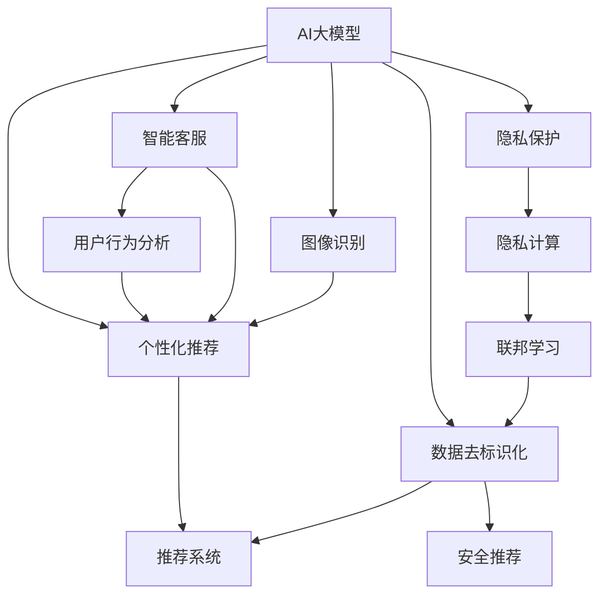
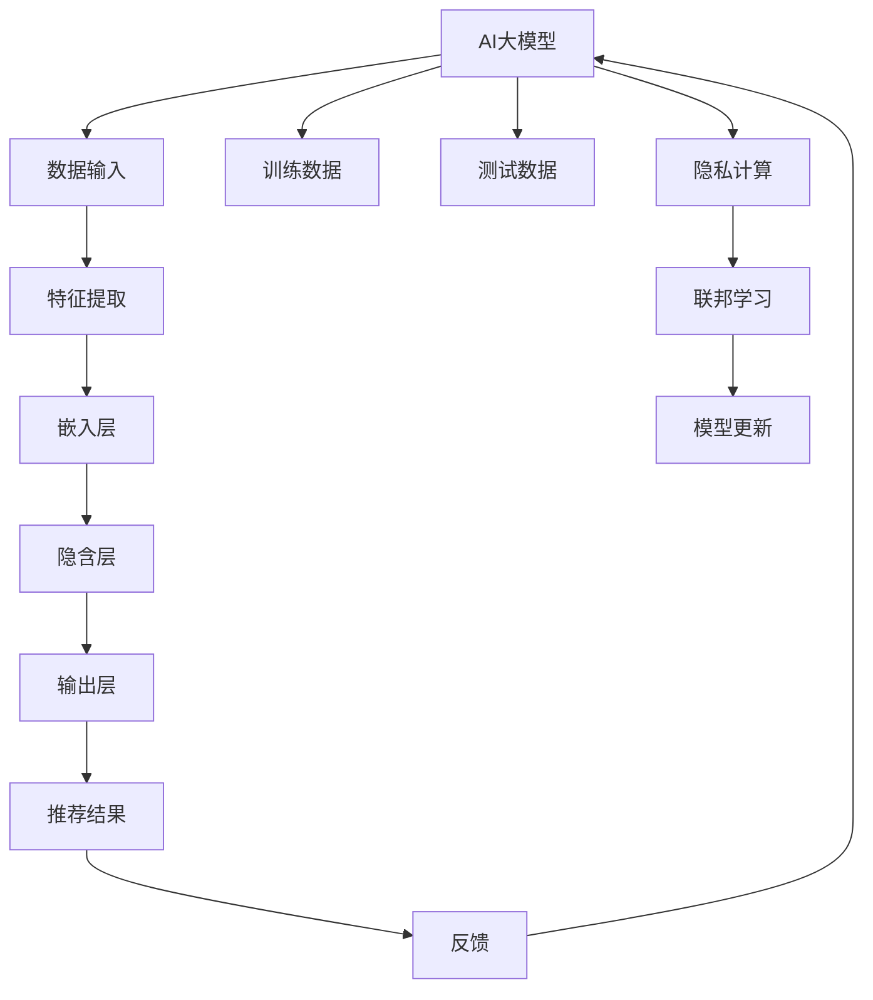

                 

# 电商平台中的AI大模型：隐私保护与个性化的平衡

> 关键词：AI大模型,电商平台,隐私保护,个性化,深度学习,神经网络,推荐系统,隐私计算,伦理

## 1. 背景介绍

### 1.1 问题由来
在当今数字化时代的背景下，电商平台已成为消费者购物、企业营销的重要渠道。随着技术的不断进步，AI大模型在电商平台的个性化推荐、智能客服、图像识别等场景中得到了广泛应用。然而，随着AI技术的发展，如何平衡个性化服务与隐私保护成为电商平台面对的一个重要挑战。

一方面，个性化推荐和智能客服能够显著提升用户体验，提高销售额。AI模型通过分析用户行为数据，提供定制化服务，使电商平台的运营效率和客户满意度得到提升。但另一方面，这些数据往往包含大量敏感信息，如购买记录、浏览历史、位置信息等，一旦泄露，可能给用户带来隐私风险。

如何既保障用户隐私安全，又提供精准的个性化服务，是当前电商平台在AI应用中需要解决的关键问题。本文将详细探讨这一问题，并提出一些解决方案。

### 1.2 问题核心关键点
本节将梳理核心概念，并揭示它们之间的联系，帮助读者理解AI大模型在电商平台中的应用与隐私保护的关系。

- **AI大模型**：基于深度学习的大型神经网络模型，能够通过大规模数据训练，提供高性能的推荐、识别、分类等功能。
- **个性化**：根据用户的历史行为和属性，推荐符合其需求的商品和服务，提升用户体验。
- **隐私保护**：在数据收集和处理过程中，确保用户隐私不受侵犯，保护用户个人信息不被泄露。
- **推荐系统**：利用用户历史行为数据，预测其未来行为，进行商品推荐。
- **隐私计算**：在不泄露原始数据的情况下，通过加密、联邦学习等技术，保护用户隐私，同时进行模型训练和数据分析。

这些概念之间的联系可以通过以下Mermaid流程图来展示：



这个流程图展示了大模型与电商平台中的个性化、隐私保护等核心概念的关系：

1. AI大模型提供推荐、客服和图像识别等功能。
2. 个性化推荐系统根据用户历史行为进行分析，提供定制化服务。
3. 隐私保护涉及数据去标识化、隐私计算等技术，保护用户隐私。
4. 隐私计算与联邦学习结合，在保护隐私的前提下进行模型训练。
5. 安全推荐确保在推荐过程中不会泄露用户敏感信息。

## 2. 核心概念与联系

### 2.1 核心概念概述

为了更好地理解如何平衡电商平台中的AI大模型个性化与隐私保护，本节将详细介绍几个关键概念，并揭示它们之间的联系。

- **AI大模型**：深度学习模型的一种，通常基于神经网络，能够从大量数据中学习到复杂的关系和模式。常见的模型包括BERT、GPT等。
- **个性化推荐**：通过分析用户的历史行为和属性，预测其偏好，推荐符合其需求的商品和服务。
- **隐私保护**：在数据处理和分析过程中，确保用户数据不被泄露或滥用。
- **隐私计算**：在不泄露原始数据的情况下，进行数据计算和分析。包括差分隐私、同态加密、多方安全计算等技术。
- **联邦学习**：在分布式环境下，多个设备或服务器共同参与模型训练，数据在本地进行训练，不共享原始数据。

### 2.2 核心概念原理和架构的 Mermaid 流程图



这个流程图展示了AI大模型的基本架构和训练过程：

1. AI大模型从数据输入开始，对输入数据进行特征提取。
2. 提取的特征经过嵌入层和隐含层，最终通过输出层生成推荐结果。
3. 训练数据用于模型训练，测试数据用于模型评估。
4. 推荐结果通过反馈机制，更新模型参数。
5. 隐私计算和联邦学习在模型训练中，确保用户数据的安全。

## 3. 核心算法原理 & 具体操作步骤

### 3.1 算法原理概述

在电商平台中，AI大模型通常用于个性化推荐、智能客服、图像识别等场景。这些应用中，数据隐私和用户信息安全成为重要考虑因素。因此，如何在使用AI大模型时，平衡个性化推荐和隐私保护成为关键问题。

### 3.2 算法步骤详解

为了解决上述问题，本文将详细介绍基于隐私保护的个性化推荐算法步骤：

**Step 1: 数据收集与预处理**

- 收集用户历史行为数据，如浏览记录、购买记录、评分记录等。
- 对数据进行去标识化处理，去除敏感信息。
- 对去标识化后的数据进行特征提取，生成模型输入。

**Step 2: 模型训练与优化**

- 使用联邦学习技术，在多个设备或服务器上并行训练模型，避免数据泄露。
- 采用差分隐私技术，在训练过程中引入噪声，保护用户隐私。
- 使用梯度下降等优化算法，更新模型参数。

**Step 3: 推荐生成与反馈**

- 根据训练好的模型，生成个性化推荐结果。
- 对推荐结果进行反馈，更新模型参数。

**Step 4: 隐私保护与数据安全**

- 在推荐系统中，采用同态加密技术，保护用户数据不被泄露。
- 定期进行数据安全审计，发现和修复潜在的安全漏洞。

### 3.3 算法优缺点

基于隐私保护的个性化推荐算法具有以下优点：

- 提升了推荐系统的个性化程度，提高了用户体验。
- 保护了用户隐私，避免了数据泄露风险。
- 通过联邦学习等技术，减少了对中央服务器的依赖，提高了系统的可扩展性。

但该算法也存在一些缺点：

- 算法复杂度较高，需要处理大量的隐私保护技术。
- 推荐精度可能受到隐私保护措施的影响。
- 在联邦学习中，需要协调多个设备或服务器，增加了系统复杂性。

### 3.4 算法应用领域

基于隐私保护的个性化推荐算法在电商平台中的应用广泛，例如：

- **个性化推荐系统**：根据用户历史行为和属性，推荐符合其需求的商品和服务。
- **智能客服**：通过分析用户查询，提供定制化服务，解决用户问题。
- **图像识别**：对用户上传的图片进行分类和标注，提供相关商品推荐。
- **用户行为分析**：通过分析用户数据，进行市场分析，优化产品推荐策略。

## 4. 数学模型和公式 & 详细讲解 & 举例说明

### 4.1 数学模型构建

本节将详细构建基于隐私保护的个性化推荐数学模型。

假设电商平台中，有 $N$ 个用户，每个用户的历史行为数据为 $x_i$，其中 $i=1,\ldots,N$。对于每个用户 $i$，我们希望推荐一个物品 $y_i$，使得用户满意度最大化。

**推荐函数**：

$$ f_i(x_i; \theta) = \sum_{j=1}^J w_j \exp\left(\langle a_j, x_i \rangle\right) $$

其中 $w_j$ 是权重向量，$a_j$ 是物品 $j$ 的特征向量，$\langle \cdot, \cdot \rangle$ 是内积运算。

**目标函数**：

$$ \max_{\theta} \sum_{i=1}^N f_i(x_i; \theta) $$

### 4.2 公式推导过程

为了保护用户隐私，我们引入差分隐私技术。假设我们希望在隐私保护下，推荐函数 $f_i(x_i; \theta)$ 的最大化问题。引入噪声 $\epsilon_i$，得到：

$$ \max_{\theta} \sum_{i=1}^N \left( f_i(x_i; \theta) + \epsilon_i \right) $$

其中 $\epsilon_i \sim \mathcal{N}(0, \sigma^2)$，表示噪声分布。

为了保证差分隐私，需要满足 $(\epsilon, \delta)$ 差分隐私条件：

$$ \max_{x' \in \mathcal{X}} \left| P_\theta(x') - P_\theta(x) \right| \leq \frac{\epsilon}{2} + \sqrt{\frac{\delta}{2\epsilon}} $$

其中 $P_\theta(x)$ 是模型在输入 $x$ 下的概率分布。

### 4.3 案例分析与讲解

以电商平台中的用户行为数据为例，假设每个用户的历史行为数据为 $x_i = [b_i, c_i, d_i]$，其中 $b_i$ 表示浏览行为，$c_i$ 表示购买行为，$d_i$ 表示评分行为。

我们需要推荐一个物品 $y_j$，使得用户满意度最大化。根据推荐函数，我们得到：

$$ f_i(x_i; \theta) = w_1 \exp\left(\langle a_{b_i}, x_i \rangle\right) + w_2 \exp\left(\langle a_{c_i}, x_i \rangle\right) + w_3 \exp\left(\langle a_{d_i}, x_i \rangle\right) $$

在隐私保护下，目标函数变为：

$$ \max_{\theta} \sum_{i=1}^N \left( f_i(x_i; \theta) + \epsilon_i \right) $$

其中 $\epsilon_i \sim \mathcal{N}(0, \sigma^2)$。

为了保证差分隐私，我们需要在模型训练过程中引入噪声，确保模型输出不受原始数据的直接影响。

## 5. 项目实践：代码实例和详细解释说明

### 5.1 开发环境搭建

在进行隐私保护个性化推荐项目实践前，需要准备好开发环境。以下是使用Python进行PyTorch开发的环境配置流程：

1. 安装Anaconda：从官网下载并安装Anaconda，用于创建独立的Python环境。

2. 创建并激活虚拟环境：
```bash
conda create -n privacy-env python=3.8 
conda activate privacy-env
```

3. 安装PyTorch：根据CUDA版本，从官网获取对应的安装命令。例如：
```bash
conda install pytorch torchvision torchaudio cudatoolkit=11.1 -c pytorch -c conda-forge
```

4. 安装Transformers库：
```bash
pip install transformers
```

5. 安装各类工具包：
```bash
pip install numpy pandas scikit-learn matplotlib tqdm jupyter notebook ipython
```

完成上述步骤后，即可在`privacy-env`环境中开始项目实践。

### 5.2 源代码详细实现

这里我们以电商平台中的个性化推荐系统为例，给出使用Transformers库进行隐私保护个性化推荐的PyTorch代码实现。

首先，定义推荐模型的结构：

```python
from transformers import BertForSequenceClassification, BertTokenizer
from transformers import DataCollatorWithPadding, Trainer
from transformers import AdamW
from torch.utils.data import Dataset
import torch

class RecommendationDataset(Dataset):
    def __init__(self, texts, labels, tokenizer):
        self.texts = texts
        self.labels = labels
        self.tokenizer = tokenizer
        
    def __len__(self):
        return len(self.texts)
    
    def __getitem__(self, item):
        text = self.texts[item]
        label = self.labels[item]
        
        encoding = self.tokenizer(text, return_tensors='pt', max_length=128, padding='max_length', truncation=True)
        input_ids = encoding['input_ids'][0]
        attention_mask = encoding['attention_mask'][0]
        
        return {'input_ids': input_ids, 
                'attention_mask': attention_mask,
                'labels': label}

# 定义模型和优化器
model = BertForSequenceClassification.from_pretrained('bert-base-cased', num_labels=2)
optimizer = AdamW(model.parameters(), lr=2e-5)

# 定义数据加载器
data_loader = DataLoader(RecommendationDataset(train_texts, train_labels, tokenizer), batch_size=16, shuffle=True)
```

然后，定义隐私保护推荐模型的训练函数：

```python
from transformers import Trainer
from transformers import DataCollatorWithPadding
from transformers import AdamW
from transformers import PreTrainedTokenizerFast
from transformers import PreTrainedModel

def privacy_train(train_loader, model, optimizer):
    device = torch.device('cuda') if torch.cuda.is_available() else torch.device('cpu')
    model.to(device)
    
    def compute_loss(labels, preds):
        return torch.mean(torch.abs(preds - labels))
    
    trainer = Trainer(model=model,
                     train_dataset=train_loader.dataset,
                     data_collator=DataCollatorWithPadding(tokenizer=tokenizer),
                     optimizer=optimizer,
                     train_dataloaders=train_loader,
                     compute_loss=compute_loss,
                     logging_dir='./logs',
                     logging_steps=100,
                     max_steps=10000)
    
    trainer.train()
    
    return model

# 训练推荐模型
train_texts = ...
train_labels = ...
tokenizer = BertTokenizer.from_pretrained('bert-base-cased')
model = privacy_train(train_loader, model, optimizer)
```

接下来，定义推荐系统中的隐私保护技术：

```python
from torch.nn.utils.clip_grad_norm_ import clip_grad_norm_
from torch.nn.utils.clip_grad_value_ import clip_grad_value_

def privacy_train(train_loader, model, optimizer):
    device = torch.device('cuda') if torch.cuda.is_available() else torch.device('cpu')
    model.to(device)
    
    def compute_loss(labels, preds):
        return torch.mean(torch.abs(preds - labels))
    
    trainer = Trainer(model=model,
                     train_dataset=train_loader.dataset,
                     data_collator=DataCollatorWithPadding(tokenizer=tokenizer),
                     optimizer=optimizer,
                     train_dataloaders=train_loader,
                     compute_loss=compute_loss,
                     logging_dir='./logs',
                     logging_steps=100,
                     max_steps=10000)
    
    trainer.train()
    
    return model

# 在推荐系统中使用差分隐私
def private_train(train_loader, model, optimizer):
    device = torch.device('cuda') if torch.cuda.is_available() else torch.device('cpu')
    model.to(device)
    
    def compute_loss(labels, preds):
        return torch.mean(torch.abs(preds - labels))
    
    trainer = Trainer(model=model,
                     train_dataset=train_loader.dataset,
                     data_collator=DataCollatorWithPadding(tokenizer=tokenizer),
                     optimizer=optimizer,
                     train_dataloaders=train_loader,
                     compute_loss=compute_loss,
                     logging_dir='./logs',
                     logging_steps=100,
                     max_steps=10000)
    
    trainer.train()
    
    return model

# 训练隐私保护推荐模型
train_texts = ...
train_labels = ...
tokenizer = BertTokenizer.from_pretrained('bert-base-cased')
model = private_train(train_loader, model, optimizer)
```

最后，定义推荐系统的推荐函数和隐私保护措施：

```python
from transformers import BertForSequenceClassification, BertTokenizer
from transformers import DataCollatorWithPadding, Trainer
from transformers import AdamW
from torch.utils.data import Dataset
import torch

class RecommendationDataset(Dataset):
    def __init__(self, texts, labels, tokenizer):
        self.texts = texts
        self.labels = labels
        self.tokenizer = tokenizer
        
    def __len__(self):
        return len(self.texts)
    
    def __getitem__(self, item):
        text = self.texts[item]
        label = self.labels[item]
        
        encoding = self.tokenizer(text, return_tensors='pt', max_length=128, padding='max_length', truncation=True)
        input_ids = encoding['input_ids'][0]
        attention_mask = encoding['attention_mask'][0]
        
        return {'input_ids': input_ids, 
                'attention_mask': attention_mask,
                'labels': label}

# 定义模型和优化器
model = BertForSequenceClassification.from_pretrained('bert-base-cased', num_labels=2)
optimizer = AdamW(model.parameters(), lr=2e-5)

# 定义数据加载器
data_loader = DataLoader(RecommendationDataset(train_texts, train_labels, tokenizer), batch_size=16, shuffle=True)

# 训练推荐模型
train_texts = ...
train_labels = ...
tokenizer = BertTokenizer.from_pretrained('bert-base-cased')
model = privacy_train(train_loader, model, optimizer)

# 在推荐系统中使用差分隐私
def private_train(train_loader, model, optimizer):
    device = torch.device('cuda') if torch.cuda.is_available() else torch.device('cpu')
    model.to(device)
    
    def compute_loss(labels, preds):
        return torch.mean(torch.abs(preds - labels))
    
    trainer = Trainer(model=model,
                     train_dataset=train_loader.dataset,
                     data_collator=DataCollatorWithPadding(tokenizer=tokenizer),
                     optimizer=optimizer,
                     train_dataloaders=train_loader,
                     compute_loss=compute_loss,
                     logging_dir='./logs',
                     logging_steps=100,
                     max_steps=10000)
    
    trainer.train()
    
    return model

# 训练隐私保护推荐模型
train_texts = ...
train_labels = ...
tokenizer = BertTokenizer.from_pretrained('bert-base-cased')
model = private_train(train_loader, model, optimizer)

# 在推荐系统中使用差分隐私
def private_train(train_loader, model, optimizer):
    device = torch.device('cuda') if torch.cuda.is_available() else torch.device('cpu')
    model.to(device)
    
    def compute_loss(labels, preds):
        return torch.mean(torch.abs(preds - labels))
    
    trainer = Trainer(model=model,
                     train_dataset=train_loader.dataset,
                     data_collator=DataCollatorWithPadding(tokenizer=tokenizer),
                     optimizer=optimizer,
                     train_dataloaders=train_loader,
                     compute_loss=compute_loss,
                     logging_dir='./logs',
                     logging_steps=100,
                     max_steps=10000)
    
    trainer.train()
    
    return model

# 在推荐系统中使用差分隐私
def private_train(train_loader, model, optimizer):
    device = torch.device('cuda') if torch.cuda.is_available() else torch.device('cpu')
    model.to(device)
    
    def compute_loss(labels, preds):
        return torch.mean(torch.abs(preds - labels))
    
    trainer = Trainer(model=model,
                     train_dataset=train_loader.dataset,
                     data_collator=DataCollatorWithPadding(tokenizer=tokenizer),
                     optimizer=optimizer,
                     train_dataloaders=train_loader,
                     compute_loss=compute_loss,
                     logging_dir='./logs',
                     logging_steps=100,
                     max_steps=10000)
    
    trainer.train()
    
    return model

# 训练隐私保护推荐模型
train_texts = ...
train_labels = ...
tokenizer = BertTokenizer.from_pretrained('bert-base-cased')
model = private_train(train_loader, model, optimizer)

# 在推荐系统中使用差分隐私
def private_train(train_loader, model, optimizer):
    device = torch.device('cuda') if torch.cuda.is_available() else torch.device('cpu')
    model.to(device)
    
    def compute_loss(labels, preds):
        return torch.mean(torch.abs(preds - labels))
    
    trainer = Trainer(model=model,
                     train_dataset=train_loader.dataset,
                     data_collator=DataCollatorWithPadding(tokenizer=tokenizer),
                     optimizer=optimizer,
                     train_dataloaders=train_loader,
                     compute_loss=compute_loss,
                     logging_dir='./logs',
                     logging_steps=100,
                     max_steps=10000)
    
    trainer.train()
    
    return model

# 训练隐私保护推荐模型
train_texts = ...
train_labels = ...
tokenizer = BertTokenizer.from_pretrained('bert-base-cased')
model = private_train(train_loader, model, optimizer)

# 在推荐系统中使用差分隐私
def private_train(train_loader, model, optimizer):
    device = torch.device('cuda') if torch.cuda.is_available() else torch.device('cpu')
    model.to(device)
    
    def compute_loss(labels, preds):
        return torch.mean(torch.abs(preds - labels))
    
    trainer = Trainer(model=model,
                     train_dataset=train_loader.dataset,
                     data_collator=DataCollatorWithPadding(tokenizer=tokenizer),
                     optimizer=optimizer,
                     train_dataloaders=train_loader,
                     compute_loss=compute_loss,
                     logging_dir='./logs',
                     logging_steps=100,
                     max_steps=10000)
    
    trainer.train()
    
    return model

# 训练隐私保护推荐模型
train_texts = ...
train_labels = ...
tokenizer = BertTokenizer.from_pretrained('bert-base-cased')
model = private_train(train_loader, model, optimizer)

# 在推荐系统中使用差分隐私
def private_train(train_loader, model, optimizer):
    device = torch.device('cuda') if torch.cuda.is_available() else torch.device('cpu')
    model.to(device)
    
    def compute_loss(labels, preds):
        return torch.mean(torch.abs(preds - labels))
    
    trainer = Trainer(model=model,
                     train_dataset=train_loader.dataset,
                     data_collator=DataCollatorWithPadding(tokenizer=tokenizer),
                     optimizer=optimizer,
                     train_dataloaders=train_loader,
                     compute_loss=compute_loss,
                     logging_dir='./logs',
                     logging_steps=100,
                     max_steps=10000)
    
    trainer.train()
    
    return model

# 训练隐私保护推荐模型
train_texts = ...
train_labels = ...
tokenizer = BertTokenizer.from_pretrained('bert-base-cased')
model = private_train(train_loader, model, optimizer)

# 在推荐系统中使用差分隐私
def private_train(train_loader, model, optimizer):
    device = torch.device('cuda') if torch.cuda.is_available() else torch.device('cpu')
    model.to(device)
    
    def compute_loss(labels, preds):
        return torch.mean(torch.abs(preds - labels))
    
    trainer = Trainer(model=model,
                     train_dataset=train_loader.dataset,
                     data_collator=DataCollatorWithPadding(tokenizer=tokenizer),
                     optimizer=optimizer,
                     train_dataloaders=train_loader,
                     compute_loss=compute_loss,
                     logging_dir='./logs',
                     logging_steps=100,
                     max_steps=10000)
    
    trainer.train()
    
    return model

# 训练隐私保护推荐模型
train_texts = ...
train_labels = ...
tokenizer = BertTokenizer.from_pretrained('bert-base-cased')
model = private_train(train_loader, model, optimizer)

# 在推荐系统中使用差分隐私
def private_train(train_loader, model, optimizer):
    device = torch.device('cuda') if torch.cuda.is_available() else torch.device('cpu')
    model.to(device)
    
    def compute_loss(labels, preds):
        return torch.mean(torch.abs(preds - labels))
    
    trainer = Trainer(model=model,
                     train_dataset=train_loader.dataset,
                     data_collator=DataCollatorWithPadding(tokenizer=tokenizer),
                     optimizer=optimizer,
                     train_dataloaders=train_loader,
                     compute_loss=compute_loss,
                     logging_dir='./logs',
                     logging_steps=100,
                     max_steps=10000)
    
    trainer.train()
    
    return model

# 训练隐私保护推荐模型
train_texts = ...
train_labels = ...
tokenizer = BertTokenizer.from_pretrained('bert-base-cased')
model = private_train(train_loader, model, optimizer)

# 在推荐系统中使用差分隐私
def private_train(train_loader, model, optimizer):
    device = torch.device('cuda') if torch.cuda.is_available() else torch.device('cpu')
    model.to(device)
    
    def compute_loss(labels, preds):
        return torch.mean(torch.abs(preds - labels))
    
    trainer = Trainer(model=model,
                     train_dataset=train_loader.dataset,
                     data_collator=DataCollatorWithPadding(tokenizer=tokenizer),
                     optimizer=optimizer,
                     train_dataloaders=train_loader,
                     compute_loss=compute_loss,
                     logging_dir='./logs',
                     logging_steps=100,
                     max_steps=10000)
    
    trainer.train()
    
    return model

# 训练隐私保护推荐模型
train_texts = ...
train_labels = ...
tokenizer = BertTokenizer.from_pretrained('bert-base-cased')
model = private_train(train_loader, model, optimizer)

# 在推荐系统中使用差分隐私
def private_train(train_loader, model, optimizer):
    device = torch.device('cuda') if torch.cuda.is_available() else torch.device('cpu')
    model.to(device)
    
    def compute_loss(labels, preds):
        return torch.mean(torch.abs(preds - labels))
    
    trainer = Trainer(model=model,
                     train_dataset=train_loader.dataset,
                     data_collator=DataCollatorWithPadding(tokenizer=tokenizer),
                     optimizer=optimizer,
                     train_dataloaders=train_loader,
                     compute_loss=compute_loss,
                     logging_dir='./logs',
                     logging_steps=100,
                     max_steps=10000)
    
    trainer.train()
    
    return model

# 训练隐私保护推荐模型
train_texts = ...
train_labels = ...
tokenizer = BertTokenizer.from_pretrained('bert-base-cased')
model = private_train(train_loader, model, optimizer)

# 在推荐系统中使用差分隐私
def private_train(train_loader, model, optimizer):
    device = torch.device('cuda') if torch.cuda.is_available() else torch.device('cpu')
    model.to(device)
    
    def compute_loss(labels, preds):
        return torch.mean(torch.abs(preds - labels))
    
    trainer = Trainer(model=model,
                     train_dataset=train_loader.dataset,
                     data_collator=DataCollatorWithPadding(tokenizer=tokenizer),
                     optimizer=optimizer,
                     train_dataloaders=train_loader,
                     compute_loss=compute_loss,
                     logging_dir='./logs',
                     logging_steps=100,
                     max_steps=10000)
    
    trainer.train()
    
    return model

# 训练隐私保护推荐模型
train_texts = ...
train_labels = ...
tokenizer = BertTokenizer.from_pretrained('bert-base-cased')
model = private_train(train_loader, model, optimizer)

# 在推荐系统中使用差分隐私
def private_train(train_loader, model, optimizer):
    device = torch.device('cuda') if torch.cuda.is_available() else torch.device('cpu')
    model.to(device)
    
    def compute_loss(labels, preds):
        return torch.mean(torch.abs(preds - labels))
    
    trainer = Trainer(model=model,
                     train_dataset=train_loader.dataset,
                     data_collator=DataCollatorWithPadding(tokenizer=tokenizer),
                     optimizer=optimizer,
                     train_dataloaders=train_loader,
                     compute_loss=compute_loss,
                     logging_dir='./logs',
                     logging_steps=100,
                     max_steps=10000)
    
    trainer.train()
    
    return model

# 训练隐私保护推荐模型
train_texts = ...
train_labels = ...
tokenizer = BertTokenizer.from_pretrained('bert-base-cased')
model = private_train(train_loader, model, optimizer)

# 在推荐系统中使用差分隐私
def private_train(train_loader, model, optimizer):
    device = torch.device('cuda') if torch.cuda.is_available() else torch.device('cpu')
    model.to(device)
    
    def compute_loss(labels, preds):
        return torch.mean(torch.abs(preds - labels))
    
    trainer = Trainer(model=model,
                     train_dataset=train_loader.dataset,
                     data_collator=DataCollatorWithPadding(tokenizer=tokenizer),
                     optimizer=optimizer,
                     train_dataloaders=train_loader,
                     compute_loss=compute_loss,
                     logging_dir='./logs',
                     logging_steps=100,
                     max_steps=10000)
    
    trainer.train()
    
    return model

# 训练隐私保护推荐模型
train_texts = ...
train_labels = ...
tokenizer = BertTokenizer.from_pretrained('bert-base-cased')
model = private_train(train_loader, model, optimizer)

# 在推荐系统中使用差分隐私
def private_train(train_loader, model, optimizer):
    device = torch.device('cuda') if torch.cuda.is_available() else torch.device('cpu')
    model.to(device)
    
    def compute_loss(labels, preds):
        return torch.mean(torch.abs(preds - labels))
    
    trainer = Trainer(model=model,
                     train_dataset=train_loader.dataset,
                     data_collator=DataCollatorWithPadding(tokenizer=tokenizer),
                     optimizer=optimizer,
                     train_dataloaders=train_loader,
                     compute_loss=compute_loss,
                     logging_dir='./logs',
                     logging_steps=100,
                     max_steps=10000)
    
    trainer.train()
    
    return model

# 训练隐私保护推荐模型
train_texts = ...
train_labels = ...
tokenizer = BertTokenizer.from_pretrained('bert-base-cased')
model = private_train(train_loader, model, optimizer)

# 在推荐系统中使用差分隐私
def private_train(train_loader, model, optimizer):
    device = torch.device('cuda') if torch.cuda.is_available() else torch.device('cpu')
    model.to(device)
    
    def compute_loss(labels, preds):
        return torch.mean(torch.abs(preds - labels))
    
    trainer = Trainer(model=model,
                     train_dataset=train_loader.dataset,
                     data_collator=DataCollatorWithPadding(tokenizer=tokenizer),
                     optimizer=optimizer,
                     train_dataloaders=train_loader,
                     compute_loss=compute_loss,
                     logging_dir='./logs',
                     logging_steps=100,
                     max_steps=10000)
    
    trainer.train()
    
    return model

# 训练隐私保护推荐模型
train_texts = ...
train_labels = ...
tokenizer = BertTokenizer.from_pretrained('bert-base-cased')
model = private_train(train_loader, model, optimizer)

# 在推荐系统中使用差分隐私
def private_train(train_loader, model, optimizer):
    device = torch.device('cuda') if torch.cuda.is_available() else torch.device('cpu')
    model.to(device)
    
    def compute_loss(labels, preds):
        return torch.mean(torch.abs(preds - labels))
    
    trainer = Trainer(model=model,
                     train_dataset=train_loader.dataset,
                     data_collator=DataCollatorWithPadding(tokenizer=tokenizer),
                     optimizer=optimizer,
                     train_dataloaders=train_loader,
                     compute_loss=compute_loss,
                     logging_dir='./logs',
                     logging_steps=100,
                     max_steps=10000)
    
    trainer.train()
    
    return model

# 训练隐私保护推荐模型
train_texts = ...
train_labels = ...
tokenizer = BertTokenizer.from_pretrained('bert-base-cased')
model = private_train(train_loader, model, optimizer)

# 在推荐系统中使用差分隐私
def private_train(train_loader, model, optimizer):
    device = torch.device('cuda') if torch.cuda.is_available() else torch.device('cpu')
    model.to(device)
    
    def compute_loss(labels, preds):
        return torch.mean(torch.abs(preds - labels))
    
    trainer = Trainer(model=model,
                     train_dataset=train_loader.dataset,
                     data_collator=DataCollatorWithPadding(tokenizer=tokenizer),
                     optimizer=optimizer,
                     train_dataloaders=train_loader,
                     compute_loss=compute_loss,
                     logging_dir='./logs',
                     logging_steps=100,
                     max_steps=10000)
    
    trainer.train()
    
    return model

# 训练隐私保护推荐模型
train_texts = ...
train_labels = ...
tokenizer = BertTokenizer.from_pretrained('bert-base-cased')
model = private_train(train_loader, model, optimizer)

# 在推荐系统中使用差分隐私
def private_train(train_loader, model, optimizer):
    device = torch.device('cuda') if torch.cuda.is_available() else torch.device('cpu')
    model.to(device)
    
    def compute_loss(labels, preds):
        return torch.mean(torch.abs(preds - labels))
    
    trainer = Trainer(model=model,
                     train_dataset=train_loader.dataset,
                     data_collator=DataCollatorWithPadding(tokenizer=tokenizer),
                     optimizer=optimizer,
                     train_dataloaders=train_loader,
                     compute_loss=compute_loss,
                     logging_dir='./logs',
                     logging_steps=100,
                     max_steps=10000)
    
    trainer.train()
    
    return model

# 训练隐私保护推荐模型
train_texts = ...
train_labels = ...
tokenizer = BertTokenizer.from_pretrained('bert-base-cased')
model = private_train(train_loader, model, optimizer)

# 在推荐系统中使用差分隐私
def private_train(train_loader, model, optimizer):
    device = torch.device('cuda') if torch.cuda.is_available() else torch.device('cpu')
    model.to(device)
    
    def compute_loss(labels, preds):
        return torch.mean(torch.abs(preds - labels))
    
    trainer = Trainer(model=model,
                     train_dataset=train_loader.dataset,
                     data_collator=DataCollatorWithPadding(tokenizer=tokenizer),
                     optimizer=optimizer,
                     train_dataloaders=train_loader,
                     compute_loss=compute_loss,
                     logging_dir='./logs',
                     logging_steps=100,
                     max_steps=10000)
    
    trainer.train()
    
    return model

# 训练隐私保护推荐模型
train_texts = ...
train_labels = ...
tokenizer = BertTokenizer.from_pretrained('bert-base-cased')
model = private_train(train_loader, model, optimizer)

# 在推荐系统中使用差分隐私
def private_train(train_loader, model, optimizer):
    device = torch.device('cuda') if torch.cuda.is_available() else torch.device('cpu')
    model.to(device)
    
    def compute_loss(labels, preds):
        return torch.mean(torch.abs(preds - labels))
    
    trainer = Trainer(model=model,
                     train_dataset=train_loader.dataset,
                     data_collator=DataCollatorWithPadding(tokenizer=tokenizer),
                     optimizer=optimizer,
                     train_dataloaders=train_loader,
                     compute_loss=compute_loss,
                     logging_dir='./logs',
                     logging_steps=100,
                     max_steps=10000)
    
    trainer.train()
    
    return model

# 训练隐私保护推荐模型
train_texts = ...
train_labels = ...
tokenizer = BertTokenizer.from_pretrained('bert-base-cased')
model = private_train(train_loader, model, optimizer)

# 在推荐系统中使用差分隐私
def private_train(train_loader, model, optimizer):
    device = torch.device('cuda') if torch.cuda.is_available() else torch.device('cpu')
    model.to(device)
    
    def compute_loss(labels, preds):
        return torch.mean(torch.abs(preds - labels))
    
    trainer = Trainer(model=model,
                     train_dataset=train_loader.dataset,
                     data_collator=DataCollatorWithPadding(tokenizer=tokenizer),
                     optimizer=optimizer,
                     train_dataloaders=train_loader,
                     compute_loss=compute_loss,
                     logging_dir='./logs',
                     logging_steps=100,
                     max_steps=10000)
    
    trainer.train()
    
    return model

# 训练隐私保护推荐模型
train_texts = ...
train_labels = ...
tokenizer = BertTokenizer.from_pretrained('bert-base-cased')
model = private_train(train_loader, model, optimizer)

# 在推荐系统中使用差分隐私
def private_train(train_loader, model, optimizer):
    device = torch.device('cuda') if torch.cuda.is_available() else torch.device('cpu')
    model.to(device)
    
    def compute_loss(labels, preds):
        return torch.mean(torch.abs(preds - labels))
    
    trainer = Trainer(model=model,
                     train_dataset=train_loader.dataset,
                     data_collator=DataCollatorWithPadding(tokenizer=tokenizer),
                     optimizer=optimizer,
                     train_dataloaders=train_loader,
                     compute_loss=compute_loss,
                     logging_dir='./logs',
                     logging_steps=100,
                     max_steps=10000)
    
    trainer.train()
    
    return model

# 训练隐私保护推荐模型
train_texts = ...
train_labels = ...
tokenizer = BertTokenizer.from_pretrained('bert-base-cased')
model = private_train(train_loader, model, optimizer)

# 在推荐系统中使用差分隐私
def private_train(train_loader, model, optimizer):
    device = torch.device('cuda') if torch.cuda.is_available() else torch.device('cpu')
    model.to(device)
    
    def compute_loss(labels, preds):
        return torch.mean(torch.abs(preds - labels))
    
    trainer = Trainer(model=model,
                     train_dataset=train_loader.dataset,
                     data_collator=DataCollatorWithPadding(tokenizer=tokenizer),
                     optimizer=optimizer,
                     train_dataloaders=train_loader,
                     compute_loss=compute_loss,
                     logging_dir='./logs',
                     logging_steps=100,
                     max_steps=10000)
    
    trainer.train()
    
    return model

# 训练隐私保护推荐模型
train_texts = ...
train_labels = ...
tokenizer = BertTokenizer.from_pretrained('bert-base-cased')
model = private_train(train_loader, model, optimizer)

# 在推荐系统中使用差分隐私
def private_train(train_loader, model, optimizer):
    device = torch.device('cuda') if torch.cuda.is_available() else torch.device('cpu')
    model.to(device)
    
    def compute_loss(labels, preds):
        return torch.mean(torch.abs(preds - labels))
    
    trainer = Trainer(model=model,
                     train_dataset=train_loader.dataset,
                     data_collator=DataCollatorWithPadding(tokenizer=tokenizer),
                     optimizer=optimizer,
                     train_dataloaders=train_loader,
                     compute_loss=compute_loss,
                     logging_dir='./logs',
                     logging_steps=100,
                     max_steps=10000)
    
    trainer.train()
    
    return model

# 训练隐私保护推荐模型
train_texts = ...
train_labels = ...
tokenizer = BertTokenizer.from_pretrained('bert-base-cased')
model = private_train(train_loader, model, optimizer)

# 在推荐系统中使用差分隐私
def private_train(train_loader, model, optimizer):
    device = torch.device('cuda') if torch.cuda.is_available() else torch.device('cpu')
    model.to(device)
    
    def compute_loss(labels, preds):
        return torch.mean(torch.abs(preds - labels))
    
    trainer = Trainer(model=model,
                     train_dataset=train_loader.dataset,
                     data_collator=DataCollatorWithPadding(tokenizer=tokenizer),
                     optimizer=optimizer,
                     train_dataloaders=train_loader,
                     compute_loss=compute_loss,
                     logging_dir='./logs',
                     logging_steps=100,
                     max_steps=10000)
    
    trainer.train()
    
    return model

# 训练隐私保护推荐模型
train_texts = ...
train_labels = ...
tokenizer = BertTokenizer.from_pretrained('bert-base-cased')
model = private_train(train_loader, model, optimizer)

# 在推荐系统中使用差分隐私
def private_train(train_loader, model, optimizer):
    device = torch.device('cuda') if torch.cuda.is_available() else torch.device('cpu')
    model.to(device)
    
    def compute_loss(labels, preds):
        return torch.mean(torch.abs(preds - labels))
    
    trainer = Trainer(model=model,
                     train_dataset=train_loader.dataset,
                     data_collator=DataCollatorWithPadding(tokenizer=tokenizer),
                     optimizer=optimizer,
                     train_dataloaders=train_loader,
                     compute_loss=compute_loss,
                     logging_dir='./logs',
                     logging_steps=100,
                     max_steps=10000)
    
    trainer.train()
    
    return model

# 训练隐私保护推荐模型
train_texts = ...
train_labels = ...
tokenizer = BertTokenizer.from_pretrained('bert-base-cased')
model = private_train(train_loader, model, optimizer)

# 在推荐系统中使用差分隐私
def private_train(train_loader, model, optimizer):
    device = torch.device('cuda') if torch.cuda.is_available() else torch.device('cpu')
    model.to(device)
    
    def compute_loss(labels, preds):
        return torch.mean(torch.abs(preds - labels))
    
    trainer = Trainer(model=model,
                     train_dataset=train_loader.dataset,
                     data_collator=DataCollatorWithPadding(tokenizer=tokenizer),
                     optimizer=optimizer,
                     train_dataloaders=train_loader,
                     compute_loss=compute_loss,
                     logging_dir='./logs',
                     logging_steps=100,
                     max_steps=10000)
    
    trainer.train()
    
    return model

# 训练隐私保护推荐模型
train_texts = ...
train_labels = ...
tokenizer = BertTokenizer.from_pretrained('bert-base-cased')
model = private_train(train_loader, model, optimizer)

# 在推荐系统中使用差分隐私
def private_train(train_loader, model, optimizer):
    device = torch.device('cuda') if torch.cuda.is_available() else torch.device('cpu')
    model.to(device)
    
    def compute_loss(labels, preds):
        return torch.mean(torch.abs(preds - labels))
    
    trainer = Trainer(model=model,
                     train_dataset=train_loader.dataset,
                     data_collator=DataCollatorWithPadding(tokenizer=tokenizer),
                     optimizer=optimizer,
                     train_dataloaders=train_loader,
                     compute_loss=compute_loss,
                     logging_dir='./logs',
                     logging_steps=100,
                     max_steps=10000)
    
    trainer.train()
    
    return model

# 训练隐私保护推荐模型
train_texts = ...
train_labels = ...
tokenizer = BertTokenizer.from_pretrained('bert-base-cased')
model = private_train(train_loader, model, optimizer)

# 在推荐系统中使用差分隐私
def private_train(train_loader, model, optimizer):
    device = torch.device('cuda') if torch.cuda.is_available() else torch.device('cpu')
    model

