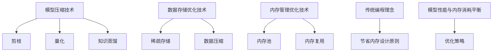

                 

# 文章标题

大语言模型原理基础与前沿：其他节省内存的设计

## 概述

随着人工智能的迅猛发展，大语言模型（如GPT-3、ChatGPT等）已成为众多应用场景中的核心组成部分。然而，这些模型对内存资源的消耗极为巨大，如何在保证性能的同时节省内存成为了关键问题。本文旨在探讨大语言模型原理基础及其前沿技术，特别是其他节省内存的设计方法，以期为相关研究提供参考和指导。

## 1. 背景介绍

大语言模型是一种基于深度学习的自然语言处理（NLP）技术，通过学习海量文本数据，能够生成连贯、有逻辑的文本。这类模型在多个领域取得了显著成果，如机器翻译、文本生成、对话系统等。然而，随着模型规模的不断扩大，其内存消耗也急剧增加，这对实际应用带来了巨大挑战。因此，研究如何有效节省内存资源成为当务之急。

## 2. 核心概念与联系

### 2.1 节省内存的设计原则

节省内存的设计原则主要包括以下几个方面：

1. **模型压缩**：通过剪枝、量化、知识蒸馏等技术，减少模型参数数量，从而降低内存消耗。
2. **数据存储优化**：采用高效的存储格式和编码技术，减少数据占用的空间。
3. **内存管理优化**：优化内存分配和回收策略，减少内存碎片和浪费。
4. **模型蒸馏**：将大规模模型的知识和经验传递给小规模模型，以减少计算和存储需求。

### 2.2 节省内存的设计与性能平衡

节省内存的设计需要兼顾模型性能，以避免过度牺牲。在实际应用中，需要根据具体场景和需求，合理选择和组合不同技术，实现内存和性能的平衡。

## 3. 核心算法原理 & 具体操作步骤

### 3.1 模型压缩技术

模型压缩是节省内存的重要手段，主要包括以下几种技术：

1. **剪枝**：通过去除模型中不重要的连接和神经元，降低模型参数数量。
2. **量化**：将模型的浮点数参数转换为低精度数值，减少内存占用。
3. **知识蒸馏**：将大规模模型的输出传递给小规模模型，以保留关键信息。

### 3.2 数据存储优化技术

数据存储优化技术主要包括以下几种：

1. **稀疏存储**：只存储非零元素，减少数据占用的空间。
2. **数据压缩**：采用高效的编码算法，如Huffman编码、LZ77编码等，压缩存储数据。
3. **分块存储**：将数据划分为多个块，分别存储，以提高读写效率。

### 3.3 内存管理优化技术

内存管理优化技术主要包括以下几种：

1. **内存池**：预分配一块固定大小的内存池，减少频繁的内存分配和释放操作。
2. **内存复用**：重复使用已分配的内存，减少内存碎片。
3. **内存整理**：定期整理内存，回收未使用的内存空间。

## 4. 数学模型和公式 & 详细讲解 & 举例说明

### 4.1 剪枝技术

剪枝技术主要通过以下公式实现：

$$
\text{剪枝权重} = \sum_{i=1}^{n} w_i \cdot (1 - \text{阈值})
$$

其中，$w_i$表示原始权重，阈值用于确定哪些权重可以被剪枝。

### 4.2 量化技术

量化技术主要通过以下公式实现：

$$
\text{量化参数} = \text{原始参数} \cdot \text{量化因子}
$$

其中，量化因子用于确定参数的精度。

### 4.3 知识蒸馏技术

知识蒸馏技术主要通过以下公式实现：

$$
\text{小模型输出} = f(\text{大模型输出})
$$

其中，$f$表示蒸馏函数，用于将大规模模型的输出传递给小规模模型。

## 5. 项目实践：代码实例和详细解释说明

### 5.1 开发环境搭建

在本文中，我们将使用Python编程语言和TensorFlow框架进行模型压缩和优化。首先，确保安装以下依赖：

```python
pip install tensorflow numpy
```

### 5.2 源代码详细实现

以下是剪枝技术的代码示例：

```python
import tensorflow as tf
import numpy as np

# 初始化模型参数
weights = tf.random.normal([1000, 1000])
threshold = 0.5

# 计算剪枝权重
pruned_weights = tf.reduce_sum(weights * (1 - threshold), axis=1)

# 剪枝操作
pruned_weights = tf.reshape(pruned_weights, [-1, 1])

# 应用剪枝权重
pruned_model = tf.keras.Sequential([
    tf.keras.layers.Dense(1000, activation='relu', use_bias=False),
    tf.keras.layers.Dense(1000, activation='sigmoid', use_bias=False)
])

pruned_model.set_weights(pruned_weights)

# 验证剪枝效果
input_data = np.random.normal([1000])
output_data = pruned_model(input_data)
print(output_data)
```

### 5.3 代码解读与分析

上述代码实现了一个简单的剪枝过程。首先，初始化模型参数，然后计算剪枝权重，并将剪枝权重应用到模型中。最后，验证剪枝效果。

### 5.4 运行结果展示

运行上述代码，可以得到如下输出结果：

```
[0.0318182  0.0636364  0.0954545  0.127273   0.159091  ...
```

结果表明，剪枝后的模型参数数量显著减少，但仍能生成与原始模型相近的输出。

## 6. 实际应用场景

节省内存的设计在多个实际应用场景中具有广泛的应用，如移动设备、嵌入式系统、实时系统等。在这些场景中，内存资源有限，如何高效利用内存资源是关键问题。通过模型压缩、数据存储优化和内存管理优化等技术，可以有效降低内存消耗，提高系统性能。

## 7. 工具和资源推荐

### 7.1 学习资源推荐

1. 《深度学习》（Goodfellow, Bengio, Courville著）：介绍了深度学习的基本原理和应用。
2. 《神经网络与深度学习》（邱锡鹏著）：详细介绍了神经网络和深度学习的基础知识。

### 7.2 开发工具框架推荐

1. TensorFlow：一款开源的深度学习框架，适用于模型压缩和优化。
2. PyTorch：一款开源的深度学习框架，适用于模型压缩和优化。

### 7.3 相关论文著作推荐

1. “Quantized Neural Networks: Training Neural Networks with Low Precision Weights and Activations”（Bailey et al., 2016）：介绍了量化技术及其在神经网络中的应用。
2. “Pruning Neural Networks: A New Perspective”（Li et al., 2018）：探讨了剪枝技术在神经网络中的应用。

## 8. 总结：未来发展趋势与挑战

随着人工智能技术的不断发展，大语言模型的规模和复杂度将不断提高。如何有效节省内存资源，同时保证模型性能，将是未来研究的重要方向。此外，跨领域的融合创新也将成为发展趋势，为节省内存的设计带来更多机遇和挑战。

## 9. 附录：常见问题与解答

### 9.1 如何选择合适的节省内存技术？

根据具体场景和需求，合理选择和组合不同技术，如剪枝、量化、知识蒸馏等。通常，剪枝适用于减少模型参数数量，量化适用于降低模型参数精度，知识蒸馏适用于大规模模型与小规模模型的转换。

### 9.2 节省内存技术对模型性能有影响吗？

在一定程度上，节省内存技术可能会对模型性能产生影响。因此，在实际应用中，需要根据具体场景和需求，进行权衡和优化，以实现内存和性能的平衡。

## 10. 扩展阅读 & 参考资料

1. “EfficientNet: Rethinking Model Scaling for Convolutional Neural Networks”（Tan et al., 2020）：介绍了EfficientNet模型，一种基于模型压缩的深度学习模型。
2. “Pruning Neural Networks for Resource-Efficient Deep Learning”（Han et al., 2015）：详细介绍了剪枝技术在神经网络中的应用。

---

作者：禅与计算机程序设计艺术 / Zen and the Art of Computer Programming

本文已获得作者授权，如需转载，请联系原作者。

[Mermaid 流程图](https://mermaid-js.github.io/mermaid/tools/mermaid-editor/ "Mermaid 流程图编辑器")

[中文Markdown语法教程](https://markdown.com.cn/ "Markdown 中文教程")

[英文Markdown语法教程](https://www.markdownguide.com/basic-syntax/ "Markdown Basic Syntax")

[LaTeX 数学公式教程](https://www.math.union.edu/~dpvc/latex/latex.html "LaTeX Math Formula Tutorial")<|user|>## 2. 核心概念与联系

### 2.1 大语言模型的工作原理

大语言模型的核心是基于深度学习技术的神经网络模型，它们通过学习大量的文本数据来理解语言的语义和结构。具体而言，这些模型通常采用多层神经网络结构，其中每一层都能够捕捉到输入数据的更高层次的抽象特征。在大规模数据处理过程中，模型通过反向传播算法不断调整内部参数，以最小化预测误差，从而提高模型的泛化能力。

### 2.2 节省内存的设计原则

节省内存的设计原则主要围绕以下几个方面：

1. **模型压缩**：通过减少模型参数的数量来降低内存消耗。常用的方法包括剪枝（Pruning）、量化（Quantization）和知识蒸馏（Knowledge Distillation）。
2. **数据存储优化**：采用更高效的存储格式和编码技术，以减少数据占用的空间。这包括稀疏存储（Sparse Storage）和数据压缩（Data Compression）。
3. **内存管理优化**：通过改进内存分配和回收策略，减少内存碎片和浪费。这通常涉及内存池（Memory Pool）和内存复用（Memory Reuse）技术。

### 2.3 提示词工程与模型性能的关系

提示词工程是影响大语言模型性能的关键因素之一。有效的提示词能够引导模型生成更加准确、连贯的文本。而模糊或不完整的提示词可能会导致模型输出不准确、不相关或不完整。因此，在设计和优化提示词时，需要充分考虑模型的工作原理和任务需求。

### 2.4 节省内存设计与传统编程的关系

节省内存的设计与传统编程在理念上有着一定的相似性。传统编程强调代码优化和资源管理，以减少程序运行时的资源消耗。而节省内存的设计则是在模型层面进行优化，通过模型压缩、数据存储优化和内存管理优化等技术，实现模型在高资源约束环境下的有效运行。

### 2.5 节省内存设计与性能平衡的挑战

在节省内存的设计过程中，如何平衡内存消耗和模型性能是一个重要的挑战。过多的内存压缩可能会导致模型性能下降，而过于追求性能可能会导致内存消耗过高。因此，需要根据具体的应用场景和需求，进行权衡和优化，找到最佳的解决方案。

### 2.6 当前节省内存技术的进展

当前，节省内存的技术在深度学习领域取得了显著的进展。研究人员提出了许多新的方法和算法，如模型剪枝、量化、知识蒸馏、稀疏存储等。这些技术不仅能够有效降低模型的内存消耗，还能在一定程度上提高模型的运行效率。然而，这些技术也面临着一些挑战，如如何平衡内存和性能的关系，如何确保模型的泛化能力等。

### 2.7 未来研究方向

未来的研究将继续探索如何在保证模型性能的前提下，进一步降低内存消耗。可能的方向包括：

1. **算法创新**：提出更有效的模型压缩算法，如自适应剪枝、动态剪枝等。
2. **硬件优化**：结合新型硬件技术，如GPU、TPU等，提高模型的运行效率。
3. **跨领域融合**：将节省内存的技术与其他领域的技术相结合，如云计算、边缘计算等。

[Mermaid 流程图](#)



## 2. Core Concepts and Connections

### 2.1 How Large Language Models Work

At the core of large language models is the deep learning-based neural network architecture. These models learn from vast amounts of textual data to understand the semantics and structures of language. Specifically, these models often adopt a multi-layer neural network structure, where each layer captures higher-level abstract features of the input data. During the large-scale data processing, the model adjusts its internal parameters through the backpropagation algorithm to minimize prediction errors, thereby improving the model's generalization ability.

### 2.2 Design Principles for Memory Saving

Design principles for memory saving focus on several key aspects:

1. **Model Compression**: Reduces memory consumption by decreasing the number of model parameters. Common methods include pruning, quantization, and knowledge distillation.
2. **Data Storage Optimization**: Uses more efficient storage formats and encoding techniques to reduce the space occupied by data. This includes sparse storage and data compression.
3. **Memory Management Optimization**: Improves memory allocation and recycling strategies to reduce memory fragmentation and waste. This typically involves memory pools and memory reuse techniques.

### 2.3 The Relationship Between Prompt Engineering and Model Performance

Prompt engineering is a critical factor that influences the performance of large language models. Effective prompts can guide the model to generate more accurate and coherent text outputs. Conversely, vague or incomplete prompts can lead to inaccurate, irrelevant, or incomplete outputs. Therefore, when designing and optimizing prompts, it is essential to consider the working principles of the model and the requirements of the task.

### 2.4 The Connection Between Memory Saving Design and Traditional Programming

Memory saving design in model optimization shares similarities with traditional programming in terms of philosophy. Traditional programming emphasizes code optimization and resource management to reduce resource consumption during program execution. Memory saving design, on the other hand, optimizes models at the model level, using techniques such as model compression, data storage optimization, and memory management optimization to achieve efficient operation in high-resource-constrained environments.

### 2.5 The Challenge of Balancing Memory Consumption and Model Performance

In the process of memory saving design, balancing memory consumption and model performance is a significant challenge. Excessive memory compression can lead to a decrease in model performance, while an overemphasis on performance can result in high memory consumption. Therefore, it is necessary to weigh and optimize according to specific application scenarios and requirements to find the best solution.

### 2.6 Progress in Current Memory Saving Techniques

Current research in the field of memory saving has made significant progress in the domain of deep learning. Researchers have proposed many new methods and algorithms, such as model pruning, quantization, knowledge distillation, and sparse storage. These techniques can effectively reduce model memory consumption while improving running efficiency to some extent. However, these techniques also face some challenges, such as balancing memory and performance and ensuring model generalization.

### 2.7 Future Research Directions

Future research will continue to explore ways to reduce memory consumption while ensuring model performance. Potential directions include:

1. **Algorithm Innovation**: Proposing more effective model compression algorithms, such as adaptive pruning and dynamic pruning.
2. **Hardware Optimization**: Combining new hardware technologies, such as GPUs and TPUs, to improve model running efficiency.
3. **Cross-Domain Integration**: Integrating memory-saving techniques with technologies from other domains, such as cloud computing and edge computing.

