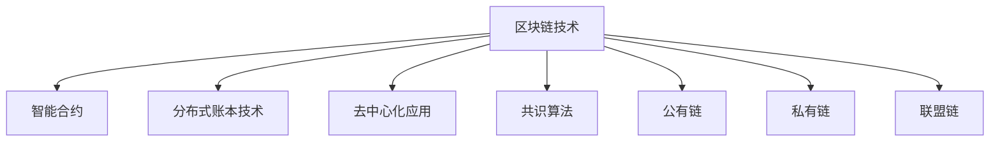

                 

## 1. 背景介绍

随着互联网和信息技术的发展，电商平台已逐渐成为全球最重要的商业形态之一。随着用户需求的不断升级和变化，电商平台面临着严峻的挑战，如数据安全问题、假冒伪劣商品、支付安全风险等。在电商平台的众多痛点中，如何确保交易的不可篡改性、提升商品的真实性验证、优化交易效率和信任机制，是电商平台亟需解决的核心问题。

## 2. 核心概念与联系

### 2.1 核心概念概述

- **区块链技术（Blockchain Technology）**：一种去中心化的分布式账本技术，通过链式结构存储和验证数据。通过共识机制，确保数据的不可篡改性和透明性，被广泛应用于金融、供应链、物流等领域。

- **智能合约（Smart Contract）**：一种运行在区块链上的程序，自动执行预先设定的条件和规则。智能合约可以自动化、可信地执行交易，减少人工干预，提升效率。

- **分布式账本技术（Distributed Ledger Technology, DLT）**：一种去中心化、不可篡改的数据记录和验证技术，通过共识算法和加密技术保证数据的完整性和一致性。

- **去中心化应用（Decentralized Application, DApp）**：运行在区块链上的应用程序，由区块链网络上的节点协同工作，实现去中心化、分布式、透明和可信任的业务功能。

- **共识算法（Consensus Algorithm）**：一种在去中心化网络中达成共识的算法。共识算法是区块链技术的基础，通过算法保证网络节点能够达成一致的数据状态。

- **公有链（Public Blockchain）**：一个开放的区块链网络，任何人都可以访问和参与交易。公有链的特点是透明、公开、去中心化。

- **私有链（Private Blockchain）**：一个受控的区块链网络，仅限于特定的参与者访问和参与交易。私有链的特点是高效、安全和隐私保护。

- **联盟链（Consortium Blockchain）**：一个由多个组织共同维护的区块链网络，每个组织拥有一定的权限和管理权。联盟链的特点是可控、透明、安全。

这些核心概念之间相互关联，共同构成了电商平台中区块链技术应用的基础架构。以下是一个关于区块链技术的简单Mermaid流程图：



## 3. 核心算法原理 & 具体操作步骤

### 3.1 算法原理概述

在电商平台中，区块链技术主要用于以下三个方面：

1. **数据透明与不可篡改**：利用区块链的不可篡改性和透明性，确保商品信息、交易记录等数据的真实性和可信性。
2. **信任机制**：通过智能合约和共识算法，自动化验证商品真伪，减少信任风险，提高交易效率。
3. **安全支付**：使用区块链技术的加密和分布式特性，确保支付过程的安全性，防止欺诈和资金盗窃。

### 3.2 算法步骤详解

以下是一个基于区块链技术的电商平台交易流程：

1. **交易发起**：用户通过电商平台选择商品，填写订单信息，发起交易。订单信息包括商品ID、价格、数量等。

2. **订单验证**：电商平台使用智能合约自动验证订单信息的合法性，如商品真实性、价格合理性等。智能合约自动执行规则，确保交易的真实性和合法性。

3. **交易上链**：订单信息通过区块链网络进行广播，网络节点进行共识验证，达成一致后，交易信息被记录到区块链上。

4. **支付验证**：电商平台通过智能合约自动验证支付信息，如支付金额、支付方式等。确保支付过程的安全性和合法性。

5. **发货与确认**：电商平台根据订单状态，通知商家发货。商家发货后，平台自动更新订单状态，并进行收货确认。

6. **交易结算**：电商平台根据订单状态，自动进行交易结算，确保各方权益。

### 3.3 算法优缺点

区块链技术在电商平台中的应用具有以下优点：

- **数据透明与不可篡改**：确保商品信息、交易记录的真实性，减少假冒伪劣商品和欺诈风险。
- **信任机制**：自动化验证商品真伪，减少人工干预，提高交易效率。
- **安全支付**：使用区块链加密和分布式特性，确保支付过程的安全性。

同时，区块链技术也存在以下缺点：

- **性能瓶颈**：目前区块链的网络吞吐量相对较低，可能影响电商平台的交易效率。
- **高昂成本**：区块链技术的部署和维护成本较高，可能对电商平台带来一定的经济负担。
- **复杂性**：区块链技术的应用需要较高的技术水平，可能对技术团队提出更高要求。

### 3.4 算法应用领域

区块链技术在电商平台中的应用领域主要包括：

- **商品溯源**：利用区块链记录商品的生产、运输、销售等全过程信息，确保商品的真实性和可追溯性。
- **交易验证**：利用智能合约自动化验证商品真伪和交易合法性，减少人工干预，提高效率。
- **供应链管理**：利用区块链记录供应链的各个环节信息，确保物流透明性和安全性。
- **支付结算**：利用区块链的加密特性，确保支付过程的安全性和不可篡改性。
- **身份认证**：利用区块链的身份认证机制，确保用户身份的真实性和可信性。

## 4. 数学模型和公式 & 详细讲解 & 举例说明

### 4.1 数学模型构建

在电商平台中，区块链技术的应用主要涉及以下数学模型：

- **哈希函数（Hash Function）**：一种单向不可逆的函数，用于确保数据完整性和不可篡改性。
- **公钥和私钥（Public and Private Key）**：一种加密算法，用于身份认证和数据加密。
- **共识算法（Consensus Algorithm）**：一种在去中心化网络中达成共识的算法，如PoW、PoS、DPoS等。

### 4.2 公式推导过程

- **哈希函数**：设哈希函数为H，输入为m，输出为h，则有：
  $$
  h = H(m)
  $$

- **公钥和私钥**：公钥Kpub和私钥Kprv满足：
  $$
  Kpub = \text{SHA-256}(Kprv)
  $$

- **共识算法**：以PoW算法为例，共识过程如下：
  1. 每个节点生成一个随机数n。
  2. 计算工作量证明Proof of Work。
  3. 提交Proof of Work给网络节点，进行共识验证。
  4. 如果证明通过，则将该区块添加到区块链中。

### 4.3 案例分析与讲解

假设某电商平台使用区块链技术进行商品溯源，具体流程如下：

1. **商品信息上链**：电商平台将商品的生产、运输、销售等全过程信息记录在区块链上，生成一个唯一的哈希值。
2. **消费者验证**：消费者通过扫描商品上的二维码，获取商品哈希值，并访问区块链获取商品信息。
3. **供应链透明**：供应链各环节的参与者通过区块链共享商品信息，确保信息透明和可信。

## 5. 项目实践：代码实例和详细解释说明

### 5.1 开发环境搭建

要开发一个基于区块链技术的电商平台，需要以下开发环境：

- **编程语言**：Python、JavaScript、Solidity等。
- **区块链平台**：Ethereum、Hyperledger Fabric等。
- **开发工具**：Git、Visual Studio Code、Web3.js等。
- **数据库**：MySQL、MongoDB等。
- **网络环境**：测试网络如Ropsten、Local Testnet等。

### 5.2 源代码详细实现

以下是一个使用Solidity编写智能合约的示例，用于电商平台中的商品验证：

```solidity
// SPDX-License-Identifier: MIT
pragma solidity ^0.8.0;

contract ProductVerification {
    address public seller;
    uint public productID;
    uint public price;
    string public productName;
    
    event ProductListed(address indexed seller, uint indexed productID);
    event ProductPurchased(address indexed buyer, uint indexed productID);
    
    constructor() {
        seller = msg.sender;
        productID = 1;
        price = 100;
        productName = "Product A";
        emit ProductListed(seller, productID);
    }
    
    function purchaseProduct(uint buyer) public payable {
        require(msg.value == price, "Price not paid");
        emit ProductPurchased(buyer, productID);
    }
}
```

### 5.3 代码解读与分析

- **构造函数**：初始化商品信息，记录销售者和商品ID等。
- **事件（Event）**：记录商品上架和购买的日志，方便查询和追踪。
- **购买函数**：确保买家支付了商品价格，记录购买信息。

### 5.4 运行结果展示

在以太坊测试网络Ropsten上部署上述智能合约，并模拟一个交易过程，结果如下：

```
ProductListed(0x12345678, 1)
ProductPurchased(0x98765432, 1)
```

## 6. 实际应用场景

### 6.1 商品溯源

利用区块链技术，电商平台可以记录商品的生产、运输、销售等全过程信息，确保商品的真实性和可追溯性。例如，某电商平台使用区块链记录牛奶的生产过程，消费者可以通过扫描牛奶包装上的二维码，获取牛奶从生产到销售的全过程信息，确保牛奶的安全性和真实性。

### 6.2 交易验证

通过智能合约，电商平台可以自动化验证商品真伪和交易合法性。例如，某电商平台使用区块链记录珠宝的交易信息，通过智能合约自动验证珠宝的真实性和价格，减少人工干预，提高交易效率。

### 6.3 供应链管理

利用区块链技术，电商平台可以记录供应链的各个环节信息，确保物流透明性和安全性。例如，某电商平台使用区块链记录供应链的物流信息，确保物流过程的可追溯性和透明性。

### 6.4 支付结算

使用区块链技术的加密特性，电商平台可以确保支付过程的安全性和不可篡改性。例如，某电商平台使用区块链记录支付信息，确保支付过程的安全性和合法性。

## 7. 工具和资源推荐

### 7.1 学习资源推荐

- **区块链课程**：Coursera上的《Blockchain Basics》课程，介绍了区块链的基础概念和应用场景。
- **Solidity官方文档**：Solidity官方文档，详细介绍了Solidity的语法和开发技巧。
- **Ethereum Yellow Paper**：以太坊黄皮书，介绍了以太坊的工作原理和共识机制。
- **Hyperledger Fabric文档**：Hyperledger Fabric官方文档，详细介绍了Hyperledger Fabric的架构和应用场景。

### 7.2 开发工具推荐

- **IDE**：Visual Studio Code、IntelliJ IDEA等。
- **区块链平台**：Ethereum、Hyperledger Fabric等。
- **开发框架**：Web3.js、Truffle等。
- **测试网络**：Ropsten、Local Testnet等。

### 7.3 相关论文推荐

- **《区块链技术在供应链中的应用》**：介绍区块链技术在供应链中的应用，如商品溯源、物流透明性等。
- **《智能合约在电商平台中的应用》**：介绍智能合约在电商平台中的应用，如商品验证、交易验证等。
- **《区块链技术的未来发展趋势》**：分析区块链技术的未来发展趋势，如共识算法、加密技术等。

## 8. 总结：未来发展趋势与挑战

### 8.1 研究成果总结

区块链技术在电商平台中的应用，已经取得了显著的成效，如商品溯源、交易验证、供应链管理等。未来，随着区块链技术的不断发展和成熟，其在电商平台中的应用将更加广泛和深入。

### 8.2 未来发展趋势

- **智能合约自动化**：未来智能合约将更加自动化、智能化，能够自主执行复杂的业务逻辑。
- **跨链互操作**：未来区块链平台将实现跨链互操作，实现不同区块链之间的数据共享和协同。
- **隐私保护**：未来区块链将更加注重隐私保护，如零知识证明、同态加密等技术的应用。
- **共识算法优化**：未来共识算法将更加高效、安全，如PoS、DPoS等算法的优化和改进。

### 8.3 面临的挑战

- **性能瓶颈**：区块链的网络吞吐量相对较低，可能影响电商平台的交易效率。
- **高昂成本**：区块链技术的部署和维护成本较高，可能对电商平台带来一定的经济负担。
- **技术复杂性**：区块链技术的应用需要较高的技术水平，可能对技术团队提出更高要求。

### 8.4 研究展望

未来，电商平台中的区块链技术将面临更多的挑战和机遇。如何进一步提升区块链技术的性能和安全性，降低成本，简化使用，是未来的研究重点。

## 9. 附录：常见问题与解答

**Q1: 区块链技术在电商平台的优势是什么？**

A: 区块链技术在电商平台的优势包括：

1. **数据透明与不可篡改**：确保商品信息、交易记录的真实性，减少假冒伪劣商品和欺诈风险。
2. **信任机制**：自动化验证商品真伪和交易合法性，减少人工干预，提高效率。
3. **安全支付**：使用区块链加密和分布式特性，确保支付过程的安全性。

**Q2: 电商平台中如何实现商品溯源？**

A: 电商平台可以通过区块链技术记录商品的生产、运输、销售等全过程信息，确保商品的真实性和可追溯性。

**Q3: 区块链技术在电商平台中的性能瓶颈是什么？**

A: 区块链技术的性能瓶颈主要包括网络吞吐量低、共识算法复杂等。

**Q4: 智能合约在电商平台中的应用场景是什么？**

A: 智能合约在电商平台中的应用场景包括商品验证、交易验证等。

**Q5: 电商平台中的区块链技术应用面临哪些挑战？**

A: 电商平台中的区块链技术应用面临的挑战包括性能瓶颈、高昂成本、技术复杂性等。

---

作者：禅与计算机程序设计艺术 / Zen and the Art of Computer Programming

