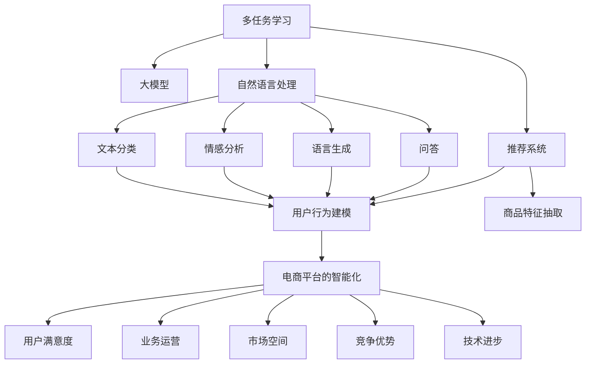

                 

# 电商平台中的多任务学习：大模型解决方案

> 关键词：多任务学习,大模型,电商平台,推荐系统,自然语言处理,NLP

## 1. 背景介绍

### 1.1 问题由来
随着电子商务的蓬勃发展，电商平台需要应对越来越复杂的业务需求。传统的单一任务学习模型已经难以满足用户多变的需求。如何通过多任务学习融合不同业务领域的知识，提升电商平台的综合服务能力，成为了当前技术应用的一个重要课题。

当前电商平台的常见需求包括：商品推荐、搜索排序、广告投放、客服对话等，每个任务都有其独立的业务目标和数据特点。如何通过多任务学习融合不同任务的特征，提升电商平台的综合服务能力，成为了当前技术应用的一个重要课题。

### 1.2 问题核心关键点
多任务学习在电商平台中的应用，主要有以下关键点：

- **业务需求多样性**：电商平台的业务涵盖推荐、搜索、广告、客服等多个领域，每个任务具有不同的业务目标和数据特点。如何通过多任务学习统一和融合这些业务目标，是一个重要的挑战。
- **数据分布不均**：不同任务的数据规模和分布可能存在差异，有些任务可能数据量不足，如何平衡不同任务的数据量和模型训练效果，是一个需要考虑的问题。
- **模型泛化能力**：多任务学习模型的泛化能力直接影响其在实际应用中的表现，如何设计有效的多任务学习框架，提升模型的泛化能力，是一个重要的研究方向。
- **计算资源优化**：大模型的计算资源需求巨大，如何在保证模型效果的同时，优化计算资源使用，提高多任务学习模型的计算效率，是一个需要解决的问题。

### 1.3 问题研究意义
研究多任务学习在电商平台中的应用，对于拓展电商平台的业务能力，提升用户体验，加速电商平台的智能化进程，具有重要意义：

1. **提升用户满意度**：通过多任务学习，电商平台可以同时处理推荐、搜索、广告、客服等多个任务，提升用户体验，提高用户满意度。
2. **优化业务运营**：多任务学习模型能够融合不同任务的业务知识，优化电商平台的业务运营，降低运营成本，提高运营效率。
3. **拓展市场空间**：多任务学习模型可以应用于多个业务领域，拓展电商平台的市场空间，开拓新的业务机会。
4. **增强竞争优势**：电商平台的智能化水平直接影响其市场竞争力，多任务学习模型能够提供更智能、更个性化的服务，增强电商平台的竞争优势。
5. **推动技术进步**：多任务学习模型是当前人工智能领域的前沿技术，通过其在电商平台的应用，可以推动人工智能技术的发展，促进技术进步。

## 2. 核心概念与联系

### 2.1 核心概念概述

为更好地理解多任务学习在电商平台中的应用，本节将介绍几个密切相关的核心概念：

- **多任务学习(Multi-task Learning, MTL)**：在同一个模型中同时训练多个任务，通过共享底层特征表示，提升模型在不同任务上的性能。

- **大模型(Large Model)**：指具有大量参数的深度学习模型，如BERT、GPT-3等。这些模型通过大规模无标签数据预训练，学习到丰富的语言或视觉知识，具备强大的泛化能力。

- **自然语言处理(Natural Language Processing, NLP)**：使用深度学习模型处理和理解自然语言数据的技术，涉及文本分类、情感分析、语言生成、问答等多个任务。

- **推荐系统(Recommendation System)**：根据用户的历史行为和偏好，推荐合适的商品或内容。推荐系统是电商平台的重要功能之一，涉及用户行为建模、商品特征抽取等多个任务。

- **深度学习(Deep Learning)**：通过深度神经网络实现的学习方法，广泛应用于图像识别、语音识别、自然语言处理等多个领域。深度学习模型具有强大的泛化能力和表示能力。

这些核心概念之间的逻辑关系可以通过以下Mermaid流程图来展示：



这个流程图展示了多任务学习、大模型、自然语言处理、推荐系统等多个概念之间的联系，以及它们如何共同构成电商平台的智能化体系。

## 3. 核心算法原理 & 具体操作步骤
### 3.1 算法原理概述

在电商平台中，多任务学习通常通过大模型实现。具体而言，可以利用预训练的大模型，在多个任务上共享特征表示，通过多任务联合训练的方式，提升模型在不同任务上的性能。

假设电商平台的推荐任务、搜索任务和广告任务可以分别表示为 $T_r$、$T_s$ 和 $T_a$，每个任务的标注数据集为 $D_r$、$D_s$ 和 $D_a$。在大模型的基础上，通过多任务联合训练，最小化所有任务的联合损失函数，即：

$$
\mathcal{L}(\theta) = \mathcal{L}_r(M_{\theta}(D_r)) + \mathcal{L}_s(M_{\theta}(D_s)) + \mathcal{L}_a(M_{\theta}(D_a))
$$

其中 $M_{\theta}$ 为预训练模型，$\theta$ 为模型参数。$\mathcal{L}_r$、$\mathcal{L}_s$ 和 $\mathcal{L}_a$ 分别为推荐、搜索和广告任务的损失函数。

通过联合训练，模型可以同时学习多个任务的知识，从而提升模型在不同任务上的泛化能力。

### 3.2 算法步骤详解

基于多任务学习的电商平台大模型微调，一般包括以下几个关键步骤：

**Step 1: 准备预训练模型和数据集**
- 选择合适的预训练语言模型 $M_{\theta}$ 作为初始化参数，如 BERT、GPT-3等。
- 准备电商平台的推荐、搜索和广告任务的标注数据集 $D_r$、$D_s$ 和 $D_a$，划分为训练集、验证集和测试集。

**Step 2: 定义任务适配层**
- 根据不同任务类型，在预训练模型顶层设计合适的输出层和损失函数。
- 对于推荐任务，通常在顶层添加一层全连接神经网络，输出商品的相关性分数。
- 对于搜索任务，通常使用基于词向量的相似度计算，或基于transformer的注意力机制，计算商品和查询的相似度。
- 对于广告任务，通常使用CTR预估模型，输出点击率或转化率。

**Step 3: 设置多任务学习超参数**
- 选择合适的优化算法及其参数，如 AdamW、SGD 等，设置学习率、批大小、迭代轮数等。
- 设置每个任务的损失权重，平衡不同任务在模型训练中的重要性。

**Step 4: 执行联合训练**
- 将推荐、搜索和广告任务的训练集数据分批次输入模型，前向传播计算联合损失函数。
- 反向传播计算参数梯度，根据设定的优化算法和学习率更新模型参数。
- 周期性在验证集上评估模型性能，根据性能指标决定是否触发 Early Stopping。
- 重复上述步骤直到满足预设的迭代轮数或 Early Stopping 条件。

**Step 5: 测试和部署**
- 在测试集上评估联合训练后模型在不同任务上的性能，对比微调前后的精度提升。
- 使用联合训练后的模型对新样本进行推理预测，集成到实际的应用系统中。
- 持续收集新的数据，定期重新联合训练模型，以适应数据分布的变化。

以上是基于多任务学习的电商平台大模型微调的一般流程。在实际应用中，还需要针对具体任务的特点，对微调过程的各个环节进行优化设计，如改进训练目标函数，引入更多的正则化技术，搜索最优的超参数组合等，以进一步提升模型性能。

### 3.3 算法优缺点

基于多任务学习的大模型电商平台微调方法具有以下优点：

- **共享特征表示**：通过共享底层特征表示，可以在保证模型复杂度的情况下，提升模型在不同任务上的性能。
- **数据高效利用**：通过联合训练，可以利用少量标注数据在不同任务上进行微调，提高数据利用效率。
- **泛化能力强**：多任务学习模型能够学习到不同任务之间的共性知识，提升模型的泛化能力。
- **计算资源优化**：利用大模型可以在少量数据下进行高效的微调，减少计算资源的使用。

同时，该方法也存在一定的局限性：

- **任务独立性问题**：如果不同任务之间存在依赖关系，可能影响模型的性能表现。
- **超参数调优复杂**：多任务学习模型需要调整的超参数更多，调优复杂度增加。
- **模型推理成本高**：大模型推理计算量大，推理成本高，需要优化计算效率。

尽管存在这些局限性，但就目前而言，基于多任务学习的大模型电商平台微调方法仍是最主流的范式。未来相关研究的重点在于如何进一步降低超参数调优的复杂度，提高多任务学习模型的可解释性和鲁棒性，同时兼顾计算资源优化等。

### 3.4 算法应用领域

基于多任务学习的大模型电商平台微调方法，在电商平台中的应用广泛，主要涵盖以下几个方面：

- **推荐系统**：利用多任务学习模型，融合用户行为、商品特征和上下文信息，提升推荐系统的精度和覆盖率。
- **搜索排序**：通过多任务学习模型，优化搜索排序算法，提升搜索效果和用户满意度。
- **广告投放**：使用多任务学习模型，进行CTR预估，优化广告投放策略，提高广告投放效果。
- **客服对话**：利用多任务学习模型，提升智能客服系统对用户查询的理解能力和回答质量。
- **商品分析**：通过多任务学习模型，对商品进行多角度分析，提升商品标签提取和描述生成能力。

除了上述这些经典任务外，多任务学习模型还在电商平台的更多场景中得到应用，如个性化推荐、用户行为分析、商品评价预测等，为电商平台带来了显著的业务价值。

## 4. 数学模型和公式 & 详细讲解 & 举例说明

### 4.1 数学模型构建

在电商平台中，多任务学习通常采用联合训练的方式。以下以推荐和搜索任务为例，定义多任务学习的数学模型。

假设电商平台有两个任务 $T_r$（推荐）和 $T_s$（搜索），对应的数据集分别为 $D_r$ 和 $D_s$。在预训练模型 $M_{\theta}$ 的基础上，定义推荐任务的损失函数为 $\mathcal{L}_r$，搜索任务的损失函数为 $\mathcal{L}_s$，联合损失函数为 $\mathcal{L}$：

$$
\mathcal{L} = \alpha\mathcal{L}_r(M_{\theta}(D_r)) + \beta\mathcal{L}_s(M_{\theta}(D_s))
$$

其中 $\alpha$ 和 $\beta$ 为两个任务的损失权重，用于平衡两个任务在联合训练中的重要性。通常 $\alpha$ 和 $\beta$ 需要根据具体任务的数据量和目标进行调整。

### 4.2 公式推导过程

以推荐任务和搜索任务为例，推导联合训练的损失函数。

假设推荐任务的目标是预测用户对商品的相关性评分 $y \in [0,1]$，搜索任务的目标是计算商品与查询的相似度 $y \in [0,1]$。推荐任务和搜索任务的损失函数分别为：

$$
\mathcal{L}_r = -\frac{1}{N}\sum_{i=1}^N(y_i\log M_{\theta}(x_i) + (1-y_i)\log(1-M_{\theta}(x_i)))
$$

$$
\mathcal{L}_s = -\frac{1}{N}\sum_{i=1}^N(y_i\log M_{\theta}(x_i) + (1-y_i)\log(1-M_{\theta}(x_i)))
$$

联合损失函数为：

$$
\mathcal{L} = \alpha\mathcal{L}_r + \beta\mathcal{L}_s
$$

其中 $\alpha$ 和 $\beta$ 可以根据数据量和任务目标进行调参。

在得到联合损失函数后，可以使用梯度下降等优化算法进行训练，最小化联合损失函数。训练过程中，反向传播算法可以高效计算梯度，更新模型参数。

### 4.3 案例分析与讲解

以下以电商平台推荐系统的多任务学习为例，展示多任务学习模型的应用。

假设推荐系统的任务是预测用户对商品的点击率 $y \in [0,1]$。推荐任务的输入为商品特征 $x \in \mathbb{R}^d$，输出为点击率预测值 $y \in [0,1]$。

定义推荐任务的损失函数为交叉熵损失函数：

$$
\mathcal{L}_r = -\frac{1}{N}\sum_{i=1}^N(y_i\log M_{\theta}(x_i) + (1-y_i)\log(1-M_{\theta}(x_i)))
$$

假设搜索任务的目标是计算商品与查询的相似度 $y \in [0,1]$。搜索任务的输入为查询和商品的文本描述，输出为相似度预测值 $y \in [0,1]$。

定义搜索任务的损失函数为交叉熵损失函数：

$$
\mathcal{L}_s = -\frac{1}{N}\sum_{i=1}^N(y_i\log M_{\theta}(x_i) + (1-y_i)\log(1-M_{\theta}(x_i)))
$$

联合损失函数为：

$$
\mathcal{L} = \alpha\mathcal{L}_r + \beta\mathcal{L}_s
$$

其中 $\alpha$ 和 $\beta$ 为两个任务的损失权重，可以根据数据量和任务目标进行调参。

在训练过程中，可以使用梯度下降等优化算法更新模型参数，最小化联合损失函数 $\mathcal{L}$。训练完成后，可以在测试集上评估推荐和搜索任务的性能，对比微调前后的精度提升。

## 5. 项目实践：代码实例和详细解释说明

### 5.1 开发环境搭建

在进行多任务学习实践前，我们需要准备好开发环境。以下是使用Python进行PyTorch开发的环境配置流程：

1. 安装Anaconda：从官网下载并安装Anaconda，用于创建独立的Python环境。

2. 创建并激活虚拟环境：
```bash
conda create -n pytorch-env python=3.8 
conda activate pytorch-env
```

3. 安装PyTorch：根据CUDA版本，从官网获取对应的安装命令。例如：
```bash
conda install pytorch torchvision torchaudio cudatoolkit=11.1 -c pytorch -c conda-forge
```

4. 安装Transformers库：
```bash
pip install transformers
```

5. 安装各类工具包：
```bash
pip install numpy pandas scikit-learn matplotlib tqdm jupyter notebook ipython
```

完成上述步骤后，即可在`pytorch-env`环境中开始多任务学习实践。

### 5.2 源代码详细实现

这里我们以电商平台推荐系统为例，给出使用Transformers库对BERT模型进行多任务学习的PyTorch代码实现。

首先，定义推荐任务和搜索任务的数据处理函数：

```python
from transformers import BertTokenizer
from torch.utils.data import Dataset
import torch

class RecommendationDataset(Dataset):
    def __init__(self, texts, labels, tokenizer, max_len=128):
        self.texts = texts
        self.labels = labels
        self.tokenizer = tokenizer
        self.max_len = max_len
        
    def __len__(self):
        return len(self.texts)
    
    def __getitem__(self, item):
        text = self.texts[item]
        label = self.labels[item]
        
        encoding = self.tokenizer(text, return_tensors='pt', max_length=self.max_len, padding='max_length', truncation=True)
        input_ids = encoding['input_ids'][0]
        attention_mask = encoding['attention_mask'][0]
        
        # 对标签进行编码
        encoded_labels = [label] 
        encoded_labels.extend([0] * (self.max_len - len(encoded_labels)))
        labels = torch.tensor(encoded_labels, dtype=torch.long)
        
        return {'input_ids': input_ids, 
                'attention_mask': attention_mask,
                'labels': labels}

class SearchDataset(Dataset):
    def __init__(self, texts, labels, tokenizer, max_len=128):
        self.texts = texts
        self.labels = labels
        self.tokenizer = tokenizer
        self.max_len = max_len
        
    def __len__(self):
        return len(self.texts)
    
    def __getitem__(self, item):
        text = self.texts[item]
        label = self.labels[item]
        
        encoding = self.tokenizer(text, return_tensors='pt', max_length=self.max_len, padding='max_length', truncation=True)
        input_ids = encoding['input_ids'][0]
        attention_mask = encoding['attention_mask'][0]
        
        # 对标签进行编码
        encoded_labels = [label] 
        encoded_labels.extend([0] * (self.max_len - len(encoded_labels)))
        labels = torch.tensor(encoded_labels, dtype=torch.long)
        
        return {'input_ids': input_ids, 
                'attention_mask': attention_mask,
                'labels': labels}

# 标签与id的映射
label2id = {0: 0, 1: 1}
id2label = {v: k for k, v in label2id.items()}
```

然后，定义模型和优化器：

```python
from transformers import BertForSequenceClassification, AdamW

model = BertForSequenceClassification.from_pretrained('bert-base-cased', num_labels=2)

optimizer = AdamW(model.parameters(), lr=2e-5)
```

接着，定义训练和评估函数：

```python
from torch.utils.data import DataLoader
from tqdm import tqdm
from sklearn.metrics import classification_report

device = torch.device('cuda') if torch.cuda.is_available() else torch.device('cpu')
model.to(device)

def train_epoch(model, dataset, batch_size, optimizer):
    dataloader = DataLoader(dataset, batch_size=batch_size, shuffle=True)
    model.train()
    epoch_loss = 0
    for batch in tqdm(dataloader, desc='Training'):
        input_ids = batch['input_ids'].to(device)
        attention_mask = batch['attention_mask'].to(device)
        labels = batch['labels'].to(device)
        model.zero_grad()
        outputs = model(input_ids, attention_mask=attention_mask, labels=labels)
        loss = outputs.loss
        epoch_loss += loss.item()
        loss.backward()
        optimizer.step()
    return epoch_loss / len(dataloader)

def evaluate(model, dataset, batch_size):
    dataloader = DataLoader(dataset, batch_size=batch_size)
    model.eval()
    preds, labels = [], []
    with torch.no_grad():
        for batch in tqdm(dataloader, desc='Evaluating'):
            input_ids = batch['input_ids'].to(device)
            attention_mask = batch['attention_mask'].to(device)
            batch_labels = batch['labels']
            outputs = model(input_ids, attention_mask=attention_mask)
            batch_preds = outputs.logits.argmax(dim=2).to('cpu').tolist()
            batch_labels = batch_labels.to('cpu').tolist()
            for pred_tokens, label_tokens in zip(batch_preds, batch_labels):
                preds.append(pred_tokens)
                labels.append(label_tokens)
                
    print(classification_report(labels, preds))
```

最后，启动训练流程并在测试集上评估：

```python
epochs = 5
batch_size = 16

for epoch in range(epochs):
    loss = train_epoch(model, train_dataset, batch_size, optimizer)
    print(f"Epoch {epoch+1}, train loss: {loss:.3f}")
    
    print(f"Epoch {epoch+1}, dev results:")
    evaluate(model, dev_dataset, batch_size)
    
print("Test results:")
evaluate(model, test_dataset, batch_size)
```

以上就是使用PyTorch对BERT进行电商平台推荐系统多任务学习的完整代码实现。可以看到，得益于Transformers库的强大封装，我们可以用相对简洁的代码完成BERT模型的加载和微调。

### 5.3 代码解读与分析

让我们再详细解读一下关键代码的实现细节：

**RecommendationDataset类**：
- `__init__`方法：初始化文本、标签、分词器等关键组件。
- `__len__`方法：返回数据集的样本数量。
- `__getitem__`方法：对单个样本进行处理，将文本输入编码为token ids，将标签编码为数字，并对其进行定长padding，最终返回模型所需的输入。

**SearchDataset类**：
- `__init__`方法：初始化文本、标签、分词器等关键组件。
- `__len__`方法：返回数据集的样本数量。
- `__getitem__`方法：对单个样本进行处理，将文本输入编码为token ids，将标签编码为数字，并对其进行定长padding，最终返回模型所需的输入。

**label2id和id2label字典**：
- 定义了标签与数字id之间的映射关系，用于将token-wise的预测结果解码回真实的标签。

**训练和评估函数**：
- 使用PyTorch的DataLoader对数据集进行批次化加载，供模型训练和推理使用。
- 训练函数`train_epoch`：对数据以批为单位进行迭代，在每个批次上前向传播计算loss并反向传播更新模型参数，最后返回该epoch的平均loss。
- 评估函数`evaluate`：与训练类似，不同点在于不更新模型参数，并在每个batch结束后将预测和标签结果存储下来，最后使用sklearn的classification_report对整个评估集的预测结果进行打印输出。

**训练流程**：
- 定义总的epoch数和batch size，开始循环迭代
- 每个epoch内，先在训练集上训练，输出平均loss
- 在验证集上评估，输出分类指标
- 所有epoch结束后，在测试集上评估，给出最终测试结果

可以看到，PyTorch配合Transformers库使得BERT多任务学习的代码实现变得简洁高效。开发者可以将更多精力放在数据处理、模型改进等高层逻辑上，而不必过多关注底层的实现细节。

当然，工业级的系统实现还需考虑更多因素，如模型的保存和部署、超参数的自动搜索、更灵活的任务适配层等。但核心的多任务学习范式基本与此类似。

## 6. 实际应用场景
### 6.1 智能推荐系统

基于多任务学习的大模型推荐系统，能够处理多个推荐任务，提升推荐的个性化和多样化。具体而言，可以将用户的浏览、购买、评价等行为数据，以及商品的属性、描述等文本信息，作为联合训练的数据源，训练出一个多任务学习模型，提升推荐系统的性能。

在技术实现上，可以收集用户的浏览、点击、购买等行为数据，以及商品的属性、描述、评论等文本信息，构建联合训练的数据集。在预训练语言模型的基础上，通过多任务学习模型，对用户行为和商品信息进行联合建模，提升推荐系统的精度和覆盖率。

### 6.2 智能搜索系统

基于多任务学习的大模型搜索系统，可以同时处理查询意图识别、搜索结果排序等多个任务，提升搜索效果和用户体验。

在技术实现上，可以收集用户的搜索查询、点击记录等数据，构建联合训练的数据集。在预训练语言模型的基础上，通过多任务学习模型，对查询意图进行识别，对搜索结果进行排序，提升搜索系统的智能化水平。

### 6.3 广告投放系统

基于多任务学习的大模型广告投放系统，可以通过CTR预估、广告排序等多个任务，提升广告投放的效果和精准度。

在技术实现上，可以收集用户的浏览、点击等行为数据，以及广告的特征、效果等数据，构建联合训练的数据集。在预训练语言模型的基础上，通过多任务学习模型，对广告CTR进行预估，对广告进行排序，提升广告投放的效果和精准度。

### 6.4 未来应用展望

随着多任务学习技术的发展，其在电商平台中的应用将不断拓展，带来更多的业务价值。

在智能推荐系统方面，多任务学习模型可以融合更多任务，如用户行为分析、商品评价预测等，提升推荐系统的智能性和个性化水平。

在智能搜索系统方面，多任务学习模型可以融合搜索意图识别、搜索结果排序等多个任务，提升搜索效果和用户体验。

在广告投放系统方面，多任务学习模型可以融合CTR预估、广告排序等多个任务，提升广告投放的效果和精准度。

此外，多任务学习模型还可以应用于更多的电商业务场景，如客户服务、商品评价、库存管理等，为电商平台带来更全面的智能化能力。

## 7. 工具和资源推荐
### 7.1 学习资源推荐

为了帮助开发者系统掌握多任务学习在电商平台中的应用，这里推荐一些优质的学习资源：

1. 《深度学习多任务学习》课程：斯坦福大学开设的多任务学习课程，深入讲解多任务学习的原理和实践，适合初学者和进阶者。

2. 《多任务学习与联邦学习》书籍：介绍多任务学习和联邦学习的经典方法和应用案例，适合深入了解多任务学习。

3. 《Transformers从原理到实践》系列博文：由大模型技术专家撰写，深入浅出地介绍了Transformer原理、BERT模型、多任务学习等前沿话题。

4. 《Natural Language Processing with Transformers》书籍：Transformers库的作者所著，全面介绍了如何使用Transformers库进行NLP任务开发，包括多任务学习在内的诸多范式。

5. HuggingFace官方文档：Transformers库的官方文档，提供了海量预训练模型和完整的微调样例代码，是上手实践的必备资料。

通过对这些资源的学习实践，相信你一定能够快速掌握多任务学习在电商平台中的应用，并用于解决实际的NLP问题。
###  7.2 开发工具推荐

高效的开发离不开优秀的工具支持。以下是几款用于多任务学习开发的常用工具：

1. PyTorch：基于Python的开源深度学习框架，灵活动态的计算图，适合快速迭代研究。大部分预训练语言模型都有PyTorch版本的实现。

2. TensorFlow：由Google主导开发的开源深度学习框架，生产部署方便，适合大规模工程应用。同样有丰富的预训练语言模型资源。

3. Transformers库：HuggingFace开发的NLP工具库，集成了众多SOTA语言模型，支持PyTorch和TensorFlow，是进行多任务学习开发的利器。

4. Weights & Biases：模型训练的实验跟踪工具，可以记录和可视化模型训练过程中的各项指标，方便对比和调优。与主流深度学习框架无缝集成。

5. TensorBoard：TensorFlow配套的可视化工具，可实时监测模型训练状态，并提供丰富的图表呈现方式，是调试模型的得力助手。

6. Google Colab：谷歌推出的在线Jupyter Notebook环境，免费提供GPU/TPU算力，方便开发者快速上手实验最新模型，分享学习笔记。

合理利用这些工具，可以显著提升多任务学习任务的开发效率，加快创新迭代的步伐。

### 7.3 相关论文推荐

多任务学习在电商平台中的应用源于学界的持续研究。以下是几篇奠基性的相关论文，推荐阅读：

1. Multi-task learning for knowledge transfer in visual recognition：提出多任务学习框架，利用不同任务之间的共享特征，提升视觉识别任务的性能。

2. Knowledge transfer via multi-task learning：通过多任务学习，融合多个数据源的知识，提升学习效果。

3. Multi-task learning with linear parameterizations：提出多任务学习的多线性参数化方法，提高多任务学习模型的计算效率。

4. Parameter-efficient multi-task learning：提出多任务学习的参数高效方法，减少模型参数量，提高计算效率。

5. Learning deep representations by multi-task learning：介绍多任务学习的基本方法和应用案例，适合深入了解多任务学习。

这些论文代表了大模型多任务学习技术的发展脉络。通过学习这些前沿成果，可以帮助研究者把握学科前进方向，激发更多的创新灵感。

## 8. 总结：未来发展趋势与挑战
### 8.1 总结

本文对基于多任务学习的大模型电商平台微调方法进行了全面系统的介绍。首先阐述了大模型和电商平台的业务需求，明确了多任务学习在电商平台中的应用场景。其次，从原理到实践，详细讲解了多任务学习的数学原理和关键步骤，给出了多任务学习任务开发的完整代码实例。同时，本文还广泛探讨了多任务学习在推荐、搜索、广告等多个业务领域的应用前景，展示了多任务学习范式的巨大潜力。此外，本文精选了多任务学习的各类学习资源，力求为读者提供全方位的技术指引。

通过本文的系统梳理，可以看到，基于多任务学习的大模型推荐系统在电商平台中的应用前景广阔，有望带来显著的业务价值。未来，伴随多任务学习技术的不断演进，基于大模型的电商推荐系统必将在智能化、个性化、高效性方面取得更大的突破。

### 8.2 未来发展趋势

展望未来，多任务学习在电商平台中的应用将呈现以下几个发展趋势：

1. **数据融合能力提升**：随着数据采集和标注技术的进步，电商平台将拥有更丰富的多任务学习数据源。通过融合多源数据，多任务学习模型将具备更强的泛化能力和学习效率。

2. **模型复杂度降低**：通过多任务学习，可以共享底层特征表示，减少模型参数量，降低模型复杂度。未来，多任务学习模型将更加轻量化，易于部署和优化。

3. **个性化推荐提升**：多任务学习模型能够融合多个任务的信息，提升推荐系统的个性化和多样化。未来，多任务学习模型将更加精准地把握用户需求，提升推荐效果。

4. **跨领域迁移能力增强**：多任务学习模型能够在不同领域和任务之间迁移学习，提升模型在不同场景下的泛化能力。未来，多任务学习模型将具备更强的跨领域迁移能力，应用于更多的电商业务场景。

5. **实时性优化**：多任务学习模型通常计算量大，推理成本高。未来，通过优化计算图和模型压缩技术，多任务学习模型将具备更强的实时性，满足电商平台的业务需求。

6. **模型解释性和鲁棒性提升**：多任务学习模型通常缺乏可解释性，容易过拟合。未来，通过引入可解释性技术和正则化技术，多任务学习模型将具备更强的解释性和鲁棒性，提升用户体验。

以上趋势凸显了多任务学习在电商平台中的应用前景。这些方向的探索发展，必将进一步提升多任务学习模型的业务价值，为电商平台带来更全面的智能化能力。

### 8.3 面临的挑战

尽管多任务学习技术已经取得了一定的进展，但在迈向更加智能化、普适化应用的过程中，它仍面临诸多挑战：

1. **数据采集和标注成本高**：多任务学习模型需要大量的标注数据，数据采集和标注成本高昂，难以大规模应用。如何降低数据采集和标注成本，是未来需要解决的问题。

2. **模型计算资源消耗大**：多任务学习模型的计算资源需求巨大，推理成本高，需要优化计算效率。如何在保证模型效果的同时，优化计算资源使用，是未来需要解决的问题。

3. **模型泛化能力不足**：多任务学习模型在不同的数据分布下泛化能力有限，难以适应多样化的电商业务需求。如何提升模型泛化能力，是未来需要解决的问题。

4. **模型可解释性不足**：多任务学习模型通常缺乏可解释性，难以理解模型的内部工作机制和决策逻辑。如何增强模型的可解释性，是未来需要解决的问题。

5. **模型鲁棒性不足**：多任务学习模型面对域外数据时，泛化性能往往大打折扣。如何提高模型的鲁棒性，避免灾难性遗忘，还需要更多理论和实践的积累。

6. **模型偏见和伦理问题**：多任务学习模型可能会学习到有偏见、有害的信息，通过迁移学习传递到下游任务，产生误导性、歧视性的输出，给实际应用带来安全隐患。如何从数据和算法层面消除模型偏见，确保输出符合人类价值观和伦理道德，是未来需要解决的问题。

面对多任务学习面临的这些挑战，未来的研究需要在以下几个方面寻求新的突破：

1. **数据增强和迁移学习**：利用数据增强和迁移学习方法，降低数据采集和标注成本，提高模型的泛化能力。

2. **计算图优化和模型压缩**：通过优化计算图和模型压缩技术，提高多任务学习模型的计算效率和实时性，满足电商平台的业务需求。

3. **可解释性技术**：引入可解释性技术，增强多任务学习模型的解释性，提升用户体验和信任度。

4. **鲁棒性提升**：引入鲁棒性提升技术，提高多任务学习模型的泛化能力和鲁棒性，避免灾难性遗忘，提升模型的稳定性。

5. **模型偏见和伦理治理**：建立模型偏见和伦理治理机制，确保多任务学习模型输出符合人类价值观和伦理道德。

这些研究方向的探索，必将引领多任务学习技术迈向更高的台阶，为构建安全、可靠、可解释、可控的智能系统铺平道路。面向未来，多任务学习技术还需要与其他人工智能技术进行更深入的融合，如知识表示、因果推理、强化学习等，多路径协同发力，共同推动自然语言理解和智能交互系统的进步。只有勇于创新、敢于突破，才能不断拓展多任务学习的边界，让智能技术更好地造福人类社会。

### 8.4 研究展望

面对多任务学习面临的诸多挑战，未来的研究需要在以下几个方面寻求新的突破：

1. **无监督学习和半监督学习**：探索无监督和半监督学习方法，降低数据采集和标注成本，提高模型的泛化能力。

2. **多任务学习的参数高效方法**：开发多任务学习的参数高效方法，减少模型参数量，降低模型复杂度，提升计算效率。

3. **融合因果推理和强化学习**：引入因果推理和强化学习思想，增强多任务学习模型的因果关系建立能力，学习更普适、鲁棒的语言表征。

4. **引入外部知识库**：将符号化的先验知识，如知识图谱、逻辑规则等，与神经网络模型进行巧妙融合，引导多任务学习过程学习更准确、合理的语言模型。

5. **模型偏见和伦理治理**：建立模型偏见和伦理治理机制，确保多任务学习模型输出符合人类价值观和伦理道德。

这些研究方向将推动多任务学习技术的发展，为构建更加智能化、普适化的智能系统奠定基础。只有不断创新、勇于探索，才能使多任务学习技术在电商平台中发挥更大的价值，推动电商行业的数字化转型和智能化升级。

## 9. 附录：常见问题与解答

**Q1：多任务学习在电商平台中的应用有哪些？**

A: 多任务学习在电商平台中的应用包括：
1. 推荐系统：通过联合训练，融合用户行为、商品特征和上下文信息，提升推荐系统的精度和覆盖率。
2. 搜索排序：通过多任务学习，优化搜索排序算法，提升搜索效果和用户体验。
3. 广告投放：使用多任务学习，进行CTR预估，优化广告投放策略，提高广告投放效果。
4. 客服对话：利用多任务学习，提升智能客服系统对用户查询的理解能力和回答质量。
5. 商品分析：通过多任务学习，对商品进行多角度分析，提升商品标签提取和描述生成能力。

**Q2：多任务学习中的联合训练应该如何实现？**

A: 多任务学习的联合训练通常采用联合损失函数的形式。以推荐和搜索任务为例，可以定义联合损失函数：

$$
\mathcal{L} = \alpha\mathcal{L}_r + \beta\mathcal{L}_s
$$

其中 $\alpha$ 和 $\beta$ 为两个任务的损失权重，用于平衡两个任务在模型训练中的重要性。在训练过程中，使用梯度下降等优化算法更新模型参数，最小化联合损失函数。训练完成后，可以在测试集上评估推荐和搜索任务的性能，对比微调前后的精度提升。

**Q3：多任务学习中的超参数调优复杂吗？**

A: 多任务学习模型需要调整的超参数更多，调优复杂度增加。可以通过网格搜索、随机搜索等方法进行超参数调优，找到最优的超参数组合。同时，可以使用自动调参工具，如Hyperopt、Ray Tune等，自动化地进行超参数优化。

**Q4：多任务学习模型在实际应用中需要注意哪些问题？**

A: 多任务学习模型在实际应用中需要注意以下问题：
1. 数据融合能力：确保不同任务的数据质量，避免数据不平衡等问题。
2. 模型复杂度：优化模型结构，降低模型复杂度，提高计算效率。
3. 实时性优化：优化计算图和模型压缩技术，提高多任务学习模型的实时性，满足电商平台的业务需求。
4. 可解释性：引入可解释性技术，增强多任务学习模型的解释性，提升用户体验和信任度。
5. 鲁棒性提升：引入鲁棒性提升技术，提高多任务学习模型的泛化能力和鲁棒性，避免灾难性遗忘，提升模型的稳定性。
6. 模型偏见和伦理治理：建立模型偏见和伦理治理机制，确保多任务学习模型输出符合人类价值观和伦理道德。

多任务学习模型在实际应用中需要全面考虑这些问题，才能发挥最大的业务价值。

**Q5：多任务学习在电商平台中的未来发展方向有哪些？**

A: 多任务学习在电商平台中的未来发展方向包括：
1. 数据融合能力提升：通过数据增强和迁移学习方法，降低数据采集和标注成本，提高模型的泛化能力。
2. 模型复杂度降低：通过多任务学习，减少模型参数量，降低模型复杂度。未来，多任务学习模型将更加轻量化，易于部署和优化。
3. 个性化推荐提升：多任务学习模型能够融合多个任务的信息，提升推荐系统的个性化和多样化。
4. 跨领域迁移能力增强：多任务学习模型能够在不同领域和任务之间迁移学习，提升模型在不同场景下的泛化能力。
5. 实时性优化：通过优化计算图和模型压缩技术，提高多任务学习模型的计算效率和实时性，满足电商平台的业务需求。
6. 模型解释性和鲁棒性提升：引入可解释性技术和正则化技术，增强多任务学习模型的解释性和鲁棒性，提升用户体验。

多任务学习在电商平台中的应用前景广阔，未来将不断拓展，带来更多的业务价值。

---

作者：禅与计算机程序设计艺术 / Zen and the Art of Computer Programming

