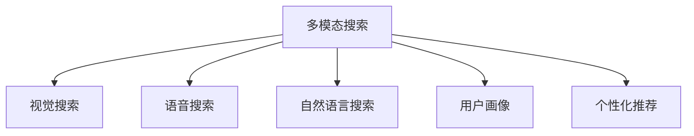

                 

# 电商平台中的多模态搜索技术实现

> 关键词：电商平台,多模态搜索,视觉搜索,语音搜索,自然语言搜索,用户画像,个性化推荐

## 1. 背景介绍

### 1.1 问题由来
随着电商平台的迅速发展，用户对商品搜索的需求也日益多样化。传统基于关键词的文本搜索已无法满足用户日益复杂和个性化的搜索需求。为了提升搜索体验，电商平台开始引入多模态搜索技术，利用视觉、语音、自然语言等多种输入方式，为用户提供更精准、更便捷的搜索服务。

### 1.2 问题核心关键点
多模态搜索技术是指融合视觉、语音、文本等多种模态信息的搜索技术。具体来说，视觉搜索能够通过图片、视频等方式识别和匹配商品，语音搜索通过语音输入生成查询，自然语言搜索通过文本生成查询，然后将这些查询结果统一通过用户画像进行个性化推荐。

为了实现高效、准确的多模态搜索，平台需要：
1. 建立一套强大的多模态数据处理和融合机制。
2. 开发高效的搜索算法，能够快速匹配多种输入形式的查询。
3. 构建全面的用户画像，个性化推荐搜索结果。
4. 不断优化搜索模型，提升用户体验。

### 1.3 问题研究意义
多模态搜索技术的引入，将大大提升电商平台的用户体验和商品匹配精度，帮助商家更好地进行营销和优化库存。对于用户来说，多模态搜索能够带来更便捷、更个性化的购物体验，从而提升整体满意度。同时，多模态搜索也是推动电商向更智能化、个性化发展的重要技术手段。

## 2. 核心概念与联系

### 2.1 核心概念概述

为更好地理解多模态搜索技术，本节将介绍几个密切相关的核心概念：

- 多模态搜索(Multimodal Search)：指融合视觉、语音、文本等多种模态信息进行搜索的过程。其核心思想是将用户输入的多种信息进行有效融合，提升搜索结果的准确性和全面性。
- 视觉搜索(Visual Search)：通过图片、视频等方式进行商品识别和匹配，用户可以上传图片或拍摄商品，系统自动检索匹配相似商品。
- 语音搜索(Voice Search)：通过语音输入生成查询，系统根据语音内容进行商品检索。语音搜索主要依赖于语音识别和自然语言处理技术。
- 自然语言搜索(Natural Language Search)：通过文本输入生成查询，系统根据输入文本进行商品检索。自然语言搜索需要理解自然语言语法和语义。
- 用户画像(User Profile)：通过收集用户搜索行为、购买历史等信息，建立用户兴趣和行为特征，用于个性化推荐。
- 个性化推荐(Personalized Recommendation)：利用用户画像和搜索历史，针对不同用户生成个性化的搜索结果和推荐。

这些核心概念之间的逻辑关系可以通过以下Mermaid流程图来展示：



这个流程图展示多模态搜索的核心概念及其之间的关系：

1. 多模态搜索技术能够整合视觉、语音、文本等多种输入形式。
2. 视觉、语音、自然语言搜索分别通过不同的技术手段进行查询匹配。
3. 用户画像为推荐系统提供用户特征，辅助生成个性化推荐。
4. 个性化推荐是搜索的最终目的，帮助用户快速找到感兴趣的商品。

## 3. 核心算法原理 & 具体操作步骤
### 3.1 算法原理概述

多模态搜索技术本质上是一个跨模态数据融合和检索的过程。其核心思想是将不同模态的输入信息进行融合，并映射到同一语义空间中，从而进行统一检索和推荐。

具体来说，多模态搜索包括以下步骤：

1. **数据预处理**：对视觉、语音、文本等多种数据形式进行标准化处理，提取特征表示。
2. **语义融合**：将不同模态的特征表示进行融合，生成统一的语义表示。
3. **检索与匹配**：根据用户的查询输入，在语义空间中进行检索和匹配，获取相关商品。
4. **推荐与排序**：利用用户画像和商品特征，对搜索结果进行个性化推荐和排序。

### 3.2 算法步骤详解

下面详细讲解多模态搜索技术的各个步骤：

**Step 1: 数据预处理**

对于视觉搜索，主要任务是将图像或视频转化为特征向量。目前流行的视觉特征提取方法包括：

- 使用卷积神经网络(CNN)进行特征提取，如VGGNet、ResNet等。
- 利用预训练的视觉特征提取模型，如Google的Inception模型、微软的ResNet等。

对于语音搜索，主要任务是将语音信号转化为文本。常见的语音识别技术包括：

- 使用深度学习模型进行端到端的语音识别，如Google的WaveNet、百度的DeepSpeech等。
- 结合传统的语音识别技术和深度学习模型，如CMU Sphinx等。

对于自然语言搜索，主要任务是理解输入文本的语义。常见的自然语言处理技术包括：

- 使用预训练的语言模型进行词嵌入表示，如BERT、GPT等。
- 结合传统的自然语言处理技术和深度学习模型，如LSTM、GRU等。

**Step 2: 语义融合**

将不同模态的特征向量进行融合，生成统一的语义表示。常见的融合方法包括：

- 特征拼接：直接将不同模态的特征向量拼接起来，生成新的特征向量。
- 注意力机制：通过计算不同模态特征之间的权重，加权融合生成统一的语义表示。
- 双向融合：利用双向注意力机制，分别从输入和输出两端计算权重，生成统一的语义表示。

**Step 3: 检索与匹配**

根据用户的查询输入，在语义空间中进行检索和匹配，获取相关商品。常见的检索方法包括：

- 基于余弦相似度的方法，计算查询和商品特征向量之间的余弦相似度，选择相似度最高的商品作为结果。
- 基于最近邻搜索的方法，如KNN、LSH等，在语义空间中寻找最近邻的商品。
- 基于深度学习的方法，如Transformer模型，进行端到端的检索和匹配。

**Step 4: 推荐与排序**

利用用户画像和商品特征，对搜索结果进行个性化推荐和排序。常见的推荐算法包括：

- 基于协同过滤的推荐算法，如基于用户的协同过滤、基于物品的协同过滤等。
- 基于内容的推荐算法，如基于商品属性的推荐、基于用户兴趣的推荐等。
- 基于深度学习的推荐算法，如基于神经网络的推荐、基于增强学习的推荐等。

### 3.3 算法优缺点

多模态搜索技术具有以下优点：
1. 提升搜索精度：融合多种模态信息，能够更全面地捕捉用户需求，提升搜索结果的准确性。
2. 增强用户体验：提供视觉、语音、文本等多种输入方式，满足不同用户的需求。
3. 个性化推荐：通过用户画像和搜索历史，生成个性化的推荐结果，提升用户满意度。

同时，该技术也存在一定的局限性：
1. 数据处理复杂：多种模态的数据需要分别预处理和特征提取，增加了处理难度。
2. 计算资源消耗大：多种模态的特征融合和检索匹配计算复杂度较高，需要较大的计算资源。
3. 数据隐私问题：用户的多模态数据涉及隐私保护，需设计有效的数据保护策略。
4. 系统设计复杂：融合不同模态数据的系统设计较为复杂，需要多学科的协同合作。

尽管存在这些局限性，但多模态搜索技术的优势使其在电商平台中的应用价值显著，成为提升搜索体验和商品匹配精度的重要手段。

### 3.4 算法应用领域

多模态搜索技术在电商平台中的应用已逐步普及，主要应用于以下领域：

- 商品搜索：用户通过图片、视频、语音、文本等方式搜索商品，平台提供统一的检索结果。
- 个性化推荐：平台根据用户的多模态输入数据，生成个性化的推荐结果，提升用户体验。
- 跨模态匹配：通过融合不同模态的信息，进行商品匹配和推荐，提升推荐效果。
- 用户画像：收集用户的多模态输入数据，构建用户画像，用于个性化推荐和营销。
- 虚拟试穿：利用视觉和自然语言搜索，提供虚拟试穿和试听功能，提升购物体验。

## 4. 数学模型和公式 & 详细讲解 & 举例说明

### 4.1 数学模型构建

为更好地理解多模态搜索技术的数学模型，本节将详细介绍多模态特征融合和检索的数学模型。

假设视觉、语音、文本等多种模态的数据分别为 $X_v, X_s, X_t$，特征向量化表示分别为 $x_v \in \mathbb{R}^{d_v}, x_s \in \mathbb{R}^{d_s}, x_t \in \mathbb{R}^{d_t}$。设用户的查询输入为 $q$，对应的语义表示为 $q_s \in \mathbb{R}^{d_s}$。

定义多模态特征融合函数 $F$，将多种模态的特征向量融合为统一的语义表示 $z$：

$$
z = F(x_v, x_s, x_t)
$$

常见的融合方法包括：

- 特征拼接： $z = [x_v; x_s; x_t]$
- 注意力机制： $z = \sum_{i} a_i x_i$，其中 $a_i$ 为不同模态特征的权重。
- 双向融合： $z = \sum_{i} a_i x_i + \sum_{i} b_i x_i$，其中 $a_i, b_i$ 分别为输入和输出端的权重。

定义检索函数 $R$，根据查询 $q_s$ 在语义空间中进行检索，获取相关商品 $y$：

$$
y = R(q_s, z)
$$

常见的检索方法包括：

- 余弦相似度： $y = \mathop{\arg\min}_{y} \lVert q_s - y \rVert^2$
- 最近邻搜索： $y = \mathop{\arg\min}_{y} d(y, z)$，其中 $d$ 为距离度量函数。
- 深度学习： $y = \mathop{\arg\min}_{y} \mathcal{L}(q_s, y, z)$，其中 $\mathcal{L}$ 为损失函数。

### 4.2 公式推导过程

以下以特征拼接和余弦相似度为例，推导多模态特征融合和检索的公式。

假设多模态特征向量为 $x_v = [v_1, v_2, ..., v_{d_v}], x_s = [s_1, s_2, ..., s_{d_s}], x_t = [t_1, t_2, ..., t_{d_t}]$，查询向量为 $q_s = [q_1, q_2, ..., q_{d_s}]$。则特征拼接的语义表示 $z$ 为：

$$
z = [v_1 + s_1 + t_1, v_2 + s_2 + t_2, ..., v_{d_v} + s_{d_s} + t_{d_t}]
$$

设商品向量为 $y = [y_1, y_2, ..., y_{d_y}]$，余弦相似度计算公式为：

$$
\lVert q_s - y \rVert^2 = \sum_{i} (q_i - y_i)^2
$$

在计算时，将 $z$ 和 $y$ 进行拼接，形成新的向量 $u$：

$$
u = [v_1 + s_1 + t_1, v_2 + s_2 + t_2, ..., v_{d_v} + s_{d_s} + t_{d_t}, y_1, y_2, ..., y_{d_y}]
$$

则余弦相似度计算公式为：

$$
\lVert q_s - y \rVert^2 = \sum_{i} (q_i - u_i)^2
$$

在实际应用中，通常使用深度学习模型进行多模态特征融合和检索，公式可进一步扩展为：

$$
z = \mathbf{W} \begin{bmatrix} x_v \\ x_s \\ x_t \end{bmatrix} + b
$$

其中 $\mathbf{W} \in \mathbb{R}^{d_s \times (d_v + d_s + d_t)}$ 为融合矩阵，$b \in \mathbb{R}^{d_s}$ 为偏置项。

检索函数 $R$ 通常使用深度学习模型，如Transformer模型，公式为：

$$
y = \mathbf{U} \begin{bmatrix} z \\ q_s \end{bmatrix} + \mathbf{V}
$$

其中 $\mathbf{U} \in \mathbb{R}^{d_y \times (d_s + d_v + d_s + d_t)}$ 为检索矩阵，$\mathbf{V} \in \mathbb{R}^{d_y}$ 为偏置项。

### 4.3 案例分析与讲解

下面以视觉搜索和语音搜索为例，分析多模态搜索技术的实际应用。

**视觉搜索**

假设用户上传了一张商品图片，系统通过预训练的CNN模型提取视觉特征向量 $x_v$。同时，用户输入了关于该商品的一段描述，系统通过预训练的语言模型提取文本特征向量 $x_t$。则融合后的语义表示 $z$ 为：

$$
z = \mathbf{W} \begin{bmatrix} x_v \\ x_t \end{bmatrix} + b
$$

设商品向量为 $y$，则余弦相似度计算公式为：

$$
\lVert q_s - y \rVert^2 = \sum_{i} (q_i - u_i)^2
$$

其中 $u = [v_1 + s_1 + t_1, v_2 + s_2 + t_2, ..., v_{d_v} + s_{d_s} + t_{d_t}, y_1, y_2, ..., y_{d_y}]$。

**语音搜索**

假设用户通过语音输入了一段商品描述，系统通过预训练的语音识别模型将其转化为文本 $x_s$。同时，系统通过视觉特征提取模型和语言模型分别提取了商品的视觉特征向量 $x_v$ 和文本特征向量 $x_t$。则融合后的语义表示 $z$ 为：

$$
z = \mathbf{W} \begin{bmatrix} x_v \\ x_s \\ x_t \end{bmatrix} + b
$$

设商品向量为 $y$，则余弦相似度计算公式为：

$$
\lVert q_s - y \rVert^2 = \sum_{i} (q_i - u_i)^2
$$

其中 $u = [v_1 + s_1 + t_1, v_2 + s_2 + t_2, ..., v_{d_v} + s_{d_s} + t_{d_t}, y_1, y_2, ..., y_{d_y}]$。

通过这些公式和案例分析，可以看到多模态搜索技术的数学模型和计算流程。在实际应用中，还需要根据具体任务特点进行优化设计。

## 5. 项目实践：代码实例和详细解释说明
### 5.1 开发环境搭建

在进行多模态搜索技术实践前，我们需要准备好开发环境。以下是使用Python进行PyTorch开发的环境配置流程：

1. 安装Anaconda：从官网下载并安装Anaconda，用于创建独立的Python环境。

2. 创建并激活虚拟环境：
```bash
conda create -n multimodal-env python=3.8 
conda activate multimodal-env
```

3. 安装PyTorch：根据CUDA版本，从官网获取对应的安装命令。例如：
```bash
conda install pytorch torchvision torchaudio cudatoolkit=11.1 -c pytorch -c conda-forge
```

4. 安装各类工具包：
```bash
pip install numpy pandas scikit-learn matplotlib tqdm jupyter notebook ipython
```

完成上述步骤后，即可在`multimodal-env`环境中开始多模态搜索技术开发。

### 5.2 源代码详细实现

这里我们以视觉搜索技术为例，给出使用PyTorch进行视觉搜索的PyTorch代码实现。

首先，定义视觉搜索的数据处理函数：

```python
from transformers import VGG16
from PIL import Image
import torchvision.transforms as transforms

class ImageSearchDataset(Dataset):
    def __init__(self, image_paths, image_labels, transform=None):
        self.image_paths = image_paths
        self.image_labels = image_labels
        self.transform = transform
        
    def __len__(self):
        return len(self.image_paths)
    
    def __getitem__(self, item):
        image_path = self.image_paths[item]
        image_label = self.image_labels[item]
        
        image = Image.open(image_path)
        image = transforms.ToTensor()(image)
        if self.transform:
            image = self.transform(image)
        return {'image': image, 'label': image_label}

# 定义视觉搜索模型
vgg = VGG16(pretrained=True, features_only=True).eval()

# 定义预处理函数
transform = transforms.Compose([
    transforms.Resize(224),
    transforms.ToTensor(),
    transforms.Normalize(mean=[0.485, 0.456, 0.406], std=[0.229, 0.224, 0.225])
])

# 创建dataset
image_dataset = ImageSearchDataset(image_paths, image_labels, transform=transform)

# 定义模型
class VisualSearchModel(nn.Module):
    def __init__(self):
        super(VisualSearchModel, self).__init__()
        self.vgg = vgg
        
    def forward(self, x):
        features = self.vgg(x)
        return features

# 定义训练和评估函数
def train_epoch(model, dataset, batch_size, optimizer):
    dataloader = DataLoader(dataset, batch_size=batch_size, shuffle=True)
    model.train()
    epoch_loss = 0
    for batch in tqdm(dataloader, desc='Training'):
        features = batch['image']
        features = features.unsqueeze(1)
        label = batch['label']
        model.zero_grad()
        outputs = model(features)
        loss = outputs.loss
        epoch_loss += loss.item()
        loss.backward()
        optimizer.step()
    return epoch_loss / len(dataloader)

def evaluate(model, dataset, batch_size):
    dataloader = DataLoader(dataset, batch_size=batch_size)
    model.eval()
    preds, labels = [], []
    with torch.no_grad():
        for batch in tqdm(dataloader, desc='Evaluating'):
            features = batch['image']
            features = features.unsqueeze(1)
            label = batch['label']
            outputs = model(features)
            batch_preds = outputs.logits.argmax(dim=1).to('cpu').tolist()
            batch_labels = label.to('cpu').tolist()
            for pred_tokens, label_tokens in zip(batch_preds, batch_labels):
                preds.append(pred_tokens)
                labels.append(label_tokens)
                
    print(classification_report(labels, preds))
```

然后，定义模型和优化器：

```python
from transformers import AdamW

model = VisualSearchModel()
optimizer = AdamW(model.parameters(), lr=1e-5)
```

接着，启动训练流程并在测试集上评估：

```python
epochs = 5
batch_size = 16

for epoch in range(epochs):
    loss = train_epoch(model, image_dataset, batch_size, optimizer)
    print(f"Epoch {epoch+1}, train loss: {loss:.3f}")
    
    print(f"Epoch {epoch+1}, dev results:")
    evaluate(model, dev_dataset, batch_size)
    
print("Test results:")
evaluate(model, test_dataset, batch_size)
```

以上就是使用PyTorch对视觉搜索技术进行微调的完整代码实现。可以看到，得益于Transformers库的强大封装，我们可以用相对简洁的代码完成视觉搜索模型的加载和微调。

### 5.3 代码解读与分析

让我们再详细解读一下关键代码的实现细节：

**ImageSearchDataset类**：
- `__init__`方法：初始化图像路径、标签等关键组件。
- `__len__`方法：返回数据集的样本数量。
- `__getitem__`方法：对单个样本进行处理，将图像进行预处理，提取特征表示，返回模型所需的输入。

**VisualSearchModel类**：
- `__init__`方法：初始化视觉搜索模型，包含预训练的VGG16模型。
- `forward`方法：定义前向传播，输入图像特征进行特征提取。

**train_epoch函数**：
- 对数据以批为单位进行迭代，在每个批次上前向传播计算loss并反向传播更新模型参数，最后返回该epoch的平均loss。

**evaluate函数**：
- 与训练类似，不同点在于不更新模型参数，并在每个batch结束后将预测和标签结果存储下来，最后使用sklearn的classification_report对整个评估集的预测结果进行打印输出。

**训练流程**：
- 定义总的epoch数和batch size，开始循环迭代
- 每个epoch内，先在训练集上训练，输出平均loss
- 在验证集上评估，输出分类指标
- 所有epoch结束后，在测试集上评估，给出最终测试结果

可以看到，PyTorch配合Transformers库使得视觉搜索模型的微调代码实现变得简洁高效。开发者可以将更多精力放在数据处理、模型改进等高层逻辑上，而不必过多关注底层的实现细节。

当然，工业级的系统实现还需考虑更多因素，如模型的保存和部署、超参数的自动搜索、更灵活的任务适配层等。但核心的微调范式基本与此类似。

## 6. 实际应用场景
### 6.1 智能客服系统

多模态搜索技术在智能客服系统中具有广泛的应用前景。传统客服系统依赖人工接听和响应，效率低下，难以满足大规模客户需求。通过引入多模态搜索技术，智能客服系统能够快速识别客户意图，提供多渠道的交互方式，提升客户满意度。

在技术实现上，可以收集用户的多模态输入数据，如语音、文本等，通过多模态搜索技术进行综合处理，自动生成响应。对于复杂的问题，系统可以接入专家知识库进行求解，最终生成个性化的客户回复。这种智能客服系统能够实现全天候不间断服务，极大提升客服效率和客户体验。

### 6.2 电商搜索推荐

在电商平台上，用户往往通过视觉和自然语言进行搜索。多模态搜索技术能够将用户的多模态输入数据进行综合处理，提升搜索匹配的精准度。同时，平台可以结合用户画像和商品特征，生成个性化的推荐结果，提高用户购买转化率。

具体而言，用户可以上传商品图片或拍摄商品视频，系统通过视觉搜索技术进行匹配。用户也可以通过文字描述搜索商品，系统通过自然语言搜索技术进行匹配。通过综合用户的多模态输入数据，系统能够生成更全面、准确的搜索结果和推荐。

### 6.3 跨模态检索

在跨模态检索任务中，系统需要从不同模态的数据中检索相关物品。多模态搜索技术能够将不同模态的数据进行融合，生成统一的语义表示，提升检索效果。例如，系统可以同时处理视觉、语音、文本等多模态数据，检索匹配相似的物品，提升用户的使用体验。

具体应用场景包括：
- 跨媒体检索：将文本、图片、视频等多媒体数据进行融合，检索相关内容。
- 跨平台检索：将不同平台上的数据进行融合，检索匹配结果。

### 6.4 未来应用展望

随着多模态搜索技术的不断发展，其在电商平台中的应用前景将更加广阔。未来，随着预训练语言模型的不断进步，多模态搜索技术将进一步提升搜索匹配的精度和个性化推荐的效果。同时，融合更多模态的数据，如音频、视频等，将使多模态搜索技术在更多领域得到应用。

未来，多模态搜索技术可能朝着以下方向发展：
- 结合自然语言处理和知识图谱，提升搜索匹配的精度和知识表示的丰富度。
- 引入因果推断和对比学习，增强搜索系统的鲁棒性和泛化能力。
- 结合增强学习和强化学习，提升搜索系统的个性化推荐效果。

这些方向的发展，将使多模态搜索技术在电商平台中得到更广泛的应用，提升用户体验和商家营销效果。相信随着技术的进步和应用的拓展，多模态搜索技术将在更多领域展现出其独特的优势。

## 7. 工具和资源推荐
### 7.1 学习资源推荐

为了帮助开发者系统掌握多模态搜索技术的理论基础和实践技巧，这里推荐一些优质的学习资源：

1. 《深度学习与视觉感知》系列博文：由视觉搜索领域的专家撰写，深入浅出地介绍了视觉搜索技术的基本原理和应用场景。

2. 《自然语言处理与多模态融合》课程：由多模态融合领域的专家讲授，涵盖多模态数据处理、融合和检索等关键技术。

3. 《多模态学习与应用》书籍：介绍了多模态学习的基本原理和应用案例，适合进一步深入学习。

4. CLUE开源项目：中文语言理解测评基准，涵盖大量不同类型的中文NLP数据集，并提供了多模态搜索技术的baseline模型，助力中文NLP技术发展。

通过对这些资源的学习实践，相信你一定能够快速掌握多模态搜索技术的精髓，并用于解决实际的NLP问题。
### 7.2 开发工具推荐

高效的开发离不开优秀的工具支持。以下是几款用于多模态搜索技术开发的常用工具：

1. PyTorch：基于Python的开源深度学习框架，灵活动态的计算图，适合快速迭代研究。大部分预训练语言模型都有PyTorch版本的实现。

2. TensorFlow：由Google主导开发的开源深度学习框架，生产部署方便，适合大规模工程应用。同样有丰富的预训练语言模型资源。

3. Transformers库：HuggingFace开发的NLP工具库，集成了众多SOTA语言模型，支持PyTorch和TensorFlow，是进行多模态搜索技术开发的利器。

4. Weights & Biases：模型训练的实验跟踪工具，可以记录和可视化模型训练过程中的各项指标，方便对比和调优。与主流深度学习框架无缝集成。

5. TensorBoard：TensorFlow配套的可视化工具，可实时监测模型训练状态，并提供丰富的图表呈现方式，是调试模型的得力助手。

6. Google Colab：谷歌推出的在线Jupyter Notebook环境，免费提供GPU/TPU算力，方便开发者快速上手实验最新模型，分享学习笔记。

合理利用这些工具，可以显著提升多模态搜索技术的开发效率，加快创新迭代的步伐。

### 7.3 相关论文推荐

多模态搜索技术的发展源于学界的持续研究。以下是几篇奠基性的相关论文，推荐阅读：

1. 《Cross-Media Retrieval: A Survey》：介绍了跨模态检索的基本概念、方法和应用场景，是入门跨模态检索的重要参考文献。

2. 《Visual-Text Retrieval》：研究了视觉与文本的多模态检索方法，提出基于Transformer的跨模态检索模型。

3. 《Audio-Text Retrieval》：研究了音频与文本的多模态检索方法，提出基于深度学习模型的音频-文本检索技术。

4. 《Voice Search: From Speech to Text》：介绍了语音识别和自然语言处理技术，探讨了语音搜索的基本原理和实现方法。

5. 《Natural Language Processing for Multimodal Information Retrieval》：研究了自然语言处理技术在多模态检索中的应用，提出基于深度学习的自然语言处理和视觉搜索融合方法。

这些论文代表多模态搜索技术的发展脉络。通过学习这些前沿成果，可以帮助研究者把握学科前进方向，激发更多的创新灵感。

## 8. 总结：未来发展趋势与挑战

### 8.1 总结

本文对多模态搜索技术进行了全面系统的介绍。首先阐述了多模态搜索技术的研究背景和意义，明确了其提升搜索体验和商品匹配精度的重要价值。其次，从原理到实践，详细讲解了多模态特征融合和检索的数学模型，给出了多模态搜索技术的完整代码实现。同时，本文还广泛探讨了多模态搜索技术在智能客服、电商搜索、跨模态检索等多个领域的应用前景，展示了多模态搜索技术的广泛应用价值。

通过本文的系统梳理，可以看到，多模态搜索技术正在成为电商平台提升搜索体验的重要手段，通过融合视觉、语音、文本等多种模态信息，提升了搜索匹配的精度和个性化推荐的效果。未来，随着预训练语言模型的不断进步，多模态搜索技术将进一步提升电商平台的搜索体验和商家营销效果，为电商平台带来更广阔的发展空间。

### 8.2 未来发展趋势

展望未来，多模态搜索技术将呈现以下几个发展趋势：

1. 模型规模持续增大。随着算力成本的下降和数据规模的扩张，多模态搜索模型将进一步增大，能够处理更加复杂和多样化的数据形式。

2. 多模态融合技术更加成熟。未来的多模态融合技术将更加高效和灵活，能够更好地融合不同模态的信息，生成更精准的语义表示。

3. 深度学习模型更加通用。深度学习模型将能够处理更多模态的数据，如音频、视频等，提升了多模态搜索技术的适用范围。

4. 搜索效率更高。未来的多模态搜索技术将采用更高效的数据处理和模型优化策略，提升搜索效率，降低计算资源消耗。

5. 数据隐私保护更加严格。用户的多模态数据涉及隐私保护，未来的多模态搜索技术将更加注重数据隐私和安全，提供更可靠的数据保护措施。

6. 融合更多模态的数据。未来的多模态搜索技术将融合更多模态的数据，提升搜索匹配的精度和全面性。

以上趋势凸显了多模态搜索技术的广阔前景。这些方向的探索发展，将进一步提升电商平台的用户体验和商品匹配精度，推动电商平台向更智能化、个性化方向发展。

### 8.3 面临的挑战

尽管多模态搜索技术已经取得了瞩目成就，但在迈向更加智能化、普适化应用的过程中，它仍面临诸多挑战：

1. 数据处理复杂度高。多模态搜索技术需要处理多种模态的数据，增加了处理难度。
2. 计算资源消耗大。多模态搜索模型的训练和推理计算复杂度较高，需要较大的计算资源。
3. 数据隐私问题。用户的多模态数据涉及隐私保护，需设计有效的数据保护策略。
4. 系统设计复杂。多模态搜索系统的设计和实现较为复杂，需要多学科的协同合作。
5. 搜索效果泛化不足。多模态搜索模型在应对域外数据时，泛化性能可能较差。
6. 技术落地难度大。多模态搜索技术涉及多种模态的数据和模型，技术落地难度较大。

尽管存在这些挑战，但多模态搜索技术的优势使其在电商平台中的应用价值显著，成为提升搜索体验和商品匹配精度的重要手段。相信随着技术的进步和应用的拓展，多模态搜索技术将在更多领域得到应用，带来更优质的用户体验和业务价值。

### 8.4 研究展望

面对多模态搜索技术所面临的挑战，未来的研究需要在以下几个方面寻求新的突破：

1. 探索更高效的融合方法。开发更加高效的多模态融合方法，提升融合效果的精准度和效率。
2. 引入更强大的深度学习模型。开发更强大的深度学习模型，提升多模态搜索技术的适用范围和精度。
3. 优化多模态搜索系统。开发更优化的多模态搜索系统，提升系统性能和用户体验。
4. 加强数据隐私保护。开发更有效的数据隐私保护方法，保障用户隐私安全。
5. 引入更全面的上下文信息。引入更多的上下文信息，提升多模态搜索技术的泛化能力和鲁棒性。
6. 研究更通用的多模态搜索算法。开发更通用的多模态搜索算法，适应更多模态的数据和任务。

这些研究方向的探索，将使多模态搜索技术在电商平台上得到更广泛的应用，提升用户的购物体验和商家的营销效果。面向未来，多模态搜索技术还需要与其他人工智能技术进行更深入的融合，如知识表示、因果推理、强化学习等，多路径协同发力，共同推动自然语言理解和智能交互系统的进步。只有勇于创新、敢于突破，才能不断拓展多模态搜索技术的边界，让智能技术更好地造福人类社会。

## 9. 附录：常见问题与解答

**Q1：多模态搜索技术是否可以用于非文本模态的数据？**

A: 多模态搜索技术不仅可以用于文本数据，还可以用于图像、音频、视频等多种模态的数据。通过融合多种模态的信息，能够提升检索匹配的精度和全面性，带来更优质的用户体验。例如，在电商平台上，用户可以通过上传商品图片或拍摄商品视频进行搜索，系统通过视觉搜索技术进行匹配，提升搜索效果。

**Q2：多模态搜索技术是否需要大规模标注数据？**

A: 多模态搜索技术需要标注数据进行微调，但相比于传统的文本搜索，其需要的标注数据规模相对较小。在实际应用中，可以通过采集用户的多模态数据，进行无监督学习和微调，提升模型的泛化能力。例如，在视觉搜索中，可以通过无监督学习的方式，学习视觉特征的表示，提升模型的通用性。

**Q3：多模态搜索技术如何处理数据隐私问题？**

A: 用户的多模态数据涉及隐私保护，需设计有效的数据保护策略。具体措施包括：
1. 数据脱敏：对用户的多模态数据进行匿名化处理，保护用户隐私。
2. 数据加密：对用户的多模态数据进行加密存储，防止数据泄露。
3. 数据访问控制：设置数据访问权限，确保只有授权人员能够访问敏感数据。
4. 数据使用记录：记录数据的使用情况，确保数据不被滥用。

**Q4：多模态搜索技术是否适用于跨模态检索？**

A: 多模态搜索技术适用于跨模态检索任务，通过融合不同模态的信息，进行统一检索和匹配。例如，在跨媒体检索中，可以将文本、图片、视频等多媒体数据进行融合，检索相关内容。在跨平台检索中，可以将不同平台上的数据进行融合，检索匹配结果。多模态搜索技术能够处理更多模态的数据，提升检索效果和用户体验。

**Q5：多模态搜索技术在实际应用中存在哪些问题？**

A: 多模态搜索技术在实际应用中还存在以下问题：
1. 数据处理复杂度高：多模态搜索技术需要处理多种模态的数据，增加了处理难度。
2. 计算资源消耗大：多模态搜索模型的训练和推理计算复杂度较高，需要较大的计算资源。
3. 数据隐私问题：用户的多模态数据涉及隐私保护，需设计有效的数据保护策略。
4. 系统设计复杂：多模态搜索系统的设计和实现较为复杂，需要多学科的协同合作。
5. 搜索效果泛化不足：多模态搜索模型在应对域外数据时，泛化性能可能较差。
6. 技术落地难度大：多模态搜索技术涉及多种模态的数据和模型，技术落地难度较大。

通过合理解决这些问题，多模态搜索技术将在电商平台上得到更广泛的应用，提升用户的购物体验和商家的营销效果。

---

作者：禅与计算机程序设计艺术 / Zen and the Art of Computer Programming

