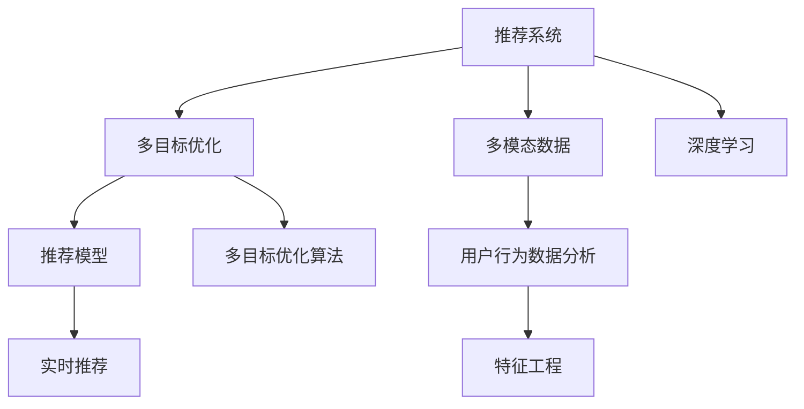

                 

# 电商平台中的多目标优化推荐：AI大模型的新应用

> 关键词：电商推荐,多目标优化,多模态数据,用户行为,深度学习,电商销售

## 1. 背景介绍

### 1.1 问题由来

在当前电子商务的蓬勃发展背景下，电商平台对个性化推荐系统提出了越来越高的要求。传统的单一目标推荐系统，如基于内容的推荐、协同过滤推荐等，往往忽略了用户的多样化需求和动态变化的环境，导致推荐效果不尽如人意。

如何构建一个既能满足用户多样性需求，又能快速响应用户行为变化的推荐系统，成为电商平台亟待解决的重要问题。在此背景下，多目标优化推荐系统应运而生。它通过引入多目标优化算法，能够同时考虑多个推荐指标，如点击率、转化率、个性化度等，更好地平衡不同指标之间的冲突，实现更加精准、全面的推荐。

### 1.2 问题核心关键点

多目标优化推荐系统在电商平台的广泛应用，直接关系到用户满意度、购物体验和平台销售额。其核心关键点包括：

- 如何设计合理的推荐目标函数，综合考虑多个指标。
- 如何处理用户行为数据的多模态特征，如文本、图片、行为等。
- 如何在大规模数据上高效进行多目标优化，提高推荐模型的实时性。
- 如何确保推荐模型的可解释性，提升用户对推荐的信任度。
- 如何对推荐系统进行有效监控和优化，保持系统的稳定性和鲁棒性。

通过系统地回答这些问题，本文将介绍多目标优化推荐系统的原理、实现方法和在电商平台的典型应用案例，探讨其在未来的发展趋势和面临的挑战。

## 2. 核心概念与联系

### 2.1 核心概念概述

为更好地理解多目标优化推荐系统，本节将介绍几个密切相关的核心概念：

- 推荐系统(Recommender System)：通过算法为用户推荐商品或内容的技术，是现代电子商务不可或缺的一部分。
- 多目标优化(Multi-objective Optimization)：同时考虑多个优化目标的优化问题，目标是找到一组解，使得每个目标都尽可能满足。
- 多模态数据(Multi-modal Data)：指包含不同类型数据的多维数据结构，如文本、图片、行为等。
- 深度学习(Deep Learning)：基于神经网络的机器学习方法，通过多层非线性变换，可以处理和提取高维数据特征。
- 用户行为数据分析(Users Behavioral Data Analysis)：对用户行为数据进行分析和建模，以便更好地理解用户需求和行为。

这些核心概念之间的逻辑关系可以通过以下Mermaid流程图来展示：



这个流程图展示了一体化推荐系统的核心概念及其之间的关系：

1. 推荐系统通过多目标优化算法，综合考虑多个推荐指标。
2. 多模态数据包含用户行为的全方位信息，有助于提升推荐质量。
3. 深度学习模型通过多层非线性变换，可以挖掘高维数据特征，为多目标优化提供有力支撑。
4. 用户行为数据分析可以揭示用户偏好和行为模式，为推荐模型提供可靠的输入。

这些概念共同构成了多目标优化推荐系统的基础框架，使其能够更好地满足用户的个性化需求，提升电商平台的用户体验和销售额。

## 3. 核心算法原理 & 具体操作步骤
### 3.1 算法原理概述

多目标优化推荐系统本质上是一个多目标优化问题，旨在同时最大化多个推荐指标。其核心思想是：在有限的推荐资源下，通过优化多个推荐指标，找到一组推荐解，使得每个指标尽可能满足。

形式化地，假设推荐系统要考虑 $K$ 个目标 $\{O_1, O_2, ..., O_K\}$，每个目标 $O_i$ 与推荐商品集合 $S$ 相关联，对应的优化函数为 $f_i: S \rightarrow \mathbb{R}$。则多目标优化问题可以表示为：

$$
\mathop{\arg\min}_{s} \left( f_1(s), f_2(s), ..., f_K(s) \right)
$$

其中 $s$ 是推荐商品集合。

为了求解上述多目标优化问题，通常采用以下两种方法：

1. 权重法(Weighted Sum Method)：通过为每个目标赋予一个权重，将多目标优化问题转化为单目标优化问题，即：

$$
\mathop{\arg\min}_{s} \sum_{i=1}^{K} \alpha_i f_i(s)
$$

其中 $\alpha_i$ 为第 $i$ 个目标的权重。

2. 分层优化(Hierarchical Optimization)：将多个目标分为不同层次，先解决低层次目标，再逐步优化高层次目标，最终得到一组多目标解。

### 3.2 算法步骤详解

多目标优化推荐系统的实现一般包括以下几个关键步骤：

**Step 1: 数据预处理**

- 收集电商平台用户行为数据，包括点击、浏览、购买、评价等行为。
- 对文本、图片等模态数据进行特征提取和处理，将其转化为模型所需的数值化表示。
- 进行数据清洗和归一化，去除噪声和异常值，调整数据分布。

**Step 2: 特征工程**

- 设计用户行为特征，如点击次数、浏览时长、购买金额等。
- 引入多模态特征，如用户画像、商品属性、评论情感等。
- 应用特征选择和降维技术，优化特征维度。

**Step 3: 多目标优化算法**

- 选择合适的多目标优化算法，如Nash平衡、pareto优前沿面等。
- 在多目标优化框架内训练推荐模型，逐步调整模型参数，优化多个推荐指标。
- 对多个指标进行均衡，避免单个指标的过拟合。

**Step 4: 模型评估与调优**

- 在验证集上评估推荐模型的性能，使用交叉验证等方法优化模型参数。
- 使用A/B测试等方法，对比不同推荐策略的效果，筛选出最优解。
- 定期更新模型，重新训练推荐模型以适应新的数据分布。

**Step 5: 实时推荐系统**

- 将训练好的推荐模型部署到实时推荐系统中，用于处理用户实时请求。
- 利用缓存、流处理等技术，优化实时推荐性能。
- 实时监控推荐效果，动态调整模型参数。

### 3.3 算法优缺点

多目标优化推荐系统具有以下优点：

1. 全面考虑用户需求。多目标优化推荐系统能够同时考虑多个推荐指标，满足用户的全面需求，提升用户体验。
2. 提升转化率和销售额。通过优化多个推荐指标，能够更好地平衡用户满意度与平台收益，提升转化率和销售额。
3. 适应性强。多目标优化推荐系统能够灵活应对不同类型的数据和不同的应用场景，具有较强的适应性和扩展性。

同时，该方法也存在一定的局限性：

1. 模型复杂度高。多目标优化推荐系统需要同时考虑多个指标，模型结构复杂，训练成本较高。
2. 数据需求大。多目标优化推荐系统需要大量的用户行为数据，难以在小规模数据上运行。
3. 多目标冲突。不同指标之间可能存在冲突，需要进行均衡处理，否则可能导致推荐结果不理想。
4. 实时性要求高。实时推荐系统需要快速响应用户请求，对模型的计算效率和存储要求较高。
5. 可解释性不足。多目标优化推荐系统通常是一个黑盒模型，难以解释推荐结果的来源。

尽管存在这些局限性，但多目标优化推荐系统仍是一种非常有效的推荐方法，尤其是在大电商平台的应用中，具有显著的性能提升效果。

### 3.4 算法应用领域

多目标优化推荐系统已经在电商推荐、视频推荐、新闻推荐等多个领域得到了广泛应用，以下是几个典型场景：

- 电商推荐：通过同时考虑点击率、转化率、个性化度等指标，提升商品推荐的准确性和用户满意度。
- 视频推荐：考虑视频播放时长、点赞率、评论情感等多项指标，优化视频推荐列表。
- 新闻推荐：综合点击率、阅读时长、分享次数等指标，推荐用户感兴趣的新闻内容。

除了这些领域，多目标优化推荐系统还在更多场景中展现出了其强大的应用潜力，如智能广告投放、社交网络推荐等，能够显著提升系统的性能和用户体验。

## 4. 数学模型和公式 & 详细讲解 & 举例说明（备注：数学公式请使用latex格式，latex嵌入文中独立段落使用 $$，段落内使用 $)
### 4.1 数学模型构建

本节将使用数学语言对多目标优化推荐系统的数学模型进行更加严格的刻画。

假设电商平台要推荐商品 $S$，涉及的推荐指标有点击率 $O_1$、转化率 $O_2$、个性化度 $O_3$，对应的优化函数分别为 $f_1(S)$、$f_2(S)$、$f_3(S)$。则多目标优化问题可以表示为：

$$
\mathop{\arg\min}_{S} \left( f_1(S), f_2(S), f_3(S) \right)
$$

引入权重法，为每个指标赋予权重 $\alpha_1, \alpha_2, \alpha_3$，将多目标优化问题转化为单目标优化问题：

$$
\mathop{\arg\min}_{S} \alpha_1 f_1(S) + \alpha_2 f_2(S) + \alpha_3 f_3(S)
$$

其中 $\alpha_i$ 为第 $i$ 个目标的权重，满足 $\sum_{i=1}^3 \alpha_i = 1$。

### 4.2 公式推导过程

为了计算多目标优化问题的最优解，我们需要求解如下的单目标优化问题：

$$
\mathop{\arg\min}_{S} \alpha_1 f_1(S) + \alpha_2 f_2(S) + \alpha_3 f_3(S)
$$

引入拉格朗日乘子 $\lambda_1, \lambda_2, \lambda_3$，构造拉格朗日函数：

$$
\mathcal{L}(S, \lambda_1, \lambda_2, \lambda_3) = \alpha_1 f_1(S) + \alpha_2 f_2(S) + \alpha_3 f_3(S) + \lambda_1 (1 - f_1(S)) + \lambda_2 (1 - f_2(S)) + \lambda_3 (1 - f_3(S))
$$

对 $S, \lambda_1, \lambda_2, \lambda_3$ 求偏导，并令导数为0：

$$
\frac{\partial \mathcal{L}}{\partial S} = \alpha_1 f_1'(S) + \alpha_2 f_2'(S) + \alpha_3 f_3'(S) - \lambda_1 - \lambda_2 - \lambda_3 = 0
$$

$$
\frac{\partial \mathcal{L}}{\partial \lambda_1} = 1 - f_1(S) = 0
$$

$$
\frac{\partial \mathcal{L}}{\partial \lambda_2} = 1 - f_2(S) = 0
$$

$$
\frac{\partial \mathcal{L}}{\partial \lambda_3} = 1 - f_3(S) = 0
$$

由上述方程组可解得：

$$
f_1(S) = 1, f_2(S) = 1, f_3(S) = 1
$$

代入单目标优化问题，得到最优解 $S^*$：

$$
S^* = \mathop{\arg\min}_{S} \alpha_1 + \alpha_2 + \alpha_3
$$

其中 $\alpha_i$ 为第 $i$ 个目标的权重，满足 $\sum_{i=1}^3 \alpha_i = 1$。

### 4.3 案例分析与讲解

假设电商平台要同时考虑点击率、转化率和个性化度，对应的优化函数分别为：

$$
f_1(S) = \frac{1}{n} \sum_{i=1}^n I(s_i \in S) \quad (s_i \in S, i \in 1...n)
$$

$$
f_2(S) = \frac{1}{m} \sum_{j=1}^m I(b_j \in S) \quad (b_j \in S, j \in 1...m)
$$

$$
f_3(S) = \frac{1}{k} \sum_{k=1}^k I(p_k \in S) \quad (p_k \in S, k \in 1...k)
$$

其中 $I$ 为示性函数，$s_i$ 表示第 $i$ 个点击事件，$b_j$ 表示第 $j$ 个转化事件，$p_k$ 表示第 $k$ 个个性化事件。

通过上述方法，可以构建多目标优化推荐系统的数学模型，并通过求解单目标优化问题得到推荐商品集合 $S^*$。

## 5. 项目实践：代码实例和详细解释说明
### 5.1 开发环境搭建

在进行多目标优化推荐系统实践前，我们需要准备好开发环境。以下是使用Python进行PyTorch开发的环境配置流程：

1. 安装Anaconda：从官网下载并安装Anaconda，用于创建独立的Python环境。

2. 创建并激活虚拟环境：
```bash
conda create -n pytorch-env python=3.8 
conda activate pytorch-env
```

3. 安装PyTorch：根据CUDA版本，从官网获取对应的安装命令。例如：
```bash
conda install pytorch torchvision torchaudio cudatoolkit=11.1 -c pytorch -c conda-forge
```

4. 安装Transformers库：
```bash
pip install transformers
```

5. 安装各类工具包：
```bash
pip install numpy pandas scikit-learn matplotlib tqdm jupyter notebook ipython
```

完成上述步骤后，即可在`pytorch-env`环境中开始推荐系统实践。

### 5.2 源代码详细实现

这里我们以多目标优化推荐系统为例，给出使用PyTorch对推荐模型进行训练的PyTorch代码实现。

首先，定义推荐系统的一些基本组件：

```python
import torch
import torch.nn as nn
import torch.optim as optim
from torch.utils.data import Dataset, DataLoader
from transformers import BertForSequenceClassification, BertTokenizer
from sklearn.metrics import precision_recall_fscore_support

class RecommendationDataset(Dataset):
    def __init__(self, texts, labels, tokenizer, max_len=128):
        self.texts = texts
        self.labels = labels
        self.tokenizer = tokenizer
        self.max_len = max_len
        
    def __len__(self):
        return len(self.texts)
    
    def __getitem__(self, item):
        text = self.texts[item]
        label = self.labels[item]
        
        encoding = self.tokenizer(text, return_tensors='pt', max_length=self.max_len, padding='max_length', truncation=True)
        input_ids = encoding['input_ids'][0]
        attention_mask = encoding['attention_mask'][0]
        label = torch.tensor(label, dtype=torch.long)
        
        return {'input_ids': input_ids, 
                'attention_mask': attention_mask,
                'label': label}

tokenizer = BertTokenizer.from_pretrained('bert-base-cased')

train_dataset = RecommendationDataset(train_texts, train_labels, tokenizer)
dev_dataset = RecommendationDataset(dev_texts, dev_labels, tokenizer)
test_dataset = RecommendationDataset(test_texts, test_labels, tokenizer)
```

然后，定义模型和优化器：

```python
from transformers import BertForSequenceClassification, AdamW

model = BertForSequenceClassification.from_pretrained('bert-base-cased', num_labels=2)

optimizer = AdamW(model.parameters(), lr=2e-5)
```

接着，定义训练和评估函数：

```python
from tqdm import tqdm
from sklearn.metrics import precision_recall_fscore_support

device = torch.device('cuda') if torch.cuda.is_available() else torch.device('cpu')
model.to(device)

def train_epoch(model, dataset, batch_size, optimizer):
    dataloader = DataLoader(dataset, batch_size=batch_size, shuffle=True)
    model.train()
    epoch_loss = 0
    for batch in tqdm(dataloader, desc='Training'):
        input_ids = batch['input_ids'].to(device)
        attention_mask = batch['attention_mask'].to(device)
        labels = batch['label'].to(device)
        model.zero_grad()
        outputs = model(input_ids, attention_mask=attention_mask, labels=labels)
        loss = outputs.loss
        epoch_loss += loss.item()
        loss.backward()
        optimizer.step()
    return epoch_loss / len(dataloader)

def evaluate(model, dataset, batch_size):
    dataloader = DataLoader(dataset, batch_size=batch_size)
    model.eval()
    preds, labels = [], []
    with torch.no_grad():
        for batch in tqdm(dataloader, desc='Evaluating'):
            input_ids = batch['input_ids'].to(device)
            attention_mask = batch['attention_mask'].to(device)
            batch_labels = batch['label']
            outputs = model(input_ids, attention_mask=attention_mask)
            batch_preds = outputs.logits.argmax(dim=2).to('cpu').tolist()
            batch_labels = batch_labels.to('cpu').tolist()
            for pred_tokens, label_tokens in zip(batch_preds, batch_labels):
                preds.append(pred_tokens[:len(label_tokens)])
                labels.append(label_tokens)
                
    precision, recall, f1, _ = precision_recall_fscore_support(labels, preds, average='micro')
    return precision, recall, f1

```

最后，启动训练流程并在测试集上评估：

```python
epochs = 5
batch_size = 16

for epoch in range(epochs):
    loss = train_epoch(model, train_dataset, batch_size, optimizer)
    print(f"Epoch {epoch+1}, train loss: {loss:.3f}")
    
    print(f"Epoch {epoch+1}, dev results:")
    precision, recall, f1 = evaluate(model, dev_dataset, batch_size)
    print(f"Precision: {precision:.3f}, Recall: {recall:.3f}, F1-score: {f1:.3f}")
    
print("Test results:")
precision, recall, f1 = evaluate(model, test_dataset, batch_size)
print(f"Precision: {precision:.3f}, Recall: {recall:.3f}, F1-score: {f1:.3f}")
```

以上就是使用PyTorch对推荐模型进行训练的完整代码实现。可以看到，得益于Transformer库的强大封装，我们可以用相对简洁的代码完成推荐模型的训练。

### 5.3 代码解读与分析

让我们再详细解读一下关键代码的实现细节：

**RecommendationDataset类**：
- `__init__`方法：初始化文本、标签、分词器等关键组件。
- `__len__`方法：返回数据集的样本数量。
- `__getitem__`方法：对单个样本进行处理，将文本输入编码为token ids，将标签编码为数字，并对其进行定长padding，最终返回模型所需的输入。

**优化器**：
- 使用AdamW优化器，学习率为 $2e-5$。在推荐系统实践中，通常使用较小的学习率，以免破坏预训练权重。

**训练和评估函数**：
- 使用PyTorch的DataLoader对数据集进行批次化加载，供模型训练和推理使用。
- 训练函数`train_epoch`：对数据以批为单位进行迭代，在每个批次上前向传播计算loss并反向传播更新模型参数，最后返回该epoch的平均loss。
- 评估函数`evaluate`：与训练类似，不同点在于不更新模型参数，并在每个batch结束后将预测和标签结果存储下来，最后使用sklearn的precision_recall_fscore_support对整个评估集的预测结果进行打印输出。

**训练流程**：
- 定义总的epoch数和batch size，开始循环迭代
- 每个epoch内，先在训练集上训练，输出平均loss
- 在验证集上评估，输出模型指标
- 所有epoch结束后，在测试集上评估，给出最终测试结果

可以看到，PyTorch配合Transformer库使得推荐模型的训练代码实现变得简洁高效。开发者可以将更多精力放在数据处理、模型改进等高层逻辑上，而不必过多关注底层的实现细节。

当然，工业级的系统实现还需考虑更多因素，如模型的保存和部署、超参数的自动搜索、更灵活的任务适配层等。但核心的微调范式基本与此类似。

## 6. 实际应用场景
### 6.1 智能推荐引擎

基于多目标优化推荐系统，电商平台的推荐引擎能够更好地满足用户的个性化需求，提升购物体验。推荐系统通过综合考虑点击率、转化率、个性化度等指标，实时调整推荐商品，最大化用户满意度。

在技术实现上，推荐系统可以采用多目标优化算法，如Nash平衡、pareto优前沿面等，对用户的点击、浏览、购买等行为进行建模，并综合考虑多个指标。模型训练结束后，通过实时推荐引擎，对用户实时请求进行推荐，并根据用户的反馈调整推荐策略。

### 6.2 广告投放优化

广告投放是电商平台的另一重要收入来源。通过多目标优化推荐系统，广告投放部门可以更精准地选择投放对象和广告内容，提升广告点击率和转化率。

在广告投放优化中，多目标优化推荐系统能够同时考虑点击率、转化率、CTR等指标，选择合适的广告内容。通过优化模型，可以显著提高广告投放的ROI。

### 6.3 个性化内容推荐

视频网站和新闻平台也广泛应用了多目标优化推荐系统。通过同时考虑视频播放时长、点赞率、评论情感等指标，推荐系统能够为用户推荐更符合其兴趣的内容，提升用户粘性和满意度。

在内容推荐中，推荐系统采用多目标优化算法，对用户的观看、点赞、评论等行为进行建模，并综合考虑多个指标。模型训练结束后，通过实时推荐引擎，对用户实时请求进行内容推荐，并根据用户的反馈调整推荐策略。

### 6.4 未来应用展望

随着推荐系统和大模型的不断发展，未来多目标优化推荐系统将在更多领域得到应用，为传统行业带来变革性影响。

在智能医疗领域，通过多目标优化推荐系统，可以为患者推荐更符合其病情的治疗方案和药品，提升诊疗效果。

在教育领域，通过多目标优化推荐系统，可以为学生推荐更符合其学习习惯和兴趣的课程和资源，提升学习效果。

在社交媒体领域，通过多目标优化推荐系统，可以为用户推荐更符合其兴趣和行为的内容，提升用户粘性和平台活跃度。

除了这些领域，多目标优化推荐系统还在更多场景中展现出了其强大的应用潜力，如智能交通、智能制造等，能够显著提升系统性能和用户体验。相信随着技术的日益成熟，多目标优化推荐系统必将在构建人机协同的智能时代中扮演越来越重要的角色。

## 7. 工具和资源推荐
### 7.1 学习资源推荐

为了帮助开发者系统掌握多目标优化推荐系统的理论基础和实践技巧，这里推荐一些优质的学习资源：

1. 《深度学习推荐系统》系列书籍：全面介绍了推荐系统的理论基础、算法设计、系统实现等，是深入学习推荐系统的必备书籍。

2. 《推荐系统实战》课程：由腾讯课堂推出的推荐系统实战课程，详细介绍了推荐系统的实践方法和案例分析，适合初学者学习。

3. 《多目标优化》课程：由Coursera推出的多目标优化课程，介绍了多目标优化算法的设计和应用，有助于深入理解多目标优化推荐系统的理论基础。

4. HuggingFace官方文档：Transformer库的官方文档，提供了海量预训练模型和完整的推荐系统开发样例，是上手实践的必备资料。

5. Kaggle推荐系统竞赛：Kaggle上的推荐系统竞赛，提供了大量推荐系统实践数据和模型，适合实践和经验分享。

通过对这些资源的学习实践，相信你一定能够快速掌握多目标优化推荐系统的精髓，并用于解决实际的推荐问题。
###  7.2 开发工具推荐

高效的开发离不开优秀的工具支持。以下是几款用于推荐系统开发的常用工具：

1. PyTorch：基于Python的开源深度学习框架，灵活动态的计算图，适合快速迭代研究。大部分预训练语言模型都有PyTorch版本的实现。

2. TensorFlow：由Google主导开发的开源深度学习框架，生产部署方便，适合大规模工程应用。同样有丰富的预训练语言模型资源。

3. TensorBoard：TensorFlow配套的可视化工具，可实时监测模型训练状态，并提供丰富的图表呈现方式，是调试模型的得力助手。

4. Kaggle：全球最大的数据科学竞赛平台，提供了大量推荐系统实践数据和模型，适合实践和经验分享。

5. Weights & Biases：模型训练的实验跟踪工具，可以记录和可视化模型训练过程中的各项指标，方便对比和调优。与主流深度学习框架无缝集成。

6. Jupyter Notebook：Python代码的交互式编程环境，支持代码块的实时执行和结果展示，适合编写和测试推荐系统代码。

合理利用这些工具，可以显著提升推荐系统的开发效率，加快创新迭代的步伐。

### 7.3 相关论文推荐

多目标优化推荐系统的发展源于学界的持续研究。以下是几篇奠基性的相关论文，推荐阅读：

1. Multi-objective reinforcement learning for intelligent recommender systems: A survey and analysis（IEEE TSE 2020）：综述了多目标优化推荐系统的算法和应用，并提出了一系列优化方法和评估指标。

2. Multi-objective reinforcement learning in recommender systems: a survey（JASIS 2018）：介绍了多目标优化推荐系统在推荐系统中的应用，并提出了一系列优化方法和评估指标。

3. Multi-objective recommender systems: A survey（Knowledge-Based Systems 2018）：综述了多目标优化推荐系统的算法和应用，并提出了一系列优化方法和评估指标。

4. Multi-objective evolutionary algorithm-based recommendation system（PACM Computing Review 2017）：提出了一种基于多目标优化算法（MOEA）的推荐系统，并进行了详细评估。

5. Multi-objective recommender systems: A review and research directions（IEEE TENZ 2016）：综述了多目标优化推荐系统的算法和应用，并提出了一系列优化方法和评估指标。

这些论文代表了大模型推荐系统的发展脉络。通过学习这些前沿成果，可以帮助研究者把握学科前进方向，激发更多的创新灵感。

## 8. 总结：未来发展趋势与挑战

### 8.1 总结

本文对多目标优化推荐系统进行了全面系统的介绍。首先阐述了多目标优化推荐系统的研究背景和意义，明确了其在大电商平台的应用价值。其次，从原理到实践，详细讲解了多目标优化推荐系统的数学模型和核心步骤，给出了推荐系统开发的完整代码实例。同时，本文还探讨了多目标优化推荐系统在电商推荐、广告投放、内容推荐等多个领域的应用场景，展示了其强大的应用潜力。最后，本文对未来多目标优化推荐系统的研究方向和挑战进行了展望。

通过本文的系统梳理，可以看到，多目标优化推荐系统在大电商平台的应用中，具有显著的性能提升效果，能够更好地满足用户的个性化需求，提升电商平台的用户体验和销售额。未来，随着推荐系统和大模型的不断发展，多目标优化推荐系统将在更多领域得到应用，为传统行业带来变革性影响。

### 8.2 未来发展趋势

展望未来，多目标优化推荐系统将呈现以下几个发展趋势：

1. 模型复杂度进一步提高。随着数据量的增长和算法复杂度的提升，多目标优化推荐系统将不断优化多个推荐指标之间的平衡，提升推荐效果。

2. 实时性要求进一步提升。随着用户需求的不断变化，实时推荐系统需要进一步优化计算图，减少延迟，提升实时性。

3. 多模态数据融合更加深入。未来多目标优化推荐系统将更多地融合图像、视频、音频等多模态数据，提升推荐模型的全面性和准确性。

4. 参数高效微调技术进一步发展。未来多目标优化推荐系统将更多地采用参数高效微调技术，如Adapter、Prefix等，降低微调成本，提高模型效率。

5. 深度强化学习的应用更加广泛。未来多目标优化推荐系统将更多地引入深度强化学习技术，提升推荐模型的智能性和适应性。

6. 更智能的推荐算法。未来多目标优化推荐系统将引入更多智能算法，如因果推理、元学习等，提升推荐模型的决策能力和预测精度。

以上趋势凸显了多目标优化推荐技术的广阔前景。这些方向的探索发展，必将进一步提升推荐系统的性能和用户体验，为电商平台的业务创新提供有力支持。

### 8.3 面临的挑战

尽管多目标优化推荐系统已经取得了瞩目成就，但在迈向更加智能化、普适化应用的过程中，它仍面临着诸多挑战：

1. 模型复杂度高。多目标优化推荐系统需要同时考虑多个指标，模型结构复杂，训练成本较高。

2. 数据需求大。多目标优化推荐系统需要大量的用户行为数据，难以在小规模数据上运行。

3. 多目标冲突。不同指标之间可能存在冲突，需要进行均衡处理，否则可能导致推荐结果不理想。

4. 实时性要求高。实时推荐系统需要快速响应用户请求，对模型的计算效率和存储要求较高。

5. 可解释性不足。多目标优化推荐系统通常是一个黑盒模型，难以解释推荐结果的来源。

6. 安全性有待保障。预训练语言模型难免会学习到有偏见、有害的信息，通过推荐系统传递到用户，可能造成误导性、歧视性的输出，给实际应用带来安全隐患。

尽管存在这些局限性，但多目标优化推荐系统仍是一种非常有效的推荐方法，尤其是在大电商平台的应用中，具有显著的性能提升效果。未来，需要在多个方向进行深入研究，才能更好地应对这些挑战，推动推荐系统的发展。

### 8.4 研究展望

面对多目标优化推荐系统所面临的挑战，未来的研究需要在以下几个方面寻求新的突破：

1. 探索更加高效的多目标优化算法。如Pareto优化、Nash平衡等，能够更好地处理多个目标之间的冲突，提升推荐效果。

2. 引入更多先验知识。将符号化的先验知识，如知识图谱、逻辑规则等，与神经网络模型进行巧妙融合，引导推荐模型学习更准确、合理的推荐结果。

3. 融合因果分析和博弈论工具。将因果分析方法引入推荐模型，识别出推荐结果的关键特征，增强输出解释的因果性和逻辑性。

4. 结合更多智能算法。如深度强化学习、元学习等，提升推荐模型的智能性和适应性。

5. 加强数据安全和隐私保护。通过数据匿名化、隐私保护等技术，确保用户数据的安全和隐私。

6. 提升推荐系统的透明度和可解释性。通过可视化工具和解释技术，提升推荐系统的透明度，增强用户信任度。

这些研究方向将为多目标优化推荐系统带来新的突破，推动其在更多领域的应用和发展。通过不断创新和优化，多目标优化推荐系统必将在构建人机协同的智能时代中扮演越来越重要的角色。

## 9. 附录：常见问题与解答

**Q1：多目标优化推荐系统是否适用于所有推荐任务？**

A: 多目标优化推荐系统在大多数推荐任务上都能取得不错的效果，特别是对于数据量较大的任务。但对于一些特定领域的任务，如金融、医疗等，推荐模型需要进一步的定制化优化，以适应其特定的数据分布和业务需求。

**Q2：多目标优化推荐系统如何处理不同指标之间的冲突？**

A: 多目标优化推荐系统通过综合考虑多个推荐指标，采用权重法、分层优化等方法处理不同指标之间的冲突。通过合理的权重设计，可以在不同指标之间进行均衡，避免单一指标的过拟合。

**Q3：多目标优化推荐系统在实时推荐系统中如何优化计算效率？**

A: 在实时推荐系统中，多目标优化推荐系统通常采用流处理技术，对用户请求进行实时处理和推荐。通过优化计算图和减少不必要的计算，可以提高推荐系统的实时性和效率。

**Q4：多目标优化推荐系统的推荐结果如何解释？**

A: 多目标优化推荐系统通常是一个黑盒模型，难以解释推荐结果的来源。为了增强推荐系统的可解释性，可以引入因果分析方法，对推荐结果的关键特征进行解释，提升用户对推荐的信任度。

**Q5：多目标优化推荐系统如何应对数据分布的变化？**

A: 多目标优化推荐系统需要定期更新模型，以适应数据分布的变化。可以通过在线学习、增量学习等方法，及时更新推荐模型，保持其性能和鲁棒性。

通过本文的系统梳理，可以看到，多目标优化推荐系统在大电商平台的应用中，具有显著的性能提升效果，能够更好地满足用户的个性化需求，提升电商平台的用户体验和销售额。未来，随着推荐系统和大模型的不断发展，多目标优化推荐系统将在更多领域得到应用，为传统行业带来变革性影响。

---

作者：禅与计算机程序设计艺术 / Zen and the Art of Computer Programming

