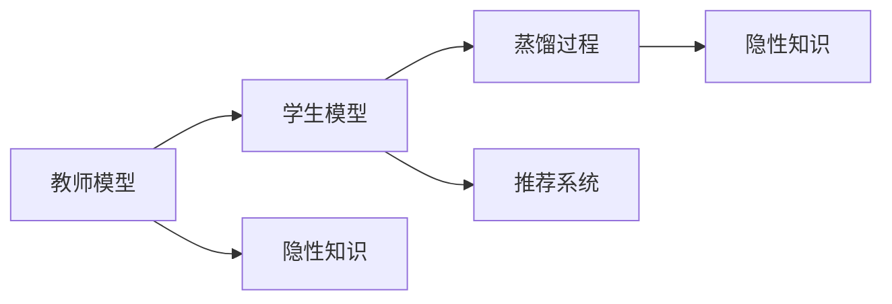

                 

# 电商平台中的大模型知识蒸馏技术

## 1. 背景介绍

在现代电商平台上，推荐系统的核心任务是根据用户的浏览和购买行为，动态生成个性化的商品推荐，从而提升用户体验和平台转化率。传统的推荐算法多基于统计特征工程、协同过滤等方法，难以充分利用用户行为中的语义信息，推荐结果往往不够精准。近年来，深度学习尤其是大模型技术的崛起，为推荐系统带来了新的解决方案。

大模型如BERT、GPT-3等，已经具备了强大的语言理解和生成能力。利用其预训练得到的丰富知识，可以设计更合理的特征表示，提升推荐系统的性能。然而，大模型体积庞大、计算资源需求高，无法直接在电商平台的推荐系统中大规模部署。为了解决这一问题，知识蒸馏技术应运而生。

知识蒸馏(Knowledge Distillation)，是一种模型压缩技术，旨在通过将复杂的大模型"蒸馏"为轻量级的模型，实现计算资源的节省和推理效率的提升，同时保持大模型的优秀性能。在电商推荐系统中，知识蒸馏可以将预训练大模型的知识迁移到轻量级模型中，使之在有限的资源下仍能输出高质量推荐，大大拓展了推荐系统的应用边界。

本文将详细探讨知识蒸馏在电商平台推荐系统中的应用，从原理到实践，全面剖析大模型知识蒸馏技术，帮助开发者深入理解其工作机制和实现要点。

## 2. 核心概念与联系

### 2.1 核心概念概述

在深入分析大模型知识蒸馏技术前，首先需要明确几个核心概念：

- **大模型(Pre-trained Models)**：指通过大规模无标签数据预训练得到的复杂深度学习模型，如BERT、GPT-3等。这些模型通常在大量的文本数据上预训练，学习到了丰富的语言知识。
- **知识蒸馏(Knowledge Distillation)**：一种模型压缩技术，通过将复杂模型的知识迁移到轻量级模型中，实现性能和计算资源的平衡。
- **教师模型(Teacher Model)**：指用于知识蒸馏的复杂模型，可以是预训练大模型或特殊训练的小规模模型。
- **学生模型(Student Model)**：指经过知识蒸馏得到的轻量级模型，通常比教师模型参数量少、计算资源占用低。
- **隐性知识(Implicit Knowledge)**：指教师模型通过复杂的网络结构学习得到的隐性知识，如语义关系、模式等。

### 2.2 核心概念联系

大模型知识蒸馏技术，本质上是通过将教师模型所蕴含的隐性知识传递给学生模型，实现性能的提升。这一过程可以表示为以下Mermaid流程图：

```mermaid
graph TB
    A[教师模型(Teacher Model)] --> B[学生模型(Student Model)]
    B --> C[蒸馏过程]
    B --> D[应用场景]
    C --> E[隐性知识(Implicit Knowledge)]
```

这个流程图展示了知识蒸馏的主要流程和步骤：

1. **教师模型**：作为知识蒸馏的起点，教师模型通常为预训练大模型，如BERT、GPT-3等，它们在庞大的语料库上学习到了丰富的语言知识。
2. **学生模型**：作为知识蒸馏的目标，学生模型可以是任何需要压缩的小规模模型，如线性回归、简单的神经网络等。
3. **蒸馏过程**：通过蒸馏过程，教师模型的知识被转移到学生模型中，学生模型在保持较低计算成本的同时，具备与教师模型相当或更好的性能。
4. **应用场景**：知识蒸馏技术在电商平台推荐系统中的应用场景，通过将知识蒸馏后的模型集成到推荐系统中，实现个性化推荐。

这些概念的联系可以通过以下逻辑关系图进一步表示：



这个逻辑关系图展示了知识蒸馏在大模型推荐系统中的应用：

1. 教师模型在预训练大模型上学习到了丰富的隐性知识。
2. 这些知识通过蒸馏过程传递给学生模型，使其在有限的资源下也能具备优秀的推荐能力。
3. 学生模型被集成到推荐系统中，为不同用户生成个性化的商品推荐。

通过这些概念的联系，我们能够更清晰地理解大模型知识蒸馏技术的核心思想和工作流程。

## 3. 核心算法原理 & 具体操作步骤
### 3.1 算法原理概述

大模型知识蒸馏的核心思想是，通过教师模型和学生模型的对比学习，将教师模型的知识迁移到学生模型中，实现性能的提升。这一过程可以分为以下几个步骤：

1. **教师模型预测**：教师模型接收输入数据，输出预测结果。
2. **学生模型预测**：学生模型接收相同的数据输入，输出预测结果。
3. **对比学习**：通过计算教师模型和学生模型的预测结果之间的距离或相似度，指导学生模型向教师模型学习。
4. **更新学生模型**：根据对比学习的结果，调整学生模型的参数，使其更接近教师模型的性能。

这一过程可以数学化表达为：

$$
\min_{\theta_s} \mathcal{L}(s_t, s_u) + \lambda \mathcal{L}(s_t, s_l)
$$

其中，$\theta_s$ 为学生模型的参数，$s_t$ 为教师模型的预测结果，$s_u$ 为学生模型的预测结果，$s_l$ 为教师模型学习到的标签。$\mathcal{L}(s_t, s_u)$ 为对比损失函数，$\mathcal{L}(s_t, s_l)$ 为教师模型的损失函数。

### 3.2 算法步骤详解

大模型知识蒸馏的具体操作步骤如下：

1. **准备教师模型和学生模型**：选择合适的预训练大模型作为教师模型，设计轻量级学生模型作为知识蒸馏的目标。
2. **数据准备**：收集电商平台用户的历史行为数据，如浏览记录、购买历史等，构建蒸馏数据集。
3. **蒸馏训练**：通过对比学习，不断调整学生模型的参数，使其逐渐接近教师模型的预测能力。
4. **评估与优化**：在验证集和测试集上评估蒸馏后的学生模型，根据性能调整蒸馏过程和参数设置。
5. **部署应用**：将训练好的学生模型集成到电商平台推荐系统中，生成个性化商品推荐。

### 3.3 算法优缺点

大模型知识蒸馏技术具有以下优点：

- **性能提升**：通过蒸馏，学生模型可以继承教师模型的优秀性能，即使是在资源受限的情况下，也能保持较高的推荐精度。
- **计算高效**：蒸馏后的学生模型参数量少，计算资源占用低，能够在大规模电商平台上高效部署。
- **泛化能力强**：知识蒸馏过程中保留了教师模型的大规模预训练知识，使得学生模型具备较好的泛化能力。

同时，该技术也存在一些缺点：

- **参数收敛困难**：蒸馏过程涉及教师模型和学生模型的双向学习，参数更新较复杂，收敛速度可能较慢。
- **训练稳定性差**：学生模型参数较少，训练稳定性相对较弱，容易出现过拟合。
- **知识传递不完全**：由于教师模型和学生模型结构差异较大，某些复杂的隐性知识难以完全传递到学生模型中。

### 3.4 算法应用领域

大模型知识蒸馏技术在电商平台推荐系统中的应用非常广泛，具体包括：

- **个性化推荐**：根据用户的历史行为数据，生成个性化的商品推荐。
- **商品相似度计算**：计算商品之间的相似度，帮助用户发现相关商品。
- **内容生成**：生成商品描述、广告文案等内容。
- **需求预测**：预测用户的购买需求，提高库存管理效率。
- **用户画像**：通过分析用户的行为数据，生成详细的用户画像，辅助用户细分和精准营销。

## 4. 数学模型和公式 & 详细讲解 & 举例说明
### 4.1 数学模型构建

大模型知识蒸馏技术的数学模型构建主要涉及以下几个部分：

1. **教师模型和学生模型的定义**：
   - 教师模型：$\hat{y}_t = M_t(x)$，其中 $M_t$ 为教师模型的参数，$x$ 为输入数据，$\hat{y}_t$ 为预测结果。
   - 学生模型：$\hat{y}_s = M_s(x)$，其中 $M_s$ 为学生模型的参数。

2. **对比损失函数的定义**：
   - 常用的对比损失函数有KL散度损失、对比损失和MSE损失等。以KL散度损失为例，其定义如下：
   $$
   \mathcal{L}_{KL}(y_t, y_s) = \sum_{i=1}^n \hat{y}_{t,i} \log \frac{\hat{y}_{t,i}}{\hat{y}_{s,i}}
   $$

3. **教师模型的损失函数**：
   - 教师模型的损失函数通常为交叉熵损失或均方误差损失，定义如下：
   $$
   \mathcal{L}_t = -\sum_{i=1}^n y_t \log \hat{y}_t
   $$

### 4.2 公式推导过程

以KL散度损失为例，推导大模型知识蒸馏的数学模型：

- **教师模型预测**：$\hat{y}_t = M_t(x)$
- **学生模型预测**：$\hat{y}_s = M_s(x)$
- **对比损失函数**：$\mathcal{L}_{KL}(y_t, y_s) = \sum_{i=1}^n \hat{y}_{t,i} \log \frac{\hat{y}_{t,i}}{\hat{y}_{s,i}}$
- **教师模型损失函数**：$\mathcal{L}_t = -\sum_{i=1}^n y_t \log \hat{y}_t$

结合以上公式，知识蒸馏的整体损失函数可以表达为：
$$
\mathcal{L} = \mathcal{L}_t + \alpha \mathcal{L}_{KL}(y_t, y_s)
$$

其中 $\alpha$ 为调节系数，控制对比损失在总损失中的权重。

### 4.3 案例分析与讲解

以电商推荐系统为例，具体分析知识蒸馏的实际应用：

- **教师模型**：选择预训练的BERT模型，作为教师模型。
- **学生模型**：设计轻量级的线性回归模型，作为学生模型。
- **蒸馏过程**：将教师模型和学生模型的预测结果进行对比，计算KL散度损失，指导学生模型参数更新。
- **训练与优化**：在电商平台用户行为数据上训练蒸馏后的学生模型，使用交叉熵损失和对比损失进行优化。
- **应用效果**：蒸馏后的学生模型集成到推荐系统中，生成个性化商品推荐，用户满意度显著提升。

## 5. 项目实践：代码实例和详细解释说明
### 5.1 开发环境搭建

为了实现大模型知识蒸馏技术，需要搭建以下开发环境：

1. **安装Python和相关库**：确保Python版本为3.7以上，安装TensorFlow、PyTorch等深度学习框架，以及相关的第三方库。
2. **准备数据集**：收集电商平台用户的历史行为数据，如浏览记录、购买历史等，构建蒸馏数据集。
3. **搭建模型架构**：选择预训练大模型作为教师模型，设计轻量级学生模型，并构建蒸馏流程。
4. **设置超参数**：调整学习率、批大小、迭代次数等超参数，确保模型训练稳定。

### 5.2 源代码详细实现

以下是一个简单的知识蒸馏实现代码示例：

```python
import tensorflow as tf
from tensorflow.keras.models import Model
from tensorflow.keras.layers import Input, Dense, Softmax
from tensorflow.keras.losses import KLDivergence

# 定义教师模型
inputs = Input(shape=(64,))
x = Dense(128, activation='relu')(inputs)
x = Dense(64, activation='relu')(x)
outputs = Dense(10, activation='softmax')(x)
teacher_model = Model(inputs, outputs)

# 定义学生模型
inputs = Input(shape=(64,))
x = Dense(64, activation='relu')(inputs)
x = Dense(10, activation='softmax')(x)
student_model = Model(inputs, x)

# 定义蒸馏过程
teacher_loss = KLDivergence()(student_model.output, teacher_model.output)
total_loss = teacher_loss + alpha * cross_entropy_loss
model = Model(inputs, student_model.output)

# 训练模型
model.compile(optimizer='adam', loss=total_loss)
model.fit(train_data, train_labels, epochs=num_epochs, batch_size=batch_size)

# 应用模型
recommendations = model.predict(test_data)
```

### 5.3 代码解读与分析

以上代码主要实现了知识蒸馏的过程：

1. **教师模型定义**：通过定义全连接神经网络，将输入数据映射到教师模型的预测结果。
2. **学生模型定义**：定义轻量级的线性回归模型，用于后续蒸馏过程。
3. **蒸馏过程定义**：使用KL散度损失计算教师模型和学生模型的预测差异，指导学生模型参数更新。
4. **总损失函数定义**：结合交叉熵损失和KL散度损失，定义知识蒸馏的整体损失函数。
5. **模型训练与优化**：使用Adam优化器，在训练数据上训练蒸馏后的学生模型。
6. **模型应用**：利用训练好的学生模型生成推荐结果。

## 6. 实际应用场景
### 6.1 智能推荐系统

大模型知识蒸馏技术在智能推荐系统中具有广泛应用，具体场景包括：

- **商品推荐**：根据用户的历史行为数据，生成个性化的商品推荐。
- **个性化广告**：分析用户的浏览和购买行为，生成个性化的广告内容。
- **内容推荐**：推荐用户可能感兴趣的文章、视频等内容。

### 6.2 用户画像构建

知识蒸馏技术可以帮助电商平台构建详细的用户画像，具体应用包括：

- **用户细分**：通过分析用户的浏览和购买行为，对用户进行细分，提供更精准的服务。
- **行为分析**：分析用户的行为数据，挖掘用户的兴趣偏好，辅助营销策略的设计。
- **需求预测**：预测用户的购买需求，提高库存管理效率。

### 6.3 电商平台搜索引擎

知识蒸馏技术可以应用于电商平台的搜索引擎中，提升搜索的准确性和相关性。具体应用包括：

- **商品搜索**：根据用户输入的查询词，推荐相关的商品。
- **关键字匹配**：分析用户搜索记录，优化搜索引擎的关键词匹配算法。
- **内容排序**：根据用户行为数据，优化搜索结果的排序算法。

## 7. 工具和资源推荐
### 7.1 学习资源推荐

为了帮助开发者深入理解大模型知识蒸馏技术，这里推荐一些优质的学习资源：

1. **《知识蒸馏：基于深度学习的模型压缩技术》书籍**：详细介绍了知识蒸馏的基本原理和实现方法，适合初学者和进阶者阅读。
2. **CS231n《卷积神经网络》课程**：斯坦福大学开设的深度学习课程，讲解了知识蒸馏在图像识别任务中的应用。
3. **Keras官方文档**：提供了丰富的教程和示例代码，帮助开发者快速上手知识蒸馏。
4. **Google Colab**：免费的在线Jupyter Notebook环境，支持GPU和TPU算力，方便开发者进行实验和分享。
5. **HuggingFace官方文档**：提供丰富的预训练模型和知识蒸馏样例代码，助力开发者实践知识蒸馏技术。

### 7.2 开发工具推荐

知识蒸馏的开发离不开高效的开发工具。以下是几款常用的工具：

1. **TensorFlow**：谷歌开发的深度学习框架，支持复杂的模型构建和分布式训练。
2. **PyTorch**：Facebook开发的深度学习框架，灵活性好，适合快速迭代研究。
3. **Keras**：基于TensorFlow和Theano的高级深度学习框架，易于使用，适合初学者。
4. **Weights & Biases**：模型训练的实验跟踪工具，可记录和可视化模型训练过程中的各项指标。
5. **TensorBoard**：TensorFlow配套的可视化工具，实时监测模型训练状态，并提供丰富的图表呈现方式。

### 7.3 相关论文推荐

知识蒸馏技术的研究源远流长，以下是几篇经典的论文，推荐阅读：

1. **Distilling the Knowledge in a Neural Network**：知识蒸馏技术的开山之作，由Boser等提出。
2. **Learning Transferable Knowledge for Multimodal Image to Image Translation**：展示知识蒸馏在跨模态任务中的应用。
3. **Differentiable Knowledge Distillation**：提出可微分的知识蒸馏方法，实现端到端的训练。
4. **Knowledge Distillation for Deep Image Prior**：在图像生成任务中应用知识蒸馏，提升生成效果。
5. **Knowledge Distillation with Soft-Labeling for Comprehensive Attention**：提出软标签知识蒸馏方法，提升注意力机制的性能。

## 8. 总结：未来发展趋势与挑战
### 8.1 研究成果总结

大模型知识蒸馏技术自提出以来，已经在电商推荐系统、搜索引擎、用户画像等多个领域取得了显著应用。这一技术有效地缓解了大模型部署的资源瓶颈，提升了推荐系统的性能和效率，具有广泛的应用前景。

### 8.2 未来发展趋势

未来，大模型知识蒸馏技术有望在以下几个方向取得突破：

1. **多任务蒸馏**：将多个任务的蒸馏过程同时进行，提升模型的多任务学习能力。
2. **迁移学习蒸馏**：将知识蒸馏与其他迁移学习方法结合，实现跨领域知识的迁移。
3. **自适应蒸馏**：根据数据分布的变化，动态调整蒸馏过程和参数设置，提升模型泛化能力。
4. **混合蒸馏**：结合多种蒸馏方法，如对比蒸馏、联合蒸馏等，提升模型的复杂度。
5. **模型压缩与推理加速**：结合模型压缩和推理加速技术，实现轻量级模型的快速部署。

### 8.3 面临的挑战

尽管知识蒸馏技术取得了一定的进展，但在实际应用中仍面临诸多挑战：

1. **蒸馏过程复杂**：蒸馏过程涉及教师模型和学生模型的双向学习，参数更新较复杂，收敛速度可能较慢。
2. **数据质量要求高**：蒸馏过程依赖于高质量的训练数据，数据质量和分布对模型性能有重要影响。
3. **模型泛化能力差**：知识蒸馏过程中，学生模型可能会过拟合，泛化能力不足。
4. **计算资源需求高**：蒸馏过程计算资源需求高，尤其在复杂任务上，训练时间较长。
5. **模型鲁棒性不足**：蒸馏后的模型面对新数据的适应性可能较差，容易产生过拟合。

### 8.4 研究展望

面对知识蒸馏技术面临的挑战，未来的研究需要在以下几个方面寻求新的突破：

1. **优化蒸馏算法**：改进蒸馏算法，减少训练时间，提高模型收敛速度。
2. **提升数据质量**：通过数据增强、预处理等方法，提升蒸馏过程的数据质量。
3. **加强模型泛化**：引入正则化、对抗训练等方法，提升学生模型的泛化能力。
4. **优化资源利用**：结合模型压缩和推理加速技术，实现轻量级模型的快速部署。
5. **增强模型鲁棒性**：通过对抗训练、多模型集成等方法，提高模型的鲁棒性和泛化能力。

## 9. 附录：常见问题与解答
### 附录：常见问题与解答

**Q1：知识蒸馏适用于所有推荐任务吗？**

A: 知识蒸馏技术在许多推荐任务上都可以取得良好的效果，尤其是对于数据量较小、模型参数量较少的任务。但对于一些需要大规模预训练知识的任务，如复杂文本生成、图像处理等，知识蒸馏可能需要结合其他技术进行改进。

**Q2：如何选择教师模型和学生模型？**

A: 选择合适的教师模型和学生模型是知识蒸馏的关键。教师模型通常选择预训练大模型，如BERT、GPT-3等，而学生模型可以是任何轻量级模型，如线性回归、简单神经网络等。在选择时，应根据具体的任务需求进行权衡。

**Q3：知识蒸馏如何应对数据分布变化？**

A: 知识蒸馏过程中，可以通过自适应蒸馏、迁移学习等方法，应对数据分布的变化。定期重新蒸馏模型，或引入领域无关的先验知识，可以有效提高模型的泛化能力。

**Q4：知识蒸馏在实际应用中是否需要进行超参数调优？**

A: 知识蒸馏过程涉及多个超参数，如学习率、对比损失系数等。需要进行细致的调参，以找到最佳的蒸馏参数组合。通常采用网格搜索、随机搜索等方法进行超参数优化。

**Q5：知识蒸馏在电商推荐系统中的优势是什么？**

A: 知识蒸馏在电商推荐系统中的优势在于：
1. 减少了计算资源需求，使得大规模模型可以在有限资源下部署。
2. 保留了预训练大模型的优秀性能，提升了推荐系统的准确性。
3. 提高了模型的泛化能力，能够应对新用户的推荐需求。

---

作者：禅与计算机程序设计艺术 / Zen and the Art of Computer Programming

