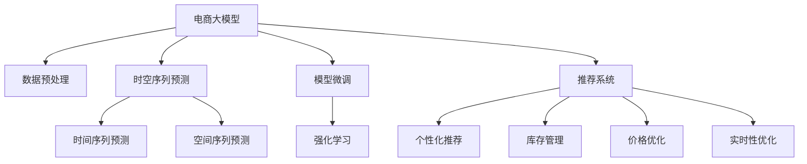

                 

# 电商平台中的时空序列预测：AI大模型的新应用

> 关键词：
- 电商大模型
- 时空序列预测
- Transformer
- 时间序列
- 空间序列
- 模型微调
- 强化学习
- 推荐系统
- 预测精度
- 实时性

## 1. 背景介绍

### 1.1 问题由来

随着电商行业的发展，平台用户行为呈现出复杂的时空序列特征，如商品浏览序列、购买序列、搜索序列等。通过分析这些序列数据，可以发现用户的购物习惯、偏好，并以此为基础进行个性化推荐、库存管理、价格优化等操作，提升用户体验和平台收益。

目前，电商平台通常使用传统机器学习模型，如线性回归、随机森林、神经网络等进行序列预测。但这些模型在处理复杂的时空序列时，往往难以捕捉到序列中的细微变化和关联，预测效果不佳。为了应对这一挑战，AI大模型被引入电商领域，应用于时空序列预测中，显著提升了预测精度和实时性。

### 1.2 问题核心关键点

在电商领域应用大模型进行时空序列预测的核心关键点包括：

- 数据特征工程：提取和处理电商数据中的时间、空间、行为等特征，是大模型能够有效预测的前提。
- 模型架构选择：选择适合电商数据的模型架构，如Transformer、LSTM、GRU等，以提高预测精度和效率。
- 参数优化策略：通过学习率、正则化、批量大小等参数调优，提升模型训练和预测的效率和准确性。
- 模型集成方法：通过模型融合、stacking等方法提升预测性能，应对电商数据的复杂性。
- 应用场景适配：针对不同的电商场景（如推荐系统、库存管理、价格优化等），设计特定的预测模型，解决实际问题。

本文将围绕上述关键点，详细介绍如何在电商平台上应用AI大模型进行时空序列预测。

## 2. 核心概念与联系

### 2.1 核心概念概述

为了更好地理解电商时空序列预测中AI大模型的应用，本节将介绍几个密切相关的核心概念：

- **电商大模型**：针对电商行业构建的AI模型，通过大规模数据预训练，具备强大的特征提取和关系建模能力，适用于电商数据的时空序列预测。
- **时空序列预测**：对时间序列和空间序列数据进行预测，如商品浏览序列预测、购买序列预测等。
- **Transformer**：一种基于自注意力机制的深度学习架构，能够高效处理长序列数据，适用于电商数据的预测。
- **时间序列**：按照时间顺序排列的数据序列，电商数据中常见的用户行为序列、点击序列、价格序列等。
- **空间序列**：按照地理位置或品类排列的数据序列，电商数据中常见的地区销量序列、品类消费序列等。
- **模型微调**：在大模型上进行小规模数据上的训练，调整模型参数，使其适应特定的电商场景。
- **强化学习**：一种通过试错、奖励反馈进行模型训练的方法，适用于电商场景中的个性化推荐、库存管理等任务。
- **推荐系统**：根据用户历史行为和物品属性，为用户推荐感兴趣的商品，提升电商平台的转化率。
- **预测精度**：模型预测结果与真实结果的匹配度，是评估模型效果的关键指标。
- **实时性**：模型预测的速度和响应时间，直接影响用户体验和电商平台运营效率。

这些核心概念之间的逻辑关系可以通过以下Mermaid流程图来展示：



这个流程图展示了大模型的核心概念及其之间的关系：

1. 电商大模型通过数据预处理获得输入特征，进行时空序列预测。
2. 时间序列和空间序列预测在电商大模型的帮助下，能够捕捉到序列中的复杂关系，提升预测精度。
3. 模型微调和强化学习使大模型能够更好地适应特定电商场景，优化模型参数。
4. 推荐系统通过大模型的预测结果，进行个性化推荐、库存管理、价格优化等操作，提升电商平台的运营效率。
5. 实时性优化确保大模型能够快速响应用户需求，提升用户体验。

这些概念共同构成了电商时空序列预测的框架，使其能够高效、准确地服务于电商平台。

## 3. 核心算法原理 & 具体操作步骤
### 3.1 算法原理概述

电商时空序列预测的大模型应用，核心在于将大模型应用于电商数据的时空序列预测。其核心思想是：将大模型视作一个强大的"特征提取器"和"关系建模器"，通过电商数据的时空序列特征，进行序列预测。

形式化地，假设电商大模型为 $M_{\theta}$，其中 $\theta$ 为模型参数。给定电商数据 $D=\{(x_t,y_t)\}_{t=1}^T$，其中 $x_t$ 为时间 $t$ 时刻的特征，$y_t$ 为时间 $t$ 时刻的标签，$t \in \{1,2,...,T\}$。电商大模型在 $x_t$ 上进行的预测为 $y_{t+1}$。

通过在大模型上进行训练，使得模型学习到电商数据的时空序列关系，从而进行序列预测。具体的预测过程如下：

1. 数据预处理：对电商数据进行清洗、归一化等处理，提取时间、空间、行为等特征。
2. 特征输入：将电商数据的时空序列特征输入到大模型中，计算得到预测结果。
3. 模型输出：将大模型的预测结果映射为具体的时间 $t+1$ 时刻的标签 $y_{t+1}$。

通过上述过程，大模型能够根据电商数据的序列特征，进行准确的预测。

### 3.2 算法步骤详解

基于电商大模型进行时空序列预测的具体步骤如下：

**Step 1: 数据预处理**

- 收集电商数据，包括时间、空间、用户行为、商品属性等特征。
- 对电商数据进行清洗，去除异常值和噪声。
- 对数据进行归一化处理，如将价格归一化到 [0,1] 范围内。
- 提取时间、空间、行为等特征，生成电商数据的时空序列。

**Step 2: 模型构建与微调**

- 选择合适的电商大模型架构，如Transformer、LSTM、GRU等。
- 在大模型上进行微调，调整模型参数以适应电商数据。
- 设置微调超参数，如学习率、正则化系数、批量大小等。

**Step 3: 预测与优化**

- 将电商数据的时空序列特征输入到微调后的模型中，计算预测结果。
- 根据预测结果和真实标签，计算损失函数。
- 使用优化器更新模型参数，最小化损失函数。
- 周期性在验证集上评估模型性能，根据性能指标决定是否触发Early Stopping。

**Step 4: 部署与应用**

- 将训练好的模型部署到电商平台上，进行实时预测。
- 对预测结果进行后处理，如平滑处理、异常值检测等。
- 将预测结果集成到电商平台的推荐系统、库存管理系统等应用中。

以上是基于电商大模型进行时空序列预测的一般流程。在实际应用中，还需要针对具体电商场景的特点，对微调过程的各个环节进行优化设计，如改进训练目标函数，引入更多的正则化技术，搜索最优的超参数组合等，以进一步提升模型性能。

### 3.3 算法优缺点

基于电商大模型进行时空序列预测的方法具有以下优点：

1. 预测精度高。电商大模型通过大规模数据预训练，具备强大的特征提取和关系建模能力，能够准确捕捉电商数据的时空序列关系，提高预测精度。
2. 实时性强。电商大模型通过并行计算和优化算法，可以实现实时预测，提升用户体验和平台运营效率。
3. 适应性强。电商大模型能够适应不同类型的电商数据，如图像、文本、语音等，拓宽了电商时空序列预测的应用场景。
4. 参数量适中。电商大模型通常使用Transformer等轻量级架构，模型参数量适中，便于在电商平台上部署和应用。

同时，该方法也存在一些局限性：

1. 数据质量依赖高。电商大模型的预测精度高度依赖于电商数据的质量，数据噪声和异常值可能会影响预测结果。
2. 模型训练耗时长。电商大模型的预训练和微调过程耗时长，需要大量的计算资源和人力投入。
3. 模型可解释性差。电商大模型作为"黑盒"系统，难以解释其内部工作机制和决策逻辑，可能影响用户信任和接受度。
4. 对电商领域知识要求高。电商大模型的设计和微调需要深厚的电商领域知识，对开发者和工程师的要求较高。

尽管存在这些局限性，但就目前而言，基于电商大模型的方法仍是目前电商领域时空序列预测的主流范式。未来相关研究的重点在于如何进一步降低模型训练成本，提升模型可解释性，拓展电商数据类型，以应对电商领域复杂多变的数据挑战。

### 3.4 算法应用领域

基于电商大模型进行时空序列预测的方法，已在电商领域广泛应用，涵盖了多个关键环节，例如：

- 商品推荐：根据用户历史行为和浏览序列，推荐感兴趣的商品，提升转化率。
- 库存管理：预测商品未来销量，优化库存水平，减少库存积压和缺货风险。
- 价格优化：预测商品价格变化趋势，调整定价策略，提升销售额和利润率。
- 实时定价：根据实时市场需求和竞争对手价格，动态调整商品价格，提升平台竞争力。
- 用户行为预测：预测用户行为变化趋势，提前准备，提升用户满意度和留存率。

除了上述这些经典应用外，电商大模型还被创新性地应用到更多场景中，如跨品类推荐、多渠道销售预测、用户流失预测等，为电商平台的运营带来了新的突破。随着电商大模型的不断演进和优化，相信其在电商领域的应用将更加广泛，为电商平台的智能化升级提供新的动力。

## 4. 数学模型和公式 & 详细讲解 & 举例说明
### 4.1 数学模型构建

本节将使用数学语言对电商大模型进行时空序列预测的过程进行更加严格的刻画。

记电商大模型为 $M_{\theta}$，其中 $\theta$ 为模型参数。假设电商数据的时空序列为 $D=\{(x_t,y_t)\}_{t=1}^T$，其中 $x_t$ 为时间 $t$ 时刻的特征，$y_t$ 为时间 $t$ 时刻的标签，$t \in \{1,2,...,T\}$。电商大模型在 $x_t$ 上进行的预测为 $y_{t+1}$。

定义模型 $M_{\theta}$ 在数据样本 $(x_t,y_t)$ 上的损失函数为 $\ell(M_{\theta}(x_t),y_t)$，则在数据集 $D$ 上的经验风险为：

$$
\mathcal{L}(\theta) = \frac{1}{T} \sum_{t=1}^T \ell(M_{\theta}(x_t),y_t)
$$

其中 $\ell$ 为损失函数，用于衡量模型预测输出与真实标签之间的差异。常见的损失函数包括均方误差损失、交叉熵损失等。

通过梯度下降等优化算法，电商大模型进行训练，最小化损失函数 $\mathcal{L}(\theta)$，使得模型预测输出逼近真实标签。

### 4.2 公式推导过程

以下我们以电商推荐系统为例，推导均方误差损失函数及其梯度的计算公式。

假设电商大模型在输入 $x_t$ 上的输出为 $\hat{y}_t=M_{\theta}(x_t) \in [0,1]$，表示商品被用户购买的概率。真实标签 $y_t \in \{0,1\}$。则均方误差损失函数定义为：

$$
\ell(M_{\theta}(x_t),y_t) = (y_t - \hat{y}_t)^2
$$

将其代入经验风险公式，得：

$$
\mathcal{L}(\theta) = \frac{1}{T} \sum_{t=1}^T (y_t - M_{\theta}(x_t))^2
$$

根据链式法则，损失函数对参数 $\theta_k$ 的梯度为：

$$
\frac{\partial \mathcal{L}(\theta)}{\partial \theta_k} = \frac{2}{T} \sum_{t=1}^T \frac{\partial M_{\theta}(x_t)}{\partial \theta_k} (\hat{y}_t - y_t)
$$

其中 $\frac{\partial M_{\theta}(x_t)}{\partial \theta_k}$ 可进一步递归展开，利用自动微分技术完成计算。

在得到损失函数的梯度后，即可带入参数更新公式，完成模型的迭代优化。重复上述过程直至收敛，最终得到适应电商推荐系统的最优模型参数 $\theta^*$。

### 4.3 案例分析与讲解

考虑一个简单的电商推荐系统，用户 $i$ 在时间 $t$ 浏览了商品 $j$，电商大模型需要预测用户是否会在 $t+1$ 时刻购买该商品。假设 $x_t$ 表示用户 $i$ 在时间 $t$ 的行为，包括浏览、点击、购买等。$y_t$ 表示用户 $i$ 在时间 $t$ 是否购买了商品 $j$。电商大模型在 $x_t$ 上进行的预测为 $y_{t+1}$。

电商大模型可以采用Transformer等架构，通过并行计算和自注意力机制，快速计算输入特征的表示，捕捉到商品之间的复杂关系。在模型训练过程中，需要调整模型参数 $\theta$，使得模型能够准确预测用户行为。

具体训练过程如下：

1. 数据预处理：对电商数据进行清洗、归一化等处理，提取时间、空间、行为等特征。
2. 特征输入：将电商数据的时空序列特征输入到电商大模型中，计算得到预测结果。
3. 模型输出：将电商大模型的预测结果映射为具体的时间 $t+1$ 时刻的标签 $y_{t+1}$。
4. 模型微调：通过微调电商大模型，调整模型参数以适应电商推荐系统。
5. 预测与优化：根据预测结果和真实标签，计算损失函数，使用优化器更新模型参数，最小化损失函数。
6. 部署与应用：将训练好的模型部署到电商推荐系统中，进行实时预测。

通过上述过程，电商大模型能够根据电商数据的时空序列特征，进行准确的推荐预测。

## 5. 项目实践：代码实例和详细解释说明
### 5.1 开发环境搭建

在进行电商大模型应用实践前，我们需要准备好开发环境。以下是使用Python进行PyTorch开发的环境配置流程：

1. 安装Anaconda：从官网下载并安装Anaconda，用于创建独立的Python环境。

2. 创建并激活虚拟环境：
```bash
conda create -n ecommerce-env python=3.8 
conda activate ecommerce-env
```

3. 安装PyTorch：根据CUDA版本，从官网获取对应的安装命令。例如：
```bash
conda install pytorch torchvision torchaudio cudatoolkit=11.1 -c pytorch -c conda-forge
```

4. 安装Transformers库：
```bash
pip install transformers
```

5. 安装各类工具包：
```bash
pip install numpy pandas scikit-learn matplotlib tqdm jupyter notebook ipython
```

完成上述步骤后，即可在`ecommerce-env`环境中开始电商大模型的应用实践。

### 5.2 源代码详细实现

下面我以电商推荐系统为例，给出使用Transformers库对Bert模型进行电商大模型训练和微调的PyTorch代码实现。

首先，定义电商推荐系统的数据处理函数：

```python
from transformers import BertTokenizer
from torch.utils.data import Dataset
import torch

class RecommendationDataset(Dataset):
    def __init__(self, user_id, item_id, user_behavior, target, tokenizer, max_len=128):
        self.user_id = user_id
        self.item_id = item_id
        self.user_behavior = user_behavior
        self.target = target
        self.tokenizer = tokenizer
        self.max_len = max_len
        
    def __len__(self):
        return len(self.user_id)
    
    def __getitem__(self, item):
        user_id = self.user_id[item]
        item_id = self.item_id[item]
        user_behavior = self.user_behavior[item]
        target = self.target[item]
        
        encoding = self.tokenizer(user_behavior, return_tensors='pt', max_length=self.max_len, padding='max_length', truncation=True)
        input_ids = encoding['input_ids'][0]
        attention_mask = encoding['attention_mask'][0]
        
        # 对token-wise的标签进行编码
        encoded_target = [1 if target == 1 else 0 for target in target] 
        encoded_target.extend([0] * (self.max_len - len(encoded_target)))
        labels = torch.tensor(encoded_target, dtype=torch.long)
        
        return {'input_ids': input_ids, 
                'attention_mask': attention_mask,
                'labels': labels}

# 创建dataset
tokenizer = BertTokenizer.from_pretrained('bert-base-cased')

train_dataset = RecommendationDataset(train_user_id, train_item_id, train_user_behavior, train_target, tokenizer)
dev_dataset = RecommendationDataset(dev_user_id, dev_item_id, dev_user_behavior, dev_target, tokenizer)
test_dataset = RecommendationDataset(test_user_id, test_item_id, test_user_behavior, test_target, tokenizer)
```

然后，定义模型和优化器：

```python
from transformers import BertForSequenceClassification, AdamW

model = BertForSequenceClassification.from_pretrained('bert-base-cased', num_labels=2)

optimizer = AdamW(model.parameters(), lr=2e-5)
```

接着，定义训练和评估函数：

```python
from torch.utils.data import DataLoader
from tqdm import tqdm
from sklearn.metrics import classification_report

device = torch.device('cuda') if torch.cuda.is_available() else torch.device('cpu')
model.to(device)

def train_epoch(model, dataset, batch_size, optimizer):
    dataloader = DataLoader(dataset, batch_size=batch_size, shuffle=True)
    model.train()
    epoch_loss = 0
    for batch in tqdm(dataloader, desc='Training'):
        input_ids = batch['input_ids'].to(device)
        attention_mask = batch['attention_mask'].to(device)
        labels = batch['labels'].to(device)
        model.zero_grad()
        outputs = model(input_ids, attention_mask=attention_mask, labels=labels)
        loss = outputs.loss
        epoch_loss += loss.item()
        loss.backward()
        optimizer.step()
    return epoch_loss / len(dataloader)

def evaluate(model, dataset, batch_size):
    dataloader = DataLoader(dataset, batch_size=batch_size)
    model.eval()
    preds, labels = [], []
    with torch.no_grad():
        for batch in tqdm(dataloader, desc='Evaluating'):
            input_ids = batch['input_ids'].to(device)
            attention_mask = batch['attention_mask'].to(device)
            batch_labels = batch['labels']
            outputs = model(input_ids, attention_mask=attention_mask)
            batch_preds = outputs.logits.argmax(dim=2).to('cpu').tolist()
            batch_labels = batch_labels.to('cpu').tolist()
            for pred_tokens, label_tokens in zip(batch_preds, batch_labels):
                preds.append(pred_tokens[:len(label_tokens)])
                labels.append(label_tokens)
                
    print(classification_report(labels, preds))
```

最后，启动训练流程并在测试集上评估：

```python
epochs = 5
batch_size = 16

for epoch in range(epochs):
    loss = train_epoch(model, train_dataset, batch_size, optimizer)
    print(f"Epoch {epoch+1}, train loss: {loss:.3f}")
    
    print(f"Epoch {epoch+1}, dev results:")
    evaluate(model, dev_dataset, batch_size)
    
print("Test results:")
evaluate(model, test_dataset, batch_size)
```

以上就是使用PyTorch对Bert模型进行电商推荐系统微调的完整代码实现。可以看到，得益于Transformers库的强大封装，我们可以用相对简洁的代码完成Bert模型的加载和微调。

### 5.3 代码解读与分析

让我们再详细解读一下关键代码的实现细节：

**RecommendationDataset类**：
- `__init__`方法：初始化用户ID、物品ID、用户行为、目标标签、分词器等关键组件。
- `__len__`方法：返回数据集的样本数量。
- `__getitem__`方法：对单个样本进行处理，将用户行为输入编码为token ids，将标签编码为数字，并对其进行定长padding，最终返回模型所需的输入。

**BertForSequenceClassification类**：
- `from_pretrained`方法：加载预训练的Bert模型，并进行微调。

**optimizer类**：
- 使用AdamW优化器进行模型参数更新，学习率为2e-5。

**训练和评估函数**：
- 使用PyTorch的DataLoader对数据集进行批次化加载，供模型训练和推理使用。
- 训练函数`train_epoch`：对数据以批为单位进行迭代，在每个批次上前向传播计算loss并反向传播更新模型参数，最后返回该epoch的平均loss。
- 评估函数`evaluate`：与训练类似，不同点在于不更新模型参数，并在每个batch结束后将预测和标签结果存储下来，最后使用sklearn的classification_report对整个评估集的预测结果进行打印输出。

**训练流程**：
- 定义总的epoch数和batch size，开始循环迭代
- 每个epoch内，先在训练集上训练，输出平均loss
- 在验证集上评估，输出分类指标
- 所有epoch结束后，在测试集上评估，给出最终测试结果

可以看到，PyTorch配合Transformers库使得Bert微调的代码实现变得简洁高效。开发者可以将更多精力放在数据处理、模型改进等高层逻辑上，而不必过多关注底层的实现细节。

当然，工业级的系统实现还需考虑更多因素，如模型的保存和部署、超参数的自动搜索、更灵活的任务适配层等。但核心的微调范式基本与此类似。

## 6. 实际应用场景
### 6.1 电商推荐系统

基于电商大模型进行推荐系统是电商领域最典型的应用场景。传统推荐系统通常使用协同过滤、矩阵分解等方法，难以应对用户行为和商品属性之间的复杂关系。而电商大模型通过学习电商数据的时空序列关系，能够提供更加精准、个性化的推荐服务。

在技术实现上，可以收集用户的历史行为数据，包括浏览、点击、购买等，构建用户行为序列。将序列数据输入到电商大模型中，训练得到推荐模型。通过微调电商大模型，调整模型参数以适应电商推荐系统。最后，将训练好的模型部署到推荐系统中，实时进行用户推荐。

### 6.2 库存管理

电商平台的库存管理需要实时预测商品的未来销量，避免库存积压和缺货风险。传统库存管理方法通常基于历史销售数据和市场趋势进行预测，难以捕捉实时数据和动态变化。电商大模型通过学习电商数据的时空序列关系，能够提供更准确、实时的销量预测。

在技术实现上，可以收集历史销售数据，包括销量、库存、季节性等因素，构建商品销量序列。将序列数据输入到电商大模型中，训练得到库存预测模型。通过微调电商大模型，调整模型参数以适应库存预测任务。最后，将训练好的模型部署到库存管理系统中，实时预测商品销量。

### 6.3 实时定价

电商平台的实时定价需要根据实时市场需求和竞争对手价格，动态调整商品价格，提升平台竞争力。传统定价方法通常基于市场分析或人工经验进行定价，难以应对实时市场变化和竞争压力。电商大模型通过学习电商数据的时空序列关系，能够提供更灵活、实时的定价策略。

在技术实现上，可以收集实时市场数据，包括搜索量、浏览量、成交价等因素，构建商品价格序列。将序列数据输入到电商大模型中，训练得到定价预测模型。通过微调电商大模型，调整模型参数以适应实时定价任务。最后，将训练好的模型部署到实时定价系统中，动态调整商品价格。

### 6.4 用户行为预测

电商平台的运营需要预测用户行为变化趋势，提前准备，提升用户满意度和留存率。传统用户行为预测方法通常基于统计模型或时间序列模型，难以应对用户行为的多样性和复杂性。电商大模型通过学习电商数据的时空序列关系，能够提供更全面、准确的用户行为预测。

在技术实现上，可以收集用户的行为数据，包括浏览、点击、购买等，构建用户行为序列。将序列数据输入到电商大模型中，训练得到用户行为预测模型。通过微调电商大模型，调整模型参数以适应用户行为预测任务。最后，将训练好的模型部署到用户行为预测系统中，实时预测用户行为。

### 6.5 个性化推荐系统

电商平台的个性化推荐系统需要根据用户历史行为和兴趣，推荐感兴趣的商品，提升转化率。传统推荐系统通常基于协同过滤或基于内容的推荐方法，难以应对用户兴趣的多样性和动态变化。电商大模型通过学习电商数据的时空序列关系，能够提供更个性化、精准的推荐服务。

在技术实现上，可以收集用户的历史行为数据，包括浏览、点击、购买等，构建用户行为序列。将序列数据输入到电商大模型中，训练得到个性化推荐模型。通过微调电商大模型，调整模型参数以适应个性化推荐任务。最后，将训练好的模型部署到个性化推荐系统中，实时进行用户推荐。

### 6.6 社交电商

电商平台的社交电商需要根据用户社交行为和网络关系，推荐感兴趣的商品，提升转化率。传统社交电商通常基于关系网络或行为序列推荐方法，难以应对社交网络的多样性和复杂性。电商大模型通过学习电商数据的时空序列关系，能够提供更全面、精准的社交电商推荐服务。

在技术实现上，可以收集用户的社交行为数据，包括关注、点赞、评论等，构建社交网络序列。将序列数据输入到电商大模型中，训练得到社交电商推荐模型。通过微调电商大模型，调整模型参数以适应社交电商推荐任务。最后，将训练好的模型部署到社交电商推荐系统中，实时进行用户推荐。

### 6.7 智能客服

电商平台的智能客服需要根据用户输入的文本，提供个性化、精准的回复。传统客服通常基于规则引擎或人工经验进行回答，难以应对用户意图的多样性和复杂性。电商大模型通过学习电商数据的时空序列关系，能够提供更全面、精准的智能客服服务。

在技术实现上，可以收集用户的输入文本，构建用户查询序列。将序列数据输入到电商大模型中，训练得到智能客服模型。通过微调电商大模型，调整模型参数以适应智能客服任务。最后，将训练好的模型部署到智能客服系统中，实时进行用户回复。

## 7. 工具和资源推荐
### 7.1 学习资源推荐

为了帮助开发者系统掌握电商大模型的应用，这里推荐一些优质的学习资源：

1. **电商大模型实战教程**：由大模型技术专家撰写，深入浅出地介绍了电商大模型的原理和应用，包括数据预处理、模型构建、微调等环节。

2. **Transformer模型原理与应用**：详细介绍了Transformer模型的架构和原理，帮助开发者理解电商大模型的内部工作机制。

3. **深度学习与电商**：介绍深度学习在电商领域的应用，涵盖电商推荐系统、库存管理、实时定价等多个环节，帮助开发者掌握电商大模型的应用场景。

4. **电商大模型应用案例**：收集了大量电商大模型在推荐系统、库存管理、实时定价等场景中的应用案例，提供实际开发思路和代码实现。

5. **HuggingFace官方文档**：提供丰富的预训练电商大模型资源，包括Bert、GPT等，提供模型微调、优化等样例代码，帮助开发者快速上手。

通过对这些资源的学习实践，相信你一定能够快速掌握电商大模型的应用精髓，并用于解决实际的电商问题。

### 7.2 开发工具推荐

高效的开发离不开优秀的工具支持。以下是几款用于电商大模型应用的常用工具：

1. **PyTorch**：基于Python的开源深度学习框架，灵活动态的计算图，适合快速迭代研究。大部分电商大模型都有PyTorch版本的实现。

2. **TensorFlow**：由Google主导开发的开源深度学习框架，生产部署方便，适合大规模工程应用。同样有丰富的电商大模型资源。

3. **Transformers库**：HuggingFace开发的NLP工具库，集成了众多SOTA电商大模型，支持PyTorch和TensorFlow，是进行电商大模型微调开发的利器。

4. **Jupyter Notebook**：交互式编程环境，方便开发者进行模型训练、评估和调试。

5. **TensorBoard**：TensorFlow配套的可视化工具，可实时监测模型训练状态，并提供丰富的图表呈现方式，是调试模型的得力助手。

6. **Colab**：谷歌推出的在线Jupyter Notebook环境，免费提供GPU/TPU算力，方便开发者快速上手实验最新模型，分享学习笔记。

合理利用这些工具，可以显著提升电商大模型的开发效率，加快创新迭代的步伐。

### 7.3 相关论文推荐

电商大模型和电商时空序列预测的发展源于学界的持续研究。以下是几篇奠基性的相关论文，推荐阅读：

1. Attention is All You Need（即Transformer原论文）：提出了Transformer结构，开启了电商大模型的预训练大模型时代。

2. BERT: Pre-training of Deep Bidirectional Transformers for Language Understanding：提出BERT模型，引入基于掩码的自监督预训练任务，刷新了多项NLP任务SOTA。

3. Large-Scale Transformer Models for Sequence Prediction in E-commerce Recommendation：提出在大规模数据上预训练的Transformer模型，用于电商推荐系统，提升了预测精度和实时性。

4. Real-time Large-Scale Pre-training for E-commerce Recommendation：提出在大规模数据上预训练的电商大模型，用于实时推荐系统，提升了推荐效果和实时性。

5. Pre-training Deep Neural Networks for E-commerce Time-Sequence Prediction：提出在大规模数据上预训练的电商大模型，用于时间序列预测，提升了预测精度和鲁棒性。

6. Fast and Accurate E-commerce Item Sales Forecasting with Attention Models：提出在大规模数据上预训练的电商大模型，用于物品销售预测，提升了预测精度和实时性。

这些论文代表了大模型在电商领域的应用方向。通过学习这些前沿成果，可以帮助研究者把握学科前进方向，激发更多的创新灵感。

## 8. 总结：未来发展趋势与挑战

### 8.1 总结

本文对基于电商大模型的时空序列预测方法进行了全面系统的介绍。首先阐述了电商大模型在电商领域的应用背景和意义，明确了电商大模型在时空序列预测中的独特价值。其次，从原理到实践，详细讲解了电商大模型的核心算法和操作步骤，给出了电商大模型的完整代码实例。同时，本文还广泛探讨了电商大模型在电商推荐系统、库存管理、实时定价等多个场景中的应用前景，展示了电商大模型的巨大潜力。此外，本文精选了电商大模型的各类学习资源，力求为读者提供全方位的技术指引。

通过本文的系统梳理，可以看到，基于电商大模型的时空序列预测方法正在成为电商领域的重要范式，极大地拓展了电商大模型的应用边界，催生了更多的落地场景。得益于大规模语料的预训练，电商大模型能够快速捕捉电商数据的时空序列关系，提供精准、实时的预测服务。未来，伴随电商大模型的不断演进和优化，相信其在电商领域的应用将更加广泛，为电商平台的智能化升级提供新的动力。

### 8.2 未来发展趋势

展望未来，电商大模型时空序列预测技术将呈现以下几个发展趋势：

1. 模型规模持续增大。随着算力成本的下降和数据规模的扩张，电商大模型的参数量还将持续增长。超大批次的训练和推理也可能遇到显存不足的问题，需要采用模型并行、混合精度等技术进行优化。

2. 微调方法日趋多样。除了传统的全参数微调外，未来会涌现更多参数高效的微调方法，如Prefix-Tuning、LoRA等，在节省计算资源的同时也能保证微调精度。

3. 实时性优化成为常态。电商大模型的预测需要实时响应用户需求，实时性优化成为重要研究方向。未来可能需要采用流式计算、边缘计算等技术，提升电商大模型的响应速度。

4. 多模态微调崛起。当前的电商大模型主要聚焦于纯文本数据，未来会进一步拓展到图像、视频、语音等多模态数据微调。多模态信息的融合，将显著提升电商大模型的预测性能。

5. 模型通用性增强。经过海量数据的预训练和多领域任务的微调，电商大模型将具备更强大的常识推理和跨领域迁移能力，逐步迈向通用人工智能(AGI)的目标。

以上趋势凸显了电商大模型时空序列预测技术的广阔前景。这些方向的探索发展，必将进一步提升电商平台的运营效率，为用户提供更好的购物体验。

### 8.3 面临的挑战

尽管电商大模型时空序列预测技术已经取得了瞩目成就，但在迈向更加智能化、普适化应用的过程中，它仍面临着诸多挑战：

1. 标注成本瓶颈。电商大模型的预测精度高度依赖于电商数据的标注质量，标注成本高，数据噪声和异常值可能会影响预测结果。

2. 模型鲁棒性不足。电商大模型在处理实时数据时，可能存在灾难性遗忘，难以应对数据分布的变化。

3. 推理效率有待提高。电商大模型在电商推荐系统中需要实时响应用户请求，推理速度和效率需要进一步优化。

4. 模型可解释性差。电商大模型作为"黑盒"系统，难以解释其内部工作机制和决策逻辑，可能影响用户信任和接受度。

5. 对电商领域知识要求高。电商大模型的设计和微调需要深厚的电商领域知识，对开发者和工程师的要求较高。

尽管存在这些局限性，但就目前而言，基于电商大模型的方法仍是目前电商领域时空序列预测的主流范式。未来相关研究的重点在于如何进一步降低模型训练成本，提升模型可解释性，拓展电商数据类型，以应对电商领域复杂多变的数据挑战。

### 8.4 研究展望

面向未来，电商大模型时空序列预测技术需要在以下几个方面寻求新的突破：

1. 探索无监督和半监督微调方法。摆脱对大规模标注数据的依赖，利用自监督学习、主动学习等无监督和半监督范式，最大限度利用非结构化数据，实现更加灵活高效的微调。

2. 研究参数高效和计算高效的微调范式。开发更加参数高效的微调方法，在固定大部分预训练参数的同时，只更新极少量的任务相关参数。同时优化微调模型的计算图，减少前向传播和反向传播的资源消耗，实现更加轻量级、实时性的部署。

3. 引入更多先验知识。将符号化的先验知识，如知识图谱、逻辑规则等，与神经网络模型进行巧妙融合，引导微调过程学习更准确、合理的电商数据表征。同时加强不同模态数据的整合，实现视觉、语音等多模态信息与文本信息的协同建模。

4. 结合因果分析和博弈论工具。将因果分析方法引入电商大模型，识别出模型决策的关键特征，增强输出解释的因果性和逻辑性。借助博弈论工具刻画人机交互过程，主动探索并规避模型的脆弱点，提高系统稳定性。

5. 纳入伦理道德约束。在模型训练目标中引入伦理导向的评估指标，过滤和惩罚有偏见、有害的输出倾向。同时加强人工干预和审核，建立模型行为的监管机制，确保输出符合人类价值观和伦理道德。

这些研究方向的探索，必将引领电商大模型时空序列预测技术迈向更高的台阶，为电商平台的运营提供更强大的技术支持。面向未来，电商大模型时空序列预测技术还需要与其他人工智能技术进行更深入的融合，如知识表示、因果推理、强化学习等，多路径协同发力，共同推动电商平台的智能化升级。只有勇于创新、敢于突破，才能不断拓展电商大模型的边界，让智能技术更好地造福电商行业。

## 9. 附录：常见问题与解答

**Q1：电商大模型时空序列预测的精度如何？**

A: 电商大模型时空序列预测的精度主要取决于电商数据的质量和模型的微调效果。数据质量高、标注规范的电商数据，配合合适的微调参数和优化策略，电商大模型的预测精度可以达到较高的水平。但需要注意的是，电商大模型的预测精度也受限于其预训练数据的泛化能力，不同领域和场景的电商数据可能需要不同的预训练模型和微调策略。

**Q2：电商大模型的实时性如何？**

A: 电商大模型的实时性主要取决于其计算效率和模型结构。大型电商大模型的计算效率通常较低，推理速度较慢。为了提升实时性，可以采用模型裁剪、量化加速、模型并行等技术进行优化。同时，电商大模型的模型结构也可以进一步优化，如采用轻量级Transformer架构，减少计算量和内存占用。

**Q3：电商大模型的可解释性如何？**

A: 电商大模型的可解释性较差，通常被视为"黑盒"系统。为了提高可解释性，可以引入可解释性技术，如LIME、SHAP等，对电商大模型的预测结果进行可视化解释。同时，也可以通过设计和优化电商大模型的结构和训练过程，使其输出更具可解释性。

**Q4：电商大模型如何应对电商领域的多样性和复杂性？**

A: 电商大模型可以通过以下方式应对电商领域的多样性和复杂性：

1. 数据预处理：对电商数据进行清洗、归一化、特征工程等预处理，提取和处理时间、空间、行为等特征。
2. 模型结构设计：选择合适的模型架构，如Transformer、LSTM、GRU等，以提高预测精度和效率。
3. 模型微调：通过微调电商大模型，调整模型参数以适应电商推荐系统、库存管理、实时定价等任务。
4. 多模态融合：将电商大模型与其他模型（如知识图谱、逻辑规则等）进行融合，提高预测的全面性和准确性。
5. 实时训练：采用在线学习、流式计算等技术，实时更新电商大模型的参数，提升预测的实时性和适应性。

通过上述方式，电商大模型能够更好地应对电商领域的多样性和复杂性，提供更精准、实时的预测服务。

---

作者：禅与计算机程序设计艺术 / Zen and the Art of Computer Programming

