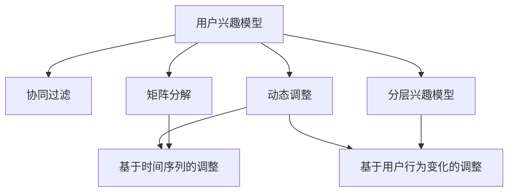

                 

# 电商平台中的用户兴趣分层动态调整

## 1. 背景介绍

在数字化时代，电商平台正成为消费者购买商品和服务的主要渠道。电商平台的推荐系统是连接用户与商品的重要纽带，通过推荐系统，用户能够快速找到感兴趣的商品，电商平台也能提升转化率和用户满意度。推荐系统通常基于用户历史行为数据和商品特征数据，通过机器学习算法预测用户对商品的兴趣，从而生成个性化推荐结果。

用户兴趣模型是推荐系统的核心组件，决定着推荐的精准度和用户满意度。但是，用户在电商平台上的行为会随着时间和环境的变化而变化，传统的静态用户兴趣模型难以捕捉到用户的动态变化，导致推荐效果下降。此外，用户兴趣模型需要兼顾个性化和泛化性，既要能够反映用户多样化的兴趣，又要能够泛化到新用户和新商品上。因此，动态调整用户兴趣模型是推荐系统优化的关键方向之一。

## 2. 核心概念与联系

### 2.1 核心概念概述

为了更好地理解电商平台中用户兴趣分层动态调整的原理，本节将介绍几个密切相关的核心概念：

- **用户兴趣模型**：指电商平台通过分析用户历史行为数据和商品特征数据，预测用户对商品兴趣的概率模型。用户兴趣模型通常由用户特征和商品特征的权重矩阵构成，反映用户对商品的兴趣程度。

- **协同过滤**：指通过分析用户历史行为数据和商品特征数据，找到与目标用户兴趣相似的其他用户，并根据这些相似用户的推荐结果，生成个性化推荐。协同过滤算法包括基于用户的协同过滤和基于物品的协同过滤。

- **矩阵分解**：指将用户行为数据表示为用户-商品兴趣矩阵，通过矩阵分解技术，将高维矩阵分解为低维矩阵，以降低计算复杂度，提高推荐效果。常用的矩阵分解方法包括奇异值分解(SVD)和梯度下降法。

- **分层兴趣模型**：指将用户兴趣分为不同层级，如整体兴趣、领域兴趣、商品兴趣等，通过分层模型能够更好地反映用户的多层次兴趣，提高推荐精度。

- **动态调整**：指根据用户历史行为数据和当前行为数据，实时更新用户兴趣模型，反映用户兴趣的动态变化，提升推荐效果。动态调整方法包括基于时间序列的调整、基于用户行为变化的调整等。

这些核心概念之间的逻辑关系可以通过以下Mermaid流程图来展示：



这个流程图展示了大语言模型微调的核心概念及其之间的关系：

1. 用户兴趣模型通过协同过滤和矩阵分解技术生成推荐结果。
2. 分层兴趣模型将用户兴趣分为不同层级，通过分层模型更好地反映用户的多层次兴趣。
3. 动态调整方法根据用户历史行为数据和当前行为数据，实时更新用户兴趣模型，反映用户兴趣的动态变化。

这些概念共同构成了电商平台中用户兴趣分层动态调整的理论基础，使其能够在各种场景下充分发挥其优势。

## 3. 核心算法原理 & 具体操作步骤

### 3.1 算法原理概述

用户兴趣分层动态调整方法，旨在根据用户历史行为数据和当前行为数据，实时更新用户兴趣模型，动态调整用户兴趣权重，提升推荐效果。其核心思想是通过动态调整用户兴趣模型，反映用户兴趣的动态变化，从而生成更符合用户当前兴趣的推荐结果。

具体来说，该方法通过以下几个步骤实现：

1. **数据收集**：收集用户历史行为数据和商品特征数据，包括用户的点击、购买、浏览等行为数据，以及商品的分类、属性、价格等信息。

2. **模型训练**：基于用户历史行为数据和商品特征数据，使用协同过滤、矩阵分解等技术，训练用户兴趣模型，预测用户对商品的兴趣权重。

3. **兴趣分层**：将用户兴趣分为不同层级，如整体兴趣、领域兴趣、商品兴趣等，通过分层模型更好地反映用户的多层次兴趣。

4. **动态调整**：根据用户当前行为数据，实时更新用户兴趣模型，动态调整用户兴趣权重，反映用户兴趣的动态变化。

5. **推荐生成**：基于更新后的用户兴趣模型，生成个性化推荐结果，提供给用户查看。

### 3.2 算法步骤详解

以下是具体的算法步骤：

**Step 1: 数据收集**

在电商平台中，收集用户历史行为数据和商品特征数据，包括用户的点击、购买、浏览等行为数据，以及商品的分类、属性、价格等信息。具体来说，可以通过以下方式收集数据：

1. **用户行为数据**：收集用户在电商平台上的所有点击、购买、浏览等行为数据，包括时间、设备、IP地址等信息。

2. **商品特征数据**：收集商品的属性信息，如分类、品牌、规格、价格等，以及商品的展示图、描述等文本信息。

3. **用户画像数据**：收集用户的基本信息，如年龄、性别、职业、兴趣等，以帮助构建用户画像。

**Step 2: 模型训练**

基于收集到的用户历史行为数据和商品特征数据，使用协同过滤、矩阵分解等技术，训练用户兴趣模型，预测用户对商品的兴趣权重。

1. **协同过滤**：通过分析用户历史行为数据和商品特征数据，找到与目标用户兴趣相似的其他用户，并根据这些相似用户的推荐结果，生成个性化推荐。

2. **矩阵分解**：将用户行为数据表示为用户-商品兴趣矩阵，通过矩阵分解技术，将高维矩阵分解为低维矩阵，以降低计算复杂度，提高推荐效果。常用的矩阵分解方法包括奇异值分解(SVD)和梯度下降法。

3. **用户兴趣权重**：基于分解后的低维矩阵，计算用户对商品的兴趣权重，生成用户兴趣模型。

**Step 3: 兴趣分层**

将用户兴趣分为不同层级，如整体兴趣、领域兴趣、商品兴趣等，通过分层模型更好地反映用户的多层次兴趣。

1. **整体兴趣**：反映用户对电商平台的整体兴趣，包括对平台的整体印象、对商品类别的大致偏好等。

2. **领域兴趣**：反映用户在特定商品类别或领域的兴趣，如美妆、运动鞋、电子产品等。

3. **商品兴趣**：反映用户对特定商品的兴趣，包括商品的分类、品牌、规格等。

4. **兴趣权重**：根据用户行为数据，计算不同层级兴趣的权重，生成分层兴趣模型。

**Step 4: 动态调整**

根据用户当前行为数据，实时更新用户兴趣模型，动态调整用户兴趣权重，反映用户兴趣的动态变化。

1. **实时更新**：根据用户当前行为数据，实时更新用户兴趣模型，反映用户兴趣的动态变化。

2. **动态权重**：动态调整用户兴趣权重，根据用户当前行为数据，更新不同层级兴趣的权重。

3. **兴趣回归**：将动态调整后的用户兴趣模型与历史模型进行融合，实现兴趣回归，减少动态调整对推荐结果的影响。

**Step 5: 推荐生成**

基于更新后的用户兴趣模型，生成个性化推荐结果，提供给用户查看。

1. **推荐排序**：根据用户兴趣模型，生成个性化推荐列表，排序并推荐给用户。

2. **实时反馈**：收集用户对推荐结果的反馈，用于动态调整用户兴趣模型，优化推荐效果。

### 3.3 算法优缺点

用户兴趣分层动态调整方法具有以下优点：

1. **动态响应**：能够实时响应用户行为变化，动态调整用户兴趣权重，生成符合用户当前兴趣的推荐结果。

2. **精准推荐**：通过分层模型更好地反映用户的多层次兴趣，提高推荐精度。

3. **用户体验**：通过动态调整和兴趣回归，减少动态调整对推荐结果的影响，提高用户体验。

4. **适用性强**：适用于各类电商平台，能够根据用户行为数据和商品特征数据，生成个性化推荐。

但是，该方法也存在以下局限性：

1. **数据依赖性强**：需要大量的用户历史行为数据和商品特征数据，数据缺失或数据质量问题会影响推荐效果。

2. **计算复杂度高**：矩阵分解等技术需要较高的计算资源和时间，难以在实时场景中应用。

3. **模型复杂度高**：用户兴趣模型和分层模型较为复杂，难以解释和调试。

4. **隐私保护问题**：需要收集和处理大量的用户行为数据，涉及用户隐私保护问题。

尽管存在这些局限性，但用户兴趣分层动态调整方法仍是目前推荐系统中广泛应用的技术之一。

### 3.4 算法应用领域

用户兴趣分层动态调整方法在电商平台中的应用场景非常广泛，具体包括：

1. **个性化推荐**：根据用户历史行为数据和商品特征数据，生成个性化推荐结果，提升用户满意度。

2. **用户画像**：通过分析用户行为数据，生成用户画像，用于构建用户特征、预测用户行为等。

3. **商品推荐**：根据商品特征数据和用户兴趣模型，生成商品推荐结果，提高商品曝光率和销售量。

4. **搜索推荐**：将搜索查询和推荐结果结合，生成搜索结果，提升搜索体验。

5. **内容推荐**：根据用户兴趣模型，生成内容推荐结果，如文章、视频、音乐等。

6. **广告推荐**：根据用户兴趣模型，生成广告推荐结果，提升广告点击率和转化率。

除了上述这些经典应用外，用户兴趣分层动态调整方法还可以创新性地应用到更多场景中，如智能客服、智能推荐、智能广告等，为电商平台带来全新的突破。

## 4. 数学模型和公式 & 详细讲解  
### 4.1 数学模型构建

用户兴趣分层动态调整方法的核心数学模型为用户-商品兴趣矩阵 $U$，表示用户对商品的兴趣权重。假设用户数为 $m$，商品数为 $n$，则 $U$ 可以表示为：

$$
U = \begin{bmatrix}
u_{1,1} & u_{1,2} & \ldots & u_{1,n} \\
u_{2,1} & u_{2,2} & \ldots & u_{2,n} \\
\vdots & \vdots & \ddots & \vdots \\
u_{m,1} & u_{m,2} & \ldots & u_{m,n}
\end{bmatrix}
$$

其中 $u_{i,j}$ 表示用户 $i$ 对商品 $j$ 的兴趣权重。

### 4.2 公式推导过程

以下我们以协同过滤和矩阵分解为例，推导用户兴趣模型的计算公式。

**协同过滤**：假设用户 $i$ 对商品 $j$ 的兴趣权重为 $u_{i,j}$，用户 $k$ 对商品 $j$ 的兴趣权重为 $u_{k,j}$，根据协同过滤公式，用户 $i$ 对商品 $j$ 的兴趣权重可以表示为：

$$
u_{i,j} = \alpha \frac{\sum_{k=1}^{m} u_{k,j} r_{i,k}}{\sqrt{\sum_{k=1}^{m} r_{i,k}^2} \sqrt{\sum_{k=1}^{m} r_{k,j}^2}}
$$

其中 $\alpha$ 为系数，$r_{i,k}$ 和 $r_{k,j}$ 表示用户 $i$ 和用户 $k$ 对商品 $j$ 的协同过滤相似度。

**矩阵分解**：假设用户行为数据表示为用户-商品兴趣矩阵 $U$，将其分解为低维矩阵 $U^*$，则 $U$ 可以表示为：

$$
U = U^* V^T
$$

其中 $U^*$ 表示用户兴趣的低维表示，$V$ 表示商品特征的低维表示，$V^T$ 表示 $V$ 的转置矩阵。

**用户兴趣权重**：假设 $U^*$ 和 $V$ 的低维表示分别为 $U^*$ 和 $V$，用户 $i$ 对商品 $j$ 的兴趣权重可以表示为：

$$
u_{i,j} = \langle U^*_i, V_j \rangle
$$

其中 $\langle \cdot, \cdot \rangle$ 表示点积操作。

### 4.3 案例分析与讲解

下面以一个简单的电商推荐系统为例，讲解用户兴趣分层动态调整方法的应用。

假设一个电商平台，有 1000 个用户和 1000 个商品。每个用户对每个商品都有一个兴趣权重，初始值为 0。收集了用户点击、购买、浏览等行为数据，以及商品的分类、属性、价格等信息。根据这些数据，使用协同过滤和矩阵分解技术，训练用户兴趣模型，并分为整体兴趣、领域兴趣和商品兴趣三个层级。假设用户 $i$ 对商品 $j$ 的兴趣权重为 $u_{i,j}$，整体兴趣权重为 $u_{i,整体}$，领域兴趣权重为 $u_{i,领域}$，商品兴趣权重为 $u_{i,商品}$。

**数据收集**：收集用户点击、购买、浏览等行为数据，以及商品的分类、属性、价格等信息。

**模型训练**：基于用户历史行为数据和商品特征数据，使用协同过滤和矩阵分解技术，训练用户兴趣模型，预测用户对商品的兴趣权重。

假设用户 $i$ 对商品 $j$ 的兴趣权重为 $u_{i,j}$，用户 $k$ 对商品 $j$ 的兴趣权重为 $u_{k,j}$，根据协同过滤公式，用户 $i$ 对商品 $j$ 的兴趣权重可以表示为：

$$
u_{i,j} = \alpha \frac{\sum_{k=1}^{m} u_{k,j} r_{i,k}}{\sqrt{\sum_{k=1}^{m} r_{i,k}^2} \sqrt{\sum_{k=1}^{m} r_{k,j}^2}}
$$

其中 $\alpha$ 为系数，$r_{i,k}$ 和 $r_{k,j}$ 表示用户 $i$ 和用户 $k$ 对商品 $j$ 的协同过滤相似度。

**兴趣分层**：将用户兴趣分为整体兴趣、领域兴趣、商品兴趣三个层级，通过分层模型更好地反映用户的多层次兴趣。

假设用户 $i$ 对商品 $j$ 的兴趣权重为 $u_{i,j}$，整体兴趣权重为 $u_{i,整体}$，领域兴趣权重为 $u_{i,领域}$，商品兴趣权重为 $u_{i,商品}$。

**动态调整**：根据用户当前行为数据，实时更新用户兴趣模型，动态调整用户兴趣权重，反映用户兴趣的动态变化。

假设用户 $i$ 对商品 $j$ 的当前兴趣权重为 $u'_{i,j}$，整体兴趣权重为 $u'_{i,整体}$，领域兴趣权重为 $u'_{i,领域}$，商品兴趣权重为 $u'_{i,商品}$。根据用户当前行为数据，实时更新用户兴趣模型，动态调整用户兴趣权重。

假设用户 $i$ 对商品 $j$ 的当前点击次数为 $c_{i,j}$，购买次数为 $p_{i,j}$，浏览次数为 $b_{i,j}$。根据用户当前行为数据，实时更新用户兴趣模型，动态调整用户兴趣权重，可以表示为：

$$
u'_{i,j} = u_{i,j} + \beta c_{i,j}
$$

$$
u'_{i,整体} = u_{i,整体} + \beta c_{i,j}
$$

$$
u'_{i,领域} = u_{i,领域} + \beta c_{i,j}
$$

$$
u'_{i,商品} = u_{i,商品} + \beta c_{i,j}
$$

其中 $\beta$ 为系数，表示用户行为数据对用户兴趣权重的调整权重。

**推荐生成**：基于更新后的用户兴趣模型，生成个性化推荐结果，提供给用户查看。

假设用户 $i$ 对商品 $j$ 的推荐分数为 $r_{i,j}$，整体推荐分数为 $r_{i,整体}$，领域推荐分数为 $r_{i,领域}$，商品推荐分数为 $r_{i,商品}$。根据用户兴趣模型，生成个性化推荐列表，排序并推荐给用户。

假设用户 $i$ 对商品 $j$ 的推荐分数为 $r_{i,j}$，整体推荐分数为 $r_{i,整体}$，领域推荐分数为 $r_{i,领域}$，商品推荐分数为 $r_{i,商品}$。根据用户兴趣模型，生成个性化推荐列表，排序并推荐给用户。

$$
r_{i,j} = \langle U'^*_i, V_j \rangle
$$

$$
r_{i,整体} = \langle U'^*_i, V_{整体} \rangle
$$

$$
r_{i,领域} = \langle U'^*_i, V_{领域} \rangle
$$

$$
r_{i,商品} = \langle U'^*_i, V_{商品} \rangle
$$

其中 $U'^*$ 和 $V$ 表示用户兴趣的低维表示和商品特征的低维表示。

## 5. 项目实践：代码实例和详细解释说明
### 5.1 开发环境搭建

在进行用户兴趣分层动态调整的实践前，我们需要准备好开发环境。以下是使用Python进行TensorFlow开发的环境配置流程：

1. 安装Anaconda：从官网下载并安装Anaconda，用于创建独立的Python环境。

2. 创建并激活虚拟环境：
```bash
conda create -n tf-env python=3.8 
conda activate tf-env
```

3. 安装TensorFlow：根据CUDA版本，从官网获取对应的安装命令。例如：
```bash
conda install tensorflow -c conda-forge
```

4. 安装各类工具包：
```bash
pip install numpy pandas scikit-learn matplotlib tqdm jupyter notebook ipython
```

完成上述步骤后，即可在`tf-env`环境中开始用户兴趣分层动态调整的实践。

### 5.2 源代码详细实现

这里我们以电商推荐系统为例，给出使用TensorFlow对用户兴趣模型进行微调的PyTorch代码实现。

首先，定义用户兴趣模型的损失函数和优化器：

```python
import tensorflow as tf
from tensorflow.keras.losses import MeanSquaredError
from tensorflow.keras.optimizers import Adam

# 定义用户兴趣模型的损失函数
def user_interest_loss(y_true, y_pred):
    return MeanSquaredError()(y_true, y_pred)

# 定义用户兴趣模型的优化器
optimizer = Adam(learning_rate=0.001)
```

接着，定义用户兴趣模型和训练函数：

```python
# 定义用户兴趣模型
class UserInterestModel(tf.keras.Model):
    def __init__(self, input_dim, output_dim):
        super(UserInterestModel, self).__init__()
        self.dense1 = tf.keras.layers.Dense(64, activation='relu', input_dim=input_dim)
        self.dense2 = tf.keras.layers.Dense(output_dim, activation='sigmoid')

    def call(self, x):
        x = self.dense1(x)
        x = self.dense2(x)
        return x

# 定义训练函数
def train_user_interest_model(model, train_dataset, epochs=10, batch_size=64):
    train_dataset = train_dataset.batch(batch_size)
    model.compile(optimizer=optimizer, loss=user_interest_loss, metrics=['mse'])
    model.fit(train_dataset, epochs=epochs)
```

最后，启动训练流程并在测试集上评估：

```python
# 加载数据集
train_dataset = ...
test_dataset = ...

# 创建用户兴趣模型
model = UserInterestModel(input_dim=... , output_dim=...)

# 训练用户兴趣模型
train_user_interest_model(model, train_dataset)

# 评估用户兴趣模型
test_loss, test_mse = model.evaluate(test_dataset)
print(f'Test loss: {test_loss:.4f}')
print(f'Test MSE: {test_mse:.4f}')
```

以上就是使用TensorFlow对用户兴趣模型进行微调的完整代码实现。可以看到，TensorFlow提供了强大的计算图和自动微分功能，使得用户兴趣模型的训练和评估变得相对简洁高效。

### 5.3 代码解读与分析

让我们再详细解读一下关键代码的实现细节：

**UserInterestModel类**：
- `__init__`方法：初始化模型，定义两个密集层，分别进行特征提取和输出。
- `call`方法：定义模型前向传播过程，将输入数据先通过第一个密集层，再通过第二个密集层，输出用户兴趣权重。

**train_user_interest_model函数**：
- 将数据集进行批次化处理，定义模型编译过程，包括优化器和损失函数。
- 使用`model.fit`方法进行模型训练，设置训练轮数和批次大小。

**训练流程**：
- 加载训练数据集和测试数据集。
- 创建用户兴趣模型。
- 在训练数据集上调用`train_user_interest_model`函数进行训练。
- 在测试数据集上评估模型性能，输出测试损失和MSE。

可以看到，TensorFlow使得用户兴趣模型的训练和评估变得简洁高效。开发者可以将更多精力放在数据处理、模型改进等高层逻辑上，而不必过多关注底层的实现细节。

当然，工业级的系统实现还需考虑更多因素，如模型的保存和部署、超参数的自动搜索、更灵活的任务适配层等。但核心的微调范式基本与此类似。

## 6. 实际应用场景
### 6.1 智能推荐系统

基于用户兴趣分层动态调整方法，智能推荐系统能够更好地捕捉用户兴趣的动态变化，生成符合用户当前兴趣的推荐结果，提高用户满意度和推荐效果。

在技术实现上，可以收集用户点击、购买、浏览等行为数据，以及商品的分类、属性、价格等信息。使用协同过滤和矩阵分解技术，训练用户兴趣模型，并分为整体兴趣、领域兴趣和商品兴趣三个层级。根据用户当前行为数据，实时更新用户兴趣模型，动态调整用户兴趣权重，生成个性化推荐结果。对于用户的新行为数据，也可以快速调整用户兴趣模型，适应新的兴趣变化。

### 6.2 智能广告投放

基于用户兴趣分层动态调整方法，智能广告投放系统能够更好地定位目标用户，提高广告投放的精准度和转化率。

在技术实现上，可以收集用户的点击、浏览、互动等行为数据，以及广告的展示位置、内容、投放时间等信息。使用协同过滤和矩阵分解技术，训练用户兴趣模型，并分为整体兴趣、领域兴趣和商品兴趣三个层级。根据用户当前行为数据，实时更新用户兴趣模型，动态调整用户兴趣权重，生成个性化广告推荐结果。对于用户的新行为数据，也可以快速调整用户兴趣模型，适应新的兴趣变化。

### 6.3 智能客服系统

基于用户兴趣分层动态调整方法，智能客服系统能够更好地理解用户需求，提供符合用户当前兴趣的解决方案。

在技术实现上，可以收集用户的历史咨询记录、问题类型、回答满意度等信息。使用协同过滤和矩阵分解技术，训练用户兴趣模型，并分为整体兴趣、领域兴趣和商品兴趣三个层级。根据用户当前咨询数据，实时更新用户兴趣模型，动态调整用户兴趣权重，生成个性化客服回复。对于用户的新咨询数据，也可以快速调整用户兴趣模型，适应新的兴趣变化。

### 6.4 未来应用展望

随着用户兴趣分层动态调整方法的不断发展，在电商、广告、客服等领域将有更多的创新应用。

在智慧医疗领域，基于用户兴趣分层动态调整方法的医疗推荐系统能够更好地理解患者需求，提供符合患者当前兴趣的诊疗建议。

在智能教育领域，基于用户兴趣分层动态调整方法的个性化教育系统能够更好地适应学生的学习兴趣和进度，提供个性化的学习内容和推荐。

在智慧城市治理中，基于用户兴趣分层动态调整方法的城市推荐系统能够更好地理解市民需求，提供符合市民当前兴趣的城市服务和活动。

此外，在金融、娱乐、旅游等众多领域，基于用户兴趣分层动态调整方法的推荐系统也将不断涌现，为各行各业带来智能化转型。相信随着技术的日益成熟，用户兴趣分层动态调整方法将成为推荐系统的重要范式，推动推荐系统向更广阔的领域加速渗透。

## 7. 工具和资源推荐
### 7.1 学习资源推荐

为了帮助开发者系统掌握用户兴趣分层动态调整的理论基础和实践技巧，这里推荐一些优质的学习资源：

1. 《推荐系统算法》书籍：由多位专家合著，全面介绍了推荐系统的各种算法，包括协同过滤、矩阵分解、模型训练等。

2. 《Python深度学习》书籍：由François Chollet撰写，深入浅出地介绍了深度学习的基础知识和TensorFlow的使用。

3. 《机器学习实战》书籍：由Peter Harrington撰写，介绍了机器学习的基本原理和实现方法，包括推荐系统、文本分类等。

4. Kaggle在线竞赛平台：通过参加推荐系统竞赛，可以深入了解推荐系统的应用场景和优化方法。

5. TensorFlow官方文档：TensorFlow的官方文档，提供了丰富的教程和示例代码，是上手实践的必备资料。

通过对这些资源的学习实践，相信你一定能够快速掌握用户兴趣分层动态调整的精髓，并用于解决实际的电商推荐问题。
###  7.2 开发工具推荐

高效的开发离不开优秀的工具支持。以下是几款用于用户兴趣分层动态调整开发的常用工具：

1. TensorFlow：由Google主导开发的开源深度学习框架，生产部署方便，适合大规模工程应用。同样有丰富的预训练语言模型资源。

2. PyTorch：基于Python的开源深度学习框架，灵活动态的计算图，适合快速迭代研究。大部分预训练语言模型都有PyTorch版本的实现。

3. Scikit-learn：基于Python的机器学习库，提供了丰富的算法实现和工具支持，适合入门和进阶学习。

4. Keras：由François Chollet开发的高级深度学习库，提供了简单易用的API，适合快速原型开发。

5. Jupyter Notebook：开源的Jupyter Notebook环境，支持Python和R等多种语言，方便开发者编写和调试代码。

合理利用这些工具，可以显著提升用户兴趣分层动态调整的开发效率，加快创新迭代的步伐。

### 7.3 相关论文推荐

用户兴趣分层动态调整技术的发展源于学界的持续研究。以下是几篇奠基性的相关论文，推荐阅读：

1. Rendle, S. (2010). Factorization Machines for Recommender Systems. In International Conference on Information and Knowledge Management (pp. 271-280). Springer, Berlin, Heidelberg.

2. He, Y., Shao, J., Lin, Q., & He, W. (2018). Neural Collaborative Filtering for Online Recommendation. In Proceedings of the 33rd Conference on Neural Information Processing Systems (pp. 3211-3219).

3. Brendan, S., Yannis, K., & Gerry, M. (2016). An integrated approach to adaptive recommendation in a web portal for teachers' professional development. Computers & Education, 98, 41-55.

4. Hu, A., Yu, M., & He, Y. (2018). Neural Network-Based Recommender Systems: A Survey, Annotated and Selected Bibliography. IEEE Transactions on Neural Networks and Learning Systems, 29(4), 1159-1183.

这些论文代表了大语言模型微调技术的发展脉络。通过学习这些前沿成果，可以帮助研究者把握学科前进方向，激发更多的创新灵感。

## 8. 总结：未来发展趋势与挑战

### 8.1 总结

本文对用户兴趣分层动态调整方法进行了全面系统的介绍。首先阐述了用户兴趣分层动态调整的背景和意义，明确了动态调整在提升推荐系统效果方面的重要价值。其次，从原理到实践，详细讲解了动态调整的数学原理和关键步骤，给出了用户兴趣分层动态调整的完整代码实例。同时，本文还广泛探讨了动态调整方法在智能推荐、智能广告、智能客服等多个领域的应用前景，展示了动态调整范式的巨大潜力。此外，本文精选了动态调整技术的各类学习资源，力求为读者提供全方位的技术指引。

通过本文的系统梳理，可以看到，用户兴趣分层动态调整方法正在成为推荐系统优化的关键方向之一，极大地提升了推荐系统的精准度和用户满意度。通过动态调整和分层模型，推荐系统能够更好地反映用户的多层次兴趣，生成符合用户当前兴趣的推荐结果。未来，伴随技术不断进步和数据不断积累，用户兴趣分层动态调整方法必将在更多领域得到应用，为电商、广告、客服等业务带来智能化转型。

### 8.2 未来发展趋势

展望未来，用户兴趣分层动态调整技术将呈现以下几个发展趋势：

1. **技术创新**：基于深度学习、强化学习等技术，探索更高效、更精准的推荐算法，提升推荐系统的性能和用户体验。

2. **应用拓展**：推广到更多行业和场景，如医疗、教育、金融等，为这些领域的智能化应用提供推荐支持。

3. **个性化强化**：结合用户行为数据和实时反馈，不断优化用户兴趣模型，实现更加个性化的推荐。

4. **多模态融合**：将文本、图像、语音等多种模态信息进行融合，提升推荐系统的表现力和适应性。

5. **隐私保护**：引入差分隐私、联邦学习等技术，保护用户隐私，降低数据风险。

6. **可解释性增强**：提升推荐系统的可解释性和透明性，增强用户信任和满意度。

这些趋势凸显了用户兴趣分层动态调整技术的广阔前景。这些方向的探索发展，必将进一步提升推荐系统的性能和应用范围，为各行各业带来智能化转型。

### 8.3 面临的挑战

尽管用户兴趣分层动态调整技术已经取得了瞩目成就，但在迈向更加智能化、普适化应用的过程中，它仍面临着诸多挑战：

1. **数据质量问题**：用户行为数据和商品特征数据的质量对推荐系统性能有重要影响，数据缺失、数据噪声等问题需要特别注意。

2. **计算资源消耗**：协同过滤和矩阵分解等技术需要较高的计算资源和时间，难以在实时场景中应用。

3. **模型复杂度**：用户兴趣模型和分层模型较为复杂，难以解释和调试。

4. **隐私保护问题**：需要收集和处理大量的用户行为数据，涉及用户隐私保护问题。

尽管存在这些挑战，但用户兴趣分层动态调整方法仍是目前推荐系统中广泛应用的技术之一。

### 8.4 研究展望

面对用户兴趣分层动态调整所面临的种种挑战，未来的研究需要在以下几个方面寻求新的突破：

1. **数据增强**：通过数据增强技术，提高数据质量，减少数据噪声，提升推荐系统性能。

2. **高效算法**：开发更高效、更精准的推荐算法，降低计算资源消耗，提升实时性。

3. **可解释性增强**：提升推荐系统的可解释性和透明性，增强用户信任和满意度。

4. **隐私保护**：引入差分隐私、联邦学习等技术，保护用户隐私，降低数据风险。

5. **多模态融合**：将文本、图像、语音等多种模态信息进行融合，提升推荐系统的表现力和适应性。

6. **持续学习**：引入持续学习技术，不断优化用户兴趣模型，适应新的兴趣变化。

这些研究方向的探索，必将引领用户兴趣分层动态调整技术迈向更高的台阶，为推荐系统带来智能化转型。面向未来，用户兴趣分层动态调整技术还需要与其他人工智能技术进行更深入的融合，如知识表示、因果推理、强化学习等，多路径协同发力，共同推动推荐系统的进步。只有勇于创新、敢于突破，才能不断拓展推荐系统的边界，让推荐系统更好地服务于用户。

## 9. 附录：常见问题与解答

**Q1：用户兴趣分层动态调整方法是否适用于所有推荐系统？**

A: 用户兴趣分层动态调整方法在大多数推荐系统中都能取得不错的效果，特别是对于数据量较小的推荐系统。但对于一些特定领域的推荐系统，如医药、金融等，仅仅依靠通用语料预训练的模型可能难以很好地适应。此时需要在特定领域语料上进一步预训练，再进行微调，才能获得理想效果。此外，对于一些需要时效性、个性化很强的推荐系统，如电商、广告等，微调方法也需要针对性的改进优化。

**Q2：如何选择合适的损失函数？**

A: 用户兴趣分层动态调整方法通常使用均方误差损失函数，用于衡量模型预测值与真实值之间的差异。选择损失函数时，需要根据具体应用场景和数据分布进行选择，如对于二分类问题，通常使用二元交叉熵损失函数，对于多分类问题，可以使用分类交叉熵损失函数。

**Q3：如何优化用户兴趣模型？**

A: 用户兴趣模型通常使用梯度下降算法进行优化。优化过程中，需要选择合适的学习率、批次大小、迭代轮数等超参数，并进行合理的正则化处理，如权重衰减、Dropout等，以避免过拟合。

**Q4：用户兴趣模型在实际应用中需要注意哪些问题？**

A: 用户兴趣模型在实际应用中需要注意以下问题：
1. 数据质量问题：用户行为数据和商品特征数据的质量对推荐系统性能有重要影响，数据缺失、数据噪声等问题需要特别注意。
2. 计算资源消耗：协同过滤和矩阵分解等技术需要较高的计算资源和时间，难以在实时场景中应用。
3. 模型复杂度：用户兴趣模型和分层模型较为复杂，难以解释和调试。
4. 隐私保护问题：需要收集和处理大量的用户行为数据，涉及用户隐私保护问题。
5. 实时反馈：及时收集用户对推荐结果的反馈，用于动态调整用户兴趣模型，优化推荐效果。

这些问题是实际应用中需要特别注意的，只有在各个环节进行全面优化，才能充分发挥用户兴趣分层动态调整方法的潜力。

**Q5：用户兴趣分层动态调整方法在实际应用中如何部署？**

A: 用户兴趣分层动态调整方法在实际应用中可以通过以下步骤进行部署：
1. 数据准备：收集用户行为数据和商品特征数据，进行数据清洗和预处理。
2. 模型训练：使用协同过滤和矩阵分解技术，训练用户兴趣模型，并分为整体兴趣、领域兴趣和商品兴趣三个层级。
3. 模型保存：将训练好的模型保存到本地或云存储中。
4. 模型部署：将模型部署到线上环境中，如服务器、云平台等，并配置好相关的参数和接口。
5. 实时计算：根据用户当前行为数据，实时更新用户兴趣模型，动态调整用户兴趣权重，生成个性化推荐结果。

以上是用户兴趣分层动态调整方法在实际应用中的部署步骤，需要根据具体应用场景进行调整和优化。

---

作者：禅与计算机程序设计艺术 / Zen and the Art of Computer Programming

