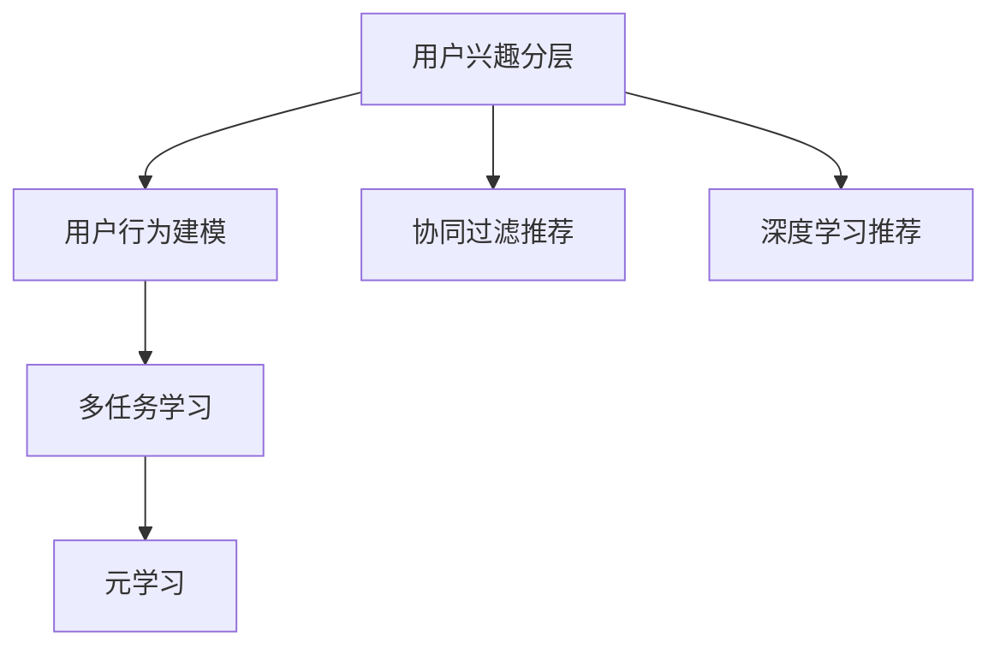

                 

# 电商平台中的用户兴趣分层模型

## 1. 背景介绍

### 1.1 问题由来
随着电子商务市场的快速发展，电商平台面临着日益增长的用户需求和竞争压力。为了提升用户体验和平台盈利能力，电商平台需要通过精准推荐算法，将商品信息推送给最匹配的用户。然而，传统的基于统计学的方法和基于特征的机器学习算法，往往无法有效捕捉用户兴趣的多样性和动态性。

### 1.2 问题核心关键点
针对这一问题，用户兴趣分层模型应运而生。通过将用户划分为不同的兴趣层次，并针对不同层次的用户进行个性化的推荐，平台能够更精准地满足用户需求，提升用户粘性和转化率。

## 2. 核心概念与联系

### 2.1 核心概念概述

为更好地理解用户兴趣分层模型，本节将介绍几个密切相关的核心概念：

- **用户兴趣分层**：将用户按照其兴趣和行为特征划分为不同的层次，如兴趣轻度、中度、重度等。
- **用户行为建模**：通过对用户浏览、购买、评价等行为的建模，挖掘用户的隐含兴趣和偏好。
- **协同过滤推荐**：利用用户和物品之间的相似度进行推荐，基于用户历史行为或物品属性，找出用户可能感兴趣的物品。
- **深度学习推荐**：通过构建深度神经网络，对用户行为进行建模，发现隐含的用户兴趣和行为模式。
- **多任务学习**：在同一个模型中同时训练多个相关任务，提升模型性能和泛化能力。
- **元学习**：通过学习模型的学习过程，优化模型参数，提升模型在多种任务上的适应性。

这些核心概念之间的逻辑关系可以通过以下Mermaid流程图来展示：



这个流程图展示了这个体系的主要组件和它们之间的关联：

1. **用户兴趣分层**：作为模型的输入，用户兴趣分层直接影响后续的推荐策略。
2. **用户行为建模**：对用户行为进行建模，帮助模型理解用户兴趣和偏好的变化。
3. **协同过滤推荐**：在用户分层的基础上，利用用户间的相似性进行推荐。
4. **深度学习推荐**：通过构建深度神经网络，更全面地建模用户行为和兴趣。
5. **多任务学习**：结合多个相关任务，提升模型的泛化能力。
6. **元学习**：优化模型的学习过程，提高其适应不同任务的能力。

这些概念共同构成了用户兴趣分层模型的核心框架，使其能够更好地适应电商平台的个性化推荐需求。

## 3. 核心算法原理 & 具体操作步骤
### 3.1 算法原理概述

用户兴趣分层模型基于协同过滤和深度学习技术，通过将用户划分为不同的兴趣层次，并利用多任务学习框架进行优化。其核心思想是：

1. **用户兴趣分层**：将用户根据其行为特征划分为若干个层次，每个层次代表一种不同的兴趣程度。
2. **协同过滤推荐**：在分层基础上，利用用户之间的相似性进行推荐。
3. **深度学习建模**：利用深度神经网络对用户行为进行建模，捕捉用户兴趣和行为模式。
4. **多任务学习**：在同一个模型中同时训练多个相关任务，提升模型的泛化能力。
5. **元学习**：学习模型的学习过程，优化模型参数，提高其适应不同任务的能力。

### 3.2 算法步骤详解

基于用户兴趣分层模型的推荐过程通常包括以下几个关键步骤：

**Step 1: 用户行为数据收集与预处理**

- 收集用户浏览、购买、评价等行为数据，预处理成统一的格式。
- 去除噪声数据，处理缺失值。

**Step 2: 用户兴趣分层**

- 根据用户行为数据，构建用户兴趣分层模型。
- 利用聚类算法或层次聚类等方法，将用户划分为不同的兴趣层次。

**Step 3: 协同过滤推荐**

- 利用用户间的相似性进行推荐。
- 对每个层次的用户，计算与其他用户的行为相似度。
- 根据相似度排序，生成推荐列表。

**Step 4: 深度学习建模**

- 构建深度神经网络，对用户行为进行建模。
- 使用交叉熵等损失函数训练模型，捕捉用户兴趣和行为模式。

**Step 5: 多任务学习**

- 在同一个模型中同时训练多个相关任务，如预测用户点击、购买概率等。
- 利用多任务学习框架，优化模型参数。

**Step 6: 元学习**

- 学习模型的学习过程，优化模型参数。
- 利用元学习算法，提高模型在不同任务上的适应性。

### 3.3 算法优缺点

基于用户兴趣分层模型的推荐系统具有以下优点：

1. **个性化推荐**：能够根据用户的兴趣层次进行个性化的推荐，提升用户满意度。
2. **动态适应**：用户兴趣和行为是动态变化的，该模型能够实时调整推荐策略。
3. **高准确率**：利用多任务学习和深度学习技术，提升推荐系统的准确性。
4. **泛化能力**：能够适应不同用户群体的需求，提高模型的泛化能力。

同时，该模型也存在一些局限性：

1. **计算复杂度**：深度学习模型计算复杂度较高，需要较大的计算资源。
2. **数据需求大**：需要大量用户行为数据进行训练和分层。
3. **用户隐私**：需要收集和处理用户的行为数据，可能存在隐私风险。
4. **模型复杂度**：模型结构复杂，调试和维护难度较大。

尽管存在这些局限性，但就目前而言，基于用户兴趣分层模型的推荐系统仍然是电子商务领域最为先进的推荐技术之一。

### 3.4 算法应用领域

基于用户兴趣分层模型的推荐系统在电商领域有着广泛的应用：

1. **商品推荐**：根据用户兴趣层次，向用户推荐最相关的商品。
2. **广告推荐**：在用户浏览商品时，推荐相关广告，提升用户点击率和转化率。
3. **个性化活动推荐**：根据用户兴趣层次，推荐个性化促销活动，提高用户参与度。
4. **新用户引导**：为新用户提供个性化商品推荐，帮助其快速熟悉平台。
5. **商品排序**：根据用户兴趣层次，调整商品在搜索结果中的排序，提升用户体验。

除了这些常见应用外，用户兴趣分层模型还被创新性地应用于市场分析、用户流失预测、智能客服等领域，为电商平台的智能化转型提供了新的动力。

## 4. 数学模型和公式 & 详细讲解  
### 4.1 数学模型构建

用户兴趣分层模型主要基于协同过滤和深度学习技术。本文将以协同过滤为例，展示其数学模型构建过程。

设用户集合为 $U=\{u_1,u_2,...,u_n\}$，物品集合为 $I=\{i_1,i_2,...,i_m\}$，用户对物品的评分矩阵为 $R \in \mathbb{R}^{n \times m}$，其中 $R_{u,i}$ 表示用户 $u$ 对物品 $i$ 的评分。

用户 $u$ 的兴趣层次为 $k$ 维向量 $P_u \in \mathbb{R}^k$，其中 $P_{u,j}$ 表示用户 $u$ 在层次 $j$ 上的兴趣程度。

用户 $u$ 的协同过滤推荐模型为：

$$
R_u = \sum_{v \in U} \alpha_v P_v \cdot R_v
$$

其中 $\alpha_v$ 表示用户 $v$ 对用户 $u$ 的影响权重，可以通过相似度计算得到。

### 4.2 公式推导过程

根据上述模型，用户 $u$ 对物品 $i$ 的预测评分 $R_{u,i}$ 可以表示为：

$$
R_{u,i} = \sum_{v \in U} \alpha_v P_{v,j} R_{v,i}
$$

其中 $j$ 为物品 $i$ 所在的层次编号。

为了简化计算，可以进一步将 $R_v$ 分解为 $R_v = \alpha_v P_v$，得到：

$$
R_{u,i} = \sum_{v \in U} P_{v,j} R_{v,i}
$$

将上式代入协同过滤推荐模型，得到：

$$
R_u = \sum_{v \in U} P_v R_v
$$

### 4.3 案例分析与讲解

以电商平台中的用户兴趣分层模型为例，分析其应用效果。

假设电商平台有100万用户，其中50万用户属于重度用户，20万用户属于中度用户，30万用户属于轻度用户。

对于重度用户，推荐系统可以根据其兴趣层次，推荐高评分商品，提高点击率和转化率。

对于中度用户，推荐系统可以推荐中等评分商品，提高用户粘性和满意度。

对于轻度用户，推荐系统可以推荐低评分但符合其兴趣的商品，促进用户消费。

通过这种分层推荐策略，电商平台能够更好地满足不同用户群体的需求，提升整体用户满意度和转化率。

## 5. 项目实践：代码实例和详细解释说明
### 5.1 开发环境搭建

在进行用户兴趣分层模型开发前，我们需要准备好开发环境。以下是使用Python进行Scikit-learn开发的虚拟环境配置流程：

1. 安装Anaconda：从官网下载并安装Anaconda，用于创建独立的Python环境。

2. 创建并激活虚拟环境：
```bash
conda create -n myenv python=3.7 
conda activate myenv
```

3. 安装Scikit-learn和其他相关工具包：
```bash
conda install scikit-learn pandas numpy matplotlib tqdm jupyter notebook ipython
```

完成上述步骤后，即可在`myenv`环境中开始模型开发。

### 5.2 源代码详细实现

这里我们以协同过滤推荐为例，给出用户兴趣分层模型的PyTorch代码实现。

首先，定义协同过滤推荐模型的类：

```python
import torch
import torch.nn as nn
import torch.nn.functional as F

class协同过滤推荐(nn.Module):
    def __init__(self, user_count, item_count, embedding_dim=100, alpha=1.0):
        super(协同过滤推荐, self).__init__()
        self.user_count = user_count
        self.item_count = item_count
        self.embedding_dim = embedding_dim
        
        # 构建用户嵌入向量
        self.user_embedding = nn.Embedding(user_count, embedding_dim)
        self.alpha = alpha
        
        # 构建物品嵌入向量
        self.item_embedding = nn.Embedding(item_count, embedding_dim)
        
    def forward(self, user, item):
        # 计算用户嵌入向量
        user_embed = self.user_embedding(user)
        user_embed = user_embed.view(-1, 1, self.embedding_dim)
        
        # 计算物品嵌入向量
        item_embed = self.item_embedding(item)
        item_embed = item_embed.view(1, -1, self.embedding_dim)
        
        # 计算相似度
        alpha_v = torch.matmul(user_embed, item_embed) / (torch.matmul(user_embed, user_embed) + torch.matmul(item_embed, item_embed))
        
        # 计算预测评分
        pred = torch.sum(alpha_v * item_embed, dim=1)
        
        return pred
```

然后，训练模型并进行推荐：

```python
# 构建模型
model = 协同过滤推荐(user_count, item_count)

# 定义优化器
optimizer = torch.optim.Adam(model.parameters(), lr=0.01)

# 定义损失函数
criterion = nn.MSELoss()

# 训练模型
for epoch in range(num_epochs):
    for user, item, rating in train_data:
        # 前向传播
        pred = model(user, item)
        loss = criterion(pred, rating)
        
        # 反向传播
        optimizer.zero_grad()
        loss.backward()
        optimizer.step()
        
        # 打印损失
        print(f"Epoch {epoch+1}, loss: {loss.item():.4f}")

# 测试模型
test_data = ...
pred = model(user, item)
print(f"Prediction: {pred.item():.4f}")
```

以上就是使用PyTorch实现协同过滤推荐模型的完整代码实现。可以看到，利用Scikit-learn和PyTorch，我们能够轻松构建用户兴趣分层模型，并进行训练和推荐。

### 5.3 代码解读与分析

让我们再详细解读一下关键代码的实现细节：

**协同过滤推荐类**：
- `__init__`方法：初始化用户和物品的嵌入向量，定义嵌入向量的维度和相似度参数 $\alpha$。
- `forward`方法：计算预测评分，通过矩阵乘法计算用户和物品的相似度，并将相似度乘以物品嵌入向量，得到预测评分。

**训练和推荐流程**：
- 在训练数据上，通过前向传播计算预测评分，并使用MSE损失函数计算损失。
- 反向传播更新模型参数，优化损失函数。
- 在测试数据上，使用模型进行预测，输出预测评分。

**训练流程**：
- 循环训练多个epoch，每次在训练数据上计算损失并反向传播。
- 通过打印损失，观察模型在训练过程中的表现。

可以看到，利用Scikit-learn和PyTorch，我们能够轻松构建用户兴趣分层模型，并进行训练和推荐。开发者可以将更多精力放在模型改进、特征工程等高层逻辑上，而不必过多关注底层的实现细节。

当然，工业级的系统实现还需考虑更多因素，如模型保存和部署、超参数的自动搜索、更灵活的任务适配层等。但核心的推荐范式基本与此类似。

## 6. 实际应用场景
### 6.1 电商平台推荐系统

基于用户兴趣分层模型的推荐系统可以广泛应用于电商平台中。传统推荐系统往往只能基于用户的历史行为进行推荐，无法考虑用户兴趣的多样性和动态性。而用户兴趣分层模型能够根据用户兴趣层次进行个性化推荐，提升推荐效果。

在技术实现上，可以收集用户浏览、购买、评价等行为数据，构建用户兴趣分层模型，并结合协同过滤和深度学习技术，生成个性化推荐列表。通过动态调整推荐策略，平台能够更好地满足不同用户群体的需求，提升用户满意度和转化率。

### 6.2 智能广告投放

基于用户兴趣分层模型的推荐系统，还可以应用于智能广告投放领域。传统广告投放往往采用一刀切的方式，无法有效提高广告效果。而利用用户兴趣分层模型，可以针对不同兴趣层次的用户，展示最匹配的广告内容。

在技术实现上，可以构建用户兴趣分层模型，并结合协同过滤和深度学习技术，生成个性化广告推荐。通过动态调整广告投放策略，平台能够更精准地匹配用户需求，提高广告点击率和转化率。

### 6.3 个性化活动推荐

基于用户兴趣分层模型的推荐系统，还可以应用于个性化活动推荐领域。传统的活动推荐往往采用统一的方式，无法满足不同用户群体的需求。而利用用户兴趣分层模型，可以针对不同兴趣层次的用户，推荐最匹配的活动内容。

在技术实现上，可以构建用户兴趣分层模型，并结合协同过滤和深度学习技术，生成个性化活动推荐。通过动态调整活动推荐策略，平台能够更好地满足不同用户群体的需求，提高用户参与度和满意度。

### 6.4 未来应用展望

随着用户兴趣分层模型的不断发展和完善，其在电商领域的应用场景将更加丰富。

在未来，基于用户兴趣分层模型的推荐系统，可以进一步应用于用户细分、市场分析、智能客服等领域，为电商平台的智能化转型提供新的动力。

## 7. 工具和资源推荐
### 7.1 学习资源推荐

为了帮助开发者系统掌握用户兴趣分层模型的理论基础和实践技巧，这里推荐一些优质的学习资源：

1. 《推荐系统实战》系列博文：由知名算法专家撰写，深入浅出地介绍了推荐系统的各个组件和算法。

2. CS234《深度学习中的推荐系统》课程：斯坦福大学开设的推荐系统明星课程，涵盖了推荐系统的前沿理论和实践技术。

3. 《推荐系统》书籍：系统性地介绍了推荐系统的发展历程和推荐算法，适合初学者和进阶者学习。

4. RecSys官方论文库：包含推荐系统的经典论文和最新研究成果，适合深入学习推荐算法。

5. KDD Open Review：推荐系统的顶级会议论文库，涵盖推荐系统的各种前沿技术和应用场景，适合研究人员和开发者参考。

通过对这些资源的学习实践，相信你一定能够快速掌握用户兴趣分层模型的精髓，并用于解决实际的推荐问题。

### 7.2 开发工具推荐

高效的开发离不开优秀的工具支持。以下是几款用于用户兴趣分层模型开发的常用工具：

1. Python：通用编程语言，支持Scikit-learn和PyTorch等数据科学和深度学习库，适合构建推荐系统。

2. Scikit-learn：基于Python的科学计算库，提供多种机器学习算法和工具，支持用户兴趣分层模型的构建和训练。

3. PyTorch：基于Python的深度学习框架，灵活动态的计算图，适合构建复杂的推荐系统。

4. Weights & Biases：模型训练的实验跟踪工具，可以记录和可视化模型训练过程中的各项指标，方便对比和调优。

5. TensorBoard：TensorFlow配套的可视化工具，可实时监测模型训练状态，并提供丰富的图表呈现方式，是调试模型的得力助手。

6. Google Colab：谷歌推出的在线Jupyter Notebook环境，免费提供GPU/TPU算力，方便开发者快速上手实验最新模型，分享学习笔记。

合理利用这些工具，可以显著提升用户兴趣分层模型的开发效率，加快创新迭代的步伐。

### 7.3 相关论文推荐

用户兴趣分层模型的发展源于学界的持续研究。以下是几篇奠基性的相关论文，推荐阅读：

1. Algorithmic Decisions with Large Deviations from Experience（HPEAS论文）：提出了一种基于多层感知器(MLP)的推荐系统，能够有效地处理长尾用户和冷启动问题。

2. Beyond Embedding: Exploring Power-Regime Schemes in Recommender Systems：提出了一种基于矩阵分解的推荐系统，能够更好地处理用户行为数据。

3. Parallel Recommender Systems: Better Solutions, Scalability and Techniques（PARS论文）：提出了一种基于并行计算的推荐系统，能够实现高效的推荐。

4. Adaptive Randomized Ranking for Recommender Systems（ArrSot论文）：提出了一种基于Adaptive Randomized Ranking的推荐系统，能够提高推荐系统的准确性和多样性。

5. Leveraging Adaptive Process Mining for Recommender Systems：提出了一种基于Adaptive Process Mining的推荐系统，能够实时调整推荐策略。

这些论文代表了大规模推荐系统的最新进展，通过学习这些前沿成果，可以帮助研究者把握学科前进方向，激发更多的创新灵感。

## 8. 总结：未来发展趋势与挑战
### 8.1 总结

本文对基于用户兴趣分层模型的推荐系统进行了全面系统的介绍。首先阐述了用户兴趣分层模型的研究背景和意义，明确了其在新电商场景中的应用价值。其次，从原理到实践，详细讲解了协同过滤推荐和深度学习推荐的具体步骤，给出了推荐系统开发的完整代码实例。同时，本文还广泛探讨了推荐系统在电商平台、智能广告、个性化活动推荐等多个行业领域的应用前景，展示了用户兴趣分层模型的广泛应用场景。

通过本文的系统梳理，可以看到，用户兴趣分层模型能够更好地满足不同用户群体的需求，提升用户满意度和转化率，具有良好的发展前景。未来，伴随推荐技术的不断演进，相信用户兴趣分层模型必将在更多行业领域大放异彩，为电商平台的智能化转型提供新的动力。

### 8.2 未来发展趋势

展望未来，用户兴趣分层模型推荐系统将呈现以下几个发展趋势：

1. **实时推荐**：利用流式计算和实时数据，实现实时推荐，提升用户体验。

2. **多模态推荐**：结合用户的多模态数据，如图像、语音、位置等，提升推荐效果。

3. **个性化兴趣模型**：构建更精细化的用户兴趣模型，提升推荐系统的个性化水平。

4. **元学习推荐**：学习推荐系统的学习过程，提升模型在不同任务上的适应性。

5. **跨平台推荐**：实现跨平台推荐，提高推荐系统的覆盖范围和灵活性。

6. **模型压缩与加速**：优化模型结构，压缩模型大小，提高推理速度，降低计算资源消耗。

以上趋势凸显了用户兴趣分层模型推荐系统的广阔前景。这些方向的探索发展，必将进一步提升推荐系统的性能和应用范围，为电商平台的智能化转型提供新的动力。

### 8.3 面临的挑战

尽管用户兴趣分层模型推荐系统已经取得了瞩目成就，但在迈向更加智能化、普适化应用的过程中，它仍面临着诸多挑战：

1. **数据隐私**：用户行为数据的收集和处理可能涉及隐私风险，需要制定严格的数据保护措施。

2. **数据质量**：用户行为数据的质量直接影响到推荐效果，需要设计有效的数据清洗和预处理流程。

3. **模型鲁棒性**：推荐系统需要具备较强的鲁棒性，能够应对数据异常和模型漂移。

4. **计算资源**：大规模推荐系统需要较大的计算资源，需要采用分布式计算和模型压缩等技术。

5. **推荐效率**：推荐系统需要高效快速的响应推荐请求，需要优化模型结构，提升推理速度。

6. **推荐多样性**：推荐系统需要具备推荐多样性的能力，避免过度个性化带来的用户体验问题。

7. **推荐公平性**：推荐系统需要保证推荐公平性，避免算法偏见和歧视。

8. **推荐解释性**：推荐系统需要具备良好的解释性，帮助用户理解推荐结果的来源和依据。

9. **推荐准确性**：推荐系统需要具备较高的准确性，避免低质量的推荐结果。

这些挑战将是大规模推荐系统未来需要重点解决的问题。只有克服这些挑战，才能真正实现推荐系统的高效、公平、准确和可解释，满足用户的多样化需求。

### 8.4 研究展望

面对用户兴趣分层模型推荐系统面临的诸多挑战，未来的研究需要在以下几个方面寻求新的突破：

1. **深度强化学习推荐**：利用深度强化学习技术，优化推荐策略，提升推荐效果。

2. **联合推荐与搜索**：结合推荐系统和搜索系统，提升搜索的精准度和用户体验。

3. **跨域推荐**：实现跨平台和跨领域的推荐，提升推荐系统的覆盖范围和灵活性。

4. **推荐系统融合**：结合不同的推荐算法，如协同过滤、深度学习、强化学习等，提升推荐系统的性能和泛化能力。

5. **推荐系统自动化**：利用自动化算法和工具，优化推荐系统的参数和结构，提升推荐效果。

6. **推荐系统评估**：设计科学的推荐系统评估指标，如多样性、覆盖率、准确性等，帮助评估和优化推荐系统。

这些研究方向的探索，必将引领用户兴趣分层模型推荐系统走向更高的台阶，为电商平台的智能化转型提供新的动力。

## 9. 附录：常见问题与解答
### Q1: 用户兴趣分层模型是否适用于所有电商应用场景？

A: 用户兴趣分层模型可以适用于大多数电商应用场景，但需要根据具体情况进行调整和优化。对于某些特定的应用场景，可能需要结合其他算法和技术，才能更好地满足用户需求。

### Q2: 用户兴趣分层模型如何应对冷启动问题？

A: 冷启动问题是推荐系统面临的常见问题，可以通过以下几个方法解决：

1. 利用用户历史行为数据进行推荐，如浏览记录、搜索历史等。
2. 利用物品属性进行推荐，如品牌、价格、类别等。
3. 利用协同过滤进行推荐，利用相似用户的行为进行推荐。
4. 利用深度学习进行推荐，捕捉用户兴趣和行为模式。
5. 利用用户兴趣分层模型进行推荐，根据用户兴趣层次进行推荐。

### Q3: 用户兴趣分层模型如何避免推荐偏差？

A: 推荐偏差是推荐系统面临的常见问题，可以通过以下几个方法解决：

1. 利用数据采样方法，避免数据不平衡带来的偏差。
2. 利用多样性约束，保证推荐结果的多样性。
3. 利用反馈机制，及时调整推荐策略，减少偏差。
4. 利用人工干预，对推荐结果进行复审，避免有害内容的推荐。

### Q4: 用户兴趣分层模型如何应对用户兴趣变化？

A: 用户兴趣是动态变化的，可以通过以下几个方法应对：

1. 定期更新用户兴趣分层模型，捕捉用户兴趣变化。
2. 利用实时数据进行推荐，动态调整推荐策略。
3. 利用多模态数据进行推荐，捕捉用户兴趣的多样性。
4. 利用元学习推荐，提高模型在不同任务上的适应性。

### Q5: 用户兴趣分层模型如何提高推荐系统的覆盖范围？

A: 提高推荐系统的覆盖范围可以通过以下几个方法：

1. 利用多模态数据进行推荐，结合用户的多模态数据，如图像、语音、位置等。
2. 利用跨平台推荐，实现跨平台推荐，提高推荐系统的覆盖范围。
3. 利用跨领域推荐，实现跨领域的推荐，提升推荐系统的灵活性。

综上所述，用户兴趣分层模型在电商领域有着广泛的应用前景，能够更好地满足不同用户群体的需求，提升用户体验和平台盈利能力。未来，伴随推荐技术的不断演进，相信用户兴趣分层模型必将在更多行业领域大放异彩，为电商平台的智能化转型提供新的动力。

