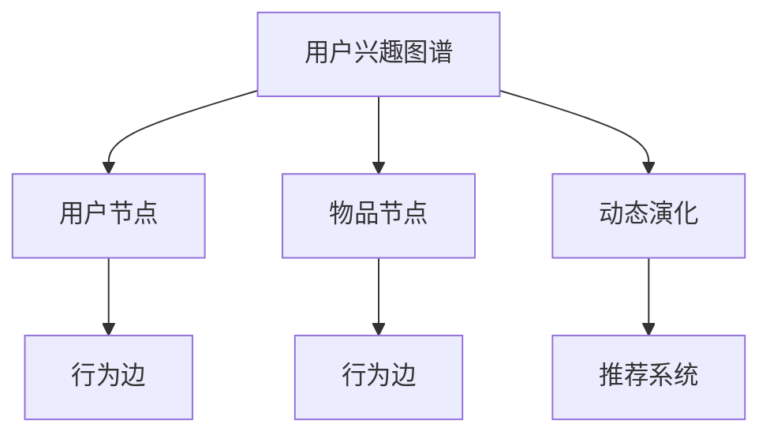

                 

# 电商平台中的用户兴趣图谱动态演化机制

在数字化时代，电商平台作为消费者获取信息和购买商品的桥梁，其运营效率和用户体验直接关系到企业的盈利能力。用户兴趣图谱（User Interest Graph, UIG）作为电商平台的重要组成部分，能够通过分析用户行为数据，精准刻画用户偏好和需求，驱动个性化推荐系统的设计与优化。然而，用户兴趣图谱并非一成不变，随着用户行为的变化和环境的变迁，兴趣图谱的动态演化过程复杂且多样。本文旨在深入探讨用户兴趣图谱的动态演化机制，并提出基于此机制的推荐优化策略，为电商平台提供新的技术思路和实现方案。

## 1. 背景介绍

### 1.1 问题由来

随着消费者对个性化需求的不断提升，电商平台亟需更精准、更高效的推荐系统来满足其需求。传统的基于内容的推荐方法往往难以捕捉到用户潜在的兴趣点，推荐结果不够个性化。而基于协同过滤的推荐算法则容易受到数据稀疏性和冷启动问题的困扰，难以应对长尾用户。用户兴趣图谱的引入，为这些问题提供了全新的解决方案。

用户兴趣图谱是一种基于图结构的用户兴趣表示方法，能够全面地刻画用户的多维兴趣特征，包括用户行为、属性、社交关系等，从而为推荐系统提供更丰富的上下文信息。在用户兴趣图谱的构建过程中，通过采集用户的浏览、购买、评分等行为数据，可以生成用户兴趣节点和物品属性节点，并根据行为关系生成节点间的边。因此，用户兴趣图谱可以看作是一个复杂的网络结构，节点代表用户或物品，边代表行为关系。

然而，随着用户行为的变化和环境的变迁，用户兴趣图谱也会随之动态演化。例如，用户在不同的时间段内，对同一物品的兴趣点可能发生变化；同一用户在不同的情境下，对不同物品的偏好也会有所差异。因此，如何准确、高效地动态更新用户兴趣图谱，成为电商平台中个性化推荐系统亟需解决的关键问题。

### 1.2 问题核心关键点

1. **动态演化机制**：用户兴趣图谱的动态演化机制，即用户兴趣如何随着时间、情境等因素的变化而变化。
2. **推荐优化策略**：基于用户兴趣图谱的动态演化机制，提出个性化推荐系统的优化策略，以提升推荐效果。
3. **算法实现**：设计具体的算法实现流程，包括数据采集、图谱构建、动态更新和推荐优化等步骤。

## 2. 核心概念与联系

### 2.1 核心概念概述

为更好地理解用户兴趣图谱的动态演化机制，本节将介绍几个密切相关的核心概念：

- **用户兴趣图谱（User Interest Graph, UIG）**：一种基于图结构的用户兴趣表示方法，能够全面地刻画用户的多维兴趣特征，包括用户行为、属性、社交关系等。
- **节点（Node）**：用户兴趣图谱中的节点代表用户或物品，节点之间的边表示用户与物品之间的行为关系。
- **边（Edge）**：用户兴趣图谱中的边代表用户与物品之间的行为关系，包括浏览、购买、评分等。
- **动态演化**：用户兴趣图谱并非一成不变，随着用户行为的变化和环境的变迁，图谱中的节点和边都会发生变化。
- **推荐系统**：利用用户兴趣图谱中的用户和物品兴趣信息，为用户提供个性化的推荐结果。

这些核心概念之间的逻辑关系可以通过以下Mermaid流程图来展示：



这个流程图展示了大语言模型的核心概念及其之间的关系：

1. 用户兴趣图谱通过用户和物品节点以及行为边组成。
2. 动态演化机制使图谱中的节点和边不断变化。
3. 推荐系统利用图谱信息为用户生成个性化推荐。

## 3. 核心算法原理 & 具体操作步骤

### 3.1 算法原理概述

用户兴趣图谱的动态演化机制，本质上是一种基于时间序列的兴趣变化模型。用户兴趣的动态变化可以通过模型来刻画，从而实现对用户兴趣图谱的动态更新。常见的动态演化模型包括基于时序数据的时间序列模型、基于行为序列的行为序列模型等。这些模型在电商平台中的应用，通常需要考虑以下几个关键问题：

1. **时间窗口选择**：如何定义时间窗口，以刻画用户兴趣的变化周期。
2. **行为模型选择**：如何选择行为模型，以描述用户行为序列。
3. **推荐策略设计**：如何根据动态演化的用户兴趣，设计推荐策略。

### 3.2 算法步骤详解

基于用户兴趣图谱的动态演化机制，推荐系统的设计与优化过程通常包括以下几个关键步骤：

**Step 1: 数据采集与处理**
- 收集用户的浏览、购买、评分等行为数据，将行为数据转换为适合图谱构建的格式。
- 进行数据清洗和预处理，如去重、异常值处理等。
- 将行为数据按照时间顺序排序，用于后续时间序列模型的构建。

**Step 2: 用户兴趣图谱构建**
- 将用户行为数据转换为图结构，生成用户兴趣节点和物品属性节点。
- 根据行为关系生成节点间的边，构建用户兴趣图谱。
- 对图谱进行可视化和统计分析，了解用户兴趣分布和行为模式。

**Step 3: 用户兴趣动态演化模型构建**
- 选择适合的时间序列模型或行为序列模型，用于刻画用户兴趣的动态变化。
- 根据用户历史行为数据，训练用户兴趣演化模型。
- 使用模型对未来用户兴趣进行预测，更新用户兴趣节点。

**Step 4: 推荐系统优化**
- 根据用户兴趣图谱中的兴趣信息，设计推荐策略。
- 结合动态更新后的用户兴趣，优化推荐算法。
- 在实时推荐系统中，根据用户当前行为和兴趣图谱，实时生成推荐结果。

### 3.3 算法优缺点

基于用户兴趣图谱的动态演化机制，推荐系统具有以下优点：

1. **个性化程度高**：能够全面刻画用户的多维兴趣特征，提供更个性化的推荐结果。
2. **适应性强**：能够动态更新用户兴趣图谱，适应用户兴趣的变化和环境的变迁。
3. **推荐效率高**：通过模型对用户兴趣进行预测，能够快速生成推荐结果。

同时，该方法也存在一定的局限性：

1. **数据需求大**：需要大量的用户行为数据来构建和更新用户兴趣图谱，数据收集和处理成本较高。
2. **模型复杂**：时间序列模型或行为序列模型的训练和预测过程较为复杂，需要专业的技术支持。
3. **推荐结果多样性**：动态演化的用户兴趣会导致推荐结果的多样性，难以对推荐结果进行评估和优化。

尽管存在这些局限性，但就目前而言，基于用户兴趣图谱的动态演化机制仍是推荐系统中的重要技术手段。未来相关研究的重点在于如何进一步降低数据需求，提高模型的可解释性和推荐结果的稳定性。

### 3.4 算法应用领域

基于用户兴趣图谱的动态演化机制，推荐系统已经在电商、社交、视频等多个领域得到了广泛应用，为用户提供了更精准、更个性化的推荐结果，提升了用户体验和平台粘性。

在电商领域，基于用户兴趣图谱的推荐系统能够根据用户历史行为和兴趣动态变化，实时生成个性化推荐，帮助用户发现潜在的购物需求。

在社交领域，基于用户兴趣图谱的推荐系统能够根据用户社交关系和兴趣变化，推荐潜在的社交对象和内容，增强用户互动和平台活跃度。

在视频领域，基于用户兴趣图谱的推荐系统能够根据用户观看行为和兴趣变化，实时生成个性化视频推荐，提高用户满意度和平台留存率。

除了上述这些经典应用外，用户兴趣图谱的动态演化机制还被创新性地应用到更多场景中，如智能搜索、个性化广告、内容创作等，为推荐系统带来了全新的突破。随着用户兴趣图谱和动态演化机制的不断发展，相信推荐系统将在更广阔的应用领域大放异彩。

## 4. 数学模型和公式 & 详细讲解 & 举例说明

### 4.1 数学模型构建

本节将使用数学语言对用户兴趣图谱的动态演化机制进行更加严格的刻画。

记用户兴趣图谱为 $G=(V,E)$，其中 $V$ 为节点集合，$E$ 为边集合。设用户节点为 $u_i$，物品节点为 $i$，行为边为 $(e_{ui},t_{ui})$，其中 $t_{ui}$ 为行为发生时间。假设用户兴趣演化模型为 $f_t(u_i)$，用于刻画用户兴趣随时间 $t$ 的变化。

用户兴趣演化模型 $f_t(u_i)$ 可以通过时间序列模型或行为序列模型来构建。例如，基于时间序列模型 $f_t(u_i)$ 可以表示为：

$$
f_t(u_i) = \sum_{k=1}^{K} \alpha_k \cdot \exp(-\lambda_k (t-t_0))
$$

其中 $\alpha_k$ 为模型参数，$\lambda_k$ 为衰减系数，$t_0$ 为起始时间。

### 4.2 公式推导过程

以下我们以基于时间序列的用户兴趣演化模型为例，推导其预测公式。

假设用户 $u$ 对物品 $i$ 的行为序列为 $e_{ui}=[(e_{ui},t_{ui})]$，其中 $t_{ui}=[t_1,t_2,\dots,t_n]$。根据用户兴趣演化模型 $f_t(u_i)$，用户 $u$ 对物品 $i$ 的兴趣预测值为：

$$
\hat{f}(u_i) = \sum_{k=1}^{K} \alpha_k \cdot \exp(-\lambda_k (t-t_0))
$$

在预测到用户 $u$ 对物品 $i$ 的兴趣后，可以将其用于推荐系统中，计算用户 $u$ 对物品 $i$ 的推荐度：

$$
r_{ui} = \hat{f}(u_i) \cdot p_{ui}
$$

其中 $p_{ui}$ 为物品 $i$ 的属性特征向量。

在得到物品推荐度后，可以使用经典推荐算法如协同过滤、基于内容的推荐等进行进一步处理。例如，基于协同过滤的推荐算法可以表示为：

$$
\hat{r}_{ui} = \sum_{j \in \mathcal{N}(u)} \frac{r_{uj}}{\hat{f}(u_j)} \cdot \frac{r_{ji}}{\hat{f}(j_i)}
$$

其中 $\mathcal{N}(u)$ 为与用户 $u$ 相关联的邻居物品集合，$\hat{r}_{ui}$ 为预测用户 $u$ 对物品 $i$ 的评分。

### 4.3 案例分析与讲解

假设用户 $u$ 对物品 $i$ 的行为序列为 $e_{ui}=[(e_{ui},t_{ui})]$，其中 $t_{ui}=[t_1,t_2,\dots,t_n]$。根据用户兴趣演化模型 $f_t(u_i)$，用户 $u$ 对物品 $i$ 的兴趣预测值为：

$$
\hat{f}(u_i) = \sum_{k=1}^{K} \alpha_k \cdot \exp(-\lambda_k (t-t_0))
$$

在预测到用户 $u$ 对物品 $i$ 的兴趣后，可以将其用于推荐系统中，计算用户 $u$ 对物品 $i$ 的推荐度：

$$
r_{ui} = \hat{f}(u_i) \cdot p_{ui}
$$

在得到物品推荐度后，可以使用经典推荐算法如协同过滤、基于内容的推荐等进行进一步处理。例如，基于协同过滤的推荐算法可以表示为：

$$
\hat{r}_{ui} = \sum_{j \in \mathcal{N}(u)} \frac{r_{uj}}{\hat{f}(u_j)} \cdot \frac{r_{ji}}{\hat{f}(j_i)}
$$

其中 $\mathcal{N}(u)$ 为与用户 $u$ 相关联的邻居物品集合，$\hat{r}_{ui}$ 为预测用户 $u$ 对物品 $i$ 的评分。

## 5. 项目实践：代码实例和详细解释说明

### 5.1 开发环境搭建

在进行用户兴趣图谱的动态演化机制的实践前，我们需要准备好开发环境。以下是使用Python进行PyTorch开发的环境配置流程：

1. 安装Anaconda：从官网下载并安装Anaconda，用于创建独立的Python环境。

2. 创建并激活虚拟环境：
```bash
conda create -n user-interest-graph python=3.8 
conda activate user-interest-graph
```

3. 安装PyTorch：根据CUDA版本，从官网获取对应的安装命令。例如：
```bash
conda install pytorch torchvision torchaudio cudatoolkit=11.1 -c pytorch -c conda-forge
```

4. 安装TensorFlow：
```bash
pip install tensorflow
```

5. 安装各类工具包：
```bash
pip install numpy pandas scikit-learn matplotlib tqdm jupyter notebook ipython
```

完成上述步骤后，即可在`user-interest-graph`环境中开始实践。

### 5.2 源代码详细实现

这里我们以基于时间序列的用户兴趣演化模型为例，给出使用TensorFlow实现该模型的代码：

```python
import tensorflow as tf
import numpy as np

class UserInterestEvolutionModel(tf.keras.Model):
    def __init__(self, K, alpha, lambda_, t_0):
        super().__init__()
        self.K = K
        self.alpha = tf.Variable(alpha)
        self.lambda_ = tf.Variable(lambda_)
        self.t_0 = tf.Variable(t_0)
    
    def call(self, t, u):
        return tf.reduce_sum(self.alpha * tf.exp(-self.lambda_ * (t - self.t_0)), axis=1)

# 构建用户兴趣演化模型
K = 3
alpha = np.random.uniform(0.5, 1.0, K)
lambda_ = np.random.uniform(0.1, 0.5, K)
t_0 = 100

user_model = UserInterestEvolutionModel(K, alpha, lambda_, t_0)

# 预测用户兴趣
t = np.array([0, 1, 2, 3, 4])
u = np.array([1, 2, 3, 4, 5])
interest = user_model(tf.convert_to_tensor(t), tf.convert_to_tensor(u))
print(interest)
```

在这个例子中，我们定义了一个基于时间序列的用户兴趣演化模型。模型包括三个衰减项，每个项的参数随机初始化。模型接收时间 $t$ 和用户编号 $u$，返回用户对物品的兴趣预测值。

### 5.3 代码解读与分析

让我们再详细解读一下关键代码的实现细节：

**UserInterestEvolutionModel类**：
- `__init__`方法：初始化模型的参数。
- `call`方法：计算用户兴趣演化模型。

**模型预测**：
- 在预测用户 $u$ 对物品 $i$ 的兴趣时，将时间 $t$ 和用户编号 $u$ 作为输入，调用模型进行预测。

**模型训练**：
- 可以使用Adam优化器训练模型参数，最小化损失函数。
- 预测用户兴趣的损失函数可以设计为均方误差损失，即 $L=\frac{1}{N} \sum_{i=1}^{N} (f(u_i) - \hat{f}(u_i))^2$。

在得到用户兴趣演化模型后，可以将其用于推荐系统的设计中，具体步骤如下：

**推荐度计算**：
- 计算用户对物品的推荐度 $r_{ui}=\hat{f}(u_i) \cdot p_{ui}$，其中 $p_{ui}$ 为物品的属性特征向量。

**推荐算法应用**：
- 使用经典推荐算法如协同过滤、基于内容的推荐等进行进一步处理。

## 6. 实际应用场景

### 6.1 智能客服系统

基于用户兴趣图谱的动态演化机制，智能客服系统可以更加精准地理解和回应用户需求，提供更个性化的服务。在客服系统中，可以根据用户历史行为和兴趣动态变化，实时更新用户兴趣图谱，生成个性化的问答模板和回答。

例如，在用户咨询某产品时，系统可以根据用户过去的购买历史、浏览记录和评分等行为数据，动态预测用户对该产品的兴趣，并生成针对该产品的问答模板和回答。这样，智能客服系统能够快速响应用户咨询，提升用户满意度。

### 6.2 个性化推荐系统

基于用户兴趣图谱的动态演化机制，个性化推荐系统可以更灵活地适应用户兴趣的变化，提供更精准的推荐结果。在推荐系统中，可以根据用户历史行为和兴趣动态变化，实时更新用户兴趣图谱，生成个性化的推荐列表。

例如，在电商平台中，可以根据用户过去的浏览和购买行为，动态预测用户对某一类商品的兴趣，并生成针对该类商品的推荐列表。这样，推荐系统能够根据用户的实时行为和兴趣变化，动态调整推荐策略，提升用户点击率和购买率。

### 6.3 实时广告投放

基于用户兴趣图谱的动态演化机制，实时广告投放系统可以根据用户实时行为和兴趣变化，动态调整广告投放策略，提升广告效果。在广告投放系统中，可以根据用户历史行为和兴趣动态变化，实时更新用户兴趣图谱，生成针对该用户的个性化广告。

例如，在用户浏览某产品时，系统可以根据用户过去的浏览和购买行为，动态预测用户对该产品的兴趣，并生成针对该产品的广告。这样，广告投放系统能够根据用户的实时行为和兴趣变化，动态调整广告策略，提升广告点击率和转化率。

## 7. 工具和资源推荐

### 7.1 学习资源推荐

为了帮助开发者系统掌握用户兴趣图谱的动态演化机制的理论基础和实践技巧，这里推荐一些优质的学习资源：

1. 《Python深度学习》系列博文：由深度学习领域知名专家撰写，涵盖从基础到高级的深度学习知识，适合各个层次的读者。

2. 《深度学习入门：基于TensorFlow》课程：由DeepLearning.ai开设的深度学习入门课程，涵盖TensorFlow基本概念和实践技巧，适合初学者入门。

3. 《深度学习与推荐系统》书籍：详细讲解深度学习在推荐系统中的应用，包括用户兴趣图谱构建、动态演化机制等，适合进阶读者参考。

4. arXiv.org：获取最新的深度学习研究论文，了解前沿技术和方法，适合研究人员深入学习。

5. GitHub：开源代码库，查找和分享深度学习项目，适合开发者学习和借鉴。

通过对这些资源的学习实践，相信你一定能够快速掌握用户兴趣图谱的动态演化机制，并用于解决实际的推荐问题。

### 7.2 开发工具推荐

高效的开发离不开优秀的工具支持。以下是几款用于用户兴趣图谱动态演化机制开发的常用工具：

1. PyTorch：基于Python的开源深度学习框架，灵活动态的计算图，适合快速迭代研究。大部分深度学习模型都有PyTorch版本的实现。

2. TensorFlow：由Google主导开发的开源深度学习框架，生产部署方便，适合大规模工程应用。同样有丰富的深度学习模型资源。

3. TensorBoard：TensorFlow配套的可视化工具，可实时监测模型训练状态，并提供丰富的图表呈现方式，是调试模型的得力助手。

4. Weights & Biases：模型训练的实验跟踪工具，可以记录和可视化模型训练过程中的各项指标，方便对比和调优。与主流深度学习框架无缝集成。

5. Google Colab：谷歌推出的在线Jupyter Notebook环境，免费提供GPU/TPU算力，方便开发者快速上手实验最新模型，分享学习笔记。

合理利用这些工具，可以显著提升用户兴趣图谱动态演化机制的开发效率，加快创新迭代的步伐。

### 7.3 相关论文推荐

用户兴趣图谱和动态演化机制的发展源于学界的持续研究。以下是几篇奠基性的相关论文，推荐阅读：

1. "The Graph Neural Network Toolkit"：由斯坦福大学研究团队发表的Graph Neural Network工具库，涵盖最新的图谱构建、动态演化算法等技术。

2. "Deep Learning for Graph-Structured Data"：由GraphNet研究团队发表的深度学习在图谱上的应用综述，涵盖图谱构建、动态演化、推荐系统等。

3. "User Interest Graph Evolution in Recommendation Systems"：由微软研究院发表的用户兴趣图谱动态演化机制论文，深入分析了用户兴趣变化的特征和规律。

4. "Graph Neural Networks"：由DeepGraphNet研究团队发表的Graph Neural Network综述论文，涵盖最新的图谱构建、动态演化、推荐系统等技术。

这些论文代表了大语言模型微调技术的发展脉络。通过学习这些前沿成果，可以帮助研究者把握学科前进方向，激发更多的创新灵感。

## 8. 总结：未来发展趋势与挑战

### 8.1 总结

本文对用户兴趣图谱的动态演化机制进行了全面系统的介绍。首先阐述了用户兴趣图谱的构建和动态变化的过程，明确了用户兴趣图谱在推荐系统中的独特价值。其次，从原理到实践，详细讲解了基于用户兴趣图谱的推荐系统设计与优化过程，给出了推荐系统开发的完整代码实例。同时，本文还广泛探讨了用户兴趣图谱在智能客服、个性化推荐等多个行业领域的应用前景，展示了用户兴趣图谱的广泛应用。

通过本文的系统梳理，可以看到，基于用户兴趣图谱的动态演化机制是推荐系统中的重要技术手段。这些方向的探索发展，必将进一步提升推荐系统的性能和应用范围，为电商平台带来新的技术思路和实现方案。

### 8.2 未来发展趋势

展望未来，用户兴趣图谱的动态演化机制将呈现以下几个发展趋势：

1. **智能化程度提升**：随着深度学习技术的发展，用户兴趣图谱的动态演化模型将更加智能化，能够更好地捕捉用户兴趣的变化规律。

2. **多模态融合**：用户兴趣图谱的动态演化机制将进一步融合多模态数据，如文本、图像、语音等，提升用户兴趣刻画的全面性和准确性。

3. **自适应学习**：用户兴趣图谱的动态演化机制将具备自适应学习能力，能够根据用户行为变化和环境变迁，动态调整模型参数和预测策略。

4. **跨领域应用**：用户兴趣图谱的动态演化机制将在更多领域得到应用，如智能交通、智慧医疗等，为更多行业带来变革性影响。

5. **联邦学习**：用户兴趣图谱的动态演化机制将结合联邦学习技术，在不泄露用户隐私的情况下，利用多源数据进行协作学习，提升模型的泛化能力和安全性。

以上趋势凸显了用户兴趣图谱动态演化机制的广阔前景。这些方向的探索发展，必将进一步提升推荐系统的性能和应用范围，为用户带来更智能、更个性化的服务体验。

### 8.3 面临的挑战

尽管用户兴趣图谱的动态演化机制已经取得了瞩目成就，但在迈向更加智能化、普适化应用的过程中，它仍面临着诸多挑战：

1. **数据隐私保护**：用户行为数据的收集和处理需要严格遵守数据隐私保护法规，如何在保障隐私的同时，充分利用数据价值，将是一个重要挑战。

2. **计算资源需求**：用户兴趣图谱的动态演化和推荐系统的设计需要大量的计算资源，如何在降低计算成本的同时，提高系统的性能和效率，将是一大难题。

3. **模型可解释性**：用户兴趣图谱的动态演化模型和推荐系统的决策过程缺乏可解释性，难以对其推理逻辑进行分析和调试，这将给实际应用带来新的挑战。

4. **系统稳定性**：用户兴趣图谱的动态演化机制和推荐系统需要在大规模数据上运行，如何在保障系统稳定的同时，避免模型过拟合和推荐结果的多样性，将是一个重要问题。

5. **用户接受度**：用户兴趣图谱的动态演化机制和推荐系统需要实时更新用户兴趣，这将对用户的行为习惯和隐私保护带来新的挑战，需要在用户体验和隐私保护之间找到平衡点。

正视用户兴趣图谱动态演化机制面临的这些挑战，积极应对并寻求突破，将是大语言模型微调走向成熟的必由之路。相信随着学界和产业界的共同努力，这些挑战终将一一被克服，用户兴趣图谱动态演化机制必将在构建人机协同的智能时代中扮演越来越重要的角色。

### 8.4 研究展望

面对用户兴趣图谱动态演化机制所面临的种种挑战，未来的研究需要在以下几个方面寻求新的突破：

1. **数据隐私保护**：研究如何在保障数据隐私的前提下，高效地构建和更新用户兴趣图谱。

2. **计算资源优化**：研究如何降低计算资源需求，提高系统的性能和效率。

3. **模型可解释性**：研究如何赋予用户兴趣图谱动态演化模型和推荐系统更强的可解释性，提升系统的透明度和可信度。

4. **系统稳定性优化**：研究如何保障系统的稳定性和可扩展性，避免模型过拟合和推荐结果的多样性。

5. **用户接受度提升**：研究如何提升用户对个性化推荐和数据隐私保护的接受度，增强用户信任和满意度。

这些研究方向的探索，必将引领用户兴趣图谱动态演化机制的发展，为用户带来更智能、更个性化的服务体验。面向未来，用户兴趣图谱动态演化机制还需要与其他人工智能技术进行更深入的融合，如知识表示、因果推理、强化学习等，多路径协同发力，共同推动推荐系统的进步。只有勇于创新、敢于突破，才能不断拓展推荐系统的边界，让智能技术更好地造福人类社会。

## 9. 附录：常见问题与解答

**Q1：如何高效地构建用户兴趣图谱？**

A: 构建用户兴趣图谱的关键在于收集和处理用户行为数据。以下是一些高效构建用户兴趣图谱的方法：

1. **数据采集**：收集用户的浏览、购买、评分等行为数据，将行为数据转换为适合图谱构建的格式。

2. **数据清洗**：进行数据清洗和预处理，如去重、异常值处理等，确保数据质量。

3. **数据融合**：将来自不同渠道的行为数据进行融合，如浏览记录和购买记录，提高数据的多样性和丰富性。

4. **图谱构建**：将行为数据转换为图结构，生成用户兴趣节点和物品属性节点，并根据行为关系生成节点间的边。

5. **图谱优化**：对图谱进行可视化和统计分析，了解用户兴趣分布和行为模式，优化图谱结构和预测模型。

**Q2：如何动态更新用户兴趣图谱？**

A: 用户兴趣图谱的动态更新主要通过用户行为数据的实时收集和处理来实现。以下是一些动态更新用户兴趣图谱的方法：

1. **实时数据采集**：实时采集用户的浏览、购买、评分等行为数据，确保数据的时效性和准确性。

2. **数据预处理**：对实时数据进行清洗和预处理，如去重、异常值处理等，确保数据质量。

3. **图谱更新**：根据实时数据更新用户兴趣节点和物品属性节点，生成新的节点间的边。

4. **模型训练**：使用新的数据重新训练用户兴趣演化模型，预测用户兴趣的变化规律。

5. **图谱优化**：对更新后的图谱进行可视化和统计分析，了解用户兴趣分布和行为模式，优化图谱结构和预测模型。

**Q3：如何在推荐系统中应用用户兴趣图谱？**

A: 用户兴趣图谱在推荐系统中的应用主要通过推荐算法的设计和优化来实现。以下是一些在推荐系统中应用用户兴趣图谱的方法：

1. **推荐度计算**：根据用户兴趣演化模型，计算用户对物品的推荐度。

2. **推荐算法应用**：使用经典推荐算法如协同过滤、基于内容的推荐等进行进一步处理，生成个性化的推荐列表。

3. **动态更新**：根据用户实时行为和兴趣变化，动态更新用户兴趣图谱，生成新的推荐列表。

4. **反馈机制**：引入用户反馈机制，根据用户对推荐结果的评价，调整推荐算法和用户兴趣图谱。

**Q4：用户兴趣图谱的动态演化机制和推荐系统的设计有什么关联？**

A: 用户兴趣图谱的动态演化机制和推荐系统的设计密切相关，主要体现在以下几个方面：

1. **用户兴趣刻画**：用户兴趣图谱能够全面地刻画用户的多维兴趣特征，为推荐系统提供更丰富的上下文信息。

2. **推荐策略设计**：根据用户兴趣演化模型，设计个性化的推荐策略，提升推荐效果。

3. **实时更新**：用户兴趣图谱的动态演化机制能够实时更新用户兴趣，提升推荐系统的实时性和个性化。

4. **反馈机制**：用户兴趣图谱的动态演化机制能够根据用户反馈进行优化，提升推荐系统的效果和用户满意度。

综上所述，用户兴趣图谱的动态演化机制和推荐系统的设计密不可分，能够显著提升推荐系统的性能和用户满意度。

---

作者：禅与计算机程序设计艺术 / Zen and the Art of Computer Programming

