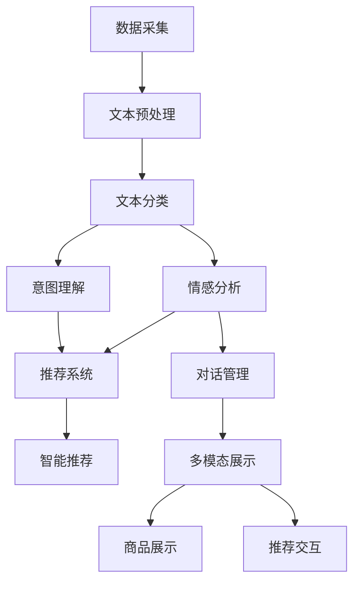

                 

# 电商平台中的自然语言处理应用实践

> 关键词：电商平台,自然语言处理,NLP,机器学习,深度学习,对话系统,客户服务,智能推荐,文本分类,情感分析

## 1. 背景介绍

### 1.1 问题由来
随着电子商务的迅猛发展，电商平台已成为消费者购物、商家销售的重要渠道。电商平台中的自然语言处理（NLP）技术，是提升用户体验、优化商家运营效率的关键手段。传统电商平台对NLP的应用主要集中在文本分类、情感分析、智能推荐等几个方面，但随着人工智能技术的发展，电商平台的NLP应用也在不断拓展和深化。例如，基于聊天机器人的客服系统、智能问答、多模态电商展示等新兴技术，已经开始逐步改变电商平台的运营模式和用户体验。

### 1.2 问题核心关键点
在电商平台中，NLP技术的应用通常需要考虑以下几个核心关键点：

- **数据质量和多样性**：电商平台的数据通常来自于多样化的用户行为，包括搜索、评论、点击、互动等。如何处理海量、多源、异构的数据，提取有用的信息，是NLP应用的基础。

- **模型泛化能力**：电商平台的用户群体广泛，不同地域、不同年龄段、不同消费习惯的用户，对产品的需求和反馈存在较大差异。因此，NLP模型需要具备较强的泛化能力，能够在不同场景下保持稳定性能。

- **实时性和响应速度**：电商平台的客服、推荐等应用，需要实时响应用户的请求，提供快速的响应速度和精准的服务。

- **安全性与隐私保护**：电商平台涉及用户的隐私信息，NLP应用需要在保护用户隐私的前提下，提供安全的交互体验。

- **多模态融合**：电商平台的商品展示、用户反馈等数据不仅仅是文本，还包括图片、视频、语音等多种形式。如何整合多模态数据，提升模型的理解和表现能力，是NLP技术在电商应用中的一个重要挑战。

这些核心关键点决定了电商平台NLP应用的发展方向和实现方式，也是本文关注的重点。

## 2. 核心概念与联系

### 2.1 核心概念概述

在电商平台中，NLP技术主要用于以下几个方面：

- **文本分类**：将电商平台中的文本数据（如商品描述、用户评论等）进行分类，如商品类别、用户情感等。
- **情感分析**：分析用户对商品、服务、售后等的情感倾向，判断其满意度。
- **智能推荐**：根据用户的历史行为和即时反馈，提供个性化推荐，提升用户购物体验。
- **对话系统**：通过聊天机器人等形式，实时回答用户问题，提供客服支持。
- **多模态展示**：结合文本、图片、视频等数据，提升商品展示和推荐的效果。

这些应用涉及的NLP技术，包括文本处理、情感识别、意图理解、推荐系统、对话管理等。

### 2.2 核心概念原理和架构的 Mermaid 流程图



这个流程图展示了电商平台NLP技术的主要应用场景及其相互关系。

- **数据采集**：获取电商平台的各类文本数据，如商品描述、用户评论、客服聊天记录等。
- **文本预处理**：对文本数据进行清洗、分词、实体识别等预处理操作，为后续应用提供基础。
- **文本分类**：将文本分为不同类别，如商品类别、用户情感等。
- **情感分析**：分析用户情感，如正面、负面、中性等。
- **意图理解**：识别用户意图，如查询商品信息、提交订单、反馈问题等。
- **推荐系统**：根据用户历史行为和即时反馈，推荐商品。
- **对话管理**：通过对话系统，实时回答用户问题，提供客服支持。
- **多模态展示**：结合文本、图片、视频等数据，提升商品展示和推荐的效果。

这些核心概念通过有机结合，形成了电商平台NLP应用的全链条解决方案。

## 3. 核心算法原理 & 具体操作步骤
### 3.1 算法原理概述

电商平台中的NLP应用主要基于机器学习和深度学习技术。其核心原理是通过构建模型，从大量标注数据中学习到文本和用户行为之间的关系，从而实现分类、推荐、对话等功能。

以文本分类为例，常见的机器学习算法包括朴素贝叶斯、逻辑回归、支持向量机等，而深度学习算法则包括卷积神经网络（CNN）、循环神经网络（RNN）、长短期记忆网络（LSTM）、Transformer等。其中，Transformer结构以其优异的序列建模能力，在NLP领域取得了广泛应用，尤其是在大规模预训练语言模型的基础上，可以显著提升模型的效果。

### 3.2 算法步骤详解

基于深度学习的NLP应用，通常包括以下几个关键步骤：

**Step 1: 数据准备**

- 收集电商平台的各类文本数据，如商品描述、用户评论、客服聊天记录等。
- 对数据进行清洗、分词、实体识别等预处理操作。
- 将数据分为训练集、验证集和测试集，用于模型训练和评估。

**Step 2: 模型构建**

- 选择合适的预训练语言模型（如BERT、GPT等），作为模型初始化参数。
- 设计模型的输入和输出，如文本分类模型输入为文本序列，输出为类别概率分布。
- 选择适当的模型结构和优化器，如Transformer结构、AdamW优化器等。

**Step 3: 模型训练**

- 使用训练集数据，通过反向传播算法更新模型参数，最小化损失函数。
- 在验证集上评估模型性能，根据性能指标调整模型超参数。
- 使用测试集进行最终评估，确定模型的预测性能。

**Step 4: 模型部署**

- 将训练好的模型部署到实际应用环境中，如电商平台客服、推荐系统等。
- 集成数据接口，实时接收用户输入，进行推理预测。
- 监控模型性能，及时调整模型参数，保持模型效果。

### 3.3 算法优缺点

基于深度学习的NLP应用具有以下优点：

- **准确率高**：深度学习模型可以通过大量标注数据进行训练，具备较强的泛化能力，能够在不同的应用场景中取得较高的准确率。
- **可解释性强**：通过可视化技术，可以解释模型内部机制，理解其推理过程。
- **适应性强**：深度学习模型可以结合多种数据类型，如文本、图片、视频等，提升应用的多样性和丰富性。

同时，深度学习模型也存在以下缺点：

- **计算资源需求高**：深度学习模型通常需要较大的计算资源，包括高性能的GPU/TPU设备。
- **模型训练时间长**：深度学习模型需要大量的训练数据和计算时间，模型训练过程较长。
- **模型可解释性不足**：深度学习模型通常被视为“黑盒”模型，难以解释其内部决策机制。

### 3.4 算法应用领域

电商平台中的NLP应用，主要应用于以下几个领域：

- **客服系统**：通过聊天机器人等形式，实时回答用户问题，提供客服支持。
- **推荐系统**：根据用户历史行为和即时反馈，提供个性化推荐，提升用户购物体验。
- **商品评价**：分析用户对商品、服务、售后等的情感倾向，判断其满意度。
- **广告投放**：通过情感分析等技术，提升广告的投放效果和转化率。
- **市场分析**：利用文本分类、情感分析等技术，分析市场趋势和用户需求，指导商家运营决策。

## 4. 数学模型和公式 & 详细讲解 & 举例说明

### 4.1 数学模型构建

以文本分类为例，假设模型输入为文本序列 $X$，输出为类别 $y$，模型的参数为 $\theta$，则文本分类任务可以表示为：

$$
P(y|X;\theta) = \frac{e^{\theta^T f(X)}}{\sum_{k=1}^K e^{\theta_k^T f(X)}}
$$

其中 $f(X)$ 为文本特征提取函数，$\theta$ 为模型参数，$K$ 为类别数。

模型训练的目标是最小化交叉熵损失函数：

$$
\mathcal{L}(\theta) = -\frac{1}{N} \sum_{i=1}^N \sum_{k=1}^K y_{ik} \log P(y_{ik}|X_i;\theta)
$$

### 4.2 公式推导过程

以情感分析为例，假设模型输入为文本序列 $X$，输出为情感极性 $y$，模型的参数为 $\theta$，则情感分析任务可以表示为：

$$
P(y|X;\theta) = \frac{e^{\theta^T g(X)}}{\sum_{k=1}^K e^{\theta_k^T g(X)}}
$$

其中 $g(X)$ 为文本特征提取函数，$\theta$ 为模型参数，$K$ 为情感极性数。

模型训练的目标是最小化交叉熵损失函数：

$$
\mathcal{L}(\theta) = -\frac{1}{N} \sum_{i=1}^N \sum_{k=1}^K y_{ik} \log P(y_{ik}|X_i;\theta)
$$

### 4.3 案例分析与讲解

以推荐系统为例，假设模型输入为用户历史行为 $X$ 和即时反馈 $Y$，输出为商品推荐 $R$，模型的参数为 $\theta$，则推荐任务可以表示为：

$$
P(R|X,Y;\theta) = \frac{e^{\theta^T h(X,Y)}}{\sum_{r=1}^R e^{\theta_r^T h(X,Y)}}
$$

其中 $h(X,Y)$ 为历史行为和即时反馈的特征提取函数，$\theta$ 为模型参数，$R$ 为商品推荐数。

模型训练的目标是最小化交叉熵损失函数：

$$
\mathcal{L}(\theta) = -\frac{1}{N} \sum_{i=1}^N \sum_{r=1}^R y_{ir} \log P(r|X_i,Y_i;\theta)
$$

## 5. 项目实践：代码实例和详细解释说明
### 5.1 开发环境搭建

在进行NLP项目实践前，需要先准备好开发环境。以下是使用Python进行PyTorch开发的环境配置流程：

1. 安装Anaconda：从官网下载并安装Anaconda，用于创建独立的Python环境。

2. 创建并激活虚拟环境：
```bash
conda create -n nlp-env python=3.8 
conda activate nlp-env
```

3. 安装PyTorch：根据CUDA版本，从官网获取对应的安装命令。例如：
```bash
conda install pytorch torchvision torchaudio cudatoolkit=11.1 -c pytorch -c conda-forge
```

4. 安装Transformers库：
```bash
pip install transformers
```

5. 安装各类工具包：
```bash
pip install numpy pandas scikit-learn matplotlib tqdm jupyter notebook ipython
```

完成上述步骤后，即可在`nlp-env`环境中开始NLP实践。

### 5.2 源代码详细实现

下面我们以电商平台的智能推荐系统为例，给出使用Transformers库进行推荐模型的PyTorch代码实现。

首先，定义推荐模型的数据处理函数：

```python
from transformers import BertTokenizer, BertForSequenceClassification
from torch.utils.data import Dataset, DataLoader
import torch

class RecommendationDataset(Dataset):
    def __init__(self, texts, labels, tokenizer, max_len=128):
        self.texts = texts
        self.labels = labels
        self.tokenizer = tokenizer
        self.max_len = max_len
        
    def __len__(self):
        return len(self.texts)
    
    def __getitem__(self, item):
        text = self.texts[item]
        label = self.labels[item]
        
        encoding = self.tokenizer(text, return_tensors='pt', max_length=self.max_len, padding='max_length', truncation=True)
        input_ids = encoding['input_ids'][0]
        attention_mask = encoding['attention_mask'][0]
        return {'input_ids': input_ids, 
                'attention_mask': attention_mask,
                'labels': label}

# 加载预训练的BERT模型
model = BertForSequenceClassification.from_pretrained('bert-base-cased', num_labels=2)

# 定义优化器和学习率
optimizer = torch.optim.Adam(model.parameters(), lr=2e-5)

# 定义训练和评估函数
device = torch.device('cuda') if torch.cuda.is_available() else torch.device('cpu')
model.to(device)

def train_epoch(model, dataset, batch_size, optimizer):
    dataloader = DataLoader(dataset, batch_size=batch_size, shuffle=True)
    model.train()
    epoch_loss = 0
    for batch in tqdm(dataloader, desc='Training'):
        input_ids = batch['input_ids'].to(device)
        attention_mask = batch['attention_mask'].to(device)
        labels = batch['labels'].to(device)
        model.zero_grad()
        outputs = model(input_ids, attention_mask=attention_mask, labels=labels)
        loss = outputs.loss
        epoch_loss += loss.item()
        loss.backward()
        optimizer.step()
    return epoch_loss / len(dataloader)

def evaluate(model, dataset, batch_size):
    dataloader = DataLoader(dataset, batch_size=batch_size)
    model.eval()
    preds, labels = [], []
    with torch.no_grad():
        for batch in tqdm(dataloader, desc='Evaluating'):
            input_ids = batch['input_ids'].to(device)
            attention_mask = batch['attention_mask'].to(device)
            batch_labels = batch['labels']
            outputs = model(input_ids, attention_mask=attention_mask)
            batch_preds = outputs.logits.argmax(dim=2).to('cpu').tolist()
            batch_labels = batch_labels.to('cpu').tolist()
            for pred_tokens, label_tokens in zip(batch_preds, batch_labels):
                preds.append(pred_tokens[:len(label_tokens)])
                labels.append(label_tokens)
                
    print(classification_report(labels, preds))
```

然后，定义训练和评估流程：

```python
epochs = 5
batch_size = 16

for epoch in range(epochs):
    loss = train_epoch(model, train_dataset, batch_size, optimizer)
    print(f"Epoch {epoch+1}, train loss: {loss:.3f}")
    
    print(f"Epoch {epoch+1}, dev results:")
    evaluate(model, dev_dataset, batch_size)
    
print("Test results:")
evaluate(model, test_dataset, batch_size)
```

以上就是使用PyTorch对BERT进行智能推荐系统微调的完整代码实现。可以看到，通过利用Transformers库，我们可以用相对简洁的代码完成BERT模型的加载和微调。

### 5.3 代码解读与分析

让我们再详细解读一下关键代码的实现细节：

**RecommendationDataset类**：
- `__init__`方法：初始化文本、标签、分词器等关键组件。
- `__len__`方法：返回数据集的样本数量。
- `__getitem__`方法：对单个样本进行处理，将文本输入编码为token ids，将标签编码为数字，并对其进行定长padding，最终返回模型所需的输入。

**model变量**：
- 加载预训练的BERT模型，作为微调模型的初始化参数。

**optimizer变量**：
- 定义优化器和初始学习率，用于更新模型参数。

**train_epoch函数**：
- 使用DataLoader对数据集进行批次化加载，供模型训练使用。
- 在每个批次上前向传播计算loss并反向传播更新模型参数，最后返回该epoch的平均loss。

**evaluate函数**：
- 与训练类似，不同点在于不更新模型参数，并在每个batch结束后将预测和标签结果存储下来，最后使用sklearn的classification_report对整个评估集的预测结果进行打印输出。

**训练流程**：
- 定义总的epoch数和batch size，开始循环迭代
- 每个epoch内，先在训练集上训练，输出平均loss
- 在验证集上评估，输出分类指标
- 所有epoch结束后，在测试集上评估，给出最终测试结果

可以看到，PyTorch配合Transformers库使得BERT微调的代码实现变得简洁高效。开发者可以将更多精力放在数据处理、模型改进等高层逻辑上，而不必过多关注底层的实现细节。

当然，工业级的系统实现还需考虑更多因素，如模型的保存和部署、超参数的自动搜索、更灵活的任务适配层等。但核心的微调范式基本与此类似。

## 6. 实际应用场景
### 6.1 智能客服系统

智能客服系统是电商平台中应用最为广泛的NLP技术之一。传统客服往往需要配备大量人力，高峰期响应缓慢，且一致性和专业性难以保证。而使用智能客服系统，可以显著提升客服效率和质量，降低人力成本。

在技术实现上，可以收集用户的历史客服记录，将问题-回答对作为监督数据，在此基础上对预训练模型进行微调。微调后的模型能够自动理解用户意图，匹配最合适的回答。对于用户提出的新问题，还可以接入检索系统实时搜索相关内容，动态组织生成回答。如此构建的智能客服系统，能大幅提升客户咨询体验和问题解决效率。

### 6.2 商品推荐系统

推荐系统是电商平台的另一个核心功能，通过智能推荐，提升用户体验和销售额。传统的推荐系统主要依赖用户的点击、浏览、购买等行为数据，而使用NLP技术，可以结合用户的文本反馈，进行更精准的推荐。

在实际应用中，可以收集用户对商品、服务的评论和评分，利用情感分析技术判断用户的情感倾向。结合用户的行为数据，微调预训练语言模型，输出商品推荐列表。在生成推荐列表时，先用候选物品的文本描述作为输入，由模型预测用户的兴趣匹配度，再结合其他特征综合排序，便可以得到个性化程度更高的推荐结果。

### 6.3 商品评价分析

商品评价分析是电商平台中的重要应用，通过分析用户对商品、服务、售后等的情感倾向，可以判断其满意度。传统的评价分析主要依赖人工标注，而使用NLP技术，可以自动处理大量评论数据，提升效率和准确性。

在实际应用中，可以收集用户对商品、服务的评论文本，利用情感分析技术判断用户的情感倾向。结合用户的购买行为数据，微调预训练语言模型，输出商品的情感评分和趋势分析。利用可视化工具展示情感评分和趋势变化，帮助商家优化产品和服务，提升用户体验。

### 6.4 市场分析

市场分析是电商平台中的高级应用，通过分析用户对商品、服务、售后等的情感倾向，可以判断市场趋势和用户需求。传统的市场分析主要依赖人工调研，而使用NLP技术，可以自动处理大量评论数据，提升效率和准确性。

在实际应用中，可以收集用户对商品、服务的评论文本，利用情感分析技术判断用户的情感倾向。结合用户的购买行为数据，微调预训练语言模型，输出市场的情感评分和趋势分析。利用可视化工具展示情感评分和趋势变化，帮助商家制定营销策略，提升市场竞争力。

## 7. 工具和资源推荐
### 7.1 学习资源推荐

为了帮助开发者系统掌握NLP技术，这里推荐一些优质的学习资源：

1. 《自然语言处理综论》（周志华）：系统介绍了NLP的基本概念和经典算法，适合初学者入门。
2. 《深度学习》（Goodfellow et al.）：深入讲解了深度学习的基本原理和应用，是NLP技术的理论基础。
3. 《Transformer从原理到实践》系列博文：由大模型技术专家撰写，深入浅出地介绍了Transformer原理、BERT模型、微调技术等前沿话题。
4. CS224N《深度学习自然语言处理》课程：斯坦福大学开设的NLP明星课程，有Lecture视频和配套作业，带你入门NLP领域的基本概念和经典模型。
5. HuggingFace官方文档：提供丰富的预训练语言模型和微调样例代码，是进行NLP任务开发的必备资料。

通过对这些资源的学习实践，相信你一定能够快速掌握NLP技术的精髓，并用于解决实际的NLP问题。

### 7.2 开发工具推荐

高效的开发离不开优秀的工具支持。以下是几款用于NLP开发的常用工具：

1. PyTorch：基于Python的开源深度学习框架，灵活动态的计算图，适合快速迭代研究。大部分预训练语言模型都有PyTorch版本的实现。
2. TensorFlow：由Google主导开发的开源深度学习框架，生产部署方便，适合大规模工程应用。同样有丰富的预训练语言模型资源。
3. Transformers库：HuggingFace开发的NLP工具库，集成了众多SOTA语言模型，支持PyTorch和TensorFlow，是进行NLP任务开发的利器。
4. Weights & Biases：模型训练的实验跟踪工具，可以记录和可视化模型训练过程中的各项指标，方便对比和调优。与主流深度学习框架无缝集成。
5. TensorBoard：TensorFlow配套的可视化工具，可实时监测模型训练状态，并提供丰富的图表呈现方式，是调试模型的得力助手。

合理利用这些工具，可以显著提升NLP开发的效率，加快创新迭代的步伐。

### 7.3 相关论文推荐

NLP技术的发展源于学界的持续研究。以下是几篇奠基性的相关论文，推荐阅读：

1. Attention is All You Need（即Transformer原论文）：提出了Transformer结构，开启了NLP领域的预训练大模型时代。
2. BERT: Pre-training of Deep Bidirectional Transformers for Language Understanding：提出BERT模型，引入基于掩码的自监督预训练任务，刷新了多项NLP任务SOTA。
3. Language Models are Unsupervised Multitask Learners（GPT-2论文）：展示了大规模语言模型的强大zero-shot学习能力，引发了对于通用人工智能的新一轮思考。
4. Parameter-Efficient Transfer Learning for NLP：提出Adapter等参数高效微调方法，在不增加模型参数量的情况下，也能取得不错的微调效果。
5. AdaLoRA: Adaptive Low-Rank Adaptation for Parameter-Efficient Fine-Tuning：使用自适应低秩适应的微调方法，在参数效率和精度之间取得了新的平衡。
6. SpanBERT: Extending Pre-trained Language Model for Natural Language Inference：在BERT的基础上，增加了SpanBERT技术，提高了自然语言推理任务的性能。

这些论文代表了大语言模型微调技术的发展脉络。通过学习这些前沿成果，可以帮助研究者把握学科前进方向，激发更多的创新灵感。

## 8. 总结：未来发展趋势与挑战

### 8.1 总结

本文对电商平台中的NLP应用进行了全面系统的介绍。首先阐述了NLP技术在电商平台中的重要性和应用场景，明确了NLP应用的发展方向和实现方式。其次，从原理到实践，详细讲解了NLP模型的构建和训练方法，给出了NLP任务开发的完整代码实例。同时，本文还探讨了NLP技术在电商平台中的应用场景，展示了NLP技术的强大潜力和应用前景。

通过本文的系统梳理，可以看到，NLP技术在电商平台中的应用已经得到了广泛实践，成为提升用户体验、优化商家运营效率的关键手段。未来，随着NLP技术的不断进步，电商平台中的NLP应用也将迎来新的突破，为电商平台的数字化转型和智能化升级提供新的技术路径。

### 8.2 未来发展趋势

展望未来，NLP技术在电商平台中的应用将呈现以下几个发展趋势：

1. **多模态融合**：电商平台的商品展示、用户反馈等数据不仅仅是文本，还包括图片、视频、语音等多种形式。NLP技术将进一步整合多模态数据，提升模型的理解和表现能力。
2. **实时性增强**：电商平台中的NLP应用，如智能客服、推荐系统等，需要实时响应用户的请求。NLP技术将进一步提升模型的推理速度，减少响应时间。
3. **可解释性和透明性提升**：NLP技术将进一步提升模型的可解释性和透明性，帮助用户理解模型决策过程，增强信任感。
4. **跨领域迁移能力增强**：NLP技术将进一步提升模型的跨领域迁移能力，能够适应不同的应用场景，提升模型的通用性。
5. **个性化推荐和定制化服务**：NLP技术将进一步提升个性化推荐和定制化服务的能力，提升用户体验。
6. **数据隐私和安全保护**：电商平台中的NLP应用需要保护用户隐私，NLP技术将进一步提升数据隐私和安全保护的能力。

### 8.3 面临的挑战

尽管NLP技术在电商平台中取得了显著成果，但在实际应用中也面临一些挑战：

1. **数据质量和多样性**：电商平台的数据通常来自于多样化的用户行为，不同地域、不同年龄段、不同消费习惯的用户，对产品的需求和反馈存在较大差异。如何处理海量、多源、异构的数据，提取有用的信息，是NLP应用的基础。
2. **模型泛化能力**：NLP模型需要具备较强的泛化能力，能够在不同的应用场景中保持稳定性能。
3. **实时性和响应速度**：电商平台的客服、推荐等应用，需要实时响应用户的请求，提供快速的响应速度。
4. **安全性与隐私保护**：电商平台涉及用户的隐私信息，NLP应用需要在保护用户隐私的前提下，提供安全的交互体验。
5. **多模态融合**：NLP技术需要整合多模态数据，提升模型的理解和表现能力，但多模态数据的融合存在一定的技术挑战。
6. **跨领域迁移能力**：NLP技术需要具备跨领域迁移能力，能够适应不同的应用场景，提升模型的通用性。

### 8.4 研究展望

面对NLP技术在电商平台中的应用挑战，未来的研究需要在以下几个方面寻求新的突破：

1. **数据增强和合成**：通过数据增强和合成技术，提升NLP模型的泛化能力，处理海量、多源、异构的数据。
2. **实时推理优化**：通过模型剪枝、量化加速等技术，提升NLP模型的推理速度和响应时间，满足电商平台的实时性需求。
3. **可解释性增强**：通过可视化技术、可解释性模型等方法，提升NLP模型的可解释性和透明性，帮助用户理解模型决策过程，增强信任感。
4. **跨领域迁移学习**：通过跨领域迁移学习技术，提升NLP模型的泛化能力和通用性，适应不同的应用场景。
5. **多模态融合**：通过多模态融合技术，整合文本、图片、视频、语音等多种形式的数据，提升模型的理解和表现能力。
6. **数据隐私和安全保护**：通过数据隐私保护技术，确保用户隐私信息的安全，提升NLP应用的安全性。

这些研究方向的探索，必将引领NLP技术在电商平台中的进一步发展，为电商平台的数字化转型和智能化升级提供新的技术路径。面向未来，NLP技术还需要与其他人工智能技术进行更深入的融合，如知识表示、因果推理、强化学习等，多路径协同发力，共同推动电商平台的创新发展。

## 9. 附录：常见问题与解答

**Q1：电商平台中如何构建和训练NLP模型？**

A: 构建和训练NLP模型通常包括以下几个步骤：

1. 数据收集和预处理：获取电商平台的各类文本数据，如商品描述、用户评论、客服聊天记录等，进行清洗、分词、实体识别等预处理操作。

2. 模型选择和构建：选择合适的预训练语言模型（如BERT、GPT等），作为模型初始化参数。设计模型的输入和输出，如文本分类模型输入为文本序列，输出为类别概率分布。

3. 模型训练：使用训练集数据，通过反向传播算法更新模型参数，最小化损失函数。在验证集上评估模型性能，根据性能指标调整模型超参数。

4. 模型部署和优化：将训练好的模型部署到实际应用环境中，如电商平台客服、推荐系统等。集成数据接口，实时接收用户输入，进行推理预测。监控模型性能，及时调整模型参数，保持模型效果。

**Q2：电商平台中如何提升NLP模型的泛化能力？**

A: 提升NLP模型的泛化能力，可以采取以下几种方法：

1. 数据增强：通过回译、近义替换等方式扩充训练集，提升模型的泛化能力。

2. 正则化技术：使用L2正则、Dropout、Early Stopping等技术，防止模型过拟合，提升泛化能力。

3. 多模型集成：训练多个NLP模型，取平均输出，抑制过拟合，提升泛化能力。

4. 数据增强和合成：通过数据增强和合成技术，提升NLP模型的泛化能力。

5. 跨领域迁移学习：通过跨领域迁移学习技术，提升NLP模型的泛化能力和通用性。

**Q3：电商平台中如何保护用户隐私？**

A: 电商平台中的NLP应用需要保护用户隐私，可以采取以下几种方法：

1. 数据匿名化：对用户数据进行匿名化处理，保护用户隐私。

2. 差分隐私：在数据处理过程中加入噪声，保护用户隐私。

3. 安全计算：使用安全计算技术，保护用户隐私信息。

4. 用户授权：在用户授权的前提下，收集和处理用户数据。

5. 数据访问控制：对用户数据进行严格的访问控制，确保数据安全。

**Q4：电商平台中如何提升NLP模型的推理速度？**

A: 提升NLP模型的推理速度，可以采取以下几种方法：

1. 模型剪枝：去除不必要的层和参数，减小模型尺寸，加快推理速度。

2. 量化加速：将浮点模型转为定点模型，压缩存储空间，提高计算效率。

3. 模型并行：使用模型并行技术，提升模型的推理速度。

4. 优化算法：选择高效的优化算法，提升模型的推理速度。

5. 数据缓存：使用数据缓存技术，减少模型推理的延迟。

**Q5：电商平台中如何提升NLP模型的可解释性？**

A: 提升NLP模型的可解释性，可以采取以下几种方法：

1. 可视化技术：使用可视化技术，展示模型的推理过程，增强模型的可解释性。

2. 可解释性模型：使用可解释性模型，提升模型的可解释性。

3. 文本生成技术：使用文本生成技术，展示模型的推理过程，增强模型的可解释性。

4. 特征解释：解释模型的特征选择过程，增强模型的可解释性。

5. 用户反馈：根据用户反馈，调整模型的推理过程，提升模型的可解释性。

---

作者：禅与计算机程序设计艺术 / Zen and the Art of Computer Programming

